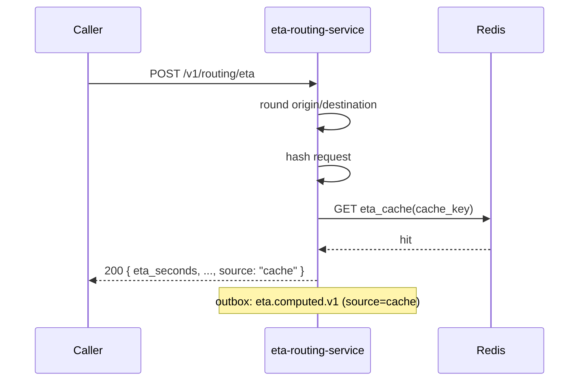
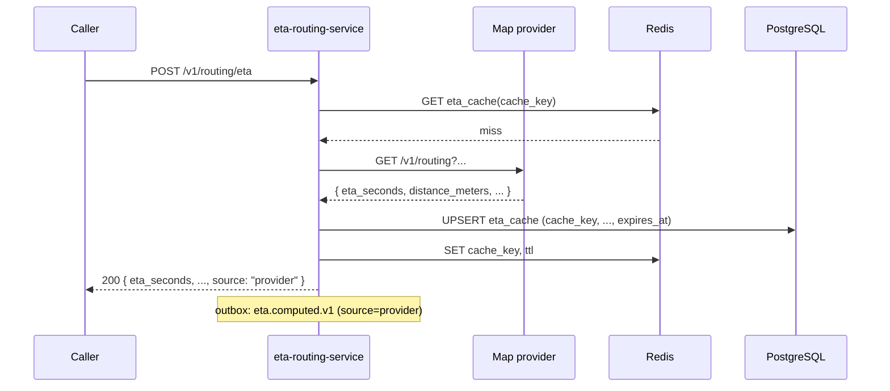
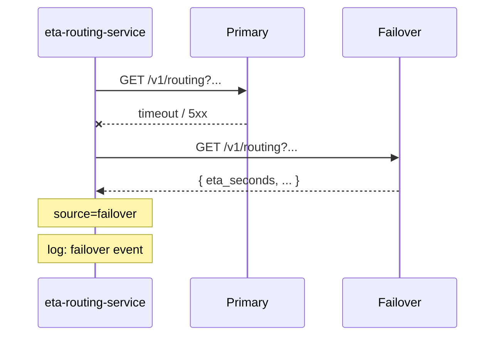
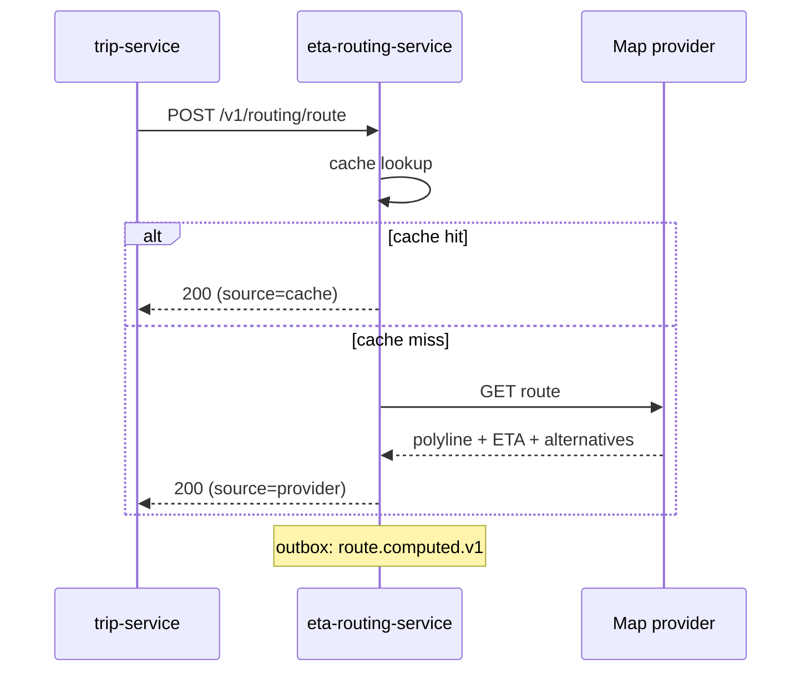
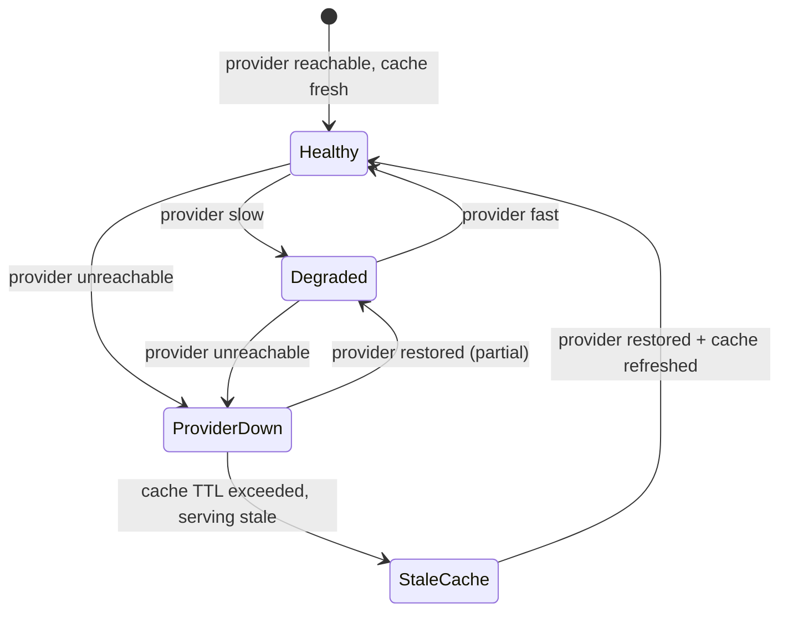

# eta-routing-service — Workflows

## 1. ETA Compute (Cache Hit)

### 1.1 Objective

Serve an ETA from the cache within 50ms.

### 1.2 Initiating Actor

Any internal service (typically `pricing-service`,
`dispatch-service`, `ride-request-service`).

### 1.3 Participating Services

- `eta-routing-service` (this service)
- Redis (the hot cache)

### 1.4 Prerequisites

- A previous compute for the same (origin, destination, mode,
  time-bucket) exists in the cache.

### 1.5 Happy Path



### 1.6 Alternate Paths

- Cache miss: see §2.
- Provider failover: see §3.

### 1.7 Failure Paths

- Redis down: treat as miss; fall through to the provider.

### 1.8 Business Rules

- BR--004, BR--005.

### 1.9 State Transitions

N/A.

### 1.10 Events

| Event | Direction | When |
|-------|-----------|------|
| `eta.computed.v1` | produced | on success |

### 1.11 APIs Involved

| API | Direction | When |
|-----|-----------|------|
| `POST /v1/routing/eta` | inbound | trigger |

### 1.12 Compensation / Rollback

N/A.

### 1.13 Final State

The cache hit is logged; the event is emitted.

## 2. ETA Compute (Cache Miss → Provider)

### 2.1 Objective

Compute an ETA from the provider, cache it, and return.

### 2.2 Initiating Actor

Any internal service.

### 2.3 Participating Services

- `eta-routing-service` (this service)
- Map provider (primary)
- Redis + PostgreSQL (the cache)

### 2.4 Prerequisites

- No cache entry for the request.
- The provider is reachable.

### 2.5 Happy Path



### 2.6 Alternate Paths

- Provider timeout: retry once; on persistent failure, see §3.

### 2.7 Failure Paths

- Provider 5xx: retry once; on persistent failure, see §3.

### 2.8 Business Rules

- BR--006.

### 2.9 State Transitions

N/A.

### 2.10 Events

| Event | Direction | When |
|-------|-----------|------|
| `eta.computed.v1` | produced | on success |

### 2.11 APIs Involved

| API | Direction | When |
|-----|-----------|------|
| `POST /v1/routing/eta` | inbound | trigger |
| (provider) | outbound | compute |

### 2.12 Compensation / Rollback

If the cache UPSERT fails, the response is still returned; the
cache will be repopulated on the next request.

### 2.13 Final State

The cache is populated; the event is emitted.

## 3. Provider Failover

### 3.1 Objective

When the primary provider fails, fall over to the secondary within
5 seconds.

### 3.2 Initiating Actor

The provider client in `eta-routing-service`.

### 3.3 Participating Services

- `eta-routing-service` (this service)
- Map provider (failover)

### 3.4 Prerequisites

- The primary provider is down or returning errors.
- The failover provider is configured.

### 3.5 Happy Path



### 3.6 Alternate Paths

- Both providers down: 503 `DEPENDENCY_TIMEOUT`.

### 3.7 Failure Paths

- Failover also times out: 503.

### 3.8 Business Rules

- BR--013, BR--019.

### 3.9 State Transitions

N/A.

### 3.10 Events

| Event | Direction | When |
|-------|-----------|------|
| `eta.computed.v1` | produced | on success (with `source=failover`) |

### 3.11 APIs Involved

| API | Direction | When |
|-----|-----------|------|
| (primary) | outbound | first attempt |
| (failover) | outbound | on primary failure |

### 3.12 Compensation / Rollback

N/A.

### 3.13 Final State

The failover response is returned; the failover is logged.

## 4. Route Compute

### 4.1 Objective

Compute a route polyline and ETA, with optional alternatives.

### 4.2 Initiating Actor

`trip-service` (at completion) or `delivery-service`.

### 4.3 Participating Services

- `eta-routing-service` (this service)
- Map provider

### 4.4 Prerequisites

- A valid (origin, destination, mode).

### 4.5 Happy Path



### 4.6 Alternate Paths

- Provider failover: see §3.

### 4.7 Failure Paths

- Same as ETA.

### 4.8 Business Rules

- BR--012, BR--018.

### 4.9 State Transitions

N/A.

### 4.10 Events

| Event | Direction | When |
|-------|-----------|------|
| `route.computed.v1` | produced | on success |

### 4.11 APIs Involved

| API | Direction | When |
|-----|-----------|------|
| `POST /v1/routing/route` | inbound | trigger |
| (provider) | outbound | compute |

### 4.12 Compensation / Rollback

N/A.

### 4.13 Final State

The route is cached and returned.


## 99. Cache Health State Machine

This state machine summarizes the service's internal
state transitions (across all workflows above).



---

## 99. `monthly` Partition Maintenance

### 99.1 Objective

Idempotently pre-create the next 12 months for partitioned tables in `eta_routing`.

### 99.2 Initiating Actor

A scheduled job runs daily at `02:00 UTC`. Leader-elected via `pg_try_advisory_xact_lock(hashtext('eta_routing.partition'), hashtext('monthly'))`.

### 99.3 Happy Path

```mermaid
sequenceDiagram
    participant JOB as Partition job
    participant PG as PostgreSQL
    JOB->>PG: pg_try_advisory_xact_lock('eta_routing.monthly')
    alt lock acquired
        loop for each missing month in next 12
            JOB->>PG: CREATE TABLE IF NOT EXISTS eta_routing.eta_cache_YYYY_MM PARTITION OF eta_routing.eta_cache
            JOB->>PG: verify (pg_inherits, relpartbound)
        end
        JOB->>PG: assert now() in existing child
    else lock NOT acquired
        Note over JOB: another instance is running; exit cleanly
    end
```

### 99.4 Failure Paths

| Failure | Handling |
|---------|----------|
| Lock contention | exit 0 |
| DDL fails | retry 3× with backoff (1 s / 4 s / 16 s); page on-call |
| Today's child missing | critical alert; INSERTs would fail |

### 99.5 Business Rules

- Pre-create 12 complete future months.
- Every child is created with `CREATE TABLE IF NOT EXISTS … PARTITION OF …`.
- A verification step (`pg_inherits` parent + `relpartbound` range) runs after every `CREATE TABLE IF NOT EXISTS`.
- Optionally emit `audit.partition.maintained.v1` on success.

---

## See also

### Sibling docs for this service

- [`README.md`](./README.md) — purpose, bounded context, responsibilities
- [`BRD.md`](./BRD.md) — business requirements
- [`SRS.md`](./SRS.md) — functional + non-functional requirements
- [`ERD.md`](./ERD.md) — data model (entities, relationships)
- [`INTEGRATION.md`](./INTEGRATION.md) — inter-service contracts (APIs, events, sagas)
- [`WORKFLOWS.md`](./WORKFLOWS.md) — operational workflows (happy paths, failure modes)
- [`TECH.md`](./TECH.md) — technology profile (runtime, libraries, data layer, admin endpoints, RBAC)

### Platform-wide

- [`../../shared/README.md`](../../shared/README.md) — `platform-spring-boot-starter` shared library (the single source of cross-cutting code for all Spring Boot services in the platform)
- [`../RECOMMENDATIONS.md`](../RECOMMENDATIONS.md) — platform-wide technology map (language, framework, version baseline, admin/RBAC pattern)
- [`../../README.md`](../../README.md) — services overview (the catalog of all 58 services)
- [`../../../main.md`](../../../main.md) — top-level platform specification (architecture, Keycloak, PostgreSQL 18, messaging, observability baseline)

