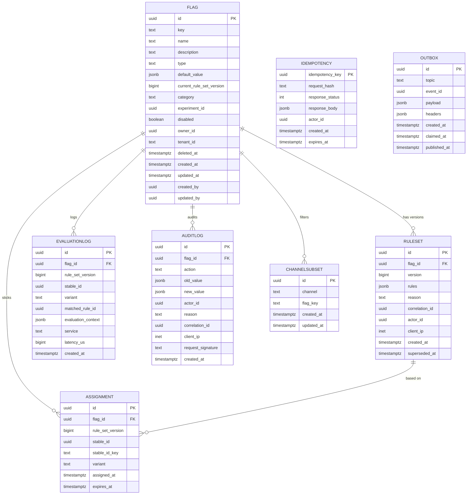

# Feature Flag Service — Entity-Relationship Diagram

## 1. Database

- Engine: PostgreSQL 18
- Schema: `feature_flag` (owned exclusively by this service)
- Migrations: `services/feature-flag-service/migrations/`

## 2. Cross-Service References

| Column | Type | Refers to | Source of truth |
|--------|------|-----------|------------------|
| `flag_key` (the rule's `when.user_id` predicate) | UUID | `Identity.id` | `identity-service` |
| `rule.when.segment` | TEXT | `CustomerSegment.name` | `customer-service` |
| `rule.when.region` | TEXT | `Zone.id` | `zone-service` |

No DB FKs. Cross-service references are validated via API at write
time and via reconciliation jobs.

## 3. Entities

### `Flag`

The current "head" of a flag definition. Soft-deletable.

#### Columns

| Column | Type | Constraints | Notes |
|--------|------|-------------|-------|
| `id` | UUID | PK | UUIDv7 |
| `key` | TEXT | NOT NULL, UNIQUE | `[a-z][a-z0-9_.\-]{1,127}` |
| `name` | TEXT | NOT NULL | human name |
| `description` | TEXT | NULL | |
| `type` | TEXT | NOT NULL | `boolean`/`string`/`number`/`object` |
| `default_value` | JSONB | NOT NULL | value when no rule matches |
| `current_rule_set_version` | BIGINT | NOT NULL | latest rule set |
| `category` | TEXT | NOT NULL | `release`/`operational`/`experiment`/`permission` |
| `experiment_id` | UUID | NULL | link to experiment if applicable |
| `disabled` | BOOLEAN | NOT NULL DEFAULT false | kill switch |
| `owner_id` | UUID | NOT NULL | admin who owns the flag |
| `tenant_id` | TEXT | NOT NULL DEFAULT 'global' | |
| `deleted_at` | TIMESTAMPTZ | NULL | soft delete |
| `created_at` | TIMESTAMPTZ | NOT NULL DEFAULT now() | |
| `updated_at` | TIMESTAMPTZ | NOT NULL DEFAULT now() | |
| `created_by` | UUID | NOT NULL | |
| `updated_by` | UUID | NOT NULL | |

#### Indexes

- PK on `id`
- UNIQUE on `key`
- Index on `category`
- Index on `experiment_id`

#### Constraints

- CHECK: `type IN ('boolean','string','number','object')`
- CHECK: `category IN ('release','operational','experiment','permission')`

### `RuleSet`

Immutable versioned rule set for a flag.

#### Columns

| Column | Type | Constraints | Notes |
|--------|------|-------------|-------|
| `id` | UUID | PK | UUIDv7 |
| `flag_id` | UUID | NOT NULL | |
| `version` | BIGINT | NOT NULL | monotonic per flag |
| `rules` | JSONB | NOT NULL | ordered list of rule objects |
| `reason` | TEXT | NOT NULL | operator's reason |
| `correlation_id` | UUID | NOT NULL | request id |
| `actor_id` | UUID | NOT NULL | admin who wrote |
| `client_ip` | INET | NULL | |
| `created_at` | TIMESTAMPTZ | NOT NULL DEFAULT now() | |
| `superseded_at` | TIMESTAMPTZ | NULL | |

#### Indexes

- PK on `id`
- UNIQUE on `(flag_id, version)`
- Index on `(flag_id, created_at DESC)`
- Index on `actor_id`
- Index on `correlation_id`

#### Constraints

- CHECK: `version >= 1`

### `Rule` (logical, inside RuleSet.rules JSONB)

Each rule has the shape:

```json
{
  "rule_id": "01HZX…",
  "when": {
    "user_id": null,
    "segment": ["premium"],
    "region": ["eu-west"],
    "country": null,
    "app_version": null,
    "custom": { "k": "v" }
  },
  "percentage": {
    "stable_id_key": "customer_id",
    "buckets": [
      { "name": "control", "weight": 50 },
      { "name": "treatment", "weight": 50 }
    ]
  },
  "time_window": {
    "from": "2026-07-01T00:00:00Z",
    "to": "2026-08-01T00:00:00Z"
  },
  "value": true
}
```

### `Assignment`

Sticky variant assignment for percentage rollouts. Persisted so a
user always sees the same variant.

#### Columns

| Column | Type | Constraints | Notes |
|--------|------|-------------|-------|
| `id` | UUID | PK | UUIDv7 |
| `flag_id` | UUID | NOT NULL | |
| `rule_set_version` | BIGINT | NOT NULL | version of the rule set |
| `stable_id` | UUID | NOT NULL | the user's stable id |
| `stable_id_key` | TEXT | NOT NULL | which field it was hashed on |
| `variant` | TEXT | NOT NULL | the assigned variant |
| `assigned_at` | TIMESTAMPTZ | NOT NULL DEFAULT now() | |
| `expires_at` | TIMESTAMPTZ | NOT NULL | experiment end + 7d |

#### Indexes

- PK on `id`
- UNIQUE on `(flag_id, rule_set_version, stable_id_key, stable_id)`
- Index on `expires_at` (purge job)

### `EvaluationLog`

Sample log of evaluations for analytics. Partitioned by day.

#### Columns

| Column | Type | Constraints | Notes |
|--------|------|-------------|-------|
| `id` | UUID | PK | UUIDv7 |
| `flag_id` | UUID | NOT NULL | |
| `rule_set_version` | BIGINT | NOT NULL | |
| `stable_id` | UUID | NULL | |
| `variant` | TEXT | NULL | |
| `matched_rule_id` | UUID | NULL | |
| `evaluation_context` | JSONB | NOT NULL | |
| `service` | TEXT | NOT NULL | caller |
| `latency_us` | BIGINT | NOT NULL | microseconds |
| `created_at` | TIMESTAMPTZ | NOT NULL DEFAULT now() | partition key |

#### Indexes

- PK on `id`
- Index on `(flag_id, created_at DESC)`
- Index on `(service, created_at DESC)`

### `AuditLog`

Immutable append-only audit log.

#### Columns

| Column | Type | Constraints | Notes |
|--------|------|-------------|-------|
| `id` | UUID | PK | UUIDv7 |
| `flag_id` | UUID | NOT NULL | |
| `action` | TEXT | NOT NULL | create/update/rollback/disable/enable/deprecate/delete |
| `old_value` | JSONB | NULL | |
| `new_value` | JSONB | NULL | |
| `actor_id` | UUID | NOT NULL | |
| `reason` | TEXT | NOT NULL | |
| `correlation_id` | UUID | NOT NULL | |
| `client_ip` | INET | NULL | |
| `request_signature` | TEXT | NULL | |
| `created_at` | TIMESTAMPTZ | NOT NULL DEFAULT now() | |

#### Indexes

- PK on `id`
- Index on `(flag_id, created_at DESC)`
- Index on `actor_id`
- Index on `correlation_id`

#### Constraints

- CHECK: `action IN ('create','update','rollback','disable','enable','deprecate','delete')`
- **No UPDATE / DELETE on this table** (enforced by revoked grants).

### `Idempotency`

Same shape as `configuration.idempotency`.

### `Outbox`

Same shape as `configuration.outbox`.

### `ChannelSubset`

A per-channel view declaration: which flags a channel can see.

#### Columns

| Column | Type | Constraints | Notes |
|--------|------|-------------|-------|
| `id` | UUID | PK | UUIDv7 |
| `channel` | TEXT | NOT NULL | e.g. `customer_app_en` |
| `flag_key` | TEXT | NOT NULL | |
| `created_at` | TIMESTAMPTZ | NOT NULL DEFAULT now() | |
| `updated_at` | TIMESTAMPTZ | NOT NULL DEFAULT now() | |

#### Indexes

- PK on `id`
- UNIQUE on `(channel, flag_key)`

## 4. Mermaid ER Diagram



## 5. DDL Sketch

```sql
CREATE SCHEMA IF NOT EXISTS feature_flag;

CREATE TABLE feature_flag.flags (
    id UUID PRIMARY KEY,
    key TEXT NOT NULL UNIQUE
        CHECK (key ~ '^[a-z][a-z0-9_.\-]{1,127}$'),
    name TEXT NOT NULL,
    description TEXT,
    type TEXT NOT NULL
        CHECK (type IN ('boolean','string','number','object')),
    default_value JSONB NOT NULL,
    current_rule_set_version BIGINT NOT NULL DEFAULT 0,
    category TEXT NOT NULL
        CHECK (category IN ('release','operational','experiment','permission')),
    experiment_id UUID,
    disabled BOOLEAN NOT NULL DEFAULT false,
    owner_id UUID NOT NULL,
    tenant_id TEXT NOT NULL DEFAULT 'global',
    deleted_at TIMESTAMPTZ,
    created_at TIMESTAMPTZ NOT NULL DEFAULT now(),
    updated_at TIMESTAMPTZ NOT NULL DEFAULT now(),
    created_by UUID NOT NULL,
    updated_by UUID NOT NULL
);

CREATE INDEX idx_flags_category ON feature_flag.flags (category);
CREATE INDEX idx_flags_experiment ON feature_flag.flags (experiment_id);

CREATE TABLE feature_flag.rule_sets (
    id UUID PRIMARY KEY,
    flag_id UUID NOT NULL,
    version BIGINT NOT NULL CHECK (version >= 1),
    rules JSONB NOT NULL,
    reason TEXT NOT NULL CHECK (length(reason) BETWEEN 8 AND 512),
    correlation_id UUID NOT NULL,
    actor_id UUID NOT NULL,
    client_ip INET,
    created_at TIMESTAMPTZ NOT NULL DEFAULT now(),
    superseded_at TIMESTAMPTZ,
    UNIQUE (flag_id, version)
);

CREATE INDEX idx_rulesets_flag_created
    ON feature_flag.rule_sets (flag_id, created_at DESC);
CREATE INDEX idx_rulesets_actor
    ON feature_flag.rule_sets (actor_id);
CREATE INDEX idx_rulesets_correlation
    ON feature_flag.rule_sets (correlation_id);

CREATE TABLE feature_flag.assignments (
    id UUID PRIMARY KEY,
    flag_id UUID NOT NULL,
    rule_set_version BIGINT NOT NULL,
    stable_id UUID NOT NULL,
    stable_id_key TEXT NOT NULL,
    variant TEXT NOT NULL,
    assigned_at TIMESTAMPTZ NOT NULL DEFAULT now(),
    expires_at TIMESTAMPTZ NOT NULL,
    UNIQUE (flag_id, rule_set_version, stable_id_key, stable_id)
);
CREATE INDEX idx_assignments_expires
    ON feature_flag.assignments (expires_at);

CREATE TABLE feature_flag.evaluation_log (
    id UUID NOT NULL,
    flag_id UUID NOT NULL,
    rule_set_version BIGINT NOT NULL,
    stable_id UUID,
    variant TEXT,
    matched_rule_id UUID,
    evaluation_context JSONB NOT NULL,
    service TEXT NOT NULL,
    latency_us BIGINT NOT NULL,
    created_at TIMESTAMPTZ NOT NULL DEFAULT now(),
    PRIMARY KEY (id, created_at)
) PARTITION BY RANGE (created_at);

CREATE TABLE IF NOT EXISTS feature_flag.evaluation_log_2026_07_29
    PARTITION OF feature_flag.evaluation_log
    FOR VALUES FROM ('2026-07-29 00:00:00+00') TO ('2026-07-30 00:00:00+00');

-- Verify IF NOT EXISTS did not hide a wrong parent or range.
DO $$
DECLARE
    v_parent   REGCLASS := 'feature_flag.evaluation_log'::REGCLASS;
    v_child    REGCLASS := 'feature_flag.evaluation_log_2026_07_29'::REGCLASS;
    v_expected TSTZRANGE := tstzrange('2026-07-29 00:00:00+00',
                                      '2026-07-30 00:00:00+00',
                                      '[)');
BEGIN
    IF (SELECT inhparent FROM pg_inherits WHERE inhrelid = v_child)
       IS DISTINCT FROM v_parent THEN
        RAISE EXCEPTION 'partition % is not attached to %',
            v_child::text, v_parent::text;
    END IF;
    IF NOT (SELECT relpartbound FROM pg_class WHERE oid = v_child)
              = v_expected THEN
        RAISE EXCEPTION 'partition % has unexpected bounds', v_child::text;
    END IF;
END $$;

CREATE TABLE feature_flag.audit_log (
    id UUID NOT NULL,
    flag_id UUID NOT NULL,
    action TEXT NOT NULL
        CHECK (action IN ('create','update','rollback','disable',
                          'enable','deprecate','delete')),
    old_value JSONB,
    new_value JSONB,
    actor_id UUID NOT NULL,
    reason TEXT NOT NULL,
    correlation_id UUID NOT NULL,
    client_ip INET,
    request_signature TEXT,
    created_at TIMESTAMPTZ NOT NULL DEFAULT now(),
    PRIMARY KEY (id, created_at)
) PARTITION BY RANGE (created_at);

CREATE TABLE IF NOT EXISTS feature_flag.audit_log_2026_07
    PARTITION OF feature_flag.audit_log
    FOR VALUES FROM ('2026-07-01 00:00:00+00') TO ('2026-08-01 00:00:00+00');

REVOKE UPDATE, DELETE ON feature_flag.audit_log FROM feature_flag_app;

CREATE TABLE feature_flag.idempotency (
    idempotency_key UUID PRIMARY KEY,
    request_hash TEXT NOT NULL,
    response_status INT NOT NULL,
    response_body JSONB NOT NULL,
    actor_id UUID NOT NULL,
    created_at TIMESTAMPTZ NOT NULL DEFAULT now(),
    expires_at TIMESTAMPTZ NOT NULL
);

CREATE TABLE feature_flag.outbox (
    id UUID PRIMARY KEY,
    topic TEXT NOT NULL,
    event_id UUID NOT NULL,
    payload JSONB NOT NULL,
    headers JSONB,
    created_at TIMESTAMPTZ NOT NULL DEFAULT now(),
    claimed_at TIMESTAMPTZ,
    published_at TIMESTAMPTZ
);

CREATE TABLE feature_flag.channel_subsets (
    id UUID PRIMARY KEY,
    channel TEXT NOT NULL,
    flag_key TEXT NOT NULL,
    created_at TIMESTAMPTZ NOT NULL DEFAULT now(),
    updated_at TIMESTAMPTZ NOT NULL DEFAULT now(),
    UNIQUE (channel, flag_key)
);
```

## 6. Audit Columns

Every mutable table has `created_at`, `updated_at`, `created_by`,
`updated_by`. `audit_log` is append-only.

## 7. Soft Delete

`flags.deleted_at` is the soft-delete flag. Deleted flags return 404
on read by default. The rule sets and assignments are retained for
audit.

## 8. JSONB Usage

| Table.Column | What is stored | Justification |
|--------------|----------------|---------------|
| `flags.default_value` | the flag's default value | typed per type |
| `rule_sets.rules` | the ordered list of rule objects | flexible predicates |
| `assignments.variant` | the assigned variant | text only |
| `evaluation_log.evaluation_context` | the caller's context | flexible |
| `audit_log.old_value` / `new_value` | pre/post image | diff display |
| `outbox.payload` | event payload | per topic |

## 9. Partitioning

- `evaluation_log` partitioned by day.
- `audit_log` partitioned by month.
- `flags`, `rule_sets`, `assignments` not partitioned.


See [`DATABASE_ARCHITECTURE.md` §"Table Partitioning — Canonical Template"](../../architecture/DATABASE_ARCHITECTURE.md) for the idempotent `CREATE TABLE IF NOT EXISTS … PARTITION OF …` pattern, naming convention, and the service-owned maintenance-job contract (advisory lock, verification, retention/mixed-retention handling).

## 10. Data Retention

| Table | Retention | Purged by |
|-------|-----------|-----------|
| `flags` | indefinitely (soft delete) | n/a |
| `rule_sets` | 7 years | monthly archival job |
| `assignments` | experiment end + 7 days | daily purge job |
| `evaluation_log` | 30 days | daily purge job |
| `audit_log` | 7 years | monthly archival job |
| `idempotency` | 24 hours | daily purge job |
| `outbox` | 24 hours after `published_at` | hourly purge job |
| `channel_subsets` | indefinitely | n/a |

## 11. Migration Considerations

- Adding a new flag category or type is a `CHECK` constraint update
  + a one-time enum broadcast; no data migration.
- Changing the rule schema is a major version; the SDK must be
  redeployed before the new schema is published.
- The `audit_log` append-only constraint is enforced at the database
  grant level.

---

## See also

### Sibling docs for this service

- [`README.md`](./README.md) — purpose, bounded context, responsibilities
- [`BRD.md`](./BRD.md) — business requirements
- [`SRS.md`](./SRS.md) — functional + non-functional requirements
- [`ERD.md`](./ERD.md) — data model (entities, relationships)
- [`INTEGRATION.md`](./INTEGRATION.md) — inter-service contracts (APIs, events, sagas)
- [`WORKFLOWS.md`](./WORKFLOWS.md) — operational workflows (happy paths, failure modes)
- [`TECH.md`](./TECH.md) — technology profile (runtime, libraries, data layer, admin endpoints, RBAC)

### Platform-wide

- [`../../shared/README.md`](../../shared/README.md) — `platform-spring-boot-starter` shared library (the single source of cross-cutting code for all Spring Boot services in the platform)
- [`../RECOMMENDATIONS.md`](../RECOMMENDATIONS.md) — platform-wide technology map (language, framework, version baseline, admin/RBAC pattern)
- [`../../README.md`](../../README.md) — services overview (the catalog of all 58 services)
- [`../../../main.md`](../../../main.md) — top-level platform specification (architecture, Keycloak, PostgreSQL 18, messaging, observability baseline)

