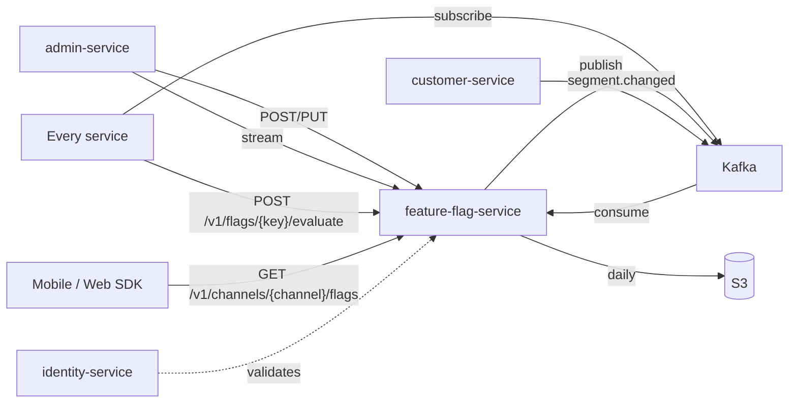
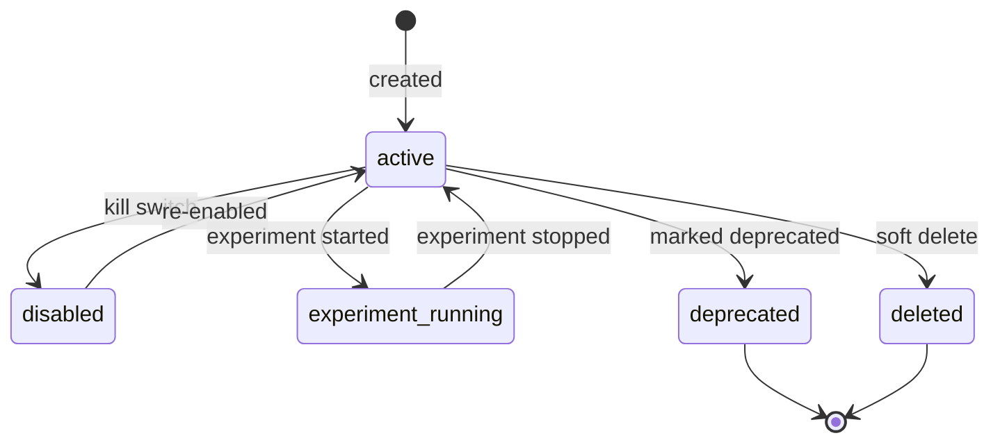

# Feature Flag Service — Software Requirements Specification

## 1. Introduction

This SRS specifies the behavior, performance, and operational
requirements of `feature-flag-service`. It inherits the platform-wide
standards in `docs/architecture/API_STANDARDS.md`,
`docs/architecture/EVENT_ARCHITECTURE.md`, and
`docs/architecture/SECURITY_ARCHITECTURE.md`.

## 2. Scope

In scope:

- The read and write APIs for flag definitions and rules.
- The evaluation API (synchronous).
- The long-poll update stream.
- The per-channel filtered subset for edge clients.
- Sticky variant assignment.
- The event publication of every change.

Out of scope:

- Business rule values (owned by `configuration-service`).
- A/B result analysis (owned by `analytics-service`).
- Roles / permissions (Keycloak).

## 3. System Context

## 4. Actors

- **Operator (admin)** — human; carries `flag.admin`; performs writes.
- **Experiment owner** — human; carries `flag.experiment`; creates
  experiment flags.
- **Internal service** — system; calls evaluation.
- **Mobile / web client** — system; downloads subset.
- **Auditor** — human; reads history.

## 5. Functional Requirements

| ID | Requirement | Priority |
|----|-------------|----------|
| FR--001 | The service MUST expose `POST /v1/flags` to create a new flag with its type, default, and description. | MUST |
| FR--002 | The service MUST expose `PUT /v1/flags/{key}` to update the default and metadata. | MUST |
| FR--003 | The service MUST expose `POST /v1/flags/{key}/rules` to add a rule (matching predicates + value). | MUST |
| FR--004 | The service MUST expose `DELETE /v1/flags/{key}/rules/{rule_id}` to remove a rule (creates a new rule set version). | MUST |
| FR--005 | The service MUST expose `POST /v1/flags/{key}/evaluate` that takes an evaluation context and returns the resolved value + matched rule id. | MUST |
| FR--006 | The service MUST support boolean and multivariate flag types. | MUST |
| FR--007 | The service MUST support rules that match on user id, segment, region, country, app version, custom attribute. | MUST |
| FR--008 | The service MUST support percentage rollouts with consistent hashing on a stable id. | MUST |
| FR--009 | The service MUST support time-windowed rules (active during a date range). | SHOULD |
| FR--010 | The service MUST support a kill switch (`disabled` flag) that overrides all rules. | MUST |
| FR--011 | The service MUST publish `feature_flag.updated.v1` on every change. | MUST |
| FR--012 | The service MUST publish `feature_flag.disabled.v1` on a kill switch. | MUST |
| FR--013 | The service MUST publish `feature_flag.experiment.started.v1` / `feature_flag.experiment.stopped.v1` for experiments. | MUST |
| FR--014 | The service MUST expose `GET /v1/flags/stream` as a long-poll endpoint. | MUST |
| FR--015 | The service MUST expose `GET /v1/channels/{channel}/flags` for filtered client subsets. | MUST |
| FR--016 | The service MUST persist every change in `feature_flag.audit_log` with `actor_id` and `reason`. | MUST |
| FR--017 | The service MUST export daily assignment snapshots to S3. | SHOULD |
| FR--018 | The service MUST support one-click rollback to a prior rule set. | SHOULD |
| FR--019 | The service MUST validate flag values against the declared type on write. | MUST |
| FR--020 | The service MUST return `flag_evaluation_error` (not a default) on a server-side evaluation error so the caller can decide. | MUST |

## 6. Non-Functional Requirements

| ID | Category | Requirement | Target |
|----|----------|-------------|--------|
| NFR--001 | performance | P99 evaluation latency (cached) | < 30ms |
| NFR--002 | performance | P99 evaluation latency (uncached) | < 200ms |
| NFR--003 | performance | P99 read latency | < 200ms |
| NFR--004 | availability | uptime | 99.95% |
| NFR--005 | scalability | concurrent evaluations per pod | 5,000 |
| NFR--006 | scalability | concurrent long-poll connections per pod | 1,000 |
| NFR--007 | durability | zero data loss on regional outage | RPO 5m, RTO 30m |
| NFR--008 | determinism | sticky assignment | 100% (same id → same variant) |
| NFR--009 | observability | 100% requests have trace and log | enforced in CI |
| NFR--010 | freshness | median propagation latency | < 2s |
| NFR--011 | auditability | 100% writes have actor + reason | enforced in DB |

## 7. API Requirements

- Versioned URIs.
- Bearer JWT.
- `Idempotency-Key` for non-idempotent writes.
- Errors in the standard envelope.
- OpenAPI 3.1 at `/openapi.json`.

## 8. Data Requirements

| ID | Requirement | Notes |
|----|-------------|-------|
| DATA--001 | Primary keys UUIDv7. | |
| DATA--002 | Every flag has a JSON Schema for its value. | |
| DATA--003 | Every change has `actor_id`, `reason`, `correlation_id`. | Audit |
| DATA--004 | Sticky assignment persisted in `feature_flag.assignments` with TTL = experiment duration + 7d. | Stickiness |
| DATA--005 | Time fields `timestamptz` UTC. | |
| DATA--006 | Cross-service references are UUID columns without DB FKs. | Rule |

## 9. Validation Rules

- A flag key MUST be `[a-z][a-z0-9_.\-]{1,127}`.
- A flag type MUST be one of `boolean`, `string`, `number`, `object`.
- A rule's `when` predicates are validated against the JSON Schema
  for `Rule`.
- A reason MUST be 8–512 characters.
- A kill switch requires `X-Audit-Reason` + `X-Signature`.

## 10. State Transitions

## 11. Authorization Requirements

- Writes require `flag.admin`; experiments require `flag.experiment`.
- Read access to flag history requires `flag.audit`.
- Evaluation is open to all authenticated callers; unauthenticated
  evaluation is allowed only for client SDK calls with a public
  channel key (subject to per-channel rate limit).

## 12. Configuration Requirements

- `STICKY_HASH_ALGO` (env; default `murmur3`).
- `EVAL_LOG_TTL_DAYS` (env; default 30).
- `LONGPOLL_MAX_WAIT_SECONDS` (env; default 25).
- `READ_CACHE_TTL_SECONDS` (env; default 60).

The service MUST NOT read from its own configuration store for
operational parameters.

## 13. Error Handling

| Error | Response |
|-------|----------|
| Type mismatch | 422 `VALIDATION_FAILED` |
| Unknown flag | 404 `FLAG_NOT_FOUND` |
| Concurrent rule race | 409 `RULE_VERSION_CONFLICT` |
| Idempotency-Key reuse | 422 `IDEMPOTENCY_KEY_REUSED` |
| Signature invalid (kill switch) | 403 `SIGNATURE_INVALID` |
| Server error during evaluation | 200 with `value=null`, `matched_rule_id="error"` and HTTP header `X-Flag-Error: 1` so the caller can decide |

## 14. Concurrency Requirements

- A write to a flag MUST be serialized at the row level
  (`SELECT ... FOR UPDATE` on the latest rule set version).
- Two simultaneous writes to the same flag MUST result in one win
  and one `409 RULE_VERSION_CONFLICT`.
- Evaluations are lock-free; they read from a snapshot in Redis.

## 15. Idempotency Requirements

- All write endpoints require `Idempotency-Key`.
- The service stores the key in `feature_flag.idempotency` for 24
  hours.

## 16. Performance

- Dominant path: `POST /v1/flags/{key}/evaluate` (cached).
- P50/P95/P99: 3ms / 15ms / 30ms (cached); 30ms / 100ms / 200ms
  (uncached).
- The in-memory cache is a snapshot of (flag_key → rule_set) loaded
  at startup and updated on `feature_flag.updated.v1`.

## 17. Scalability

- Horizontal scaling: HPA on CPU and long-poll connection count.
- Vertical scaling: 1 vCPU / 1 GiB minimum; 2 vCPU / 4 GiB production.

## 18. Availability

- SLO: 99.95% over 30 days.
- Error budget: ~22 minutes per 30 days.
- Maintenance window: Sundays 04:00–06:00 UTC.

## 19. Security

| ID | Requirement | Notes |
|----|-------------|-------|
| SEC--001 | All requests JWT-validated. | Standard |
| SEC--002 | Kill switch requires `X-Signature`. | HMAC-SHA256. |
| SEC--003 | Mutations require `X-Audit-Reason`. | |
| SEC--004 | Per-channel client subsets are server-filtered. | No client filtering. |
| SEC--005 | No PII in default logs. | Use IDs. |
| SEC--006 | DB user has rights only on the `feature_flag` schema. | Least privilege. |
| SEC--007 | Sticky assignments are encrypted at rest. | KEK. |

## 20. Privacy

- PII stored: only the `stable_id` (a UUID, not PII by itself but
  may be linkable to a user).
- Retention: 30 days for evaluation logs; 7 years for `audit_log`.
- Erasure: tenant offboarding deactivates all flags; assignments
  are purged.

## 21. Auditability

- Every write emits `feature_flag.updated.v1` AND a row in
  `feature_flag.audit_log`.
- `audit_log` includes `actor_id`, `reason`, `key`, `old_rules`,
  `new_rules`, `correlation_id`.
- `audit-service` consumes the events and persists to its own
  immutable store.

## 22. Observability

- Logs: JSON to stdout; standard fields.
- Metrics:
  - `http_requests_total{route, method, status}` (RED)
  - `http_request_duration_seconds{route, method, status}` (RED)
  - `flag_evaluations_total{key, variant, matched_rule_id}`
  - `flag_cache_hit_ratio`
  - `flag_longpoll_connections`
  - `flag_propagation_seconds`
- Traces: OpenTelemetry; one root span per request.
- Alerts:
  - SLO burn rate.
  - Cache hit rate < 90% for 5 min.
  - Propagation latency P99 > 5s for 5 min.

## 23. Maintainability

- Code style: TypeScript ESLint config.
- Test coverage: ≥ 85% on handlers, ≥ 95% on rule evaluators.
- Documentation: this folder; OpenAPI 3.1 at `/openapi.json`.

## 24. Disaster Recovery

- RPO: 5 minutes.
- RTO: 30 minutes.
- Backups: nightly logical + continuous WAL.

## 25. Acceptance Criteria

- 99.95% evaluation availability for 30 days in production.
- 100% of writes attributed to a user with a reason.
- P99 evaluation latency < 30ms (cached).
- A kill switch takes effect globally within 5 seconds.
- A user always sees the same variant of an experiment.

---

## See also

### Sibling docs for this service

- [`README.md`](./README.md) — purpose, bounded context, responsibilities
- [`BRD.md`](./BRD.md) — business requirements
- [`SRS.md`](./SRS.md) — functional + non-functional requirements
- [`ERD.md`](./ERD.md) — data model (entities, relationships)
- [`INTEGRATION.md`](./INTEGRATION.md) — inter-service contracts (APIs, events, sagas)
- [`WORKFLOWS.md`](./WORKFLOWS.md) — operational workflows (happy paths, failure modes)
- [`TECH.md`](./TECH.md) — technology profile (runtime, libraries, data layer, admin endpoints, RBAC)

### Platform-wide

- [`../../shared/README.md`](../../shared/README.md) — `platform-spring-boot-starter` shared library (the single source of cross-cutting code for all Spring Boot services in the platform)
- [`../RECOMMENDATIONS.md`](../RECOMMENDATIONS.md) — platform-wide technology map (language, framework, version baseline, admin/RBAC pattern)
- [`../../README.md`](../../README.md) — services overview (the catalog of all 58 services)
- [`../../../main.md`](../../../main.md) — top-level platform specification (architecture, Keycloak, PostgreSQL 18, messaging, observability baseline)

