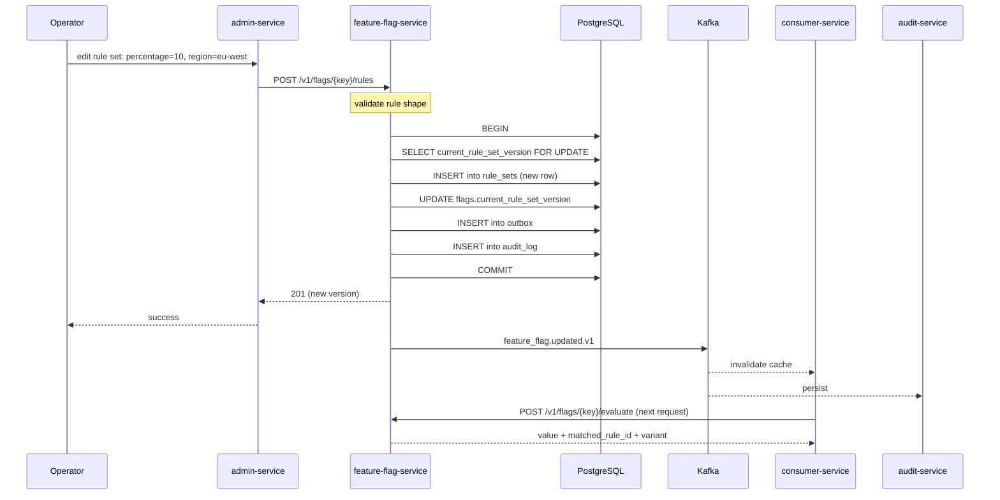
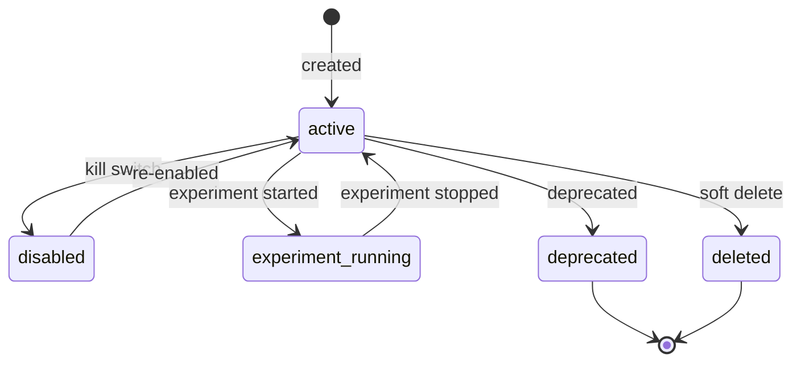
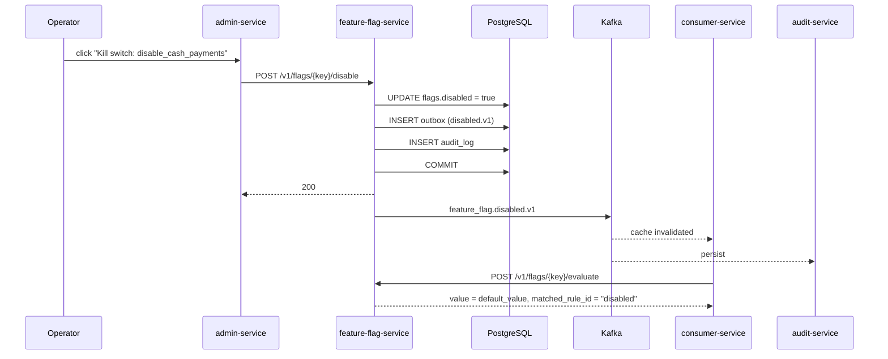
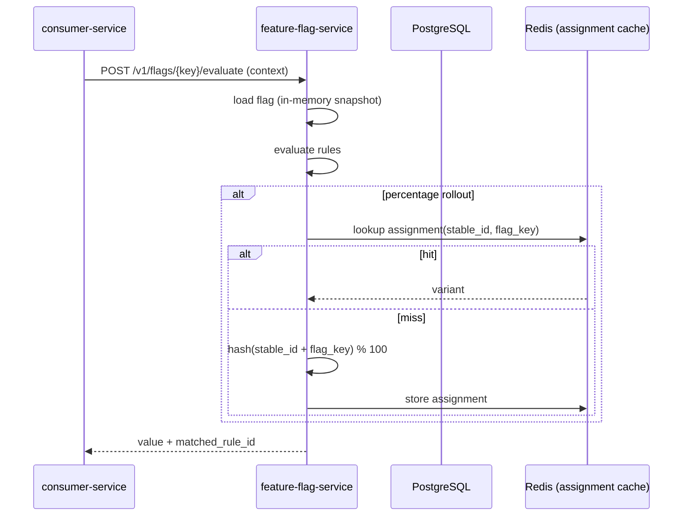
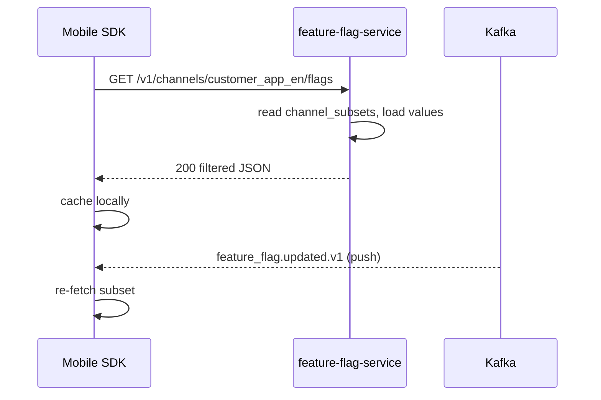

# Feature Flag Service — Workflows

## 1. Operator Rolls Out a Flag to 10% of Users

### 1.1 Objective

Change the rules of a flag so that 10% of users in EU get the new
value, sticky on their `customer_id`, and every consumer sees the
change within 5 seconds.

### 1.2 Initiating Actor

Operator (admin) via the admin console.

### 1.3 Participating Services

- `admin-service`
- `feature-flag-service` (this service)
- `identity-service`
- Every consumer service
- `audit-service`
- Kafka

### 1.4 Prerequisites

- The flag exists in `flags`.
- The operator holds `flag.admin` and provides `X-Audit-Reason`.
- The flag's `category` is `release`.

### 1.5 Happy Path



State machine for a `Flag`:



### 1.6 Alternate Paths

- **Multivariate**: the rule has multiple `buckets`; the assignment
  is sticky on `stable_id + flag_key`.
- **Time-windowed**: a `time_window.from` / `time_window.to` is
  added; the rule only matches inside the window.
- **Experiment**: a separate event `feature_flag.experiment.started.v1`
  is emitted; `analytics-service` starts tracking the metric.

### 1.7 Failure Paths

| Failure | Handling |
|---------|----------|
| Rule shape invalid | 422 `VALIDATION_FAILED` with field-level `details[]` |
| Concurrent rule race | 409 `RULE_VERSION_CONFLICT`; operator retries |
| `X-Audit-Reason` missing | 400 `AUDIT_REASON_REQUIRED` |
| Signature invalid (kill switch) | 403 `SIGNATURE_INVALID` |
| Outbox poller fails | retry with backoff; DLQ after 3 attempts |
| Consumer cache invalidation fails | consumer falls back to its `since_version` long-poll |

### 1.8 Business Rules

- Rules are evaluated in order; the first match wins.
- A percentage rollout uses `murmur3(stable_id + flag_key) % 100`;
  the bucket maps to a variant.
- The matched rule id is returned in every evaluation response for
  audit.

### 1.9 State Transitions

See state machine in §1.5.

### 1.10 Events

| Event | Direction | When |
|-------|-----------|------|
| `feature_flag.updated.v1` | produced | rule change |
| `feature_flag.experiment.started.v1` | produced | experiment start |

### 1.11 APIs Involved

| API | Direction | When |
|-----|-----------|------|
| `POST /v1/flags/{key}/rules` | inbound | rule change |
| `POST /v1/flags/{key}/evaluate` | inbound | every consumer request |
| `GET /v1/flags/stream` | inbound | long-poll reload |

### 1.12 Compensation / Rollback

If the rollout is harmful, the operator reverts to a prior rule
set version. The revert creates a new rule set version that mirrors
the chosen prior one; the audit log records the rollback.

### 1.13 Final State

The new rule set is live; the percentage rollout is sticky; every
consumer sees the change within 5 seconds; the `audit_log` has a
row with `actor_id` and `reason`.

## 2. Operator Triggers a Kill Switch

### 2.1 Objective

Globally disable a flag (e.g. cash payments) so every evaluation
returns the disabled default, within 5 seconds.

### 2.2 Initiating Actor

Operator (admin) via the admin console.

### 2.3 Participating Services

- `admin-service`
- `feature-flag-service`
- `identity-service`
- Every consumer service
- `audit-service`
- Kafka

### 2.4 Prerequisites

- The operator holds `flag.admin`.
- The operator provides `X-Audit-Reason` and `X-Signature` (HMAC
  over the body).
- Step-up MFA completed.

### 2.5 Happy Path



### 2.6 Alternate Paths

- **Re-enable**: a separate `POST /v1/flags/{key}/enable` reverses
  the kill switch; the audit log records the action.

### 2.7 Failure Paths

| Failure | Handling |
|---------|----------|
| Missing `X-Signature` | 403 `SIGNATURE_INVALID`; alert |
| Step-up MFA missing | 403 `MFA_REQUIRED` |
| Operator lacks `flag.admin` | 403 `FORBIDDEN` |

### 2.8 Business Rules

- A kill switch overrides all rules.
- It is a single column flip (`flags.disabled = true`); the event
  is published with `action = "disable"`.

### 2.9 State Transitions

`active` → `disabled`; on re-enable, `disabled` → `active`.

### 2.10 Events

| Event | Direction | When |
|-------|-----------|------|
| `feature_flag.disabled.v1` | produced | kill switch |

### 2.11 APIs Involved

| API | Direction | When |
|-----|-----------|------|
| `POST /v1/flags/{key}/disable` | inbound | kill switch |

### 2.12 Compensation / Rollback

A `POST /v1/flags/{key}/enable` reverses the kill switch.

### 2.13 Final State

The flag returns the disabled default for every evaluation; the
audit log records the kill switch with reason and actor.

## 3. Consumer Service Evaluates a Flag

### 3.1 Objective

On every request path that depends on a flag, the consumer calls
`POST /v1/flags/{key}/evaluate` and gets the resolved value.

### 3.2 Initiating Actor

Internal service on a request.

### 3.3 Participating Services

- The consumer service.
- `feature-flag-service`.
- (Optional) `customer-service` for segment context.

### 3.4 Prerequisites

- The consumer has a service-account JWT with `flag.evaluate`.
- The flag is loaded into the consumer's in-memory cache (from
  `feature_flag.updated.v1`).

### 3.5 Happy Path



### 3.6 Alternate Paths

- **Server error**: the service returns 200 with `value=null`,
  `matched_rule_id="error"` and `X-Flag-Error: 1` so the caller
  can decide.
- **Kill switch active**: returns the disabled default and
  `matched_rule_id="disabled"`.

### 3.7 Failure Paths

| Failure | Handling |
|---------|----------|
| Service unreachable | SDK returns `flag_evaluation_error`; caller falls back |
| Type mismatch at startup | SDK refuses to start |
| Assignment cache down | service computes assignment without cache; slower path |

### 3.8 Business Rules

- The same `stable_id` always resolves to the same variant for the
  duration of the experiment.
- A kill switch overrides all rules.

### 3.9 State Transitions

Internal: evaluation state goes from `loading` → `evaluated` →
`returned`.

### 3.10 Events

n/a (no events on read path).

### 3.11 APIs Involved

| API | Direction | When |
|-----|-----------|------|
| `POST /v1/flags/{key}/evaluate` | inbound | every consumer request |

### 3.12 Compensation / Rollback

n/a (read-only).

### 3.13 Final State

The consumer receives the resolved value + matched rule id; the
caller branches accordingly.

## 4. Mobile Client Downloads a Filtered Flag Subset

### 4.1 Objective

At app launch, the mobile / web SDK downloads its per-channel
filtered flag subset.

### 4.2 Initiating Actor

Mobile or web client.

### 4.3 Participating Services

- `feature-flag-service`.

### 4.4 Prerequisites

- The channel has a `channel_subsets` entry for the keys it needs.

### 4.5 Happy Path



### 4.6 Alternate Paths

- The client may pass `since_version`; the service returns only
  changed keys.

### 4.7 Failure Paths

| Failure | Handling |
|---------|----------|
| Service unreachable | SDK uses last cached subset; offline mode |
| Channel unknown | 404 `CHANNEL_NOT_FOUND`; SDK falls back to defaults |

### 4.8 Business Rules

- The SDK MUST NOT see flags that are not in its `channel_subsets`
  entry.

### 4.9 State Transitions

n/a (read-only).

### 4.10 Events

| Event | Direction | When |
|-------|-----------|------|
| `feature_flag.updated.v1` | consumed | reload trigger |

### 4.11 APIs Involved

| API | Direction | When |
|-----|-----------|------|
| `GET /v1/channels/{channel}/flags` | inbound | app launch / update |

### 4.12 Compensation / Rollback

If the subset is missing required flags, the SDK falls back to a
hard-coded default set (build-time only); the missing flag is logged
for triage.

### 4.13 Final State

The SDK has the latest filtered flag values cached locally.

---

## 99. `Daily Partition Maintenance`

### 99.1 Objective

Idempotently pre-create the next 30 days for partitioned tables in `feature_flag`. The drop half is handled by the per-service retention job.

### 99.2 Initiating Actor

A scheduled job runs daily at `02:00 UTC`. Leader-elected via `pg_try_advisory_xact_lock(hashtext('feature_flag.partition'), hashtext('daily'))`.

### 99.3 Happy Path

```mermaid
sequenceDiagram
    participant JOB as Partition job
    participant PG as PostgreSQL
    JOB->>PG: pg_try_advisory_xact_lock('feature_flag.daily')
    alt lock acquired
        loop for each missing day in next 30
            JOB->>PG: CREATE TABLE IF NOT EXISTS feature_flag.<table>_YYYY_MM_DD PARTITION OF feature_flag.<table>
            JOB->>PG: verify (pg_inherits, relpartbound)
        end
        JOB->>PG: assert now() in existing child
    else lock NOT acquired
        Note over JOB: another instance is running; exit cleanly
    end
```

### 99.4 Failure Paths

| Failure | Handling |
|---------|----------|
| Lock contention | exit 0 |
| DDL fails | retry 3× with backoff (1 s / 4 s / 16 s); page on-call |
| Today's child missing | critical alert; INSERTs would fail |

### 99.5 Business Rules

- Pre-create next 30 complete future days.
- Every child is created with `CREATE TABLE IF NOT EXISTS … PARTITION OF …` so the job is safe to run twice in the same window.
- A verification step (`pg_inherits` parent + `relpartbound` range) runs after every `CREATE TABLE IF NOT EXISTS` because `IF NOT EXISTS` only guards the name, not the bounds.
- Optionally emit `audit.partition.maintained.v1` on success.

---

## See also

### Sibling docs for this service

- [`README.md`](./README.md) — purpose, bounded context, responsibilities
- [`BRD.md`](./BRD.md) — business requirements
- [`SRS.md`](./SRS.md) — functional + non-functional requirements
- [`ERD.md`](./ERD.md) — data model (entities, relationships)
- [`INTEGRATION.md`](./INTEGRATION.md) — inter-service contracts (APIs, events, sagas)
- [`WORKFLOWS.md`](./WORKFLOWS.md) — operational workflows (happy paths, failure modes)
- [`TECH.md`](./TECH.md) — technology profile (runtime, libraries, data layer, admin endpoints, RBAC)

### Platform-wide

- [`../../shared/README.md`](../../shared/README.md) — `platform-spring-boot-starter` shared library (the single source of cross-cutting code for all Spring Boot services in the platform)
- [`../RECOMMENDATIONS.md`](../RECOMMENDATIONS.md) — platform-wide technology map (language, framework, version baseline, admin/RBAC pattern)
- [`../../README.md`](../../README.md) — services overview (the catalog of all 58 services)
- [`../../../main.md`](../../../main.md) — top-level platform specification (architecture, Keycloak, PostgreSQL 18, messaging, observability baseline)

