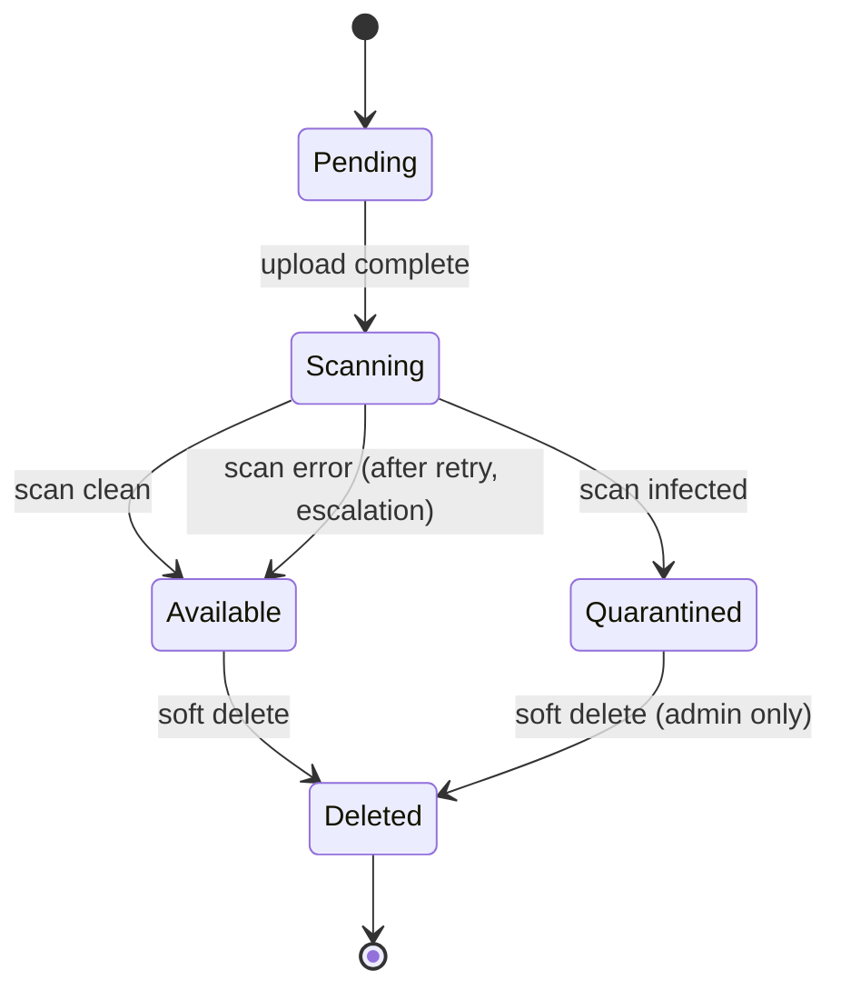

# file-service — Software Requirements Specification

## 1. Introduction

This SRS specifies, for the engineering team, the functional,
non-functional, data, security, and operational requirements of
`file-service`. It is derived from `BRD.md` and from the
platform's cross-service architecture.

## 2. Scope

In scope:

- All REST endpoints listed in `INTEGRATION.md` (upload,
  complete, read, signed URL, download, delete, scan,
  retention run, **driver catalog, driver pinning,
  driver migration**).
- **Storage Driver abstraction**: a single Go interface
  with one or more of the implementations `s3`,
  `azure_blob`, `oracle_object_storage`, `gcs`, `local_fs`.
  The interface covers `InitiateUpload`, `CompleteUpload`,
  `GetObject`, `DeleteObject`, `CreateSignedURL`,
  `HeadObject`, and a per-driver readiness probe.
- **Per-file driver assignment** with documented
  precedence (per-file pin → per-tenant → per-owner-type
  → per-retention-class → env default).
- **Driver migration** (single-file and bulk).
- Virus scan integration (sync + async).
- Per-class retention policy.
- Right-to-erasure (across every driver a file may be
  on).
- Outbound events `file.uploaded.v1`, `file.scanned.v1`,
  `file.deleted.v1`, `file.migrated.v1`.

Out of scope:

- The bytes themselves (any backend the active driver
  wraps; this service stores only metadata + a
  driver-opaque locator).
- CDN / image transformation (a separate `image-service`).
- User identity, KYC.

## 3. System Context

```mermaid
flowchart LR
    CST[customer-service] -->|POST /v1/files| F[file-service]
    DRV[driver-service] -->|POST /v1/files| F
    CO2[courier-service] -->|POST /v1/files| F
    MS[`restaurant-service` (merchant)] -->|POST /v1/files| F
    RS[restaurant-service] -->|POST /v1/files| F
    SUP[`admin-service` (support module)] -->|POST /v1/files| F
    RSH[`trip-service` (safety)] -->|POST /v1/files| F
    F -->|driver op| DRIVERS[(Storage Drivers\ns3 / azure_blob /\noracle_object_storage /\ngcs / local_fs)]
    F -->|scan| VS[(Virus Scan)]
    F -->|file.*.v1| AUD[audit-service]
    F -->|file.*.v1| AN[`reporting-service` (data lake)]
    CFG[configuration-service] -->|configuration.updated.v1| F
    ADM[admin-service] -->|driver pin / migration| F
```

## 4. Actors

| Actor | Type | Description |
|-------|------|-------------|
| `customer-service`, `driver-service`, `courier-service`, ``restaurant-service` (merchant)`, `restaurant-service` | system | upload / read their own files |
| ``admin-service` (support module)` | system | upload / read ticket attachments |
| ``trip-service` (safety)` | system | upload safety recording chunks |
| `admin-service` | system | admin operations, **driver pinning, migration triggers** |
| End user (via app) | human | upload (profile photo) |
| Operations (admin) | human | retention overrides, manual scan, driver drain / migration approval |
| **Storage Driver** (S3 / S3-compatible / Azure Blob / OCI / GCS / local FS) | external | carries the bytes; one driver or many |
| Virus scan provider | external | scan |

## 5. Functional Requirements

| ID | Requirement | Priority |
|----|-------------|----------|
| FR--001 | The service MUST expose `POST /v1/files` accepting `(name, mime_type, size_bytes, owner_id, owner_type, retention_class)` and returning `(file_id, upload_url, upload_method, driver_id)`. | MUST |
| FR--002 | The service MUST support proxy upload (file body in the request) for files ≤ `file.scan.sync_max_size_bytes` (default 5MB); the body is streamed to the resolved driver. | MUST |
| FR--003 | The service MUST support direct-to-driver upload (presigned URL, Azure SAS, OCI PAR, GCS v4 signed URL, or `local_fs` signed-redirect URL) for files > `file.scan.sync_max_size_bytes`. | MUST |
| FR--004 | The service MUST expose `POST /v1/files/{id}/complete` to notify that an upload is done (used for the direct-to-driver flow; triggers the virus scan). | MUST |
| FR--005 | The service MUST virus-scan every file (sync for small, async for large) before marking it `available`, regardless of the driver. | MUST |
| FR--006 | The service MUST mark an infected file as `quarantined` and refuse to issue signed URLs for it. | MUST |
| FR--007 | The service MUST expose `GET /v1/files/{id}` returning the file metadata (not the bytes). The response MUST include `driver_id`. | MUST |
| FR--008 | The service MUST expose `POST /v1/files/{id}/signed-url` returning a time-bound signed URL (default 15 min, configurable), issued by the file's assigned driver. | MUST |
| FR--009 | The service MUST expose `GET /v1/files/{id}/download` (proxy for small, redirect to a driver-signed URL for large). | MUST |
| FR--010 | The service MUST expose `DELETE /v1/files/{id}` (soft delete); hard delete (later) MUST be issued against the file's driver. | MUST |
| FR--011 | The service MUST expose `GET /v1/files/{id}/scan` returning the scan result. | MUST |
| FR--012 | The service MUST enforce a per-mime-type allowlist (deny by default). | MUST |
| FR--013 | The service MUST support per-class retention (KYC, support_attachments, avatar, etc.) with automatic purging on the file's driver. | MUST |
| FR--014 | The service MUST honor right-to-erasure within 24h of request, on every driver the file may live on. | MUST |
| FR--015 | The service MUST emit `file.uploaded.v1`, `file.scanned.v1`, `file.deleted.v1`, and `file.migrated.v1`. | MUST |
| FR--016 | The service MUST log every download in an access log (driver_id-tagged). | MUST |
| FR--017 | The service MUST support admin override for retention (e.g. legal hold extends retention), per-file or per-driver. | MUST |
| FR--018 | The service MUST require `Idempotency-Key` on `POST /v1/files` and `DELETE /v1/files/{id}`. | MUST |
| FR--019 | The service MUST require HMAC-SHA256 signature on admin retention overrides and driver-pinning / migration overrides. | MUST |
| FR--020 | The service MUST validate every input against JSON Schema. | MUST |
| FR--021 | The service MUST document an OpenAPI 3.1 spec at `/openapi.json`. | MUST |
| FR--022 | The service MUST encrypt all files at rest using the active driver's encryption primitive (S3 SSE-KMS, Azure CMK, OCI KMS, GCS CMEK, or local-FS LUKS / dm-crypt on the mounted volume); per-tenant KMS for KYC on cloud drivers. | MUST |
| FR--023 | The service MUST support a "legal hold" flag that prevents hard delete on every driver. | MUST |
| FR--024 | The service MUST support per-tenant KMS keys for KYC files on every cloud driver. | MUST |
| FR--025 | The service MUST cache signed URL results in Redis with sub-millisecond reads; the cache key MUST incorporate the driver id (so a re-signed URL on a different driver never serves a stale one). | MUST |
| FR--030 | The service MUST define a `StorageDriver` Go interface that covers `InitiateUpload`, `CompleteUpload`, `GetObject`, `DeleteObject`, `HeadObject`, `CreateSignedURL`, `Probe`, and `Shutdown`. | MUST |
| FR--031 | The service MUST ship driver implementations for `s3` (AWS S3 and S3-compatible stores such as MinIO / Ceph RGW / Wasabi / Cloudflare R2), `azure_blob`, `oracle_object_storage`, `gcs`, and `local_fs`. Adding a new driver MUST require only a new package under `internal/storage/drivers/<id>/`. | MUST |
| FR--032 | The service MUST resolve the active driver per file using the documented precedence: per-file pin → per-tenant → per-owner-type → per-retention-class → env default. The first match wins. | MUST |
| FR--033 | The service MUST persist the resolved driver on `files.driver_id` at upload time so that future reads / deletes use the same driver, even if the configuration of overrides changes. | MUST |
| FR--034 | The service MUST expose `POST /v1/admin/drivers/{id}/pin` to pin a single file (or all files of an owner) to a specific driver. | MUST |
| FR--035 | The service MUST expose `POST /v1/admin/migrations` to enqueue a single-file or bulk migration from one driver to another. | MUST |
| FR--036 | The service MUST verify SHA-256 of the destination bytes against the source `sha256` after every migration before flipping the canonical `driver_id`. | MUST |
| FR--037 | The service MUST write a `driver_history` audit row for every pinning / migration change. | MUST |
| FR--038 | The service MUST support driver state `enabled | draining | disabled` and refuse new uploads to a `draining` driver while letting in-flight reads and hard-deletes complete. | MUST |
| FR--039 | The service MUST expose `GET /v1/admin/drivers` returning the configured driver catalog, each with `kind`, `enabled`, `priority`, health, and the synthetic probe result. | MUST |
| FR--040 | The service MUST ensure the public API surface (request and response shapes) is **identical** regardless of which driver is active; driver-specific URL shapes, query parameters, and signing headers are an internal implementation detail. | MUST |
| FR--041 | The service SHOULD expose `GET /v1/files/{id}/driver` returning `driver_id`, driver `kind`, and the opaque driver locator (e.g. `s3_key`, blob name, OCI object-name, GCS object, local path), so operations / migrations can introspect a file without re-implementing the driver. | SHOULD |

## 6. Non-Functional Requirements

| ID | Category | Requirement | Target |
|----|----------|-------------|--------|
| NFR--001 | performance | P99 signed URL (cache hit) | ≤ 50 ms |
| NFR--002 | performance | P99 signed URL (cache miss) — measured per driver | ≤ 200 ms |
| NFR--003 | performance | P95 upload (proxy) | ≤ 1 s |
| NFR--004 | performance | P95 upload (direct-to-driver) | ≤ 500 ms |
| NFR--005 | availability | service uptime | 99.9% (T2) |
| NFR--006 | scalability | uploads per minute per replica | ≥ 100 |
| NFR--007 | maintainability | MTTR | ≤ 30 min |
| NFR--008 | correctness | files served without scan | 0% |
| NFR--009 | observability | all requests have `correlation_id` and `trace_id` | 100% |
| NFR--010 | auditability | all downloads in access log | 100% |
| NFR--011 | resilience | driver outage for a single driver → 503 only for that driver; other drivers keep serving | ≤ 5 min queue depth |
| NFR--030 | portability | add a new Storage Driver | 0 changes outside `internal/storage/drivers/<id>/` |
| NFR--031 | decoupling | public API contract identical across drivers | 100% (asserted by integration matrix) |
| NFR--032 | integrity | SHA-256 mismatch on migration | 0 silent (every mismatch triggers a verify-retry then a rollback) |
| NFR--033 | resilience | per-driver circuit breaker — slow / down drivers do not starve other drivers | isolated worker pools + breaker per driver |
| NFR--034 | observability | per-driver latency, error rate, and signed-URLs-outstanding | reported |
| NFR--035 | locality | local-dev / CI runs end-to-end with only `local_fs` | 100% of integration tests pass without cloud credentials |

## 7. API Requirements

- All public endpoints follow `architecture/API_STANDARDS.md`:
  - REST, JSON (or multipart for proxy upload), UTF-8.
  - URI versioned (`/v1/...`).
  - Bearer JWT (validated at gateway); internal calls use
    client-credentials tokens.
  - Errors follow the platform envelope (see INTEGRATION.md).
  - `Idempotency-Key` required on state-changing POSTs.
  - `X-Correlation-Id` and `traceparent` propagated.

(Full contract in INTEGRATION.md.)

## 8. Data Requirements

| ID | Requirement | Notes |
|----|-------------|-------|
| DATA--001 | All tables live in schema `file`. | |
| DATA--002 | File metadata stored in `file.files`; the bytes are in the resolved Storage Driver. | |
| DATA--003 | `file.access_log` partitioned by month (high volume). | |
| DATA--004 | Primary keys are UUIDv7. | |
| DATA--005 | Cross-service references (`owner_id`) are UUID columns WITHOUT database FKs. | |
| DATA--006 | Every mutable table has `created_at`, `updated_at`, `created_by`, `updated_by`, `deleted_at`. | |
| DATA--007 | Soft delete: `deleted_at TIMESTAMPTZ NULL`; reads filter `WHERE deleted_at IS NULL`. | |
| DATA--008 | Retention class is per file; the retention policy is in `file.retention_policies`. | |
| DATA--009 | The file's driver id is `files.driver_id TEXT NOT NULL` (FK_ref to `file.storage_drivers.id`); the driver-opaque locator is `files.driver_locator JSONB NOT NULL` (e.g. `{"bucket": ..., "key": ...}` for S3, `{"container": ..., "blob": ...}` for Azure, `{"namespace": ..., "bucket": ..., "object": ...}` for OCI, `{"bucket": ..., "object": ...}` for GCS, `{"path": ...}` for local FS). The old `s3_bucket` / `s3_key` / `s3_version_id` columns are removed. | |
| DATA--010 | JSONB allowed only for: scan `raw_response` (provider-specific), access log `metadata`, **driver locator (driver-opaque), driver history `metadata`**. | |
| DATA--011 | The driver catalog (`file.storage_drivers`) and migration ledger (`file.driver_history`) are owned by this service. | |
| DATA--012 | The driver assignment source (per-file pin vs override vs default) is recorded in `file.driver_assignments` so audits can explain why a file is on a given driver. | |

## 9. Validation Rules

- **FR--001 (upload)**: `name` 1..255; `mime_type` in
  allowlist; `size_bytes` > 0 and ≤
  `file.max_upload_size_bytes` (default 100MB);
  `retention_class` ∈ configured classes; `owner_id` UUID.
- **FR--008 (signed URL)**: TTL > 0 and ≤ 1h.
- **FR--010 (delete)**: `file_id` UUID; the file must be
  owned by the caller (or admin).
- **FR--019 (admin retention)**: HMAC signature; reason
  non-empty; `expires_at` (the override duration).

## 10. State Transitions

Pointer: see `WORKFLOWS.md`. The file state machine:



## 11. Authorization Requirements

- User can upload, read, sign-URL, delete their own files.
- Service can upload, read, sign-URL, delete on behalf of
  users (for system uploads).
- Admin can read, sign-URL, delete any file; can override
  retention.
- Quarantined files can only be read by admin.

## 12. Configuration Requirements

Driver catalog and selection:

- `file.driver.default` — string (`s3` | `azure_blob` |
  `oracle_object_storage` | `gcs` | `local_fs`).
- `file.driver.<id>.kind` — enum (above).
- `file.driver.<id>.enabled` — bool (`true` | `false`).
- `file.driver.<id>.state` — enum (`enabled` |
  `draining` | `disabled`).
- `file.driver.<id>.priority` — int.
- `file.driver.<id>.region` / `location` — string.
- `file.driver.<id>.bucket` / `container` / `bucket_name`
  — string.
- `file.driver.<id>.endpoint` — URL (S3-compatible only;
  AWS S3 native may be `null`).
- `file.driver.<id>.path_style` — bool (`true` for MinIO,
  Wasabi, R2; `false` for AWS).
- `file.driver.<id>.kms_key_id` — string.
- `file.driver.<id>.signed_url_ttl_seconds` — int (900).
- `file.driver.<id>.max_object_size_bytes` — int.
- `file.driver.<id>.multipart_threshold_bytes` — int.
- `file.driver.override.tenant.<tenant_id>` — driver id.
- `file.driver.override.retention_class.<class>` — driver
  id.
- `file.driver.override.owner_type.<type>` — driver id.

Other (driver-agnostic):

- `file.scan.provider` — string (`clamav` | `virustotal` |
  `gd_malware`).
- `file.scan.sync_max_size_bytes` — int (5MB).
- `file.retention.<class>` — duration string
  (e.g. `5y`, `1y`, `30d`).
- `file.max_upload_size_bytes` — int (100MB).
- `file.allowed_mime_types` — array.
- `file.migration.enabled` — bool (default `false`).
- `file.migration.verify_sha256` — bool (default `true`).
- `file.migration.max_concurrent_per_driver` — int.
- `file.migration.dual_write_window_days` — int (default
  `7`).
- All keys hot-reloadable on `configuration.updated.v1`.

## 13. Error Handling

| Error | When | Response |
|-------|------|----------|
| `VALIDATION_FAILED` | input schema or business validation fails | 400 |
| `UNAUTHENTICATED` / `FORBIDDEN` | auth | 401 / 403 |
| `NOT_FOUND` | file not found | 404 |
| `MIME_TYPE_NOT_ALLOWED` | upload with disallowed mime | 422 |
| `FILE_TOO_LARGE` | size > max (either global or per-driver cap) | 422 |
| `FILE_NOT_AVAILABLE` | file in `pending` or `quarantined` | 409 |
| `LEGAL_HOLD_ACTIVE` | cannot delete while on hold | 409 |
| `RATE_LIMITED` | per-user or per-IP | 429 |
| `CIRCUIT_OPEN` | a Storage Driver or virus scan is down (per-driver) | 503 |
| `DEPENDENCY_TIMEOUT` | a Storage Driver or virus scan timed out (per-driver) | 504 |
| `DRIVER_UNAVAILABLE` | the resolved driver is `disabled` or its circuit is open and no other driver is eligible | 503 |
| `DRIVER_DRAINED` | new uploads to a `draining` driver are rejected | 503 |
| `DRIVER_NOT_CONFIGURED` | the requested driver id does not exist in the catalog | 422 |
| `IDEMPOTENCY_KEY_REUSED` | key with different body | 422 |
| `SIGNATURE_INVALID` | HMAC mismatch | 409 |
| `MIGRATION_VERIFY_FAILED` | SHA-256 mismatch after driver-to-driver copy; the canonical `driver_id` was not flipped | 503 |
| `INTERNAL_ERROR` | unexpected | 500 |

## 14. Concurrency Requirements

- Signed URL issuance uses Redis cache (atomic `SET` with
  `NX` / `EX`); the cache key is
  `driver:{driver_id}:signed_url:{file_id}:{purpose}`.
- Scan dedup uses Redis `SETNX` on `file_hash`.
- Retention job uses `SELECT … FOR UPDATE SKIP LOCKED` to
  fan out across multiple workers; the hard-delete step is
  routed to the file's `driver_id`.
- Soft delete is idempotent (re-deleting a deleted file
  is a no-op).
- **Per-driver worker pools**: each driver has its own
  goroutine pool and circuit breaker so a slow driver
  cannot starve other drivers.
- **Driver migration**: the migration job claims files
  with `FOR UPDATE SKIP LOCKED`; the destination write
  happens; SHA-256 is verified; only then is the canonical
  `driver_id` updated in the same transaction; the source
  bytes are kept until the next reconciliation sweep
  (unless `dual_write_window_days` has elapsed).

## 15. Idempotency Requirements

- `POST /v1/files` requires `Idempotency-Key`. Stored for
  24h.
- `DELETE /v1/files/{id}` requires `Idempotency-Key`. Stored
  for 24h.
- All event emissions are guarded by the outbox pattern.
- Direct-to-driver uploads are idempotent on
  `(driver_id, driver_locator)` so the same byte stream
  re-uploaded lands on the same object regardless of
  driver.

## 16. Performance

- **Dominant path**: `POST /v1/files/{id}/signed-url`.
- **P50 / P95 / P99** (cache hit): 5ms / 20ms / 50ms.
- **P50 / P95 / P99** (cache miss): 50ms / 120ms / 200ms.
- Throughput target: 1000 signed URL requests per
  replica at P99 ≤ 50ms (cache hit).

## 17. Scalability

- **Horizontal scaling**: stateless replicas behind a load
  balancer. HPA on CPU 60% and on
  `files_uploads_per_second > 50`. Max replicas 20.
- **Vertical scaling**: typical 500m CPU / 768Mi memory
  requests; 1 CPU, 1.5Gi limits.
- **Pre-signed URL upload** bypasses the service for the
  bytes regardless of which driver is active; the service
  is only on the metadata + scan path.
- **Migration worker**: separate Deployment
  (`file-service-migrator`) HPA-scaled on its queue depth;
  worker pools are partitioned per (source driver,
  destination driver) pair.

## 18. Availability

- **SLO**: 99.9% over 30 days. Error budget: ~44 min / 30d.
- **Maintenance window**: Sunday 04:00–06:00 UTC.
- **Single-driver outage**: only files on that driver
  fail; other drivers continue to serve. The driver's
  per-driver readiness flips; the synthetic probe enters
  fail-mode and ops is paged.
- **All cloud drivers outage**: the local-FS driver is
  never a fallback for production (it is dev/CI/edge
  only) — production returns 503 and the gateway turns on
  a platform-level "uploads paused" flag.
- **Virus scan outage**: uploads succeed but scans are
  deferred; the file is in `pending` state; an alert fires.

## 19. Security

| ID | Requirement | Notes |
|----|-------------|-------|
| SEC--001 | All endpoints require bearer JWT. | per `SECURITY_ARCHITECTURE.md` §2 |
| SEC--002 | Per-driver credentials and virus scan API keys in Vault, rotated quarterly. | per §5 |
| SEC--003 | All files encrypted at rest (S3 SSE-KMS, Azure CMK, OCI KMS, GCS CMEK, or local-FS LUKS); per-tenant KMS for KYC on cloud drivers. | per §6 |
| SEC--004 | Per-mime-type allowlist (deny by default). | per §7 |
| SEC--005 | 100% of files virus-scanned before `available`, on every driver. | per §7 |
| SEC--006 | Signed URLs are time-bound (default 15 min), per driver. | per §7 |
| SEC--007 | Per-user and per-IP rate limiting. | per §12 |
| SEC--008 | Every download in access log, driver-tagged. | per §9 |
| SEC--009 | Legal hold prevents hard delete on any driver. | per §14 |
| SEC--010 | No PAN stored (PCI). | per §8 |
| SEC--011 | Right-to-erasure within 24h of request, on every driver. | per §7 |
| SEC--012 | Admin retention overrides and driver-pinning / migration overrides require HMAC + co-signature. | per §14 |
| SEC--013 | Driver-signed URLs are scoped to a verb (GET only vs full control) and bound to a `file_id` + `purpose` in their query string. | per §7 |
| SEC--014 | The local-FS driver is gated to dev / CI / edge clusters only; the admission controller rejects the deployment if it is enabled in production. | per §2 |

## 20. Privacy

- **PII stored**: file metadata (owner_id, name, mime,
  size). The bytes are in S3 with per-object encryption.
- **Retention**: per `file.retention.<class>`. KYC:
  `until_account_closure + 5y`. Support attachments: 1y.
  Avatar: `while_user_active + 30d`.
- **Erasure**: on right-to-erasure request, the user's
  files are soft-deleted immediately; the S3 object is
  purged within 1h.

## 21. Auditability

- **Audit events**:
  - `file.uploaded.v1` — every successful upload.
  - `file.scanned.v1` — every scan result.
  - `file.deleted.v1` — every soft delete.
- `file.access_log` is append-mostly (every download),
  monthly partitioned, 1y retention.

## 22. Observability

- **Logs**: JSON to stdout; per `OBSERVABILITY.md`. Standard
  fields plus `file_id`, `owner_id`, `mime_type`,
  `size_bytes`, `scan_status`, `latency_ms`, **`driver_id`,
  `driver_operation`, `driver_latency_ms`**,
  `migration_id` (when applicable).
- **Metrics** (Prometheus):
  - `http_requests_total{route, method, status}`
  - `http_request_duration_seconds{route, method, status}`
    (histogram)
  - `files_uploaded_total{owner_type, mime_class,
    upload_method, driver_id}`
  - `files_scanned_total{result}` (clean, infected,
    error)
  - `file_scan_seconds` (histogram)
  - `file_signed_url_seconds{result, driver_id}`
    (histogram; `result` = `cache_hit`, `cache_miss`,
    `driver_error`)
  - `file_storage_bytes{driver_id, retention_class}` (gauge)
  - `files_deleted_total{reason, driver_id}` (user,
    retention, admin)
  - **Per driver**:
    `storage_driver_requests_total{driver_id, operation,
    outcome}`,
    `storage_driver_request_seconds{driver_id,
    operation}` (histogram),
    `storage_driver_errors_total{driver_id, operation,
    error_class}` (throttled, dns, timeout, 5xx,
    auth),
    `storage_driver_health{driver_id}` (0/1 gauge —
    flipped by the synthetic probe),
    `storage_driver_circuit_open{driver_id}` (0/1
    gauge),
    `storage_driver_signed_urls_active{driver_id}`.
  - **Migrations**:
    `file_migrations_in_flight{driver_from, driver_to}`,
    `file_migrations_completed_total{driver_from,
    driver_to}`,
    `file_migrations_failed_total{driver_from,
    driver_to, reason}`,
    `file_migration_bytes_total{driver_from, driver_to}`,
    `file_migrations_verify_failed_total{driver_from,
    driver_to}`.
- **Traces**: OpenTelemetry; root span per upload;
  **driver call as child span** (`storage.driver` with
  attributes `driver.id`, `driver.kind`,
  `driver.operation`, `object.key` — driver-opaque);
  virus scan as child span.
- **Alerts**:
  - Files served without scan > 0 → page.
  - Virus scan failure rate > 5% → page.
  - Any Storage Driver 5xx rate > 1% (per driver) → page.
  - A driver flips to `disabled` or its circuit opens
    for > 5 min → page.
  - Default driver health = 0 for > 60 s → page.
  - Migration verify failure rate > 0.1% → page.
  - Infected file rate > 0.1% → page.

## 23. Maintainability

- **Code style**: TypeScript strict, ESLint, Prettier.
- **Test coverage**: ≥ 85%.
- **Documentation**: OpenAPI 3.1 spec; CI validates.

## 24. Disaster Recovery

- **RPO**: 1h. Metadata is in PostgreSQL with PITR;
  bytes are on Storage Driver(s), each with its own
  durability guarantee (S3 11 9s, Azure / OCI / GCS
  ≥ 11 9s with cross-region replication enabled, local FS
  depends on the volume — not used for production).
- **RTO**: 30 min. Stateless service; replicas can be
  promoted. Driver catalog re-loaded from
  `configuration-service` on cold start.
- **Single-region loss**: cross-region replication on the
  enabled cloud driver is the primary mitigation; the
  service continues to use the replica endpoint transparently.
- **Driver credential rotation**: a driver is rotated
  without downtime because the service hot-reloads per-
  driver credentials from Vault on
  `configuration.updated.v1`; in-flight uploads fail and
  retry.

## 25. Acceptance Criteria

- All 41 functional requirements (FR--001..FR--025,
  FR--030..FR--041) implemented and verified.
- All 17 non-functional requirements (NFR--001..NFR--011,
  NFR--030..NFR--035) met.
- All 14 security requirements verified.
- A simulated infected file in staging is quarantined.
- A right-to-erasure request in staging results in the
  file being purged within 1h.
- A retention purge in staging removes files past their
  class retention within 24h.
- A KYC file uploaded in staging is encrypted with a
  per-tenant KMS key.
- A signed URL request in staging returns within 200ms
  (cache hit ≤ 50ms).

---

## See also

### Sibling docs for this service

- [`README.md`](./README.md) — purpose, bounded context, responsibilities
- [`BRD.md`](./BRD.md) — business requirements
- [`SRS.md`](./SRS.md) — functional + non-functional requirements
- [`ERD.md`](./ERD.md) — data model (entities, relationships)
- [`INTEGRATION.md`](./INTEGRATION.md) — inter-service contracts (APIs, events, sagas)
- [`WORKFLOWS.md`](./WORKFLOWS.md) — operational workflows (happy paths, failure modes)
- [`TECH.md`](./TECH.md) — technology profile (runtime, libraries, data layer, admin endpoints, RBAC)

### Platform-wide

- [`../../shared/README.md`](../../shared/README.md) — `platform-spring-boot-starter` shared library (the single source of cross-cutting code for all Spring Boot services in the platform)
- [`../RECOMMENDATIONS.md`](../RECOMMENDATIONS.md) — platform-wide technology map (language, framework, version baseline, admin/RBAC pattern)
- [`../../README.md`](../../README.md) — services overview (the catalog of all 58 services)
- [`../../../main.md`](../../../main.md) — top-level platform specification (architecture, Keycloak, PostgreSQL 18, messaging, observability baseline)

