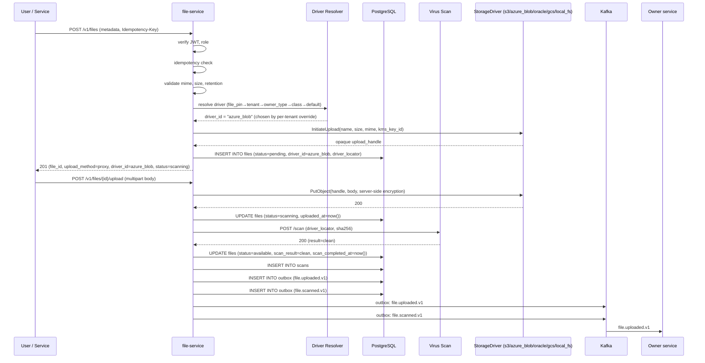
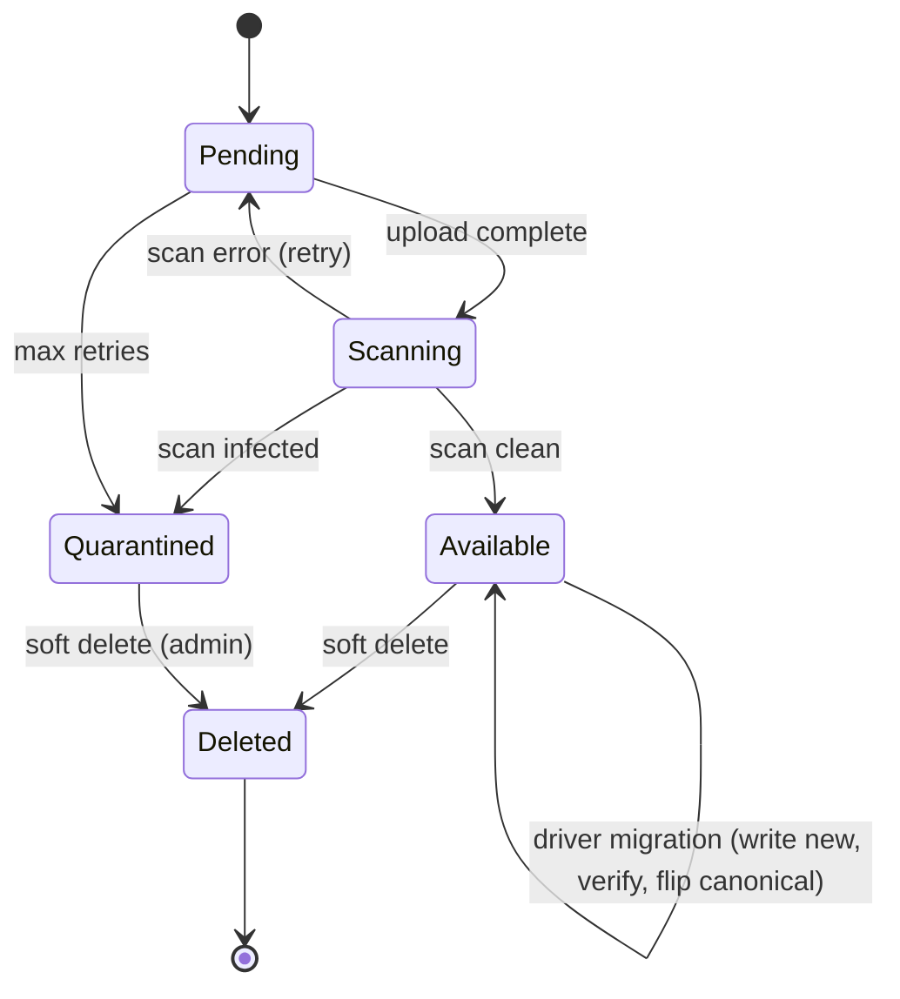
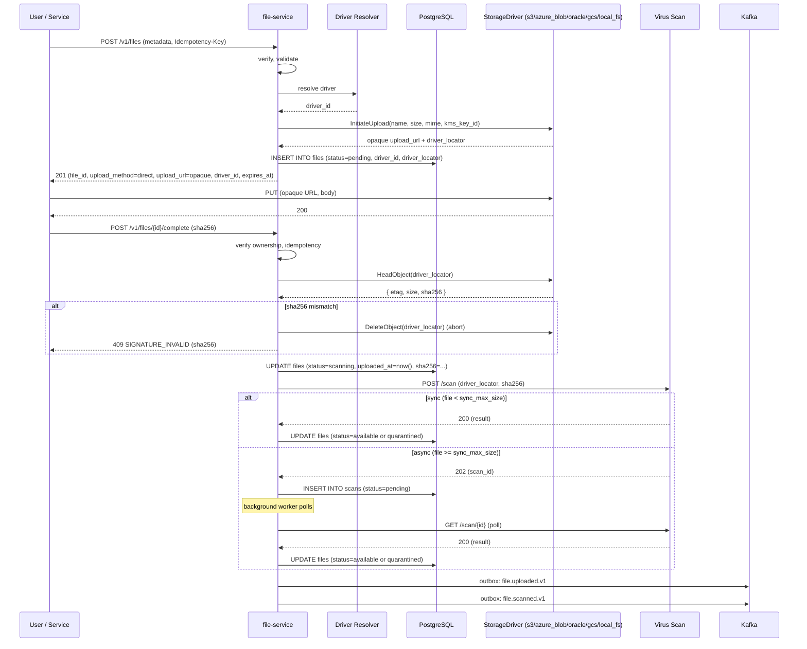
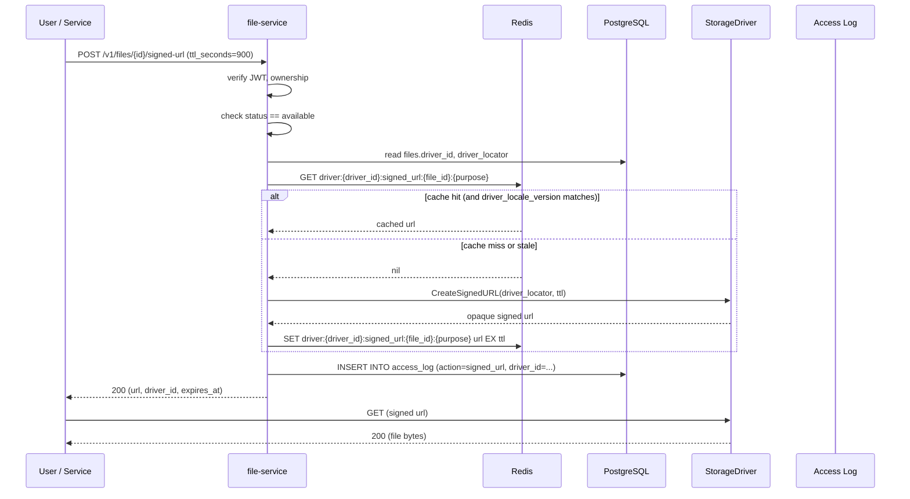
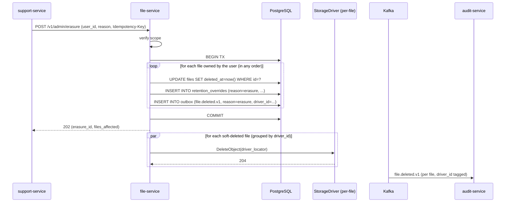
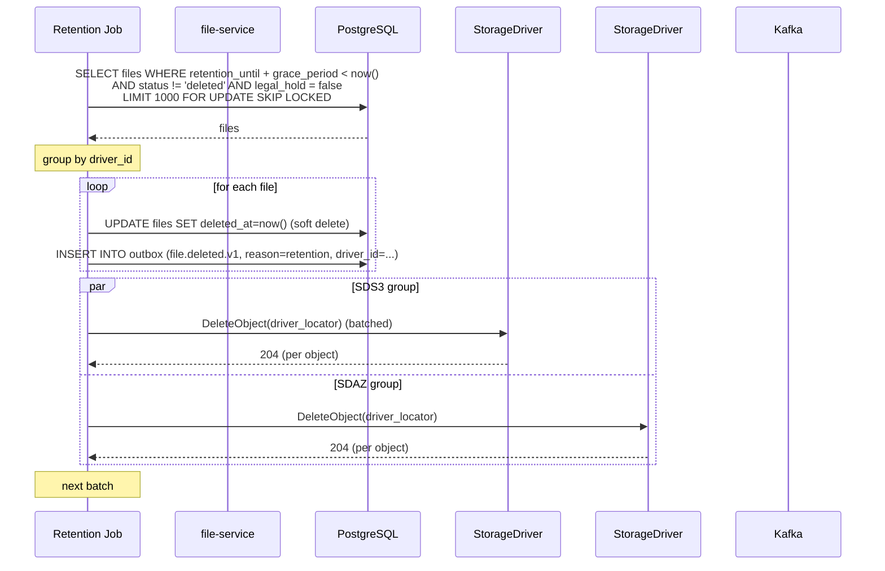
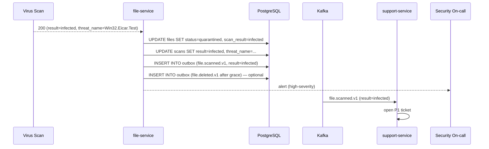
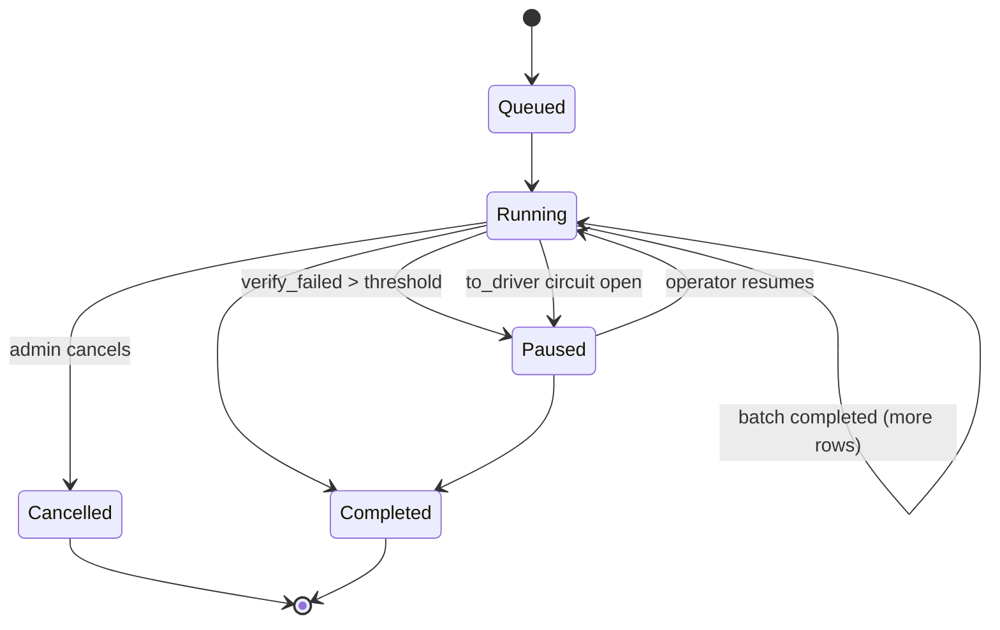
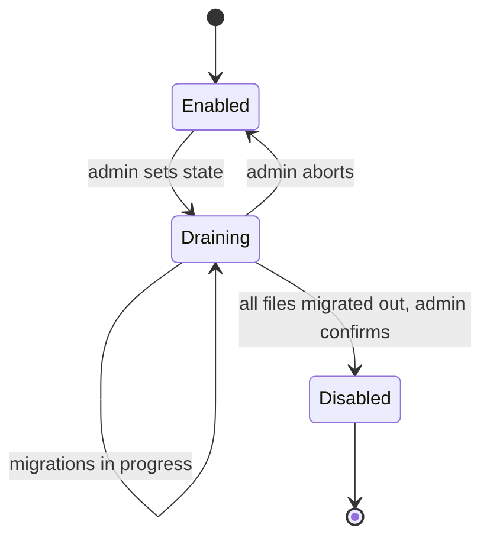
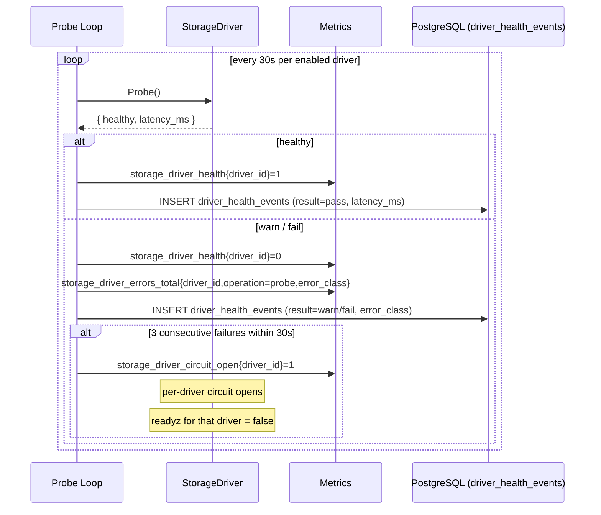

# file-service — Workflows

> Every byte read / written passes through the **Storage
> Driver** layer; workflow diagrams name the participant
> generically as **StorageDriver** unless the diagram
> is describing a driver-specific detail. A workflow
> involving a particular backend says so explicitly
> (e.g. "azure_blob upload URL"). The diagrams below
> use **StorageDriver** as a generic participant that
> any of `s3`, `azure_blob`, `oracle_object_storage`,
> `gcs`, or `local_fs` can substitute into.

## 1. Upload a File (Small, Proxy)

### 1.1 Objective

Upload a small file (≤ 5MB) directly through the service
(proxy flow), pick the Storage Driver that should hold the
bytes via the documented driver-resolution precedence,
virus-scan it, and make it available.

### 1.2 Initiating Actor

The user (via app) or a service (e.g. `customer-service`).

### 1.3 Participating Services

- `file-service` (this service).
- Virus scan provider.
- **StorageDriver** (any of `s3` / `azure_blob` /
  `oracle_object_storage` / `gcs` / `local_fs`).
- Owner service (consumer of `file.uploaded.v1`).

### 1.4 Prerequisites

- Caller is authenticated.
- `Idempotency-Key` provided.
- The mime type is in the allowlist.
- The size is ≤ `file.scan.sync_max_size_bytes` (default
  5MB).

### 1.5 Happy Path



### 1.6 Alternate Paths

- **Async scan** (for large files; the direct-to-driver
  flow): see workflow 2.
- **Scan error** (provider timeout, transient failure):
  the service retries up to 3 times with backoff. If
  persistent, the file is marked `quarantined` and an
  alert fires; ops can re-run the scan.

### 1.7 Failure Paths

- **StorageDriver PUT fails**: per-driver circuit breaker
  opens; the file remains in `pending`; the client
  retries. Other drivers keep serving.
- **Virus scan fails** (provider down): the file is
  marked `pending`; the service retries the scan daily
  for 7 days; if still unscanned, the file is escalated.
- **Mime type not allowed**: 422 `MIME_TYPE_NOT_ALLOWED`.
- **Size too large**: 422 `FILE_TOO_LARGE`.
- **Idempotency-Key reuse with different body**: 422
  `IDEMPOTENCY_KEY_REUSED`.
- **Driver disabled between resolve and call**: 503
  `DRIVER_UNAVAILABLE`; the file is rolled back from
  `pending` (no bytes were written).

### 1.8 Business Rules

- BR--010, BR--011, BR--012, BR--013, BR--017, BR--019,
  BR--030, BR--031, BR--032.
- FR--001..FR--006, FR--012, FR--018, FR--022, FR--030,
  FR--031, FR--032, FR--033.

### 1.9 State Transitions



### 1.10 Events

| Event | Direction | When |
|-------|-----------|------|
| `file.uploaded.v1` | produced | on status → available |
| `file.scanned.v1` | produced | on scan result |

### 1.11 APIs Involved

| API | Direction | When |
|-----|-----------|------|
| `POST /v1/files` | inbound | start of flow |
| `POST /v1/files/{id}/upload` | inbound | upload bytes |
| **StorageDriver.InitiateUpload** | outbound | reserve upload handle |
| **StorageDriver.PutObject** | outbound | store bytes |
| Virus scan | outbound | scan |

### 1.12 Compensation / Rollback

- A failed upload leaves the file in `pending`; the
  StorageDriver object is not created.
- An infected file is `quarantined`; the StorageDriver
  object is preserved for forensic analysis.

### 1.13 Final State

- A `files` row with `status=available`, `scan_result=clean`,
  `driver_id` set.
- A `scans` row with `result=clean`.
- A `driver_object_registry` row binding `(driver_id,
  bucket, object_key)` to `file_id` (uniqueness is
  enforced per-driver).
- A `driver_assignments` row (`source = 'tenant_override'`
  in this trace).
- A StorageDriver object at the resolved `driver_locator`
  with the driver's native server-side encryption.
- An outbox row for `file.uploaded.v1` and
  `file.scanned.v1`.

## 2. Upload a File (Large, Direct-to-Driver)

### 2.1 Objective

Upload a large file (> 5MB) directly to the resolved
Storage Driver using the driver's native upload URL
(S3 v4 presigned PUT, Azure SAS PUT, OCI pre-authenticated
request, GCS v4 signed PUT, or a `local_fs` short-lived
signed-redirect), then notify the service to trigger the
virus scan.

### 2.2 Initiating Actor

The user (via app) or a service.

### 2.3 Participating Services

- `file-service` (this service).
- Virus scan provider.
- **StorageDriver** (any of `s3` / `azure_blob` /
  `oracle_object_storage` / `gcs` / `local_fs`).
- Owner service (consumer).

### 2.4 Prerequisites

- Same as workflow 1, except size > 5MB.

### 2.5 Happy Path



### 2.6 Alternate Paths

- **Direct-to-driver upload fails**: the client retries
  the PUT (URL is still valid until `expires_at`). If
  `expires_at` passes, `POST /v1/files/{id}/complete`
  returns 404 and the client starts over with a new
  `POST /v1/files`.
- **Driver disabled between InitiateUpload and PUT**: the
  `HeadObject` call in `complete` returns 404 (or the
  driver's read endpoint returns a driver-specific
  "object not found"); the service cleans up the orphan
  upload handle and rejects the completion with 503
  `DRIVER_UNAVAILABLE`.
- **Async scan timeout**: the worker retries up to 3
  times; on persistent failure, the file is escalated.

### 2.7 Failure Paths

- **Direct-to-driver URL expired**: 404 on `POST
  /v1/files/{id}/complete`.
- **Driver access denied**: 403 on the PUT; the client
  retries or switches.
- **Virus scan provider down**: same as workflow 1.

### 2.8 Business Rules

Same as workflow 1.

### 2.9 State Transitions

Same as workflow 1.

### 2.10 Events

Same as workflow 1.

### 2.11 APIs Involved

| API | Direction | When |
|-----|-----------|------|
| `POST /v1/files` | inbound | start of flow |
| **StorageDriver.InitiateUpload** | outbound | mint upload URL |
| **StorageDriver (direct PUT)** | client direct | upload bytes |
| `POST /v1/files/{id}/complete` | inbound | trigger scan |
| **StorageDriver.HeadObject** | outbound | verify object presence |
| Virus scan | outbound | scan |

### 2.12 Compensation / Rollback

Same as workflow 1.

### 2.13 Final State

Same as workflow 1.

## 3. Download a File (Signed URL)

### 3.1 Objective

Issue a time-bound signed URL for downloading a file
through its resolved Storage Driver (or proxy-download
for small files).

### 3.2 Initiating Actor

The user (via app) or a service.

### 3.3 Participating Services

- `file-service` (this service).
- **StorageDriver** (any of `s3` / `azure_blob` /
  `oracle_object_storage` / `gcs` / `local_fs`).
- Owner service (not involved; this is a read).

### 3.4 Prerequisites

- Caller is authenticated.
- The file is `available` (not `pending` or
  `quarantined`).
- The file is owned by the caller (or admin / service).

### 3.5 Happy Path



### 3.6 Alternate Paths

- **Proxy download** (for small files): the client calls
  `GET /v1/files/{id}/download`; the service streams
  the bytes via the resolved driver's `GetObject` and
  returns them. The driver access is logged.
- **Service-to-service** (e.g. `support-service` fetching
  a ticket attachment): same flow; the service is
  authorized to read any file.
- **Driver changed since cache write** (a migration ran
  between the cache write and the read): the
  `driver_locale_version` in Redis is bumped; the cache
  is invalidated; a fresh URL is signed by the new
  driver.

### 3.7 Failure Paths

- **File not available**: 409 `FILE_NOT_AVAILABLE`.
- **Driver unreachable**: per-driver circuit breaker
  opens; 503 `DRIVER_UNAVAILABLE` (only on that driver;
  other drivers keep serving).
- **Cache miss + driver sign slow**: 504
  `DEPENDENCY_TIMEOUT` (per driver).

### 3.8 Business Rules

- BR--014, BR--016, BR--021.
- FR--008, FR--009, FR--016, FR--025.

### 3.9 State Transitions

The file state is unchanged. The access log row is
appended.

### 3.10 Events

- No events produced (this is a read).

### 3.11 APIs Involved

| API | Direction | When |
|-----|-----------|------|
| `POST /v1/files/{id}/signed-url` | inbound | start of flow |
| S3 (sign) | outbound | sign the URL |

### 3.12 Compensation / Rollback

- None (a read has no rollback).

### 3.13 Final State

- The client has a signed URL valid for ≤ `ttl_seconds`.
- An access log row records the issuance.

## 4. Right-to-Erasure

### 4.1 Objective

Honor a GDPR / PDPL right-to-erasure request: soft-delete
the user's files and purge them from each file's
resolved Storage Driver within 1 hour.

### 4.2 Initiating Actor

`support-service` (via `POST /v1/admin/erasure` or a
dedicated internal endpoint).

### 4.3 Participating Services

- `file-service` (this service).
- `audit-service` (consumer of `file.deleted.v1`).

### 4.4 Prerequisites

- The actor is `support-service` with the appropriate
  scope.
- The user has been verified.

### 4.5 Happy Path



### 4.6 Alternate Paths

- **Erasure is partial** (e.g. some files are on legal
  hold): the soft delete proceeds for non-held files;
  the held files are not deleted. The actor is informed
  with a list of un-erased file IDs.
- **Driver delete fails** for one specific driver: the
  file is retried hourly until success or 24 h, at
  which point an alert fires. Other drivers' deletions
  succeed independently because of per-driver worker
  pools.

### 4.7 Failure Paths

- **DB write fails**: 500; the erasure is not recorded;
  the caller retries.
- **Driver delete fails**: the file is retried on that
  driver; an alert fires if persistent.

### 4.8 Business Rules

- BR--016, BR--023, BR--030, BR--033.
- FR--014, FR--017.

### 4.9 State Transitions

The file state: `available → deleted` (soft delete).

### 4.10 Events

| Event | Direction | When |
|-------|-----------|------|
| `file.deleted.v1` | produced | on every soft delete (carries `driver_id`) |

### 4.11 APIs Involved

| API | Direction | When |
|-----|-----------|------|
| `POST /v1/admin/erasure` | inbound | start of flow |
| **StorageDriver.DeleteObject** (per file, per driver) | outbound | purge |

### 4.12 Compensation / Rollback

- An erasure is not rolled back. The user must re-upload.

### 4.13 Final State

- `files` rows have `deleted_at` set.
- `retention_overrides` rows record the erasure.
- StorageDriver objects are purged on whichever driver the
  file was on.
- Outbox rows for `file.deleted.v1` (per file, driver
  tag).

## 5. Retention Purge

### 5.1 Objective

Automatically purge files past their class retention
window (per `file.retention.<class>`). Hard deletes are
routed through the file's resolved Storage Driver.

### 5.2 Initiating Actor

A daily background job (or admin trigger).

### 5.3 Participating Services

- `file-service` (this service).
- **StorageDriver(s)** — group hard deletes by driver to
  exploit per-driver worker pools.
- `audit-service` (consumer of `file.deleted.v1`).

### 5.4 Prerequisites

- The retention policy is configured.
- The current date is past `retention_until +
  grace_period`.

### 5.5 Happy Path



### 5.6 Alternate Paths

- **Legal hold**: the file is skipped; the job continues
  with the next file.
- **Manual run** (admin): same flow; the admin sees the
  count of files soft-deleted and hard-deleted, with a
  per-driver breakdown.

### 5.7 Failure Paths

- **A specific driver's DeleteObject fails**: the file
  is retried hourly on that driver; an alert fires if
  persistent. Other drivers continue to purge.
- **DB write fails**: the transaction rolls back; the
  next run retries.

### 5.8 Business Rules

- BR--015, BR--022, BR--030.
- FR--013, FR--017, FR--037.

### 5.9 State Transitions

The file state: `available → deleted` (soft delete,
then hard delete on the file's driver).

### 5.10 Events

| Event | Direction | When |
|-------|-----------|------|
| `file.deleted.v1` | produced | on every soft delete |

### 5.11 APIs Involved

| API | Direction | When |
|-----|-----------|------|
| `POST /v1/admin/retention/run` | inbound | manual run |
| **StorageDriver.DeleteObject** (per file, per driver) | outbound | purge |

### 5.12 Compensation / Rollback

- A purged file cannot be recovered. If purged by mistake,
  the user must re-upload.

### 5.13 Final State

- `files` rows have `deleted_at` set.
- StorageDriver objects are purged.
- Outbox rows for `file.deleted.v1` (per file, driver
  tag).

## 6. Infected File Quarantine

### 6.1 Objective

When the virus scan returns `infected`, the file is
quarantined: no signed URL is issued, and ops is alerted.

### 6.2 Initiating Actor

The virus scan provider returns `infected` (or
`threat_name != null`).

### 6.3 Participating Services

- `file-service` (this service).
- Virus scan provider.
- `support-service` (consumer of `file.scanned.v1` with
  `result=infected`).
- `audit-service` (consumer).

### 6.4 Prerequisites

- The file was uploaded.
- The virus scan returned `infected`.

### 6.5 Happy Path



### 6.6 Alternate Paths

- **False positive** (admin override): the admin marks the
  file as `available` after review; the S3 object is
  preserved.
- **Confirmed threat**: the file is hard-deleted; the
  user is notified; the upload is rejected.

### 6.7 Failure Paths

- **Alert fails**: the on-call is paged by the on-call
  rotation; the file is still quarantined.

### 6.8 Business Rules

- BR--011, BR--021.
- FR--005, FR--006.

### 6.9 State Transitions

The file state: `scanning → quarantined`.

### 6.10 Events

| Event | Direction | When |
|-------|-----------|------|
| `file.scanned.v1` (result=infected) | produced | on infected scan |

### 6.11 APIs Involved

| API | Direction | When |
|-----|-----------|------|
| Virus scan | outbound (provider response) | trigger |

### 6.12 Compensation / Rollback

- The admin can mark a quarantined file as `available`
  (false positive) or hard-delete it (confirmed threat).

### 6.13 Final State

- `files` row with `status=quarantined`, `scan_result=infected`.
- `scans` row with `result=infected`, `threat_name`.
- Outbox row for `file.scanned.v1`.
- A high-severity alert.
- A P1 support ticket.

## 7. Driver Selection on Upload

### 7.1 Objective

Pick the Storage Driver for a new file using the
documented precedence (per-file pin → per-tenant → per-
owner-type → per-retention-class → env default), record
the assignment, and proceed.

### 7.2 Initiating Actor

Internal — fired by `POST /v1/files`.

### 7.3 Participating Services

- `file-service` (this service).
- `configuration-service` (driver catalog + overrides).
- Cache layer (Redis, hot path).

### 7.4 Prerequisites

- A `POST /v1/files` request is in flight.
- The driver catalog is loaded.

### 7.5 Happy Path

```mermaid
sequenceDiagram
    participant F as file-service (uploader)
    participant L1 as Cache (Redis)
    participant L2 as config-service
    participant DB as PostgreSQL

    F->>L1: GET driver_resolve:{tenant}|{owner_type}|{retention_class}|{file_id}
    alt cache hit
        L1-->>F: { driver_id, source, rule_id }
    else cache miss
        F->>L2: GET /v1/config/file/drivers/resolve?tenant_id=...&owner_type=...&retention_class=...&file_id=...
        L2-->>F: { driver_id, source, rule_id } (resolved per precedence)
        F->>L1: SET driver_resolve:... {driver_id,...} EX 60
    end
    Note over F: precedence applied:<br/>1. file_pin (file_id)<br/>2. tenant_override (tenant_id)<br/>3. owner_type_override (owner_type)<br/>4. retention_class_override (retention_class)<br/>5. default (storage_drivers WHERE is_default)
    alt chosen driver is in state 'disabled'
        F->>DB: next-preference loop: try next rule; if none, 503 DRIVER_UNAVAILABLE
    end
    F->>DB: INSERT INTO driver_assignments (source=..., rule_id=..., driver_id=...)
    F->>DB: INSERT INTO file.driver_history (change_type=upload, to_driver_id=...)
    Note over F: resume POST /v1/files with chosen driver
```

### 7.6 Alternate Paths

- **No driver resolves** (catalog empty and no default
  set): 503 `DRIVER_UNAVAILABLE`; the upload is
  rejected.
- **Chosen driver is `draining`**: the upload proceeds
  only if `files` table does not yet have a row; in
  other words, new files are admitted but a re-upload or
  pinning to a draining driver may be rejected.
- **Catalog hot-reload mid-flight**: the next upload uses
  the new resolved driver; in-flight uploads use the
  driver they resolved to.

### 7.7 Failure Paths

- **`config-service` down** on a cold start with empty
  cache: 503 `DRIVER_UNAVAILABLE`; client retries.
- **Cache inconsistency**: bypassed; service writes
  through.

### 7.8 Business Rules

- BR--026, BR--031, BR--033.

### 7.9 State Transitions

No file state change (pre-insert).

### 7.10 Events

None yet (event is on the eventual upload completion).

### 7.11 APIs Involved

| API | Direction | When |
|-----|-----------|------|
| `config-service GET /v1/config/file/drivers/resolve` | outbound | resolve driver |
| `file.storage_drivers` SELECT | DB | list candidates |
| `file.driver_assignments` INSERT | DB | record choice |
| `file.driver_history` INSERT (upload) | DB | record bootstrap |

### 7.12 Compensation / Rollback

- If the rest of the upload fails, the
  `driver_assignments` row remains (it is just an audit
  trace of "we picked this driver for this file");
  no rollback needed.

### 7.13 Final State

- `driver_assignments.source` and `rule_id` are recorded.
- `files.driver_id` and `files.driver_locator` are set
  on the eventual upload.

## 8. Driver Migration (Single File)

### 8.1 Objective

Move a single file's canonical bytes from one Storage
Driver to another, verify SHA-256, flip the canonical
`driver_id`, and emit `file.migrated.v1`.

### 8.2 Initiating Actor

`admin-service` (via `POST /v1/admin/migrations`).

### 8.3 Participating Services

- `file-service` (this service, migrator role).
- **Two StorageDrivers**: `from_driver_id`,
  `to_driver_id`.
- `audit-service` (consumer of `file.migrated.v1`).
- Owner service (consumer of `file.migrated.v1`,
  optional cache invalidation).

### 8.4 Prerequisites

- The file exists (`status = available`, owner has not
  erased).
- Both drivers are configured and healthy.
- `to_driver_id` is not `disabled`.

### 8.5 Happy Path

```mermaid
sequenceDiagram
    participant ADM as admin-service
    participant MIG as file-service (migrator)
    participant DB as PostgreSQL
    participant SDS as StorageDriver (from)
    participant SDT as StorageDriver (to)
    participant K as Kafka
    participant AUD as audit-service

    ADM->>MIG: POST /v1/admin/migrations (mode=single, file_id, to_driver_id)
    MIG->>DB: BEGIN TX
    MIG->>DB: SELECT files WHERE id=? FOR UPDATE
    DB-->>MIG: file (driver_id, driver_locator, sha256)
    MIG->>DB: INSERT INTO driver_history (change_type=migrate, from=..., to=..., migration_id=...)
    MIG->>SDT: InitiateUpload(name, size, mime, kms_key_id)
    SDT-->>MIG: upload_handle
    MIG->>SDS: GetObject(from_locator)
    SDS-->>MIG: stream (verify sha256 on the fly)
    MIG->>SDT: PutObject(handle, stream)
    SDT-->>MIG: 200 (ETag)
    MIG->>SDT: HeadObject
    SDT-->>MIG: { etag, size }
    alt sha256 matches AND size matches
        MIG->>DB: UPDATE files SET driver_id=to, driver_locator=..., driver_locale_version = driver_locale_version + 1
        MIG->>DB: UPDATE driver_history SET verified_sha256=true, to_sha256=...
        MIG->>SDS: DeleteObject(from_locator) (post-dual-write-window; or immediately if window=0)
        MIG->>DB: COMMIT
        MIG->>DB: INSERT INTO outbox (file.migrated.v1)
        MIG->>K: file.migrated.v1
        K->>AUD: file.migrated.v1
    else mismatch
        MIG->>SDT: DeleteObject(handle) (cleanup partial)
        MIG->>DB: ROLLBACK
        MIG->>DB: INSERT INTO driver_history (change_type=rollback)
        MIG-->>ADM: 503 MIGRATION_VERIFY_FAILED
    end
```

### 8.6 Alternate Paths

- **Source driver is unreachable**: the migration is
  retried; on persistent failure it is paused and an
  alert fires.
- **Destination driver circuit is open**: the migration
  is re-queued; an alert fires.
- **Dual write window**: if `dual_write_window_days > 0`,
  the source bytes are kept for that many days before
  deletion (clock starts now). Within the window, the
  file is served from the new driver; the source is
  cleaned by the reconciliation job.

### 8.7 Failure Paths

- **SHA-256 mismatch on destination**: rollback per
  diagram; alert fires; migration worker will retry
  with backoff; after 5 failed attempts the migration is
  paused for manual review.
- **Destination driver write succeeds but HeadObject
  fails**: same rollback.
- **DB transaction fails** mid-flight: the destination
  object is cleaned up; the canonical `driver_id` was
  never flipped.

### 8.8 Business Rules

- BR--026, BR--028, BR--030, BR--032, BR--033, BR--034.
- FR--035, FR--036, FR--037.

### 8.9 State Transitions

File state unchanged. The canonical `driver_id` flips
atomically inside a transaction. The
`driver_locale_version` increments.

### 8.10 Events

| Event | Direction | When |
|-------|-----------|------|
| `file.migrated.v1` | produced | on successful flip |

### 8.11 APIs Involved

| API | Direction | When |
|-----|-----------|------|
| `POST /v1/admin/migrations` | inbound | start |
| **StorageDriver.GetObject** (from) | outbound | read source |
| **StorageDriver.PutObject** (to) | outbound | write destination |
| **StorageDriver.HeadObject** (to) | outbound | verify |
| **StorageDriver.DeleteObject** (from, after dual-write window) | outbound | cleanup |
| `GET /v1/admin/migrations/{id}` | inbound | progress poll |

### 8.12 Compensation / Rollback

- On any failure post-write, the destination object is
  deleted and the canonical `driver_id` is left
  unchanged. The source bytes are untouched.

### 8.13 Final State

- `files.driver_id`, `files.driver_locator`,
  `files.driver_locale_version` are updated.
- A `driver_history` row with `change_type='migrate'`,
  `verified_sha256=true`.
- The source driver's object is deleted (immediately or
  after the dual-write window).
- Outbox row for `file.migrated.v1`.

## 9. Driver Migration (Bulk, e.g. Data-Residency)

### 9.1 Objective

Move a large set of files between drivers (e.g. all EU
KYC files from `s3` to `azure_blob`) with a controllable
rate, verifiable integrity, and the same happy-path
guarantees per file.

### 9.2 Initiating Actor

`admin-service` (via `POST /v1/admin/migrations`,
`mode=bulk`).

### 9.3 Participating Services

- `file-service` (migrator worker pool, partitioned per
  `(from, to)`).
- Two StorageDrivers.
- `audit-service`.

### 9.4 Prerequisites

- Both drivers configured and healthy.
- A bulk filter (e.g. `owner_type`, `tenant_id`,
  `retention_class`).

### 9.5 Happy Path

```mermaid
sequenceDiagram
    participant ADM as admin-service
    participant MIG as file-service (migrator)
    participant DB as PostgreSQL
    participant SDS as StorageDriver (from)
    participant SDT as StorageDriver (to)
    participant K as Kafka

    ADM->>MIG: POST /v1/admin/migrations (mode=bulk, filter=..., from=, to=)
    MIG->>DB: INSERT INTO migrations (state=queued, filter=..., ...)
    MIG->>DB: SELECT files WHERE filter AND driver_id=from LIMIT batch_size FOR UPDATE SKIP LOCKED
    DB-->>MIG: batch of files
    loop per file in batch
        MIG->>SDS: GetObject(from_locator)
        SDS-->>MIG: stream
        MIG->>SDT: PutObject(handle, stream)
        SDT-->>MIG: 200
        alt sha256 matches
            MIG->>DB: UPDATE files SET driver_id=to, driver_locator=..., driver_locale_version++
            MIG->>DB: INSERT INTO driver_history (migrate, verified=true)
            MIG->>DB: INSERT INTO outbox (file.migrated.v1)
        else mismatch
            MIG->>SDT: DeleteObject (cleanup)
            MIG->>DB: INSERT INTO driver_history (rollback)
            MIG->>DB: UPDATE migrations SET verify_failed = verify_failed + 1
        end
    end
    MIG->>DB: SELECT files WHERE filter AND driver_id=from LIMIT batch_size FOR UPDATE SKIP LOCKED
    Note over MIG: continue until no more rows<br/>(emits file.migrated.v1 per file via outbox; see per-file workflow §8)
```

### 9.6 Alternate Paths

- **Resumability**: the migrator tracks `last_file_id`
  per batch in the `migrations` row; killing the worker
  is safe.
- **Throttling**: `file.migration.max_concurrent_per_driver`
  caps the in-flight per-driver operations.
- **Source driver circuit open**: the worker pauses and
  emits a health event; resumes when the breaker
  half-opens.
- **Cancellation** (admin `POST
  /v1/admin/migrations/{id}/cancel`): the in-flight
  files finish; no new files are picked.

### 9.7 Failure Paths

- **Verify failures > 0.1% of the batch**: pause, alert.
- **Driver write succeeds but HeadObject fails**: per-file
  rollback; counted under verify failure.
- **Destination driver completely down**: the migration
  is paused; ops is paged.

### 9.8 Business Rules

- BR--028, BR--030, BR--032, BR--033, BR--034, BR--038.

### 9.9 State Transitions

Per-file state unchanged. Per-file canonical `driver_id`
flips as in §8. The migration has its own state machine
(see sub-diagram).



### 9.10 Events

| Event | Direction | When |
|-------|-----------|------|
| `file.migrated.v1` (per file) | produced | per successful flip |

### 9.11 APIs Involved

| API | Direction | When |
|-----|-----------|------|
| `POST /v1/admin/migrations` | inbound | start |
| `GET /v1/admin/migrations/{id}` | inbound | progress |
| `POST /v1/admin/migrations/{id}/cancel` | inbound | cancel |
| **StorageDriver.GetObject** (from) | outbound | per file |
| **StorageDriver.PutObject** (to) | outbound | per file |

### 9.12 Compensation / Rollback

- Per-file compensation as in §8.
- Bulk rollback (operator-triggered): the migrator
  reverses direction with the same logic on the same
  filter; a `driver_history` `change_type='migrate'` row
  records the reversal.

### 9.13 Final State

- `migrations.state = 'completed'` (or `'cancelled'`).
- Every affected file's `driver_id` flips (or stays if
  verify failed).
- A `driver_history` row per file.

## 10. Driver Drain & Decommission

### 10.1 Objective

Decommission a Storage Driver (e.g. leaving
`oracle_object_storage` for `s3`) without losing files
and without leaving the API surface inconsistent.

### 10.2 Initiating Actor

`admin-service` (via `POST /v1/admin/drivers/{id}` —
not documented in this revision; an admin form that
walks the operator through the four steps below).
Alternatively, automatic health-flap detection can
trigger step 1.

### 10.3 Participating Services

- `file-service` (driver catalog, migrator).
- One StorageDriver being drained.
- (Optionally) a replacement StorageDriver.

### 10.4 Prerequisites

- Health of the target driver is at least "degraded"
  (for `auto_drain`) or the operator has decided to
  decommission it (manual drain).

### 10.5 Happy Path

```mermaid
sequenceDiagram
    participant OPS as Operator / admin-service
    participant CAT as Driver Catalog
    participant MIG as Migrator
    participant DB as PostgreSQL
    participant SDS as Old Driver

    OPS->>CAT: STEP 1: state=disabled new uploads on the target driver
    Note over CAT: storage_drivers.state = 'draining' (SET in admin API or by health auto-flip)
    CAT-->>OPS: 200
    OPS->>MIG: STEP 2: enqueue a bulk migration away from the target
    MIG-->>OPS: 202 (migration_id)
    Note over MIG: continues until 0 files have driver_id = target OR rate goes below threshold
    OPS->>MIG: STEP 3 (only if needed): poll GET /v1/admin/migrations/{id} until completed
    OPS->>CAT: STEP 4: state=disabled (no traffic; no objects left)
    CAT-->>OPS: 200
```

### 10.6 Alternate Paths

- **Decommission without replacement** (delete the
  driver entirely): the operator must first run a bulk
  migration away from the target; only then can the
  driver row be removed.
- **Abort a drain** (`state = 'enabled'`): in-flight
  migrations continue; new files will land on the
  recovered driver unless the catalog overrides say
  otherwise.

### 10.7 Failure Paths

- **Verify failures during step 2**: the migration is
  paused; ops inspects the driver_history rows; only
  after all failures are resolved can step 4 proceed.
- **Step 2 leaves files behind** (operator's first
  migration filter was wrong): ops cancels the
  migration, adjusts the filter, restarts.

### 10.8 Business Rules

- BR--026, BR--027, BR--030, BR--035.

### 10.9 State Transitions



### 10.10 Events

None directly; the per-file `file.migrated.v1` events
are produced.

### 10.11 APIs Involved

| API | Direction | When |
|-----|-----------|------|
| `POST /v1/admin/drivers/{id}` (state change) | inbound | step 1 + step 4 |
| `POST /v1/admin/migrations` | inbound | step 2 |
| `GET /v1/admin/migrations/{id}` | inbound | step 3 (poll) |

### 10.12 Compensation / Rollback

- Returning to `state='enabled'` restores the driver as
  a candidate for new uploads; it does not unwind a
  migration.

### 10.13 Final State

- `storage_drivers.state = 'disabled'` (or row removed).
- A `driver_history` row per migrated file.
- No `files.driver_locator` still references the
  decommissioned driver.

## 11. Driver Health Probe & Circuit Breaker

### 11.1 Objective

Detect per-driver degradation early enough to fail fast
without taking down the service, and to keep the per-
driver readiness in `/ready` honest.

### 11.2 Initiating Actor

Background probe (every 30 s).

### 11.3 Participating Services

- `file-service` (probe).
- **StorageDriver(s)**.
- Metrics layer.

### 11.4 Prerequisites

- The driver has a `Probe` operation in its API.

### 11.5 Happy Path



### 11.6 Alternate Paths

- **Driver half-open after 60 s**: one synthetic probe
  is allowed; success closes the breaker.

### 11.7 Failure Paths

- **Probe itself fails** (e.g. timeout): the result is
  recorded as `fail`; the breaker logic runs as usual.

### 11.8 Business Rules

- BR--026, BR--033, BR--034, BR--035.

### 11.9 State Transitions

The driver catalog transitions:

```
healthy -> degraded   (one failure)
degraded -> healthy   (one success)
degraded -> unreachable (3 consecutive failures; circuit open)
unreachable -> degraded (half-open probe success; circuit closed)
```

### 11.10 Events

None; signals are pushed via metrics and the catalog.

### 11.11 APIs Involved

| API | Direction | When |
|-----|-----------|------|
| **StorageDriver.Probe** | outbound | every 30 s |
| `/ready/drivers/{id}` | inbound | reported |

### 11.12 Compensation / Rollback

- Operator can manually `POST /v1/admin/drivers/{id}`
  (set `state = 'enabled'`) to override the breaker
  with a signed, audited action.

### 11.13 Final State

- `storage_drivers.health` and `health_last_checked_at`
  are updated.
- A `driver_health_events` row is appended.

---

---

## See also

### Sibling docs for this service

- [`README.md`](./README.md) — purpose, bounded context, responsibilities
- [`BRD.md`](./BRD.md) — business requirements
- [`SRS.md`](./SRS.md) — functional + non-functional requirements
- [`ERD.md`](./ERD.md) — data model (entities, relationships)
- [`INTEGRATION.md`](./INTEGRATION.md) — inter-service contracts (APIs, events, sagas)
- [`WORKFLOWS.md`](./WORKFLOWS.md) — operational workflows (happy paths, failure modes)
- [`TECH.md`](./TECH.md) — technology profile (runtime, libraries, data layer, admin endpoints, RBAC)

### Platform-wide

- [`../../shared/README.md`](../../shared/README.md) — `platform-spring-boot-starter` shared library (the single source of cross-cutting code for all Spring Boot services in the platform)
- [`../RECOMMENDATIONS.md`](../RECOMMENDATIONS.md) — platform-wide technology map (language, framework, version baseline, admin/RBAC pattern)
- [`../../README.md`](../../README.md) — services overview (the catalog of all 58 services)
- [`../../../main.md`](../../../main.md) — top-level platform specification (architecture, Keycloak, PostgreSQL 18, messaging, observability baseline)

