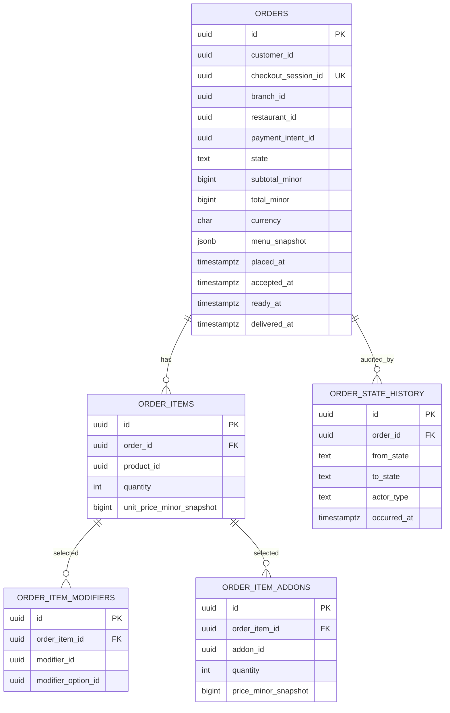

# food-order-service — Entity-Relationship Diagram

## 1. Database

- Engine: **PostgreSQL 18**.
- Schema: `food_order` (owned exclusively by this service).
- Migrations: `services/food-order-service/prisma/migrations/`.
- Partitioning: `orders` is range-partitioned by month on
  `placed_at`.

## 2. Cross-Service References

| Column | Type | Refers to | Source of truth |
|--------|------|-----------|------------------|
| `orders.customer_id` | UUID | Customer | `customer-service` |
| `orders.cart_id` | UUID | Cart | ``food-order-service` (cart)` |
| `orders.checkout_session_id` | UUID | Checkout session | ``food-order-service` (checkout)` |
| `orders.branch_id` | UUID | Branch | ``restaurant-service` (branch)` |
| `orders.restaurant_id` | UUID | Restaurant | `restaurant-service` |
| `orders.address_id` | UUID | Saved address | ``customer-service` (addresses)` |
| `orders.payment_intent_id` | UUID | Payment intent | `payment-service` |
| `orders.food_order_id` (delivery ref) | UUID | Delivery | ``courier-service` (delivery)` |
| `order_items.product_id` | UUID | Product | ``restaurant-service` (menu)` |
| `order_items.menu_item_id` | UUID | (snapshot) | ``restaurant-service` (menu)` |
| `order_item_modifiers.modifier_id` | UUID | Modifier | ``restaurant-service` (menu)` |
| `order_item_modifiers.modifier_option_id` | UUID | Modifier option | ``restaurant-service` (menu)` |
| `order_item_addons.addon_id` | UUID | Add-on | ``restaurant-service` (menu)` |

All cross-service references are stored as columns **without**
database-level foreign keys.

## 3. Entities

### `orders`

A food order. Partitioned by month on `placed_at`.

#### Columns

| Column | Type | Constraints | Notes |
|--------|------|-------------|-------|
| `id` | UUID | PK | UUIDv7 |
| `customer_id` | UUID | NOT NULL | cross-service ref |
| `cart_id` | UUID | NOT NULL | cross-service ref |
| `checkout_session_id` | UUID | NOT NULL UNIQUE | cross-service ref |
| `branch_id` | UUID | NOT NULL | cross-service ref |
| `restaurant_id` | UUID | NOT NULL | cross-service ref |
| `address_id` | UUID | NOT NULL | cross-service ref |
| `payment_intent_id` | UUID | NOT NULL | cross-service ref |
| `state` | TEXT | NOT NULL DEFAULT 'placed' CHECK in (...) | lifecycle |
| `subtotal_minor` | BIGINT | NOT NULL CHECK (subtotal_minor >= 0) | snapshot |
| `tax_minor` | BIGINT | NOT NULL CHECK (tax_minor >= 0) | snapshot |
| `delivery_fee_minor` | BIGINT | NOT NULL CHECK (delivery_fee_minor >= 0) | snapshot |
| `tip_minor` | BIGINT | NOT NULL DEFAULT 0 | snapshot |
| `total_minor` | BIGINT | NOT NULL CHECK (total_minor >= 0) | snapshot |
| `currency` | CHAR(3) | NOT NULL CHECK (currency ~ '^[A-Z]{3}$') | |
| `promotion_code` | TEXT | NULL | snapshot |
| `promotion_discount_minor` | BIGINT | NOT NULL DEFAULT 0 | snapshot |
| `slot_start_at` | TIMESTAMPTZ | NOT NULL | snapshot |
| `slot_end_at` | TIMESTAMPTZ | NOT NULL | snapshot |
| `menu_snapshot` | JSONB | NOT NULL | menu at order time |
| `branch_hours_snapshot` | JSONB | NOT NULL | branch hours at order time |
| `tax_snapshot` | JSONB | NOT NULL | tax at order time |
| `cancellation_reason_code` | TEXT | NULL | if cancelled |
| `cancellation_reason_text` | TEXT | NULL | |
| `cancellation_fee_minor` | BIGINT | NULL | |
| `cancellation_refund_minor` | BIGINT | NULL | |
| `cancellation_actor_kc_sub` | UUID | NULL | |
| `rejection_reason_code` | TEXT | NULL | if rejected |
| `rejection_reason_text` | TEXT | NULL | |
| `rejection_actor_kc_sub` | UUID | NULL | |
| `delivery_id` | UUID | NULL | set on `courier_assigned` |
| `placed_at` | TIMESTAMPTZ | NOT NULL DEFAULT now() | |
| `accepted_at` | TIMESTAMPTZ | NULL | |
| `preparing_at` | TIMESTAMPTZ | NULL | |
| `ready_at` | TIMESTAMPTZ | NULL | |
| `courier_assigned_at` | TIMESTAMPTZ | NULL | |
| `picked_up_at` | TIMESTAMPTZ | NULL | |
| `delivered_at` | TIMESTAMPTZ | NULL | |
| `cancelled_at` | TIMESTAMPTZ | NULL | |
| `rejected_at` | TIMESTAMPTZ | NULL | |
| `last_state_change_at` | TIMESTAMPTZ | NOT NULL DEFAULT now() | |

#### Indexes

- PK on `id` (per partition).
- UNIQUE on `checkout_session_id` (per partition).
- Index on `(customer_id, placed_at DESC)`.
- Index on `(restaurant_id, state, placed_at DESC)`.
- Index on `(branch_id, state, placed_at DESC)`.
- Index on `(state, placed_at)`.

### `order_items`

A line item in the order (snapshot).

#### Columns

| Column | Type | Constraints | Notes |
|--------|------|-------------|-------|
| `id` | UUID | PK | UUIDv7 |
| `order_id` | UUID | NOT NULL, FK to `orders.id` (partitioned) | |
| `product_id` | UUID | NOT NULL | cross-service ref |
| `product_name_snapshot` | TEXT | NOT NULL | |
| `quantity` | INTEGER | NOT NULL CHECK (quantity > 0) | |
| `unit_price_minor_snapshot` | BIGINT | NOT NULL | |
| `currency` | CHAR(3) | NOT NULL | |
| `special_instructions` | TEXT | NULL | |
| `created_at` | TIMESTAMPTZ | NOT NULL DEFAULT now() | |

#### Indexes

- PK on `id`.
- Index on `(order_id)`.

### `order_item_modifiers`

A modifier selection for an item (snapshot).

#### Columns

| Column | Type | Constraints | Notes |
|--------|------|-------------|-------|
| `id` | UUID | PK | UUIDv7 |
| `order_item_id` | UUID | NOT NULL, FK to `order_items.id` | |
| `modifier_id` | UUID | NOT NULL | cross-service ref |
| `modifier_option_id` | UUID | NOT NULL | cross-service ref |
| `name_snapshot` | TEXT | NOT NULL | |
| `price_modifier_minor_snapshot` | BIGINT | NOT NULL DEFAULT 0 | |
| `currency` | CHAR(3) | NOT NULL | |
| `created_at` | TIMESTAMPTZ | NOT NULL DEFAULT now() | |

### `order_item_addons`

An add-on selection for an item (snapshot).

#### Columns

| Column | Type | Constraints | Notes |
|--------|------|-------------|-------|
| `id` | UUID | PK | UUIDv7 |
| `order_item_id` | UUID | NOT NULL, FK to `order_items.id` | |
| `addon_id` | UUID | NOT NULL | cross-service ref |
| `name_snapshot` | TEXT | NOT NULL | |
| `quantity` | INTEGER | NOT NULL DEFAULT 1 | |
| `price_minor_snapshot` | BIGINT | NOT NULL | |
| `currency` | CHAR(3) | NOT NULL | |
| `created_at` | TIMESTAMPTZ | NOT NULL DEFAULT now() | |

### `order_state_history`

Append-only history of state transitions.

#### Columns

| Column | Type | Constraints | Notes |
|--------|------|-------------|-------|
| `id` | UUID | PK | UUIDv7 |
| `order_id` | UUID | NOT NULL, FK to `orders.id` (partitioned) | |
| `from_state` | TEXT | NULL | null for initial |
| `to_state` | TEXT | NOT NULL CHECK in (...) | |
| `actor_kc_sub` | UUID | NULL | null for system |
| `actor_type` | TEXT | NOT NULL CHECK in (...) | `customer`, `support_agent`, `platform_admin`, `restaurant_staff`, `system` |
| `reason_code` | TEXT | NULL | required for cancel, reject, manual |
| `reason_text` | TEXT | NULL | |
| `correlation_id` | UUID | NOT NULL | trace |
| `occurred_at` | TIMESTAMPTZ | NOT NULL DEFAULT now() | |

#### Indexes

- PK on `id`.
- Index on `(order_id, occurred_at DESC)`.

### `outbox`

Transactional outbox for events.

#### Columns

| Column | Type | Constraints | Notes |
|--------|------|-------------|-------|
| `id` | UUID | PK | UUIDv7 |
| `aggregate_type` | TEXT | NOT NULL | `FoodOrder` |
| `aggregate_id` | UUID | NOT NULL | partition key |
| `event_name` | TEXT | NOT NULL | `food.order.*.v1` |
| `event_id` | UUID | NOT NULL UNIQUE | dedup |
| `payload` | JSONB | NOT NULL | envelope |
| `headers` | JSONB | NOT NULL DEFAULT '{}' | Kafka headers |
| `created_at` | TIMESTAMPTZ | NOT NULL DEFAULT now() | |
| `claimed_at` | TIMESTAMPTZ | NULL | poller-set |
| `published_at` | TIMESTAMPTZ | NULL | poller-set |

#### Indexes

- PK on `id`.
- Index on `(published_at NULLS FIRST, created_at)`.

### `inbox`

Consumer-side dedup.

#### Columns

| Column | Type | Constraints | Notes |
|--------|------|-------------|-------|
| `event_id` | UUID | PK | |
| `consumer` | TEXT | NOT NULL | |
| `received_at` | TIMESTAMPTZ | NOT NULL DEFAULT now() | |
| `processed_at` | TIMESTAMPTZ | NULL | |
| `error` | TEXT | NULL | |

## 4. Mermaid ER Diagram



## 5. DDL Sketch

```sql
CREATE SCHEMA IF NOT EXISTS food_order;

-- Partitioned by month on placed_at
CREATE TABLE food_order.orders (
    id UUID NOT NULL,
    customer_id UUID NOT NULL,
    cart_id UUID NOT NULL,
    checkout_session_id UUID NOT NULL,
    branch_id UUID NOT NULL,
    restaurant_id UUID NOT NULL,
    address_id UUID NOT NULL,
    payment_intent_id UUID NOT NULL,
    state TEXT NOT NULL DEFAULT 'placed' CHECK (state IN
        ('placed','accepted','rejected','preparing','ready',
         'courier_assigned','picked_up','delivered',
         'cancelled')),
    subtotal_minor BIGINT NOT NULL CHECK (subtotal_minor >= 0),
    tax_minor BIGINT NOT NULL CHECK (tax_minor >= 0),
    delivery_fee_minor BIGINT NOT NULL CHECK (delivery_fee_minor >= 0),
    tip_minor BIGINT NOT NULL DEFAULT 0,
    total_minor BIGINT NOT NULL CHECK (total_minor >= 0),
    currency CHAR(3) NOT NULL CHECK (currency ~ '^[A-Z]{3}$'),
    promotion_code TEXT,
    promotion_discount_minor BIGINT NOT NULL DEFAULT 0,
    slot_start_at TIMESTAMPTZ NOT NULL,
    slot_end_at TIMESTAMPTZ NOT NULL,
    menu_snapshot JSONB NOT NULL,
    branch_hours_snapshot JSONB NOT NULL,
    tax_snapshot JSONB NOT NULL,
    cancellation_reason_code TEXT,
    cancellation_reason_text TEXT,
    cancellation_fee_minor BIGINT,
    cancellation_refund_minor BIGINT,
    cancellation_actor_kc_sub UUID,
    rejection_reason_code TEXT,
    rejection_reason_text TEXT,
    rejection_actor_kc_sub UUID,
    delivery_id UUID,
    placed_at TIMESTAMPTZ NOT NULL DEFAULT now(),
    accepted_at TIMESTAMPTZ,
    preparing_at TIMESTAMPTZ,
    ready_at TIMESTAMPTZ,
    courier_assigned_at TIMESTAMPTZ,
    picked_up_at TIMESTAMPTZ,
    delivered_at TIMESTAMPTZ,
    cancelled_at TIMESTAMPTZ,
    rejected_at TIMESTAMPTZ,
    last_state_change_at TIMESTAMPTZ NOT NULL DEFAULT now(),
    PRIMARY KEY (id, placed_at)
) PARTITION BY RANGE (placed_at);

-- Create initial partitions
CREATE TABLE IF NOT EXISTS food_order.orders_2026_07 PARTITION OF food_order.orders
    FOR VALUES FROM ('2026-07-01 00:00:00+00') TO ('2026-08-01 00:00:00+00');

-- Verify the child is actually attached to the correct parent with
-- the expected bounds. IF NOT EXISTS only guards the name; it does
-- not verify bounds.
DO $$
DECLARE
    v_parent   REGCLASS := 'food_order.orders'::REGCLASS;
    v_child    REGCLASS := 'food_order.orders_2026_07'::REGCLASS;
    v_expected TSTZRANGE := tstzrange('2026-07-01 00:00:00+00',
                                      '2026-08-01 00:00:00+00',
                                      '[)');
BEGIN
    IF (SELECT inhparent FROM pg_inherits WHERE inhrelid = v_child)
       IS DISTINCT FROM v_parent THEN
        RAISE EXCEPTION 'partition % is not attached to %',
            v_child::text, v_parent::text;
    END IF;
    IF NOT (SELECT relpartbound FROM pg_class WHERE oid = v_child)
              = v_expected THEN
        RAISE EXCEPTION 'partition % has unexpected bounds', v_child::text;
    END IF;
END $$;

CREATE TABLE IF NOT EXISTS food_order.orders_2026_08 PARTITION OF food_order.orders
    FOR VALUES FROM ('2026-08-01 00:00:00+00') TO ('2026-09-01 00:00:00+00');
-- ... maintenance job creates future partitions

CREATE UNIQUE INDEX orders_checkout_session_id_uniq
    ON food_order.orders (checkout_session_id, placed_at);

CREATE INDEX orders_customer_idx
    ON food_order.orders (customer_id, placed_at DESC);

CREATE INDEX orders_restaurant_state_idx
    ON food_order.orders (restaurant_id, state, placed_at DESC);

CREATE INDEX orders_branch_state_idx
    ON food_order.orders (branch_id, state, placed_at DESC);

CREATE INDEX orders_state_idx
    ON food_order.orders (state, placed_at);

-- Order items, modifiers, addons are not partitioned (FK to partitioned parent)
CREATE TABLE food_order.order_items (
    id UUID PRIMARY KEY,
    order_id UUID NOT NULL,
    placed_at TIMESTAMPTZ NOT NULL,
    product_id UUID NOT NULL,
    product_name_snapshot TEXT NOT NULL,
    quantity INTEGER NOT NULL CHECK (quantity > 0),
    unit_price_minor_snapshot BIGINT NOT NULL,
    currency CHAR(3) NOT NULL,
    special_instructions TEXT,
    created_at TIMESTAMPTZ NOT NULL DEFAULT now(),
    FOREIGN KEY (order_id, placed_at) REFERENCES food_order.orders(id, placed_at)
);

CREATE INDEX order_items_order_idx
    ON food_order.order_items (order_id);

CREATE TABLE food_order.order_item_modifiers (
    id UUID PRIMARY KEY,
    order_item_id UUID NOT NULL REFERENCES food_order.order_items(id),
    modifier_id UUID NOT NULL,
    modifier_option_id UUID NOT NULL,
    name_snapshot TEXT NOT NULL,
    price_modifier_minor_snapshot BIGINT NOT NULL DEFAULT 0,
    currency CHAR(3) NOT NULL,
    created_at TIMESTAMPTZ NOT NULL DEFAULT now()
);

CREATE TABLE food_order.order_item_addons (
    id UUID PRIMARY KEY,
    order_item_id UUID NOT NULL REFERENCES food_order.order_items(id),
    addon_id UUID NOT NULL,
    name_snapshot TEXT NOT NULL,
    quantity INTEGER NOT NULL DEFAULT 1,
    price_minor_snapshot BIGINT NOT NULL,
    currency CHAR(3) NOT NULL,
    created_at TIMESTAMPTZ NOT NULL DEFAULT now()
);

CREATE TABLE food_order.order_state_history (
    id UUID PRIMARY KEY,
    order_id UUID NOT NULL,
    placed_at TIMESTAMPTZ NOT NULL,
    from_state TEXT,
    to_state TEXT NOT NULL CHECK (to_state IN
        ('placed','accepted','rejected','preparing','ready',
         'courier_assigned','picked_up','delivered',
         'cancelled')),
    actor_kc_sub UUID,
    actor_type TEXT NOT NULL CHECK (actor_type IN
        ('customer','support_agent','platform_admin',
         'restaurant_staff','system')),
    reason_code TEXT,
    reason_text TEXT,
    correlation_id UUID NOT NULL,
    occurred_at TIMESTAMPTZ NOT NULL DEFAULT now(),
    FOREIGN KEY (order_id, placed_at) REFERENCES food_order.orders(id, placed_at)
);

CREATE INDEX order_state_history_order_idx
    ON food_order.order_state_history (order_id, occurred_at DESC);

CREATE TABLE food_order.outbox (
    id UUID PRIMARY KEY,
    aggregate_type TEXT NOT NULL,
    aggregate_id UUID NOT NULL,
    event_name TEXT NOT NULL,
    event_id UUID NOT NULL UNIQUE,
    payload JSONB NOT NULL,
    headers JSONB NOT NULL DEFAULT '{}'::jsonb,
    created_at TIMESTAMPTZ NOT NULL DEFAULT now(),
    claimed_at TIMESTAMPTZ,
    published_at TIMESTAMPTZ
);

CREATE INDEX outbox_pending_idx
    ON food_order.outbox (published_at NULLS FIRST, created_at);

CREATE TABLE food_order.inbox (
    event_id UUID PRIMARY KEY,
    consumer TEXT NOT NULL,
    received_at TIMESTAMPTZ NOT NULL DEFAULT now(),
    processed_at TIMESTAMPTZ,
    error TEXT
);
```

## 6. Audit Columns

`orders` has the lifecycle timestamps (`placed_at`,
`accepted_at`, etc.) and `last_state_change_at`.
`order_state_history` is the canonical audit log. There is no
separate `audit_log` table.

## 7. Soft Delete

No soft delete. Orders are financial records and are never
hard-deleted within the 7-year retention.

## 8. JSONB Usage

- `orders.menu_snapshot`, `orders.branch_hours_snapshot`,
  `orders.tax_snapshot` — configuration snapshot.
- `outbox.payload` and `outbox.headers` for the event
  envelope.
- No other JSONB.

## 9. Partitioning

`orders` is range-partitioned by month on `placed_at`. A
maintenance job creates the next 3 months of partitions. Old
partitions are detached and archived after
`food_order.partition.retention_months` (default 84 = 7
years).

`order_items` and `order_state_history` are not partitioned
themselves; they have a composite FK to `(order_id,
placed_at)`.

See [`DATABASE_ARCHITECTURE.md` §"Table Partitioning — Canonical Template"](../../architecture/DATABASE_ARCHITECTURE.md) for the idempotent `CREATE TABLE IF NOT EXISTS … PARTITION OF …` pattern, naming convention, and the service-owned maintenance-job contract (advisory lock, verification, retention/mixed-retention handling).

## 10. Data Retention

| Table | Retention | Purged by |
|-------|-----------|-----------|
| `orders` (partitions) | 7 years (financial) | partition detach + archive |
| `order_items` | with order | hard delete with order partition |
| `order_item_modifiers` | with order | hard delete with order partition |
| `order_item_addons` | with order | hard delete with order partition |
| `order_state_history` | 7 years | hard delete with order partition |
| `outbox` | 24 h after `published_at` | scheduled job |
| `inbox` | 30 days | scheduled job |

## 11. Migration Considerations

- The partitioned `orders` table requires careful migration
  planning. Adding a column is forward-only; the new column is
  added to the parent and propagates to all partitions.
- The composite FK from `order_items` to `orders(id,
  placed_at)` enforces "an order item belongs to the same
  partition as its order."
- The state machine is enforced in application code (and via
  CHECK constraints on the `state` column).
- The `cancellation_fee_minor` and `cancellation_refund_minor`
  are computed at cancellation time using the configured
  policy.
- The order creation consumer is idempotent via inbox dedup;
  a duplicate `checkout.completed.v1` is a no-op (the
  `checkout_session_id` UNIQUE constraint catches duplicates
  that bypass the inbox).

---

## Appendix A — Predecessor tables absorbed (restaurant-order-mgmt)

The tables below were migrated from `restaurant_order_mgmt.*` as
part of [ADR-0016](../../architecture/adrs/0016-service-domain-consolidation.md).
The canonical source is [`../../MIGRATION_HUB.md`](../../MIGRATION_HUB.md) §3.9.
The old schema name remains readable as a view in the `food_order`
schema for at least six months from 2026-08-05.

### A.1 Tables absorbed

| Old schema.table | New schema.table | Notes |
|------------------|------------------|-------|
| `restaurant_order_mgmt.queue` | `food_order.queue` | state: `pending_accept\|accepted\|preparing\|ready\|rejected` |
| `restaurant_order_mgmt.timers` | `food_order.queue_timers` | accept-window timer per order |
| `restaurant_order_mgmt.rejections` | `food_order.queue_rejections` | |

### A.2 DDL sketch (migrated entities)

```sql
CREATE TABLE food_order.queue (
    food_order_id UUID PRIMARY KEY,
    branch_id UUID NOT NULL,
    state TEXT NOT NULL CHECK (state IN ('pending_accept','accepted','preparing','ready','rejected')),
    placed_at TIMESTAMPTZ NOT NULL,
    accepted_at TIMESTAMPTZ,
    rejected_at TIMESTAMPTZ,
    preparing_at TIMESTAMPTZ,
    ready_at TIMESTAMPTZ,
    rejection_reason TEXT
);

CREATE TABLE food_order.queue_timers (
    food_order_id UUID PRIMARY KEY REFERENCES food_order.queue(food_order_id),
    expires_at TIMESTAMPTZ NOT NULL
);

CREATE TABLE food_order.queue_rejections (
    food_order_id UUID PRIMARY KEY REFERENCES food_order.queue(food_order_id),
    reason TEXT NOT NULL,
    rejected_at TIMESTAMPTZ NOT NULL DEFAULT now(),
    rejected_by TEXT NOT NULL -- 'operator' | 'TIMER_EXPIRED'
);
```

### A.3 Compatibility views (≥ 6 months)

```sql
CREATE VIEW restaurant_order_mgmt.queue AS TABLE food_order.queue;
CREATE VIEW restaurant_order_mgmt.timers AS TABLE food_order.queue_timers;
CREATE VIEW restaurant_order_mgmt.rejections AS TABLE food_order.queue_rejections;
```

---

## See also

### Sibling docs for this service

- [`README.md`](./README.md) — purpose, bounded context, responsibilities
- [`BRD.md`](./BRD.md) — business requirements
- [`SRS.md`](./SRS.md) — functional + non-functional requirements
- [`ERD.md`](./ERD.md) — data model (entities, relationships)
- [`INTEGRATION.md`](./INTEGRATION.md) — inter-service contracts (APIs, events, sagas)
- [`WORKFLOWS.md`](./WORKFLOWS.md) — operational workflows (happy paths, failure modes)
- [`TECH.md`](./TECH.md) — technology profile (runtime, libraries, data layer, admin endpoints, RBAC)

### Platform-wide

- [`../../shared/README.md`](../../shared/README.md) — `platform-spring-boot-starter` shared library (the single source of cross-cutting code for all Spring Boot services in the platform)
- [`../RECOMMENDATIONS.md`](../RECOMMENDATIONS.md) — platform-wide technology map (language, framework, version baseline, admin/RBAC pattern)
- [`../../README.md`](../../README.md) — services overview (the catalog of all 58 services)
- [`../../../main.md`](../../../main.md) — top-level platform specification (architecture, Keycloak, PostgreSQL 18, messaging, observability baseline)

