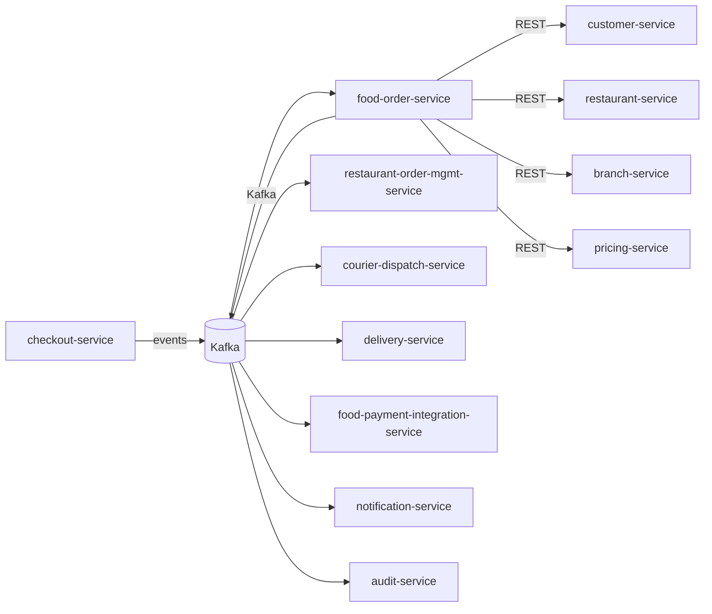

# food-order-service — Software Requirements Specification

## 1. Introduction

This SRS specifies the software behavior of `food-order-service`.
It covers functional requirements, non-functional requirements,
data requirements, API contract summaries, validation, state
transitions, authorization, idempotency, performance,
availability, security, and disaster recovery. The service is
the source of truth for the `FoodOrder` aggregate.

## 2. Scope

In scope:

- Order creation (on `checkout.completed.v1`).
- Order state machine.
- Configuration snapshot at creation.
- Cancellation policy enforcement.
- State history.
- Manual state transitions (admin / customer service).

Out of scope:

- Cart contents (owned by `cart-service`; read-only).
- Checkout session (owned by `checkout-service`; read-only).
- Kitchen view (owned by `restaurant-order-mgmt-service`).
- Delivery (owned by `delivery-service`).
- Payment intent (owned by `payment-service`).
- Menu (owned by `menu-service`; read-only at snapshot time).

## 3. System Context

## 4. Actors

- **Customer (human)** — Keycloak subject with role
  `customer`.
- **Customer Service (human)** — Keycloak subject with role
  `support_agent`.
- **Platform Admin (human)** — Keycloak subject with role
  `platform_admin`.
- **`checkout-service` (system)** — emits
  `checkout.completed.v1`.
- **`restaurant-order-mgmt-service` (system)** — state
  transitions (accept, reject, preparing, ready).
- **`courier-dispatch-service` (system)** — read; matches
  couriers.
- **`delivery-service` (system)** — read; delivery state.
- **`food-payment-integration-service` (system)** — read;
  triggers refunds.
- **`notification-service` (system)** — customer notifications.
- **`audit-service` (system)** — audit events.

## 5. Functional Requirements

| ID | Requirement | Priority |
|----|-------------|----------|
| FR--001 | The service MUST consume `checkout.completed.v1` and create an order in `state = placed`. | MUST |
| FR--002 | The service MUST snapshot the configuration (menu, prices, tax, items) at order creation. | MUST |
| FR--003 | The service MUST enforce the state machine: `placed → accepted → preparing → ready → courier_assigned → picked_up → delivered`, or `cancelled` / `rejected`. | MUST |
| FR--004 | The service MUST accept `POST /v1/orders/{id}/cancellation` (customer) and apply the cancellation policy. | MUST |
| FR--005 | The service MUST expose `GET /v1/orders/{id}/cancellation-fee` to preview the fee. | SHOULD |
| FR--006 | The service MUST accept `POST /v1/orders/{id}/state-transition` (admin / system) for manual transitions with a `reason_code`. | MUST |
| FR--007 | The service MUST consume `food.order.accepted.v1` and transition the order to `accepted`. | MUST |
| FR--008 | The service MUST consume `food.order.rejected.v1` and transition the order to `rejected`. | MUST |
| FR--009 | The service MUST consume `food.order.preparing.v1` and transition the order to `preparing`. | MUST |
| FR--010 | The service MUST consume `food.order.ready.v1` and transition the order to `ready`. | MUST |
| FR--011 | The service MUST record every state transition in `order_state_history`. | MUST |
| FR--012 | The service MUST support cursor pagination on `GET /v1/orders/by-customer/{customer_id}` and `by-restaurant`, `by-branch`. | MUST |
| FR--013 | The service MUST publish a `food.order.*.v1` event for every state change. | MUST |
| FR--014 | The service MUST reject illegal state transitions with 409 `STATE_INVALID`. | MUST |
| FR--015 | The service MUST emit `admin.audit.order.*` events for every admin action. | MUST |

## 6. Non-Functional Requirements

| ID | Category | Requirement | Target |
|----|----------|-------------|--------|
| NFR--001 | performance | P99 `GET /v1/orders/{id}` | < 200 ms (cache hit < 30 ms) |
| NFR--002 | performance | P99 `POST /v1/orders/{id}/cancellation` | < 500 ms |
| NFR--003 | performance | P99 order creation (on `checkout.completed.v1`) | < 1 s |
| NFR--004 | availability | service uptime | 99.95% over 30 days |
| NFR--005 | scalability | `get order` lookups | ≥ 10,000 RPS via Redis |
| NFR--006 | scalability | concurrent state changes | ≥ 1,000 RPS |
| NFR--007 | maintainability | MTTR for P1 | < 30 min |
| NFR--008 | data-integrity | zero event loss | outbox + 24 h ack |
| NFR--009 | retention | order data | 7 years (financial) |
| NFR--010 | observability | every state change queryable in audit | 100% |

## 7. API Requirements

REST API under `/v1/orders[...]` per
[`API_STANDARDS.md`](../../architecture/API_STANDARDS.md). All
write endpoints require `Idempotency-Key`. Cursor pagination by
default. OpenAPI 3.1 spec at `/openapi.json`.

(Full contracts in `INTEGRATION.md`.)

## 8. Data Requirements

| ID | Requirement | Notes |
|----|-------------|-------|
| DATA--001 | Orders are uniquely identified by `id UUIDv7`. | primary key |
| DATA--002 | `customer_id` is a UUID column with no DB FK. | cross-service ref |
| DATA--003 | `cart_id` is a UUID column with no DB FK. | cross-service ref |
| DATA--004 | `checkout_session_id` is a UUID column with no DB FK. | cross-service ref |
| DATA--005 | `restaurant_id`, `branch_id` are UUID columns with no DB FK. | cross-service ref |
| DATA--006 | `payment_intent_id` is a UUID column with no DB FK. | cross-service ref |
| DATA--007 | `state` is a CHECK-constrained enum. | lifecycle |
| DATA--008 | `subtotal_minor`, `tax_minor`, `delivery_fee_minor`, `tip_minor`, `total_minor` are non-negative integers; `currency` is ISO-4217. | money |
| DATA--009 | `menu_snapshot` is a JSONB column with the menu at order time. | snapshot |
| DATA--010 | `branch_hours_snapshot` is a JSONB column with the branch hours at order time. | snapshot |
| DATA--011 | `placed_at`, `accepted_at`, `preparing_at`, `ready_at`, `picked_up_at`, `delivered_at`, `cancelled_at`, `rejected_at` are TIMESTAMPTZ. | timestamps |

(Full schema in `ERD.md`.)

## 9. Validation Rules

- `cancellation_reason_code` — drawn from
  `food_order.cancellation.reason_codes` (or the policy).
- `state_transition_reason_code` — drawn from
  `food_order.state_transition.reason_codes`.
- The `POST /cancellation` is only valid in `placed`,
  `accepted`, or `preparing` state.

## 10. State Transitions

| From | To | Trigger |
|------|----|---------|
| (none) | `placed` | `checkout.completed.v1` |
| `placed` | `accepted` | `food.order.accepted.v1` (from `restaurant-order-mgmt-service`) |
| `placed` | `rejected` | `food.order.rejected.v1` (from `restaurant-order-mgmt-service`) |
| `placed` | `cancelled` | `POST /cancellation` (within full-refund window) |
| `accepted` | `preparing` | `food.order.preparing.v1` |
| `accepted` | `cancelled` | `POST /cancellation` (within partial-refund window) |
| `preparing` | `ready` | `food.order.ready.v1` |
| `preparing` | `cancelled` | `POST /cancellation` (no refund after ready) — actually, no, see rule |
| `ready` | `courier_assigned` | `delivery.courier.assigned.v1` (from `delivery-service` or `courier-dispatch-service`) |
| `courier_assigned` | `picked_up` | `delivery.pickup.v1` (from `delivery-service`) |
| `picked_up` | `delivered` | `delivery.completed.v1` (from `delivery-service`) |
| `delivered` | — | terminal |
| `cancelled` | — | terminal |
| `rejected` | — | terminal |

State transitions are described in detail in `WORKFLOWS.md`.

## 11. Authorization Requirements

- `customer` may read own orders (`order.customer_id == sub`);
  may cancel per the policy.
- `support_agent` may read; may perform manual state
  transitions with a `reason_code`.
- `platform_admin` has full access and may perform all
  transitions.
- Service-to-service via `client_credentials`.

## 12. Configuration Requirements

- `food_order.cancellation.full_refund_window_minutes` — int
  (default 5).
- `food_order.cancellation.partial_refund_window_minutes` —
  int (default 15).
- `food_order.cancellation.partial_refund_pct` — int (default
  50).
- `food_order.cancellation.no_refund_after_ready` — bool
  (default true).
- `food_order.cancellation.reason_codes` — array<string>.
- `food_order.partition.retention_months` — int (default 84).
- `feature_flag.food_order.scheduled_orders_enabled` — bool.

## 13. Error Handling

| Error | Response |
|-------|----------|
| Body validation failure | 400 `VALIDATION_FAILED` with `details[]` |
| Missing/invalid JWT | 401 `UNAUTHENTICATED` |
| Insufficient role | 403 `FORBIDDEN` |
| Order not found | 404 `ORDER_NOT_FOUND` |
| Illegal state transition | 409 `STATE_INVALID` |
| Cancellation after ready | 409 `CANCEL_NOT_ALLOWED` |
| Idempotency key reused | 422 `IDEMPOTENCY_KEY_REUSED` |
| Rate limited | 429 `RATE_LIMITED` |
| Downstream timeout | 503 `DEPENDENCY_TIMEOUT` |
| Circuit open | 503 `CIRCUIT_OPEN` |
| Other | 500 `INTERNAL_ERROR` |

## 14. Concurrency Requirements

- Two concurrent state transitions on the same order MUST be
  serialized via row-level lock; the second one receives 409
  if the first changed the state.
- The `POST /cancellation` and a `food.order.rejected.v1` may
  race; the row-level lock ensures only one succeeds.

## 15. Idempotency Requirements

- All write endpoints require `Idempotency-Key`.
- The order creation consumer is idempotent via inbox dedup.
- All state transitions use the outbox pattern with `event_id`
  dedup.

## 16. Performance

- Dominant path: `GET /v1/orders/{id}`. P50 < 5 ms (cache
  hit), P99 < 30 ms.
- Order creation: P50 < 200 ms, P99 < 1 s.
- Cancellation: P50 < 100 ms, P99 < 500 ms.

## 17. Scalability

- Horizontal: HPA on CPU > 60% and
  `http_requests_in_flight > 500/replica`; max 12.
- Vertical: up to 4 CPU / 8 GiB.
- DB: 1 primary + 1 read replica in each region.
- Cache: Redis cluster, key `order:{id}` TTL 30 s.
- Partitioning: `orders` is range-partitioned by month on
  `placed_at`.

## 18. Availability

- SLO: 99.95% over 30 days.
- Error budget: ~22 min / 30 days.
- Maintenance: Sunday 04:00–06:00 UTC.

## 19. Security

| ID | Requirement | Notes |
|----|-------------|-------|
| SEC--001 | All endpoints require a valid JWT; service-to-service uses `client_credentials`. | gateway enforced |
| SEC--002 | Admin actions require `X-Audit-Reason` and HMAC-SHA256 signature. | `API_STANDARDS.md` §14 |
| SEC--003 | Resource-level ownership checks. | `order.customer_id == sub` |
| SEC--004 | All cross-service calls use mTLS + `client_credentials` JWT. | defense in depth |
| SEC--005 | Secrets only in Vault. | pre-commit enforced |
| SEC--006 | Rate limiting at gateway and service. | `API_STANDARDS.md` §12 |
| SEC--007 | No PII beyond the customer's id and the address id. | minimal |
| SEC--008 | Admin actions emit `admin.audit.order.*` events. | `audit-service` |
| SEC--009 | The service stores no card data; PCI scope is none. | SAQ-A |

## 20. Privacy

- PII stored: customer id, address id; the order contents are
  the financial record.
- Retention: 7 years (financial).
- Erasure: not directly supported (financial record retention).

## 21. Auditability

- Every state transition emits a `food.order.*.v1` event.
- Every state transition is recorded in `order_state_history`.
- Every admin action emits an `admin.audit.order.*` event.
- Audit retention: 7 years.

## 22. Observability

- Logs: JSON to stdout with `correlation_id`, `trace_id`,
  `order_id`, `customer_id`, `restaurant_id`, `state`,
  `from_state`, `to_state`, `actor`, `reason_code`.
- Metrics:
  - RED: standard.
  - Business: `orders_placed_total{restaurant_id}`,
    `orders_accepted_total{restaurant_id}`,
    `orders_rejected_total{reason}`,
    `orders_cancelled_total{reason}`,
    `orders_delivered_total{restaurant_id}`,
    `order_acceptance_seconds`,
    `order_prep_seconds`,
    `order_cancellation_rate{reason}`.
- Traces: OpenTelemetry.
- Alerts: SLO burn rate, outbox lag, restaurant acceptance
  rate.

## 23. Maintainability

- TypeScript strict, ESLint, Prettier.
- Coverage: ≥ 85% lines.
- Documentation: this folder.

## 24. Disaster Recovery

- RPO: 5 min (PITR 30 days for Tier-1).
- RTO: 30 min.
- Quarterly restore drill.

## 25. Acceptance Criteria

- AC-1: An order is created on `checkout.completed.v1` within
  1 s.
- AC-2: The order snapshot includes all relevant fields.
- AC-3: Customer cancellation is per the policy.
- AC-4: Restaurant rejection triggers a full refund.
- AC-5: All state changes are emitted as events.
- AC-6: All state transitions are recorded in
  `order_state_history`.
- AC-7: The service meets its 99.95% SLO.
- AC-8: The order is immutable except for state.
- AC-9: The service stores no card data.
- AC-10: Orders are persisted for 7 years.

---

## See also

### Sibling docs for this service

- [`README.md`](./README.md) — purpose, bounded context, responsibilities
- [`BRD.md`](./BRD.md) — business requirements
- [`SRS.md`](./SRS.md) — functional + non-functional requirements
- [`ERD.md`](./ERD.md) — data model (entities, relationships)
- [`INTEGRATION.md`](./INTEGRATION.md) — inter-service contracts (APIs, events, sagas)
- [`WORKFLOWS.md`](./WORKFLOWS.md) — operational workflows (happy paths, failure modes)
- [`TECH.md`](./TECH.md) — technology profile (runtime, libraries, data layer, admin endpoints, RBAC)

### Platform-wide

- [`../../shared/README.md`](../../shared/README.md) — `platform-spring-boot-starter` shared library (the single source of cross-cutting code for all Spring Boot services in the platform)
- [`../RECOMMENDATIONS.md`](../RECOMMENDATIONS.md) — platform-wide technology map (language, framework, version baseline, admin/RBAC pattern)
- [`../../README.md`](../../README.md) — services overview (the catalog of all 58 services)
- [`../../../main.md`](../../../main.md) — top-level platform specification (architecture, Keycloak, PostgreSQL 18, messaging, observability baseline)

