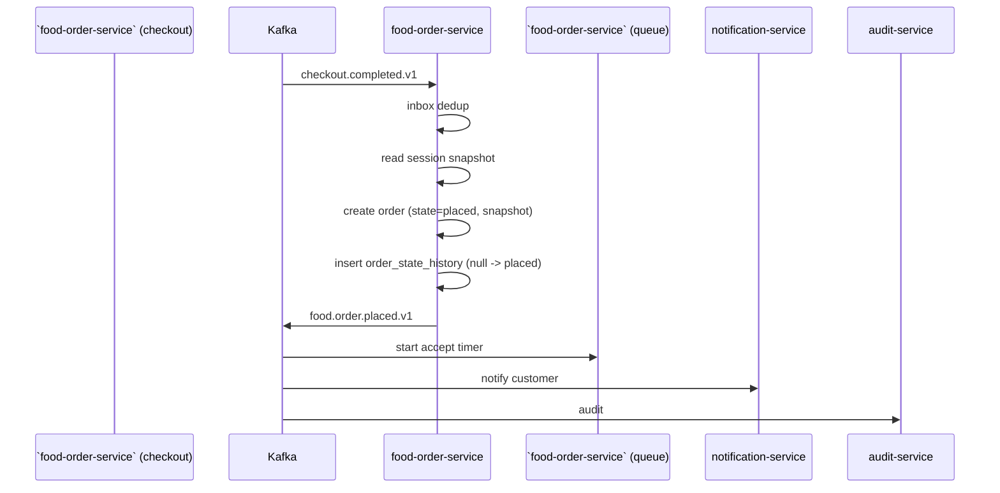
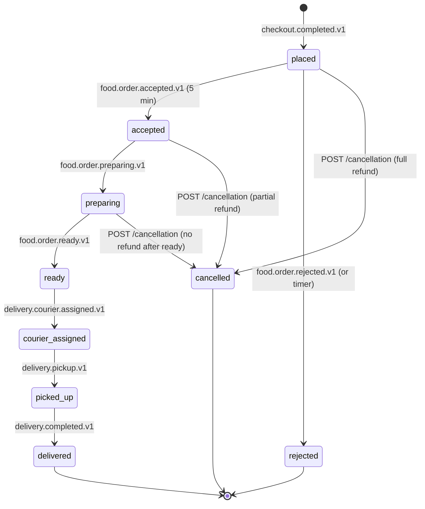

# food-order-service — Workflows

## 1. Order Creation (on `checkout.completed.v1`)

### 1.1 Objective

When `checkout.completed.v1` is received, the order is created
in `state = placed` with the configuration snapshot. The
`food.order.placed.v1` event is emitted and consumed by
``food-order-service` (queue)` to start the restaurant
accept timer.

### 1.2 Initiating Actor

``food-order-service` (checkout)` (system) via `checkout.completed.v1`.

### 1.3 Participating Services

- `food-order-service` (this service).
- ``food-order-service` (queue)` (downstream — accept timer).
- `notification-service` (inform customer).
- ``reporting-service` (data lake)`, `audit-service`.

### 1.4 Prerequisites

- `checkout.completed.v1` is received.
- Inbox dedup passes.

### 1.5 Happy Path



### 1.6 Alternate Paths

- **Duplicate `checkout.completed.v1`**: inbox dedup; the
  `checkout_session_id` UNIQUE constraint catches any
  duplicates that bypass the inbox.
- **Order creation fails**: the outbox row is rolled back
  (atomicity); the consumer retries on the next event
  delivery.

### 1.7 Failure Paths

- **Outbox failure**: outbox retried; DLQ.

### 1.8 Business Rules

- The order is created in `state = placed`.
- The configuration snapshot is taken from the checkout
  session; the order is immutable except for state.

### 1.9 State Transitions

The relevant transition is `(none) → placed`. (See state
diagram in §2.9.)

### 1.10 Events

| Event | Direction | When |
|-------|-----------|------|
| `checkout.completed.v1` | consumed | trigger |
| `food.order.placed.v1` | produced | on creation |

### 1.11 APIs Involved

| API | Direction | When |
|-----|-----------|------|
| (no inbound API for this workflow) | | |

### 1.12 Compensation / Rollback

- **Order creation fails**: the consumer retries; if
  persistent, the row goes to DLQ and the on-call is paged.

### 1.13 Final State

The order is `placed`; the restaurant accept timer is running;
the customer is informed.

## 2. Order State Machine (Acceptance → Delivery)

### 2.1 Objective

The order progresses through the state machine driven by
events from ``food-order-service` (queue)`,
``courier-service` (dispatch)`, and ``courier-service` (delivery)`. Every
transition is recorded in `order_state_history` and emits a
`food.order.*.v1` event.

### 2.2 Initiating Actor

System events from the relevant services.

### 2.3 Participating Services

- `food-order-service` (this service).
- ``food-order-service` (queue)` (accept, reject, preparing,
  ready).
- ``courier-service` (dispatch)` (courier assignment).
- ``courier-service` (delivery)` (pickup, delivery).
- `notification-service` (customer notifications).
- `audit-service`.

### 2.4 Prerequisites

- The order is in the relevant source state.
- The event is received and inbox-deduped.

### 2.5 Happy Path



### 2.6 Alternate Paths

- **Restaurant doesn't accept in 5 minutes**: the
  ``food-order-service` (queue)` timer fires
  `food.order.rejected.v1` with `reason_code = "auto_reject"`;
  the order is `rejected`; the
  ``payment-service` (food saga)` refunds.
- **Customer cancels before ready**: per the policy.
- **Customer cancels after ready**: 409 `CANCEL_NOT_ALLOWED`.

### 2.7 Failure Paths

- **Outbox failure**: outbox retried.

### 2.8 Business Rules

- The state machine is enforced server-side; illegal
  transitions return 409 `STATE_INVALID`.
- Every transition is recorded in `order_state_history` with
  the actor, reason, and correlation_id.

### 2.9 Events

| Event | Direction | When |
|-------|-----------|------|
| `food.order.placed.v1` | produced | on creation |
| `food.order.accepted.v1` | consumed / produced | accepted |
| `food.order.rejected.v1` | consumed / produced | rejected |
| `food.order.preparing.v1` | consumed / produced | preparing |
| `food.order.ready.v1` | consumed / produced | ready |
| `food.order.cancelled.v1` | produced | customer cancel |
| `delivery.courier.assigned.v1` | consumed | courier assigned |
| `delivery.pickup.v1` | consumed | picked up |
| `delivery.completed.v1` | consumed | delivered |

### 2.10 APIs Involved

| API | Direction | When |
|-----|-----------|------|
| `POST /v1/orders/{id}/state-transition` | inbound | manual transition |

### 2.11 Compensation / Rollback

- **Wrong state transition**: admin issues another transition
  to correct.
- **Rejection needs undo**: rare; admin can re-create the
  order from the cart (the order is the financial record).

### 2.12 Final State

The order is `delivered`, `cancelled`, or `rejected`.

## 3. Customer Cancellation

### 3.1 Objective

Customer cancels the order per the cancellation policy:
- Within `food_order.cancellation.full_refund_window_minutes`
  (default 5) of placement: full refund, no fee.
- Within `food_order.cancellation.partial_refund_window_minutes`
  (default 15) of placement: partial refund
  (`partial_refund_pct`% fee).
- After the partial window but before ready: full fee (no
  refund).
- After ready: 409 `CANCEL_NOT_ALLOWED`.

### 3.2 Initiating Actor

`customer` (human).

### 3.3 Participating Services

- `food-order-service` (this service).
- ``payment-service` (food saga)` (downstream — refund).
- `notification-service` (inform customer and restaurant).
- `audit-service`.

### 3.4 Prerequisites

- The order is in `placed`, `accepted`, or `preparing` state.
- The customer is the owner of the order.

### 3.5 Happy Path (Partial Refund)

```mermaid
sequenceDiagram
    participant C as Customer
    participant FOR as food-order-service
    participant K as Kafka
    participant FPI as `payment-service` (food saga)
    participant NOT as notification-service
    participant AUD as audit-service

    C->>FOR: POST /v1/orders/{id}/cancellation {reason_code, Idempotency-Key}
    FOR->>FOR: row-level lock; state in (placed, accepted, preparing)
    FOR->>FOR: compute fee per policy
    FOR->>FOR: state=cancelled; cancellation_fee_minor; cancellation_refund_minor
    FOR->>FOR: insert order_state_history
    FOR->>K: food.order.cancelled.v1
    K->>FPI: trigger refund
    K->>NOT: notify customer and restaurant
    K->>AUD: audit
    FOR-->>C: 200 {cancellation_fee_minor, cancellation_refund_minor}
```

### 3.6 Alternate Paths

- **Full refund (within full window)**: same code path with
  `cancellation_fee_minor = 0`.
- **No refund (after partial window)**: same code path with
  `cancellation_refund_minor = 0`.
- **After ready**: 409 `CANCEL_NOT_ALLOWED`.
- **Already cancelled**: 409 `STATE_INVALID`.

### 3.7 Failure Paths

- **Outbox failure**: outbox retried.

### 3.8 Business Rules

- The fee is computed at cancellation time using the policy.
- The order transitions to `cancelled`; the
  ``payment-service` (food saga)` consumes the event and
  processes the refund.

### 3.9 State Transitions

The relevant transition is
`placed|accepted|preparing → cancelled`.

### 3.10 Events

| Event | Direction | When |
|-------|-----------|------|
| `food.order.cancelled.v1` | produced | on cancel |

### 3.11 APIs Involved

| API | Direction | When |
|-----|-----------|------|
| `POST /v1/orders/{id}/cancellation` | inbound | customer cancel |

### 3.12 Compensation / Rollback

- The order is terminal in `cancelled`; the customer must
  create a new order (the cart is not auto-restored).

### 3.13 Final State

The order is `cancelled`; the refund is initiated; the
customer is informed.

## 4. Restaurant Rejection

### 4.1 Objective

The restaurant operator rejects the order (via
``food-order-service` (queue)`). The order transitions to
`rejected`; a full refund is initiated.

### 4.2 Initiating Actor

``food-order-service` (queue)` (system) via
`food.order.rejected.v1`.

### 4.3 Participating Services

- `food-order-service` (this service).
- ``payment-service` (food saga)` (downstream — refund).
- `notification-service` (inform customer).
- `audit-service`.

### 4.4 Prerequisites

- The order is in `placed` state.
- The event is received and inbox-deduped.

### 4.5 Happy Path

```mermaid
sequenceDiagram
    participant ROM as `food-order-service` (queue)
    participant K as Kafka
    participant FOR as food-order-service
    participant FPI as `payment-service` (food saga)
    participant NOT as notification-service
    participant AUD as audit-service

    K->>FOR: food.order.rejected.v1 (reason_code)
    FOR->>FOR: inbox dedup
    FOR->>FOR: row-level lock; state=placed
    FOR->>FOR: state=rejected; rejection_reason_code; rejection_reason_text
    FOR->>FOR: insert order_state_history
    FOR->>K: food.order.rejected.v1 (echo)
    K->>FPI: trigger refund
    K->>NOT: notify customer
    K->>AUD: audit
```

### 4.6 Alternate Paths

- **Auto-reject (timer)**: same code path with
  `reason_code = "auto_reject"`.

### 4.7 Failure Paths

- **Outbox failure**: outbox retried.

### 4.8 Business Rules

- Restaurant rejection results in a full refund.
- The order is terminal in `rejected`.

### 4.9 State Transitions

The relevant transition is `placed → rejected`.

### 4.10 Events

| Event | Direction | When |
|-------|-----------|------|
| `food.order.rejected.v1` | consumed / produced | rejected |

### 4.11 APIs Involved

No direct API involvement; pure event-driven.

### 4.12 Compensation / Rollback

- The order is terminal in `rejected`; the customer must
  create a new order.

### 4.13 Final State

The order is `rejected`; the refund is initiated; the
customer is informed.

## 99. `Monthly` Partition Maintenance`

### 99.1 Objective

Idempotently pre-create the next 3 month child partitions for `food_order.orders` so an INSERT at any time lands in an existing child. The drop half is handled by the per-service retention job.

### 99.2 Initiating Actor

A scheduled job runs daily at `02:00 UTC`. Leader-elected via `pg_try_advisory_xact_lock(hashtext('food_order.partition'), hashtext('monthly'))`.

### 99.3 Happy Path

```mermaid
sequenceDiagram
    participant JOB as Partition job
    participant PG as PostgreSQL
    JOB->>PG: pg_try_advisory_xact_lock('food_order.monthly')
    alt lock acquired
        loop for each missing month in next 3
            JOB->>PG: CREATE TABLE IF NOT EXISTS food_order.orders_month PARTITION OF food_order.orders
            JOB->>PG: verify (pg_inherits, relpartbound)
        end
        JOB->>PG: assert now() in existing child
    else lock NOT acquired
        Note over JOB: another instance is running; exit cleanly
    end
```

### 99.4 Failure Paths

| Failure | Handling |
|---------|----------|
| Lock contention | exit 0 |
| DDL fails | retry 3× with backoff (1 s / 4 s / 16 s); page on-call |
| Today's child missing | critical alert; INSERTs would fail |

### 99.5 Business Rules

- Pre-create 3 complete future months.
- Every child is created with `CREATE TABLE IF NOT EXISTS … PARTITION OF …` so the job is safe to run twice in the same window.
- A verification step (`pg_inherits` parent + `relpartbound` range) runs after every `CREATE TABLE IF NOT EXISTS` because `IF NOT EXISTS` only guards the name, not the bounds.
- Optionally emit `audit.partition.maintained.v1` on success.

---

## See also

### Sibling docs for this service

- [`README.md`](./README.md) — purpose, bounded context, responsibilities
- [`BRD.md`](./BRD.md) — business requirements
- [`SRS.md`](./SRS.md) — functional + non-functional requirements
- [`ERD.md`](./ERD.md) — data model (entities, relationships)
- [`INTEGRATION.md`](./INTEGRATION.md) — inter-service contracts (APIs, events, sagas)
- [`WORKFLOWS.md`](./WORKFLOWS.md) — operational workflows (happy paths, failure modes)
- [`TECH.md`](./TECH.md) — technology profile (runtime, libraries, data layer, admin endpoints, RBAC)

### Platform-wide

- [`../../shared/README.md`](../../shared/README.md) — `platform-spring-boot-starter` shared library (the single source of cross-cutting code for all Spring Boot services in the platform)
- [`../RECOMMENDATIONS.md`](../RECOMMENDATIONS.md) — platform-wide technology map (language, framework, version baseline, admin/RBAC pattern)
- [`../../README.md`](../../README.md) — services overview (the catalog of all 58 services)
- [`../../../main.md`](../../../main.md) — top-level platform specification (architecture, Keycloak, PostgreSQL 18, messaging, observability baseline)

