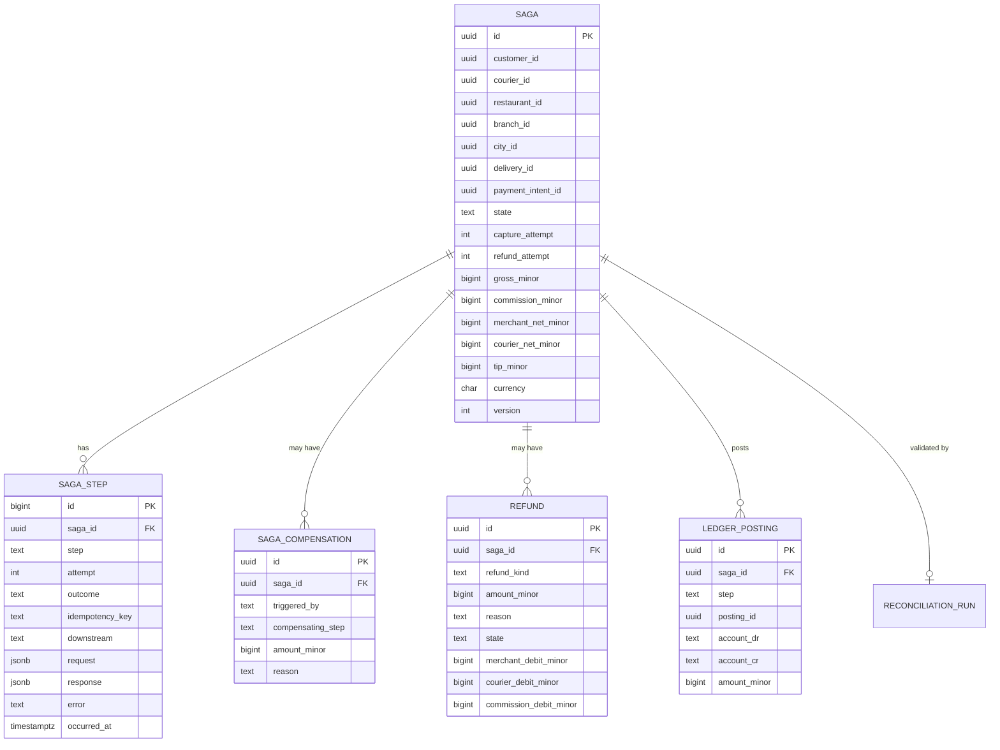

# food-payment-integration-service — Entity-Relationship Diagram

## 1. Database

- Engine: PostgreSQL 18.
- Schema: `food_payment_integration` (saga state; owned
  exclusively by this service).
- Migrations: `services/food-payment-integration-service/migrations/`.

## 2. Cross-Service References

| Column | Type | Refers to | Source of truth |
|--------|------|-----------|------------------|
| `saga_id` (= `food_order_id`) | UUID | `FoodOrder` in `food-order-service` | `food-order-service` |
| `customer_id` | UUID | `Customer` in `customer-service` | `customer-service` |
| `courier_id` | UUID | `Courier` in `courier-service` | `courier-service` |
| `restaurant_id` | UUID | `Restaurant` in `restaurant-service` | `restaurant-service` |
| `branch_id` | UUID | `Branch` in `branch-service` | `branch-service` |
| `city_id` | UUID | `City` in `zone-service` | `zone-service` |
| `delivery_id` | UUID | `Delivery` in `delivery-service` | `delivery-service` |
| `payment_intent_id` | UUID | `PaymentIntent` in `payment-service` | `payment-service` |
| `wallet_id` | UUID | `Wallet` in `wallet-service` | `wallet-service` |
| `correlation_id` | UUID | request scope | gateway |

All cross-service references are stored as UUID columns **without**
database-level foreign keys.

## 3. Entities

### `Saga`

The saga aggregate. One row per `food_order_id`. The `saga_id` IS
the `food_order_id` (1:1 with the food order).

#### Columns

| Column | Type | Constraints | Notes |
|--------|------|-------------|-------|
| `id` | UUID | PK | = `food_order_id` |
| `customer_id` | UUID | NOT NULL | |
| `courier_id` | UUID | NULL | set on capture |
| `restaurant_id` | UUID | NOT NULL | |
| `branch_id` | UUID | NOT NULL | |
| `city_id` | UUID | NOT NULL | |
| `delivery_id` | UUID | NULL | set on delivery |
| `payment_intent_id` | UUID | NULL | set on authorize |
| `state` | TEXT | NOT NULL CHECK in (`created`,`awaiting_capture`,`capturing`,`captured`,`posting_ledger`,`accruing`,`completed`,`compensating`,`refunding`,`refunded`,`failed`) | state machine |
| `capture_attempt` | INT | NOT NULL DEFAULT 0 | |
| `refund_attempt` | INT | NOT NULL DEFAULT 0 | |
| `gross_minor` | BIGINT | NOT NULL | total charged |
| `commission_minor` | BIGINT | NOT NULL | platform cut |
| `merchant_net_minor` | BIGINT | NOT NULL | merchant share |
| `courier_net_minor` | BIGINT | NOT NULL | courier share |
| `tip_minor` | BIGINT | NOT NULL DEFAULT 0 | |
| `currency` | CHAR(3) | NOT NULL | |
| `last_error` | TEXT | NULL | |
| `next_retry_at` | TIMESTAMPTZ | NULL | |
| `started_at` | TIMESTAMPTZ | NOT NULL DEFAULT now() | |
| `ended_at` | TIMESTAMPTZ | NULL | terminal |
| `correlation_id` | UUID | NOT NULL | from checkout |
| `created_at` | TIMESTAMPTZ | NOT NULL DEFAULT now() | |
| `updated_at` | TIMESTAMPTZ | NOT NULL DEFAULT now() | |
| `created_by` | UUID | NOT NULL | |
| `updated_by` | UUID | NOT NULL | |
| `version` | INT | NOT NULL DEFAULT 1 | optimistic concurrency |

#### Indexes

- PK on `id`.
- Index on `state, next_retry_at` for retry scheduler.
- Index on `customer_id, started_at DESC` for customer history.
- Index on `restaurant_id, started_at` for merchant reports.

#### Constraints

- CHECK `state IN (...)` as above.
- CHECK `gross_minor = commission_minor + merchant_net_minor +
  courier_net_minor + tip_minor`.
- CHECK `gross_minor > 0 AND commission_minor >= 0 AND
  merchant_net_minor >= 0 AND courier_net_minor >= 0 AND
  tip_minor >= 0`.
- CHECK `version > 0`.

### `SagaStep` (Partitioned by Month)

Append-only log of saga steps. One row per step attempt.

#### Columns

| Column | Type | Constraints | Notes |
|--------|------|-------------|-------|
| `id` | BIGSERIAL | PK | |
| `saga_id` | UUID | NOT NULL | FK within schema |
| `step` | TEXT | NOT NULL CHECK in (`authorize`,`capture`,`post_ledger`,`accrue_courier`,`accrue_merchant`,`tip`,`refund`,`compensate`) | |
| `attempt` | INT | NOT NULL | |
| `outcome` | TEXT | NOT NULL CHECK in (`started`,`succeeded`,`failed`,`skipped`) | |
| `request` | JSONB | NOT NULL | the request sent (sanitised) |
| `response` | JSONB | NOT NULL | the response received |
| `idempotency_key` | TEXT | NOT NULL | the key sent to the downstream |
| `downstream` | TEXT | NOT NULL | e.g. `payment-service.capture` |
| `error` | TEXT | NULL | failure reason |
| `occurred_at` | TIMESTAMPTZ | NOT NULL | |
| `correlation_id` | UUID | NOT NULL | |
| `created_at` | TIMESTAMPTZ | NOT NULL DEFAULT now() | append-only |

#### Indexes

- PK on `id`.
- Unique on `(saga_id, step, attempt)` to prevent duplicate step
  rows.
- Index on `saga_id, occurred_at`.

### `SagaCompensation`

Append-only log of compensations.

#### Columns

| Column | Type | Constraints | Notes |
|--------|------|-------------|-------|
| `id` | UUID | PK | UUIDv7 |
| `saga_id` | UUID | NOT NULL | FK within schema |
| `triggered_by` | TEXT | NOT NULL CHECK in (`capture_failed`,`refund_requested`,`admin_force`,`chargeback`,`other`) | |
| `compensating_step` | TEXT | NOT NULL | which step is being reversed |
| `amount_minor` | BIGINT | NOT NULL | |
| `currency` | CHAR(3) | NOT NULL | |
| `actor_id` | UUID | NULL | admin if force |
| `reason` | TEXT | NOT NULL | |
| `audit_note` | TEXT | NULL | required for admin force |
| `occurred_at` | TIMESTAMPTZ | NOT NULL | |
| `correlation_id` | UUID | NOT NULL | |
| `created_at` | TIMESTAMPTZ | NOT NULL DEFAULT now() | append-only |

#### Indexes

- PK on `id`.
- Index on `saga_id, occurred_at`.

### `Refund`

Records of refunds. One saga may have multiple refunds (partial
over time).

#### Columns

| Column | Type | Constraints | Notes |
|--------|------|-------------|-------|
| `id` | UUID | PK | UUIDv7 |
| `saga_id` | UUID | NOT NULL | |
| `refund_kind` | TEXT | NOT NULL CHECK in (`full`,`partial`) | |
| `amount_minor` | BIGINT | NOT NULL | |
| `currency` | CHAR(3) | NOT NULL | |
| `reason` | TEXT | NOT NULL | `cancellation`,`reject`,`quality`,`goodwill`,`chargeback`,`other` |
| `actor_id` | UUID | NULL | admin or system |
| `state` | TEXT | NOT NULL CHECK in (`initiated`,`applied`,`failed`) | |
| `merchant_debit_minor` | BIGINT | NOT NULL | proportional |
| `courier_debit_minor` | BIGINT | NOT NULL | proportional |
| `tip_debit_minor` | BIGINT | NOT NULL DEFAULT 0 | |
| `commission_debit_minor` | BIGINT | NOT NULL | |
| `payment_refund_id` | UUID | NULL | from `payment-service` |
| `occurred_at` | TIMESTAMPTZ | NOT NULL | |
| `correlation_id` | UUID | NOT NULL | |
| `created_at` | TIMESTAMPTZ | NOT NULL DEFAULT now() | |
| `updated_at` | TIMESTAMPTZ | NOT NULL DEFAULT now() | |

#### Constraints

- CHECK `amount_minor > 0`.
- CHECK `state IN (...)` as above.

### `LedgerPosting` (Local Mirror)

The local mirror of what was posted to `ledger-service`. Used for
reconciliation.

#### Columns

| Column | Type | Constraints | Notes |
|--------|------|-------------|-------|
| `id` | UUID | PK | UUIDv7 |
| `saga_id` | UUID | NOT NULL | |
| `step` | TEXT | NOT NULL | |
| `posting_id` | UUID | NOT NULL | from `ledger-service` |
| `account_dr` | TEXT | NOT NULL | |
| `account_cr` | TEXT | NOT NULL | |
| `amount_minor` | BIGINT | NOT NULL | |
| `currency` | CHAR(3) | NOT NULL | |
| `posted_at` | TIMESTAMPTZ | NOT NULL | |
| `correlation_id` | UUID | NOT NULL | |
| `created_at` | TIMESTAMPTZ | NOT NULL DEFAULT now() | append-only |

#### Constraints

- Unique on `(saga_id, step, posting_id)` to prevent double-post.

### `ReconciliationRun`

Daily reconciliation summary.

#### Columns

| Column | Type | Constraints | Notes |
|--------|------|-------------|-------|
| `id` | UUID | PK | UUIDv7 |
| `run_date` | DATE | UNIQUE NOT NULL | |
| `started_at` | TIMESTAMPTZ | NOT NULL | |
| `ended_at` | TIMESTAMPTZ | NULL | |
| `saga_total` | BIGINT | NOT NULL | sum from this service |
| `ledger_total` | BIGINT | NOT NULL | sum from `ledger-service` |
| `drift_minor` | BIGINT | NOT NULL | |
| `status` | TEXT | NOT NULL CHECK in (`running`,`matched`,`drift`,`error`) | |
| `details` | JSONB | NULL | |
| `correlation_id` | UUID | NOT NULL | |
| `created_at` | TIMESTAMPTZ | NOT NULL DEFAULT now() | |

### `Outbox` / `Inbox`

Standard platform outbox/inbox.

## 4. Mermaid ER Diagram



## 5. DDL Sketch

```sql
CREATE SCHEMA IF NOT EXISTS food_payment_integration;

CREATE TABLE food_payment_integration.sagas (
    id UUID PRIMARY KEY,
    customer_id UUID NOT NULL,
    courier_id UUID,
    restaurant_id UUID NOT NULL,
    branch_id UUID NOT NULL,
    city_id UUID NOT NULL,
    delivery_id UUID,
    payment_intent_id UUID,
    state TEXT NOT NULL,
    capture_attempt INT NOT NULL DEFAULT 0,
    refund_attempt INT NOT NULL DEFAULT 0,
    gross_minor BIGINT NOT NULL,
    commission_minor BIGINT NOT NULL,
    merchant_net_minor BIGINT NOT NULL,
    courier_net_minor BIGINT NOT NULL,
    tip_minor BIGINT NOT NULL DEFAULT 0,
    currency CHAR(3) NOT NULL,
    last_error TEXT,
    next_retry_at TIMESTAMPTZ,
    started_at TIMESTAMPTZ NOT NULL DEFAULT now(),
    ended_at TIMESTAMPTZ,
    correlation_id UUID NOT NULL,
    created_at TIMESTAMPTZ NOT NULL DEFAULT now(),
    updated_at TIMESTAMPTZ NOT NULL DEFAULT now(),
    created_by UUID NOT NULL,
    updated_by UUID NOT NULL,
    version INT NOT NULL DEFAULT 1,
    CONSTRAINT sagas_state_chk CHECK (state IN
        ('created','awaiting_capture','capturing','captured',
         'posting_ledger','accruing','completed',
         'compensating','refunding','refunded','failed')),
    CONSTRAINT sagas_split_chk CHECK (gross_minor =
        commission_minor + merchant_net_minor + courier_net_minor + tip_minor),
    CONSTRAINT sagas_amounts_chk CHECK (
        gross_minor > 0 AND commission_minor >= 0 AND
        merchant_net_minor >= 0 AND courier_net_minor >= 0 AND
        tip_minor >= 0),
    CONSTRAINT sagas_version_chk CHECK (version > 0)
);

CREATE INDEX sagas_state_retry_ix
    ON food_payment_integration.sagas (state, next_retry_at);
CREATE INDEX sagas_customer_started_ix
    ON food_payment_integration.sagas (customer_id, started_at DESC);
CREATE INDEX sagas_restaurant_started_ix
    ON food_payment_integration.sagas (restaurant_id, started_at);

CREATE TABLE food_payment_integration.saga_steps (
    id BIGSERIAL,
    saga_id UUID NOT NULL REFERENCES food_payment_integration.sagas(id),
    step TEXT NOT NULL CHECK (step IN
        ('authorize','capture','post_ledger','accrue_courier',
         'accrue_merchant','tip','refund','compensate')),
    attempt INT NOT NULL,
    outcome TEXT NOT NULL CHECK (outcome IN
        ('started','succeeded','failed','skipped')),
    request JSONB NOT NULL,
    response JSONB NOT NULL,
    idempotency_key TEXT NOT NULL,
    downstream TEXT NOT NULL,
    error TEXT,
    occurred_at TIMESTAMPTZ NOT NULL,
    correlation_id UUID NOT NULL,
    created_at TIMESTAMPTZ NOT NULL DEFAULT now(),
    PRIMARY KEY (id, occurred_at)
) PARTITION BY RANGE (occurred_at);

-- Idempotent pre-creation; safe to rerun as part of the maintenance job.
CREATE TABLE IF NOT EXISTS food_payment_integration.saga_steps_2026_07
    PARTITION OF food_payment_integration.saga_steps
    FOR VALUES FROM ('2026-07-01 00:00:00+00') TO ('2026-08-01 00:00:00+00');

CREATE UNIQUE INDEX saga_steps_uq
    ON food_payment_integration.saga_steps (saga_id, step, attempt);
CREATE INDEX saga_steps_saga_time_ix
    ON food_payment_integration.saga_steps (saga_id, occurred_at);

CREATE TABLE food_payment_integration.saga_compensations (
    id UUID PRIMARY KEY,
    saga_id UUID NOT NULL REFERENCES food_payment_integration.sagas(id),
    triggered_by TEXT NOT NULL CHECK (triggered_by IN
        ('capture_failed','refund_requested','admin_force','chargeback','other')),
    compensating_step TEXT NOT NULL,
    amount_minor BIGINT NOT NULL,
    currency CHAR(3) NOT NULL,
    actor_id UUID,
    reason TEXT NOT NULL,
    audit_note TEXT,
    occurred_at TIMESTAMPTZ NOT NULL,
    correlation_id UUID NOT NULL,
    created_at TIMESTAMPTZ NOT NULL DEFAULT now(),
    CONSTRAINT compensations_audit_chk
        CHECK (triggered_by <> 'admin_force' OR audit_note IS NOT NULL)
);

CREATE INDEX compensations_saga_time_ix
    ON food_payment_integration.saga_compensations (saga_id, occurred_at);

CREATE TABLE food_payment_integration.refunds (
    id UUID PRIMARY KEY,
    saga_id UUID NOT NULL REFERENCES food_payment_integration.sagas(id),
    refund_kind TEXT NOT NULL CHECK (refund_kind IN ('full','partial')),
    amount_minor BIGINT NOT NULL,
    currency CHAR(3) NOT NULL,
    reason TEXT NOT NULL,
    actor_id UUID,
    state TEXT NOT NULL CHECK (state IN ('initiated','applied','failed')),
    merchant_debit_minor BIGINT NOT NULL,
    courier_debit_minor BIGINT NOT NULL,
    tip_debit_minor BIGINT NOT NULL DEFAULT 0,
    commission_debit_minor BIGINT NOT NULL,
    payment_refund_id UUID,
    occurred_at TIMESTAMPTZ NOT NULL,
    correlation_id UUID NOT NULL,
    created_at TIMESTAMPTZ NOT NULL DEFAULT now(),
    updated_at TIMESTAMPTZ NOT NULL DEFAULT now(),
    CONSTRAINT refunds_amount_chk CHECK (amount_minor > 0)
);

CREATE TABLE food_payment_integration.ledger_postings (
    id UUID PRIMARY KEY,
    saga_id UUID NOT NULL REFERENCES food_payment_integration.sagas(id),
    step TEXT NOT NULL,
    posting_id UUID NOT NULL,
    account_dr TEXT NOT NULL,
    account_cr TEXT NOT NULL,
    amount_minor BIGINT NOT NULL,
    currency CHAR(3) NOT NULL,
    posted_at TIMESTAMPTZ NOT NULL,
    correlation_id UUID NOT NULL,
    created_at TIMESTAMPTZ NOT NULL DEFAULT now(),
    CONSTRAINT ledger_postings_uq UNIQUE (saga_id, step, posting_id)
);

CREATE TABLE food_payment_integration.reconciliation_runs (
    id UUID PRIMARY KEY,
    run_date DATE UNIQUE NOT NULL,
    started_at TIMESTAMPTZ NOT NULL,
    ended_at TIMESTAMPTZ,
    saga_total BIGINT NOT NULL,
    ledger_total BIGINT NOT NULL,
    drift_minor BIGINT NOT NULL,
    status TEXT NOT NULL CHECK (status IN
        ('running','matched','drift','error')),
    details JSONB,
    correlation_id UUID NOT NULL,
    created_at TIMESTAMPTZ NOT NULL DEFAULT now()
);

CREATE TABLE food_payment_integration.outbox (
    id BIGSERIAL PRIMARY KEY,
    event_id UUID UNIQUE NOT NULL,
    topic TEXT NOT NULL,
    partition_key UUID NOT NULL,
    payload JSONB NOT NULL,
    created_at TIMESTAMPTZ NOT NULL DEFAULT now(),
    claimed_at TIMESTAMPTZ,
    published_at TIMESTAMPTZ
);

CREATE TABLE food_payment_integration.inbox (
    event_id UUID PRIMARY KEY,
    topic TEXT NOT NULL,
    received_at TIMESTAMPTZ NOT NULL DEFAULT now(),
    processed_at TIMESTAMPTZ,
    error TEXT
);
```

## 6. Audit Columns

Every mutable table has `created_at`, `updated_at`, `created_by`,
`updated_by`. The `saga_steps`, `saga_compensations`, and
`ledger_postings` tables are append-only.

## 7. Soft Delete

Not used. Saga rows are terminal; old ones are archived.

## 8. JSONB Usage

- `saga_steps.request` and `saga_steps.response` — sanitised
  request/response payloads (provider tokens are NOT stored).
- `reconciliation_runs.details` — per-saga diffs.
- `outbox.payload` — event envelope.

## 9. Partitioning

- `saga_steps` is range-partitioned by month on `occurred_at`.
- Pre-create partitions for the next 12 months.
- Drop partitions older than 7 years.

## 10. Data Retention

| Table | Retention | Purged by |
|-------|-----------|-----------|
| `sagas` | 7 years (financial) | nightly batch |
| `saga_steps` | 7 years (audit) | partition drop |
| `saga_compensations` | 7 years (audit) | nightly batch |
| `refunds` | 7 years (financial) | nightly batch |
| `ledger_postings` | 7 years (audit) | nightly batch |
| `reconciliation_runs` | 7 years | nightly batch |
| `outbox` | 24h after `published_at` | poller |
| `inbox` | 30 days (TTL) | nightly batch |

## 11. Migration Considerations

- The `saga_steps` table is append-only by convention; the
  application role has INSERT only on it.
- Adding a new `step` value requires a CHECK update and code
  changes.
- The `sagas` table's optimistic concurrency is enforced by the
  `version` column; migrations must not drop the column.
- Money math: the CHECK `gross_minor = commission_minor +
  merchant_net_minor + courier_net_minor + tip_minor` is critical;
  any change to the split rule must be coordinated with finance.

---

## See also

### Sibling docs for this service

- [`README.md`](./README.md) — purpose, bounded context, responsibilities
- [`BRD.md`](./BRD.md) — business requirements
- [`SRS.md`](./SRS.md) — functional + non-functional requirements
- [`ERD.md`](./ERD.md) — data model (entities, relationships)
- [`INTEGRATION.md`](./INTEGRATION.md) — inter-service contracts (APIs, events, sagas)
- [`WORKFLOWS.md`](./WORKFLOWS.md) — operational workflows (happy paths, failure modes)
- [`TECH.md`](./TECH.md) — technology profile (runtime, libraries, data layer, admin endpoints, RBAC)

### Platform-wide

- [`../../shared/README.md`](../../shared/README.md) — `platform-spring-boot-starter` shared library (the single source of cross-cutting code for all Spring Boot services in the platform)
- [`../RECOMMENDATIONS.md`](../RECOMMENDATIONS.md) — platform-wide technology map (language, framework, version baseline, admin/RBAC pattern)
- [`../../README.md`](../../README.md) — services overview (the catalog of all 58 services)
- [`../../../main.md`](../../../main.md) — top-level platform specification (architecture, Keycloak, PostgreSQL 18, messaging, observability baseline)

