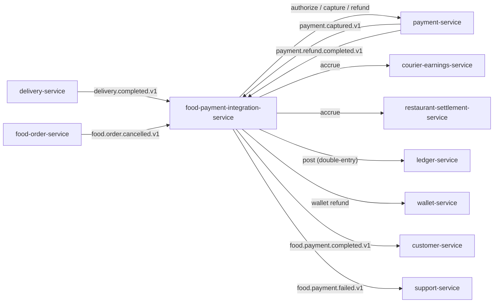

# food-payment-integration-service — Software Requirements Specification

## 1. Introduction

This document specifies the software behaviour of
`food-payment-integration-service`. It is the engineering source
of truth for the saga state machine, idempotency, compensation,
and reconciliation.

## 2. Scope

- In scope: the orchestrated saga for the food payment chain,
  idempotency keys, compensation, partial refund handling, ledger
  posting orchestration, reconciliation.
- Out of scope: provider integration (owned by `payment-service`),
  merchant settlement mechanics, courier earnings mechanics,
  wallet mechanics, the chart of accounts.

## 3. System Context



## 4. Actors

- `delivery-service` (system actor; trigger).
- `food-order-service` (system actor; cancellation).
- `payment-service` (system actor; provider integration).
- `courier-earnings-service` (system actor; earning accrual).
- `restaurant-settlement-service` (system actor; merchant accrual).
- `ledger-service` (system actor; double-entry).
- `wallet-service` (system actor; closed-loop refund).
- `admin-service` / `support-service` (Keycloak
  `platform-internal`).

## 5. Functional Requirements

| ID | Requirement | Priority |
|----|-------------|----------|
| FR--001 | On `delivery.completed.v1`, advance the saga from `awaiting_capture` to `capturing`. | MUST |
| FR--002 | Call `payment-service.capture` with `Idempotency-Key: food:<order_id>:capture:<attempt>`. | MUST |
| FR--003 | On `payment.captured.v1`, advance the saga to `posting_ledger`. | MUST |
| FR--004 | Post a double-entry to `ledger-service` (customer receivable, merchant payable, courier payable, platform commission). | MUST |
| FR--005 | On ledger post success, trigger `courier-earnings-service.accrue` (base). | MUST |
| FR--006 | On ledger post success, trigger `restaurant-settlement-service.accrue` (merchant). | MUST |
| FR--007 | On both downstream accruals done, mark the saga `completed` and emit `food.payment.completed.v1`. | MUST |
| FR--008 | On capture failure, retry up to `saga_max_retries` with exponential backoff. | MUST |
| FR--009 | On capture failure after retries, mark the saga `compensating`; void the authorization if not captured; if captured, refund. | MUST |
| FR--010 | On `food.order.cancelled.v1` (pre-delivery), start a refund saga: refund the captured amount; if not yet captured, void. | MUST |
| FR--011 | On partial refund request (support), compute the merchant / courier split and post the proportional entries. | MUST |
| FR--012 | Make every step idempotent on `saga_id + step + attempt`. | MUST |
| FR--013 | Persist saga state in the same database as the step logs. | MUST |
| FR--014 | Allow an admin to `force-compensate` a stuck saga (with audit note). | MUST |
| FR--015 | Provide a `GET /v1/food-sagas/{id}` that returns the full saga state and step history. | MUST |
| FR--016 | Support tip accrual as a separate step within the tip window. | MUST |
| FR--017 | On `payment.refund.completed.v1`, advance the refund saga to `completed` and emit `food.payment.full_refund.v1` or `food.payment.partial_refund.v1`. | MUST |
| FR--018 | On `customer.tip.added.v1` (own produce), call `courier-earnings-service.tip`. | MUST |
| FR--019 | Run a daily reconciliation against `ledger-service` and report drift. | MUST |
| FR--020 | Emit `food_payment_integration.audit.saga_advanced.v1` and `food_payment_integration.audit.saga_compensated.v1` on every step and compensation. | MUST |
| FR--021 | Allow wallet-credited refunds (closed-loop) when the original method is no longer valid. | SHOULD |
| FR--022 | Reject any step that is older than 5 minutes (clock-skew guard). | MUST |

## 6. Non-Functional Requirements

| ID | Category | Requirement | Target |
|----|----------|-------------|--------|
| NFR--001 | performance | Capture P99 | ≤ 5 min from event |
| NFR--002 | performance | Saga completion P99 | ≤ 30s after capture |
| NFR--003 | performance | Refund P99 | ≤ 1 hour from trigger |
| NFR--004 | performance | Saga status read P99 | ≤ 100ms |
| NFR--005 | availability | Service uptime | 99.95% / 30d |
| NFR--006 | scalability | Concurrent sagas | ≥ 50k |
| NFR--007 | scalability | Capture throughput | 200 rps |
| NFR--008 | maintainability | MTTR | ≤ 30 min |
| NFR--009 | observability | End-to-end trace per saga | 100% |
| NFR--010 | consistency | No double-posting under any failure mode | MUST |

## 7. API Requirements

- All non-idempotent `POST` endpoints require `Idempotency-Key`.
- The capture step's idempotency key is
  `food:<order_id>:capture:<attempt>`.
- The refund step's idempotency key is
  `food:<order_id>:refund:<reason>:<attempt>`.
- All responses use the standard error envelope.
- Full contracts: `INTEGRATION.md`.

## 8. Data Requirements

| ID | Requirement | Notes |
|----|-------------|-------|
| DATA--001 | `saga_id` is the `food_order_id` (UUID). | Re-entry on the same id resumes the saga. |
| DATA--002 | `customer_id`, `courier_id`, `restaurant_id`, `branch_id`, `city_id`, `delivery_id`, `payment_id` are stored as UUID columns WITHOUT database FKs. | |
| DATA--003 | Money values are `amount_minor BIGINT` + `currency CHAR(3)`. | |
| DATA--004 | The `saga_steps` table is append-only and range-partitioned by month. | |
| DATA--005 | No PII is stored. | |

## 9. Validation Rules

- `amount_minor > 0` for all amounts.
- `currency` is a valid ISO 4217 code.
- The `attempt` counter is monotonically increasing.
- The compensation amount MUST equal the captured amount (for
  full refund) or the requested amount (for partial refund, within
  `partial_refund_max_pct` of the captured amount per call).

## 10. State Transitions

`Saga` state machine (simplified):

```
[*] → created (at checkout; authorization held)
created → awaiting_capture (after delivery not yet started)
awaiting_capture → capturing (delivery.completed.v1)
capturing → captured (payment.captured.v1)
capturing → compensating (capture failed after retries)
capturing → compensating (refund requested before capture; void)
captured → posting_ledger
posting_ledger → accruing (ledger.posted.v1)
accruing → completed (all downstream done)
completed → [*]
compensating → refunding → completed (refund applied)
compensating → failed (refund failed; manual intervention)
```

## 11. Authorization Requirements

- Service-to-service callers require `food-payment-integration.write`
  or `food-payment-integration.read`.
- Admin endpoints require `food_payment.admin`.
- All admin actions are audit-logged.

## 12. Configuration Requirements

- Reads `food_payment.*` from `configuration-service` at startup
  and on `configuration.updated.v1`.
- All numeric config validated against min/max bounds.

## 13. Error Handling

| Error | Response |
|-------|----------|
| Capture failed (provider) | saga → `compensating` |
| Refund failed (provider) | saga → `failed`; ticket opened |
| Ledger post failed | retry; saga → `stuck`; alert |
| Downstream (CE / RSM) failed | retry; saga → `partially_completed`; alert |
| Idempotency-Key reuse with different body | 422 `IDEMPOTENCY_KEY_REUSED` |
| Clock skew on a step | 422 `TIMESTAMP_OUT_OF_BOUNDS` |

## 14. Concurrency Requirements

- A row-level lock on the `saga` row is acquired at every step
  transition.
- The state machine uses optimistic concurrency (`updated_at`
  predicate).
- Step logs use a unique constraint on `(saga_id, step, attempt)`
  to prevent double-write.

## 15. Idempotency Requirements

- All step calls are idempotent on `(saga_id, step, attempt)`.
- The capture call's idempotency key is forwarded to
  `payment-service` so the provider is also idempotent.
- Replays return the original result; the state machine does not
  re-execute the side effects.

## 16. Performance

- Dominant path: receive `delivery.completed.v1`, advance to
  `capturing`, call `payment-service`, post ledger, trigger
  downstream, emit `food.payment.completed.v1`.
- P50 / P95 / P99: see NFRs.

## 17. Scalability

- Horizontal: stateless; HPA on `kafka_consumer_lag` and
  `food_saga_in_flight`.
- Vertical: bounded by PostgreSQL connection pool.

## 18. Availability

- SLO: 99.95% over 30 days. Error budget: ~22 min / 30d.
- Maintenance: rolling deploys only.
- Degraded mode: if `ledger-service` is down, the saga halts at
  `posting_ledger` and retries when the circuit closes; the
  customer has already been captured (or will be), and the
  reconciliation job catches up.

## 19. Security

| ID | Requirement | Notes |
|----|-------------|-------|
| SEC--001 | All endpoints require JWT bearer validated at the gateway. | |
| SEC--002 | No PII is stored. | Only UUIDs. |
| SEC--003 | No provider credentials are stored. | All provider calls via `payment-service`. |
| SEC--004 | Admin actions are audit-logged. | `admin.action.performed.v1`. |
| SEC--005 | Rate limit: 100 step calls per service identity per minute. | At the service. |

## 20. Privacy

- PII stored: none.
- Retention: 7 years (financial).
- Erasure: not applicable.

## 21. Auditability

- Every step is logged in `saga_steps` with `actor_type=system`,
  `step`, `attempt`, `outcome`, `timestamp`, `correlation_id`.
- Every compensation is logged in `saga_compensations`.
- Admin force-compensate emits `admin.action.performed.v1`.
- Reconciliation runs emit
  `food_payment_integration.audit.reconciled.v1` (or
  `reconciliation_drift.v1` on drift).

## 22. Observability

- Logs: JSON, fields include `correlation_id`, `saga_id`,
  `order_id`, `step`, `state`, `attempt`.
- Metrics: `food_saga_started_total{trigger}`,
  `food_saga_step_total{step,outcome}`,
  `food_saga_compensated_total{step}`,
  `food_saga_completed_total{trigger}`,
  `food_saga_in_flight`,
  `food_payment_capture_seconds`,
  `food_payment_refund_seconds`,
  `food_saga_reconciliation_drift`.
- Traces: OpenTelemetry; root span per saga; child spans per step.
- Alerts: SLO burn-rate; compensation rate > 0.5% over 1h; stuck
  saga > 30 min; reconciliation drift > 0.

## 23. Maintainability

- Code style: TypeScript strict, ESLint with platform rules.
- Test coverage: ≥ 80% line, ≥ 75% branch; 100% on the state
  machine and idempotency.
- Documentation: this folder + `WORKFLOWS.md` diagrams.

## 24. Disaster Recovery

- RPO: 5 minutes (saga state is replicated to standby region).
- RTO: 30 minutes (stateless service; replay from
  `food-order-service` events).

## 25. Acceptance Criteria

- All FR/NFR are met and verified by automated tests.
- All SEC are met and verified by a security review.
- A load test sustains 200 capture / second with p99 ≤ 5 min
  end-to-end.
- A chaos test (kill `payment-service`) shows the saga retries
  and completes when the circuit closes.
- A double-`delivery.completed.v1` test shows no double-post to
  the ledger.
- Reconciliation reports zero drift over 7 days.

---

## See also

### Sibling docs for this service

- [`README.md`](./README.md) — purpose, bounded context, responsibilities
- [`BRD.md`](./BRD.md) — business requirements
- [`SRS.md`](./SRS.md) — functional + non-functional requirements
- [`ERD.md`](./ERD.md) — data model (entities, relationships)
- [`INTEGRATION.md`](./INTEGRATION.md) — inter-service contracts (APIs, events, sagas)
- [`WORKFLOWS.md`](./WORKFLOWS.md) — operational workflows (happy paths, failure modes)
- [`TECH.md`](./TECH.md) — technology profile (runtime, libraries, data layer, admin endpoints, RBAC)

### Platform-wide

- [`../../shared/README.md`](../../shared/README.md) — `platform-spring-boot-starter` shared library (the single source of cross-cutting code for all Spring Boot services in the platform)
- [`../RECOMMENDATIONS.md`](../RECOMMENDATIONS.md) — platform-wide technology map (language, framework, version baseline, admin/RBAC pattern)
- [`../../README.md`](../../README.md) — services overview (the catalog of all 58 services)
- [`../../../main.md`](../../../main.md) — top-level platform specification (architecture, Keycloak, PostgreSQL 18, messaging, observability baseline)

