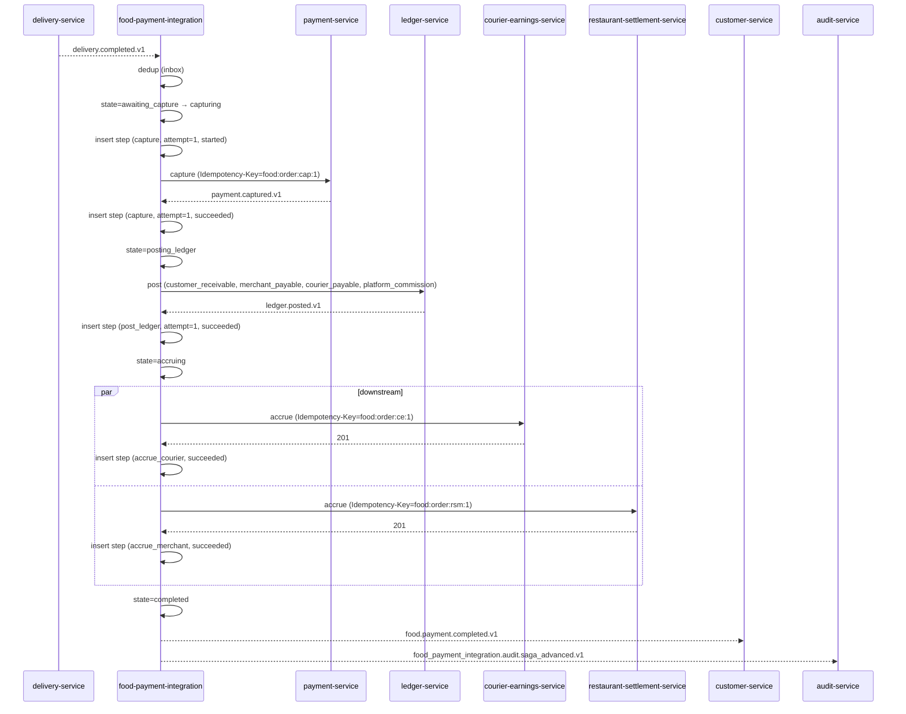
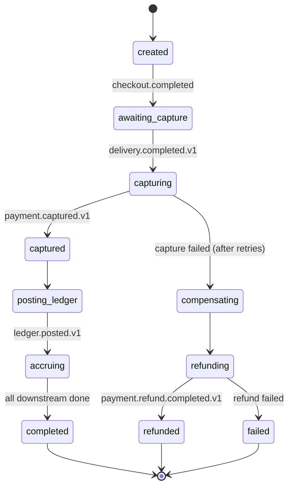
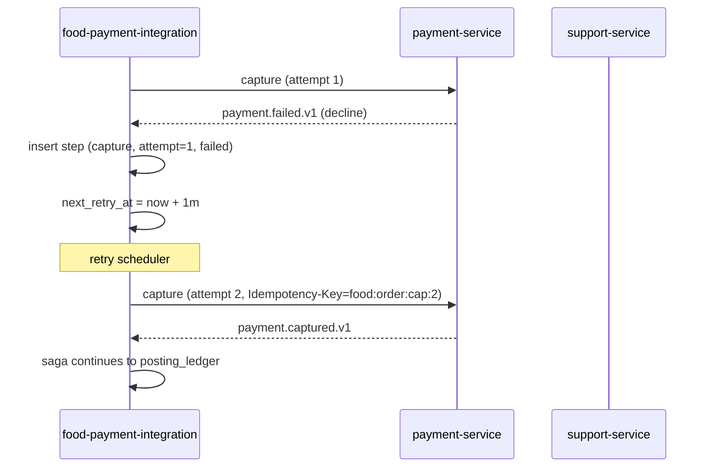
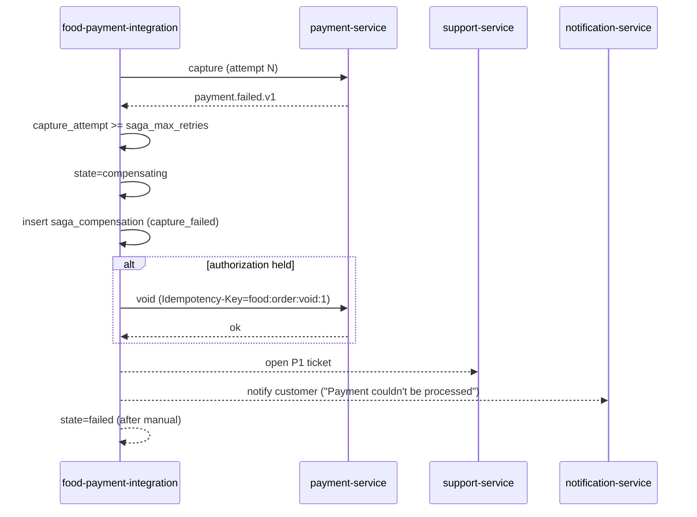
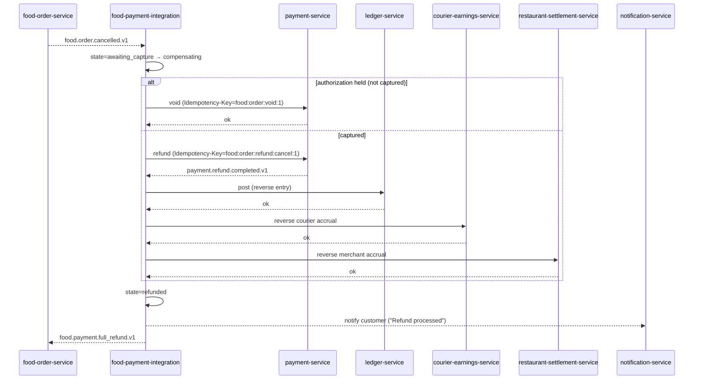
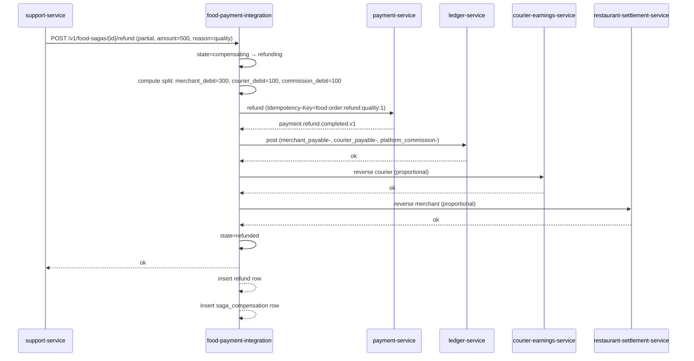

# food-payment-integration-service — Workflows

## 1. `Delivery Completed → Capture → Merchant + Courier + Ledger` (Happy Path)

### 1.1 Objective

Drive the food payment saga from `awaiting_capture` to
`completed`, capturing the customer's payment, posting the
double-entry, accruing the merchant payable and the courier
earning.

### 1.2 Initiating Actor

`delivery-service` (system actor) emits `delivery.completed.v1`.

### 1.3 Participating Services

- `delivery-service` (producer)
- `food-payment-integration-service` (this service; orchestrator)
- `payment-service` (capture)
- `ledger-service` (post)
- `courier-earnings-service` (accrue)
- `restaurant-settlement-service` (accrue)
- `customer-service` (history)

### 1.4 Prerequisites

- The saga is in `awaiting_capture` (created at checkout; the
  authorization was held).
- The customer has a valid payment method.
- The merchant and courier exist and are eligible.

### 1.5 Happy Path



### 1.6 Alternate Paths

- **Tip added before delivery**: handled at the tip step within
  the tip window (see §3).
- **Capture succeeds but ledger post fails**: the saga halts at
  `posting_ledger`; the retry scheduler picks it up; reconciliation
  catches drift.

### 1.7 Failure Paths

- **Capture fails (provider)**: see §2.
- **Ledger post fails**: retry with backoff; after exhaustion, the
  saga is `stuck`; on-call paged.
- **Downstream (`courier-earnings-service` or
  `restaurant-settlement-service`) fails**: the saga is
  `partially_completed`; retry; reconciliation catches drift.

### 1.8 Business Rules

- Every step is idempotent on `(saga_id, step, attempt)`.
- The money split is immutable once set at checkout.

### 1.9 State Transitions



### 1.10 Events

| Event | Direction | When |
|-------|-----------|------|
| `delivery.completed.v1` | consumed | trigger |
| `payment.captured.v1` | consumed | advance |
| `payment.refund.completed.v1` | consumed | on refund |
| `food.payment.completed.v1` | produced | terminal |

### 1.11 APIs Involved

| API | Direction | When |
|-----|-----------|------|
| `POST /v1/payments/capture` | outbound | capture step |
| `POST /v1/postings` | outbound | ledger step |
| `POST /v1/courier-earnings/accrue` | outbound | courier step |
| `POST /v1/merchant-payouts/accrue` | outbound | merchant step |

### 1.12 Compensation / Rollback

- The only "roll back" for a successful capture is a refund (see
  §4). A captured payment cannot be voided; it must be refunded.

### 1.13 Final State

- Saga: `completed`.
- Ledger: double-entry posted.
- Courier: earning accrued.
- Merchant: payable accrued.

## 2. `Capture Failure and Compensation`

### 2.1 Objective

When the capture step fails, retry with backoff; on exhaustion,
void the authorization (if not captured) or refund (if captured).

### 2.2 Initiating Actor

`payment-service` emits `payment.failed.v1` (or the call returns
an error).

### 2.3 Participating Services

- `payment-service` (capture / void / refund)
- `food-payment-integration-service` (this service)
- `support-service` (P1 ticket on stuck)
- `notification-service` (customer-facing)

### 2.4 Prerequisites

- The saga is in `capturing`.

### 2.5 Happy Path (Retry)



### 2.6 Alternate Paths

- **Authorization only (not captured)**: void the authorization.
- **Authorization captured but later voided**: not possible at the
  provider; a refund is required.

### 2.7 Failure Paths (Exhaustion)



### 2.8 Business Rules

- `saga_max_retries` is configurable.
- A `saga_compensation` row is always inserted.
- A P1 ticket is opened within 1 minute of exhaustion.

### 2.9 State Transitions

See §1.9.

### 2.10 Events

| Event | Direction | When |
|-------|-----------|------|
| `payment.failed.v1` | consumed | on fail |
| `food.payment.failed.v1` | produced | on exhaustion |

### 2.11 APIs Involved

| API | Direction | When |
|-----|-----------|------|
| `POST /v1/payments/capture` | outbound | retry |
| `POST /v1/payments/void` | outbound | compensation |
| `POST /v1/tickets` | outbound | on exhaustion |

### 2.12 Compensation / Rollback

The compensation is the void or refund. See §4 for refund details.

### 2.13 Final State

- Saga: `failed` (after manual review) or `refunded` (if the
  customer pays via a different method and the original is
  refunded).

## 3. `Tip Accrual` (Within the Tip Window)

### 3.1 Objective

Accrue a customer's tip to the courier's earnings, as a separate
step in the saga.

### 3.2 Initiating Actor

`food-payment-integration-service` (self) emits
`customer.tip.added.v1` when the tip is registered.

### 3.3 Participating Services

- `food-payment-integration-service` (this service)
- `courier-earnings-service` (accrue)
- `ledger-service` (post)

### 3.4 Prerequisites

- The delivery is `delivered`.
- The tip is added within `tip_max_hours_after_delivery` (default
  24).

### 3.5 Happy Path

```mermaid
sequenceDiagram
    participant FPI as food-payment-integration
    participant PAY as payment-service
    participant CE as courier-earnings-service
    participant LD as ledger-service

    Note over FPI: tip registered
    FPI->>FPI: tip_minor += amount
    FPI->>PAY: charge tip (if not yet captured; otherwise already captured)
    PAY-->>FPI: ok
    FPI->>CE: tip (Idempotency-Key=food:order:tip:1)
    CE-->>FPI: 201
    FPI->>LD: post (courier_payable, customer_receivable)
    LD-->>FPI: ledger.posted.v1
    FPI-->>CE: customer.tip.added.v1
```

### 3.6 Alternate Paths

- **Tip added before delivery**: captured with the initial
  payment; the tip step is part of the main flow.
- **Tip added after the tip window**: 422 `TIP_WINDOW_EXPIRED`;
  the tip is recorded as a customer credit (handled by
  `payment-service`).

### 3.7 Failure Paths

- **`courier-earnings-service` down**: the tip is queued in the
  outbox and retried.

### 3.8 Business Rules

- Tips are commission-free.
- A tip is part of the same saga; the courier's earning and the
  merchant's payable are not affected.

### 3.9 State Transitions

N/A (the saga is already `completed` or `accruing`; the tip is a
side-effect).

### 3.10 Events

| Event | Direction | When |
|-------|-----------|------|
| `customer.tip.added.v1` | produced | on tip add |

### 3.11 APIs Involved

| API | Direction | When |
|-----|-----------|------|
| `POST /v1/courier-earnings/tip` | outbound | tip step |
| `POST /v1/postings` | outbound | ledger |

### 3.12 Compensation / Rollback

A tip reversal (admin / support) is a separate `refund` with
`reason=tip_reversal` and `tip_debit_minor` = the tip amount.

### 3.13 Final State

- Courier: tip earning accrued.
- Ledger: tip entry posted.

## 4. `Full Refund on Cancellation`

### 4.1 Objective

On `food.order.cancelled.v1` (pre-delivery) or
`food.order.rejected.v1`, refund the captured amount (or void the
authorization).

### 4.2 Initiating Actor

`food-order-service` emits `food.order.cancelled.v1` or
`food.order.rejected.v1`.

### 4.3 Participating Services

- `food-order-service` (producer)
- `food-payment-integration-service` (this service; orchestrator)
- `payment-service` (refund / void)
- `ledger-service` (reverse entry)
- `courier-earnings-service` (reverse courier accrual if any)
- `restaurant-settlement-service` (reverse merchant accrual)
- `notification-service` (customer-facing)

### 4.4 Prerequisites

- The saga is in `awaiting_capture` or `captured` (or further).

### 4.5 Happy Path



### 4.6 Alternate Paths

- **Partial refund (support)**: see §5.

### 4.7 Failure Paths

- **Refund fails**: saga → `failed`; manual intervention.

### 4.8 Business Rules

- A `refunds` row is inserted.
- A `saga_compensation` row is inserted.

### 4.9 State Transitions

See §1.9.

### 4.10 Events

| Event | Direction | When |
|-------|-----------|------|
| `food.order.cancelled.v1` | consumed | trigger |
| `food.payment.full_refund.v1` | produced | on refund |

### 4.11 APIs Involved

| API | Direction | When |
|-----|-----------|------|
| `POST /v1/payments/void` | outbound | if not captured |
| `POST /v1/payments/refund` | outbound | if captured |

### 4.12 Compensation / Rollback

The compensation IS the refund.

### 4.13 Final State

- Saga: `refunded`.
- Ledger: reversed.

## 5. `Partial Refund` (Support-Initiated)

### 5.1 Objective

A support agent issues a partial refund (quality issue, goodwill).
The merchant's payable and the courier's earning are reduced
proportionally.

### 5.2 Initiating Actor

A support agent via `support-service` (which calls this service's
`/refund` API).

### 5.3 Participating Services

Same as §4.

### 5.4 Prerequisites

- The saga is in `completed` or beyond.
- The partial refund is within `partial_refund_max_pct` per call.

### 5.5 Happy Path



### 5.6 Alternate Paths

- **Closed-loop wallet refund**: if the original payment method is
  no longer valid, the refund is credited to the customer's
  wallet.

### 5.7 Failure Paths

- **`payment-service` fails**: retry; on exhaustion, saga →
  `failed`; ticket.

### 5.8 Business Rules

- The split is computed in proportion to the original
  `commission_minor / merchant_net_minor / courier_net_minor`.
- The partial refund is bounded by `partial_refund_max_pct` per
  call.

### 5.9 State Transitions

See §1.9.

### 5.10 Events

| Event | Direction | When |
|-------|-----------|------|
| `food.payment.partial_refund.v1` | produced | on refund |

### 5.11 APIs Involved

| API | Direction | When |
|-----|-----------|------|
| `POST /v1/food-sagas/{id}/refund` | inbound | support |
| `POST /v1/payments/refund` | outbound | provider |

### 5.12 Compensation / Rollback

A partial refund is itself a forward action; a "refund of refund"
is a new partial refund in the opposite direction.

### 5.13 Final State

- Saga: `refunded` (with a `refunds` row).
- Ledger: proportional entry posted.
- Merchant / courier: payable reduced.

## 6. `Daily Reconciliation`

Same shape as `courier-earnings-service.daily_reconciliation`,
applied to the saga totals vs. `ledger-service` food-related
accounts. Drift opens a P1 ticket and emits
`food_payment_integration.audit.reconciliation_drift.v1`.

---

## See also

### Sibling docs for this service

- [`README.md`](./README.md) — purpose, bounded context, responsibilities
- [`BRD.md`](./BRD.md) — business requirements
- [`SRS.md`](./SRS.md) — functional + non-functional requirements
- [`ERD.md`](./ERD.md) — data model (entities, relationships)
- [`INTEGRATION.md`](./INTEGRATION.md) — inter-service contracts (APIs, events, sagas)
- [`WORKFLOWS.md`](./WORKFLOWS.md) — operational workflows (happy paths, failure modes)
- [`TECH.md`](./TECH.md) — technology profile (runtime, libraries, data layer, admin endpoints, RBAC)

### Platform-wide

- [`../../shared/README.md`](../../shared/README.md) — `platform-spring-boot-starter` shared library (the single source of cross-cutting code for all Spring Boot services in the platform)
- [`../RECOMMENDATIONS.md`](../RECOMMENDATIONS.md) — platform-wide technology map (language, framework, version baseline, admin/RBAC pattern)
- [`../../README.md`](../../README.md) — services overview (the catalog of all 58 services)
- [`../../../main.md`](../../../main.md) — top-level platform specification (architecture, Keycloak, PostgreSQL 18, messaging, observability baseline)

