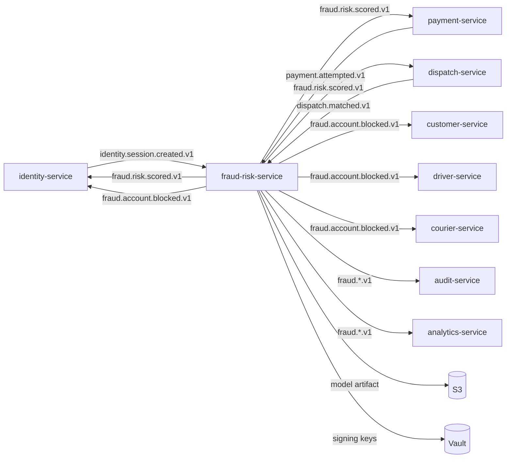
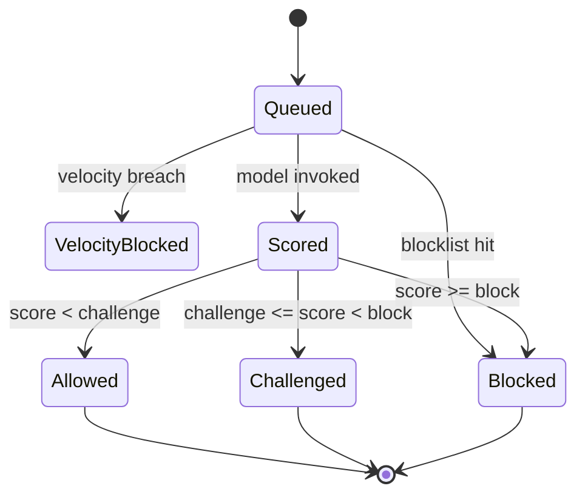
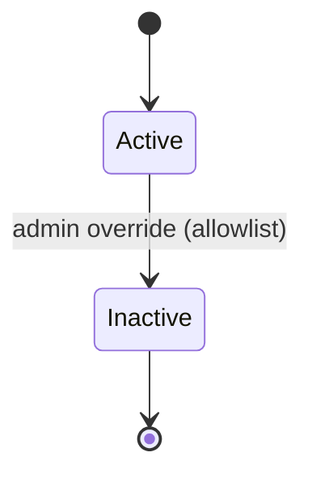

# fraud-risk-service — Software Requirements Specification

## 1. Introduction

This SRS specifies, for the engineering team, the functional,
non-functional, data, security, and operational requirements
of `fraud-risk-service`. It is derived from `BRD.md` and from
the platform's cross-service architecture.

## 2. Scope

In scope:

- All REST endpoints listed in `INTEGRATION.md` (score,
  block, allowlist, admin blocklists, admin models).
- Real-time scoring (rule-based + ML).
- Device fingerprint cache.
- Blocklist lookups (email, phone, IP, device, card BIN,
  region).
- Velocity checks.
- Model registry and A/B testing.
- Account block actions.
- Right-to-erasure for fraud data.
- Outbound events `fraud.risk.scored.v1`,
  `fraud.account.blocked.v1`, `fraud.model.deployed.v1`,
  `fraud.blocklist.updated.v1`.

Out of scope:

- User identity, KYC.
- Payment execution.
- Account re-instatement (handled by `support-service`).
- Model training (done offline; this service consumes the
  trained model artifact from S3).

## 3. System Context

## 4. Actors

| Actor | Type | Description |
|-------|------|-------------|
| `identity-service` | system | producer of login events; consumer of scored events; consumer of block events |
| `payment-service` | system | producer of payment events; consumer of scored events |
| `dispatch-service` | system | producer of dispatch events (curated); consumer of scored events |
| `customer-service` | system | consumer of block events |
| `driver-service` | system | consumer of block events |
| `courier-service` | system | consumer of block events |
| `support-service` | system | consumer of scored events; producer of right-to-erasure requests |
| `configuration-service` | system | publishes `configuration.updated.v1` |
| `feature-flag-service` | system | publishes `feature_flag.updated.v1` |
| Fraud analyst (L1, L2) | human | manages blocklists, reviews scores |
| ML engineer | human | deploys models |
| Security on-call | human | high-severity alerts |

## 5. Functional Requirements

| ID | Requirement | Priority |
|----|-------------|----------|
| FR--001 | The service MUST expose `POST /v1/score` accepting `(event_type, user_id, context)` and returning `(score, decision, model_id, reason_codes[])`. | MUST |
| FR--002 | The service MUST support event types `login`, `payment`, `dispatch`. | MUST |
| FR--003 | The service MUST produce a score in `[0, 1]` and a decision (`allow`, `challenge`, `block`) per the configured thresholds. | MUST |
| FR--004 | The service MUST check blocklists (email, phone, IP, device, card BIN, region) before invoking the model; a hit returns `block` immediately. | MUST |
| FR--005 | The service MUST perform velocity checks (per IP / phone / email / card / device per minute / hour / day) before invoking the model. | MUST |
| FR--006 | The service MUST support a device fingerprint cache with sub-millisecond lookups. | MUST |
| FR--007 | The service MUST support rule-based + ML scoring; the active model is configurable per event type. | MUST |
| FR--008 | The service MUST support A/B testing of models (shadow / 1% / 10% / 50% / 100%) without downtime. | MUST |
| FR--009 | The service MUST support blue/green model deploys. | MUST |
| FR--010 | The service MUST emit `fraud.risk.scored.v1` for every score. | MUST |
| FR--011 | The service MUST support `POST /v1/block` to block an account / card / device, emitting `fraud.account.blocked.v1`. | MUST |
| FR--012 | The service MUST support `POST /v1/allowlist` (admin override) to remove a block. | MUST |
| FR--013 | The service MUST honor right-to-erasure for fraud data within 24h of request from `support-service`. | MUST |
| FR--014 | The service MUST record every score with all inputs and the decision in an audit log. | MUST |
| FR--015 | The service MUST fall back to rule-based scoring if model inference fails. | MUST |
| FR--016 | The service MUST fall back to `challenge` if all scoring paths fail. | MUST |
| FR--017 | The service MUST require `Idempotency-Key` on `POST /v1/block` and `POST /v1/allowlist`. | MUST |
| FR--018 | The service MUST require HMAC signature on admin endpoints (`POST /v1/admin/blocklists`, `POST /v1/admin/models/deploy`). | MUST |
| FR--019 | The service MUST support co-signature on model deploy. | MUST |
| FR--020 | The service MUST NOT store raw card numbers (use BIN + last4 only). | MUST |
| FR--021 | The service MUST alert on high-severity fraud signals (coordinated attack, sudden spike in blocks). | MUST |
| FR--022 | The service MUST validate every input against JSON Schema. | MUST |
| FR--023 | The service MUST document an OpenAPI 3.1 spec at `/openapi.json`. | MUST |
| FR--024 | The service MUST support per-tenant (multi-tenant admin) blocklist isolation. | MUST |
| FR--025 | The service MUST cache blocklist lookups in Redis with sub-millisecond reads. | MUST |

## 6. Non-Functional Requirements

| ID | Category | Requirement | Target |
|----|----------|-------------|--------|
| NFR--001 | performance | P99 score (login) | ≤ 100 ms |
| NFR--002 | performance | P99 score (payment) | ≤ 200 ms |
| NFR--003 | performance | P99 score (dispatch) | ≤ 200 ms |
| NFR--004 | availability | service uptime | 99.95% (T1) |
| NFR--005 | scalability | scores per second per replica | ≥ 500 |
| NFR--006 | maintainability | MTTR | ≤ 30 min |
| NFR--007 | correctness | false-positive rate | < 0.5% |
| NFR--008 | observability | all scores have `correlation_id` and `trace_id` | 100% |
| NFR--009 | auditability | all scores in audit log | 100% |
| NFR--010 | resilience | model deploy with no score loss | 100% |
| NFR--011 | resilience | downstream outage → fallback (rule-based) | ≤ 5s |

## 7. API Requirements

- All public endpoints follow `architecture/API_STANDARDS.md`:
  - REST, JSON, UTF-8.
  - URI versioned (`/v1/...`).
  - Bearer JWT (validated at gateway); internal calls use
    client-credentials tokens.
  - Errors follow the platform envelope (see INTEGRATION.md).
  - `Idempotency-Key` required on state-changing POSTs.
  - `X-Correlation-Id` and `traceparent` propagated.

(Full contract in INTEGRATION.md.)

## 8. Data Requirements

| ID | Requirement | Notes |
|----|-------------|-------|
| DATA--001 | All tables live in schema `fraud_risk`. | per `DATABASE_ARCHITECTURE.md` |
| DATA--002 | Device fingerprint, IP, email, phone are PII; encrypted at rest (`pgcrypto`). | |
| DATA--003 | `fraud_risk.scores` is partitioned by `created_at` (monthly). | high volume |
| DATA--004 | Card BIN + last4 only (no PAN). | per PCI |
| DATA--005 | Primary keys are UUIDv7. | |
| DATA--006 | Cross-service references (`user_id`, `payment_id`, `trip_id`) are UUID columns WITHOUT database FKs. | |
| DATA--007 | Every mutable table has `created_at`, `updated_at`, `created_by`, `updated_by`, `deleted_at`. | |
| DATA--008 | Model artifacts stored in S3; schema stores only metadata (model_id, s3_path, sha256, version). | |
| DATA--009 | `models` is soft-deletable; `scores` is append-mostly with retention. | |
| DATA--010 | JSONB allowed only for: model metadata, score `reason_codes[]` map, evaluation metrics. | |

## 9. Validation Rules

- **FR--001 (score)**: `event_type ∈ {login, payment, dispatch}`;
  `user_id` UUID; `context` matches the event-type schema
  (login: device_fingerprint, ip, user_agent, geo; payment:
  card_bin, last4, amount, currency, merchant_id; dispatch:
  driver_id, claimed_lat, claimed_lon, gps_lat, gps_lon,
  distance_m).
- **FR--011 (block)**: `target_type ∈ {user, card, device, ip, email, phone}`;
  `target_value` non-empty; `reason` non-empty; `Idempotency-Key`
  required.
- **FR--012 (allowlist)**: `target_*`; `reason` non-empty;
  `co_signer_signature` if `severity=high`.
- **FR--018 (admin)**: HMAC signature; co-signature for
  model deploy.

## 10. State Transitions

Pointer: see `WORKFLOWS.md`. The score lifecycle:

The block lifecycle (per `target_type`):

## 11. Authorization Requirements

- `POST /v1/score`: role `service` (any service may
  request a score; typically `identity-service`,
  `payment-service`, `dispatch-service`).
- `POST /v1/block`: role `service` (typically
  `payment-service` after a confirmed-fraud event).
- `POST /v1/allowlist`: role `admin` or `fraud_analyst_l2`
  + co-signature.
- `POST /v1/admin/blocklists`: role `admin` or
  `fraud_analyst` + HMAC.
- `POST /v1/admin/models/deploy`: role `ml_engineer` or
  `admin` + HMAC + co-signature.

## 12. Configuration Requirements

- `fraud_risk.scoring.<event_type>.model_id` — UUID
  (active model per event type).
- `fraud_risk.scoring.<event_type>.ab_split` — object
  (e.g. `{"<model_id_a>": 0.5, "<model_id_b>": 0.5}`).
- `fraud_risk.threshold.<event_type>.allow`,
  `.challenge`, `.block` — numbers.
- `fraud_risk.velocity.<event_type>.<key>.per_<window>` —
  int.
- `fraud_risk.fallback.model_id` — UUID (rule-based
  fallback).
- All keys hot-reloadable on `configuration.updated.v1`.

## 13. Error Handling

| Error | When | Response |
|-------|------|----------|
| `VALIDATION_FAILED` | input schema or business validation fails | 400 |
| `UNAUTHENTICATED` / `FORBIDDEN` | auth | 401 / 403 |
| `NOT_FOUND` | resource not found | 404 |
| `RATE_LIMITED` | per-user or per-IP | 429 |
| `CIRCUIT_OPEN` | all scoring paths failed and no fallback | 503 |
| `MODEL_INFERENCE_FAILED` | model error, no fallback available | 503 |
| `CO_SIGNATURE_REQUIRED` | high-value action without co-signature | 409 |
| `SIGNATURE_INVALID` | HMAC mismatch | 409 |
| `IDEMPOTENCY_KEY_REUSED` | key with different body | 422 |
| `INTERNAL_ERROR` | unexpected | 500 |

## 14. Concurrency Requirements

- Blocklist reads use Redis with `MGET` for batch lookups.
- Device fingerprint lookups use Redis with sub-ms reads.
- Velocity counters use Redis token bucket (atomic
  `INCR` + `EXPIRE`).
- Score writes use optimistic concurrency on `version`
  (rare; only for state transitions).
- A/B routing is per-replica deterministic (same
  `user_id` always gets the same model within a window).
- The model hot-swap is atomic: the new model is loaded
  in a sidecar; once loaded, the in-memory model
  reference is swapped atomically.

## 15. Idempotency Requirements

- `POST /v1/block` and `POST /v1/allowlist` require
  `Idempotency-Key`. Stored for 24h.
- All event emissions are guarded by the outbox pattern.
- Model deploys are idempotent on `model_id` (deploying
  the same model twice is a no-op).

## 16. Performance

- **Dominant path**: `POST /v1/score` (login).
- **P50 / P95 / P99** (login): 20ms / 60ms / 100ms.
- **P50 / P95 / P99** (payment): 50ms / 120ms / 200ms.
- **P50 / P95 / P99** (dispatch): 50ms / 120ms / 200ms.
- Throughput target: 500 scores/s per replica at P99.

## 17. Scalability

- **Horizontal scaling**: stateless replicas behind a load
  balancer. HPA on CPU 60% and on
  `fraud_scores_per_second > 500`. Max replicas 30.
- **Vertical scaling**: typical 1 CPU / 1.5Gi memory
  requests; 2 CPU / 3Gi limits (ML inference is
  memory-hungry).
- **Model artifacts** are loaded on pod start and
  hot-swapped via the model registry. Each replica
  holds the model in memory.

## 18. Availability

- **SLO**: 99.95% over 30 days. Error budget: ~22 min / 30d.
- **Maintenance window**: Sunday 04:00–06:00 UTC.
- **Model deploy**: zero-downtime (blue/green).
- **Scoring fallback**: rule-based model is always
  available; if ML fails, scoring continues with the
  rule-based model.

## 19. Security

| ID | Requirement | Notes |
|----|-------------|-------|
| SEC--001 | All endpoints require bearer JWT; mTLS for admin. | per `SECURITY_ARCHITECTURE.md` §4, §14 |
| SEC--002 | Model signing keys and admin signing keys in Vault, rotated quarterly. | per §5 |
| SEC--003 | Device fingerprint, IP, email, phone encrypted at rest (`pgcrypto`). | per §6, §7 |
| SEC--004 | No PAN stored; card BIN + last4 only. | per §8 |
| SEC--005 | Model artifacts in S3 with server-side encryption; signed with per-tenant key. | per §6 |
| SEC--006 | High-value actions (allowlist override, model deploy) require co-signature. | per §14 |
| SEC--007 | Per-user and per-IP rate limiting. | per §12 |
| SEC--008 | Every score, every block, every model deploy audited. | per §9 |
| SEC--009 | Right-to-erasure within 24h of request. | per §7, §10 |
| SEC--010 | Multi-tenant blocklist isolation (per `tenant_id`). | per §16 |

## 20. Privacy

- **PII stored**: device fingerprint, IP, email, phone
  (Confidential).
- **Retention**: scores 1y; blocklists indefinite (with
  soft delete); device fingerprints 1y; model artifacts
  indefinitely.
- **Erasure**: on right-to-erasure, scores and
  user-specific blocklist entries are deleted within
  24h. Models are de-identified (no per-user data) and
  not erased.

## 21. Auditability

- **Audit events**:
  - `fraud.risk.scored.v1` — every score.
  - `fraud.account.blocked.v1` — every block.
  - `fraud.model.deployed.v1` — every model deploy.
  - `fraud.blocklist.updated.v1` — every blocklist change.
- The `scores` table is append-mostly (with retention);
  the `actions` table is append-only, monthly partitioned,
  1y retention.

## 22. Observability

- **Logs**: JSON to stdout; per `OBSERVABILITY.md`. Standard
  fields plus `score_id`, `event_type`, `model_id`,
  `score`, `decision`, `latency_ms`.
- **Metrics** (Prometheus):
  - `http_requests_total{route, method, status}`
  - `http_request_duration_seconds{route, method, status}` (histogram)
  - `fraud_scores_total{event_type, decision, model_id}`
  - `fraud_score_seconds{event_type}` (histogram)
  - `fraud_blocks_total{event_type, reason}`
  - `fraud_blocklist_hits_total{blocklist_type}`
  - `fraud_model_latency_seconds{model_id, event_type}`
  - `fraud_velocity_breaches_total{event_type, key}`
  - `fraud_fallback_used_total{event_type, reason}` (rule-based fallback)
- **Traces**: OpenTelemetry; root span per score; model
  inference as child span; feature fetch as child spans.
- **Alerts**:
  - Score P99 > 200ms for 5 min → page.
  - Block rate spike > 3x baseline → page (security on-call).
  - Model inference failure rate > 1% → page.
  - Right-to-erasure pending > 24h → page.

## 23. Maintainability

- **Code style**: Python 3.12 (PEP 8, `ruff`); Go (where
  used) `gofmt`, `golangci-lint`.
- **Test coverage**: ≥ 85% (Python and Go).
- **Documentation**: OpenAPI 3.1 spec; CI validates.
- **Model registry**: model metadata in PostgreSQL;
  artifacts in S3; deploys via the model registry API.

## 24. Disaster Recovery

- **RPO**: 1h. Scores can be rebuilt from
  `identity.session.created.v1`, `payment.attempted.v1`,
  `dispatch.matched.v1` events.
- **RTO**: 30 min. Stateless service; replicas can be
  promoted. Models are in S3; the model registry is in
  PostgreSQL.

## 25. Acceptance Criteria

- All 25 functional requirements implemented and verified.
- All 11 non-functional requirements met.
- All 10 security requirements verified by an internal
  security review.
- A simulated login with a stolen credential in staging
  results in `decision=block` and `fraud.account.blocked.v1`.
- A model deploy in staging completes in < 1 min with
  no score loss.
- A right-to-erasure request results in the user's
  scores being deleted within 24h.
- The model artifact is signed; loading a tampered
  artifact fails.
- The rule-based fallback is invoked when model
  inference fails (verified by a chaos test).

---

## See also

### Sibling docs for this service

- [`README.md`](./README.md) — purpose, bounded context, responsibilities
- [`BRD.md`](./BRD.md) — business requirements
- [`SRS.md`](./SRS.md) — functional + non-functional requirements
- [`ERD.md`](./ERD.md) — data model (entities, relationships)
- [`INTEGRATION.md`](./INTEGRATION.md) — inter-service contracts (APIs, events, sagas)
- [`WORKFLOWS.md`](./WORKFLOWS.md) — operational workflows (happy paths, failure modes)
- [`TECH.md`](./TECH.md) — technology profile (runtime, libraries, data layer, admin endpoints, RBAC)

### Platform-wide

- [`../../shared/README.md`](../../shared/README.md) — `platform-spring-boot-starter` shared library (the single source of cross-cutting code for all Spring Boot services in the platform)
- [`../RECOMMENDATIONS.md`](../RECOMMENDATIONS.md) — platform-wide technology map (language, framework, version baseline, admin/RBAC pattern)
- [`../../README.md`](../../README.md) — services overview (the catalog of all 58 services)
- [`../../../main.md`](../../../main.md) — top-level platform specification (architecture, Keycloak, PostgreSQL 18, messaging, observability baseline)

