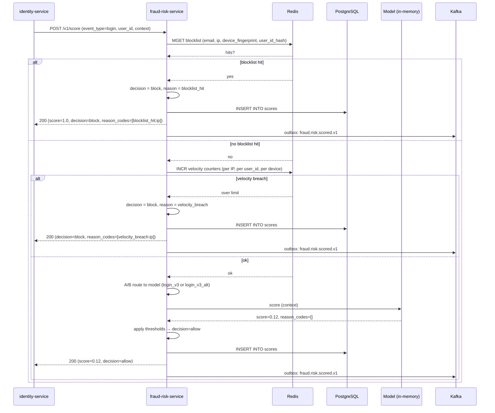
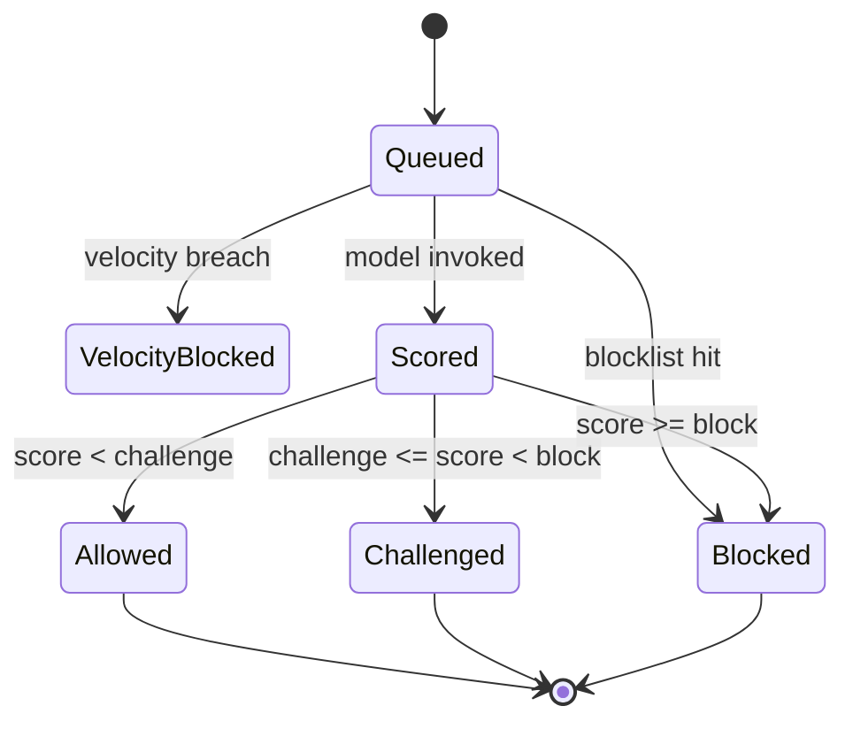
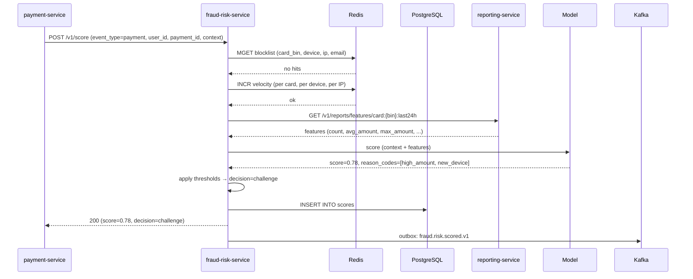
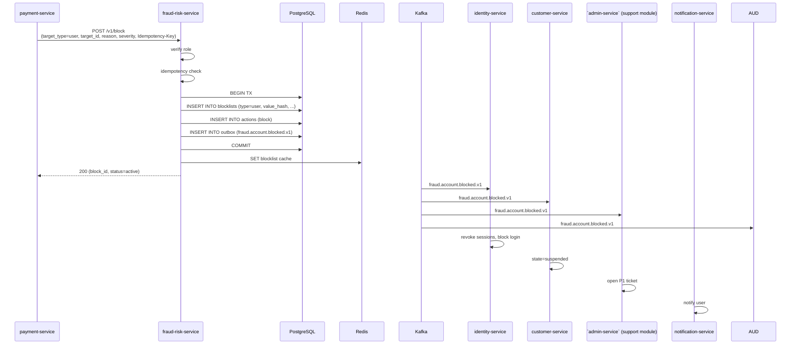
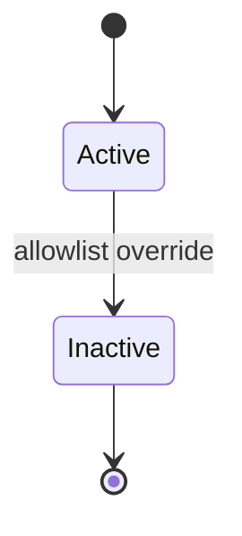
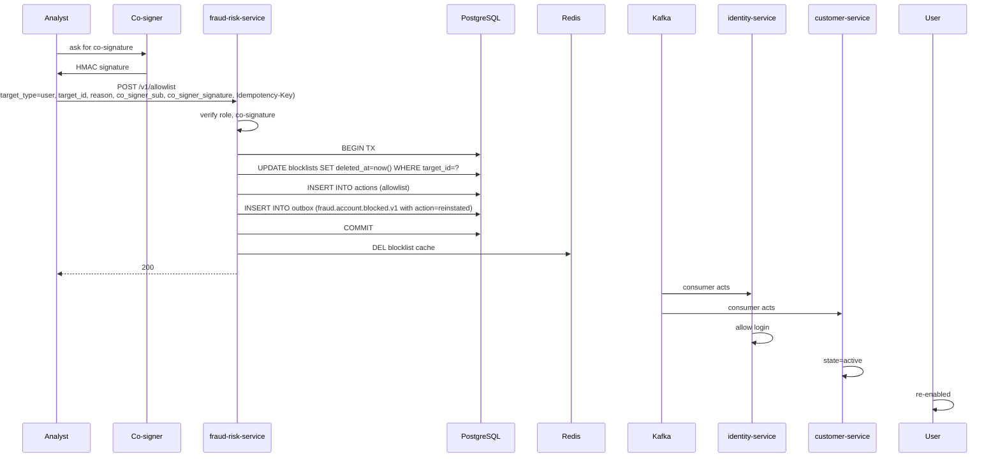
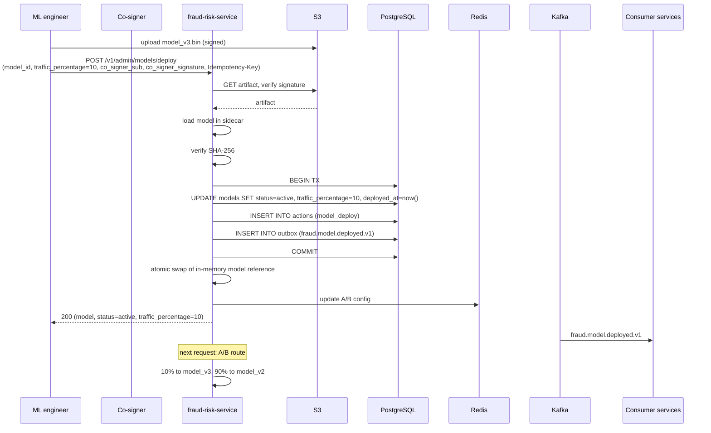
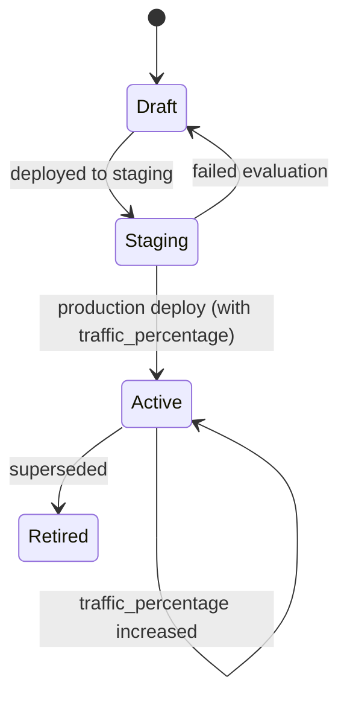
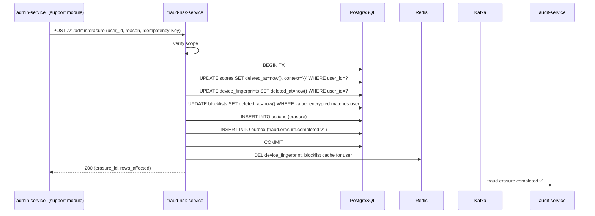

# fraud-risk-service — Workflows

## 1. Real-Time Login Scoring

### 1.1 Objective

Score a login event in real time and return
`allow` / `challenge` / `block` to the calling service
(typically `identity-service`).

### 1.2 Initiating Actor

`identity-service` (via `POST /v1/score`).

### 1.3 Participating Services

- `fraud-risk-service` (this service).
- `identity-service` (caller; consumer of the score).
- Redis (blocklist, velocity, device fingerprint).
- S3 (model artifact).

### 1.4 Prerequisites

- The user is logging in.
- A model is loaded (active or fallback).

### 1.5 Happy Path



### 1.6 Alternate Paths

- **Blocklist cache miss** (Redis cold): fall back to
  PostgreSQL; slower but correct.
- **Velocity check** is per IP, per user_id, per device per
  minute / hour / day.
- **Device fingerprint** is a hint; the model decides.

### 1.7 Failure Paths

- **Blocklist hit**: immediate `block`.
- **Velocity breach**: immediate `block`.
- **Model inference fails**: fall back to the rule-based
  model. If the fallback also fails, return `challenge`
  (safest default).
- **DB write fails**: the score is returned to the caller
  (in-memory); the outbox poller retries the DB write.
  The caller still gets a decision.
- **Kafka emit fails**: outbox poller retries.

### 1.8 Business Rules

- BR--010, BR--011, BR--020, BR--022, BR--024.
- FR--001..FR--007, FR--010, FR--015, FR--016.

### 1.9 State Transitions

The score lifecycle:



### 1.10 Events

| Event | Direction | When |
|-------|-----------|------|
| `fraud.risk.scored.v1` | produced | on every score |

### 1.11 APIs Involved

| API | Direction | When |
|-----|-----------|------|
| `POST /v1/score` | inbound | start of flow |

### 1.12 Compensation / Rollback

- A score is informational; the caller (e.g.
  `identity-service`) decides what to do. If the score
  was wrong, the user can be unblocked via the allowlist
  (workflow 4).

### 1.13 Final State

- A `scores` row with the final score, decision, and
  reason codes.
- An outbox row for `fraud.risk.scored.v1`.

## 2. Real-Time Payment Scoring

### 2.1 Objective

Score a payment attempt in real time and return
`allow` / `challenge` / `block` to `payment-service`.

### 2.2 Initiating Actor

`payment-service` (via `POST /v1/score`).

### 2.3 Participating Services

- `fraud-risk-service` (this service).
- `payment-service` (caller; consumer of the score).
- `reporting-service` (read aggregated features).

### 2.4 Prerequisites

- The user is attempting a payment.
- A model is loaded.

### 2.5 Happy Path



### 2.6 Alternate Paths

- **Score ≥ block threshold**: `decision=block`;
  `payment-service` declines the payment.
- **Blocklist hit** (e.g. card BIN on a stolen-card list):
  immediate `block`.

### 2.7 Failure Paths

- **Reporting service down**: the model falls back to
  context-only features; the score may be less accurate
  but the service still returns a decision.
- **Model inference fails**: fall back to rule-based; if
  also fails, return `challenge`.
- **DB write fails**: same as workflow 1.

### 2.8 Business Rules

Same as workflow 1, with `event_type=payment`.

### 2.9 State Transitions

Same as workflow 1.

### 2.10 Events

| Event | Direction | When |
|-------|-----------|------|
| `fraud.risk.scored.v1` | produced | on every score |

### 2.11 APIs Involved

| API | Direction | When |
|-----|-----------|------|
| `POST /v1/score` | inbound | start of flow |
| `GET /v1/reports/features/...` | outbound | feature fetch |

### 2.12 Compensation / Rollback

- A score is informational. If wrong, the user can be
  unblocked via the allowlist.

### 2.13 Final State

- A `scores` row.
- An outbox row for `fraud.risk.scored.v1`.

## 3. Account Block on Confirmed Fraud

### 3.1 Objective

When fraud is confirmed (e.g. a chargeback is won, a
collusion case is closed), block the user's account and
all related artifacts (cards, devices) within 60 seconds.

### 3.2 Initiating Actor

`payment-service` (after a chargeback won) or a fraud
analyst (manual case closure).

### 3.3 Participating Services

- `fraud-risk-service` (this service) — records the
  block, emits events.
- `identity-service` — consumer of
  `fraud.account.blocked.v1`; revokes sessions, blocks
  login.
- `customer-service` / `driver-service` /
  `courier-service` — consumer; suspends profile.
- ``admin-service` (support module)` — consumer; opens a P1 ticket for
  review.
- `notification-service` — notifies the user.

### 3.4 Prerequisites

- A confirmed-fraud event has been recorded.
- The actor has the appropriate role.

### 3.5 Happy Path



### 3.6 Alternate Paths

- **Block the card BIN** instead of the user: same flow
  with `target_type=card_bin`, `target_value=<bin>`.
- **Block the device** (e.g. a stolen phone): same flow
  with `target_type=device`.

### 3.7 Failure Paths

- **Idempotency-Key reuse with different body**: 422
  `IDEMPOTENCY_KEY_REUSED`.
- **DB write fails**: the block is not recorded; the
  caller is informed; the caller can retry. The user is
  not blocked, which is a security risk; the on-call is
  paged.

### 3.8 Business Rules

- BR--015, BR--016, BR--021, BR--023.
- FR--011, FR--017, FR--021.

### 3.9 State Transitions

The blocklist state:



The user account state (in `customer-service` / etc.):
`active → suspended`.

### 3.10 Events

| Event | Direction | When |
|-------|-----------|------|
| `fraud.account.blocked.v1` | produced | on every block |

### 3.11 APIs Involved

| API | Direction | When |
|-----|-----------|------|
| `POST /v1/block` | inbound | start of flow |

### 3.12 Compensation / Rollback

- A block is reverted via `POST /v1/allowlist` (workflow 4).
- No automatic compensation.

### 3.13 Final State

- A `blocklists` row with `status=active`.
- An `actions` row (audit).
- An outbox row for `fraud.account.blocked.v1`.
- (Downstream) the user is suspended; login is blocked;
  sessions are revoked; a P1 ticket is opened.

## 4. Admin Allowlist Override (False Positive)

### 4.1 Objective

A fraud analyst or admin overrides a false-positive block,
allowing the user (or card, or device) to operate again.

### 4.2 Initiating Actor

A fraud analyst (L2) or admin, with co-signature from
another admin or `fraud_analyst_l2`.

### 4.3 Participating Services

- `fraud-risk-service` (this service).
- `identity-service` — re-enable login.
- `customer-service` / etc. — re-enable profile.

### 4.4 Prerequisites

- A block exists.
- The co-signature is valid.

### 4.5 Happy Path



### 4.6 Alternate Paths

- **Allowlist a card BIN**: same flow with `target_type=card`.
- **Allowlist a device**: same flow with `target_type=device`.

### 4.7 Failure Paths

- **Co-signature invalid**: 409 `CO_SIGNATURE_REQUIRED` or
  `SIGNATURE_INVALID`.
- **Block not found**: 404 `NOT_FOUND`.
- **DB write fails**: 500; the block remains; the user
  is not unblocked.

### 4.8 Business Rules

- BR--017, BR--022.
- FR--012, FR--018, FR--019.

### 4.9 State Transitions

The blocklist state: `active → inactive` (soft delete).

The user account: `suspended → active`.

### 4.10 Events

| Event | Direction | When |
|-------|-----------|------|
| `fraud.account.blocked.v1` (with `action=reinstated`) | produced | on allowlist |

### 4.11 APIs Involved

| API | Direction | When |
|-----|-----------|------|
| `POST /v1/allowlist` | inbound | start of flow |

### 4.12 Compensation / Rollback

- An allowlist override can be reverted by re-adding the
  block (a new `POST /v1/block` with the same
  `Idempotency-Key` would be a duplicate; use a new key).

### 4.13 Final State

- The blocklist row has `deleted_at` set.
- The Redis cache is updated.
- The user can log in again.

## 5. Model Deploy (Blue/Green)

### 5.1 Objective

Deploy a new model with zero score loss, A/B-testable, with
a co-signature for safety.

### 5.2 Initiating Actor

An ML engineer, with co-signature from another ML engineer
or admin.

### 5.3 Participating Services

- `fraud-risk-service` (this service).
- S3 (model artifact).
- All consumers of `fraud.model.deployed.v1` (`audit-service`,
  ``reporting-service` (data lake)`).

### 5.4 Prerequisites

- The model artifact is in S3 with a valid signature.
- The co-signature is valid.

### 5.5 Happy Path



### 5.6 Alternate Paths

- **Shadow deploy** (`traffic_percentage=0`): the new
  model is loaded and scores are computed in parallel
  with the old model, but the old model's decision is
  used. The new model's scores are logged for offline
  evaluation.
- **Rollback**: `POST /v1/admin/models/deploy` with
  `model_id=<old_model_id>` and `traffic_percentage=100`.

### 5.7 Failure Paths

- **S3 download fails**: 503; the deploy is aborted; the
  in-memory model is unchanged.
- **Signature verification fails**: 409 `SIGNATURE_INVALID`;
  the deploy is aborted.
- **SHA-256 mismatch**: 409 `INTEGRITY_FAILED`; the
  deploy is aborted.
- **DB write fails**: 500; the in-memory model may be
  loaded but the deploy is not recorded; a reconciliation
  job detects the mismatch and rolls back.

### 5.8 Business Rules

- BR--006, BR--007, BR--012, BR--013.
- FR--008, FR--009, FR--019.

### 5.9 State Transitions

The model state:



### 5.10 Events

| Event | Direction | When |
|-------|-----------|------|
| `fraud.model.deployed.v1` | produced | on deploy |

### 5.11 APIs Involved

| API | Direction | When |
|-----|-----------|------|
| `POST /v1/admin/models/deploy` | inbound | start of flow |
| S3 GET | outbound | load artifact |

### 5.12 Compensation / Rollback

- A failed deploy has no rollback; the in-memory model is
  unchanged.
- A successful deploy can be rolled back by deploying
  the old model with `traffic_percentage=100`.

### 5.13 Final State

- `models` row updated to `status=active`,
  `traffic_percentage=10`, `deployed_at=now()`.
- In-memory model reference swapped atomically.
- Redis A/B config updated.
- Outbox row for `fraud.model.deployed.v1`.

## 6. Right-to-Erasure

### 6.1 Objective

Honor a GDPR / PDPL right-to-erasure request: delete the
user's scores, device fingerprints, and user-specific
blocklist entries within 24 hours.

### 6.2 Initiating Actor

``admin-service` (support module)` (via `POST /v1/admin/erasure` or a
dedicated internal endpoint).

### 6.3 Participating Services

- `fraud-risk-service` (this service) — erases the
  user's data.
- `audit-service` (consumer of erasure events).

### 6.4 Prerequisites

- The actor is ``admin-service` (support module)` with the appropriate
  scope.
- The user has been verified.

### 6.5 Happy Path



### 6.6 Alternate Paths

- **Model is de-identified, not erased**: the model itself
  is not modified (no per-user data is in the model).
- **Blocklist entries that are not user-specific** (e.g.
  a stolen card BIN) are NOT erased.

### 6.7 Failure Paths

- **DB write fails**: 500; the erasure is not recorded;
  the caller retries.
- **Redis cleanup fails**: retried; the user's data may
  briefly remain in the cache but will be evicted on TTL.

### 6.8 Business Rules

- BR--018, BR--025.
- FR--013.

### 6.9 State Transitions

- `scores` rows: `deleted_at` set; `context` purged.
- `device_fingerprints` rows: `deleted_at` set.
- `blocklists` rows: `deleted_at` set (if user-specific).
- `actions` row created (audit).

### 6.10 Events

| Event | Direction | When |
|-------|-----------|------|
| `fraud.erasure.completed.v1` | produced | on completion |

### 6.11 APIs Involved

| API | Direction | When |
|-----|-----------|------|
| `POST /v1/admin/erasure` | inbound | start of flow |

### 6.12 Compensation / Rollback

- An erasure is not rolled back. If issued by mistake,
  the user must re-onboard.

### 6.13 Final State

- The user's scores, device fingerprints, and
  user-specific blocklist entries are deleted.
- An audit row is created.
- The model is unchanged (de-identified).

## 99. `Monthly` Partition Maintenance`

### 99.1 Objective

Idempotently pre-create the next 12 month child partitions for `fraud_risk.scores` + `fraud_risk.actions` so an INSERT at any time lands in an existing child. The drop half is handled by the per-service retention job.

### 99.2 Initiating Actor

A scheduled job runs daily at `02:00 UTC`. Leader-elected via `pg_try_advisory_xact_lock(hashtext('fraud_risk.partition'), hashtext('monthly'))`.

### 99.3 Happy Path

```mermaid
sequenceDiagram
    participant JOB as Partition job
    participant PG as PostgreSQL
    JOB->>PG: pg_try_advisory_xact_lock('fraud_risk.monthly')
    alt lock acquired
        loop for each missing month in next 12
            JOB->>PG: CREATE TABLE IF NOT EXISTS fraud_risk.table_month PARTITION OF fraud_risk.table
            JOB->>PG: verify (pg_inherits, relpartbound)
        end
        JOB->>PG: assert now() in existing child
    else lock NOT acquired
        Note over JOB: another instance is running; exit cleanly
    end
```

### 99.4 Failure Paths

| Failure | Handling |
|---------|----------|
| Lock contention | exit 0 |
| DDL fails | retry 3× with backoff (1 s / 4 s / 16 s); page on-call |
| Today's child missing | critical alert; INSERTs would fail |

### 99.5 Business Rules

- Pre-create 12 complete future months.
- Every child is created with `CREATE TABLE IF NOT EXISTS … PARTITION OF …` so the job is safe to run twice in the same window.
- A verification step (`pg_inherits` parent + `relpartbound` range) runs after every `CREATE TABLE IF NOT EXISTS` because `IF NOT EXISTS` only guards the name, not the bounds.
- Optionally emit `audit.partition.maintained.v1` on success.

---

## See also

### Sibling docs for this service

- [`README.md`](./README.md) — purpose, bounded context, responsibilities
- [`BRD.md`](./BRD.md) — business requirements
- [`SRS.md`](./SRS.md) — functional + non-functional requirements
- [`ERD.md`](./ERD.md) — data model (entities, relationships)
- [`INTEGRATION.md`](./INTEGRATION.md) — inter-service contracts (APIs, events, sagas)
- [`WORKFLOWS.md`](./WORKFLOWS.md) — operational workflows (happy paths, failure modes)
- [`TECH.md`](./TECH.md) — technology profile (runtime, libraries, data layer, admin endpoints, RBAC)

### Platform-wide

- [`../../shared/README.md`](../../shared/README.md) — `platform-spring-boot-starter` shared library (the single source of cross-cutting code for all Spring Boot services in the platform)
- [`../RECOMMENDATIONS.md`](../RECOMMENDATIONS.md) — platform-wide technology map (language, framework, version baseline, admin/RBAC pattern)
- [`../../README.md`](../../README.md) — services overview (the catalog of all 58 services)
- [`../../../main.md`](../../../main.md) — top-level platform specification (architecture, Keycloak, PostgreSQL 18, messaging, observability baseline)

