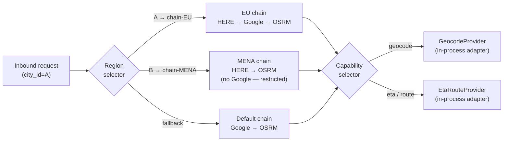

# geolocation-service

## 1. Purpose

`geolocation-service` is the platform's geospatial adapter. It is a
**stateless, read-cache facade** in front of an external map provider
(Google, Mapbox, HERE, or similar). It owns the geocode cache, ETA
cache, and route cache that other services use to keep map-provider
traffic — and money — bounded, and exposes a small, stable interface
that decouples the rest of the platform from any one map vendor.

## 2. Bounded Context

**Bounded Context**: *Geocoding / ETA / routing adapter*.

In scope:

- Forward and reverse geocoding with a persistent cache.
- ETA and route computation with a persistent cache.
- Last-known city lookup (reverse geocode cached aggressively).
- Vendor abstraction: anti-corruption layer that hides the upstream
  provider's API and translates to the platform's canonical
  representation.
- Surge-zone-friendly cache invalidation hooks (invalidate when
  `zone-service` updates a polygon).

Out of scope:

- Driver and courier live location streams — owned by
  `driver-location-service` and `courier-tracking-service`.
- Service-zone polygon storage — owned by `zone-service`.
- Turn-by-turn navigation UI.
- Map tile rendering.

## 3. Responsibilities

- Provide a `POST /v1/geocodes` (forward) and `GET /v1/geocodes/reverse`
  (reverse) API.
- Provide a `POST /v1/etas` API for ETA estimation.
- Provide a `POST /v1/routes` API for routing.
- Provide a `GET /v1/cities/lookup` (last-known city) API.
- Maintain a high-fidelity cache (PostGIS + Redis) keyed by query
  fingerprint and bounding box.
- Translate between the map vendor's response shape and the platform's
  canonical `GeoPoint`, `GeoAddress`, `EtaEstimate`, and `Route`
  shapes.
- Enforce per-vendor rate limits with a token bucket and circuit
  breaker.
- Emit `geolocation.geocoded.v1` and `geolocation.eta.computed.v1`
  events for analytics and cache-validity tracking.
- Refresh cache entries on a TTL and on explicit invalidation
  (consume `zone.updated.v1`).

## 4. Provider Model

`geolocation-service` is a **provider-agnostic adapter**. It does not
"call Google"; it calls an ordered **provider chain** whose members
implement a canonical `MapProvider` interface. The chain, the per-region
routing, the per-capability selection, the circuit breaker, and the
self-host option are all configuration — not code.

### 4.1 Capabilities

Every provider advertises which of these it supports:

| Capability | Description | Example providers |
|---|---|---|
| `geocode_forward` | Free-text address → coordinate + structured address | Google, Mapbox, HERE, Pelias, Nominatim, Photon |
| `geocode_reverse` | Coordinate → structured address | Google, Mapbox, HERE, Pelias, Nominatim, Photon |
| `eta` | Two points (+ waypoints) → ETA + distance | Google, Mapbox, HERE, OSRM, Valhalla |
| `route` | Two points (+ waypoints) → polyline + steps | Google, Mapbox, HERE, OSRM, Valhalla |
| `autocomplete` | Prefix → ranked place candidates | Google, Mapbox, HERE, Pelias |
| `place_details` | Place ID → canonical place record | Google, Mapbox, HERE, Pelias |
| `static_map` | Coordinate + zoom → image URL | Google, Mapbox, HERE |

A provider can support any subset. `OSRM` only supports `eta` and
`route`; `Nominatim` only supports geocode. The chain resolver picks
the **next provider in the chain that supports the requested capability**.

### 4.2 Provider roles

Within a capability, each chain member has exactly one role:

| Role | Meaning | Use case |
|---|---|---|
| `primary` | First try | The vendor we have a commercial relationship with for this region. |
| `secondary` | Tried if `primary` fails or is circuit-open | A different vendor, for vendor-risk diversification. |
| `fallback` | Tried if `primary` + `secondary` are both open | Usually self-host (OSRM/Valhalla), so we have a cost-bounded last resort. |
| `static` | Never makes an outbound call; serves only cache | Offline / restricted-region / incident mode. |

### 4.3 Per-region routing

A chain is scoped to a region — a city, a country, or a "global"
catch-all. The resolver picks the most specific chain that contains the
request's `city_id` (resolved via `zone-service` if not provided).

This is how the platform runs in **restricted regions** (e.g. mainland
China, where Google and Mapbox are blocked) without forking code: the
chain for that region omits the blocked vendor and adds a self-host
fallback.

### 4.4 Supported providers (built-in adapters)

The service ships adapters for these providers out of the box:

| Vendor | Adapter type | Capabilities | Notes |
|---|---|---|---|
| **Google Maps Platform** | commercial, REST | all 7 | Bearer API key, no mTLS |
| **Mapbox** | commercial, REST | all 7 | Bearer API key, no mTLS |
| **HERE Maps** | commercial, REST + mTLS | all 7 | OAuth2 client-credentials; mTLS supported |
| **OpenStreetMap / OSRM** | self-host | `eta`, `route` | No API key; tile-server or container; high availability on the platform side |
| **Valhalla** | self-host | `eta`, `route` | No API key; container; tile-server |
| **Nominatim** | self-host | `geocode_forward`, `geocode_reverse` | OSM-based; 1 req/s fair-use — only suitable as fallback |
| **Pelias** | self-host | all except `static_map` | Modular OSM geocoder |
| **Photon** | self-host | `geocode_forward`, `geocode_reverse` | OSM-based; lighter than Pelias |
| **Mock provider** | in-process | all 7 | Default in local dev and CI; deterministic responses |

Adding a new provider is an adapter-implementation task: implement the
`MapProvider` Go interface, register it under a `vendor_id`, and add a
row to `provider_config`. No core code changes.

### 4.5 Chain resolver semantics

For each request the resolver returns a **provider invocation plan** —
an ordered list of provider IDs — as follows:

1. Resolve the request's region from `city_id` (fallback: `Accept-Language`
   country code, fallback: `default` region).
2. Load the chain for that region + capability from `provider_config`
   (cached for 60 s).
3. For each member of the chain, in order:
   - skip if its circuit is open (open until cooldown elapses);
   - skip if the provider does not advertise the requested capability;
   - skip if its rate-limit bucket is empty;
   - otherwise: invoke.
4. On success: write the canonical response to the cache (key includes
   `vendor_id` so we never overwrite a hot entry from another vendor),
   emit the analytics event, return.
5. On retryable failure (timeout, 5xx): advance to the next member.
6. On non-retryable failure (4xx validation): return the error to the
   caller (do **not** advance; the next vendor would fail the same way).
7. If the chain is exhausted: return `503 CIRCUIT_OPEN` with the list of
   tried providers in the error details.

The chain resolver is the **single integration point** between
geocoding logic and the network. Everything else (caching, rate
limiting, circuit breaking, observability) is generic across providers.

See `INTEGRATION.md` §4 for the adapter contract, `ERD.md` §3.4 for
`provider_config`, and `WORKFLOWS.md` §5 for the multi-provider
workflows (happy path, fallback activation, self-host path).

## 5. Explicitly NOT Owned

- **Driver/courier live locations** — `driver-location-service` and
  `courier-tracking-service`. We only serve cache and ETA queries.
- **Zone polygons** — `zone-service`. We read zone information to
  decide cache key granularity (e.g. per-city) but do not store
  polygons.
- **Map tile rendering** — front-end concern.
- **Trip routes during a trip** — `eta-routing-service` is the
  service-time component; this service is the broader adapter.

## 5. Actors

| Actor | Type | Access |
|-------|------|--------|
| Customer app | system | read (geocode, ETA, route) |
| Driver app | system | read (geocode, route) |
| Courier app | system | read (geocode, route) |
| Merchant / restaurant back-office | system | read (geocode, ETA) |
| `ride-request-service` | system | read (geocode, ETA, route) |
| `eta-routing-service` | system | read (route, ETA) |
| `address-service` | system | read (geocode) |
| `trip-service` | system | read (route, ETA) |
| `delivery-service` | system | read (route, ETA) |
| `zone-service` | system | read (zone metadata for cache keys) |
| `admin-service` | system | admin (cache purge, provider key rotation) |
| Operations on-call | human | admin (force cache refresh, toggle provider) |

## 6. Dependencies

### Synchronous (REST)

- **Map provider** (e.g. `https://maps.googleapis.com`, Mapbox, HERE)
  — geocode, reverse-geocode, route, ETA queries — SLO 99.9% from the
  vendor; circuit breaker: yes (per-vendor).
- `zone-service` — read service-zone metadata for cache key scoping —
  SLO 99.95% — circuit breaker: yes.

### Asynchronous (events consumed)

- `zone.updated.v1` from `zone-service` — invalidate caches whose key
  crosses an updated zone boundary — duplicate handling: cache
  invalidation is idempotent.
- `configuration.updated.v1` from `configuration-service` — TTLs,
  vendor selection, surge-zone rules — duplicate handling: reload is
  idempotent (config hash compared before swap).

## 7. Technology Assumptions

- Runtime: Node 20 (TypeScript) — non-blocking I/O, good map-provider
  SDK support, fast iteration.
- Database: PostgreSQL 18 with PostGIS 3.4 in schema `geolocation`
  (cache tables only).
- Cache: Redis 7 (per-service) for hot geocode / ETA results with
  sub-millisecond reads.
- Event broker: Kafka.

## 8. Database Ownership

- Schema: `geolocation`
- Migrations: `services/geolocation-service/migrations/` (versioned,
  forward-only, golang-migrate).
- Soft delete: no (cache entries are TTL'd, not "deleted"; metadata
  audit log is append-only).
- Partitioning: no (cache tables are pruned by TTL; high-volume
  audit log is monthly-partitioned).

## 9. API Overview

| Method | URI | Auth | Purpose |
|--------|-----|------|---------|
| POST | /v1/geocodes | bearer | forward geocode an address |
| GET | /v1/geocodes/reverse | bearer | reverse geocode a coordinate |
| POST | /v1/etas | bearer | ETA between two points |
| POST | /v1/routes | bearer | full route (polyline + steps) |
| GET | /v1/cities/lookup | bearer | last-known city for a coordinate |
| POST | /v1/admin/cache/purge | bearer (admin) | purge cache entries (admin) |
| POST | /v1/admin/providers/rotate | bearer (admin) + mTLS | rotate provider key (admin) |
| GET | /v1/admin/providers | bearer (admin) | list every provider + circuit state |
| GET | /v1/admin/providers/{vendor_id} | bearer (admin) | one provider + recent probes |
| POST | /v1/admin/providers/{vendor_id}/test | bearer (admin) + mTLS | invoke one provider directly (bypass chain) |
| PUT | /v1/admin/region-chains/{region}/{capability} | bearer (platform_engineer) + mTLS + co-sign | set the chain for a region at runtime |
| PATCH | /v1/admin/providers/{vendor_id} | bearer (platform_engineer) | toggle `enabled`, update rate limits, etc. |

(Full contracts in INTEGRATION.md.)

## 10. Events Produced

| Event | Trigger | Consumers |
|-------|---------|-----------|
| `geolocation.geocoded.v1` | every geocode request (hit or miss → vendor) | `analytics-service`, `reporting-service` |
| `geolocation.eta.computed.v1` | every ETA request | `analytics-service` |
| `geolocation.cache.invalidated.v1` | cache purge by zone / admin | `analytics-service`, `audit-service` |

(Full contracts in INTEGRATION.md.)

## 11. Events Consumed

| Event | Producer | Reason | Handler |
|-------|----------|--------|---------|
| `zone.updated.v1` | `zone-service` | polygon changed; cache keys for that zone may be stale | invalidate matching cache entries (idempotent) |
| `configuration.updated.v1` | `configuration-service` | vendor selection, TTLs, surge rules changed | reload config hash, swap if changed |
| `feature_flag.updated.v1` | `feature-flag-service` | toggle mock provider, debug logging | re-evaluate flag values |

(Full contracts in INTEGRATION.md.)

## 12. External Integrations

- **Map provider (Google / Mapbox / HERE)** — geocode, route, ETA.
  Credentials in Vault at `kv/platform/<env>/geolocation/<vendor>`.
  API key rotation is automated; mTLS where the vendor supports it
  (HERE supports it; Google and Mapbox are key-only over HTTPS).
- **Vault** — provider keys, internal admin tokens.

## 13. Configuration

The chain, the per-region routing, and the per-provider credentials live
**primarily in the database** (`provider_config`, `provider_region_route`
— see `ERD.md`) so the platform can change chains without a redeploy.
The values below are **defaults** loaded by the configuration-service
and applied when a row in `provider_config` is missing or its `enabled`
flag is `false`.

| Key | Type | Source | Notes |
|-----|------|--------|-------|
| `geolocation.default_provider_chain` | string[] | configuration-service | ordered list of `vendor_id`s used when no region-specific chain matches |
| `geolocation.region.{city_id}.provider_chain.{capability}` | string[] | configuration-service | ordered list per region and capability; loaded into `provider_region_route` on boot |
| `geolocation.circuit_breaker.failure_threshold` | int | configuration-service | consecutive failures to open the circuit (default 5) |
| `geolocation.circuit_breaker.cooldown_seconds` | int | configuration-service | how long the circuit stays open before half-open (default 30) |
| `geolocation.circuit_breaker.half_open_probe_count` | int | configuration-service | probes allowed in half-open state (default 3) |
| `geolocation.geocode.ttl_seconds` | int | configuration-service | default 86400 (24h) |
| `geolocation.eta.ttl_seconds` | int | configuration-service | default 60 |
| `geolocation.route.ttl_seconds` | int | configuration-service | default 300 |
| `geolocation.surge_zone.cache_invalidate_on_update` | bool | configuration-service | default true |
| `geolocation.rate_limit.vendor.{vendor_id}.qps` | int | configuration-service | token-bucket per provider |
| `geolocation.provider_chain.cache_ttl_seconds` | int | configuration-service | how long to cache the chain plan in memory (default 60) |
| `geolocation.health_probe.interval_seconds` | int | configuration-service | background health probe interval (default 30) |

## 14. Security

- **AuthN**: bearer JWT (validated at gateway) for user-facing routes;
  service-account (client_credentials) for service-to-service
  internal routes; mTLS + admin role for `/v1/admin/*`.
- **AuthZ**: RBAC roles (`customer`, `driver`, `courier`,
  `merchant_staff`, `service`, `admin`). No resource-level ownership
  checks — geolocation queries are not owned; rate-limited per
  `sub`.
- **Secrets**: provider keys in Vault; rotated quarterly with a
  runbook for manual rotation. No keys in env, config, or source.
- **PII**: reverse geocodes can resolve to street-level addresses
  (Confidential class). Stored in the `geocodes` cache table with
  column-level encryption (`pgcrypto`) for the formatted address
  field. Cache TTL ≤ 24h; access logged per read.

## 15. Observability

- **Logs**: JSON to stdout; fields: `correlation_id`, `trace_id`,
  `service=geolocation-service`, `route`, `latency_ms`, `status`,
  `vendor`, `cache_hit`.
- **Metrics**: RED (per route) + vendor-call RED + business
  (`geocode_requests_total{cache_hit,vendor_id,region,capability,status}`,
  `eta_requests_total{cache_hit,vendor_id,region,capability,status}`,
  `geocode_cache_size_bytes`, `cache_hit_ratio`,
  `vendor_circuit_state{vendor_id,state}`,
  `vendor_rate_limit_remaining{vendor_id}`,
  `provider_chain_length{region,capability}`,
  `provider_fallback_activations_total{from_vendor,to_vendor,region}`,
  `provider_health_probe_duration_seconds{vendor_id,result}`).
- **Traces**: OpenTelemetry; root span per request; vendor calls
  as child spans (`vendor.geocode`, `vendor.route`).
- **Health**: `/health` (process up), `/ready` (DB + Redis + Kafka
  reachable; vendor circuit not fully open for the primary
  provider), `/started` (migrations done, warm cache loaded).

## 16. Scalability

- **Replicas**: default 6 (geocode is hot — many services depend on
  it).
- **HPA**: CPU 60%, custom metric
  `geocode_requests_per_second > 200` per replica.
- **Hot path**: forward geocode. Cache hit target ≥ 90% in steady
  state. Cache miss path goes to vendor, so P99 is dominated by
  vendor latency (typically 200–400ms) plus our overhead.

## 17. Local Development

- `docker compose up geolocation-service` brings up the service,
  its DB, and a Redis container, with a **mock provider** for offline
  use. The default local chain is `[mock]`.
- Seed data: 1000 mock geocodes around EU-WEST and US-EAST test
  cities, loaded by `make seed`.
- Map vendor mock returns canned responses for known queries; CI
  tests use the mock, not the live vendor.
- **Provider CLI** (`bin/geolocation-provider`):
  - `list` — print all configured providers and their health.
  - `test <vendor_id> <query>` — invoke one provider with a query
    (bypasses the chain) and print the canonical response.
  - `chain set --region <city_id> --capability <c> <vendor_ids…>` —
    edit the chain for a region (writes to `provider_region_route`).
  - `probe <vendor_id>` — force a health probe.
- **OSRM in compose** (optional, profile `osrm`):
  `docker compose --profile osrm up` adds an OSRM container with the
  Monaco demo extract. Lets you exercise the self-host path without
  network egress.

## 18. Deployment

- **Image**: `ghcr.io/uber/geolocation-service:<git-sha>`.
- **Replicas**: 6 in production (3 per AZ minimum).
- **Resource limits**: see deployment-arch (`cpu: 500m`,
  `memory: 768Mi` requests; 1 CPU, 1.5Gi limits).
- **Migrations**: run as a Kubernetes Job on deploy (init
  container), before the new pod is marked ready.
- **Provider keys**: loaded from Vault on pod start; restart on
  rotation.

---

## See also

### Sibling docs for this service

- [`README.md`](./README.md) — purpose, bounded context, responsibilities
- [`BRD.md`](./BRD.md) — business requirements
- [`SRS.md`](./SRS.md) — functional + non-functional requirements
- [`ERD.md`](./ERD.md) — data model (entities, relationships)
- [`INTEGRATION.md`](./INTEGRATION.md) — inter-service contracts (APIs, events, sagas)
- [`WORKFLOWS.md`](./WORKFLOWS.md) — operational workflows (happy paths, failure modes)
- [`TECH.md`](./TECH.md) — technology profile (runtime, libraries, data layer, admin endpoints, RBAC)

### Related services

- **Depends on**: [`address-service`](../address-service/README.md), [`admin-service`](../admin-service/README.md), [`analytics-service`](../analytics-service/README.md), [`audit-service`](../audit-service/README.md), [`configuration-service`](../configuration-service/README.md), [`courier-tracking-service`](../courier-tracking-service/README.md), [`delivery-service`](../delivery-service/README.md), [`driver-location-service`](../driver-location-service/README.md), [`eta-routing-service`](../eta-routing-service/README.md), [`feature-flag-service`](../feature-flag-service/README.md), [`reporting-service`](../reporting-service/README.md), [`ride-request-service`](../ride-request-service/README.md), [`trip-service`](../trip-service/README.md), [`zone-service`](../zone-service/README.md)
- **Depended on by**: [`address-service`](../address-service/README.md), [`branch-service`](../branch-service/README.md), [`courier-dispatch-service`](../courier-dispatch-service/README.md), [`courier-service`](../courier-service/README.md), [`customer-service`](../customer-service/README.md), [`delivery-service`](../delivery-service/README.md), [`driver-location-service`](../driver-location-service/README.md), [`driver-service`](../driver-service/README.md), [`eta-routing-service`](../eta-routing-service/README.md), [`pricing-service`](../pricing-service/README.md), [`restaurant-service`](../restaurant-service/README.md), [`ride-request-service`](../ride-request-service/README.md), [`search-service`](../search-service/README.md), [`zone-service`](../zone-service/README.md)

> Full dependency map in [`../README.md`](../README.md) and [`../../architecture/MICROSERVICES_MAP.md`](../../architecture/MICROSERVICES_MAP.md).

### Platform-wide

- [`../../shared/README.md`](../../shared/README.md) — `platform-spring-boot-starter` shared library (the single source of cross-cutting code for all Spring Boot services in the platform)
- [`../../shared/PLATFORM_BASELINE.md`](../../shared/PLATFORM_BASELINE.md) — single source for PostgreSQL 18, Kafka, Keycloak, Redis, OpenTelemetry, Vault, deployment, DR (do not restate these in this README)
- [`../../architecture/SERVICE_ISOLATION.md`](../../architecture/SERVICE_ISOLATION.md) — **how this service behaves when a downstream is down** (timeout / bulkhead / circuit / retry / fallback, by class: CRITICAL / DEGRADABLE / BEST-EFFORT)
- [`../../architecture/DOWNSTREAM_ERROR_CATALOG.md`](../../architecture/DOWNSTREAM_ERROR_CATALOG.md) — **canonical error-code catalog + propagation rules** (the `downstream` block, forward/translate/degrade/reject)
- [`../RECOMMENDATIONS.md`](../RECOMMENDATIONS.md) — platform-wide technology map (language, framework, version baseline, admin/RBAC pattern)
- [`../../README.md`](../../README.md) — services overview (the catalog of all 58 services)
- [`../../../main.md`](../../../main.md) — top-level platform specification (architecture, Keycloak, PostgreSQL 18, messaging, observability baseline)
- [`../../shared/OSS_DEPENDENCIES.md`](../../shared/OSS_DEPENDENCIES.md) — **open-source dependencies & license attribution** (platform-wide OSS projects + per-language OSS libraries with SPDX IDs; per-service bundle index; license compatibility matrix)

### Workflows this service participates in

- [`../../workflows/RIDE_WORKFLOWS.md`](../../workflows/RIDE_WORKFLOWS.md) — end-to-end ride flows
- [`../../workflows/FOOD_ORDER_WORKFLOWS.md`](../../workflows/FOOD_ORDER_WORKFLOWS.md) — end-to-end order/delivery flows
