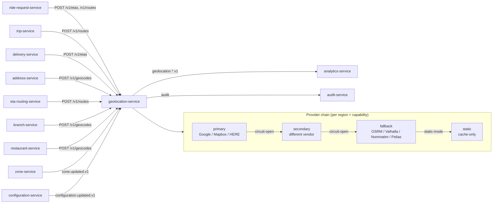

# geolocation-service — Software Requirements Specification

## 1. Introduction

This SRS specifies, for the engineering team, the functional,
non-functional, data, security, and operational requirements of
`geolocation-service`. It is derived from `BRD.md` and from the
platform's cross-service architecture (`API_STANDARDS.md`,
`DATABASE_ARCHITECTURE.md`, `EVENT_ARCHITECTURE.md`,
`SECURITY_ARCHITECTURE.md`, `OBSERVABILITY.md`).

## 2. Scope

In scope:

- All REST endpoints listed in `INTEGRATION.md` (geocode,
  reverse-geocode, ETA, route, last-known city, admin cache
  management, **provider admin API**).
- Cache and persistent storage (PostgreSQL + PostGIS + Redis).
- **Multi-provider chain resolver** — ordered, per-region,
  per-capability chains of commercial and self-host adapters,
  with circuit breaker and rate limiting.
- **Provider health probing** and adaptive circuit-open cooldown.
- Map-provider anti-corruption layer with circuit breaker and
  fallback.
- Cache-invalidation jobs on `zone.updated.v1`.
- Outbound events `geolocation.geocoded.v1`,
  `geolocation.eta.computed.v1`, `geolocation.cache.invalidated.v1`,
  `geolocation.provider_chain.changed.v1`.

Out of scope:

- Driver / courier live location stream.
- Service-zone polygon authoring (zone CRUD is in `zone-service`).
- Map tile rendering.
- On-device geocoding (e.g. mobile SDK offline mode).

## 3. System Context

## 4. Actors

| Actor | Type | Description |
|-------|------|-------------|
| `customer-service` | system | calls geocode, ETA, route for ride and food flows |
| `driver-service` | system | calls geocode, route for driver app |
| `courier-service` | system | calls geocode, route for courier app |
| `ride-request-service` | system | calls ETA, route at request time |
| `trip-service` | system | calls route during a trip |
| `delivery-service` | system | calls ETA, route during a delivery |
| `eta-routing-service` | system | calls route for trip-time estimates |
| `address-service` | system | calls geocode when a user saves an address |
| `zone-service` | system | publishes `zone.updated.v1`; we consume for invalidation |
| `configuration-service` | system | publishes `configuration.updated.v1` |
| `feature-flag-service` | system | publishes `feature_flag.updated.v1` |
| Admin (human) | human | force-purge cache, rotate provider keys |

## 5. Functional Requirements

| ID | Requirement | Priority |
|----|-------------|----------|
| FR--001 | The service MUST expose `POST /v1/geocodes` accepting a free-text address, locale, and region hint, returning a canonical `GeoAddress` with at least one `coordinate`. | MUST |
| FR--002 | The service MUST expose `GET /v1/geocodes/reverse` accepting lat/lon, locale, returning a canonical `GeoAddress` (street-level when available, centroid-level otherwise). | MUST |
| FR--003 | The service MUST expose `POST /v1/etas` accepting origin, destination, optional waypoints and departure time, returning a `EtaEstimate` with `seconds`, `distance_meters`, and `traffic_bucket`. | MUST |
| FR--004 | The service MUST expose `POST /v1/routes` accepting origin, destination, optional waypoints and `alternatives` flag, returning a `Route` with `polyline`, `distance_meters`, `seconds`, and ordered `steps`. | MUST |
| FR--005 | The service MUST expose `GET /v1/cities/lookup` accepting lat/lon, returning the platform's `city_id` (UUID of the city) and the city name. | MUST |
| FR--006 | The service MUST cache every successful vendor response in PostgreSQL with the canonical schema; hot entries also in Redis. | MUST |
| FR--007 | The service MUST compute the cache key per the rules in `BRD.md` §8 (BR--020..BR--023). | MUST |
| FR--008 | The service MUST consume `zone.updated.v1` and invalidate any cache entry whose key's bounding box intersects the updated polygon. | MUST |
| FR--009 | The service MUST enforce a token-bucket per-provider rate limit (configurable QPS) and trip a per-provider circuit breaker on ≥ N consecutive failures (configurable) within a window. | MUST |
| FR--010 | The service MUST, when a chain member's circuit is open, skip it and try the next member in the resolved chain; if all members are exhausted it returns 503 `CIRCUIT_OPEN` listing the providers tried. | MUST |
| FR--011 | The service MUST emit `geolocation.geocoded.v1` for every geocode (cache hit AND miss), `geolocation.eta.computed.v1` for every ETA, `geolocation.cache.invalidated.v1` for every cache purge (zone-driven or admin), and `geolocation.provider_chain.changed.v1` for every chain edit. | MUST |
| FR--012 | The service MUST expose `POST /v1/admin/cache/purge` (admin role) accepting city, bounding box, or query fingerprint filter, performing the purge idempotently. | MUST |
| FR--013 | The service MUST support a mock provider (selected by feature flag) that returns canned responses from a local fixture file, used in dev, test, and CI. | MUST |
| FR--014 | The service MUST support locale-aware response translation for the formatted address field (en, ar, plus any other configured locales). | SHOULD |
| FR--015 | The service MUST return a structured "approximate" result (centroid of the enclosing zone) for reverse geocodes in regions no chain member covers, rather than failing. | SHOULD |
| FR--016 | The service MUST reject addresses in unsupported regions with 422 `ADDRESS_UNSUPPORTED_REGION` when no member of the resolved chain serves the country (BR--026). | MUST |
| FR--017 | The service MUST honor a per-user and per-IP rate limit (defense in depth) configurable via `configuration-service`. | MUST |
| FR--018 | The service MUST validate every input against JSON Schema; failures return 400 `VALIDATION_FAILED`. | MUST |
| FR--019 | The service MUST require `Idempotency-Key` on `POST /v1/admin/cache/purge` to make purges safe to retry. | MUST |
| FR--020 | The service MUST document an OpenAPI 3.1 spec at `/openapi.json` and `/docs` (Swagger UI when enabled). | MUST |
| FR--021 | **Provider chain resolver**: the service MUST resolve an ordered provider invocation plan per request, picking the most specific chain for the request's region + capability, and skipping members that are circuit-open, capability-mismatched, or rate-limited. | MUST |
| FR--022 | **Per-region routing**: the service MUST support different chains per region (city_id, country, or default), enabling restricted markets to run chains that omit Google/Mapbox. | MUST |
| FR--023 | **Self-host adapters**: the service MUST support OSRM, Valhalla, Nominatim, Pelias, and Photon as first-class chain members with the same canonical interface as commercial providers. | MUST |
| FR--024 | **Provider health probing**: the service MUST background-probe every enabled provider at a configurable interval (`geolocation.health_probe.interval_seconds`) and expose probe results as a metric. | MUST |
| FR--025 | **Circuit-breaker state machine**: each provider MUST have a circuit that is `closed` (normal), `open` (skip), or `half-open` (admit a configured number of probe requests); transitions are exposed as a metric. | MUST |
| FR--026 | **Provider admin API**: the service MUST expose `GET /v1/admin/providers`, `GET /v1/admin/providers/{vendor_id}`, `POST /v1/admin/providers/{vendor_id}/test`, and `PUT /v1/admin/region-chains/{region}/{capability}` for runtime chain management without redeploy. | MUST |
| FR--027 | **Per-region chain caching**: the resolved chain plan MUST be cached in memory for `geolocation.provider_chain.cache_ttl_seconds` (default 60 s); cache invalidation on `configuration.updated.v1` and on chain-edit admin events. | MUST |
| FR--028 | **Static mode**: the service MUST support a `static` chain role where the provider never makes an outbound call and only serves cache, for offline / restricted-region / incident mode. | MUST |
| FR--029 | **Cost attribution**: every analytics event MUST include `vendor_id`, `chain_position`, `region`, and `capability` so cost can be attributed per provider per region. | MUST |
| FR--030 | **Provider capability advertisement**: each provider config MUST advertise which capabilities it supports; the resolver MUST skip a member that does not advertise the requested capability. | MUST |

## 6. Non-Functional Requirements

| ID | Category | Requirement | Target |
|----|----------|-------------|--------|
| NFR--001 | performance | P99 latency, forward geocode, cache hit | ≤ 500 ms |
| NFR--002 | performance | P99 latency, forward geocode, cache miss | ≤ 1500 ms |
| NFR--003 | performance | P99 latency, ETA, cache hit | ≤ 300 ms |
| NFR--004 | performance | P99 latency, route, cache miss | ≤ 1500 ms |
| NFR--005 | availability | service uptime | 99.95% (T1) |
| NFR--006 | scalability | geocodes served per second per replica | ≥ 500 |
| NFR--007 | maintainability | mean time to recover (MTTR) | ≤ 30 min |
| NFR--008 | cost | geocode cache hit ratio | ≥ 0.90 in steady state |
| NFR--009 | resilience | vendor outage survives | ≥ 5 min primary outage with no user-facing 5xx |
| NFR--010 | correctness | cache invalidation lag after zone update | P95 ≤ 60 s |
| NFR--011 | observability | all errors have `correlation_id` and `trace_id` | 100% |
| NFR--012 | portability | vendor swap | ≤ 30 days, no downstream service change |
| NFR--013 | resilience | chain exhaustion (all providers unavailable) still serves cached results | 100% of geocode/ETA/route calls served when a valid cache entry exists, regardless of provider availability |
| NFR--014 | resilience | chain failover latency | next viable provider invoked within 5 s of the previous member's circuit opening |
| NFR--015 | observability | provider cost attribution | `geocode_requests_total` and `eta_requests_total` carry `vendor_id` and `region` labels so per-provider cost is computable |
| NFR--016 | availability | self-host fallback engages | ≤ 5 s after commercial-vendor failure |
| NFR--017 | operability | chain edit (admin) takes effect | ≤ 60 s after `PUT /v1/admin/region-chains/...` returns 200 |

## 7. API Requirements

- All public endpoints follow `architecture/API_STANDARDS.md`:
  - REST, JSON, UTF-8.
  - URI versioned (`/v1/...`).
  - Bearer JWT (validated at gateway); internal calls use
    client-credentials tokens.
  - Cursor pagination on list endpoints (`/v1/admin/cache/...`).
  - Errors follow the platform envelope (see INTEGRATION.md).
  - `Idempotency-Key` required on state-changing POSTs.
  - `X-Correlation-Id` and `traceparent` propagated.

(Full contract in INTEGRATION.md.)

## 8. Data Requirements

| ID | Requirement | Notes |
|----|-------------|-------|
| DATA--001 | All cache tables live in schema `geolocation`. | per `DATABASE_ARCHITECTURE.md` |
| DATA--002 | Coordinates stored as PostGIS `geometry(Point, 4326)`. | SRID 4326 = WGS84 |
| DATA--003 | Polygons (for zone intersection) stored as `geometry(Polygon, 4326)`. | consumed from `zone-service`; we keep a denormalized copy for invalidation |
| DATA--004 | Formatted address (PII) stored encrypted (`pgcrypto`) with `created_at + ttl` for purge. | retention ≤ 24h |
| DATA--005 | Audit log table for cache purges is append-only, monthly partitioned. | retention 1y |
| DATA--006 | Primary keys are UUIDv7 (`id UUID PRIMARY KEY`). | per platform standard |
| DATA--007 | Cross-service references are UUID columns WITHOUT database FKs (e.g. `city_id`, `zone_id`). | per `DATA_OWNERSHIP.md` |
| DATA--008 | Every mutable table has `created_at`, `updated_at`, `created_by`, `updated_by`. | per platform standard |
| DATA--009 | Cache tables do NOT use soft delete; entries are TTL-pruned by a background job. | |
| DATA--010 | JSONB column allowed only for the raw vendor response payload (`vendor_response JSONB`). | justified: opaque, never queried |

## 9. Validation Rules

- **FR--001 (forward geocode)**: address length 3..256 chars;
  locale ∈ {`en`, `ar`, … configured locales}; region must be a
  valid `city_id` from `zone-service` or `null`.
- **FR--002 (reverse geocode)**: lat ∈ [-90, 90]; lon ∈ [-180, 180];
  precision of stored cache entry ≥ 6 decimal places (~10cm).
- **FR--003 (ETA)**: at most 5 waypoints; departure_time is RFC3339
  or `null` (means "now"); `traffic_bucket ∈ {low, medium, high,
  unknown}`.
- **FR--004 (route)**: at most 5 waypoints; `alternatives ∈ {0, 1}`;
  `geometry ∈ {polyline, geojson}`.
- **FR--005 (last-known city)**: lat, lon as above; must resolve
  to a known `city_id` from `zone-service`; otherwise 404
  `CITY_NOT_FOUND`.
- **FR--012 (admin purge)**: at least one of `city_id`,
  `bbox`, `query_fingerprint`; reason required; `Idempotency-Key`
  required.

## 10. State Transitions

Pointer: see `WORKFLOWS.md` §1, §2, §3. The service itself is
stateless; the only stateful element is the cache entry, whose
state is `fresh → stale (on TTL expiry or invalidation) → evicted`.

## 11. Authorization Requirements

- All `/v1/*` (non-admin) endpoints: any authenticated principal
  with a `customer`, `driver`, `courier`, `merchant_staff`,
  `restaurant_staff`, or `service` role may call. Rate-limited
  per `sub` and per IP.
- `/v1/admin/cache/purge` requires role `admin` or
  `platform_engineer`. Request body MUST be signed (HMAC-SHA256)
  with a Vault-stored per-tenant key.
- `/v1/admin/providers/rotate` requires role `platform_engineer`
  AND mTLS to a dedicated admin listener; co-signature by a
  second `platform_engineer` is required and produces a
  high-severity audit event.
- Service-to-service calls (`ride-request-service`, etc.) use
  client-credentials tokens from the `platform-services` realm.

## 12. Configuration Requirements

### 12.1 Chain & provider defaults (loaded into `provider_config`)

| Key | Type | Source | Notes |
|-----|------|--------|-------|
| `geolocation.default_provider_chain` | string[] | configuration-service | ordered list of `vendor_id`s used when no region-specific chain matches |
| `geolocation.circuit_breaker.failure_threshold` | int | configuration-service | consecutive failures to open the circuit (default 5) |
| `geolocation.circuit_breaker.cooldown_seconds` | int | configuration-service | how long the circuit stays open before half-open (default 30) |
| `geolocation.circuit_breaker.half_open_probe_count` | int | configuration-service | probes allowed in half-open state (default 3) |
| `geolocation.provider_chain.cache_ttl_seconds` | int | configuration-service | in-memory chain plan cache TTL (default 60) |
| `geolocation.health_probe.interval_seconds` | int | configuration-service | background health probe interval (default 30) |

### 12.2 Per-region chains (loaded into `provider_region_route`)

| Key | Type | Source | Notes |
|-----|------|--------|-------|
| `geolocation.region.{region}.chain.geocode_forward` | string[] | configuration-service | ordered list per region (city_id, country, or `default`) |
| `geolocation.region.{region}.chain.geocode_reverse` | string[] | configuration-service | |
| `geolocation.region.{region}.chain.eta` | string[] | configuration-service | |
| `geolocation.region.{region}.chain.route` | string[] | configuration-service | |
| `geolocation.region.{region}.chain.autocomplete` | string[] | configuration-service | |
| `geolocation.region.{region}.chain.place_details` | string[] | configuration-service | |
| `geolocation.region.{region}.chain.static_map` | string[] | configuration-service | |

### 12.3 Per-provider runtime knobs

| Key | Type | Source | Notes |
|-----|------|--------|-------|
| `geolocation.rate_limit.vendor.{vendor_id}.qps` | int | configuration-service | token bucket per provider |
| `geolocation.rate_limit.vendor.{vendor_id}.burst` | int | configuration-service | burst size (default = qps) |
| `geolocation.vendor.{vendor_id}.timeout_ms` | int | configuration-service | per-call timeout (default 1500) |
| `geolocation.vendor.{vendor_id}.cost_per_1k_usd` | numeric | configuration-service | for the cost-ceiling / cost-attribution roll-up |

### 12.4 Cache TTLs

| Key | Type | Source | Notes |
|-----|------|--------|-------|
| `geolocation.geocode.ttl_seconds` | int | configuration-service | default 86400 (24h) |
| `geolocation.eta.ttl_seconds` | int | configuration-service | default 60 |
| `geolocation.route.ttl_seconds` | int | configuration-service | default 300 |
| `geolocation.surge_zone.cache_invalidate_on_update` | bool | configuration-service | default true |

### 12.5 Feature flags

- `geolocation.mock_provider.enabled` — bool (per environment,
  controlled via `feature-flag-service`); makes the mock provider the
  single member of the chain in dev/test/CI.
- `geolocation.force_static_mode` — bool; when true, every chain is
  collapsed to its `static` members (or to cache-only) for offline /
  incident scenarios.
- `geolocation.vendor.{vendor_id}.disabled` — bool; emergency toggle
  to remove a vendor from the chain without DB edits.

All keys hot-reloadable on `configuration.updated.v1`.

## 13. Error Handling

| Error | When | Response |
|-------|------|----------|
| `VALIDATION_FAILED` | input schema or business validation fails | 400 with field-level `details[]` |
| `UNAUTHENTICATED` | missing / invalid bearer | 401 |
| `FORBIDDEN` | role missing | 403 |
| `NOT_FOUND` | resource (cache entry) not found on read | 404 |
| `RATE_LIMITED` | per-user or per-vendor limit exceeded | 429 with `Retry-After` |
| `CIRCUIT_OPEN` | primary vendor circuit open AND no fallback | 503 with `code: CIRCUIT_OPEN` |
| `DEPENDENCY_TIMEOUT` | vendor call timed out after retries | 504 |
| `ADDRESS_UNSUPPORTED_REGION` | address in region not served | 422 |
| `CITY_NOT_FOUND` | reverse geocode / last-known city in unmapped area | 404 |
| `IDEMPOTENCY_KEY_REUSED` | admin purge with same key but different body | 422 |
| `INTERNAL_ERROR` | unexpected | 500 |

All errors include `correlationId` and follow
`architecture/API_STANDARDS.md` §11.

## 14. Concurrency Requirements

- Cache writes use `INSERT … ON CONFLICT (cache_key) DO UPDATE`
  with optimistic concurrency on the `version` column. Writers
  read the current `version`, attempt the update, and retry on
  conflict (max 3 attempts).
- The cache invalidation job for `zone.updated.v1` uses
  `SELECT … FOR UPDATE SKIP LOCKED` to fan out across multiple
  workers without blocking.
- The Redis hot cache uses atomic `SET` with `NX` / `EX` flags;
  cache stampede on miss is mitigated by a single-flight
  in-process mutex keyed by `cache_key`.

## 15. Idempotency Requirements

- `POST /v1/admin/cache/purge` requires `Idempotency-Key`. The
  service stores `(admin_id, idempotency_key, request_hash,
  response_status, response_body, expires_at)` for 24h. On
  duplicate, if `request_hash` matches → return stored
  response; else 422 `IDEMPOTENCY_KEY_REUSED`.
- Vendor calls from this service are also idempotent at the
  cache level: the same `cache_key` always returns the same
  stored result. (No risk of double-calling the vendor for the
  same key.)
- All event emissions are guarded by the outbox pattern
  (see `EVENT_ARCHITECTURE.md`).

## 16. Performance

- **Dominant path**: `POST /v1/geocodes` (forward geocode).
- **P50 / P95 / P99** (cache hit): 30ms / 150ms / 500ms.
- **P50 / P95 / P99** (cache miss): 250ms / 800ms / 1500ms.
- Throughput target: 500 geocodes/s per replica at P99 ≤ 500ms.
- Cache lookup uses Redis (sub-ms) for the hot path; PostgreSQL
  is the durable store behind Redis.

## 17. Scalability

- **Horizontal scaling**: stateless replicas behind a load
  balancer. HPA on CPU 60% and on
  `geocode_requests_per_second > 200`. Max replicas 30.
- **Vertical scaling**: typical 500m CPU / 768Mi memory
  requests; 1 CPU / 1.5Gi limits. Geocoding is mostly waiting
  on vendor I/O.
- **Cache layer scaling**: Redis cluster; PostgreSQL with
  read-replica for cache reads.

## 18. Availability

- **SLO**: 99.95% over 30 days. Error budget: ~22 min / 30d.
- **Maintenance window**: Sunday 04:00–06:00 UTC, announced 7
  days in advance.
- **Dependencies**: the service is intentionally designed to
  survive vendor outages (fallback provider, in-DB cache, Redis
  cache). The map provider is the largest SLO risk.

## 19. Security

| ID | Requirement | Notes |
|----|-------------|-------|
| SEC--001 | All endpoints require a valid bearer JWT; mTLS for `/v1/admin/*`. | per `SECURITY_ARCHITECTURE.md` §4, §14 |
| SEC--002 | Provider keys stored in Vault, never in env or source; rotated quarterly. | per `SECURITY_ARCHITECTURE.md` §5 |
| SEC--003 | Reverse-geocoded formatted address (PII, Confidential class) encrypted at rest with `pgcrypto` (DEK from KEK in Vault). | per `SECURITY_ARCHITECTURE.md` §6, §7 |
| SEC--004 | Cache entries containing PII purged at TTL expiry (≤ 24h). | per `SECURITY_ARCHITECTURE.md` §7 |
| SEC--005 | Per-IP and per-`sub` rate limiting enforced at the service. | per `SECURITY_ARCHITECTURE.md` §12 |
| SEC--006 | Admin endpoints require role + HMAC signature; high-value actions (key rotation) require co-signature. | per `SECURITY_ARCHITECTURE.md` §14 |
| SEC--007 | Audit log: every admin purge, every provider key rotation, every fallback activation recorded. | per `SECURITY_ARCHITECTURE.md` §9 |
| SEC--008 | PII access (reverse geocode reads) logged at the service level with `correlation_id`, `sub`, and `route`. | per `SECURITY_ARCHITECTURE.md` §7 |
| SEC--009 | No PAN, CVV, or financial PII ever processed or stored. | per `SECURITY_ARCHITECTURE.md` §8 |

## 20. Privacy

- **PII stored**: formatted address (Confidential), coordinate
  (Internal, but considered Sensitive when paired with a user
  identity in cache).
- **Retention**: 24h for geocodes, 5 min for routes, 60s for ETAs.
- **Erasure**: on a right-to-erasure request via `support-service`,
  cache entries for the user's known addresses (by `sub` and by
  query fingerprint hash) are deleted within 1h. The service
  does not store per-`sub` address history, so most erasure
  requests are no-ops; logs are scrubbed of `sub` for matching
  events older than 24h.

## 21. Auditability

- **Audit events**:
  - `geolocation.cache.invalidated.v1` — every zone-driven or
    admin-driven purge.
  - `geolocation.provider.rotated.v1` — every provider key
    rotation (high-severity).
  - `geolocation.fallback.activated.v1` — every fallback
    activation (medium-severity).
- All admin actions also write a row to
  `geolocation.admin_audit` (append-only, monthly partitioned,
  1y retention).

## 22. Observability

- **Logs**: JSON to stdout; per `OBSERVABILITY.md`. Standard
  fields plus `vendor`, `cache_hit`, `cache_key_prefix`.
- **Metrics** (Prometheus):
  - `http_requests_total{route, method, status}`
  - `http_request_duration_seconds{route, method, status}` (histogram)
  - `geocode_requests_total{cache_hit, vendor, status}`
  - `eta_requests_total{cache_hit, vendor, status}`
  - `route_requests_total{cache_hit, vendor, status}`
  - `cache_hit_ratio{resource}` (gauge, derived)
  - `vendor_circuit_state{vendor}` (gauge, 0=closed, 1=open)
  - `vendor_rate_limit_remaining{vendor}` (gauge)
  - `cache_invalidation_lag_seconds{trigger}` (histogram)
- **Traces**: OpenTelemetry; root span per request; vendor
  calls as child spans. Sample 100% of errors, 10% of
  successes in production; 100% in staging.
- **Alerts**:
  - Cache hit ratio < 0.80 (15 min window) → warn.
  - Cache hit ratio < 0.60 (15 min window) → page.
  - Primary vendor circuit open ≥ 2 min → page.
  - P99 forward-geocode latency > 1s (15 min) → page.

## 23. Maintainability

- **Code style**: TypeScript strict, ESLint with
  `@typescript-eslint/recommended-type-checked`, Prettier.
- **Test coverage**: ≥ 85% statements, ≥ 80% branches. Every
  new endpoint has integration tests with the mock provider.
- **Documentation**: OpenAPI 3.1 spec checked into the repo
  under `services/geolocation-service/openapi.yaml`; CI
  validates the spec and the implementation match.

## 24. Disaster Recovery

- **RPO**: 1h. Cache can be rebuilt from vendor on miss.
- **RTO**: 30 min. Stateless service; failover is replica
  promotion. PostgreSQL cache is restored from PITR (7-day
  window) or rebuilt from vendor (preferred — faster).

## 25. Acceptance Criteria

- All 20 functional requirements implemented and verified by
  automated tests.
- All 12 non-functional requirements met in production
  telemetry for the prior 30 days.
- All 9 security requirements verified by an internal
  security review prior to launch.
- A mock-provider test run plus a real-provider test run both
  pass in CI.
- A simulated vendor outage (kill the primary provider for
  5 min) does not produce any 5xx in the synthetic monitoring
  suite when the fallback provider is configured.

---

## See also

### Sibling docs for this service

- [`README.md`](./README.md) — purpose, bounded context, responsibilities
- [`BRD.md`](./BRD.md) — business requirements
- [`SRS.md`](./SRS.md) — functional + non-functional requirements
- [`ERD.md`](./ERD.md) — data model (entities, relationships)
- [`INTEGRATION.md`](./INTEGRATION.md) — inter-service contracts (APIs, events, sagas)
- [`WORKFLOWS.md`](./WORKFLOWS.md) — operational workflows (happy paths, failure modes)
- [`TECH.md`](./TECH.md) — technology profile (runtime, libraries, data layer, admin endpoints, RBAC)

### Platform-wide

- [`../../shared/README.md`](../../shared/README.md) — `platform-spring-boot-starter` shared library (the single source of cross-cutting code for all Spring Boot services in the platform)
- [`../RECOMMENDATIONS.md`](../RECOMMENDATIONS.md) — platform-wide technology map (language, framework, version baseline, admin/RBAC pattern)
- [`../../README.md`](../../README.md) — services overview (the catalog of all 58 services)
- [`../../../main.md`](../../../main.md) — top-level platform specification (architecture, Keycloak, PostgreSQL 18, messaging, observability baseline)

