# geolocation-service — Workflows

## 1. Forward Geocode Request (Cache Miss → Vendor)

### 1.1 Objective

Resolve a free-text address to a coordinate and a structured
`GeoAddress`, with cache-first behavior and a vendor call on miss.

### 1.2 Initiating Actor

Any authenticated caller — typically ``customer-service` (addresses)` (when a
user saves an address), ``trip-service` (ride-request)` (at request time),
`restaurant-service` (during onboarding), or a mobile app.

### 1.3 Participating Services

- `geolocation-service` (this service).
- Map provider (primary, with optional fallback).
- `configuration-service` (read).
- ``reporting-service` (data lake)` (consumer of `geolocation.geocoded.v1`).

### 1.4 Prerequisites

- Caller has a valid bearer JWT with an appropriate role.
- The service is ready (DB + Redis + Kafka reachable).
- The configured primary map provider is in a non-open circuit
  state, OR the fallback provider is configured.

### 1.5 Happy Path

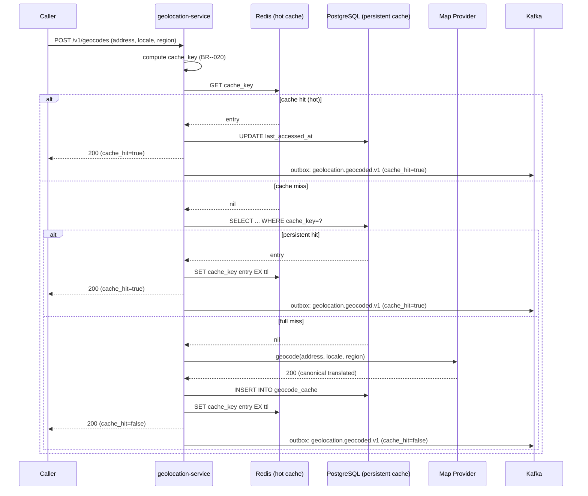

### 1.6 Alternate Paths

- **Cache miss → vendor returns multiple candidates**: the
  service picks the highest-confidence candidate whose
  `country` matches `components.country` (if provided) and
  caches it. Other candidates are discarded.
- **Locale translation**: when the requested locale differs
  from the vendor's default, the service calls the vendor
  with `language=locale` and translates the formatted address
  on the way out.

### 1.7 Failure Paths

- **Vendor 5xx**: retried with exponential backoff (max 2
  retries). On persistent failure, the primary circuit may
  open; requests route to the fallback.
- **Vendor timeout** (≥ 1.5s): same as 5xx. If the cache is
  also empty, return 504 `DEPENDENCY_TIMEOUT`.
- **Both primary and fallback circuits open**: return 503
  `CIRCUIT_OPEN` with `Retry-After: 30`.
- **Address in unsupported region** (country not in
  `geolocation.supported_countries`): return 422
  `ADDRESS_UNSUPPORTED_REGION` without calling the vendor.
- **DB unreachable**: return 503 `CIRCUIT_OPEN` (the service
  is degraded; hot cache is in Redis and may still serve).
- **Redis unreachable**: degrade gracefully — skip Redis,
  read directly from PostgreSQL; log a warning.

### 1.8 Business Rules

- BR--020 (cache key = SHA-256(normalized address + locale +
  region)).
- BR--021 (coordinate rounding to ~10m for reverse geocodes).
- BR--026 (unsupported region → 422 without vendor call).
- BR--011 (every successful vendor response is cached).
- FR--006, FR--007 (cache write atomicity on `cache_key`).

### 1.9 State Transitions

The cache entry transitions:

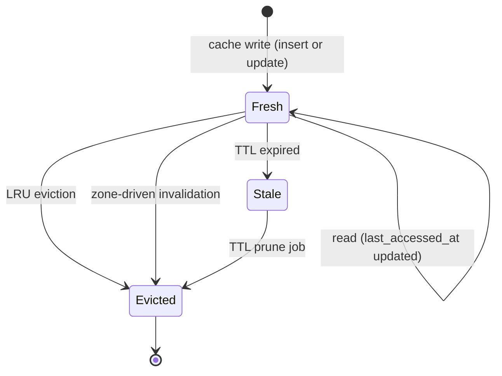

### 1.10 Events

| Event | Direction | When |
|-------|-----------|------|
| `geolocation.geocoded.v1` | produced | every response (hit or miss) |
| `geolocation.cache.invalidated.v1` | produced | if a zone update caused eviction (separate flow) |

### 1.11 APIs Involved

| API | Direction | When |
|-----|-----------|------|
| `POST /v1/geocodes` | inbound | start of flow |
| `GET /geocode` (vendor) | outbound | on cache miss |
| `configuration-service` (read) | outbound | on cold start or `configuration.updated.v1` |

### 1.12 Compensation / Rollback

- A cache write is not a transactional state change. If the
  cache write fails (DB or Redis), the response is still 200
  with `cache_hit=false` and the error is logged at WARN.
  The next request will retry the vendor call.
- If the vendor call succeeds but the response translation
  fails, the raw response is logged and a 500 is returned.
  The vendor is NOT charged (the response was discarded
  before the cache write).

### 1.13 Final State

- A row in `geocode_cache` (and a key in Redis) keyed by
  `cache_key` with `created_at = now()` and `expires_at =
  created_at + ttl`.
- An outbox row in `outbox` with `topic = geolocation.geocoded`
  and `event_name = geolocation.geocoded.v1`.

## 2. Surge-Zone-Driven Cache Invalidation

### 2.1 Objective

When ``geolocation-service` (zones)` publishes a zone update, evict cache entries
that intersect the updated polygon so that subsequent geocodes,
ETAs, and routes reflect the new zone.

### 2.2 Initiating Actor

``geolocation-service` (zones)` publishes `zone.updated.v1`.

### 2.3 Participating Services

- ``geolocation-service` (zones)` (producer).
- `geolocation-service` (this service) — consumer + actor.
- ``reporting-service` (data lake)`, `audit-service` (consumers of
  `geolocation.cache.invalidated.v1`).

### 2.4 Prerequisites

- The service's Kafka consumer is running and connected.
- The zone's polygon is well-formed (we trust ``geolocation-service` (zones)`
  to have validated it, but we re-validate with PostGIS
  `ST_IsValid` before storing it).

### 2.5 Happy Path

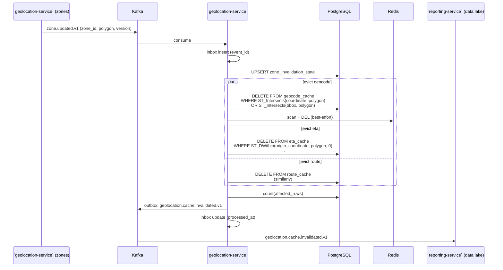

### 2.6 Alternate Paths

- **Polygon invalid** (fails `ST_IsValid`): log an error; do
  not delete cache entries; emit a high-severity audit event
  via `outbox` with `action=zone_invalid` and topic
  `geolocation.cache.invalidated` (so `audit-service` picks it
  up).
- **Empty result set** (no cache entries intersect the
  polygon): emit the event with `affected_rows=0`; the
  downstream dashboards are unaffected.

### 2.7 Failure Paths

- **Database write fails**: the inbox row's `processed_at`
  stays null; the consumer retries with backoff. After 3
  failures, the event is routed to the DLQ; an alert fires
  (cache may be stale).
- **Outbox write fails**: same as above. If the DB delete
  succeeded but the outbox write failed, the next
  reconciliation job re-emits the event (see INTEGRATION.md
  5).
- **Kafka consumer lag**: the surge-zone update is "best
  effort"; a customer might briefly see a stale ETA. The
  TTL on `eta_cache` (60s) bounds the staleness window.

### 2.8 Business Rules

- BR--024 (zone-update-driven invalidation; P95 ≤ 60s).
- FR--008 (consume `zone.updated.v1` and invalidate by
  spatial predicate).
- BR--013 (priority: MUST).

### 2.9 State Transitions

Each cache row transitions: `Fresh → Evicted` (terminal).

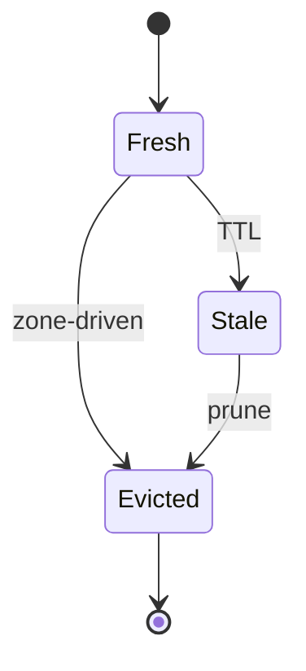

### 2.10 Events

| Event | Direction | When |
|-------|-----------|------|
| `zone.updated.v1` | consumed | start of flow |
| `geolocation.cache.invalidated.v1` | produced | after eviction |

### 2.11 APIs Involved

| API | Direction | When |
|-----|-----------|------|
| Kafka consumer | inbound | `zone.updated.v1` |

### 2.12 Compensation / Rollback

- There is no compensation: cache eviction is not undone.
  Worst case, the next request re-fetches from the vendor
  and re-caches.
- If the eviction job is interrupted, the reconciliation
  cron (running every 5 min) scans for `zone_invalidation_state`
  rows whose `polygon_version` is greater than the last
  processed version and re-runs the eviction.

### 2.13 Final State

- `zone_invalidation_state` row updated with the new
  `polygon_version`.
- Cache rows intersecting the polygon are deleted.
- An outbox row for `geolocation.cache.invalidated.v1`
  exists; once published, it is purged after 24h.

## 3. Vendor Fallback Activation

> **Note**: this workflow describes the **legacy** single-primary +
> single-fallback model. The current implementation uses the
> multi-provider chain model described in **5**. This section is
> retained for context (and as the historical record of how the
> service evolved).

### 3.1 Objective

Resolve a geospatial request by routing through an ordered
**provider chain** — the multi-provider model fully documented in
5. This section focuses on the **state-machine** aspect (circuit
open → half-open → closed) and the **observability** aspect
(`provider_fallback_activations_total` metric).

Keep customer-facing geocodes, ETAs, and routes available
when the primary map provider is unhealthy.

### 3.2 Initiating Actor

The circuit breaker around the primary vendor trips.

### 3.3 Participating Services

- `geolocation-service` (this service).
- Map provider (primary, in failure).
- Map provider (fallback, healthy).
- `audit-service` (consumes `geolocation.fallback.activated.v1`).
- `configuration-service` (read).

### 3.4 Prerequisites

- A fallback provider is configured
  (`geolocation.fallback_provider != null`).
- The fallback provider's circuit is closed.

### 3.5 Happy Path

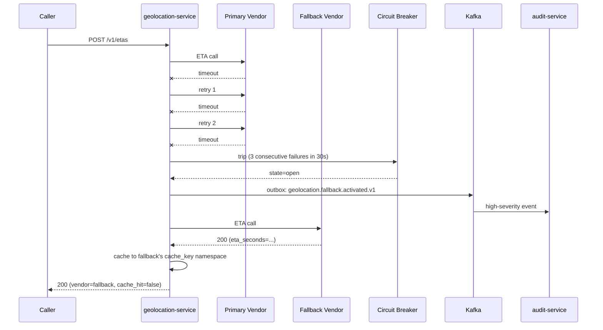

### 3.6 Alternate Paths

- **No fallback configured**: the service returns 503
  `CIRCUIT_OPEN` with `Retry-After: 30`. The caller is
  expected to retry or fall back to its own degraded mode.
- **Fallback also fails**: the fallback's circuit opens
  independently. When both are open, 503 `CIRCUIT_OPEN`
  is returned.

### 3.7 Failure Paths

- **Fallback partial failure** (e.g. geocode works but
  routes are intermittently slow): the service degrades
  to the in-DB cache (returning the most recent successful
  result) and logs a warning. The response is 200 with a
  `stale=true` flag if the cached entry is past TTL.
- **Both vendors down for an extended period**: the
  ``reporting-service` (data lake)` dashboard highlights the outage;
  the on-call is paged via the burn-rate alert.

### 3.8 Business Rules

- BR--012 (primary + fallback + circuit breaker).
- BR--017 (cached results returned even if vendor is down).
- BR--025 (circuit only trips after ≥ 3 consecutive 5xx
  or timeout in 30s).
- FR--009, FR--010.

### 3.9 State Transitions

The vendor circuit has its own state machine:

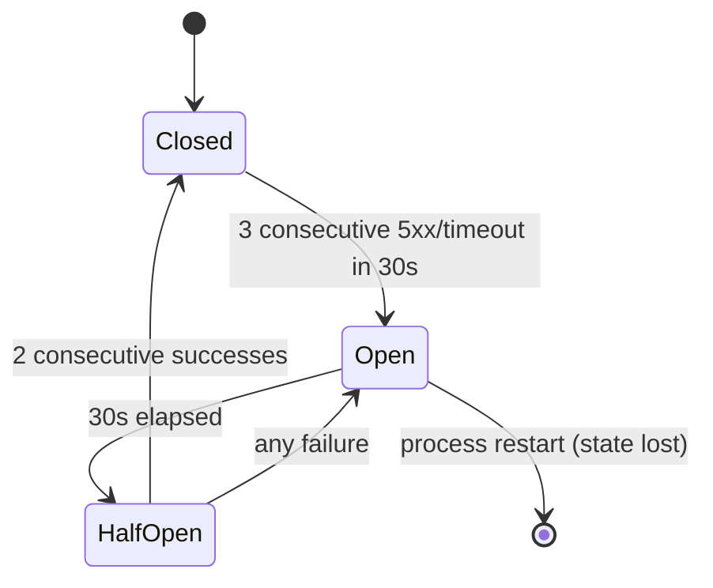

### 3.10 Events

| Event | Direction | When |
|-------|-----------|------|
| `geolocation.fallback.activated.v1` | produced | when primary circuit opens |
| `geolocation.fallback.deactivated.v1` | produced | when primary circuit closes again |

### 3.11 APIs Involved

| API | Direction | When |
|-----|-----------|------|
| Vendor API (primary) | outbound | every request (until circuit opens) |
| Vendor API (fallback) | outbound | every request after circuit opens |
| `configuration-service` | outbound | to confirm fallback is configured |

### 3.12 Compensation / Rollback

- When the primary circuit half-opens and a probe request
  succeeds, the circuit closes and the service resumes
  using the primary. No state needs to be rolled back;
  cache entries are shared.
- If a customer received a "fallback" response (e.g. a
  slightly different ETA), there is no compensation — the
  customer is not charged differently.

### 3.13 Final State

- Primary circuit: `open` (or `half-open` after 30s).
- Fallback circuit: `closed` (assuming fallback is healthy).
- `geolocation.fallback.activated.v1` event in the audit
  log with `correlation_id` and `vendor_id`.

## 4. Admin Force-Purge

### 4.1 Objective

Allow an admin to force-purge cache entries (typically after
a vendor regression, a bad data import, or a regulatory
event) with a signed, idempotent request.

### 4.2 Initiating Actor

A platform engineer or admin, via `admin-service` or
directly via `POST /v1/admin/cache/purge` with HMAC
signature.

### 4.3 Participating Services

- `geolocation-service` (this service).
- `audit-service` (consumes `geolocation.cache.invalidated.v1`).
- ``reporting-service` (data lake)` (consumes the same for the cache
  effectiveness dashboard).

### 4.4 Prerequisites

- Caller has the `admin` or `platform_engineer` role.
- Caller's request body is HMAC-SHA256 signed with the
  Vault-stored per-tenant key.
- Caller supplies `Idempotency-Key`.

### 4.5 Happy Path

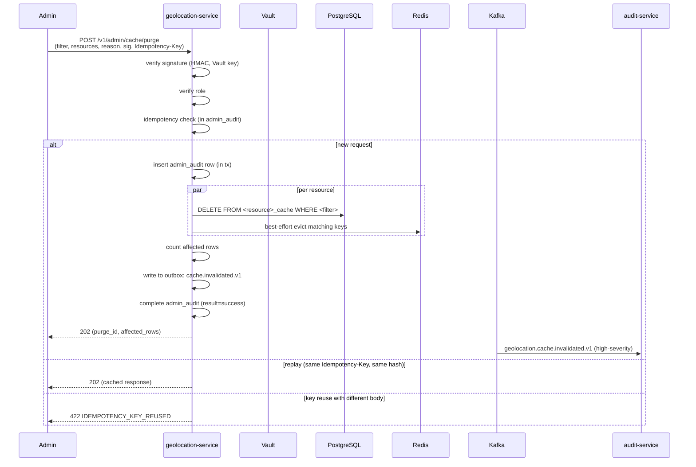

### 4.6 Alternate Paths

- **Filter by bounding box**: `filter.bbox` is a polygon;
  the DELETE uses `ST_Intersects`.
- **Filter by query fingerprint**: `filter.query_fingerprint`
  matches the column directly.
- **Filter by city_id**: `filter.city_id` is propagated to
  the `region_city_id` column on `geocode_cache` and to
  coordinate-based deletes for `eta_cache` and
  `route_cache` (using a ST_DWithin probe against the city's
  bbox, fetched from `zone_invalidation_state`).

### 4.7 Failure Paths

- **Signature invalid**: 409 `SIGNATURE_INVALID`; no
  admin_audit row written; nothing purged.
- **Database unreachable**: 503 `CIRCUIT_OPEN`; the
  idempotency check was not committed; the next attempt
  with the same key retries.
- **Partial failure** (one resource's DELETE fails but
  others succeed): the admin_audit row records the
  per-resource result; the outbox event includes only
  the successful resources' counts. The client gets 202
  with a per-resource breakdown; a follow-up
  reconciliation job retries the failed resource.

### 4.8 Business Rules

- BR--020 (admin can force-purge by city, bbox, fingerprint).
- FR--012, FR--019 (Idempotency-Key required).
- SEC--006 (HMAC signature required).
- SEC--007 (admin action audited).

### 4.9 State Transitions

Each affected cache row: `Fresh → Evicted`. The
`admin_audit` row is created in `pending` and moves to
`success` or `failure` (status column on the row).

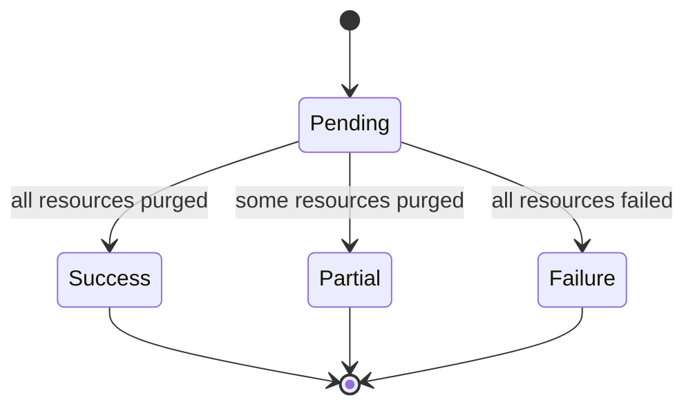

### 4.10 Events

| Event | Direction | When |
|-------|-----------|------|
| `geolocation.cache.invalidated.v1` | produced | every successful purge (per resource) |
| `admin.action.performed.v1` | produced | by `admin-service` if invoked via the admin console (not by us directly) |

### 4.11 APIs Involved

| API | Direction | When |
|-----|-----------|------|
| `POST /v1/admin/cache/purge` | inbound | start of flow |
| `GET /v1/config/geolocation` (vendor list, etc.) | outbound | if filter needs to look up vendor IDs |
| `GET /v1/zones/{city_id}` | outbound | if filter is by city bbox |

### 4.12 Compensation / Rollback

- A purge is destructive by design; there is no rollback.
- If a purge was issued by mistake, the only recovery is
  to wait for the next vendor call to repopulate the cache
  (typical warm-up is minutes for geocodes, hours for
  routes — but it is just a cache).

### 4.13 Final State

- `admin_audit` row with `result=success` (or `partial`/
  `failure`).
- Cache rows for the matched filter are deleted (in
  PostgreSQL and best-effort in Redis).
- Outbox row for `geolocation.cache.invalidated.v1`.
- Idempotency record stored for 24h.

---

## 5. Multi-Provider Chain (Region-Scoped, Per-Capability)

### 5.1 Objective

Resolve a geospatial request by routing through an **ordered
provider chain** that is scoped to the request's region and the
requested capability. Each chain member may be a commercial vendor
(Google / Mapbox / HERE), a self-host adapter (OSRM / Valhalla /
Nominatim / Pelias / Photon), or a `static`-only member that serves
cache and never makes an outbound call.

This workflow describes the **chain resolver** — the single
integration point between request logic and the network. It runs
on every request.

### 5.2 Initiating Actor

Every inbound `POST /v1/{geocodes,etas,routes}` and
`GET /v1/geocodes/reverse` call — directly or transitively.

### 5.3 Participating Services

- `geolocation-service` (this service).
- ``geolocation-service` (zones)` (resolves `city_id` → region if not provided).
- `configuration-service` (default chain fallback).
- The chain members themselves (`provider_config` rows).
- `audit-service` (chain-change events).

### 5.4 Prerequisites

- `provider_config` has at least one `enabled = true` row per
  capability used by the region.
- `provider_region_route` has either a region-specific row for
  the request's region + capability, OR a `default` row.
- The chain resolver cache (`geolocation.provider_chain.cache_ttl_seconds`)
  is warm (≤ 60 s old).

### 5.5 Happy Path — Primary vendor succeeds

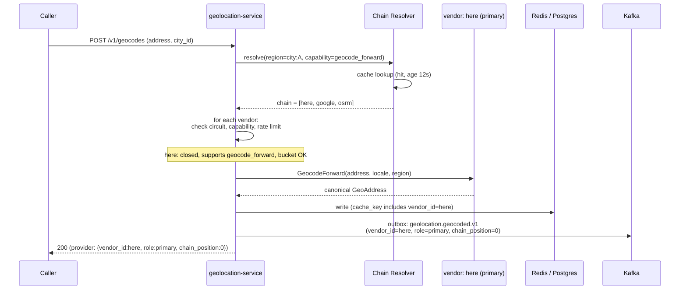

### 5.6 Failure Path — Primary fails, secondary succeeds

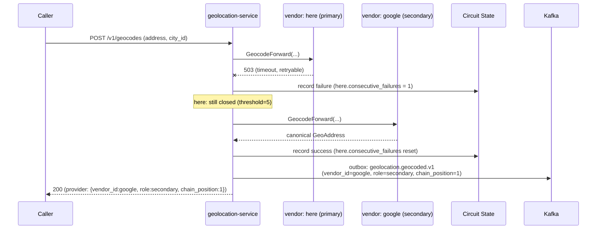

### 5.7 Failure Path — All commercial vendors fail, self-host saves

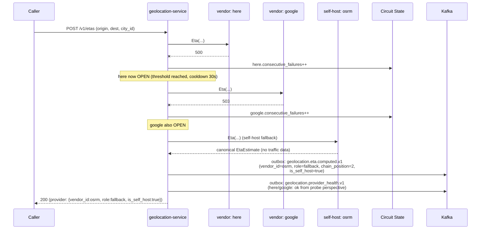

### 5.8 Failure Path — All providers down, cache serves

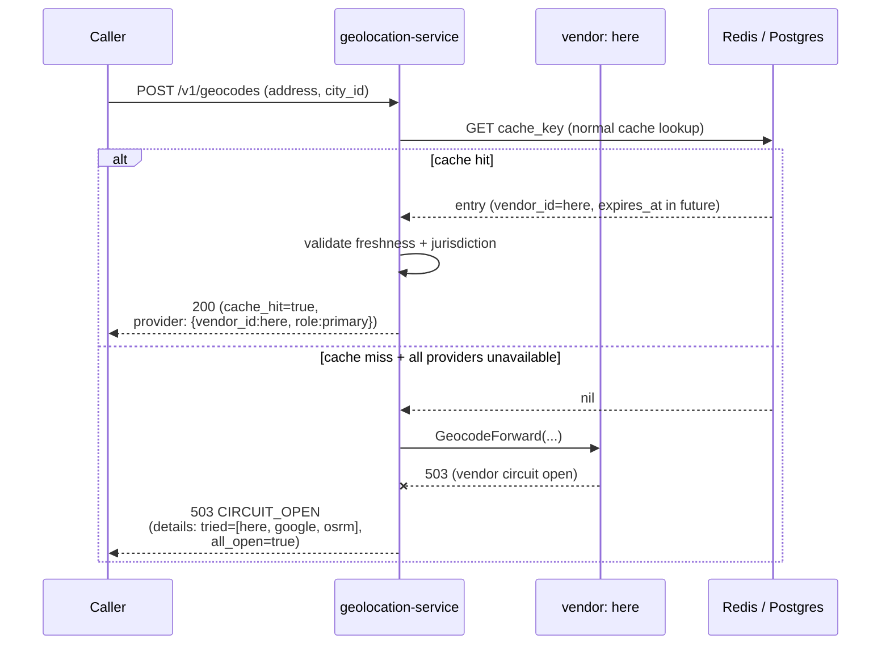

### 5.9 Alternate Path — Per-region restricted routing (no Google/Mapbox)

```mermaid
sequenceDiagram
    participant C as Caller
    participant G as geolocation-service
    participant Res as Chain Resolver
    participant V1 as vendor: here
    participant V3 as self-host: osrm

    C->>G: POST /v1/geocodes (address, city_id=B,<br/>country=CN)
    G->>Res: resolve(region=city:B, capability=geocode_forward)
    Res->>Res: lookup city:B → no row<br/>lookup country:CN → chain = [here, osrm]<br/>(no Google/Mapbox — restricted)
    Res-->>G: chain = [here, osrm]
    G->>V1: GeocodeForward(...)
    alt here succeeds
        V1-->>G: result
        G-->>C: 200 (provider: {vendor_id:here})
    else here fails
        G->>V3: GeocodeForward(...) (osrm adapter — geocode if capability advertises)
        Note over V3: osrm does NOT support geocode;<br/>resolver skipped it
        G-->>C: 503 CIRCUIT_OPEN
    end
```

### 5.10 Alternate Path — Static mode (no outbound calls)

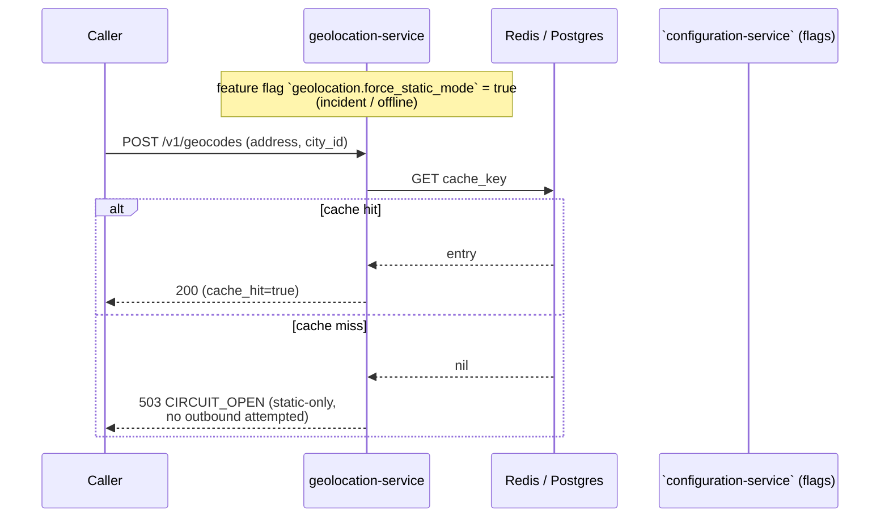

### 5.11 Failure Path — Health probe opens / closes a circuit

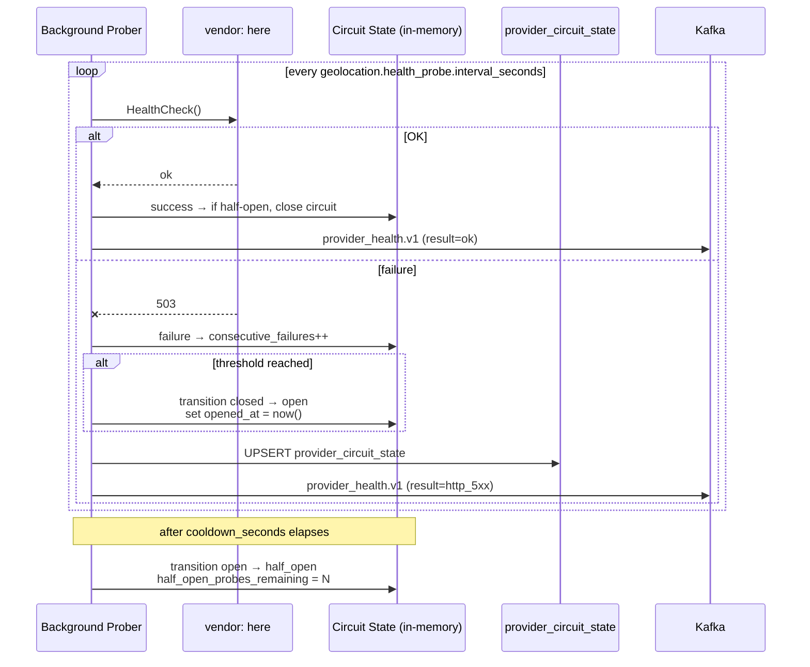

### 5.12 Admin path — Runtime chain edit (no redeploy)

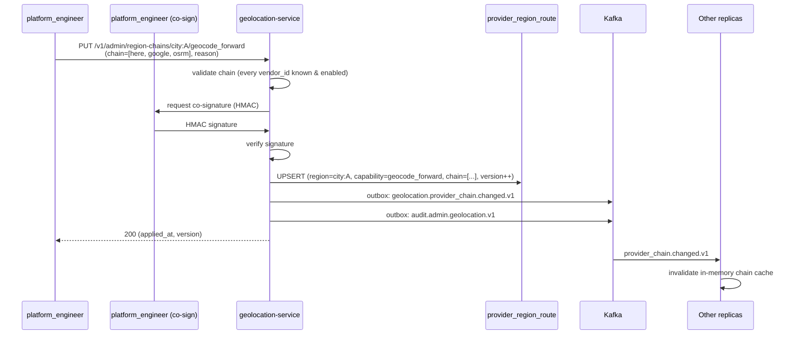

### 5.13 Business Rules

- Chain order: `primary` → `secondary` → `fallback` → `static`.
- A member is skipped (not invoked) if: circuit is open, capability
  is not advertised, rate-limit bucket is empty, or `enabled = false`.
- Cache key includes `vendor_id` so a hot entry from HERE is not
  overwritten by a fresh entry from Google for the same query.
- Per-region chains are resolved **most-specific-wins**: `city:<uuid>`
  beats `country:<ISO2>` beats `default`.
- Co-signature is required for `PUT /v1/admin/region-chains/...` to
  prevent one engineer from breaking a region.

### 5.14 State Transitions

The chain plan cache (in-memory) transitions:

```
warm (TTL 60s)  --expiry-->  cold (reload)
warm (TTL 60s)  --chain-change-event-->  cold (reload)
cold            --request-->            warm
```

Each provider's circuit (in-memory + `provider_circuit_state`):

```
closed  --threshold failures--> open
open    --cooldown elapses--->  half_open
half_open --probe success-->    closed
half_open --probe failure-->    open
```

### 5.15 Events

| Event | Direction | Notes |
|-------|-----------|-------|
| `geolocation.geocoded.v1` | produced | every request, with `vendor_id`, `chain_position`, `role`, `region`, `capability`, `is_self_host` |
| `geolocation.eta.computed.v1` | produced | same labels as above |
| `geolocation.provider_chain.changed.v1` | produced | on chain edit; consumed by all replicas + `audit-service` |
| `geolocation.provider_health.v1` | produced | on every probe; consumed by ``reporting-service` (data lake)` |

### 5.16 APIs Involved

| API | Direction | When |
|-----|-----------|-------|
| `POST /v1/geocodes` (etc.) | inbound | start of every flow |
| `GET /v1/admin/providers` | inbound | operator view |
| `PUT /v1/admin/region-chains/{region}/{capability}` | inbound | chain edit |
| `PATCH /v1/admin/providers/{vendor_id}` | inbound | provider enable / rate-limit edit |
| `POST /v1/admin/providers/{vendor_id}/test` | inbound | direct probe (bypasses chain) |
| `GET /v1/config/geolocation` | outbound | default chain, CB parameters |
| `GET /v1/flags/geolocation.force_static_mode` | outbound | static-mode toggle |

### 5.17 Compensation / Rollback

- Chain edits are versioned; an admin can re-PUT the previous
  chain to roll back. The audit row captures `previous_chain`
  for this purpose.
- A circuit that opens by mistake is closed automatically on the
  next successful probe in half-open state; no manual intervention
  needed.
- A `force_static_mode` flag flip takes effect within 60 s
  (next chain-plan reload).

### 5.18 Final State

- The cache row carries `vendor_id` so its lineage is preserved.
- Every replica's chain-plan cache is consistent (within 60 s TTL)
  with the latest `provider_chain.changed.v1`.
- `provider_circuit_state` row mirrors the in-memory circuit for
  every provider.
- `provider_health` row written per probe (append-only, 30-day
  retention).
- `provider_usage_daily` roll-up updated nightly for cost
  attribution.

---

## 99. `Monthly Partition Maintenance`

### 99.1 Objective

Idempotently pre-create the next 12 months for partitioned tables in `geolocation`. The drop half is handled by the per-service retention job.

### 99.2 Initiating Actor

A scheduled job runs daily at `02:00 UTC`. Leader-elected via `pg_try_advisory_xact_lock(hashtext('geolocation.partition'), hashtext('monthly'))`.

### 99.3 Happy Path

```mermaid
sequenceDiagram
    participant JOB as Partition job
    participant PG as PostgreSQL
    JOB->>PG: pg_try_advisory_xact_lock('geolocation.monthly')
    alt lock acquired
        loop for each missing month in next 12
            JOB->>PG: CREATE TABLE IF NOT EXISTS geolocation.<table>_YYYY_MM PARTITION OF geolocation.<table>
            JOB->>PG: verify (pg_inherits, relpartbound)
        end
        JOB->>PG: assert now() in existing child
    else lock NOT acquired
        Note over JOB: another instance is running; exit cleanly
    end
```

### 99.4 Failure Paths

| Failure | Handling |
|---------|----------|
| Lock contention | exit 0 |
| DDL fails | retry 3× with backoff (1 s / 4 s / 16 s); page on-call |
| Today's child missing | critical alert; INSERTs would fail |

### 99.5 Business Rules

- Pre-create next 12 complete future months.
- Every child is created with `CREATE TABLE IF NOT EXISTS … PARTITION OF …` so the job is safe to run twice in the same window.
- A verification step (`pg_inherits` parent + `relpartbound` range) runs after every `CREATE TABLE IF NOT EXISTS` because `IF NOT EXISTS` only guards the name, not the bounds.
- Optionally emit `audit.partition.maintained.v1` on success.

---

## See also

### Sibling docs for this service

- [`README.md`](./README.md) — purpose, bounded context, responsibilities
- [`BRD.md`](./BRD.md) — business requirements
- [`SRS.md`](./SRS.md) — functional + non-functional requirements
- [`ERD.md`](./ERD.md) — data model (entities, relationships)
- [`INTEGRATION.md`](./INTEGRATION.md) — inter-service contracts (APIs, events, sagas)
- [`WORKFLOWS.md`](./WORKFLOWS.md) — operational workflows (happy paths, failure modes)
- [`TECH.md`](./TECH.md) — technology profile (runtime, libraries, data layer, admin endpoints, RBAC)

### Platform-wide

- [`../../shared/README.md`](../../shared/README.md) — `platform-spring-boot-starter` shared library (the single source of cross-cutting code for all Spring Boot services in the platform)
- [`../RECOMMENDATIONS.md`](../RECOMMENDATIONS.md) — platform-wide technology map (language, framework, version baseline, admin/RBAC pattern)
- [`../../README.md`](../../README.md) — services overview (the catalog of all 20 services)
- [`../../../main.md`](../../../main.md) — top-level platform specification (architecture, Keycloak, PostgreSQL 18, messaging, observability baseline)

