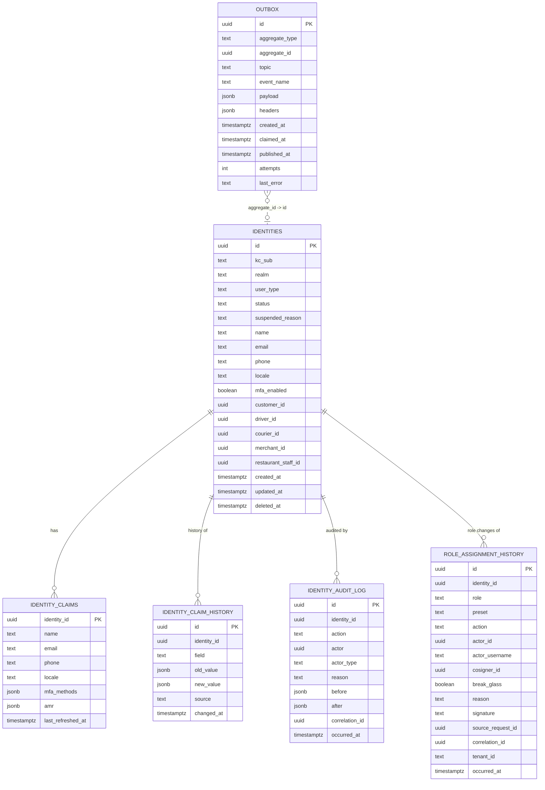

# identity-service — Entity-Relationship Diagram

## 1. Database

- **Engine**: PostgreSQL 18.
- **Schema**: `identity` (owned exclusively by this service).
- **Migrations**: `services/identity-service/migrations/`
  (versioned, forward-only, golang-migrate).

## 2. Cross-Service References

| Column | Type | Refers to | Source of truth |
|--------|------|-----------|------------------|
| `customer_id` | UUID | `Customer` in `customer-service` | `customer-service` |
| `driver_id` | UUID | `Driver` in `driver-service` | `driver-service` |
| `courier_id` | UUID | `Courier` in `courier-service` | `courier-service` |
| `merchant_id` | UUID | `Merchant` in ``restaurant-service` (merchant)` | ``restaurant-service` (merchant)` |
| `restaurant_staff_id` | UUID | `Staff` in ``restaurant-service` (staff)` | ``restaurant-service` (staff)` |
| `role_assignment_history.identity_id` | UUID | `identities.id` | this service (`identity-service`) — no FK enforced (cross-schema; same rule as `action_log.actor_id` in `admin-service/ERD.md` §2) |
| `role_assignment_history.actor_id` | UUID | the granting admin's `identities.id` | `identity-service` |
| `role_assignment_history.cosigner_id` | UUID | the break-glass co-signer's `identities.id` | `identity-service` |

These columns are populated as a back-channel after the
referencing service emits its `*.created.v1` event; they
are stored WITHOUT database FKs. The `identity_id` is the
platform-wide stable id; the other ids are convenience
references for cross-service queries.

## 3. Entities

### `identities`

The platform's source-of-truth table for the user identity
model. One row per `identity_id`.

#### Columns

| Column | Type | Constraints | Notes |
|--------|------|-------------|-------|
| `id` | UUID | PK | UUIDv7; the platform's stable `identity_id` |
| `kc_sub` | TEXT | NOT NULL | Keycloak `sub` |
| `realm` | TEXT | NOT NULL | Keycloak realm |
| `user_type` | TEXT | NOT NULL | `customer` / `driver` / `courier` / `merchant_staff` / `restaurant_staff` / `support_agent` / `admin` / `service` |
| `region` | TEXT | NULL | optional multi-tenant scoping |
| `tenant_id` | UUID | NULL | optional multi-tenant scoping |
| `name` | TEXT | NULL (PII, column-level encrypted) | cached from Keycloak |
| `email` | TEXT | NULL (PII, column-level encrypted) | cached from Keycloak |
| `email_verified` | BOOLEAN | NOT NULL DEFAULT false | cached from Keycloak |
| `phone` | TEXT | NULL (PII, column-level encrypted) | cached from Keycloak |
| `phone_verified` | BOOLEAN | NOT NULL DEFAULT false | cached from Keycloak |
| `locale` | TEXT | NULL | BCP-47; cached from Keycloak |
| `mfa_enabled` | BOOLEAN | NOT NULL DEFAULT false | cached from Keycloak |
| `status` | TEXT | NOT NULL | `active` / `suspended` / `disabled` / `erased` |
| `suspended_reason` | TEXT | NULL | `fraud` / `payment_failure` / `manual_review` / `security` / `legal` |
| `suspended_at` | TIMESTAMPTZ | NULL | when suspended |
| `suspended_by` | UUID | NULL | `identity_id` of the actor |
| `disabled_at` | TIMESTAMPTZ | NULL | when disabled |
| `disabled_by` | UUID | NULL | `identity_id` of the actor |
| `erased_at` | TIMESTAMPTZ | NULL | when GDPR-erased |
| `erased_by` | UUID | NULL | `identity_id` of the actor |
| `customer_id` | UUID | NULL | back-channel reference |
| `driver_id` | UUID | NULL | back-channel reference |
| `courier_id` | UUID | NULL | back-channel reference |
| `merchant_id` | UUID | NULL | back-channel reference |
| `restaurant_staff_id` | UUID | NULL | back-channel reference |
| `row_version` | BIGINT | NOT NULL DEFAULT 1 | optimistic-lock |
| `created_at` | TIMESTAMPTZ | NOT NULL DEFAULT now() | audit |
| `updated_at` | TIMESTAMPTZ | NOT NULL DEFAULT now() | audit |
| `created_by` | UUID | NOT NULL | identity |
| `updated_by` | UUID | NOT NULL | identity |
| `deleted_at` | TIMESTAMPTZ | NULL | soft delete; tombstone for erasure |

#### Indexes

- PK on `id`.
- UNIQUE on `(kc_sub, realm)` (partial, `WHERE deleted_at IS NULL`).
- Index on `email` (case-insensitive) for lookups by email.
- Index on `phone` (E.164 normalized) for lookups by phone.
- Index on `status` (partial, `WHERE status IN ('suspended', 'disabled')`).
- Index on `customer_id` (partial, `WHERE customer_id IS NOT NULL`).
- Index on `driver_id` (partial, `WHERE driver_id IS NOT NULL`).
- Index on `courier_id` (partial, `WHERE courier_id IS NOT NULL`).
- Index on `merchant_id` (partial, `WHERE merchant_id IS NOT NULL`).
- Index on `restaurant_staff_id` (partial, `WHERE restaurant_staff_id IS NOT NULL`).

#### Constraints

- CHECK: `status IN ('active', 'suspended', 'disabled', 'erased')`.
- CHECK: `suspended_reason IS NULL OR suspended_reason IN
  ('fraud', 'payment_failure', 'manual_review', 'security',
  'legal')`.
- CHECK: `realm IN ('platform-customer', 'platform-driver',
  'platform-courier', 'platform-staff', 'platform-internal',
  'platform-services')`.

### `identity_claims`

A denormalized cache of the canonical user claims, refreshed
on `identity.user.updated.v1` and on a periodic poll of
Keycloak. Read-heavy.

#### Columns

| Column | Type | Constraints | Notes |
|--------|------|-------------|-------|
| `identity_id` | UUID | PK, FK → `identities.id` | one row per identity |
| `name` | TEXT | NULL (PII) | snapshot of cached name |
| `email` | TEXT | NULL (PII) | snapshot of cached email |
| `phone` | TEXT | NULL (PII) | snapshot of cached phone |
| `locale` | TEXT | NULL | snapshot of cached locale |
| `mfa_methods` | JSONB | NOT NULL DEFAULT '[]' | array of strings |
| `amr` | JSONB | NOT NULL DEFAULT '[]' | array of strings (last login's MFA methods) |
| `last_refreshed_at` | TIMESTAMPTZ | NOT NULL DEFAULT now() | when the cache was last pulled |
| `row_version` | BIGINT | NOT NULL DEFAULT 1 | optimistic-lock |
| `created_at` | TIMESTAMPTZ | NOT NULL DEFAULT now() | audit |
| `updated_at` | TIMESTAMPTZ | NOT NULL DEFAULT now() | audit |

#### Indexes

- PK on `identity_id`.
- Index on `last_refreshed_at` (for cache-warming jobs).

### `identity_claim_history`

Append-only history of claim changes. Used for audit and
debugging. Range-partitioned by month.

#### Columns

| Column | Type | Constraints | Notes |
|--------|------|-------------|-------|
| `id` | UUID | PK | UUIDv7 |
| `identity_id` | UUID | NOT NULL | FK to `identities.id` |
| `field` | TEXT | NOT NULL | which claim changed |
| `old_value` | JSONB | NULL | previous value (PII-encrypted at rest) |
| `new_value` | JSONB | NULL | new value |
| `source` | TEXT | NOT NULL | `keycloak_event` / `admin_action` / `self_service` |
| `changed_at` | TIMESTAMPTZ | NOT NULL DEFAULT now() | partition key |
| `changed_by` | UUID | NOT NULL | identity |

#### Indexes

- PK on `(id, changed_at)` (partitioning requires the
  partition key in the PK).
- Index on `identity_id` (local per partition).
- Index on `changed_at` (local per partition).

#### Partitioning

- Range partition by `changed_at` (monthly).
- Pre-create the next 30 days of partitions via a
  maintenance job.
- Drop partitions older than 1 year (after they've been
  archived to the data warehouse).

### `identity_audit_log`

Append-only audit of every state change. Immutable.

#### Columns

| Column | Type | Constraints | Notes |
|--------|------|-------------|-------|
| `id` | UUID | PK | UUIDv7 |
| `identity_id` | UUID | NOT NULL | FK to `identities.id` |
| `action` | TEXT | NOT NULL | `create` / `update` / `suspend` / `disable` / `reinstate` / `erase` / `force_logout` / `grant_role` / `revoke_role` |
| `role` | TEXT | NULL | the realm role granted or revoked (for `grant_role` / `revoke_role`); NULL otherwise |
| `preset` | TEXT | NULL | the permission preset this role change belongs to (e.g. `SUPER_ADMIN`); NULL otherwise |
| `actor` | UUID | NULL | the admin's `identity_id` (null for system) |
| `actor_type` | TEXT | NOT NULL | `user` / `admin` / `service` / `system` |
| `cosigner` | UUID | NULL | the break-glass co-signer's `identity_id` (required when `break_glass = true`); NULL otherwise |
| `break_glass` | BOOLEAN | NOT NULL DEFAULT false | true for `platform.super_admin` grants and any off-hours grant |
| `reason` | TEXT | NULL | reason code or free text (audit-allowed) |
| `signature` | TEXT | NULL | HMAC-SHA256 over the request body, present for `grant_role` / `revoke_role` of `platform.super_admin` |
| `before` | JSONB | NULL | snapshot of the row before |
| `after` | JSONB | NULL | snapshot of the row after |
| `correlation_id` | UUID | NULL | request correlation id |
| `occurred_at` | TIMESTAMPTZ | NOT NULL DEFAULT now() | when the action happened |

#### Constraints

- No `UPDATE` or `DELETE` on this table (enforced by a
  trigger).
- Retention 7 years.
- `CHECK (length(actor) IS NULL OR actor <> cosigner)` — a
  break-glass co-signer MUST be a different admin.
- `CHECK (action NOT IN ('grant_role','revoke_role') OR role IS NOT NULL)`.
- `CHECK (action NOT IN ('grant_role','revoke_role') OR char_length(coalesce(reason,'')) BETWEEN 8 AND 512)`.
- `CHECK (role <> 'platform.super_admin' OR cosigner IS NOT NULL)` —
  `platform.super_admin` grants always require a co-signer.

### `RoleAssignmentHistory`

Append-only immutable history of every realm-role grant and revoke.
One row is written for **each** role touched by a single
`admin-service` SUPER_ADMIN preset fan-out (i.e. 59 rows per
`grant-super-admin` call: 1 × `platform.super_admin` + 58 ×
`<service>.admin`). Mirrors the reversal rule from
[`accounting-four-layer-truth-model.md`](../../../main.md) and the
`PricingGeoConfigHistory` pattern in `admin-service/ERD.md` §3.7.

#### Columns

| Column | Type | Constraints | Notes |
|--------|------|-------------|-------|
| `id` | UUID | PK | UUIDv7 |
| `identity_id` | UUID | NOT NULL | the Keycloak user whose role changed |
| `role` | TEXT | NOT NULL | the realm role (e.g. `platform.super_admin`, `payment.admin`) |
| `preset` | TEXT | NULL | the preset bundle this row belongs to (e.g. `SUPER_ADMIN`); NULL for individual non-preset grants |
| `action` | TEXT | NOT NULL | `grant` / `revoke` |
| `actor_id` | UUID | NOT NULL | the granting admin (the caller of `admin-service`) |
| `actor_username` | TEXT | NOT NULL | snapshot of the actor's username at the time of action |
| `cosigner_id` | UUID | NULL | the break-glass co-signer (required for `platform.super_admin` grants) |
| `break_glass` | BOOLEAN | NOT NULL DEFAULT false | true for `platform.super_admin` grants and any off-hours action |
| `reason` | TEXT | NOT NULL | free text ≥ 8 chars |
| `signature` | TEXT | NULL | HMAC-SHA256 over the original request body (super-admin grants) |
| `source_request_id` | UUID | NOT NULL | the `admin-service` request id that originated the fan-out — groups the 59 rows of a single `grant-super-admin` call |
| `correlation_id` | UUID | NOT NULL | end-to-end |
| `tenant_id` | TEXT | NOT NULL DEFAULT `'global'` | |
| `occurred_at` | TIMESTAMPTZ | NOT NULL DEFAULT now() | partition key |

#### Indexes

- PK on `id`
- Index on `(identity_id, occurred_at DESC)`
- Index on `(role, occurred_at DESC)`
- Index on `(preset, occurred_at DESC)` WHERE preset IS NOT NULL
- Index on `(source_request_id)` (groups the 59 fan-out rows of one call)

#### Constraints

- `CHECK (action IN ('grant','revoke'))`.
- `CHECK (char_length(reason) >= 8)`.
- `CHECK (role <> 'platform.super_admin' OR cosigner_id IS NOT NULL)`.
- `CHECK (role <> 'platform.super_admin' OR break_glass = true)`.
- Partitioned by month on `occurred_at`.
- `REVOKE UPDATE, DELETE ON identity.role_assignment_history FROM identity_app;`.

### `outbox`

Outbox table for the outbox pattern. The producer's state
change and the event are written in the same transaction.

#### Columns

| Column | Type | Constraints | Notes |
|--------|------|-------------|-------|
| `id` | UUID | PK | UUIDv7; the `event_id` |
| `aggregate_type` | TEXT | NOT NULL | e.g. `Identity` |
| `aggregate_id` | UUID | NOT NULL | `identity_id` |
| `topic` | TEXT | NOT NULL | Kafka topic name |
| `event_name` | TEXT | NOT NULL | e.g. `identity.user.suspended.v1` |
| `payload` | JSONB | NOT NULL | event envelope |
| `headers` | JSONB | NOT NULL DEFAULT '{}' | Kafka headers |
| `created_at` | TIMESTAMPTZ | NOT NULL DEFAULT now() | when written |
| `claimed_at` | TIMESTAMPTZ | NULL | when the poller picked it up |
| `published_at` | TIMESTAMPTZ | NULL | when Kafka acked |
| `attempts` | INT | NOT NULL DEFAULT 0 | retry counter |
| `last_error` | TEXT | NULL | last error message |

#### Indexes

- PK on `id`.
- Index on `(published_at, created_at)` where
  `published_at IS NULL` (the poller's hot query).
- Index on `aggregate_id`.

## 4. Mermaid ER Diagram



## 5. DDL Sketch

```sql
CREATE SCHEMA IF NOT EXISTS identity;

CREATE TABLE identity.identities (
    id UUID PRIMARY KEY,
    kc_sub TEXT NOT NULL,
    realm TEXT NOT NULL,
    user_type TEXT NOT NULL,
    region TEXT,
    tenant_id UUID,
    name TEXT,
    email TEXT,
    email_verified BOOLEAN NOT NULL DEFAULT false,
    phone TEXT,
    phone_verified BOOLEAN NOT NULL DEFAULT false,
    locale TEXT,
    mfa_enabled BOOLEAN NOT NULL DEFAULT false,
    status TEXT NOT NULL DEFAULT 'active',
    suspended_reason TEXT,
    suspended_at TIMESTAMPTZ,
    suspended_by UUID,
    disabled_at TIMESTAMPTZ,
    disabled_by UUID,
    erased_at TIMESTAMPTZ,
    erased_by UUID,
    customer_id UUID,
    driver_id UUID,
    courier_id UUID,
    merchant_id UUID,
    restaurant_staff_id UUID,
    row_version BIGINT NOT NULL DEFAULT 1,
    created_at TIMESTAMPTZ NOT NULL DEFAULT now(),
    updated_at TIMESTAMPTZ NOT NULL DEFAULT now(),
    created_by UUID NOT NULL,
    updated_by UUID NOT NULL,
    deleted_at TIMESTAMPTZ,
    CONSTRAINT identities_status_check
        CHECK (status IN ('active', 'suspended', 'disabled', 'erased')),
    CONSTRAINT identities_suspended_reason_check
        CHECK (suspended_reason IS NULL OR suspended_reason IN
               ('fraud','payment_failure','manual_review','security','legal')),
    CONSTRAINT identities_realm_check
        CHECK (realm IN ('platform-customer','platform-driver',
               'platform-courier','platform-staff','platform-internal',
               'platform-services'))
);

CREATE UNIQUE INDEX identities_kc_sub_realm_uniq
    ON identity.identities (kc_sub, realm)
    WHERE deleted_at IS NULL;

CREATE INDEX identities_status_idx
    ON identity.identities (status)
    WHERE status IN ('suspended','disabled');

CREATE INDEX identities_customer_id_idx
    ON identity.identities (customer_id)
    WHERE customer_id IS NOT NULL;

CREATE INDEX identities_driver_id_idx
    ON identity.identities (driver_id)
    WHERE driver_id IS NOT NULL;

CREATE INDEX identities_courier_id_idx
    ON identity.identities (courier_id)
    WHERE courier_id IS NOT NULL;

CREATE INDEX identities_merchant_id_idx
    ON identity.identities (merchant_id)
    WHERE merchant_id IS NOT NULL;

CREATE INDEX identities_restaurant_staff_id_idx
    ON identity.identities (restaurant_staff_id)
    WHERE restaurant_staff_id IS NOT NULL;

CREATE TABLE identity.identity_claims (
    identity_id UUID PRIMARY KEY REFERENCES identity.identities(id),
    name TEXT,
    email TEXT,
    phone TEXT,
    locale TEXT,
    mfa_methods JSONB NOT NULL DEFAULT '[]'::jsonb,
    amr JSONB NOT NULL DEFAULT '[]'::jsonb,
    last_refreshed_at TIMESTAMPTZ NOT NULL DEFAULT now(),
    row_version BIGINT NOT NULL DEFAULT 1,
    created_at TIMESTAMPTZ NOT NULL DEFAULT now(),
    updated_at TIMESTAMPTZ NOT NULL DEFAULT now()
);

CREATE INDEX identity_claims_last_refreshed_at_idx
    ON identity.identity_claims (last_refreshed_at);

CREATE TABLE identity.identity_claim_history (
    id UUID NOT NULL,
    identity_id UUID NOT NULL REFERENCES identity.identities(id),
    field TEXT NOT NULL,
    old_value JSONB,
    new_value JSONB,
    source TEXT NOT NULL,
    changed_at TIMESTAMPTZ NOT NULL DEFAULT now(),
    changed_by UUID NOT NULL,
    PRIMARY KEY (id, changed_at)
) PARTITION BY RANGE (changed_at);

-- Idempotent pre-creation; safe to rerun as part of the maintenance job.
CREATE TABLE IF NOT EXISTS identity.identity_claim_history_2026_07
    PARTITION OF identity.identity_claim_history
    FOR VALUES FROM ('2026-07-01 00:00:00+00') TO ('2026-08-01 00:00:00+00');

CREATE INDEX identity_claim_history_identity_id_idx
    ON identity.identity_claim_history (identity_id);

CREATE TABLE identity.identity_audit_log (
    id UUID PRIMARY KEY,
    identity_id UUID NOT NULL REFERENCES identity.identities(id),
    action TEXT NOT NULL
        CHECK (action IN ('create','update','suspend','disable',
                          'reinstate','erase','force_logout',
                          'grant_role','revoke_role')),
    role TEXT,
    preset TEXT,
    actor UUID,
    actor_type TEXT NOT NULL
        CHECK (actor_type IN ('user','admin','service','system')),
    cosigner UUID,
    break_glass BOOLEAN NOT NULL DEFAULT false,
    reason TEXT,
    signature TEXT,
    before JSONB,
    after JSONB,
    correlation_id UUID,
    occurred_at TIMESTAMPTZ NOT NULL DEFAULT now(),
    CONSTRAINT identity_audit_log_cosigner_distinct
        CHECK (actor IS NULL OR actor <> cosigner),
    CONSTRAINT identity_audit_log_role_set
        CHECK (action NOT IN ('grant_role','revoke_role') OR role IS NOT NULL),
    CONSTRAINT identity_audit_log_role_reason_len
        CHECK (action NOT IN ('grant_role','revoke_role')
               OR char_length(coalesce(reason,'')) BETWEEN 8 AND 512),
    CONSTRAINT identity_audit_log_super_admin_cosigner
        CHECK (role <> 'platform.super_admin' OR cosigner IS NOT NULL)
);

CREATE TRIGGER identity_audit_log_no_update
    BEFORE UPDATE OR DELETE ON identity.identity_audit_log
    FOR EACH STATEMENT EXECUTE FUNCTION raise_exception();

CREATE INDEX identity_audit_log_role_idx
    ON identity.identity_audit_log (role, occurred_at DESC)
    WHERE role IS NOT NULL;
CREATE INDEX identity_audit_log_preset_idx
    ON identity.identity_audit_log (preset, occurred_at DESC)
    WHERE preset IS NOT NULL;

-- RoleAssignmentHistory: append-only immutable per-role history.
-- One row per (identity, role, action) — a SUPER_ADMIN preset fan-out
-- from admin-service produces 59 rows sharing the same
-- source_request_id (1 platform.super_admin + 58 <service>.admin).
CREATE TABLE identity.role_assignment_history (
    id UUID PRIMARY KEY,
    identity_id UUID NOT NULL,
    role TEXT NOT NULL,
    preset TEXT,
    action TEXT NOT NULL
        CHECK (action IN ('grant','revoke')),
    actor_id UUID NOT NULL,
    actor_username TEXT NOT NULL,
    cosigner_id UUID,
    break_glass BOOLEAN NOT NULL DEFAULT false,
    reason TEXT NOT NULL CHECK (char_length(reason) >= 8),
    signature TEXT,
    source_request_id UUID NOT NULL,
    correlation_id UUID NOT NULL,
    tenant_id TEXT NOT NULL DEFAULT 'global',
    occurred_at TIMESTAMPTZ NOT NULL DEFAULT now(),
    CONSTRAINT role_assignment_history_super_admin_cosigner
        CHECK (role <> 'platform.super_admin' OR cosigner_id IS NOT NULL),
    CONSTRAINT role_assignment_history_super_admin_break_glass
        CHECK (role <> 'platform.super_admin' OR break_glass = true)
) PARTITION BY RANGE (occurred_at);

-- Idempotent pre-creation; safe to rerun as part of the maintenance job.
CREATE TABLE IF NOT EXISTS identity.role_assignment_history_2026_08
    PARTITION OF identity.role_assignment_history
    FOR VALUES FROM ('2026-08-01 00:00:00+00') TO ('2026-09-01 00:00:00+00');

CREATE INDEX role_assignment_history_identity_id_idx
    ON identity.role_assignment_history (identity_id, occurred_at DESC);
CREATE INDEX role_assignment_history_role_idx
    ON identity.role_assignment_history (role, occurred_at DESC);
CREATE INDEX role_assignment_history_preset_idx
    ON identity.role_assignment_history (preset, occurred_at DESC)
    WHERE preset IS NOT NULL;
CREATE INDEX role_assignment_history_source_request_id_idx
    ON identity.role_assignment_history (source_request_id);

REVOKE UPDATE, DELETE ON identity.role_assignment_history FROM identity_app;

CREATE TABLE identity.outbox (
    id UUID PRIMARY KEY,
    aggregate_type TEXT NOT NULL,
    aggregate_id UUID NOT NULL,
    topic TEXT NOT NULL,
    event_name TEXT NOT NULL,
    payload JSONB NOT NULL,
    headers JSONB NOT NULL DEFAULT '{}'::jsonb,
    created_at TIMESTAMPTZ NOT NULL DEFAULT now(),
    claimed_at TIMESTAMPTZ,
    published_at TIMESTAMPTZ,
    attempts INT NOT NULL DEFAULT 0,
    last_error TEXT
);

CREATE INDEX outbox_unpublished_idx
    ON identity.outbox (created_at)
    WHERE published_at IS NULL;

CREATE INDEX outbox_aggregate_id_idx
    ON identity.outbox (aggregate_id);
```

## 6. Audit Columns

Every mutable table has `created_at`, `updated_at`,
`created_by`, `updated_by`. The `identities` table also
has `row_version` for optimistic locking. The
`identity_audit_log` table is the source of truth for
audit; every state change writes there AND emits an
`identity.*.v1` event.

## 7. Soft Delete

- The `identities` table uses soft delete (`deleted_at`).
  Soft delete is performed on GDPR erasure; the row is
  preserved for referential integrity.
- The `identity_claims` row is not soft-deleted; on
  erasure, the `name`, `email`, `phone` columns are set
  to `REDACTED` and `email_verified` / `phone_verified`
  set to `false`.
- The `identity_claim_history`, `identity_audit_log`, and
  `role_assignment_history` tables are append-only and never
  soft-deleted.

## 8. JSONB Usage

- `identity_claims.mfa_methods` and `identity_claims.amr`
  — arrays of strings. The shapes are stable and small;
  JSONB is used because the elements are not queried in
  WHERE clauses.
- `identity_claim_history.old_value` and `new_value` —
  the previous and new values of the changed claim. JSONB
  because the values can be string, boolean, or object
  depending on the field.
- `identity_audit_log.before` and `after` — full snapshots
  of the row before and after the change. JSONB to keep
  the schema flexible.
- `role_assignment_history` has no JSONB columns; per-role
  history is row-shaped (one row per role per action) so
  `GROUP BY source_request_id` can reconstruct the 59-row
  fan-out of a single SUPER_ADMIN preset grant.
- `outbox.payload` and `outbox.headers` — the event
  envelope and Kafka headers.

## 9. Partitioning

- `identity_claim_history` is range-partitioned by
  `changed_at` (monthly). Pre-create the next 30 days
  via a maintenance job. Drop partitions older than 1
  year (after archive).
- `role_assignment_history` is range-partitioned by
  `occurred_at` (monthly). Same maintenance pattern as
  `identity_claim_history`; retained 7 years (financial /
  audit record) per `accounting-four-layer-truth-model.md`.
- No other table is partitioned; their volume does not
  warrant it.

## 10. Data Retention

| Table | Retention | Purged by |
|-------|-----------|-----------|
| `identities` | until erasure + 7 years (tombstone) | background job after 7 years post-erasure |
| `identity_claims` | until erasure + 7 years | background job |
| `identity_claim_history` | 1 year hot, then archived to data warehouse; retained 7 years | partition drop after archive |
| `identity_audit_log` | 7 years (financial/audit) | background job after 7 years |
| `role_assignment_history` | 7 years (financial/audit) | never (append-only with `REVOKE DELETE`; partitions archived then dropped) |
| `outbox` | 24 h after `published_at` | background job |

## 11. Migration Considerations

- Adding a new claim: ALTER TABLE `identity.identities`
  ADD COLUMN; backfill via background job; no breaking
  change to the API.
- Renaming a claim: deprecated alias column added; new
  writes go to the new column; old column is read but
  not written; dropped after a deprecation window.
- Schema changes that affect the API: a major API
  version bump; the `INTEGRATION.md` is updated first.
- The `identity_claim_history` and `role_assignment_history`
  partitioning schemes share the same long-term migration story:
  the maintenance job creates future partitions; the background
  job drops old ones. `role_assignment_history` is newly added
  in this release (no destructive ALTER on existing rows; the
  partition pre-creation in §5 must run before the first
  `SUPER_ADMIN` preset grant is processed).
- Cross-service references (`customer_id`, `driver_id`,
  etc.) are added as nullable columns; the back-channel
  consumer (`*.created.v1`) populates them over time.
- Extending `identity_audit_log.action` with `grant_role` and
  `revoke_role` is a CHECK constraint change; it MUST be deployed
  with a migration that runs the CHECK as `NOT VALID` first, then
  `VALIDATE CONSTRAINT` after the upgrade window.

---

## See also

### Sibling docs for this service

- [`README.md`](./README.md) — purpose, bounded context, responsibilities
- [`BRD.md`](./BRD.md) — business requirements
- [`SRS.md`](./SRS.md) — functional + non-functional requirements
- [`ERD.md`](./ERD.md) — data model (entities, relationships)
- [`INTEGRATION.md`](./INTEGRATION.md) — inter-service contracts (APIs, events, sagas)
- [`WORKFLOWS.md`](./WORKFLOWS.md) — operational workflows (happy paths, failure modes)
- [`TECH.md`](./TECH.md) — technology profile (runtime, libraries, data layer, admin endpoints, RBAC)

### Platform-wide

- [`../../shared/README.md`](../../shared/README.md) — `platform-spring-boot-starter` shared library (the single source of cross-cutting code for all Spring Boot services in the platform)
- [`../RECOMMENDATIONS.md`](../RECOMMENDATIONS.md) — platform-wide technology map (language, framework, version baseline, admin/RBAC pattern)
- [`../../README.md`](../../README.md) — services overview (the catalog of all 58 services)
- [`../../../main.md`](../../../main.md) — top-level platform specification (architecture, Keycloak, PostgreSQL 18, messaging, observability baseline)

