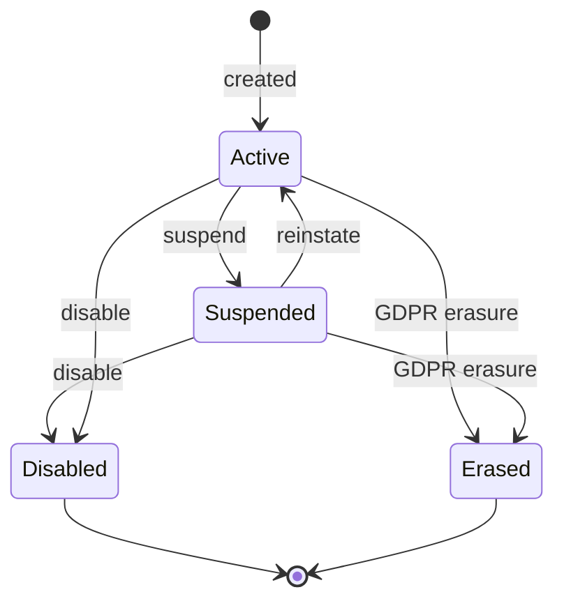

# identity-service — Software Requirements Specification

## 1. Introduction

This document specifies the software behavior, contracts, and
non-functional requirements of the `identity-service`. The
service is a thin Keycloak adapter that normalizes the
platform's identity model: it provides a stable
`identity_id`, caches canonical claims, and propagates
lifecycle events. It is the only writer of the
`identity.identities` table and the only service authorized
to call Keycloak's admin API.

## 2. Scope

**In scope:**

- Keycloak federation (admin API + SPI consumer).
- Identity normalization (`kc_sub` → `identity_id`).
- Claim caching (name, email, phone, locale, MFA status).
- Lifecycle event emission (created, updated, suspended,
  disabled, reinstated, erased).
- Session revocation fan-out.
- GDPR right-to-erasure.
- Admin surface for `admin-service` (suspend, disable,
  reinstate, erase, force-logout).

**Out of scope:**

- Authentication (Keycloak does that).
- Authorization decisions.
- Customer, driver, courier, merchant, restaurant profiles
  (those are separate services).
- Refresh-token storage.
- Keycloak realm administration (Keycloak team owns that).

## 3. System Context

```mermaid
flowchart LR
    subgraph Keycloak
        KC[Keycloak cluster]
        SPI[Custom SPI EventListener]
    end
    IS[identity-service]
    DB[(PostgreSQL schema: identity)]
    REDIS[(Redis)]
    KAFKA[(Kafka)]
    ADM[admin-service]
    CS[customer-service]
    DRV[driver-service]
    COS[courier-service]
    MER[`restaurant-service` (merchant)]
    USR[`customer-service` (cross-persona profile)]
    GW[api-gateway]
    AUD[audit-service]
    FRS[fraud-risk-service]
    NOT[notification-service]
    CFG[configuration-service]

    KC -->|admin API| IS
    SPI -->|lifecycle events| KAFKA
    KAFKA -->|consume| IS
    IS --> DB
    IS --> REDIS
    IS -->|identity.*.v1| KAFKA
    KAFKA --> GW
    KAFKA --> CS
    KAFKA --> DRV
    KAFKA --> COS
    KAFKA --> MER
    KAFKA --> USR
    KAFKA --> AUD
    KAFKA --> FRS
    KAFKA --> NOT
    ADM -->|admin API| IS
    CFG -->|configuration.updated.v1| KAFKA
    KAFKA --> IS
```

## 4. Actors

- **Keycloak** (system) — admin API; SPI events.
- **Downstream services** (system) — REST lookup; event
  consumers.
- **`admin-service`** (system) — admin surface.
- **`fraud-risk-service`** (system) — event consumer.
- **`notification-service`** (system) — event consumer.
- **Human admin / support agent** — invoke admin actions via
  `admin-service`.
- **Compliance officer** — invoke GDPR erasure via
  `admin-service`.

## 5. Functional Requirements

| ID | Requirement | Priority |
|----|-------------|----------|
| FR--001 | Provide `GET /v1/identities/{identity_id}` returning the cached identity row. | MUST |
| FR--002 | Provide `GET /v1/identities?kc_sub=...&realm=...` returning the identity row. | MUST |
| FR--003 | Provide `POST /v1/identities/introspect` that normalizes a token's claims (via JWKS verify + DB lookup). | MUST |
| FR--004 | Provide `POST /v1/identities` to create a mapping (used by profile services on first reference). | MUST |
| FR--005 | Provide `PATCH /v1/identities/{identity_id}` to update claims. | MUST |
| FR--006 | Provide `POST /v1/identities/{identity_id}/suspend` to suspend a user (with reason code). | MUST |
| FR--007 | Provide `POST /v1/identities/{identity_id}/disable` to disable a user permanently. | MUST |
| FR--008 | Provide `POST /v1/identities/{identity_id}/reinstate` to re-instate a suspended user. | MUST |
| FR--009 | Provide `POST /v1/identities/{identity_id}/erase` for GDPR erasure. | MUST |
| FR--010 | Provide `POST /v1/identities/{identity_id}/logout-everywhere` for force-logout. | MUST |
| FR--011 | Provide `GET /v1/identities/{identity_id}/sessions` reading through to Keycloak. | SHOULD |
| FR--012 | Provide `GET /v1/identities/{identity_id}/claims` returning cached claims only. | MUST |
| FR--013 | Consume `customer.created.v1`, `driver.created.v1`, `courier.created.v1`, `merchant.created.v1`, `restaurant.created.v1` to back-fill the identity mapping if missing. | MUST |
| FR--014 | Consume `configuration.updated.v1` to hot-reload config (claim cache TTL, Keycloak admin URL, secrets). | MUST |
| FR--015 | Emit `identity.user.created.v1` on new mapping. | MUST |
| FR--016 | Emit `identity.user.updated.v1` on cached claim change. | MUST |
| FR--017 | Emit `identity.user.suspended.v1` on suspension with reason code. | MUST |
| FR--018 | Emit `identity.user.disabled.v1` on disablement. | MUST |
| FR--019 | Emit `identity.user.reinstated.v1` on re-instatement. | MUST |
| FR--020 | Emit `identity.user.erased.v1` on GDPR erasure. | MUST |
| FR--021 | Emit `identity.session.revoked.v1` on session revocation. | MUST |
| FR--022 | All writes use the outbox pattern. | MUST |
| FR--023 | All non-idempotent POSTs require an `Idempotency-Key` header. | MUST |
| FR--024 | Every state change MUST write an audit row to `identity.audit_log`. | MUST |

## 6. Non-Functional Requirements

| ID | Category | Requirement | Target |
|----|----------|-------------|--------|
| NFR--001 | availability | monthly uptime | 99.95% |
| NFR--002 | performance | P99 read latency (claim lookup) | ≤ 30 ms |
| NFR--003 | performance | P99 write latency (suspend / disable / erase) | ≤ 500 ms |
| NFR--004 | scalability | concurrent reads per replica | ≥ 5,000 |
| NFR--005 | scalability | horizontal scale | 3 → 30 replicas per region |
| NFR--006 | maintainability | MTTR | ≤ 15 min median |
| NFR--007 | reliability | outbox publish lag P99 | ≤ 5 s |
| NFR--008 | reliability | event loss | 0 (outbox + reconciliation) |
| NFR--009 | observability | claim cache hit ratio metric | yes |
| NFR--010 | compliance | GDPR erasure SLA | 100% within 24 h expedited |

## 7. API Requirements

All endpoints follow `architecture/API_STANDARDS.md`. The
service is internal-only (no public surface); the
`api-gateway` does not proxy these endpoints to end users.
Admin endpoints (`/suspend`, `/disable`, `/reinstate`,
`/erase`, `/logout-everywhere`) are exposed only to
`admin-service`. The full contract is in `INTEGRATION.md`.

## 8. Data Requirements

| ID | Requirement | Notes |
|----|-------------|-------|
| DATA--001 | The service MUST own the `identity` schema and the `identities`, `identity_claims`, `identity_claim_history`, `identity_audit_log`, and `outbox` tables. | Source of truth for the platform's identity model. |
| DATA--002 | Primary keys MUST be UUIDv7. | Time-ordered. |
| DATA--003 | Cross-service IDs (`customer_id`, `driver_id`, `courier_id`, `merchant_id`) MUST be stored as UUID columns WITHOUT database FKs. | Consistency strategy. |
| DATA--004 | PII columns (`name`, `email`, `phone`) MUST be column-level encrypted with a per-tenant DEK. | Envelope encryption. |
| DATA--005 | Soft delete (`deleted_at`) MUST be used for erasure; the `identity_id` is preserved. | GDPR. |
| DATA--006 | Audit columns (`created_at`, `updated_at`, `created_by`, `updated_by`) MUST be present on every mutable table. | Standard. |
| DATA--007 | `identity_claim_history` MUST be range-partitioned by month. | Volume. |
| DATA--008 | The `outbox` table MUST be present and used by every write. | At-least-once event delivery. |

(Full schema in `ERD.md`.)

## 9. Validation Rules

- `kc_sub` MUST be a non-empty string of length ≤ 255.
- `realm` MUST be one of `platform-customer`,
  `platform-driver`, `platform-courier`, `platform-staff`,
  `platform-internal`, `platform-services`.
- A suspension reason MUST be in the allowed set
  (`fraud`, `payment_failure`, `manual_review`,
  `security`, `legal`).
- An `Idempotency-Key` MUST be a UUID.
- A `force-logout` requires an `actor` and `reason`.
- A GDPR erasure requires an `actor` and a `legal_basis`
  (`user_request`, `legal_hold`, `compliance`).
- The `kc_sub` of a soft-deleted row MUST NOT be reused.

## 10. State Transitions

Documented in detail in `WORKFLOWS.md`. Brief:



## 11. Authorization Requirements

- All endpoints require a JWT bearer token.
- Read endpoints (`GET`) require any of the
  `identity.read` client role on the caller's service
  client.
- Write endpoints require the `identity.write` client
  role.
- Admin endpoints (`/suspend`, `/disable`, `/reinstate`,
  `/erase`, `/logout-everywhere`) require
  `identity.admin` (or `super_admin`) realm role from
  `platform-internal`.
- Cross-service resource ownership: a service can only
  reference an `identity_id` it has been told about
  (e.g. via the `customer.created.v1` event); the
  service does not enforce "ownership" in the database
  sense.

## 12. Configuration Requirements

Listed in `README.md` §13.

## 13. Error Handling

| Condition | Response |
|-----------|----------|
| Unknown `identity_id` | 404 `NOT_FOUND` |
| Unknown `kc_sub` | 404 `NOT_FOUND` |
| Concurrent update | 409 `CONFLICT` |
| Idempotency key reused with different body | 422 `IDEMPOTENCY_KEY_REUSED` |
| Invalid reason code | 400 `VALIDATION_FAILED` |
| Keycloak admin API call fails after retries | 502 `DEPENDENCY_UPSTREAM_FAILURE` |
| Circuit breaker open | 503 `CIRCUIT_OPEN` |
| GDPR erasure on a user with active financial records | 200 with `warnings[]` in the response |

## 14. Concurrency Requirements

- The `identities` row has an optimistic-lock version
  (`row_version`); concurrent updates are detected and
  the second writer is rejected with `409 CONFLICT`.
- The outbox poller is single-writer per replica; multiple
  replicas coordinate via a Postgres advisory lock.
- The SPI consumer is partition-keyed by `kc_sub`; one
  consumer per partition guarantees per-user ordering.

## 15. Idempotency Requirements

- All non-idempotent POSTs require an `Idempotency-Key`.
- The service stores `(actor, idempotency_key,
  request_hash, response_status, response_body,
  expires_at)` for 24 h.
- On duplicate `Idempotency-Key` with the same hash, the
  stored response is returned.
- On duplicate `Idempotency-Key` with a different hash,
  422 `IDEMPOTENCY_KEY_REUSED`.

## 16. Performance

- **Dominant path**: claim lookup by `identity_id` (index
  hit) → return row. P99 ≤ 30 ms.
- Hot DB query: `SELECT * FROM identity.identities WHERE
  id = $1` (PK index).
- Cache: Redis claim hot-cache TTL 300 s; hit ratio ≥ 95%
  target.

## 17. Scalability

- **Horizontal**: stateless beyond PostgreSQL + Redis +
  Kafka. Linear scale up to DB connection limits.
- **Vertical**: 1 vCPU / 1 GiB default; can scale to 2
  vCPU / 2 GiB at higher QPS.
- **HPA**: CPU 60% target; custom metric
  `identity_lookups_per_second` (target 5k/replica).

## 18. Availability

- **SLO**: 99.95% per 30d.
- **Error budget**: ~22 min / 30d.
- **Maintenance window**: none planned; rolling deploys.
- **DR**: warm standby in another AZ; the DB has 7-day
  PITR.

## 19. Security

| ID | Requirement | Notes |
|----|-------------|-------|
| SEC--001 | Only `identity-service` has Keycloak admin API credentials. | Vault-scoped. |
| SEC--002 | All endpoints require a JWT bearer token. | Service-to-service or admin. |
| SEC--003 | Admin endpoints require `identity.admin` or `super_admin` realm role. | platform-internal. |
| SEC--004 | PII columns are column-level encrypted with a per-tenant DEK. | Envelope encryption. |
| SEC--005 | No passwords, OTPs, MFA factors, or refresh tokens are ever stored. | Defense in depth. |
| SEC--006 | A GDPR erasure anonymizes PII but preserves `identity_id`. | Soft delete + tombstone. |
| SEC--007 | Every state change writes to `identity.audit_log`. | Immutable append-only. |
| SEC--008 | A force-logout requires a reason code and is audited. | Accountability. |
| SEC--009 | mTLS in cluster (Istio/Linkerd). | Network-layer identity. |

## 20. Privacy

- Stored PII: `name`, `email`, `phone`, `locale` (cached
  claims).
- Encryption: column-level, per-tenant DEK.
- Retention: until account erasure + 7 years for the
  `identity_id` tombstone; financial records retained
  per legal hold with PII redacted.
- Erasure: `POST /v1/identities/{id}/erase` anonymizes
  PII; `identity_id` preserved.
- Logs do not contain PII in production.

## 21. Auditability

- Every state change writes a row to
  `identity.audit_log` (append-only) AND emits the
  corresponding `identity.*.v1` event.
- `identity.audit_log` is immutable; no `UPDATE` /
  `DELETE` permitted.
- Retention: 7 years.
- Searchable via `audit-service`.

## 22. Observability

- **Logs**: JSON to stdout; fields listed in
  `README.md` §15.
- **Metrics**: RED per endpoint + business metrics listed
  in `README.md` §15.
- **Traces**: OpenTelemetry. Sample 100% on errors, 10% on
  success.
- **Alerts**: SLO burn-rate; claim cache hit ratio;
  Keycloak admin call failure rate; outbox lag.
- **Dashboards**: identity overview, suspension rate,
  erasure rate, cache hit ratio, Keycloak admin latency.

## 23. Maintainability

- **Code style**: TypeScript (ESLint + Prettier); Java
  alternative (Spotless + Checkstyle).
- **Test coverage**: ≥ 85% overall, 100% on
  suspension/erasure paths.
- **Documentation**: this folder + the platform's
  `identity-runbook.md`.

## 24. Disaster Recovery

- **RPO**: ≤ 5 min (WAL streaming + 7-day PITR).
- **RTO**: ≤ 30 min (warm standby in another AZ; manual
  failover if needed).
- **Keycloak loss**: the service degrades to
  cache-served reads; writes fail closed; the
  `identity-service` is not the bottleneck for
  availability because the gateway holds a revocation
  set.

## 25. Acceptance Criteria

- A Keycloak user creation results in an
  `identities` row and an `identity.user.created.v1`
  event.
- A suspension request results in a Keycloak state
  change, an `identity.user.suspended.v1` event with the
  reason code, and the `api-gateway`'s revocation set
  updated within 10 seconds (P99).
- A force-logout request results in every active
  session revoked at Keycloak and an
  `identity.session.revoked.v1` event.
- A GDPR erasure request results in PII redaction and
  an `identity.user.erased.v1` event.
- A claim lookup by `identity_id` returns the cached
  claim in ≤ 30 ms (P99).
- The service is the only one in the platform with
  Keycloak admin API credentials.
- A claim update from Keycloak results in the cached
  row being updated and `identity.user.updated.v1`
  emitted within 10 seconds (P99).

---

## See also

### Sibling docs for this service

- [`README.md`](./README.md) — purpose, bounded context, responsibilities
- [`BRD.md`](./BRD.md) — business requirements
- [`SRS.md`](./SRS.md) — functional + non-functional requirements
- [`ERD.md`](./ERD.md) — data model (entities, relationships)
- [`INTEGRATION.md`](./INTEGRATION.md) — inter-service contracts (APIs, events, sagas)
- [`WORKFLOWS.md`](./WORKFLOWS.md) — operational workflows (happy paths, failure modes)
- [`TECH.md`](./TECH.md) — technology profile (runtime, libraries, data layer, admin endpoints, RBAC)

### Platform-wide

- [`../../shared/README.md`](../../shared/README.md) — `platform-spring-boot-starter` shared library (the single source of cross-cutting code for all Spring Boot services in the platform)
- [`../RECOMMENDATIONS.md`](../RECOMMENDATIONS.md) — platform-wide technology map (language, framework, version baseline, admin/RBAC pattern)
- [`../../README.md`](../../README.md) — services overview (the catalog of all 58 services)
- [`../../../main.md`](../../../main.md) — top-level platform specification (architecture, Keycloak, PostgreSQL 18, messaging, observability baseline)

