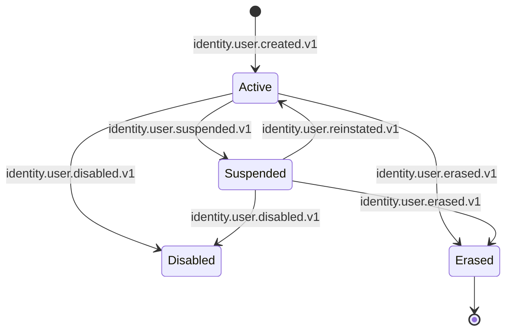
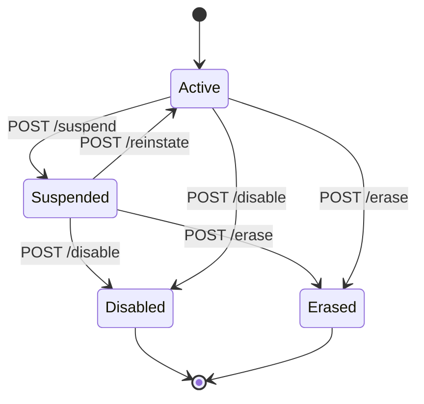
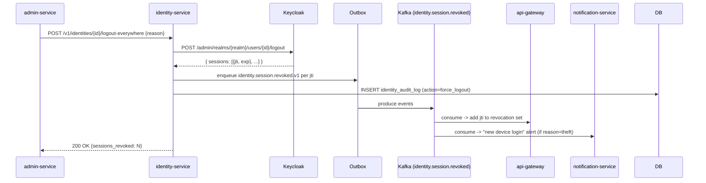
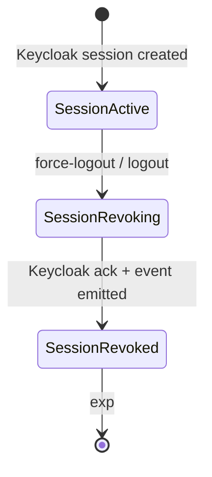

# identity-service — Workflows

## 1. User Creation in Keycloak → Identity Mapping

### 1.1 Objective

When a new user is created in Keycloak (via a profile
service or directly), an `identities` row is created and
`identity.user.created.v1` is emitted, before any
dependent service references the new `identity_id`.

### 1.2 Initiating Actor

Keycloak emits a `REGISTER` event via the SPI plugin on the
`identity.lifecycle` Kafka topic. Alternatively, a
profile service creates the identity via
`POST /v1/identities` on first reference.

### 1.3 Participating Services

- Keycloak (SPI plugin).
- Kafka (transport).
- `identity-service` (consumer; creates the row).
- `audit-service`, ``reporting-service` (data lake)`,
  ``customer-service` (cross-persona profile)`, `customer-service`,
  `driver-service`, `courier-service`,
  ``restaurant-service` (merchant)`, `restaurant-service` (consumers
  of `identity.user.created.v1`).

### 1.4 Prerequisites

- Keycloak is up; the SPI plugin is deployed.
- The Kafka topic `identity.lifecycle` exists with
  replication factor ≥ 3.
- The PostgreSQL `identity` schema is migrated.

### 1.5 Happy Path

```mermaid
sequenceDiagram
    participant K as Keycloak
    participant SPI as SPI plugin
    participant T as Kafka (identity.lifecycle)
    participant IS as identity-service
    participant DB as PostgreSQL (identity)
    participant OB as Outbox
    participant T2 as Kafka (identity.user.created)
    participant CS as customer-service
    participant USR as `customer-service` (cross-persona profile)

    K->>SPI: REGISTER event
    SPI->>T: produce identity.lifecycle (kc_sub, realm, event_type=REGISTER)
    T->>IS: deliver to consumer
    IS->>DB: BEGIN; INSERT INTO identity.identities (...); INSERT INTO identity.outbox (event_name=identity.user.created.v1, payload); COMMIT
    DB-->>IS: ok
    IS->>T: deliver outbox event
    T2->>CS: consume
    T2->>USR: consume
```

### 1.6 Alternate Paths

- **Direct creation**: a profile service calls
  `POST /v1/identities` with the `kc_sub` and
  `user_type`. The service creates the row, emits the
  event, and returns `201`.
- **Back-channel fill**: a profile service emits
  `customer.created.v1` (or equivalent) before the SPI
  plugin has delivered. The service consumes the
  back-channel and creates the row if missing. The
  `identity.user.created.v1` is emitted either way.

### 1.7 Failure Paths

- **DB write fails** (Postgres unreachable): the
  consumer retries 3 times with backoff; on continued
  failure, the message lands in the DLQ. The
  on-call is paged.
- **Outbox publish fails** (Kafka unreachable): the
  poller retries 3 times; the event remains in the
  outbox until published.
- **Concurrent creation** (two consumers of the SPI
  topic for the same `kc_sub`): the UNIQUE index on
  `(kc_sub, realm)` rejects the second insert; the
  second consumer treats the message as a no-op and
  acks.

### 1.8 Business Rules

- A new identity MUST be created before any dependent
  service references the `identity_id`. The outbox
  pattern guarantees the row and the event are
  atomic; consumers see the row before the event.
- A `(kc_sub, realm)` pair is unique.
- The `identity_id` is never recycled.

### 1.9 State Transitions



### 1.10 Events

| Event | Direction | When |
|-------|-----------|------|
| `identity.user.created.v1` | produced | on new mapping |
| `identity.lifecycle` (Keycloak SPI) | consumed | on REGISTER event |

### 1.11 APIs Involved

| API | Direction | When |
|-----|-----------|------|
| Keycloak admin | outbound | on creation (optional, for claim fetch) |
| `POST /v1/identities` | inbound | on direct creation by a profile service |
| `GET /v1/identities/{id}` | inbound | on subsequent lookups |
| Kafka publish | outbound (outbox) | on new mapping |

### 1.12 Compensation / Rollback

There is no compensation: the row and the event are
atomic. If the Kafka publish fails, the poller retries
until success. If the DB write fails, the consumer's
retry handles transient failures; on permanent failure,
the message is in the DLQ and the on-call is paged.

### 1.13 Final State

- The `identities` row exists with the user's claims.
- `identity.user.created.v1` is on the topic.
- The dependent profile services have consumed it and
  created their own profile rows (with the
  `identity_id` reference).

## 2. Suspension of a User

### 2.1 Objective

Suspend a user (admin action), block them at Keycloak,
propagate `identity.user.suspended.v1` to every
dependent service and to the `api-gateway`'s revocation
set, within 10 seconds (P99).

### 2.2 Initiating Actor

`admin-service` calls `POST /v1/identities/{id}/suspend`
on behalf of an admin, fraud-reviewer, or automated
payment-failure handler.

### 2.3 Participating Services

- `admin-service` (caller).
- `identity-service` (this service).
- Keycloak (state change).
- Kafka (`identity.user.suspended.v1`).
- All profile services, `notification-service`,
  `fraud-risk-service`, `api-gateway` (consumers).

### 2.4 Prerequisites

- The `identities` row exists.
- The admin has the `identity.admin` realm role.

### 2.5 Happy Path

```mermaid
sequenceDiagram
    participant ADM as admin-service
    participant IS as identity-service
    participant DB as PostgreSQL (identity)
    participant KC as Keycloak
    participant OB as Outbox
    participant T as Kafka (identity.user.suspended)
    participant GW as api-gateway
    participant CS as customer-service
    participant NOT as notification-service

    ADM->>IS: POST /v1/identities/{id}/suspend {reason, note}
    IS->>DB: BEGIN; UPDATE identities SET status='suspended', ... ; INSERT INTO identity_audit_log; INSERT INTO outbox; COMMIT
    IS->>KC: PUT /admin/realms/{realm}/users/{id}/disable-credential-types (or set enabled=false)
    KC-->>IS: ok
    IS->>OB: enqueued
    OB->>T: produce identity.user.suspended.v1
    T->>GW: consume -> write to revocation set
    T->>CS: consume -> mark customer suspended
    T->>NOT: consume -> notify user
    IS-->>ADM: 200 OK {status: suspended}
```

### 2.6 Alternate Paths

- **Payment-failure auto-suspend**: the
  `payment-service` saga detects repeated payment
  failure and calls `identity-service` with
  `reason: "payment_failure"` and
  `actor_type: "service"`.
- **Fraud auto-suspend**: `fraud-risk-service` detects
  a high-risk pattern and calls with
  `reason: "fraud"`.

### 2.7 Failure Paths

- **Keycloak state change fails**: the service retries;
  on continued failure, the row is updated but the
  Keycloak state is not. A reconciliation job in
  `reporting-service` notices the mismatch and retries
  the Keycloak call. The user is partially suspended
  (the `identities` row says suspended; the gateway
  revocation set is updated because the event is
  emitted regardless) but Keycloak still allows login
  until the reconciliation job succeeds. The job
  opens a ticket.
- **Outbox publish fails**: the poller retries; the
  event is eventually emitted. The propagation lag
  may exceed 10 s during the failure window.

### 2.8 Business Rules

- A suspension reason MUST be in the allowed set.
- A user already suspended with a different reason
  cannot be suspended again (409 CONFLICT).
- The suspension MUST be applied to Keycloak AND
  emitted as an event AND audited in
  `identity_audit_log`, all within a single
  transaction (the outbox pattern handles the event;
  the Keycloak call is best-effort and reconciled).
- The `api-gateway`'s revocation set MUST contain the
  `kc_sub` within 10 s of the suspension.

### 2.9 State Transitions



### 2.10 Events

| Event | Direction | When |
|-------|-----------|------|
| `identity.user.suspended.v1` | produced | on suspension |
| `identity.user.disabled.v1` | produced | on disable (different action) |
| `identity.user.reinstated.v1` | produced | on re-instatement |

### 2.11 APIs Involved

| API | Direction | When |
|-----|-----------|------|
| `POST /v1/identities/{id}/suspend` | inbound | per suspension |
| Keycloak admin | outbound | per suspension |
| Kafka publish | outbound (outbox) | per suspension |
| `GET /v1/identities/{id}` | inbound | per subsequent lookup |

### 2.12 Compensation / Rollback

If the suspension was issued in error, an admin issues
`POST /v1/identities/{id}/reinstate` to revert. The
re-instatement emits `identity.user.reinstated.v1`, the
gateway's revocation set removes the `kc_sub` entry on
TTL, and the dependent services flip the suspended flag
back to false.

### 2.13 Final State

- The `identities` row is `suspended`.
- Keycloak does not allow the user to log in.
- The `api-gateway` rejects all current and future
  tokens for the `kc_sub`.
- The dependent services have marked the user as
  suspended.
- The `identity_audit_log` has the suspension entry
  with reason, actor, and `correlation_id`.

## 3. Force-Logout / Session Revocation

### 3.1 Objective

Revoke all active Keycloak sessions for a user (e.g. on
suspected session theft), and emit
`identity.session.revoked.v1` for each revoked session
so the `api-gateway` can update its revocation set.

### 3.2 Initiating Actor

`admin-service` calls
`POST /v1/identities/{id}/logout-everywhere` on behalf
of an admin or a fraud signal.

### 3.3 Participating Services

- `admin-service` (caller).
- `identity-service` (this service).
- Keycloak (`/admin/realms/{realm}/users/{id}/logout`).
- Kafka (`identity.session.revoked.v1`).
- `api-gateway`, `notification-service`,
  `audit-service` (consumers).

### 3.4 Prerequisites

- The `identities` row exists.
- The user has at least one active session in Keycloak
  (otherwise the action is a no-op).

### 3.5 Happy Path



### 3.6 Alternate Paths

- **Single-session logout** (e.g. a user logs out
  normally): Keycloak emits a `LOGOUT` event via the
  SPI plugin; the service consumes it and emits
  `identity.session.revoked.v1` for the single `jti`.
- **Theft detection by `fraud-risk-service`**: the
  service detects refresh-token rotation conflict and
  calls `identity-service` with
  `reason: "theft_detected"`.

### 3.7 Failure Paths

- **Keycloak call fails**: the service retries 3
  times; on continued failure, returns
  `502 DEPENDENCY_UPSTREAM_FAILURE`. The action is
  not completed; the user is still logged in.
- **Partial revocation** (Keycloak revoked some
  sessions but the call timed out): the service
  emits the events for the revoked sessions it
  received; the on-call investigates.

### 3.8 Business Rules

- Every force-logout MUST be audited.
- Every revoked `jti` MUST be emitted as an
  `identity.session.revoked.v1` event.
- The `api-gateway`'s revocation set MUST contain
  every emitted `jti` within 5 s (P99).

### 3.9 State Transitions



### 3.10 Events

| Event | Direction | When |
|-------|-----------|------|
| `identity.session.revoked.v1` | produced | per revoked `jti` |
| `identity.lifecycle` (Keycloak SPI) | consumed | on LOGOUT event (single-session case) |

### 3.11 APIs Involved

| API | Direction | When |
|-----|-----------|------|
| `POST /v1/identities/{id}/logout-everywhere` | inbound | per admin action |
| Keycloak admin | outbound | per action |
| Kafka publish | outbound (outbox) | per revoked `jti` |

### 3.12 Compensation / Rollback

There is no compensation for a force-logout. A user
who was force-logged-out must re-authenticate.

### 3.13 Final State

- All active Keycloak sessions for the user are
  revoked.
- The `identity.session.revoked.v1` events are on the
  topic.
- The `api-gateway`'s revocation set contains every
  `jti`.
- The audit log has the force-logout entry.

## 4. GDPR Right-to-Erasure

### 4.1 Objective

Anonymize the `identities` row and the cached claims;
emit `identity.user.erased.v1`; preserve the
`identity_id` and `kc_sub` for referential integrity
(financial records in `ledger-service`,
`payment-service`, ``payment-service` (wallet)` retain the
`identity_id` reference but their PII fields are
redacted by the owning service).

### 4.2 Initiating Actor

`admin-service` calls `POST /v1/identities/{id}/erase`
on behalf of a compliance officer or a user self-service
flow.

### 4.3 Participating Services

- `admin-service` (caller).
- `identity-service` (this service).
- Keycloak (delete user, with a soft-delete marker).
- Kafka (`identity.user.erased.v1`).
- All profile services (consumers; they anonymize
  their PII and retain the `identity_id` reference).
- `audit-service` (consumer).

### 4.4 Prerequisites

- The `identities` row exists.
- The compliance officer has `identity.admin` or
  `super_admin` realm role.

### 4.5 Happy Path

```mermaid
sequenceDiagram
    participant ADM as admin-service
    participant IS as identity-service
    participant DB as PostgreSQL (identity)
    participant KC as Keycloak
    participant OB as Outbox
    participant T as Kafka (identity.user.erased)
    participant CS as customer-service
    participant DRV as driver-service
    participant AUD as audit-service
    participant LD as ledger-service
    participant PAY as payment-service

    ADM->>IS: POST /v1/identities/{id}/erase {legal_basis}
    IS->>DB: BEGIN; UPDATE identities SET name='REDACTED', email='REDACTED', phone='REDACTED', email_verified=false, phone_verified=false, status='erased', erased_at=now(), deleted_at=now(); UPDATE identity_claims SET name='REDACTED', email='REDACTED', phone='REDACTED'; INSERT INTO identity_audit_log; INSERT INTO outbox; COMMIT
    IS->>KC: DELETE /admin/realms/{realm}/users/{id} (or soft-delete marker)
    KC-->>IS: ok
    IS-->>ADM: 200 OK {status: erased, warnings: []}
    OB->>T: produce identity.user.erased.v1
    T->>CS: consume -> anonymize customer PII
    T->>DRV: consume -> anonymize driver PII
    T->>AUD: consume
    T->>LD: consume -> ledger retains identity_id, redacts PII
    T->>PAY: consume -> payment retains identity_id, redacts PII
```

### 4.6 Alternate Paths

- **Erasure with active financial records**: the
  service performs the erasure but populates
  `warnings[]` in the response (e.g.
  "active_ledger_entries: 12"). The owning services
  retain the `identity_id` reference but redact PII.
- **Erasure on a soft-deleted row**: the service
  returns 409 `CONFLICT` (already erased).

### 4.7 Failure Paths

- **DB write fails**: the action is not performed;
  the admin retries.
- **Keycloak delete fails**: the row is updated but
  the Keycloak user is not deleted. A reconciliation
  job retries the Keycloak delete. A PII leak risk
  exists if the reconciliation job fails
  repeatedly; a ticket is opened and the on-call is
  paged.
- **Outbox publish fails**: the poller retries; the
  event is eventually emitted. The dependent services
  eventually anonymize their PII; the reconciliation
  job in `reporting-service` detects any drift and
  re-emits the erasure (idempotent).

### 4.8 Business Rules

- The `identity_id` and `kc_sub` are preserved.
- All PII columns are set to `REDACTED`.
- The `status` is set to `erased`.
- The `deleted_at` is set; the row is a tombstone.
- `identity.user.erased.v1` is emitted exactly once
  (idempotency on `Idempotency-Key`).
- The audit log retains the erasure entry
  indefinitely (legal hold).

### 4.9 State Transitions

```mermaid
stateDiagram-v2
    [*] --> Active
    Active --> Erased: POST /erase
    Suspended --> Erased: POST /erase
    Erased --> [*]
    Erased -.->|re-activation NOT allowed| Erased
```

### 4.10 Events

| Event | Direction | When |
|-------|-----------|------|
| `identity.user.erased.v1` | produced | on erasure |

### 4.11 APIs Involved

| API | Direction | When |
|-----|-----------|------|
| `POST /v1/identities/{id}/erase` | inbound | per erasure |
| Keycloak admin | outbound | per erasure |
| Kafka publish | outbound (outbox) | per erasure |

### 4.12 Compensation / Rollback

There is no compensation. Erasure is irreversible.
The `identity_id` and `kc_sub` are preserved for
referential integrity; the PII is gone.

### 4.13 Final State

- The `identities` row is a tombstone with PII
  redacted.
- The `identity_claims` row has PII redacted.
- Keycloak has no user record for the `kc_sub`
  (or has a soft-delete marker).
- `identity.user.erased.v1` is on the topic.
- The dependent services have anonymized their PII
  but retain the `identity_id` reference.
- The audit log has the erasure entry.

## 5. Claim Refresh from Keycloak

### 5.1 Objective

Keep the `identity_claims` row in sync with Keycloak.
Refreshed on `identity.lifecycle` events (UPDATE_PROFILE)
and on a periodic poll (every 5 minutes per identity,
staggered).

### 5.2 Initiating Actor

Keycloak emits `UPDATE_PROFILE` via the SPI plugin; or
a periodic poll job.

### 5.3 Participating Services

- Keycloak (admin API; SPI).
- `identity-service` (consumer; refetches claims and
  updates the cache).
- Kafka (`identity.user.updated.v1`).

### 5.4 Prerequisites

- The `identities` row exists.

### 5.5 Happy Path

```mermaid
sequenceDiagram
    participant K as Keycloak
    participant SPI as SPI plugin
    participant T as Kafka (identity.lifecycle)
    participant IS as identity-service
    participant DB as PostgreSQL (identity)
    participant OB as Outbox
    participant T2 as Kafka (identity.user.updated)

    K->>SPI: UPDATE_PROFILE event (kc_sub, realm, changed_fields)
    SPI->>T: produce identity.lifecycle
    T->>IS: deliver to consumer
    IS->>DB: BEGIN; UPDATE identities SET <changed fields>; UPDATE identity_claims; INSERT INTO identity_claim_history; INSERT INTO outbox; COMMIT
    IS->>K: GET /admin/realms/{realm}/users/{id} (full claim refresh)
    K-->>IS: user
    IS->>DB: UPDATE identity_claims SET <claims>
    OB->>T2: produce identity.user.updated.v1
```

### 5.6 Alternate Paths

- **Periodic poll**: a job picks identities whose
  `last_refreshed_at` is older than 5 minutes and
  refetches their claims. This is the safety net for
  missed SPI events.

### 5.7 Failure Paths

- **Keycloak call fails**: the service retries 3
  times; on continued failure, the next periodic
  poll will retry.
- **DB write fails**: the consumer retries; on
  failure, the message lands in the DLQ.

### 5.8 Business Rules

- A claim change MUST be reflected in
  `identity_claims` within 10 s of the Keycloak
  event.
- Every change MUST be appended to
  `identity_claim_history`.
- `identity.user.updated.v1` MUST be emitted on
  every change.

### 5.9 State Transitions

The `identity_claims` row has no explicit state
machine; it's a cache. The `identities` row's
`status` state machine is unaffected by claim
refreshes.

### 5.10 Events

| Event | Direction | When |
|-------|-----------|------|
| `identity.user.updated.v1` | produced | on claim change |
| `identity.lifecycle` (Keycloak SPI) | consumed | on UPDATE_PROFILE |

### 5.11 APIs Involved

| API | Direction | When |
|-----|-----------|------|
| Keycloak admin | outbound | per refresh |
| Kafka publish | outbound (outbox) | per change |

### 5.12 Compensation / Rollback

There is no compensation. A claim change is final
once the row is updated; the audit row in
`identity_claim_history` is the source of truth for
the change history.

### 5.13 Final State

- `identity_claims` row is up-to-date.
- `identity_claim_history` has the change appended.
- `identity.user.updated.v1` is on the topic.
- Dependent services (e.g. ``customer-service` (cross-persona profile)`,
  `notification-service`) have consumed the event
  and updated their caches.

---

## See also

### Sibling docs for this service

- [`README.md`](./README.md) — purpose, bounded context, responsibilities
- [`BRD.md`](./BRD.md) — business requirements
- [`SRS.md`](./SRS.md) — functional + non-functional requirements
- [`ERD.md`](./ERD.md) — data model (entities, relationships)
- [`INTEGRATION.md`](./INTEGRATION.md) — inter-service contracts (APIs, events, sagas)
- [`WORKFLOWS.md`](./WORKFLOWS.md) — operational workflows (happy paths, failure modes)
- [`TECH.md`](./TECH.md) — technology profile (runtime, libraries, data layer, admin endpoints, RBAC)

### Platform-wide

- [`../../shared/README.md`](../../shared/README.md) — `platform-spring-boot-starter` shared library (the single source of cross-cutting code for all Spring Boot services in the platform)
- [`../RECOMMENDATIONS.md`](../RECOMMENDATIONS.md) — platform-wide technology map (language, framework, version baseline, admin/RBAC pattern)
- [`../../README.md`](../../README.md) — services overview (the catalog of all 20 services)
- [`../../../main.md`](../../../main.md) — top-level platform specification (architecture, Keycloak, PostgreSQL 18, messaging, observability baseline)

