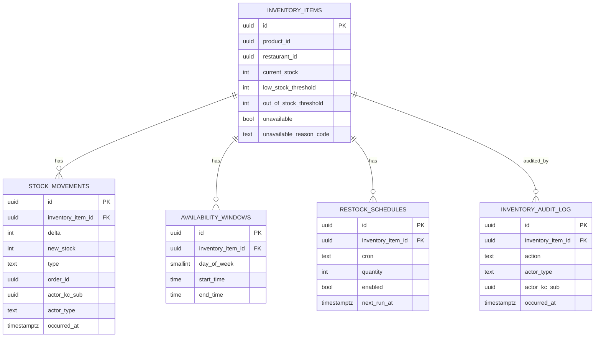

# inventory-service — Entity-Relationship Diagram

## 1. Database

- Engine: **PostgreSQL 18**.
- Schema: `inventory` (owned exclusively by this service).
- Migrations: `services/inventory-service/prisma/migrations/`.

## 2. Cross-Service References

| Column | Type | Refers to | Source of truth |
|--------|------|-----------|------------------|
| `inventory_items.product_id` | UUID | Product | `menu-service` |
| `inventory_items.restaurant_id` | UUID | Restaurant | `restaurant-service` |
| `stock_movements.order_id` | UUID | FoodOrder | `food-order-service` |
| `stock_movements.order_line_id` | UUID | order line | `food-order-service` |
| `inventory_items.actor_kc_sub` | UUID | Keycloak user | `identity-service` |

All cross-service references are stored as columns **without**
database-level foreign keys.

## 3. Entities

### `inventory_items`

A stock-keeping entry for a specific product at a specific
restaurant.

#### Columns

| Column | Type | Constraints | Notes |
|--------|------|-------------|-------|
| `id` | UUID | PK | UUIDv7 |
| `product_id` | UUID | NOT NULL | cross-service ref |
| `restaurant_id` | UUID | NOT NULL | cross-service ref |
| `current_stock` | INTEGER | NOT NULL DEFAULT 0 CHECK (current_stock >= 0) | current count |
| `low_stock_threshold` | INTEGER | NOT NULL DEFAULT 5 CHECK (low_stock_threshold >= 0) | alert threshold |
| `out_of_stock_threshold` | INTEGER | NOT NULL DEFAULT 0 CHECK (out_of_stock_threshold >= 0) | OOS threshold |
| `unavailable` | BOOLEAN | NOT NULL DEFAULT false | 86 flag |
| `unavailable_reason_code` | TEXT | NULL | reason |
| `unavailable_actor_kc_sub` | UUID | NULL | who 86'd |
| `unavailable_at` | TIMESTAMPTZ | NULL | when 86'd |
| `created_at` | TIMESTAMPTZ | NOT NULL DEFAULT now() | audit |
| `updated_at` | TIMESTAMPTZ | NOT NULL DEFAULT now() | audit |
| `created_by` | UUID | NOT NULL | identity |
| `updated_by` | UUID | NOT NULL | identity |
| `deleted_at` | TIMESTAMPTZ | NULL | soft delete |

#### Indexes

- PK on `id`.
- UNIQUE partial on `(product_id, restaurant_id) WHERE
  deleted_at IS NULL` — one item per (product, restaurant).
- Index on `(restaurant_id) WHERE deleted_at IS NULL`.
- Partial index on `(unavailable) WHERE unavailable = true AND
  deleted_at IS NULL`.

### `stock_movements`

Append-only history of stock changes.

#### Columns

| Column | Type | Constraints | Notes |
|--------|------|-------------|-------|
| `id` | UUID | PK | UUIDv7 |
| `inventory_item_id` | UUID | NOT NULL, FK to `inventory_items.id` | |
| `delta` | INTEGER | NOT NULL | positive = add, negative = subtract |
| `new_stock` | INTEGER | NOT NULL CHECK (new_stock >= 0) | resulting stock |
| `type` | TEXT | NOT NULL CHECK in (...) | `restock`, `adjust`, `order_placed`, `order_cancelled`, `auto_restock` |
| `reason_code` | TEXT | NULL | optional |
| `reason_text` | TEXT | NULL | optional |
| `order_id` | UUID | NULL | cross-service ref (when type = order_*) |
| `order_line_id` | UUID | NULL | cross-service ref (when type = order_*) |
| `actor_kc_sub` | UUID | NULL | null for system |
| `actor_type` | TEXT | NOT NULL CHECK in (...) | `admin`, `owner`, `manager`, `kitchen`, `system` |
| `correlation_id` | UUID | NOT NULL | trace |
| `occurred_at` | TIMESTAMPTZ | NOT NULL DEFAULT now() | |

#### Indexes

- PK on `id`.
- Index on `(inventory_item_id, occurred_at DESC)`.
- Index on `(order_id)` where not null.

### `availability_windows`

Time-bound availability windows.

#### Columns

| Column | Type | Constraints | Notes |
|--------|------|-------------|-------|
| `id` | UUID | PK | UUIDv7 |
| `inventory_item_id` | UUID | NOT NULL, FK to `inventory_items.id` | |
| `day_of_week` | SMALLINT | NOT NULL CHECK (day_of_week BETWEEN 1 AND 7) | 1=Mon, 7=Sun |
| `start_time` | TIME | NOT NULL | local time |
| `end_time` | TIME | NOT NULL | local time |
| `created_at` | TIMESTAMPTZ | NOT NULL DEFAULT now() | |
| `deleted_at` | TIMESTAMPTZ | NULL | soft delete |

#### Indexes

- PK on `id`.
- Index on `(inventory_item_id, day_of_week)`.
- CHECK: `end_time > start_time`.

### `restock_schedules`

Auto-restock schedules (cron-based).

#### Columns

| Column | Type | Constraints | Notes |
|--------|------|-------------|-------|
| `id` | UUID | PK | UUIDv7 |
| `inventory_item_id` | UUID | NOT NULL, FK to `inventory_items.id` | |
| `cron` | TEXT | NOT NULL | standard cron expression |
| `quantity` | INTEGER | NOT NULL CHECK (quantity > 0) | amount to add |
| `enabled` | BOOLEAN | NOT NULL DEFAULT true | |
| `last_run_at` | TIMESTAMPTZ | NULL | when last executed |
| `next_run_at` | TIMESTAMPTZ | NULL | when next scheduled |
| `created_at` | TIMESTAMPTZ | NOT NULL DEFAULT now() | |
| `updated_at` | TIMESTAMPTZ | NOT NULL DEFAULT now() | |
| `deleted_at` | TIMESTAMPTZ | NULL | soft delete |

#### Indexes

- PK on `id`.
- Index on `(next_run_at) WHERE enabled = true AND deleted_at IS
  NULL` — scheduler hot path.

### `inventory_audit_log`

Append-only audit log.

#### Columns

| Column | Type | Constraints | Notes |
|--------|------|-------------|-------|
| `id` | UUID | PK | UUIDv7 |
| `inventory_item_id` | UUID | NOT NULL, FK to `inventory_items.id` | |
| `action` | TEXT | NOT NULL CHECK in (...) | `create`, `update`, `restock`, `adjust`, `86`, `un86`, `cascade_86`, `low_stock_alert` |
| `actor_kc_sub` | UUID | NULL | null for system |
| `actor_type` | TEXT | NOT NULL CHECK in (...) | `admin`, `owner`, `manager`, `kitchen`, `system` |
| `reason_code` | TEXT | NULL | required for 86, cascade, adjust |
| `details` | JSONB | NULL | action-specific |
| `correlation_id` | UUID | NOT NULL | trace |
| `occurred_at` | TIMESTAMPTZ | NOT NULL DEFAULT now() | |

#### Indexes

- PK on `id`.
- Index on `(inventory_item_id, occurred_at DESC)`.

### `outbox`

Transactional outbox for events.

#### Columns

| Column | Type | Constraints | Notes |
|--------|------|-------------|-------|
| `id` | UUID | PK | UUIDv7 |
| `aggregate_type` | TEXT | NOT NULL | `InventoryItem` |
| `aggregate_id` | UUID | NOT NULL | partition key |
| `event_name` | TEXT | NOT NULL | `inventory.*.v1` |
| `event_id` | UUID | NOT NULL UNIQUE | dedup |
| `payload` | JSONB | NOT NULL | envelope |
| `headers` | JSONB | NOT NULL DEFAULT '{}' | Kafka headers |
| `created_at` | TIMESTAMPTZ | NOT NULL DEFAULT now() | |
| `claimed_at` | TIMESTAMPTZ | NULL | poller-set |
| `published_at` | TIMESTAMPTZ | NULL | poller-set |

#### Indexes

- PK on `id`.
- Index on `(published_at NULLS FIRST, created_at)`.

### `inbox`

Consumer-side dedup.

#### Columns

| Column | Type | Constraints | Notes |
|--------|------|-------------|-------|
| `event_id` | UUID | PK | |
| `consumer` | TEXT | NOT NULL | |
| `received_at` | TIMESTAMPTZ | NOT NULL DEFAULT now() | |
| `processed_at` | TIMESTAMPTZ | NULL | |
| `error` | TEXT | NULL | |

## 4. Mermaid ER Diagram



## 5. DDL Sketch

```sql
CREATE SCHEMA IF NOT EXISTS inventory;

CREATE TABLE inventory.inventory_items (
    id UUID PRIMARY KEY,
    product_id UUID NOT NULL,
    restaurant_id UUID NOT NULL,
    current_stock INTEGER NOT NULL DEFAULT 0
        CHECK (current_stock >= 0),
    low_stock_threshold INTEGER NOT NULL DEFAULT 5
        CHECK (low_stock_threshold >= 0),
    out_of_stock_threshold INTEGER NOT NULL DEFAULT 0
        CHECK (out_of_stock_threshold >= 0),
    unavailable BOOLEAN NOT NULL DEFAULT false,
    unavailable_reason_code TEXT,
    unavailable_actor_kc_sub UUID,
    unavailable_at TIMESTAMPTZ,
    created_at TIMESTAMPTZ NOT NULL DEFAULT now(),
    updated_at TIMESTAMPTZ NOT NULL DEFAULT now(),
    created_by UUID NOT NULL,
    updated_by UUID NOT NULL,
    deleted_at TIMESTAMPTZ
);

CREATE UNIQUE INDEX inventory_items_product_restaurant_uniq
    ON inventory.inventory_items (product_id, restaurant_id)
    WHERE deleted_at IS NULL;

CREATE INDEX inventory_items_restaurant_idx
    ON inventory.inventory_items (restaurant_id)
    WHERE deleted_at IS NULL;

CREATE INDEX inventory_items_unavailable_idx
    ON inventory.inventory_items (unavailable)
    WHERE unavailable = true AND deleted_at IS NULL;

CREATE TABLE inventory.stock_movements (
    id UUID PRIMARY KEY,
    inventory_item_id UUID NOT NULL
        REFERENCES inventory.inventory_items(id),
    delta INTEGER NOT NULL,
    new_stock INTEGER NOT NULL CHECK (new_stock >= 0),
    type TEXT NOT NULL CHECK (type IN
        ('restock','adjust','order_placed','order_cancelled',
         'auto_restock')),
    reason_code TEXT,
    reason_text TEXT,
    order_id UUID,
    order_line_id UUID,
    actor_kc_sub UUID,
    actor_type TEXT NOT NULL CHECK (actor_type IN
        ('admin','owner','manager','kitchen','system')),
    correlation_id UUID NOT NULL,
    occurred_at TIMESTAMPTZ NOT NULL DEFAULT now()
);

CREATE INDEX stock_movements_item_idx
    ON inventory.stock_movements (inventory_item_id, occurred_at DESC);

CREATE INDEX stock_movements_order_idx
    ON inventory.stock_movements (order_id)
    WHERE order_id IS NOT NULL;

CREATE TABLE inventory.availability_windows (
    id UUID PRIMARY KEY,
    inventory_item_id UUID NOT NULL
        REFERENCES inventory.inventory_items(id),
    day_of_week SMALLINT NOT NULL
        CHECK (day_of_week BETWEEN 1 AND 7),
    start_time TIME NOT NULL,
    end_time TIME NOT NULL,
    created_at TIMESTAMPTZ NOT NULL DEFAULT now(),
    deleted_at TIMESTAMPTZ,
    CHECK (end_time > start_time)
);

CREATE INDEX availability_windows_item_dow_idx
    ON inventory.availability_windows (inventory_item_id, day_of_week);

CREATE TABLE inventory.restock_schedules (
    id UUID PRIMARY KEY,
    inventory_item_id UUID NOT NULL
        REFERENCES inventory.inventory_items(id),
    cron TEXT NOT NULL,
    quantity INTEGER NOT NULL CHECK (quantity > 0),
    enabled BOOLEAN NOT NULL DEFAULT true,
    last_run_at TIMESTAMPTZ,
    next_run_at TIMESTAMPTZ,
    created_at TIMESTAMPTZ NOT NULL DEFAULT now(),
    updated_at TIMESTAMPTZ NOT NULL DEFAULT now(),
    deleted_at TIMESTAMPTZ
);

CREATE INDEX restock_schedules_next_idx
    ON inventory.restock_schedules (next_run_at)
    WHERE enabled = true AND deleted_at IS NULL;

CREATE TABLE inventory.inventory_audit_log (
    id UUID PRIMARY KEY,
    inventory_item_id UUID NOT NULL
        REFERENCES inventory.inventory_items(id),
    action TEXT NOT NULL CHECK (action IN
        ('create','update','restock','adjust','86','un86',
         'cascade_86','low_stock_alert')),
    actor_kc_sub UUID,
    actor_type TEXT NOT NULL CHECK (actor_type IN
        ('admin','owner','manager','kitchen','system')),
    reason_code TEXT,
    details JSONB,
    correlation_id UUID NOT NULL,
    occurred_at TIMESTAMPTZ NOT NULL DEFAULT now()
);

CREATE INDEX inventory_audit_log_item_idx
    ON inventory.inventory_audit_log (inventory_item_id, occurred_at DESC);

CREATE TABLE inventory.outbox (
    id UUID PRIMARY KEY,
    aggregate_type TEXT NOT NULL,
    aggregate_id UUID NOT NULL,
    event_name TEXT NOT NULL,
    event_id UUID NOT NULL UNIQUE,
    payload JSONB NOT NULL,
    headers JSONB NOT NULL DEFAULT '{}'::jsonb,
    created_at TIMESTAMPTZ NOT NULL DEFAULT now(),
    claimed_at TIMESTAMPTZ,
    published_at TIMESTAMPTZ
);

CREATE INDEX outbox_pending_idx
    ON inventory.outbox (published_at NULLS FIRST, created_at);

CREATE TABLE inventory.inbox (
    event_id UUID PRIMARY KEY,
    consumer TEXT NOT NULL,
    received_at TIMESTAMPTZ NOT NULL DEFAULT now(),
    processed_at TIMESTAMPTZ,
    error TEXT
);
```

## 6. Audit Columns

`inventory_items` has `created_at`, `updated_at`, `created_by`,
`updated_by`, `deleted_at`. `stock_movements`,
`availability_windows`, `restock_schedules` have `created_at`.
`inventory_audit_log` is append-only.

## 7. Soft Delete

Yes on `inventory_items`, `availability_windows`,
`restock_schedules`. Reads include `WHERE deleted_at IS NULL`.
`stock_movements` is NOT soft-deleted (it is the financial
record).

## 8. JSONB Usage

- `outbox.payload` and `outbox.headers` for the event envelope.
- `inventory_audit_log.details` for action-specific details.
- No other JSONB.

## 9. Partitioning

No partitioning. `stock_movements` is pruned by a job (keeps
the last 2 years).

## 10. Data Retention

| Table | Retention | Purged by |
|-------|-----------|-----------|
| `inventory_items` | 7 years (financial) | hard delete after 7 years |
| `stock_movements` | 2 years | scheduled job |
| `availability_windows` | with item | hard delete with item |
| `restock_schedules` | with item | hard delete with item |
| `inventory_audit_log` | 7 years | hard delete with item |
| `outbox` | 24 h after `published_at` | scheduled job |
| `inbox` | 30 days | scheduled job |

## 11. Migration Considerations

- Adding a new stock movement `type`: forward-only migration.
- The unique partial index on `(product_id, restaurant_id)`
  enforces "one inventory item per (product, restaurant)".
- The auto-restock job is a separate cron that queries
  `restock_schedules WHERE enabled = true AND next_run_at <=
  now()` and processes them in batches.
- Decrement is implemented with a row-level lock; if the
  resulting stock would be negative, the transaction is rolled
  back and the caller receives 422 `INSUFFICIENT_STOCK`.
- The 86 list is shared with `menu-service` via
  `menu.item.unavailable.v1`; the inventory 86 is a mirror
  maintained for the operator console and the cart's fast
  availability check.

---

## See also

### Sibling docs for this service

- [`README.md`](./README.md) — purpose, bounded context, responsibilities
- [`BRD.md`](./BRD.md) — business requirements
- [`SRS.md`](./SRS.md) — functional + non-functional requirements
- [`ERD.md`](./ERD.md) — data model (entities, relationships)
- [`INTEGRATION.md`](./INTEGRATION.md) — inter-service contracts (APIs, events, sagas)
- [`WORKFLOWS.md`](./WORKFLOWS.md) — operational workflows (happy paths, failure modes)
- [`TECH.md`](./TECH.md) — technology profile (runtime, libraries, data layer, admin endpoints, RBAC)

### Platform-wide

- [`../../shared/README.md`](../../shared/README.md) — `platform-spring-boot-starter` shared library (the single source of cross-cutting code for all Spring Boot services in the platform)
- [`../RECOMMENDATIONS.md`](../RECOMMENDATIONS.md) — platform-wide technology map (language, framework, version baseline, admin/RBAC pattern)
- [`../../README.md`](../../README.md) — services overview (the catalog of all 58 services)
- [`../../../main.md`](../../../main.md) — top-level platform specification (architecture, Keycloak, PostgreSQL 18, messaging, observability baseline)

