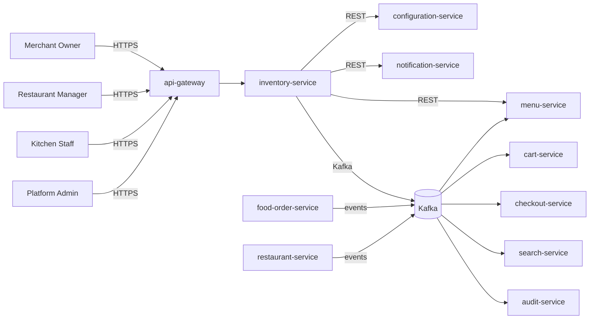

# inventory-service — Software Requirements Specification

## 1. Introduction

This SRS specifies the software behavior of `inventory-service`. It
covers functional requirements, non-functional requirements, data
requirements, API contract summaries, validation, state
transitions, authorization, idempotency, performance,
availability, security, and disaster recovery. The service is the
source of truth for the `InventoryItem` aggregate.

## 2. Scope

In scope:

- Inventory item CRUD.
- Stock tracking, restock, adjust.
- 86 / un-86.
- Time-bound availability windows.
- Auto-restock schedules.
- Order-driven decrement / re-credit.
- Cascade handling from parent restaurant events.

Out of scope:

- Menu catalog (owned by `menu-service`).
- Orders and prep state (owned by `food-order-service` and
  `restaurant-order-mgmt-service`).
- Branch hours (owned by `branch-service`).

## 3. System Context

## 4. Actors

- **Merchant Owner (human)** — Keycloak subject with role
  `merchant_owner`.
- **Restaurant Manager (human)** — staff with role `manager`.
- **Kitchen Staff (human)** — staff with role `kitchen`.
- **Platform Admin (human)** — full access.
- **`menu-service` (system)** — product (cross-service ref);
  consumes availability events.
- **`food-order-service` (system)** — emits order events.
- **`restaurant-service` (system)** — parent; cascade events.
- **`cart-service` (system)** — consumes availability events.
- **`checkout-service` (system)** — consumes availability events.
- **`search-service` (system)** — consumes availability events.
- **`audit-service` (system)** — receives audit events.

## 5. Functional Requirements

| ID | Requirement | Priority |
|----|-------------|----------|
| FR--001 | The service MUST accept `POST /v1/inventory/items` with `product_id`, `restaurant_id`, `initial_stock`. | MUST |
| FR--002 | The service MUST verify the parent restaurant is `approved` via `restaurant-service`. | MUST |
| FR--003 | The service MUST support `POST /v1/inventory/items/{id}/restock` with `quantity` and `reason`. | MUST |
| FR--004 | The service MUST support `POST /v1/inventory/items/{id}/adjust` (admin only) with `delta` and `reason`. | MUST |
| FR--005 | The service MUST support `POST /v1/inventory/items/{id}/86` with `reason_code`. | MUST |
| FR--006 | The service MUST support `DELETE /v1/inventory/items/{id}/86` to un-86. | MUST |
| FR--007 | The service MUST support `POST /v1/inventory/items/{id}/availability-windows` to add a time-bound window. | SHOULD |
| FR--008 | The service MUST support `POST /v1/inventory/items/{id}/restock-schedules` to add an auto-restock schedule. | SHOULD |
| FR--009 | The service MUST support `GET /v1/inventory/items` with filters. | MUST |
| FR--010 | The service MUST expose `GET /v1/inventory/items/{id}/availability` (cached, P99 < 30 ms). | MUST |
| FR--011 | The service MUST expose `GET /v1/inventory/items/{id}/stock` (system). | MUST |
| FR--012 | The service MUST decrement stock on `food.order.placed.v1` for each line item with an `inventory_item_id`. | MUST |
| FR--013 | The service MUST re-credit stock on `food.order.cancelled.v1`. | MUST |
| FR--014 | The service MUST emit `inventory.item.out_of_stock.v1` when stock reaches the threshold. | MUST |
| FR--015 | The service MUST emit `inventory.item.restocked.v1` when stock crosses the threshold upward. | MUST |
| FR--016 | The service MUST emit `inventory.item.low_stock.v1` when stock falls below the low-stock threshold. | MUST |
| FR--017 | The service MUST cascade parent restaurant `suspended` to 86 all items of the restaurant. | MUST |
| FR--018 | The service MUST cascade parent restaurant `closed` to 86 all items. | MUST |
| FR--019 | The service MUST mirror `menu.item.unavailable.v1` to its own 86 list (when the product has an `inventory_item_id`). | MUST |
| FR--020 | The service MUST publish an `inventory.*.v1` event for every state change. | MUST |
| FR--021 | The service MUST reject any decrement that would make stock negative with `INSUFFICIENT_STOCK`. | MUST |
| FR--022 | The service MUST emit `admin.audit.inventory.*` events for every admin action. | MUST |

## 6. Non-Functional Requirements

| ID | Category | Requirement | Target |
|----|----------|-------------|--------|
| NFR--001 | performance | P99 `GET /v1/inventory/items/{id}/availability` | < 30 ms (cache hit) |
| NFR--002 | performance | P99 `GET /v1/inventory/items/{id}` | < 150 ms |
| NFR--003 | performance | P99 `POST /v1/inventory/items` | < 500 ms |
| NFR--004 | availability | service uptime | 99.9% over 30 days |
| NFR--005 | scalability | `availability` lookups | ≥ 10,000 RPS via Redis |
| NFR--006 | scalability | concurrent writes | ≥ 200 RPS sustained, 1,000 RPS burst |
| NFR--007 | maintainability | MTTR for P1 | < 30 min |
| NFR--008 | data-integrity | zero event loss | outbox + 24 h ack |
| NFR--009 | latency | stock decrement P95 | < 5 s |
| NFR--010 | latency | out_of_stock emission P95 | < 1 s |

## 7. API Requirements

REST API under `/v1/inventory/items[...]` per
[`API_STANDARDS.md`](../../architecture/API_STANDARDS.md). All
write endpoints require `Idempotency-Key`. Cursor pagination by
default. OpenAPI 3.1 spec at `/openapi.json`.

(Full contracts in `INTEGRATION.md`.)

## 8. Data Requirements

| ID | Requirement | Notes |
|----|-------------|-------|
| DATA--001 | Inventory items are uniquely identified by `id UUIDv7`. | primary key |
| DATA--002 | Every mutable table has `created_at`, `updated_at`, `created_by`, `updated_by`, `deleted_at`. | audit |
| DATA--003 | `product_id` is a UUID column with no DB FK. | cross-service ref |
| DATA--004 | `restaurant_id` is a UUID column with no DB FK. | cross-service ref |
| DATA--005 | `current_stock` is a non-negative integer. | stock |
| DATA--006 | Stock movements are stored in `stock_movements` (1..n per item). | history |
| DATA--007 | Availability windows are stored in `availability_windows`. | time-bound |
| DATA--008 | Restock schedules are stored in `restock_schedules`. | cron |

(Full schema in `ERD.md`.)

## 9. Validation Rules

- `initial_stock` — non-negative integer.
- `quantity` on restock — positive integer.
- `delta` on adjust — non-zero integer; positive adds, negative
  subtracts.
- `unavailable_reason_code` — drawn from
  `inventory.86.reason_codes`.
- `availability_window.start` / `end` — times in the restaurant's
  timezone.
- `restock_schedule.cron` — standard cron expression.
- `restock_schedule.quantity` — positive integer.

## 10. State Transitions

| From | To | Trigger |
|------|----|---------|
| `available` | `unavailable` | 86 by operator; cascade; out_of_stock; menu mirror |
| `unavailable` | `available` | un-86 by operator; restock; menu mirror |

State transitions are described in detail in `WORKFLOWS.md`.

## 11. Authorization Requirements

- `merchant_owner` of the parent restaurant may create, edit,
  restock, 86, un-86.
- `restaurant_manager` may restock, 86, un-86, configure windows
  and schedules.
- `kitchen` may 86 only.
- `platform_admin` has full access and may adjust.
- All admin actions (adjust) are subject to HMAC-SHA256 request
  signing.

## 12. Configuration Requirements

- `inventory.low_stock.threshold` — int.
- `inventory.out_of_stock.threshold` — int.
- `inventory.restock.default_quantity` — int.
- `inventory.86.reason_codes` — array<string>.
- `inventory.rate_limit.restock_per_hour` — int.
- `inventory.cascade.suspend_to_86` — bool.
- `feature_flag.inventory.auto_restock_enabled` — bool.

## 13. Error Handling

| Error | Response |
|-------|----------|
| Body validation failure | 400 `VALIDATION_FAILED` with `details[]` |
| Missing/invalid JWT | 401 `UNAUTHENTICATED` |
| Insufficient role | 403 `FORBIDDEN` |
| Parent restaurant not approved | 409 `RESTAURANT_NOT_APPROVED` |
| Insufficient stock | 422 `INSUFFICIENT_STOCK` |
| Illegal state transition | 409 `STATE_INVALID` |
| Idempotency key reused | 422 `IDEMPOTENCY_KEY_REUSED` |
| Rate limited | 429 `RATE_LIMITED` |
| Downstream timeout | 503 `DEPENDENCY_TIMEOUT` |
| Circuit open | 503 `CIRCUIT_OPEN` |
| Other | 500 `INTERNAL_ERROR` |

## 14. Concurrency Requirements

- Two concurrent restocks on the same item MUST be serialized
  via row-level lock.
- Two concurrent decrements on the same item MUST be serialized;
  if the second would make stock negative, it is rejected.
- Cascade handlers MUST be idempotent via inbox dedup.

## 15. Idempotency Requirements

- All write endpoints require `Idempotency-Key`.
- Order-driven stock changes use the outbox pattern with
  `event_id` dedup.

## 16. Performance

- Dominant path: `GET /v1/inventory/items/{id}/availability`. P50
  < 5 ms (cache hit), P99 < 30 ms.
- `GET /v1/inventory/items/{id}`: P50 < 30 ms, P99 < 150 ms.
- `POST /v1/inventory/items`: P50 < 200 ms, P99 < 500 ms.
- Stock decrement: P50 < 50 ms, P99 < 200 ms.

## 17. Scalability

- Horizontal: HPA on CPU > 60% and
  `http_requests_in_flight > 500/replica`; max 12.
- Vertical: up to 4 CPU / 8 GiB.
- DB: 1 primary + 1 read replica in each region.
- Cache: Redis cluster, key
  `inventory:availability:{id}` TTL 30 s.

## 18. Availability

- SLO: 99.9% over 30 days (Tier-2).
- Error budget: ~44 min / 30 days.
- Maintenance: Sunday 04:00–06:00 UTC.

## 19. Security

| ID | Requirement | Notes |
|----|-------------|-------|
| SEC--001 | All endpoints require a valid JWT; service-to-service uses `client_credentials`. | gateway enforced |
| SEC--002 | Admin actions require `X-Audit-Reason` and HMAC-SHA256 signature. | `API_STANDARDS.md` §14 |
| SEC--003 | Resource-level ownership checks. | `inventory.restaurant.merchant.owner_kc_sub == sub` |
| SEC--004 | All cross-service calls use mTLS + `client_credentials` JWT. | defense in depth |
| SEC--005 | Secrets only in Vault. | pre-commit enforced |
| SEC--006 | Rate limiting at gateway and service. | `API_STANDARDS.md` §12 |
| SEC--007 | No PII beyond the operator's Keycloak subject. | minimal |
| SEC--008 | Admin actions emit `admin.audit.inventory.*` events. | `audit-service` |
| SEC--009 | The service stores no card data; PCI scope is none. | SAQ-A |

## 20. Privacy

- PII stored: minimal.
- Retention: 7 years (soft delete; hard delete after retention).
- Erasure: not applicable.

## 21. Auditability

- Every state transition emits an `inventory.*.v1` event.
- Every admin action emits an `admin.audit.inventory.*` event.
- Audit retention: 7 years.

## 22. Observability

- Logs: JSON to stdout with `correlation_id`, `trace_id`,
  `inventory_item_id`, `product_id`, `state`, `from_state`,
  `to_state`, `actor`, `reason_code`.
- Metrics:
  - RED: standard.
  - Business: `inventory_items_created_total`,
    `inventory_items_out_of_stock_total`,
    `inventory_items_restocked_total`,
    `inventory_items_86d_total{reason}`,
    `stock_movements_total{type}`,
    `inventory_low_stock_total`,
    `inventory_lookups_total{cache_hit}`.
- Traces: OpenTelemetry.
- Alerts: SLO burn rate, outbox lag, low-stock threshold.

## 23. Maintainability

- TypeScript strict, ESLint, Prettier.
- Coverage: ≥ 85% lines.
- Documentation: this folder.

## 24. Disaster Recovery

- RPO: 15 min (Tier-2; PITR 7 days).
- RTO: 60 min.
- Quarterly restore drill.

## 25. Acceptance Criteria

- AC-1: A merchant owner can create an inventory item in <
  5 min.
- AC-2: Stock is decremented on order placement within 5 s.
- AC-3: Stock is re-credited on order cancellation within 5 s.
- AC-4: An out-of-stock event is emitted within 1 s of stock
  reaching 0.
- AC-5: A 86 is reflected in the cart within 10 s.
- AC-6: A suspended restaurant's items are all 86'd within
  60 s.
- AC-7: All admin actions are recorded with reason and actor.
- AC-8: The service meets its 99.9% SLO.
- AC-9: All state changes are emitted as events.
- AC-10: Stock is never negative.

---

## See also

### Sibling docs for this service

- [`README.md`](./README.md) — purpose, bounded context, responsibilities
- [`BRD.md`](./BRD.md) — business requirements
- [`SRS.md`](./SRS.md) — functional + non-functional requirements
- [`ERD.md`](./ERD.md) — data model (entities, relationships)
- [`INTEGRATION.md`](./INTEGRATION.md) — inter-service contracts (APIs, events, sagas)
- [`WORKFLOWS.md`](./WORKFLOWS.md) — operational workflows (happy paths, failure modes)
- [`TECH.md`](./TECH.md) — technology profile (runtime, libraries, data layer, admin endpoints, RBAC)

### Platform-wide

- [`../../shared/README.md`](../../shared/README.md) — `platform-spring-boot-starter` shared library (the single source of cross-cutting code for all Spring Boot services in the platform)
- [`../RECOMMENDATIONS.md`](../RECOMMENDATIONS.md) — platform-wide technology map (language, framework, version baseline, admin/RBAC pattern)
- [`../../README.md`](../../README.md) — services overview (the catalog of all 58 services)
- [`../../../main.md`](../../../main.md) — top-level platform specification (architecture, Keycloak, PostgreSQL 18, messaging, observability baseline)

