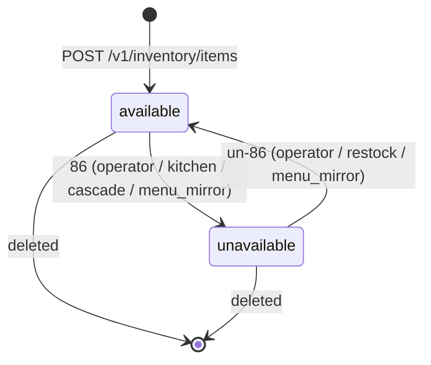

# inventory-service — Workflows

## 1. Inventory Item Creation

### 1.1 Objective

A merchant owner creates an inventory item for a specific
product at a specific restaurant, sets the initial stock, and
makes the item available for ordering. The
`inventory.item.created.v1` event is emitted and consumed by
`menu-service` (to bind the product) and `cart-service` (to
enable ordering).

### 1.2 Initiating Actor

`merchant_owner` (human).

### 1.3 Participating Services

- `inventory-service` (this service).
- `menu-service` (product verification; downstream).
- `restaurant-service` (parent verification).
- `configuration-service` (defaults).
- `cart-service` (downstream consumer).
- `audit-service`.

### 1.4 Prerequisites

- The product exists in `menu-service` (verified by id).
- The parent restaurant is `approved`.
- The operator has the right role.

### 1.5 Happy Path

```mermaid
sequenceDiagram
    participant OWN as Merchant Owner
    participant INV as inventory-service
    participant MN as menu-service
    participant RES as restaurant-service
    participant K as Kafka
    participant CRT as cart-service
    participant AUD as audit-service

    OWN->>INV: POST /v1/inventory/items (product_id, restaurant_id, initial_stock, Idempotency-Key)
    INV->>MN: GET /v1/menus/products/{id}
    MN-->>INV: ok
    INV->>RES: GET /v1/restaurants/{id}
    RES-->>INV: approved
    INV->>INV: state=available; current_stock=initial_stock
    INV-->>OWN: 201 inventory_item
    INV->>K: inventory.item.created.v1
    K->>MN: bind product
    K->>CRT: enable for cart
    K->>AUD: audit
```

### 1.6 Alternate Paths

- **Duplicate item for the same (product, restaurant)**: 409
  `INVENTORY_ITEM_EXISTS`.
- **Product not found**: 404 `PRODUCT_NOT_FOUND`.
- **Restaurant not approved**: 409 `RESTAURANT_NOT_APPROVED`.

### 1.7 Failure Paths

- **`menu-service` unreachable**: 503 `DEPENDENCY_TIMEOUT`.
- **Outbox failure**: outbox retried.

### 1.8 Business Rules

- Initial stock must be ≥ 0.
- One inventory item per (product, restaurant) is enforced by a
  unique partial index.

### 1.9 State Transitions



### 1.10 Events

| Event | Direction | When |
|-------|-----------|------|
| `inventory.item.created.v1` | produced | `POST /v1/inventory/items` |

### 1.11 APIs Involved

| API | Direction | When |
|-----|-----------|------|
| `POST /v1/inventory/items` | inbound | create |
| `GET /v1/menus/products/{id}` to menu-service | outbound | product check |
| `GET /v1/restaurants/{id}` to restaurant-service | outbound | parent check |

### 1.12 Compensation / Rollback

- **Wrong initial stock**: admin issues `POST /adjust` to
  correct.
- **Wrong product**: the operator deletes the item (soft) and
  creates a new one.

### 1.13 Final State

The inventory item exists with the initial stock; the cart
can now quote orders for the product; the menu binds the
product.

## 2. Order-Driven Decrement / Re-credit

### 2.1 Objective

When an order is placed, stock is decremented for each line
item with an `inventory_item_id`. When the order is cancelled
(before the courier picks up), stock is re-credited.

### 2.2 Initiating Actor

`food-order-service` (system) via `food.order.placed.v1` and
`food.order.cancelled.v1`.

### 2.3 Participating Services

- `inventory-service` (this service).
- `menu-service` (downstream — auto-86 on out-of-stock).
- `cart-service` (downstream — remove unavailable items).
- `notification-service` (low-stock alerts).
- `audit-service`.

### 2.4 Prerequisites

- `food.order.placed.v1` or `food.order.cancelled.v1` is
  received.
- Inbox dedup passes.

### 2.5 Happy Path (Decrement)

```mermaid
sequenceDiagram
    participant FOR as food-order-service
    participant K as Kafka
    participant INV as inventory-service
    participant MN as menu-service
    participant CRT as cart-service
    participant NOT as notification-service
    participant AUD as audit-service

    K->>INV: food.order.placed.v1
    INV->>INV: inbox dedup
    loop each line item with inventory_item_id
        INV->>INV: row-level lock; current_stock -= quantity
        alt new_stock <= out_of_stock_threshold
            INV->>INV: unavailable=true; reason_code=stock
            INV->>K: inventory.item.out_of_stock.v1
            K->>MN: auto-86 menu product
            K->>CRT: remove from active carts
            K->>AUD: audit
        else new_stock <= low_stock_threshold
            INV->>K: inventory.item.low_stock.v1
            K->>NOT: notify owner
            K->>AUD: audit
        end
        INV->>INV: insert stock_movements (type=order_placed)
    end
```

### 2.6 Alternate Paths

- **Decrement would make stock negative**: the upstream
  `food-order-service` validates via the API before placing the
  order; the consumer is idempotent. If a duplicate or out-of-
  order event arrives, the consumer computes the delta and
  applies it; if the resulting stock would be negative, the
  consumer logs and emits a `reconciliation.drift` event
  (consumed by `reporting-service`).

### 2.7 Failure Paths

- **Outbox failure**: outbox retried.

### 2.8 Business Rules

- Decrement is atomic with the event processing (saga step).
- Re-credit is atomic with the cancellation event.
- The `stock_movements` table is the financial record.

### 2.9 State Transitions

The relevant transitions are `available → unavailable` (on
out-of-stock) and `unavailable → available` (on re-credit
crossing the threshold).

### 2.10 Events

| Event | Direction | When |
|-------|-----------|------|
| `food.order.placed.v1` | consumed | decrement |
| `food.order.cancelled.v1` | consumed | re-credit |
| `inventory.item.out_of_stock.v1` | produced | on OOS |
| `inventory.item.restocked.v1` | produced | on restock crossing threshold |
| `inventory.item.low_stock.v1` | produced | on low stock |

### 2.11 APIs Involved

| API | Direction | When |
|-----|-----------|------|
| (no inbound API for this workflow) | | |
| `GET /v1/inventory/items/{id}/availability` (read by food-order-service) | inbound (read) | pre-check |

### 2.12 Compensation / Rollback

`food.order.cancelled.v1` re-credits stock; the inventory
emits `restocked.v1` if the new stock crosses the threshold.

### 2.13 Final State

Stock is decremented on order placement; re-credited on
cancellation; low-stock and out-of-stock events are emitted as
appropriate.

## 3. Auto-Restock

### 3.1 Objective

A scheduled cron restocks inventory items at the configured
times (e.g. "every morning at 06:00, add 100").

### 3.2 Initiating Actor

Cron job (system).

### 3.3 Participating Services

- `inventory-service` (this service).
- `notification-service` (low-stock alerts).
- `audit-service`.

### 3.4 Prerequisites

- `restock_schedules` have `enabled = true` and
  `next_run_at <= now()`.

### 3.5 Happy Path

```mermaid
sequenceDiagram
    participant CRON as Cron Job
    participant INV as inventory-service
    participant K as Kafka
    participant NOT as notification-service
    participant AUD as audit-service

    CRON->>INV: query restock_schedules (next_run_at <= now())
    loop each due schedule
        INV->>INV: row-level lock; current_stock += quantity
        INV->>INV: update last_run_at, next_run_at
        INV->>INV: insert stock_movements (type=auto_restock)
        alt new_stock crosses OOS threshold upward
            INV->>K: inventory.item.restocked.v1
            K->>NOT: notify owner
            K->>AUD: audit
        end
    end
```

### 3.6 Alternate Paths

- **Schedule disabled**: skipped.
- **Item deleted**: skipped.

### 3.7 Failure Paths

- **Job failure**: the schedule's `next_run_at` is not
  advanced; the next run attempts again. After 3 consecutive
  failures, a `support.ticket` is opened.

### 3.8 Business Rules

- Auto-restock adds the configured quantity at the configured
  time, regardless of current stock.
- The `cron` expression is interpreted in the restaurant's
  timezone.

### 3.9 State Transitions

No state transition; only stock changes.

### 3.10 Events

| Event | Direction | When |
|-------|-----------|------|
| `inventory.item.restocked.v1` | produced | on restock crossing threshold |

### 3.11 APIs Involved

No direct API involvement; pure internal cron.

### 3.12 Compensation / Rollback

- An admin can issue `POST /adjust` to correct.

### 3.13 Final State

Stock is incremented; the schedule is updated; downstream
services are notified if the threshold is crossed.

## 4. Cascade 86 (Parent Restaurant Suspended)

### 4.1 Objective

When the parent restaurant is suspended, all of its inventory
items are 86'd so that no orders are accepted.

### 4.2 Initiating Actor

`restaurant-service` (system) via `restaurant.suspended.v1`.

### 4.3 Participating Services

- `inventory-service` (this service).
- `cart-service` (downstream — remove unavailable items).
- `menu-service` (downstream — auto-86 mirror).
- `audit-service`.

### 4.4 Prerequisites

- `restaurant.suspended.v1` is received.
- Inbox dedup passes.

### 4.5 Happy Path

```mermaid
sequenceDiagram
    participant K as Kafka
    participant INV as inventory-service
    participant CRT as cart-service
    participant MN as menu-service
    participant AUD as audit-service

    K->>INV: restaurant.suspended.v1
    INV->>INV: inbox dedup
    INV->>INV: query items by restaurant_id
    loop each item
        INV->>INV: unavailable=true; reason_code=parent_suspended
        INV->>K: inventory.item.unavailable.v1 (cause=cascade)
        K->>CRT: block
        K->>MN: mirror 86
        K->>AUD: audit
    end
```

### 4.6 Alternate Paths

- **No items**: nothing to do.
- **Already 86'd**: skip (idempotent via the unique key on
  `reason_code`).

### 4.7 Failure Paths

- **Outbox failure**: outbox retried.

### 4.8 Business Rules

- Cascade has priority over operator-set 86.

### 4.9 State Transitions

The relevant transition is `available → unavailable` (with
`cause = cascade`).

### 4.10 Events

| Event | Direction | When |
|-------|-----------|------|
| `restaurant.suspended.v1` | consumed | trigger |
| `inventory.item.unavailable.v1` | produced | per item |

### 4.11 APIs Involved

No direct API involvement.

### 4.12 Compensation / Rollback

`restaurant.reinstated.v1` does NOT automatically un-86; the
operator must clear each item's 86 manually (because the
underlying stock state may have changed during the
suspension).

### 4.13 Final State

All items of the suspended restaurant are 86'd; downstream
services are notified within 60 s.

---

## See also

### Sibling docs for this service

- [`README.md`](./README.md) — purpose, bounded context, responsibilities
- [`BRD.md`](./BRD.md) — business requirements
- [`SRS.md`](./SRS.md) — functional + non-functional requirements
- [`ERD.md`](./ERD.md) — data model (entities, relationships)
- [`INTEGRATION.md`](./INTEGRATION.md) — inter-service contracts (APIs, events, sagas)
- [`WORKFLOWS.md`](./WORKFLOWS.md) — operational workflows (happy paths, failure modes)
- [`TECH.md`](./TECH.md) — technology profile (runtime, libraries, data layer, admin endpoints, RBAC)

### Platform-wide

- [`../../shared/README.md`](../../shared/README.md) — `platform-spring-boot-starter` shared library (the single source of cross-cutting code for all Spring Boot services in the platform)
- [`../RECOMMENDATIONS.md`](../RECOMMENDATIONS.md) — platform-wide technology map (language, framework, version baseline, admin/RBAC pattern)
- [`../../README.md`](../../README.md) — services overview (the catalog of all 58 services)
- [`../../../main.md`](../../../main.md) — top-level platform specification (architecture, Keycloak, PostgreSQL 18, messaging, observability baseline)

