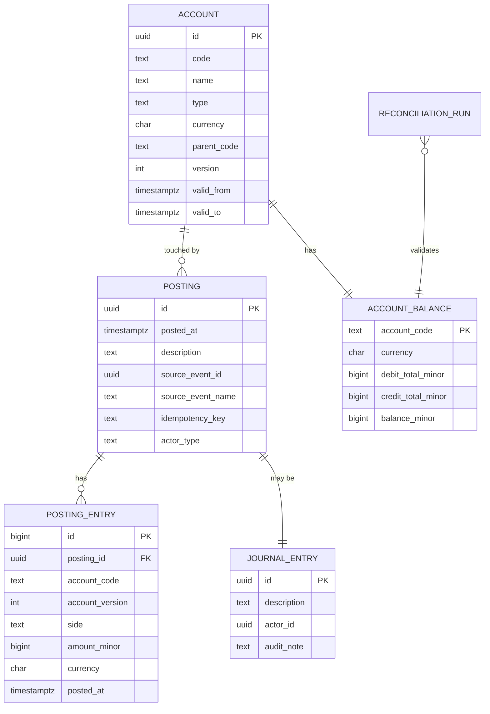

# ledger-service — Entity-Relationship Diagram

## 1. Database

- Engine: PostgreSQL 18.
- Schema: `ledger` (owned exclusively by this service).
- Migrations: `services/ledger-service/migrations/`.
- The chart of accounts is seeded by a migration.

## 2. Cross-Service References

| Column | Type | Refers to | Source of truth |
|--------|------|-----------|------------------|
| `source_event_id` | UUID | the upstream event that triggered the posting | various (payment, wallet, etc.) |
| `correlation_id` | UUID | request scope | gateway |

All cross-service references are stored as UUID columns **without**
database-level foreign keys. The ledger does not import other
services' foreign keys; it stores the `source_event_id` for
audit and replay.

## 3. Entities

### `Account` (Chart of Accounts, Versioned)

A single account in the chart of accounts. Each change is a new
version (insert-only). The current version is the one with
`valid_to IS NULL`.

#### Columns

| Column | Type | Constraints | Notes |
|--------|------|-------------|-------|
| `id` | UUID | PK | UUIDv7 |
| `code` | TEXT | NOT NULL | e.g. `1200`, `cash_eur`, `customer_receivable` |
| `name` | TEXT | NOT NULL | human-readable |
| `type` | TEXT | NOT NULL CHECK in (`asset`,`liability`,`equity`,`revenue`,`expense`) | |
| `currency` | CHAR(3) | NOT NULL | ISO 4217 |
| `parent_code` | TEXT | NULL REFERENCES account(code) | within-schema self-FK |
| `version` | INT | NOT NULL | monotonic per code |
| `valid_from` | TIMESTAMPTZ | NOT NULL | |
| `valid_to` | TIMESTAMPTZ | NULL | NULL = current |
| `created_at` | TIMESTAMPTZ | NOT NULL DEFAULT now() | |
| `created_by` | UUID | NOT NULL | finance admin |

#### Indexes

- PK on `id`.
- Unique on `(code, version)`.
- Partial unique on `(code) WHERE valid_to IS NULL` (one current
  version per code).
- Index on `parent_code`.
- Index on `type, currency`.

#### Constraints

- CHECK `type IN (...)` as above.
- CHECK `version > 0`.
- CHECK `valid_to IS NULL OR valid_to > valid_from`.

### `Posting` (Partitioned by Month)

The atomic unit of the ledger. Each posting has at least two
entries that together sum to zero (sum of debits = sum of
credits). Append-only.

#### Columns

| Column | Type | Constraints | Notes |
|--------|------|-------------|-------|
| `id` | UUID | PK | UUIDv7 |
| `posted_at` | TIMESTAMPTZ | NOT NULL | business time |
| `description` | TEXT | NOT NULL | human-readable |
| `source_event_id` | UUID | NOT NULL | the upstream event |
| `source_event_name` | TEXT | NOT NULL | e.g. `payment.captured.v1` |
| `correlation_id` | UUID | NOT NULL | |
| `tenant_id` | TEXT | NOT NULL DEFAULT 'global' | for multi-tenancy |
| `idempotency_key` | TEXT | NOT NULL | for dedup |
| `actor_type` | TEXT | NOT NULL CHECK in (`service`,`admin`,`system`) | |
| `actor_id` | UUID | NULL | admin id for manual entries |
| `audit_note` | TEXT | NULL | required for manual |
| `created_at` | TIMESTAMPTZ | NOT NULL DEFAULT now() | append-only |
| PRIMARY KEY (id, posted_at) | | | for partitioning |

#### Indexes

- PK on `(id, posted_at)`.
- Unique on `idempotency_key` (within the global namespace; or
  scoped by tenant_id).
- Index on `source_event_id` for audit lookup.
- Index on `correlation_id` for tracing.
- Index on `posted_at` for date-range queries.

### `PostingEntry` (Partitioned by Month)

The debit / credit lines of a posting. One posting has ≥ 2
entries; together they sum to zero in the posting's currency.

#### Columns

| Column | Type | Constraints | Notes |
|--------|------|-------------|-------|
| `id` | BIGSERIAL | PK | |
| `posting_id` | UUID | NOT NULL | FK within schema |
| `account_code` | TEXT | NOT NULL | |
| `account_version` | INT | NOT NULL | the version of the account at posting time |
| `side` | TEXT | NOT NULL CHECK in (`debit`,`credit`) | |
| `amount_minor` | BIGINT | NOT NULL | positive |
| `currency` | CHAR(3) | NOT NULL | matches the posting's currency |
| `posted_at` | TIMESTAMPTZ | NOT NULL | matches the posting's posted_at |
| `correlation_id` | UUID | NOT NULL | |
| `created_at` | TIMESTAMPTZ | NOT NULL DEFAULT now() | append-only |
| PRIMARY KEY (id, posted_at) | | | for partitioning |

#### Indexes

- PK on `(id, posted_at)`.
- Index on `posting_id, posted_at`.
- Index on `account_code, posted_at` for per-account queries.

#### Constraints

- CHECK `side IN (...)` as above.
- CHECK `amount_minor > 0`.

### `AccountBalance` (Materialised)

The current balance per (account_code, currency). Updated in the
same transaction as the posting that changes it.

#### Columns

| Column | Type | Constraints | Notes |
|--------|------|-------------|-------|
| `account_code` | TEXT | PK | |
| `currency` | CHAR(3) | NOT NULL | |
| `debit_total_minor` | BIGINT | NOT NULL DEFAULT 0 | sum of debits |
| `credit_total_minor` | BIGINT | NOT NULL DEFAULT 0 | sum of credits |
| `balance_minor` | BIGINT | NOT NULL | `debit - credit` (per account type's normal balance) |
| `last_posting_at` | TIMESTAMPTZ | NULL | |
| `updated_at` | TIMESTAMPTZ | NOT NULL DEFAULT now() | |

#### Constraints

- CHECK `debit_total_minor >= 0`.
- CHECK `credit_total_minor >= 0`.

### `JournalEntry` (Admin Manual Entries)

Manual journal entries. Each one is one or more postings; the
audit trail links them.

#### Columns

| Column | Type | Constraints | Notes |
|--------|------|-------------|-------|
| `id` | UUID | PK | UUIDv7 |
| `description` | TEXT | NOT NULL | |
| `actor_id` | UUID | NOT NULL | admin |
| `audit_note` | TEXT | NOT NULL | |
| `correlation_id` | UUID | NOT NULL | |
| `created_at` | TIMESTAMPTZ | NOT NULL DEFAULT now() | append-only |

#### Constraints

- CHECK `length(audit_note) >= 10`.

### `ReconciliationRun`

Daily reconciliation summary.

#### Columns

| Column | Type | Constraints | Notes |
|--------|------|-------------|-------|
| `id` | UUID | PK | UUIDv7 |
| `run_date` | DATE | UNIQUE NOT NULL | |
| `started_at` | TIMESTAMPTZ | NOT NULL | |
| `ended_at` | TIMESTAMPTZ | NULL | |
| `wallet_total` | BIGINT | NOT NULL | from ``payment-service` (wallet)` |
| `earnings_total` | BIGINT | NOT NULL | from ``payment-service` (courier earnings)` + ``payment-service` (driver earnings)` |
| `settlement_total` | BIGINT | NOT NULL | from ``payment-service` (merchant settlement)` |
| `ledger_total` | BIGINT | NOT NULL | sum from this service |
| `drift_minor` | BIGINT | NOT NULL | |
| `status` | TEXT | NOT NULL CHECK in (`running`,`matched`,`drift`,`error`) | |
| `details` | JSONB | NULL | per-account diffs |
| `correlation_id` | UUID | NOT NULL | |
| `created_at` | TIMESTAMPTZ | NOT NULL DEFAULT now() | |

### `Outbox` / `Inbox`

Standard platform outbox/inbox. The inbox carries the consumed
money-movement events; the outbox carries the emitted
`ledger.posted.v1`.

## 4. Mermaid ER Diagram



## 5. DDL Sketch

```sql
CREATE SCHEMA IF NOT EXISTS ledger;

CREATE TABLE ledger.accounts (
    id UUID PRIMARY KEY,
    code TEXT NOT NULL,
    name TEXT NOT NULL,
    type TEXT NOT NULL CHECK (type IN
        ('asset','liability','equity','revenue','expense')),
    currency CHAR(3) NOT NULL,
    parent_code TEXT REFERENCES ledger.accounts(code),
    version INT NOT NULL,
    valid_from TIMESTAMPTZ NOT NULL,
    valid_to TIMESTAMPTZ,
    created_at TIMESTAMPTZ NOT NULL DEFAULT now(),
    created_by UUID NOT NULL,
    CONSTRAINT accounts_version_chk CHECK (version > 0),
    CONSTRAINT accounts_valid_chk
        CHECK (valid_to IS NULL OR valid_to > valid_from)
);

CREATE UNIQUE INDEX accounts_code_version_uq
    ON ledger.accounts (code, version);
CREATE UNIQUE INDEX accounts_code_current_uq
    ON ledger.accounts (code) WHERE valid_to IS NULL;
CREATE INDEX accounts_parent_ix ON ledger.accounts (parent_code);
CREATE INDEX accounts_type_currency_ix
    ON ledger.accounts (type, currency);

CREATE TABLE ledger.postings (
    id UUID NOT NULL,
    posted_at TIMESTAMPTZ NOT NULL,
    description TEXT NOT NULL,
    source_event_id UUID NOT NULL,
    source_event_name TEXT NOT NULL,
    correlation_id UUID NOT NULL,
    tenant_id TEXT NOT NULL DEFAULT 'global',
    idempotency_key TEXT NOT NULL,
    actor_type TEXT NOT NULL CHECK (actor_type IN ('service','admin','system')),
    actor_id UUID,
    audit_note TEXT,
    created_at TIMESTAMPTZ NOT NULL DEFAULT now(),
    PRIMARY KEY (id, posted_at)
) PARTITION BY RANGE (posted_at);

CREATE TABLE IF NOT EXISTS ledger.postings_2026_07
    PARTITION OF ledger.postings
    FOR VALUES FROM ('2026-07-01 00:00:00+00') TO ('2026-08-01 00:00:00+00');

-- Verify the child is actually attached to the correct parent with
-- the expected bounds. IF NOT EXISTS only guards the name; it does
-- not verify bounds.
DO $$
DECLARE
    v_parent   REGCLASS := 'ledger.postings'::REGCLASS;
    v_child    REGCLASS := 'ledger.postings_2026_07'::REGCLASS;
    v_expected TSTZRANGE := tstzrange('2026-07-01 00:00:00+00',
                                      '2026-08-01 00:00:00+00',
                                      '[)');
BEGIN
    IF (SELECT inhparent FROM pg_inherits WHERE inhrelid = v_child)
       IS DISTINCT FROM v_parent THEN
        RAISE EXCEPTION 'partition % is not attached to %',
            v_child::text, v_parent::text;
    END IF;
    IF NOT (SELECT relpartbound FROM pg_class WHERE oid = v_child)
              = v_expected THEN
        RAISE EXCEPTION 'partition % has unexpected bounds', v_child::text;
    END IF;
END $$;

CREATE UNIQUE INDEX postings_idem_uq
    ON ledger.postings (idempotency_key);
CREATE INDEX postings_source_event_ix
    ON ledger.postings (source_event_id);
CREATE INDEX postings_correlation_ix
    ON ledger.postings (correlation_id);
CREATE INDEX postings_posted_at_ix
    ON ledger.postings (posted_at);

CREATE TABLE ledger.posting_entries (
    id BIGSERIAL,
    posting_id UUID NOT NULL,
    account_code TEXT NOT NULL,
    account_version INT NOT NULL,
    side TEXT NOT NULL CHECK (side IN ('debit','credit')),
    amount_minor BIGINT NOT NULL,
    currency CHAR(3) NOT NULL,
    posted_at TIMESTAMPTZ NOT NULL,
    correlation_id UUID NOT NULL,
    created_at TIMESTAMPTZ NOT NULL DEFAULT now(),
    PRIMARY KEY (id, posted_at)
) PARTITION BY RANGE (posted_at);

CREATE TABLE IF NOT EXISTS ledger.posting_entries_2026_07
    PARTITION OF ledger.posting_entries
    FOR VALUES FROM ('2026-07-01 00:00:00+00') TO ('2026-08-01 00:00:00+00');

CREATE INDEX pe_posting_time_ix
    ON ledger.posting_entries (posting_id, posted_at);
CREATE INDEX pe_account_time_ix
    ON ledger.posting_entries (account_code, posted_at);

CREATE TABLE ledger.account_balances (
    account_code TEXT PRIMARY KEY,
    currency CHAR(3) NOT NULL,
    debit_total_minor BIGINT NOT NULL DEFAULT 0,
    credit_total_minor BIGINT NOT NULL DEFAULT 0,
    balance_minor BIGINT NOT NULL,
    last_posting_at TIMESTAMPTZ,
    updated_at TIMESTAMPTZ NOT NULL DEFAULT now(),
    CONSTRAINT balances_nonneg_chk
        CHECK (debit_total_minor >= 0 AND credit_total_minor >= 0)
);

CREATE TABLE ledger.journal_entries (
    id UUID PRIMARY KEY,
    description TEXT NOT NULL,
    actor_id UUID NOT NULL,
    audit_note TEXT NOT NULL,
    correlation_id UUID NOT NULL,
    created_at TIMESTAMPTZ NOT NULL DEFAULT now(),
    CONSTRAINT je_audit_chk CHECK (length(audit_note) >= 10)
);

CREATE TABLE ledger.reconciliation_runs (
    id UUID PRIMARY KEY,
    run_date DATE UNIQUE NOT NULL,
    started_at TIMESTAMPTZ NOT NULL,
    ended_at TIMESTAMPTZ,
    wallet_total BIGINT NOT NULL,
    earnings_total BIGINT NOT NULL,
    settlement_total BIGINT NOT NULL,
    ledger_total BIGINT NOT NULL,
    drift_minor BIGINT NOT NULL,
    status TEXT NOT NULL CHECK (status IN
        ('running','matched','drift','error')),
    details JSONB,
    correlation_id UUID NOT NULL,
    created_at TIMESTAMPTZ NOT NULL DEFAULT now()
);

CREATE TABLE ledger.outbox (
    id BIGSERIAL PRIMARY KEY,
    event_id UUID UNIQUE NOT NULL,
    topic TEXT NOT NULL,
    partition_key UUID NOT NULL,
    payload JSONB NOT NULL,
    created_at TIMESTAMPTZ NOT NULL DEFAULT now(),
    claimed_at TIMESTAMPTZ,
    published_at TIMESTAMPTZ
);

CREATE TABLE ledger.inbox (
    event_id UUID PRIMARY KEY,
    topic TEXT NOT NULL,
    received_at TIMESTAMPTZ NOT NULL DEFAULT now(),
    processed_at TIMESTAMPTZ,
    error TEXT
);
```

## 6. Audit Columns

Every mutable table has `created_at`. The `accounts` table is
versioned (insert-only per code); the `postings` and
`posting_entries` tables are append-only.

## 7. Soft Delete

Not used. The chart of accounts is versioned; old versions are
kept (with `valid_to` set). The postings table is append-only.

## 8. JSONB Usage

- `reconciliation_runs.details` — per-account diffs.
- `outbox.payload` — event envelope.

## 9. Partitioning

- `postings` and `posting_entries` are range-partitioned by
  month on `posted_at`.
- Pre-create partitions for the next 12 months.
- Drop partitions older than 10 years (regulatory).

See [`DATABASE_ARCHITECTURE.md` "Table Partitioning — Canonical Template"](../../architecture/DATABASE_ARCHITECTURE.md) for the idempotent `CREATE TABLE IF NOT EXISTS … PARTITION OF …` pattern, naming convention, and the service-owned maintenance-job contract (advisory lock, verification, retention/mixed-retention handling).

## 10. Data Retention

| Table | Retention | Purged by |
|-------|-----------|-----------|
| `accounts` | forever (versioned) | n/a |
| `postings` | 10 years (regulatory) | partition drop |
| `posting_entries` | 10 years (regulatory) | partition drop |
| `account_balances` | forever (rebuilt) | n/a |
| `journal_entries` | 10 years | partition drop (if partitioned; else nightly batch) |
| `reconciliation_runs` | 10 years | nightly batch |
| `outbox` | 24h after `published_at` | poller |
| `inbox` | 30 days (TTL) | nightly batch |

## 11. Migration Considerations

- The `postings` and `posting_entries` tables are append-only by
  convention; enforced by revoking UPDATE/DELETE on the
  application role.
- Adding a new `type` value requires a CHECK update and a
  chart-of-accounts migration.
- The `accounts` table is versioned; account changes are new rows
  (with `version++`).
- Partition pre-creation is a separate scheduled job; the job
  is owned by this service.
- The `trial_balance` invariant is enforced by a database
  trigger (or by the application) at the end of every posting.

---

## See also

### Sibling docs for this service

- [`README.md`](./README.md) — purpose, bounded context, responsibilities
- [`BRD.md`](./BRD.md) — business requirements
- [`SRS.md`](./SRS.md) — functional + non-functional requirements
- [`ERD.md`](./ERD.md) — data model (entities, relationships)
- [`INTEGRATION.md`](./INTEGRATION.md) — inter-service contracts (APIs, events, sagas)
- [`WORKFLOWS.md`](./WORKFLOWS.md) — operational workflows (happy paths, failure modes)
- [`TECH.md`](./TECH.md) — technology profile (runtime, libraries, data layer, admin endpoints, RBAC)

### Platform-wide

- [`../../shared/README.md`](../../shared/README.md) — `platform-spring-boot-starter` shared library (the single source of cross-cutting code for all Spring Boot services in the platform)
- [`../RECOMMENDATIONS.md`](../RECOMMENDATIONS.md) — platform-wide technology map (language, framework, version baseline, admin/RBAC pattern)
- [`../../README.md`](../../README.md) — services overview (the catalog of all 20 services)
- [`../../../main.md`](../../../main.md) — top-level platform specification (architecture, Keycloak, PostgreSQL 18, messaging, observability baseline)

