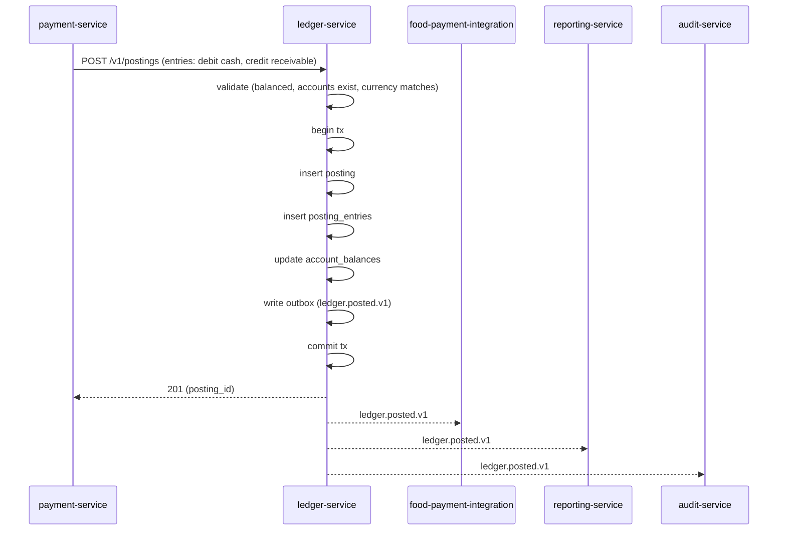
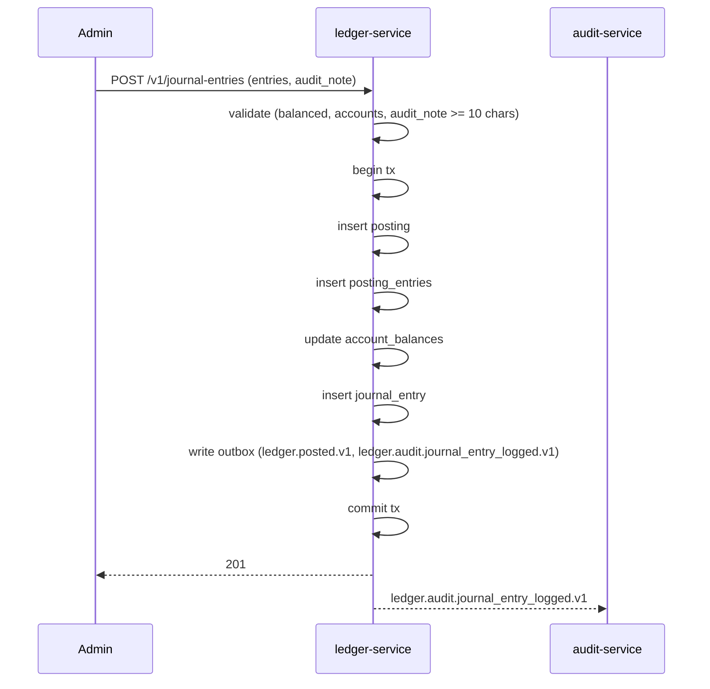
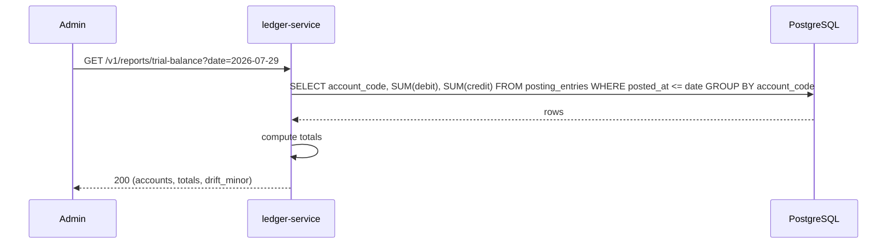
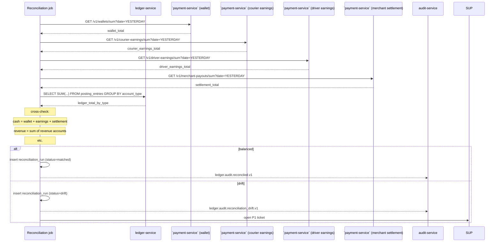
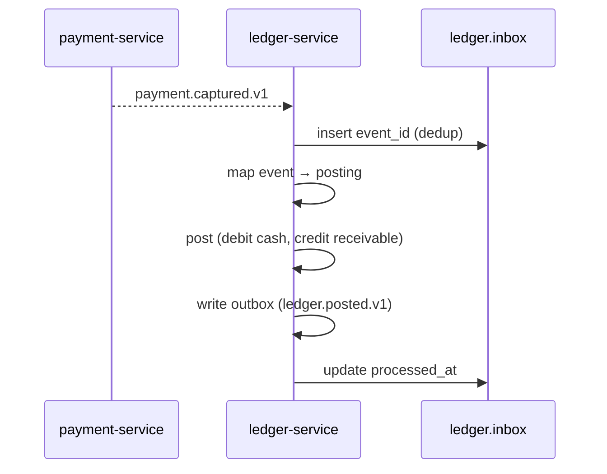
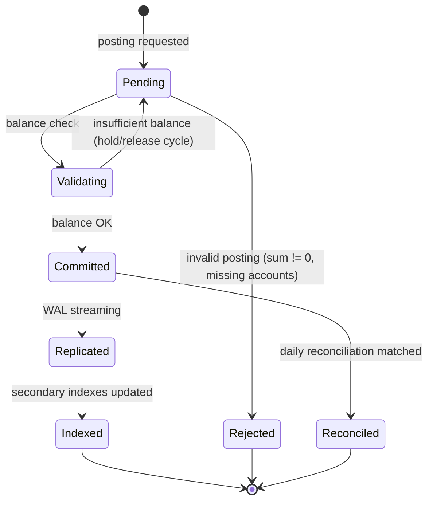

# ledger-service — Workflows

## 1. `Post a Payment Capture` (Happy Path)

### 1.1 Objective

Record the double-entry for a payment capture: debit the cash
account, credit the customer receivable account.

### 1.2 Initiating Actor

`payment-service` (system actor) calls `POST /v1/postings` after
a successful capture.

### 1.3 Participating Services

- `payment-service` (producer)
- `ledger-service` (this service)
- ``payment-service` (food saga)` (consumer of
  `ledger.posted.v1` for reconciliation)
- `reporting-service` (consumer)
- `audit-service` (consumer)

### 1.4 Prerequisites

- The accounts `1100_cash_eur` and `2100_customer_receivable`
  exist in the chart of accounts.

### 1.5 Happy Path



### 1.6 Alternate Paths

- **Async propagation**: `payment.captured.v1` is consumed; the
  same posting is created from the consumer.

### 1.7 Failure Paths

- **Unbalanced posting**: 422 `UNBALANCED_POSTING`; the producer
  must correct the call.
- **Account not found**: 422 `ACCOUNT_NOT_FOUND`; finance
  investigates (likely a missing chart-of-accounts seed).
- **Currency mismatch**: 422 `CURRENCY_MISMATCH`.
- **Outbox publish fails**: retried; after exhaustion → DLQ.

### 1.8 Business Rules

- Sum of debits = sum of credits per posting.
- All entries in a posting share the same currency.
- The posting is append-only.

### 1.9 State Transitions

`Posting` rows are terminal on insert; no transitions.

### 1.10 Events

| Event | Direction | When |
|-------|-----------|------|
| `ledger.posted.v1` | produced | on commit |
| `payment.captured.v1` | consumed (alternative) | on async propagation |

### 1.11 APIs Involved

| API | Direction | When |
|-----|-----------|------|
| `POST /v1/postings` | inbound | from payment-service |

### 1.12 Compensation / Rollback

- A correction is a new posting (a manual journal entry).

### 1.13 Final State

- `postings` and `posting_entries` rows present.
- `account_balances` updated.
- `ledger.posted.v1` emitted.

## 2. `Manual Journal Entry` (Admin)

### 2.1 Objective

Allow a finance / audit admin to post a manual correction.

### 2.2 Initiating Actor

A finance / audit admin via the admin console.

### 2.3 Participating Services

- `admin-service`
- `ledger-service` (this service)
- `audit-service` (consumer)

### 2.4 Prerequisites

- The admin has the `ledger.admin` role.
- The accounts exist.

### 2.5 Happy Path



### 2.6 Alternate Paths

N/A.

### 2.7 Failure Paths

- **Audit note too short**: 422 `AUDIT_NOTE_REQUIRED`.
- **Unbalanced**: 422.

### 2.8 Business Rules

- `audit_note` ≥ 10 characters.
- The actor is recorded.

### 2.9 State Transitions

N/A.

### 2.10 Events

| Event | Direction | When |
|-------|-----------|------|
| `ledger.posted.v1` | produced | on commit |
| `ledger.audit.journal_entry_logged.v1` | produced | on commit |

### 2.11 APIs Involved

| API | Direction | When |
|-----|-----------|------|
| `POST /v1/journal-entries` | inbound | admin |

### 2.12 Compensation / Rollback

- A manual entry can be reversed by another manual entry.

### 2.13 Final State

- `postings`, `posting_entries`, `journal_entries` rows present.
- `account_balances` updated.

## 3. `Trial Balance Report`

### 3.1 Objective

Generate the trial balance as of a date.

### 3.2 Initiating Actor

A finance / audit admin via the admin console (or a scheduled
report).

### 3.3 Participating Services

- `ledger-service` (this service)

### 3.4 Prerequisites

- The chart of accounts is loaded.
- All postings up to the date are committed.

### 3.5 Happy Path



### 3.6 Alternate Paths

- **Date in the future**: returns an empty result with
  `drift_minor = 0`.

### 3.7 Failure Paths

- **Database slow**: the report times out; the admin retries
  with a smaller range.

### 3.8 Business Rules

- The trial balance MUST show `drift_minor = 0` (the sum of
  debits = the sum of credits).
- The report is computed from the postings table (no
  cached state).

### 3.9 State Transitions

N/A.

### 3.10 Events

None.

### 3.11 APIs Involved

| API | Direction | When |
|-----|-----------|------|
| `GET /v1/reports/trial-balance` | inbound | admin |

### 3.12 Compensation / Rollback

N/A.

### 3.13 Final State

- Report returned.
- If `drift_minor > 0`, a P1 ticket is open (separate workflow).

## 4. `Daily Reconciliation`

### 4.1 Objective

Compare the operational layers' totals against the ledger; report
drift.

### 4.2 Initiating Actor

A scheduled job at 04:00 UTC daily.

### 4.3 Participating Services

- `ledger-service` (this service)
- ``payment-service` (wallet)` (provides wallet total)
- ``payment-service` (courier earnings)` (provides earnings total)
- ``payment-service` (driver earnings)` (provides earnings total)
- ``payment-service` (merchant settlement)` (provides settlement total)

### 4.4 Prerequisites

- All postings up to YESTERDAY are committed.

### 4.5 Happy Path (No Drift)



### 4.6 Alternate Paths

- **One operational layer is down**: the run is `error`;
  retried after 1h.

### 4.7 Failure Paths

- **Drift persists > 1 day**: severity escalates; finance is
  looped in.

### 4.8 Business Rules

- The reconciliation runs at most once per day.
- Drift is computed per account type; details are stored in
  `reconciliation_runs.details`.

### 4.9 State Transitions

Reconciliation runs: `running → matched | drift | error`.

### 4.10 Events

| Event | Direction | When |
|-------|-----------|------|
| `ledger.audit.reconciled.v1` | produced | on match |
| `ledger.audit.reconciliation_drift.v1` | produced | on drift |

### 4.11 APIs Involved

| API | Direction | When |
|-----|-----------|------|
| `GET /v1/wallets/sum` | outbound | to `payment-service` (wallet) |
| `GET /v1/courier-earnings/sum` | outbound | to `payment-service` (courier earnings) |
| `GET /v1/driver-earnings/sum` | outbound | to `payment-service` (driver earnings) |
| `GET /v1/merchant-payouts/sum` | outbound | to `payment-service` (merchant settlement) |

### 4.12 Compensation / Rollback

- A drift is repaired by a manual journal entry (see §2).

### 4.13 Final State

- A `reconciliation_runs` row present.
- If drift: a P1 ticket is open.

## 5. `Async Postings from Money-Movement Events`

### 5.1 Objective

Provide an alternative to the synchronous `POST /v1/postings`:
consume money-movement events and post the corresponding
double-entry.

### 5.2 Initiating Actor

`payment-service`, ``payment-service` (wallet)`, ``payment-service` (merchant settlement)`,
``payment-service` (courier earnings)`, ``payment-service` (driver earnings)` emit
events; the ledger consumes them.

### 5.3 Participating Services

- Producer (varies)
- `ledger-service` (this service)
- Downstream consumers (e.g. ``payment-service` (food saga)`
  for reconciliation)

### 5.4 Prerequisites

- The relevant accounts exist in the chart of accounts.
- The `inbox` dedup's on `event_id`.

### 5.5 Happy Path



### 5.6 Alternate Paths

- **Idempotent**: the `inbox` dedup ensures the same event is
  not posted twice.

### 5.7 Failure Paths

- **Mapping missing**: the event is left in the inbox with
  `processed_at=NULL`; a P3 ticket is opened; the
  service team adds the mapping.
- **Account not found**: 422; the event is sent to the DLQ.

### 5.8 Business Rules

- The mapping from event to posting is owned by this service.
- A new event type requires a code change in the consumer.

### 5.9 State Transitions

N/A.

### 5.10 Events

Various; see `EVENT_ARCHITECTURE.md`.

### 5.11 APIs Involved

None direct (consumer-only).

### 5.12 Compensation / Rollback

- A failed event is retried; on exhaustion → DLQ.

### 5.13 Final State

- A `postings` row present.
- The inbox row has `processed_at` set.
- `ledger.posted.v1` emitted.


## 99. Posting Lifecycle State Machine

This state machine summarizes the service's internal
state transitions (across all workflows above).



## 99. `Monthly` Partition Maintenance`

### 99.1 Objective

Idempotently pre-create the next 12 month child partitions for `ledger.postings` + `ledger.posting_entries` so an INSERT at any time lands in an existing child. The drop half is handled by the per-service retention job.

### 99.2 Initiating Actor

A scheduled job runs daily at `02:00 UTC`. Leader-elected via `pg_try_advisory_xact_lock(hashtext('ledger.partition'), hashtext('monthly'))`.

### 99.3 Happy Path

```mermaid
sequenceDiagram
    participant JOB as Partition job
    participant PG as PostgreSQL
    JOB->>PG: pg_try_advisory_xact_lock('ledger.monthly')
    alt lock acquired
        loop for each missing month in next 12
            JOB->>PG: CREATE TABLE IF NOT EXISTS ledger.table_month PARTITION OF ledger.table
            JOB->>PG: verify (pg_inherits, relpartbound)
        end
        JOB->>PG: assert now() in existing child
    else lock NOT acquired
        Note over JOB: another instance is running; exit cleanly
    end
```

### 99.4 Failure Paths

| Failure | Handling |
|---------|----------|
| Lock contention | exit 0 |
| DDL fails | retry 3× with backoff (1 s / 4 s / 16 s); page on-call |
| Today's child missing | critical alert; INSERTs would fail |

### 99.5 Business Rules

- Pre-create 12 complete future months.
- Every child is created with `CREATE TABLE IF NOT EXISTS … PARTITION OF …` so the job is safe to run twice in the same window.
- A verification step (`pg_inherits` parent + `relpartbound` range) runs after every `CREATE TABLE IF NOT EXISTS` because `IF NOT EXISTS` only guards the name, not the bounds.
- Optionally emit `audit.partition.maintained.v1` on success.

---

## See also

### Sibling docs for this service

- [`README.md`](./README.md) — purpose, bounded context, responsibilities
- [`BRD.md`](./BRD.md) — business requirements
- [`SRS.md`](./SRS.md) — functional + non-functional requirements
- [`ERD.md`](./ERD.md) — data model (entities, relationships)
- [`INTEGRATION.md`](./INTEGRATION.md) — inter-service contracts (APIs, events, sagas)
- [`WORKFLOWS.md`](./WORKFLOWS.md) — operational workflows (happy paths, failure modes)
- [`TECH.md`](./TECH.md) — technology profile (runtime, libraries, data layer, admin endpoints, RBAC)

### Platform-wide

- [`../../shared/README.md`](../../shared/README.md) — `platform-spring-boot-starter` shared library (the single source of cross-cutting code for all Spring Boot services in the platform)
- [`../RECOMMENDATIONS.md`](../RECOMMENDATIONS.md) — platform-wide technology map (language, framework, version baseline, admin/RBAC pattern)
- [`../../README.md`](../../README.md) — services overview (the catalog of all 58 services)
- [`../../../main.md`](../../../main.md) — top-level platform specification (architecture, Keycloak, PostgreSQL 18, messaging, observability baseline)

