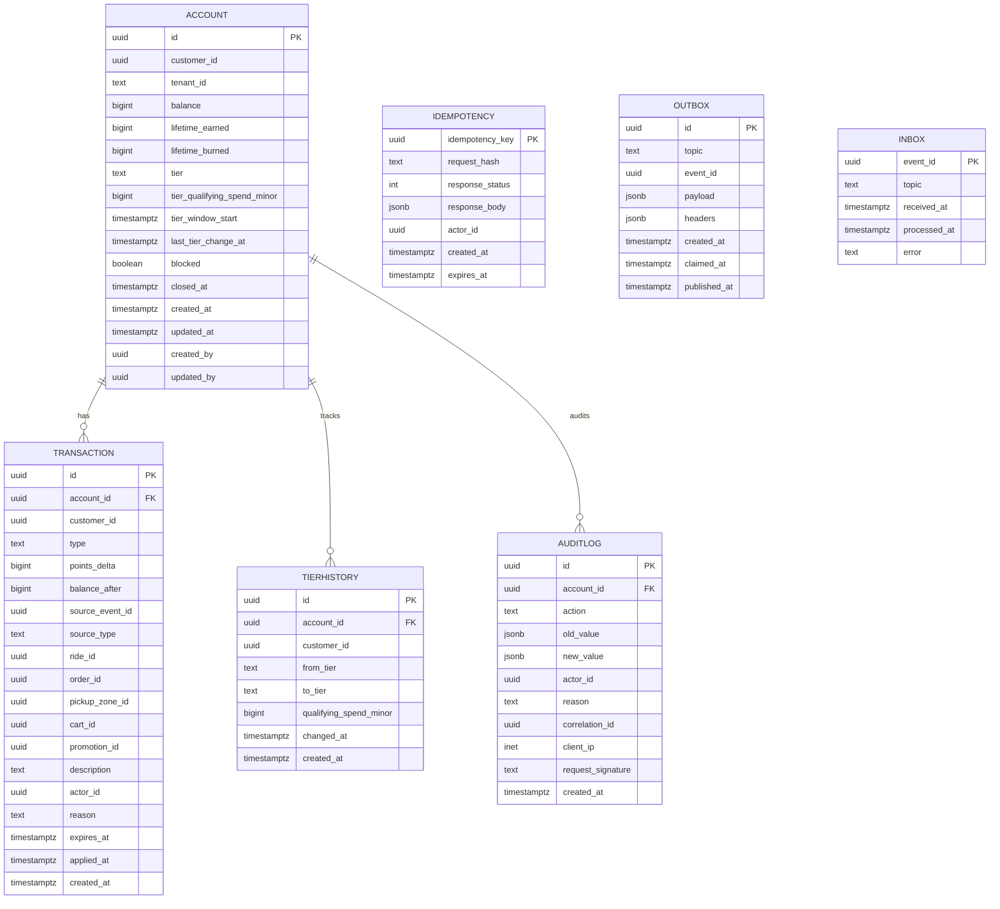

# Loyalty Service — Entity-Relationship Diagram

## 1. Database

- Engine: PostgreSQL 18
- Schema: `loyalty` (owned exclusively by this service)
- Migrations: `services/loyalty-service/migrations/`

## 2. Cross-Service References

| Column | Type | Refers to | Source of truth |
|--------|------|-----------|------------------|
| `account.customer_id` | UUID | `Customer.id` | `customer-service` |
| `transaction.source_event_id` | UUID | event id from another service | n/a |
| `transaction.ride_id` | UUID | `Trip.id` | `trip-service` |
| `transaction.order_id` | UUID | `FoodOrder.id` | `food-order-service` |

No DB FKs.

## 3. Entities

### `Account`

The loyalty account of a customer (one per customer).

#### Columns

| Column | Type | Constraints | Notes |
|--------|------|-------------|-------|
| `id` | UUID | PK | UUIDv7 |
| `customer_id` | UUID | NOT NULL, UNIQUE | |
| `tenant_id` | TEXT | NOT NULL DEFAULT 'global' | |
| `balance` | BIGINT | NOT NULL DEFAULT 0 | current points |
| `lifetime_earned` | BIGINT | NOT NULL DEFAULT 0 | |
| `lifetime_burned` | BIGINT | NOT NULL DEFAULT 0 | |
| `tier` | TEXT | NOT NULL DEFAULT 'bronze' | `bronze`/`silver`/`gold`/`platinum` |
| `tier_qualifying_spend_minor` | BIGINT | NOT NULL DEFAULT 0 | in window |
| `tier_window_start` | TIMESTAMPTZ | NULL | |
| `last_tier_change_at` | TIMESTAMPTZ | NULL | |
| `blocked` | BOOLEAN | NOT NULL DEFAULT false | true if customer suspended |
| `closed_at` | TIMESTAMPTZ | NULL | on tenant offboarding |
| `created_at` | TIMESTAMPTZ | NOT NULL DEFAULT now() | |
| `updated_at` | TIMESTAMPTZ | NOT NULL DEFAULT now() | |
| `created_by` | UUID | NOT NULL | |
| `updated_by` | UUID | NOT NULL | |

#### Indexes

- PK on `id`
- UNIQUE on `customer_id`
- Index on `tier`

#### Constraints

- CHECK: `balance >= 0`
- CHECK: `tier IN ('bronze','silver','gold','platinum')`

### `Transaction`

Earn / burn / adjust / expire row. Append-only.

#### Columns

| Column | Type | Constraints | Notes |
|--------|------|-------------|-------|
| `id` | UUID | PK | UUIDv7 |
| `account_id` | UUID | NOT NULL | |
| `customer_id` | UUID | NOT NULL | |
| `type` | TEXT | NOT NULL | `earn`/`burn`/`adjust`/`expire` |
| `points_delta` | BIGINT | NOT NULL | positive for earn, negative for burn |
| `balance_after` | BIGINT | NOT NULL | |
| `source_event_id` | UUID | NULL | idempotency key |
| `source_type` | TEXT | NULL | `trip`/`order`/`manual`/`expiry` |
| `ride_id` | UUID | NULL | |
| `order_id` | UUID | NULL | |
| `pickup_zone_id` | UUID | NULL | cross-service ref to `zone-service`; backfilled from `trip-service` for trip-source rows |
| `cart_id` | UUID | NULL | burn target |
| `promotion_id` | UUID | NULL | burn target (rare) |
| `description` | TEXT | NULL | |
| `actor_id` | UUID | NULL | admin for adjust |
| `reason` | TEXT | NULL | |
| `expires_at` | TIMESTAMPTZ | NULL | when this batch expires |
| `applied_at` | TIMESTAMPTZ | NOT NULL DEFAULT now() | |
| `created_at` | TIMESTAMPTZ | NOT NULL DEFAULT now() | partition key |

#### Indexes

- PK on `id`
- UNIQUE on `(customer_id, source_event_id) WHERE source_event_id IS NOT NULL`
- Index on `(account_id, applied_at DESC)`
- Index on `(customer_id, applied_at DESC)`
- Index on `expires_at` (expiry job)
- Index on `ride_id`
- Index on `order_id`

#### Constraints

- CHECK: `type IN ('earn','burn','adjust','expire')`
- CHECK: `points_delta <> 0`
- CHECK: `balance_after >= 0`

### `TierHistory`

Append-only history of tier changes.

#### Columns

| Column | Type | Constraints | Notes |
|--------|------|-------------|-------|
| `id` | UUID | PK | UUIDv7 |
| `account_id` | UUID | NOT NULL | |
| `customer_id` | UUID | NOT NULL | |
| `from_tier` | TEXT | NOT NULL | |
| `to_tier` | TEXT | NOT NULL | |
| `qualifying_spend_minor` | BIGINT | NOT NULL | |
| `changed_at` | TIMESTAMPTZ | NOT NULL DEFAULT now() | |
| `created_at` | TIMESTAMPTZ | NOT NULL DEFAULT now() | partition key |

#### Indexes

- PK on `id`
- Index on `(account_id, changed_at DESC)`
- Index on `customer_id`

#### Constraints

- CHECK: `from_tier <> to_tier`
- CHECK: `to_tier IN ('bronze','silver','gold','platinum')`

### `AuditLog`

Immutable audit log.

#### Columns

| Column | Type | Constraints | Notes |
|--------|------|-------------|-------|
| `id` | UUID | PK | UUIDv7 |
| `account_id` | UUID | NULL | |
| `action` | TEXT | NOT NULL | create/earn/burn/adjust/expire/tier_change/block/unblock |
| `old_value` | JSONB | NULL | |
| `new_value` | JSONB | NULL | |
| `actor_id` | UUID | NOT NULL | |
| `reason` | TEXT | NOT NULL | |
| `correlation_id` | UUID | NOT NULL | |
| `client_ip` | INET | NULL | |
| `request_signature` | TEXT | NULL | |
| `created_at` | TIMESTAMPTZ | NOT NULL DEFAULT now() | partition key |

#### Constraints

- CHECK: `action IN ('create','earn','burn','adjust','expire','tier_change','block','unblock')`
- **No UPDATE / DELETE on this table**.

### `Idempotency`

Same shape as `configuration.idempotency`.

### `Outbox`

Same shape as `configuration.outbox`.

### `Inbox`

Same shape as `configuration.inbox`.

## 4. Mermaid ER Diagram



## 5. DDL Sketch

```sql
CREATE SCHEMA IF NOT EXISTS loyalty;

CREATE TABLE loyalty.accounts (
    id UUID PRIMARY KEY,
    customer_id UUID NOT NULL UNIQUE,
    tenant_id TEXT NOT NULL DEFAULT 'global',
    balance BIGINT NOT NULL DEFAULT 0 CHECK (balance >= 0),
    lifetime_earned BIGINT NOT NULL DEFAULT 0,
    lifetime_burned BIGINT NOT NULL DEFAULT 0,
    tier TEXT NOT NULL DEFAULT 'bronze'
        CHECK (tier IN ('bronze','silver','gold','platinum')),
    tier_qualifying_spend_minor BIGINT NOT NULL DEFAULT 0,
    tier_window_start TIMESTAMPTZ,
    last_tier_change_at TIMESTAMPTZ,
    blocked BOOLEAN NOT NULL DEFAULT false,
    closed_at TIMESTAMPTZ,
    created_at TIMESTAMPTZ NOT NULL DEFAULT now(),
    updated_at TIMESTAMPTZ NOT NULL DEFAULT now(),
    created_by UUID NOT NULL,
    updated_by UUID NOT NULL
);

CREATE INDEX idx_accounts_tier ON loyalty.accounts (tier);

CREATE TABLE loyalty.transactions (
    id UUID NOT NULL,
    account_id UUID NOT NULL,
    customer_id UUID NOT NULL,
    type TEXT NOT NULL
        CHECK (type IN ('earn','burn','adjust','expire')),
    points_delta BIGINT NOT NULL CHECK (points_delta <> 0),
    balance_after BIGINT NOT NULL CHECK (balance_after >= 0),
    source_event_id UUID,
    source_type TEXT,
    ride_id UUID,
    order_id UUID,
    pickup_zone_id UUID,
    cart_id UUID,
    promotion_id UUID,
    description TEXT,
    actor_id UUID,
    reason TEXT,
    expires_at TIMESTAMPTZ,
    applied_at TIMESTAMPTZ NOT NULL DEFAULT now(),
    created_at TIMESTAMPTZ NOT NULL DEFAULT now(),
    PRIMARY KEY (id, created_at)
) PARTITION BY RANGE (created_at);

CREATE UNIQUE INDEX idx_transactions_source
    ON loyalty.transactions (customer_id, source_event_id)
    WHERE source_event_id IS NOT NULL;
CREATE INDEX idx_transactions_account
    ON loyalty.transactions (account_id, applied_at DESC);
CREATE INDEX idx_transactions_customer
    ON loyalty.transactions (customer_id, applied_at DESC);
CREATE INDEX idx_transactions_expires
    ON loyalty.transactions (expires_at);
CREATE INDEX idx_transactions_ride
    ON loyalty.transactions (ride_id);
CREATE INDEX idx_transactions_order
    ON loyalty.transactions (order_id);

CREATE TABLE IF NOT EXISTS loyalty.transactions_2026_07
    PARTITION OF loyalty.transactions
    FOR VALUES FROM ('2026-07-01 00:00:00+00') TO ('2026-08-01 00:00:00+00');

-- Verify the child is actually attached to the correct parent with
-- the expected bounds. IF NOT EXISTS only guards the name; it does
-- not verify bounds.
DO $$
DECLARE
    v_parent   REGCLASS := 'loyalty.transactions'::REGCLASS;
    v_child    REGCLASS := 'loyalty.transactions_2026_07'::REGCLASS;
    v_expected TSTZRANGE := tstzrange('2026-07-01 00:00:00+00',
                                      '2026-08-01 00:00:00+00',
                                      '[)');
BEGIN
    IF (SELECT inhparent FROM pg_inherits WHERE inhrelid = v_child)
       IS DISTINCT FROM v_parent THEN
        RAISE EXCEPTION 'partition % is not attached to %',
            v_child::text, v_parent::text;
    END IF;
    IF NOT (SELECT relpartbound FROM pg_class WHERE oid = v_child)
              = v_expected THEN
        RAISE EXCEPTION 'partition % has unexpected bounds', v_child::text;
    END IF;
END $$;

CREATE TABLE loyalty.tier_history (
    id UUID NOT NULL,
    account_id UUID NOT NULL,
    customer_id UUID NOT NULL,
    from_tier TEXT NOT NULL,
    to_tier TEXT NOT NULL
        CHECK (to_tier IN ('bronze','silver','gold','platinum')),
    qualifying_spend_minor BIGINT NOT NULL,
    changed_at TIMESTAMPTZ NOT NULL DEFAULT now(),
    created_at TIMESTAMPTZ NOT NULL DEFAULT now(),
    PRIMARY KEY (id, created_at)
) PARTITION BY RANGE (created_at);
CREATE INDEX idx_tier_history_account
    ON loyalty.tier_history (account_id, changed_at DESC);
CREATE INDEX idx_tier_history_customer
    ON loyalty.tier_history (customer_id);

CREATE TABLE loyalty.audit_log (
    id UUID NOT NULL,
    account_id UUID,
    action TEXT NOT NULL
        CHECK (action IN ('create','earn','burn','adjust','expire',
                          'tier_change','block','unblock')),
    old_value JSONB,
    new_value JSONB,
    actor_id UUID NOT NULL,
    reason TEXT NOT NULL,
    correlation_id UUID NOT NULL,
    client_ip INET,
    request_signature TEXT,
    created_at TIMESTAMPTZ NOT NULL DEFAULT now(),
    PRIMARY KEY (id, created_at)
) PARTITION BY RANGE (created_at);
REVOKE UPDATE, DELETE ON loyalty.audit_log FROM loyalty_app;

CREATE TABLE IF NOT EXISTS loyalty.tier_history_2026_07
    PARTITION OF loyalty.tier_history
    FOR VALUES FROM ('2026-07-01 00:00:00+00') TO ('2026-08-01 00:00:00+00');

CREATE TABLE IF NOT EXISTS loyalty.audit_log_2026_07
    PARTITION OF loyalty.audit_log
    FOR VALUES FROM ('2026-07-01 00:00:00+00') TO ('2026-08-01 00:00:00+00');

CREATE TABLE loyalty.idempotency (
    idempotency_key UUID PRIMARY KEY,
    request_hash TEXT NOT NULL,
    response_status INT NOT NULL,
    response_body JSONB NOT NULL,
    actor_id UUID NOT NULL,
    created_at TIMESTAMPTZ NOT NULL DEFAULT now(),
    expires_at TIMESTAMPTZ NOT NULL
);

CREATE TABLE loyalty.outbox (
    id UUID PRIMARY KEY,
    topic TEXT NOT NULL,
    event_id UUID NOT NULL,
    payload JSONB NOT NULL,
    headers JSONB,
    created_at TIMESTAMPTZ NOT NULL DEFAULT now(),
    claimed_at TIMESTAMPTZ,
    published_at TIMESTAMPTZ
);

CREATE TABLE loyalty.inbox (
    event_id UUID PRIMARY KEY,
    topic TEXT NOT NULL,
    received_at TIMESTAMPTZ NOT NULL DEFAULT now(),
    processed_at TIMESTAMPTZ,
    error TEXT
);
```

## 6. Audit Columns

Every mutable table has `created_at`, `updated_at`, `created_by`,
`updated_by`. `transactions`, `tier_history`, `audit_log` are
append-only.

## 7. Soft Delete

`accounts.closed_at` is the soft-delete flag (on tenant
offboarding). Closed accounts return 410 on read.

## 8. JSONB Usage

| Table.Column | What is stored | Justification |
|--------------|----------------|---------------|
| `audit_log.old_value` / `new_value` | pre/post image | diff display |
| `outbox.payload` | event payload | per topic |
| `outbox.headers` | Kafka headers | trace context |

## 9. Partitioning

- `transactions` partitioned by month.
- `tier_history` partitioned by month.
- `audit_log` partitioned by month.

See [`DATABASE_ARCHITECTURE.md` §"Table Partitioning — Canonical Template"](../../architecture/DATABASE_ARCHITECTURE.md) for the idempotent `CREATE TABLE IF NOT EXISTS … PARTITION OF …` pattern, naming convention, and the service-owned maintenance-job contract (advisory lock, verification, retention/mixed-retention handling).

## 10. Data Retention

| Table | Retention | Purged by |
|-------|-----------|-----------|
| `accounts` | indefinitely (closed) | n/a |
| `transactions` | 7 years | monthly archival job |
| `tier_history` | 7 years | monthly archival job |
| `audit_log` | 7 years | monthly archival job |
| `idempotency` | 72 hours | daily purge job |
| `outbox` | 24 hours after `published_at` | hourly purge job |
| `inbox` | 7 days | daily purge job |

## 11. Migration Considerations

- Adding a new tier is a `CHECK` constraint update + a one-time
  enum broadcast; no data migration.
- A tier-rule change is in `configuration-service`; no schema
  change needed.
- The `audit_log` append-only constraint is enforced at the database
  grant level.

---

## See also

### Sibling docs for this service

- [`README.md`](./README.md) — purpose, bounded context, responsibilities
- [`BRD.md`](./BRD.md) — business requirements
- [`SRS.md`](./SRS.md) — functional + non-functional requirements
- [`ERD.md`](./ERD.md) — data model (entities, relationships)
- [`INTEGRATION.md`](./INTEGRATION.md) — inter-service contracts (APIs, events, sagas)
- [`WORKFLOWS.md`](./WORKFLOWS.md) — operational workflows (happy paths, failure modes)
- [`TECH.md`](./TECH.md) — technology profile (runtime, libraries, data layer, admin endpoints, RBAC)

### Platform-wide

- [`../../shared/README.md`](../../shared/README.md) — `platform-spring-boot-starter` shared library (the single source of cross-cutting code for all Spring Boot services in the platform)
- [`../RECOMMENDATIONS.md`](../RECOMMENDATIONS.md) — platform-wide technology map (language, framework, version baseline, admin/RBAC pattern)
- [`../../README.md`](../../README.md) — services overview (the catalog of all 58 services)
- [`../../../main.md`](../../../main.md) — top-level platform specification (architecture, Keycloak, PostgreSQL 18, messaging, observability baseline)

