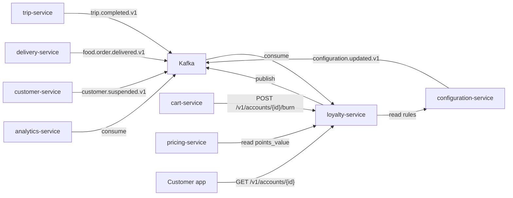
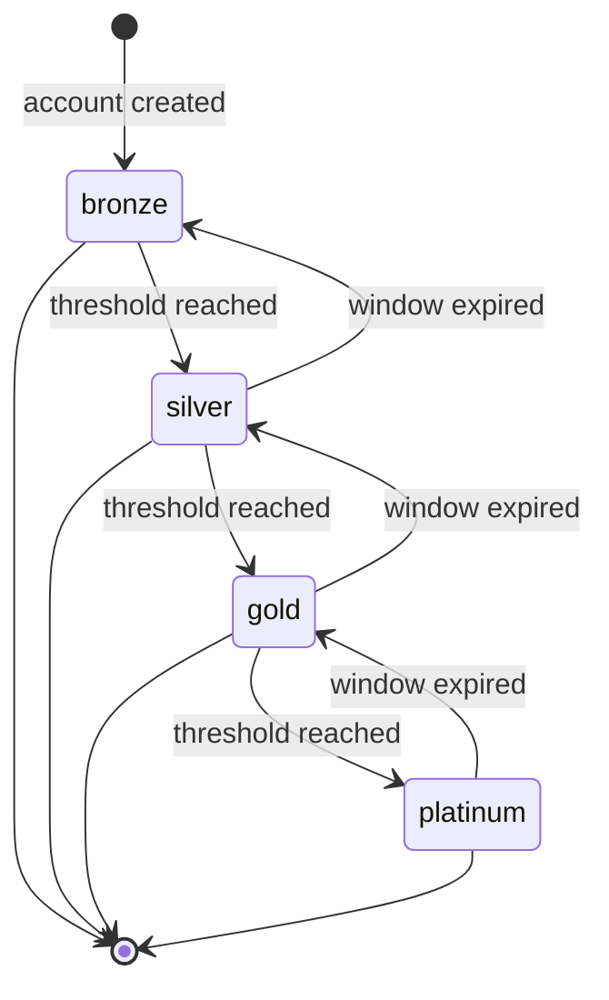

# Loyalty Service — Software Requirements Specification

## 1. Introduction

This SRS specifies the behavior, performance, and operational
requirements of `loyalty-service`. It inherits the platform-wide
standards in `docs/architecture/API_STANDARDS.md`,
`docs/architecture/EVENT_ARCHITECTURE.md`, and
`docs/architecture/SECURITY_ARCHITECTURE.md`.

## 2. Scope

In scope:

- Points balance and tier.
- Earn / burn rules and statement.
- Manual adjust.
- Event publication.

Out of scope:

- Customer profile (owned by `customer-service`).
- Wallet / payment (owned by `wallet-service`).
- Promotion (owned by `promotion-service`).

## 3. System Context

## 4. Actors

- Customer (human).
- `trip-service` (system).
- `delivery-service` (system).
- `cart-service` (system).
- `pricing-service` (system).
- `customer-service` (system; producer of `customer.suspended.v1`).
- Operator (admin).
- `analytics-service` (system; consumer of events).

## 5. Functional Requirements

| ID | Requirement | Priority |
|----|-------------|----------|
| FR--001 | The service MUST expose `GET /v1/accounts/{customer_id}` returning balance + tier. | MUST |
| FR--002 | The service MUST expose `GET /v1/accounts/{customer_id}/transactions` returning the statement. | MUST |
| FR--003 | The service MUST expose `POST /v1/accounts/{customer_id}/earn` for service callers. | MUST |
| FR--004 | The service MUST expose `POST /v1/accounts/{customer_id}/burn` for service callers. | MUST |
| FR--005 | The service MUST expose `POST /v1/accounts/{customer_id}/adjust` for admins. | MUST |
| FR--006 | The service MUST support idempotent earn keyed on `(customer_id, source_event_id)`. | MUST |
| FR--007 | The service MUST support idempotent burn keyed on `(customer_id, source_event_id)`. | MUST |
| FR--008 | The service MUST compute tier from the documented threshold rules. | MUST |
| FR--009 | The service MUST emit `loyalty.points.earned.v1` for every successful earn. | MUST |
| FR--010 | The service MUST emit `loyalty.points.burned.v1` for every successful burn. | MUST |
| FR--011 | The service MUST emit `loyalty.tier.changed.v1` on every tier change. | MUST |
| FR--012 | The service MUST reject burn if the balance is insufficient. | MUST |
| FR--013 | The service MUST reject earn / burn if the customer is suspended. | MUST |
| FR--014 | The service MUST support tier-based earn boosts. | SHOULD |
| FR--015 | The service MUST support time-bounded earn campaigns. | SHOULD |
| FR--016 | The service MUST support burn for upgrades. | SHOULD |
| FR--017 | The service MUST persist every change in `loyalty.audit_log` with `actor_id` and `reason`. | MUST |
| FR--018 | The service MUST return `points_value_minor` so the pricing engine can apply a burn. | MUST |
| FR--019 | The service MUST export daily statements to S3. | SHOULD |
| FR--020 | The service MUST expire points after the configured period (default 24 months). | MUST |
| FR--021 | The service MUST expose `GET /v1/accounts/{customer_id}/frequent-zones?window_days=30` (default 30, min 7, max 90) returning the customer's frequent zones in the rolling window, and MUST emit `loyalty.frequent_zone.aggregated.v1` (debounced) on every recompute. | MUST |

## 6. Non-Functional Requirements

| ID | Category | Requirement | Target |
|----|----------|-------------|--------|
| NFR--001 | performance | P99 earn / burn latency | < 200ms |
| NFR--002 | performance | P99 read latency | < 200ms |
| NFR--003 | availability | uptime | 99.5% over 30d |
| NFR--004 | scalability | concurrent earn / burn per pod | 500 |
| NFR--005 | durability | zero data loss on regional outage | RPO 5m, RTO 30m |
| NFR--006 | idempotency | zero double-earn / double-burn | enforced in DB |
| NFR--007 | observability | 100% requests have trace and log | enforced in CI |
| NFR--008 | auditability | 100% writes attributed | enforced in DB |
| NFR--009 | freshness | median propagation latency | < 2s |

## 7. API Requirements

- Versioned URIs.
- Bearer JWT.
- `Idempotency-Key` for non-idempotent writes.
- Errors in the standard envelope.
- Money: integer minor units.
- OpenAPI 3.1 at `/openapi.json`.

## 8. Data Requirements

| ID | Requirement | Notes |
|----|-------------|-------|
| DATA--001 | Primary keys UUIDv7. | |
| DATA--002 | Earn / burn idempotency keyed on `(customer_id, source_event_id)`. | |
| DATA--003 | Cross-service references are UUID columns without DB FKs. | Rule |
| DATA--004 | Time is RFC3339 UTC. | |
| DATA--005 | `transactions` partitioned by month. | Retention. |

## 9. Validation Rules

- A `points_delta` MUST be a non-zero integer.
- A `source_event_id` MUST be a valid UUID.
- A `reason` MUST be 8–512 characters.
- A manual adjust MUST have `X-Audit-Reason` and `X-Signature`.

## 10. State Transitions

## 11. Authorization Requirements

- `loyalty.read` for read.
- `loyalty.earn` for service earn.
- `loyalty.burn` for service burn.
- `loyalty.admin` for manual adjust.

## 12. Configuration Requirements

- `EARN_DEDUP_TTL_HOURS` (env; default 72).
- `POINTS_EXPIRY_MONTHS` (env; default 24).

## 13. Error Handling

| Error | Response |
|-------|----------|
| Insufficient balance | 409 `INSUFFICIENT_POINTS` |
| Customer suspended | 403 `USER_SUSPENDED` |
| Duplicate source event | 200 with prior result |
| Idempotency-Key reuse with different body | 422 `IDEMPOTENCY_KEY_REUSED` |
| Manual adjust without signature | 403 `SIGNATURE_INVALID` |

## 14. Concurrency Requirements

- An earn / burn is serialized at the row level
  (`SELECT ... FOR UPDATE` on the `accounts` row).
- Two simultaneous operations on the same account MUST result in one
  win and one 409.

## 15. Idempotency Requirements

- `POST /v1/accounts/{id}/earn` and `POST /v1/accounts/{id}/burn`
  require `Idempotency-Key`.
- The service stores the key in `loyalty.idempotency` for 72 hours.
- A duplicate `Idempotency-Key` with the same body returns the prior
  result; a different body returns 422.

## 16. Performance

- Dominant path: `POST /v1/accounts/{id}/earn` (event-driven, but
  also exposed as an API).
- P50/P95/P99: 20ms / 80ms / 200ms.

## 17. Scalability

- Horizontal scaling: HPA on CPU and earn RPS.
- Vertical scaling: 2 vCPU / 4 GiB production.

## 18. Availability

- SLO: 99.5% over 30 days.
- Error budget: ~3h 36m per 30 days.
- Maintenance window: Sundays 04:00–06:00 UTC.

## 19. Security

| ID | Requirement | Notes |
|----|-------------|-------|
| SEC--001 | All requests JWT-validated. | Standard |
| SEC--002 | Manual adjust requires `X-Audit-Reason` and `X-Signature`. | |
| SEC--003 | PII limited to customer UUID. | |
| SEC--004 | Money is integer minor units. | |
| SEC--005 | DB user has rights only on the `loyalty` schema. | Least privilege. |
| SEC--006 | Burn events are immutable. | |

## 20. Privacy

- PII stored: customer UUID.
- Retention: 7 years for transactions.
- Erasure: tenant offboarding marks accounts `closed`; points are
  zeroed; the audit log retains a redacted row.

## 21. Auditability

- Every write emits an event AND a row in `loyalty.audit_log`.
- `audit-service` consumes the events and persists to its own
  immutable store.

## 22. Observability

- Logs: JSON to stdout; standard fields + `customer_id`,
  `points_delta`, `transaction_type`, `source_event_id`.
- Metrics:
  - `http_requests_total{route, method, status}` (RED)
  - `http_request_duration_seconds{route, method, status}` (RED)
  - `loyalty_points_earned_total{tier, source_type}`
  - `loyalty_points_burned_total{tier, target}`
  - `loyalty_tier_distribution{tier}`
  - `loyalty_balance_total`
- Traces: OpenTelemetry; one root span per request.
- Alerts:
  - SLO burn rate.
  - Earn rate spike (3x baseline).
  - Tier distribution shift.

## 23. Maintainability

- Code style: TypeScript ESLint config.
- Test coverage: ≥ 85% on handlers, ≥ 95% on the points engine.
- Documentation: this folder; OpenAPI 3.1 at `/openapi.json`.

## 24. Disaster Recovery

- RPO: 5 minutes.
- RTO: 30 minutes.

## 25. Acceptance Criteria

- 99.5% earn / burn availability for 30 days in production.
- 0 double-earn on duplicate events.
- A tier change is visible in the customer profile within 5 seconds.
- A burn at checkout is reflected in the balance immediately.
- A suspended customer cannot earn or burn.
- A manual adjust is attributed to an admin with a reason.

---

## See also

### Sibling docs for this service

- [`README.md`](./README.md) — purpose, bounded context, responsibilities
- [`BRD.md`](./BRD.md) — business requirements
- [`SRS.md`](./SRS.md) — functional + non-functional requirements
- [`ERD.md`](./ERD.md) — data model (entities, relationships)
- [`INTEGRATION.md`](./INTEGRATION.md) — inter-service contracts (APIs, events, sagas)
- [`WORKFLOWS.md`](./WORKFLOWS.md) — operational workflows (happy paths, failure modes)
- [`TECH.md`](./TECH.md) — technology profile (runtime, libraries, data layer, admin endpoints, RBAC)

### Platform-wide

- [`../../shared/README.md`](../../shared/README.md) — `platform-spring-boot-starter` shared library (the single source of cross-cutting code for all Spring Boot services in the platform)
- [`../RECOMMENDATIONS.md`](../RECOMMENDATIONS.md) — platform-wide technology map (language, framework, version baseline, admin/RBAC pattern)
- [`../../README.md`](../../README.md) — services overview (the catalog of all 58 services)
- [`../../../main.md`](../../../main.md) — top-level platform specification (architecture, Keycloak, PostgreSQL 18, messaging, observability baseline)

