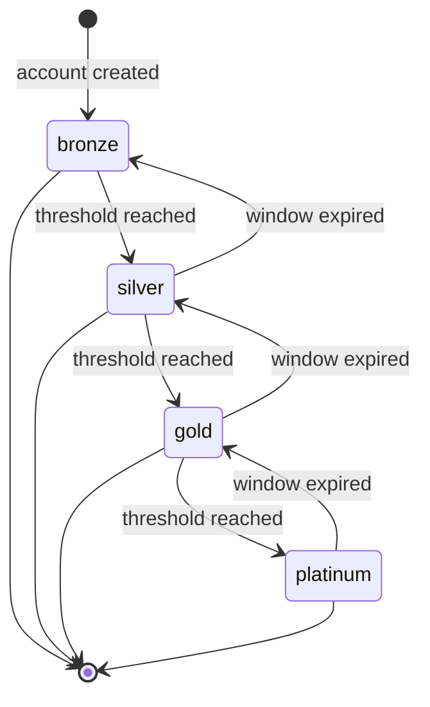
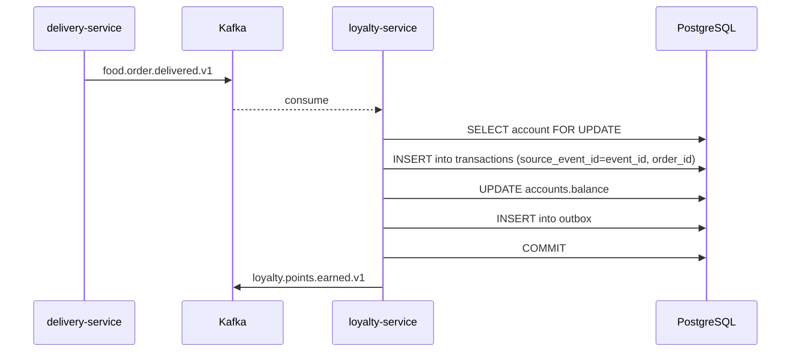
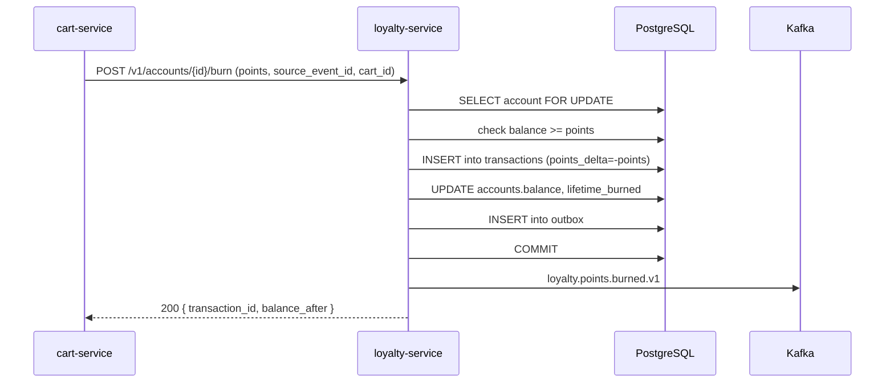
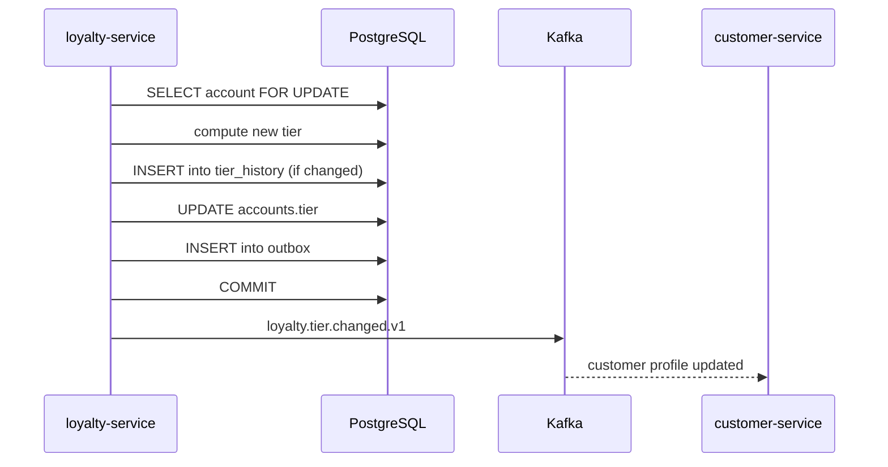
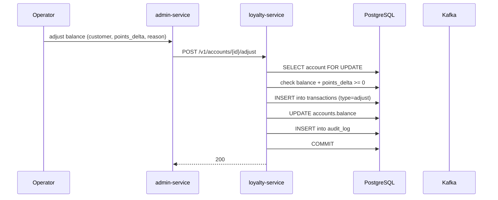

# Loyalty Service — Workflows

## 1. Earn Points on Trip Completion

### 1.1 Objective

Earn loyalty points for a customer when a trip is completed, with
idempotency on `(customer_id, source_event_id)`.

### 1.2 Initiating Actor

`trip-service` (system) emitting `trip.completed.v1`.

### 1.3 Participating Services

- `trip-service` (producer)
- Kafka
- `loyalty-service` (this service)
- `configuration-service` (earn rules)
- `customer-service` (consumer of `loyalty.tier.changed.v1`)

### 1.4 Prerequisites

- The customer has a loyalty account.
- The customer is not suspended.
- The earn rules are loaded in `configuration-service`.

### 1.5 Happy Path

```mermaid
sequenceDiagram
    participant TR as trip-service
    participant K as Kafka
    participant LYL as loyalty-service
    participant DB as PostgreSQL
    participant CFG as configuration-service
    participant CUS as customer-service

    TR->>K: trip.completed.v1 (event_id, customer_id, ride_type, total_minor)
    K-->>LYL: consume
    LYL->>LYL: lookup earn rule (ride_type, city, region)
    LYL->>DB: SELECT account FOR UPDATE
    LYL->>DB: INSERT into transactions (source_event_id=event_id)
    LYL->>DB: UPDATE accounts.balance, lifetime_earned
    LYL->>DB: INSERT into outbox
    LYL->>DB: COMMIT
    LYL->>K: loyalty.points.earned.v1
    LYL->>LYL: compute tier; if changed, INSERT into tier_history
    LYL->>K: loyalty.tier.changed.v1 (if changed)
    K-->>CUS: tier.changed
```

State machine for `LoyaltyAccount.tier`:



### 1.6 Alternate Paths

- **Tier-based boost**: gold tier = 2x points; the rule engine
  reads the customer's tier and multiplies.
- **Time-bounded campaign**: a 2x-points campaign in July; the rule
  engine checks the date.
- **Duplicate event**: the UNIQUE on
  `(customer_id, source_event_id)` rejects the second insert; the
  handler returns the prior result.

### 1.7 Failure Paths

| Failure | Handling |
|---------|----------|
| Customer has no account | create one with the customer id (lazy) |
| Customer suspended | 403 `USER_SUSPENDED`; alert |
| Duplicate event | 200 with prior result; no event emitted |
| `configuration-service` unreachable, cache cold | 503 `CIRCUIT_OPEN`; the consumer retries |
| Outbox poller fails | retry with backoff; DLQ after 3 attempts |

### 1.8 Business Rules

- An earn is recorded in the same DB transaction that returns
  success.
- The tier is recomputed on every qualifying earn.
- Points have an expiry (default 24 months) tracked in
  `transactions.expires_at`.

### 1.9 State Transitions

The account's `balance` and `tier` are updated atomically; a tier
change is recorded in `tier_history`.

### 1.10 Events

| Event | Direction | When |
|-------|-----------|------|
| `trip.completed.v1` | consumed | earn trigger |
| `loyalty.points.earned.v1` | produced | every successful earn |
| `loyalty.tier.changed.v1` | produced | tier change |

### 1.11 APIs Involved

| API | Direction | When |
|-----|-----------|------|
| `GET /v1/configurations/{key}` | outbound | rule lookup |
| `POST /v1/accounts/{id}/earn` | inbound (also via event) | event consumer |

### 1.12 Compensation / Rollback

If the trip is later cancelled, the loyalty service consumes
`trip.cancelled.v1` (if applicable) and reverses the earn with a
`type='expire'` or `type='burn'` row; the balance is decremented.

### 1.13 Final State

The customer's balance is incremented; the tier may have changed;
the `transactions` row is persisted; the event is published.

## 2. Earn Points on Order Delivery

### 2.1 Objective

Earn loyalty points for a customer when a food order is delivered,
with idempotency.

### 2.2 Initiating Actor

`delivery-service` (system) emitting `food.order.delivered.v1`.

### 2.3 Participating Services

- `delivery-service` (producer)
- Kafka
- `loyalty-service`

### 2.4 Prerequisites

- The customer has a loyalty account.
- The customer is not suspended.

### 2.5 Happy Path



### 2.6 Alternate Paths

- **Duplicate event**: same as workflow 1.

### 2.7 Failure Paths

Same as workflow 1.

### 2.8 Business Rules

- The earn is computed by the same rule engine as ride earn; the
  rule key is `loyalty.earn.food.per_euro_minor`.

### 2.9 State Transitions

Same as workflow 1.

### 2.10 Events

| Event | Direction | When |
|-------|-----------|------|
| `food.order.delivered.v1` | consumed | earn trigger |
| `loyalty.points.earned.v1` | produced | every successful earn |

### 2.11 APIs Involved

n/a (event-driven).

### 2.12 Compensation / Rollback

If the delivery is later reversed, the loyalty service consumes
`delivery.failed.v1` and reverses the earn.

### 2.13 Final State

The customer's balance is incremented; the `transactions` row is
persisted; the event is published.

## 3. Burn Points at Checkout

### 3.1 Objective

Burn points as a discount at checkout, with idempotency.

### 3.2 Initiating Actor

`cart-service` (system) on `POST /v1/carts/{id}/burn`.

### 3.3 Participating Services

- `cart-service` (caller)
- `loyalty-service`
- `pricing-service` (consumer of `points_value_minor`)

### 3.4 Prerequisites

- The customer has a loyalty account.
- The customer is not suspended.
- The balance is sufficient.

### 3.5 Happy Path



### 3.6 Alternate Paths

- **Idempotent replay**: returns the prior result.

### 3.7 Failure Paths

| Failure | Handling |
|---------|----------|
| Insufficient balance | 409 `INSUFFICIENT_POINTS` |
| Customer suspended | 403 `USER_SUSPENDED` |
| Idempotency-Key reuse with different body | 422 `IDEMPOTENCY_KEY_REUSED` |

### 3.8 Business Rules

- A burn is rejected if the balance is insufficient.
- A burn is rejected if the customer is suspended.
- A burn's `points_delta` is negative; `balance_after >= 0`.

### 3.9 State Transitions

The account's `balance` is decremented; `lifetime_burned` is
incremented.

### 3.10 Events

| Event | Direction | When |
|-------|-----------|------|
| `loyalty.points.burned.v1` | produced | every successful burn |

### 3.11 APIs Involved

| API | Direction | When |
|-----|-----------|------|
| `POST /v1/accounts/{id}/burn` | inbound | every burn |

### 3.12 Compensation / Rollback

If the cart is later abandoned, the burn is reversed by the
loyalty-service's expiry job after the cart's TTL (the cart
emits `cart.abandoned.v1`; the consumer reverses the burn).

### 3.13 Final State

The customer's balance is decremented; the burn transaction is
persisted; the cart's discount line is set; the event is published.

## 4. Tier Change

### 4.1 Objective

When a customer's qualifying spend crosses a threshold, the tier is
updated and `loyalty.tier.changed.v1` is emitted.

### 4.2 Initiating Actor

The loyalty service itself, on every earn.

### 4.3 Participating Services

- `loyalty-service`
- `customer-service` (consumer)

### 4.4 Prerequisites

- The customer's `tier_qualifying_spend_minor` is updated.

### 4.5 Happy Path



### 4.6 Alternate Paths

- **Window expired**: a daily job recomputes the tier and may
  downgrade a customer whose window has expired.

### 4.7 Failure Paths

n/a (synchronous within the earn transaction).

### 4.8 Business Rules

- A tier is computed from qualifying spend in the last 90 days.
- A tier change is recorded in the same DB transaction that updates
  the tier.

### 4.9 State Transitions

`bronze ↔ silver ↔ gold ↔ platinum` per the threshold rules.

### 4.10 Events

| Event | Direction | When |
|-------|-----------|------|
| `loyalty.tier.changed.v1` | produced | every tier change |

### 4.11 APIs Involved

n/a (internal).

### 4.12 Compensation / Rollback

A tier change can be reversed by an admin (manual adjust of the
qualifying spend, with a `tier_change` audit row).

### 4.13 Final State

The customer's `tier` is updated; the `tier_history` row is
persisted; the event is published; the customer profile reflects
the new tier.

## 5. Manual Adjust

### 5.1 Objective

Allow an admin to adjust a customer's balance (e.g. compensation
for a cancelled ride) with full audit.

### 5.2 Initiating Actor

Operator (admin) via the admin console.

### 5.3 Participating Services

- `admin-service`
- `loyalty-service`
- `audit-service`

### 5.4 Prerequisites

- The operator holds `loyalty.admin`.
- `X-Audit-Reason` and `X-Signature` are set.

### 5.5 Happy Path



### 5.6 Alternate Paths

- **Negative adjust that would underflow**: 409
  `INSUFFICIENT_POINTS`.

### 5.7 Failure Paths

| Failure | Handling |
|---------|----------|
| `X-Signature` missing | 403 `SIGNATURE_INVALID` |
| `X-Audit-Reason` missing | 400 `AUDIT_REASON_REQUIRED` |
| Operator lacks `loyalty.admin` | 403 `FORBIDDEN` |

### 5.8 Business Rules

- A manual adjust requires `X-Audit-Reason` and `X-Signature`.
- The adjust is recorded in the `audit_log` with `actor_id` and
  `reason`.

### 5.9 State Transitions

The account's `balance` is updated; the `transactions` row is
persisted.

### 5.10 Events

| Event | Direction | When |
|-------|-----------|------|
| `loyalty.points.earned.v1` or `loyalty.points.burned.v1` | produced | depending on sign |

### 5.11 APIs Involved

| API | Direction | When |
|-----|-----------|------|
| `POST /v1/accounts/{id}/adjust` | inbound | adjust |

### 5.12 Compensation / Rollback

A manual adjust is itself recorded with a `compensates_id`; a
reversing adjust is a new `adjust` row.

### 5.13 Final State

The customer's balance is updated; the `audit_log` row is
persisted; the event is published.

## 99. `Monthly` Partition Maintenance`

### 99.1 Objective

Idempotently pre-create the next 12 month child partitions for `loyalty.transactions` + `loyalty.tier_history` + `loyalty.audit_log` so an INSERT at any time lands in an existing child. The drop half is handled by the per-service retention job.

### 99.2 Initiating Actor

A scheduled job runs daily at `02:00 UTC`. Leader-elected via `pg_try_advisory_xact_lock(hashtext('loyalty.partition'), hashtext('monthly'))`.

### 99.3 Happy Path

```mermaid
sequenceDiagram
    participant JOB as Partition job
    participant PG as PostgreSQL
    JOB->>PG: pg_try_advisory_xact_lock('loyalty.monthly')
    alt lock acquired
        loop for each missing month in next 12
            JOB->>PG: CREATE TABLE IF NOT EXISTS loyalty.table_month PARTITION OF loyalty.table
            JOB->>PG: verify (pg_inherits, relpartbound)
        end
        JOB->>PG: assert now() in existing child
    else lock NOT acquired
        Note over JOB: another instance is running; exit cleanly
    end
```

### 99.4 Failure Paths

| Failure | Handling |
|---------|----------|
| Lock contention | exit 0 |
| DDL fails | retry 3× with backoff (1 s / 4 s / 16 s); page on-call |
| Today's child missing | critical alert; INSERTs would fail |

### 99.5 Business Rules

- Pre-create 12 complete future months.
- Every child is created with `CREATE TABLE IF NOT EXISTS … PARTITION OF …` so the job is safe to run twice in the same window.
- A verification step (`pg_inherits` parent + `relpartbound` range) runs after every `CREATE TABLE IF NOT EXISTS` because `IF NOT EXISTS` only guards the name, not the bounds.
- Optionally emit `audit.partition.maintained.v1` on success.

---

## See also

### Sibling docs for this service

- [`README.md`](./README.md) — purpose, bounded context, responsibilities
- [`BRD.md`](./BRD.md) — business requirements
- [`SRS.md`](./SRS.md) — functional + non-functional requirements
- [`ERD.md`](./ERD.md) — data model (entities, relationships)
- [`INTEGRATION.md`](./INTEGRATION.md) — inter-service contracts (APIs, events, sagas)
- [`WORKFLOWS.md`](./WORKFLOWS.md) — operational workflows (happy paths, failure modes)
- [`TECH.md`](./TECH.md) — technology profile (runtime, libraries, data layer, admin endpoints, RBAC)

### Platform-wide

- [`../../shared/README.md`](../../shared/README.md) — `platform-spring-boot-starter` shared library (the single source of cross-cutting code for all Spring Boot services in the platform)
- [`../RECOMMENDATIONS.md`](../RECOMMENDATIONS.md) — platform-wide technology map (language, framework, version baseline, admin/RBAC pattern)
- [`../../README.md`](../../README.md) — services overview (the catalog of all 58 services)
- [`../../../main.md`](../../../main.md) — top-level platform specification (architecture, Keycloak, PostgreSQL 18, messaging, observability baseline)

