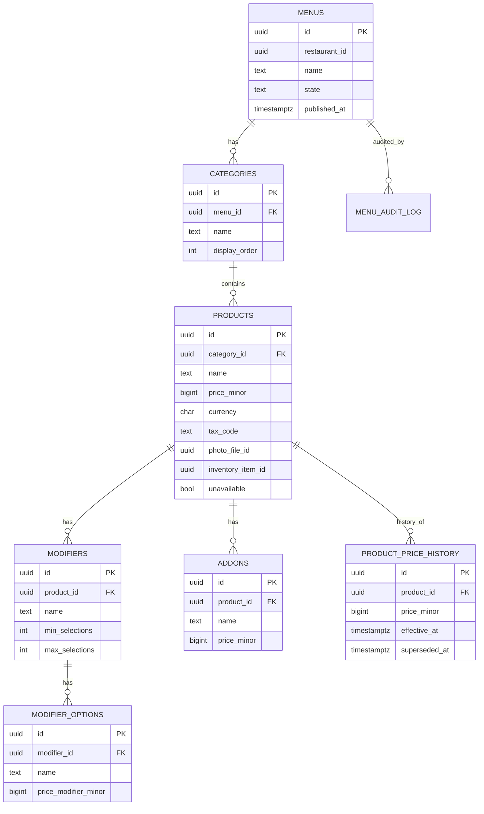

# menu-service — Entity-Relationship Diagram

## 1. Database

- Engine: **PostgreSQL 18**.
- Schema: `menu` (owned exclusively by this service).
- Migrations: `services/menu-service/prisma/migrations/`.

## 2. Cross-Service References

| Column | Type | Refers to | Source of truth |
|--------|------|-----------|------------------|
| `menus.restaurant_id` | UUID | Restaurant | `restaurant-service` |
| `products.photo_file_id` | UUID | file metadata | `file-service` |
| `products.inventory_item_id` | UUID | inventory item | `inventory-service` |
| `products.tax_code` | string | tax code | `tax-service` |

All cross-service references are stored as columns **without**
database-level foreign keys.

## 3. Entities

### `menus`

A menu under a restaurant. One or more menus per restaurant
(e.g. "Lunch", "Dinner").

#### Columns

| Column | Type | Constraints | Notes |
|--------|------|-------------|-------|
| `id` | UUID | PK | UUIDv7 |
| `restaurant_id` | UUID | NOT NULL | cross-service ref |
| `name` | TEXT | NOT NULL CHECK (length(name) BETWEEN 1 AND 120) | public name |
| `state` | TEXT | NOT NULL DEFAULT 'draft' CHECK in (...) | lifecycle |
| `published_at` | TIMESTAMPTZ | NULL | when published |
| `published_by_kc_sub` | UUID | NULL | who published |
| `state_reason_code` | TEXT | NULL | reason for last transition |
| `state_actor_kc_sub` | UUID | NULL | who made the last transition |
| `state_changed_at` | TIMESTAMPTZ | NULL | when the last transition happened |
| `created_at` | TIMESTAMPTZ | NOT NULL DEFAULT now() | audit |
| `updated_at` | TIMESTAMPTZ | NOT NULL DEFAULT now() | audit |
| `created_by` | UUID | NOT NULL | identity |
| `updated_by` | UUID | NOT NULL | identity |
| `deleted_at` | TIMESTAMPTZ | NULL | soft delete |

#### Indexes

- PK on `id`.
- Index on `(restaurant_id) WHERE deleted_at IS NULL`.
- Partial index on `(state) WHERE state = 'published' AND
  deleted_at IS NULL` — hot path.

### `categories`

A category within a menu.

#### Columns

| Column | Type | Constraints | Notes |
|--------|------|-------------|-------|
| `id` | UUID | PK | UUIDv7 |
| `menu_id` | UUID | NOT NULL, FK to `menus.id` | |
| `name` | TEXT | NOT NULL CHECK (length(name) BETWEEN 1 AND 120) | |
| `description` | TEXT | NULL | |
| `display_order` | INTEGER | NOT NULL DEFAULT 0 | sort order |
| `created_at` | TIMESTAMPTZ | NOT NULL DEFAULT now() | |
| `updated_at` | TIMESTAMPTZ | NOT NULL DEFAULT now() | |
| `created_by` | UUID | NOT NULL | |
| `updated_by` | UUID | NOT NULL | |
| `deleted_at` | TIMESTAMPTZ | NULL | soft delete |

#### Indexes

- PK on `id`.
- Index on `(menu_id, display_order) WHERE deleted_at IS NULL`.

### `products`

A product (menu item) within a category.

#### Columns

| Column | Type | Constraints | Notes |
|--------|------|-------------|-------|
| `id` | UUID | PK | UUIDv7 |
| `category_id` | UUID | NOT NULL, FK to `categories.id` | |
| `name` | TEXT | NOT NULL CHECK (length(name) BETWEEN 1 AND 120) | |
| `description` | TEXT | NULL | |
| `price_minor` | BIGINT | NOT NULL CHECK (price_minor >= 0) | current price |
| `currency` | CHAR(3) | NOT NULL CHECK (currency ~ '^[A-Z]{3}$') | ISO-4217 |
| `tax_code` | TEXT | NULL | denormalized from `tax-service` |
| `tax_rate` | NUMERIC(5,4) | NULL | denormalized rate (e.g. 0.21 for 21%) |
| `photo_file_id` | UUID | NULL | cross-service ref |
| `inventory_item_id` | UUID | NULL | cross-service ref |
| `unavailable` | BOOLEAN | NOT NULL DEFAULT false | 86 flag |
| `unavailable_reason_code` | TEXT | NULL | reason for 86 |
| `unavailable_actor_kc_sub` | UUID | NULL | who 86'd |
| `unavailable_at` | TIMESTAMPTZ | NULL | when 86'd |
| `display_order` | INTEGER | NOT NULL DEFAULT 0 | sort order |
| `created_at` | TIMESTAMPTZ | NOT NULL DEFAULT now() | |
| `updated_at` | TIMESTAMPTZ | NOT NULL DEFAULT now() | |
| `created_by` | UUID | NOT NULL | |
| `updated_by` | UUID | NOT NULL | |
| `deleted_at` | TIMESTAMPTZ | NULL | soft delete |

#### Indexes

- PK on `id`.
- Index on `(category_id, display_order) WHERE deleted_at IS
  NULL`.
- Partial index on `(unavailable) WHERE unavailable = true AND
  deleted_at IS NULL`.
- Index on `(inventory_item_id) WHERE inventory_item_id IS NOT
  NULL` — stock-driven 86 lookup.

### `product_price_history`

Price history per product.

#### Columns

| Column | Type | Constraints | Notes |
|--------|------|-------------|-------|
| `id` | UUID | PK | UUIDv7 |
| `product_id` | UUID | NOT NULL, FK to `products.id` | |
| `price_minor` | BIGINT | NOT NULL CHECK (price_minor >= 0) | |
| `currency` | CHAR(3) | NOT NULL | |
| `effective_at` | TIMESTAMPTZ | NOT NULL | when this price took effect |
| `superseded_at` | TIMESTAMPTZ | NULL | when this price was replaced |
| `changed_by_kc_sub` | UUID | NOT NULL | who changed |
| `reason` | TEXT | NULL | optional human reason |
| `created_at` | TIMESTAMPTZ | NOT NULL DEFAULT now() | |

#### Indexes

- PK on `id`.
- Index on `(product_id, effective_at DESC)`.
- Partial unique on `(product_id) WHERE superseded_at IS NULL`
  — at most one current price per product.

### `modifiers`

A modifier (e.g. "Size") attached to a product.

#### Columns

| Column | Type | Constraints | Notes |
|--------|------|-------------|-------|
| `id` | UUID | PK | UUIDv7 |
| `product_id` | UUID | NOT NULL, FK to `products.id` | |
| `name` | TEXT | NOT NULL | |
| `min_selections` | INTEGER | NOT NULL DEFAULT 0 CHECK (min_selections >= 0) | |
| `max_selections` | INTEGER | NOT NULL CHECK (max_selections >= min_selections) | |
| `display_order` | INTEGER | NOT NULL DEFAULT 0 | |
| `created_at` | TIMESTAMPTZ | NOT NULL DEFAULT now() | |
| `updated_at` | TIMESTAMPTZ | NOT NULL DEFAULT now() | |
| `deleted_at` | TIMESTAMPTZ | NULL | soft delete |

#### Indexes

- PK on `id`.
- Index on `(product_id, display_order) WHERE deleted_at IS
  NULL`.

### `modifier_options`

An option of a modifier (e.g. "Small", "Medium", "Large").

#### Columns

| Column | Type | Constraints | Notes |
|--------|------|-------------|-------|
| `id` | UUID | PK | UUIDv7 |
| `modifier_id` | UUID | NOT NULL, FK to `modifiers.id` | |
| `name` | TEXT | NOT NULL | |
| `price_modifier_minor` | BIGINT | NOT NULL DEFAULT 0 | added to the product price |
| `currency` | CHAR(3) | NOT NULL | |
| `display_order` | INTEGER | NOT NULL DEFAULT 0 | |
| `created_at` | TIMESTAMPTZ | NOT NULL DEFAULT now() | |
| `updated_at` | TIMESTAMPTZ | NOT NULL DEFAULT now() | |
| `deleted_at` | TIMESTAMPTZ | NULL | soft delete |

#### Indexes

- PK on `id`.
- Index on `(modifier_id, display_order) WHERE deleted_at IS
  NULL`.

### `addons`

An add-on attached to a product (e.g. "Extra Cheese").

#### Columns

| Column | Type | Constraints | Notes |
|--------|------|-------------|-------|
| `id` | UUID | PK | UUIDv7 |
| `product_id` | UUID | NOT NULL, FK to `products.id` | |
| `name` | TEXT | NOT NULL | |
| `price_minor` | BIGINT | NOT NULL DEFAULT 0 CHECK (price_minor >= 0) | |
| `currency` | CHAR(3) | NOT NULL | |
| `max_quantity` | INTEGER | NOT NULL DEFAULT 1 CHECK (max_quantity >= 1) | |
| `display_order` | INTEGER | NOT NULL DEFAULT 0 | |
| `created_at` | TIMESTAMPTZ | NOT NULL DEFAULT now() | |
| `updated_at` | TIMESTAMPTZ | NOT NULL DEFAULT now() | |
| `deleted_at` | TIMESTAMPTZ | NULL | soft delete |

#### Indexes

- PK on `id`.
- Index on `(product_id, display_order) WHERE deleted_at IS
  NULL`.

### `menu_audit_log`

Append-only audit log.

#### Columns

| Column | Type | Constraints | Notes |
|--------|------|-------------|-------|
| `id` | UUID | PK | UUIDv7 |
| `menu_id` | UUID | NULL, FK to `menus.id` | nullable for product-level events |
| `product_id` | UUID | NULL, FK to `products.id` | |
| `action` | TEXT | NOT NULL CHECK in (...) | `create`, `update`, `delete`, `publish`, `unpublish`, `price_change`, `86`, `un86`, `cascade_unpublish` |
| `actor_kc_sub` | UUID | NULL | null for system |
| `actor_type` | TEXT | NOT NULL CHECK in (...) | `admin`, `owner`, `manager`, `kitchen`, `system` |
| `reason_code` | TEXT | NULL | required for 86, cascade |
| `details` | JSONB | NULL | action-specific |
| `correlation_id` | UUID | NOT NULL | trace |
| `occurred_at` | TIMESTAMPTZ | NOT NULL DEFAULT now() | |

#### Indexes

- PK on `id`.
- Index on `(menu_id, occurred_at DESC)`.
- Index on `(product_id, occurred_at DESC)`.

### `outbox`

Transactional outbox for events.

#### Columns

| Column | Type | Constraints | Notes |
|--------|------|-------------|-------|
| `id` | UUID | PK | UUIDv7 |
| `aggregate_type` | TEXT | NOT NULL | `Menu` or `Product` |
| `aggregate_id` | UUID | NOT NULL | partition key |
| `event_name` | TEXT | NOT NULL | `menu.*.v1` |
| `event_id` | UUID | NOT NULL UNIQUE | dedup |
| `payload` | JSONB | NOT NULL | envelope |
| `headers` | JSONB | NOT NULL DEFAULT '{}' | Kafka headers |
| `created_at` | TIMESTAMPTZ | NOT NULL DEFAULT now() | |
| `claimed_at` | TIMESTAMPTZ | NULL | poller-set |
| `published_at` | TIMESTAMPTZ | NULL | poller-set |

#### Indexes

- PK on `id`.
- Index on `(published_at NULLS FIRST, created_at)`.

### `inbox`

Consumer-side dedup.

#### Columns

| Column | Type | Constraints | Notes |
|--------|------|-------------|-------|
| `event_id` | UUID | PK | |
| `consumer` | TEXT | NOT NULL | |
| `received_at` | TIMESTAMPTZ | NOT NULL DEFAULT now() | |
| `processed_at` | TIMESTAMPTZ | NULL | |
| `error` | TEXT | NULL | |

## 4. Mermaid ER Diagram



## 5. DDL Sketch

```sql
CREATE SCHEMA IF NOT EXISTS menu;

CREATE TABLE menu.menus (
    id UUID PRIMARY KEY,
    restaurant_id UUID NOT NULL,
    name TEXT NOT NULL CHECK (length(name) BETWEEN 1 AND 120),
    state TEXT NOT NULL DEFAULT 'draft' CHECK (state IN
        ('draft','published')),
    published_at TIMESTAMPTZ,
    published_by_kc_sub UUID,
    state_reason_code TEXT,
    state_actor_kc_sub UUID,
    state_changed_at TIMESTAMPTZ,
    created_at TIMESTAMPTZ NOT NULL DEFAULT now(),
    updated_at TIMESTAMPTZ NOT NULL DEFAULT now(),
    created_by UUID NOT NULL,
    updated_by UUID NOT NULL,
    deleted_at TIMESTAMPTZ
);

CREATE INDEX menus_restaurant_idx
    ON menu.menus (restaurant_id)
    WHERE deleted_at IS NULL;

CREATE INDEX menus_published_idx
    ON menu.menus (state)
    WHERE state = 'published' AND deleted_at IS NULL;

CREATE TABLE menu.categories (
    id UUID PRIMARY KEY,
    menu_id UUID NOT NULL REFERENCES menu.menus(id),
    name TEXT NOT NULL CHECK (length(name) BETWEEN 1 AND 120),
    description TEXT,
    display_order INTEGER NOT NULL DEFAULT 0,
    created_at TIMESTAMPTZ NOT NULL DEFAULT now(),
    updated_at TIMESTAMPTZ NOT NULL DEFAULT now(),
    created_by UUID NOT NULL,
    updated_by UUID NOT NULL,
    deleted_at TIMESTAMPTZ
);

CREATE INDEX categories_menu_order_idx
    ON menu.categories (menu_id, display_order)
    WHERE deleted_at IS NULL;

CREATE TABLE menu.products (
    id UUID PRIMARY KEY,
    category_id UUID NOT NULL REFERENCES menu.categories(id),
    name TEXT NOT NULL CHECK (length(name) BETWEEN 1 AND 120),
    description TEXT,
    price_minor BIGINT NOT NULL CHECK (price_minor >= 0),
    currency CHAR(3) NOT NULL CHECK (currency ~ '^[A-Z]{3}$'),
    tax_code TEXT,
    tax_rate NUMERIC(5,4),
    photo_file_id UUID,
    inventory_item_id UUID,
    unavailable BOOLEAN NOT NULL DEFAULT false,
    unavailable_reason_code TEXT,
    unavailable_actor_kc_sub UUID,
    unavailable_at TIMESTAMPTZ,
    display_order INTEGER NOT NULL DEFAULT 0,
    created_at TIMESTAMPTZ NOT NULL DEFAULT now(),
    updated_at TIMESTAMPTZ NOT NULL DEFAULT now(),
    created_by UUID NOT NULL,
    updated_by UUID NOT NULL,
    deleted_at TIMESTAMPTZ
);

CREATE INDEX products_category_order_idx
    ON menu.products (category_id, display_order)
    WHERE deleted_at IS NULL;

CREATE INDEX products_unavailable_idx
    ON menu.products (unavailable)
    WHERE unavailable = true AND deleted_at IS NULL;

CREATE INDEX products_inventory_idx
    ON menu.products (inventory_item_id)
    WHERE inventory_item_id IS NOT NULL;

CREATE TABLE menu.product_price_history (
    id UUID PRIMARY KEY,
    product_id UUID NOT NULL REFERENCES menu.products(id),
    price_minor BIGINT NOT NULL CHECK (price_minor >= 0),
    currency CHAR(3) NOT NULL,
    effective_at TIMESTAMPTZ NOT NULL,
    superseded_at TIMESTAMPTZ,
    changed_by_kc_sub UUID NOT NULL,
    reason TEXT,
    created_at TIMESTAMPTZ NOT NULL DEFAULT now()
);

CREATE UNIQUE INDEX product_price_history_current_uniq
    ON menu.product_price_history (product_id)
    WHERE superseded_at IS NULL;

CREATE INDEX product_price_history_product_effective_idx
    ON menu.product_price_history (product_id, effective_at DESC);

CREATE TABLE menu.modifiers (
    id UUID PRIMARY KEY,
    product_id UUID NOT NULL REFERENCES menu.products(id),
    name TEXT NOT NULL,
    min_selections INTEGER NOT NULL DEFAULT 0
        CHECK (min_selections >= 0),
    max_selections INTEGER NOT NULL
        CHECK (max_selections >= min_selections),
    display_order INTEGER NOT NULL DEFAULT 0,
    created_at TIMESTAMPTZ NOT NULL DEFAULT now(),
    updated_at TIMESTAMPTZ NOT NULL DEFAULT now(),
    deleted_at TIMESTAMPTZ
);

CREATE INDEX modifiers_product_order_idx
    ON menu.modifiers (product_id, display_order)
    WHERE deleted_at IS NULL;

CREATE TABLE menu.modifier_options (
    id UUID PRIMARY KEY,
    modifier_id UUID NOT NULL REFERENCES menu.modifiers(id),
    name TEXT NOT NULL,
    price_modifier_minor BIGINT NOT NULL DEFAULT 0,
    currency CHAR(3) NOT NULL,
    display_order INTEGER NOT NULL DEFAULT 0,
    created_at TIMESTAMPTZ NOT NULL DEFAULT now(),
    updated_at TIMESTAMPTZ NOT NULL DEFAULT now(),
    deleted_at TIMESTAMPTZ
);

CREATE INDEX modifier_options_modifier_order_idx
    ON menu.modifier_options (modifier_id, display_order)
    WHERE deleted_at IS NULL;

CREATE TABLE menu.addons (
    id UUID PRIMARY KEY,
    product_id UUID NOT NULL REFERENCES menu.products(id),
    name TEXT NOT NULL,
    price_minor BIGINT NOT NULL DEFAULT 0 CHECK (price_minor >= 0),
    currency CHAR(3) NOT NULL,
    max_quantity INTEGER NOT NULL DEFAULT 1 CHECK (max_quantity >= 1),
    display_order INTEGER NOT NULL DEFAULT 0,
    created_at TIMESTAMPTZ NOT NULL DEFAULT now(),
    updated_at TIMESTAMPTZ NOT NULL DEFAULT now(),
    deleted_at TIMESTAMPTZ
);

CREATE INDEX addons_product_order_idx
    ON menu.addons (product_id, display_order)
    WHERE deleted_at IS NULL;

CREATE TABLE menu.menu_audit_log (
    id UUID PRIMARY KEY,
    menu_id UUID REFERENCES menu.menus(id),
    product_id UUID REFERENCES menu.products(id),
    action TEXT NOT NULL CHECK (action IN
        ('create','update','delete','publish','unpublish',
         'price_change','86','un86','cascade_unpublish')),
    actor_kc_sub UUID,
    actor_type TEXT NOT NULL CHECK (actor_type IN
        ('admin','owner','manager','kitchen','system')),
    reason_code TEXT,
    details JSONB,
    correlation_id UUID NOT NULL,
    occurred_at TIMESTAMPTZ NOT NULL DEFAULT now()
);

CREATE INDEX menu_audit_log_menu_idx
    ON menu.menu_audit_log (menu_id, occurred_at DESC);

CREATE INDEX menu_audit_log_product_idx
    ON menu.menu_audit_log (product_id, occurred_at DESC);

CREATE TABLE menu.outbox (
    id UUID PRIMARY KEY,
    aggregate_type TEXT NOT NULL,
    aggregate_id UUID NOT NULL,
    event_name TEXT NOT NULL,
    event_id UUID NOT NULL UNIQUE,
    payload JSONB NOT NULL,
    headers JSONB NOT NULL DEFAULT '{}'::jsonb,
    created_at TIMESTAMPTZ NOT NULL DEFAULT now(),
    claimed_at TIMESTAMPTZ,
    published_at TIMESTAMPTZ
);

CREATE INDEX outbox_pending_idx
    ON menu.outbox (published_at NULLS FIRST, created_at);

CREATE TABLE menu.inbox (
    event_id UUID PRIMARY KEY,
    consumer TEXT NOT NULL,
    received_at TIMESTAMPTZ NOT NULL DEFAULT now(),
    processed_at TIMESTAMPTZ,
    error TEXT
);
```

## 6. Audit Columns

`menus`, `categories`, `products`, `modifiers`, `modifier_options`,
`addons` have `created_at`, `updated_at`, `created_by`,
`updated_by` (and `deleted_at` where soft delete is supported).
`product_price_history` has `created_at`. `menu_audit_log` is
append-only.

## 7. Soft Delete

Yes on `menus`, `categories`, `products`, `modifiers`,
`modifier_options`, `addons`. Reads include `WHERE deleted_at IS
NULL`. Price history is NOT soft-deleted (it is the financial
record).

## 8. JSONB Usage

- `outbox.payload` and `outbox.headers` for the event envelope.
- `menu_audit_log.details` for action-specific details.
- No other JSONB.

## 9. Partitioning

No partitioning. Menu volume is in the millions globally, not
billions per day. `product_price_history` is pruned by a job
(keeps the last `menu.price.history.max_versions` versions per
product).

## 10. Data Retention

| Table | Retention | Purged by |
|-------|-----------|-----------|
| `menus` | 7 years (financial) | hard delete after 7 years |
| `categories` | with menu | hard delete with menu |
| `products` | 7 years (financial — line items reference product ids) | hard delete after 7 years |
| `modifiers`, `modifier_options`, `addons` | with product | hard delete with product |
| `product_price_history` | 7 years | hard delete with product |
| `menu_audit_log` | 7 years | hard delete with menu |
| `outbox` | 24 h after `published_at` | scheduled job |
| `inbox` | 30 days | scheduled job |

## 11. Migration Considerations

- Adding a new modifier / addon / category is forward-only.
- The `product_price_history` partial unique index on
  `(product_id) WHERE superseded_at IS NULL` enforces
  "at most one current price per product." When changing a
  price, the old row's `superseded_at` is set in the same
  transaction as the new row is inserted.
- The `products.inventory_item_id` is optional; if NULL, the
  product is never stock-driven 86'd.
- The cascade unpublish handler is a single transaction that
  updates all `published` menus of a restaurant to `draft`
  and emits one event per menu.
- `tax_code` and `tax_rate` are denormalized from
  `tax-service`; they are refreshed on `tax.updated.v1` or
  `configuration.updated.v1`.

---

## See also

### Sibling docs for this service

- [`README.md`](./README.md) — purpose, bounded context, responsibilities
- [`BRD.md`](./BRD.md) — business requirements
- [`SRS.md`](./SRS.md) — functional + non-functional requirements
- [`ERD.md`](./ERD.md) — data model (entities, relationships)
- [`INTEGRATION.md`](./INTEGRATION.md) — inter-service contracts (APIs, events, sagas)
- [`WORKFLOWS.md`](./WORKFLOWS.md) — operational workflows (happy paths, failure modes)
- [`TECH.md`](./TECH.md) — technology profile (runtime, libraries, data layer, admin endpoints, RBAC)

### Platform-wide

- [`../../shared/README.md`](../../shared/README.md) — `platform-spring-boot-starter` shared library (the single source of cross-cutting code for all Spring Boot services in the platform)
- [`../RECOMMENDATIONS.md`](../RECOMMENDATIONS.md) — platform-wide technology map (language, framework, version baseline, admin/RBAC pattern)
- [`../../README.md`](../../README.md) — services overview (the catalog of all 58 services)
- [`../../../main.md`](../../../main.md) — top-level platform specification (architecture, Keycloak, PostgreSQL 18, messaging, observability baseline)

