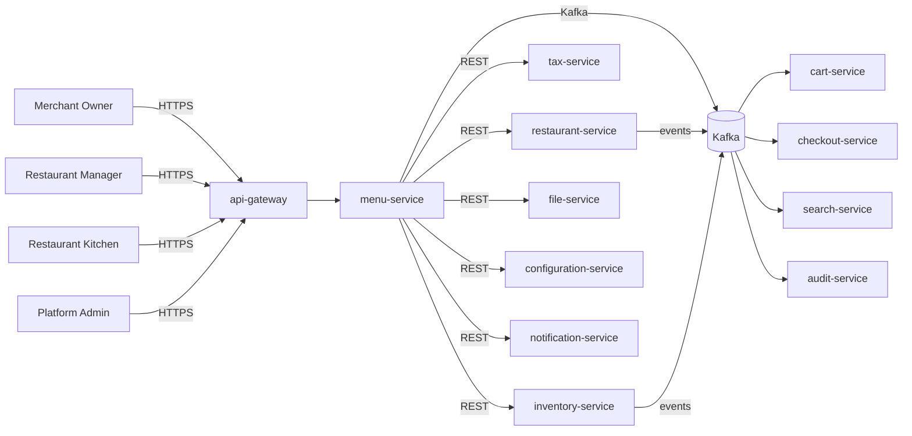

# menu-service — Software Requirements Specification

## 1. Introduction

This SRS specifies the software behavior of `menu-service`. It
covers functional requirements, non-functional requirements,
data requirements, API contract summaries, validation, state
transitions, authorization, idempotency, performance,
availability, security, and disaster recovery. The service is
the source of truth for the `Menu` aggregate (categories,
products, modifiers, add-ons).

## 2. Scope

In scope:

- Menu, category, product, modifier, add-on CRUD.
- Draft / published lifecycle.
- Price change with effective date and price history.
- Per-item unavailability (86).
- Cascade handling from parent restaurant events.
- Stock-driven 86 from `inventory-service`.

Out of scope:

- Restaurant brand (owned by `restaurant-service`).
- Branch data (owned by `branch-service`).
- Inventory stock counts (owned by `inventory-service`; this
  service reads them).
- Orders and prep state (owned by `food-order-service` and
  `restaurant-order-mgmt-service`).
- Tax calculation (owned by `tax-service`; this service stores
  the tax code and reads the rate).

## 3. System Context

## 4. Actors

- **Merchant Owner (human)** — Keycloak subject with role
  `merchant_owner`.
- **Restaurant Manager (human)** — staff with role `manager`.
- **Kitchen Staff (human)** — staff with role `kitchen`; can
  86 items.
- **Platform Admin (human)** — full access.
- **`restaurant-service` (system)** — parent; cascade events.
- **`inventory-service` (system)** — stock-driven 86.
- **`tax-service` (system)** — tax codes.
- **`cart-service` (system)** — menu consumer.
- **`checkout-service` (system)** — menu consumer.
- **`food-order-service` (system)** — line items.
- **`restaurant-order-mgmt-service` (system)** — kitchen view.
- **`search-service` (system)** — index.
- **`audit-service` (system)** — audit events.

## 5. Functional Requirements

| ID | Requirement | Priority |
|----|-------------|----------|
| FR--001 | The service MUST accept `POST /v1/restaurants/{restaurant_id}/menus` with `name`. | MUST |
| FR--002 | The service MUST verify the parent restaurant is `approved` via `restaurant-service`. | MUST |
| FR--003 | The service MUST support `POST /v1/menus/{id}/categories` with `name`, `display_order`. | MUST |
| FR--004 | The service MUST support `POST /v1/menus/{id}/categories/{cid}/products` with `name`, `description`, `price_minor`, `currency`, `tax_code`, `photo_file_id`. | MUST |
| FR--005 | The service MUST support `POST /v1/menus/{id}/products/{pid}/modifiers` with `name`, `min_selections`, `max_selections`, and `options`. | MUST |
| FR--006 | The service MUST support `POST /v1/menus/{id}/products/{pid}/addons` with `name`, `price_minor`. | MUST |
| FR--007 | The service MUST support `POST /v1/menus/{id}/publish` (transition `draft → published`); validation: at least 1 category and 1 product, all products have a valid price and a photo (if configured). | MUST |
| FR--008 | The service MUST support `POST /v1/menus/{id}/unpublish` (transition `published → draft`). | MUST |
| FR--009 | The service MUST support `POST /v1/menus/{id}/products/{pid}/price` with `price_minor`, `currency`, and optional `effective_at`; recorded in `product_price_history`. | MUST |
| FR--010 | The service MUST support `POST /v1/menus/{id}/products/{pid}/86` with `reason_code`. | MUST |
| FR--011 | The service MUST support `DELETE /v1/menus/{id}/products/{pid}/86` to un-86. | MUST |
| FR--012 | The service MUST support `PATCH` and `DELETE` for menus, categories, products, modifiers, add-ons. | MUST |
| FR--013 | The service MUST expose `GET /v1/restaurants/{restaurant_id}/menu` (the published menu). | MUST |
| FR--014 | The service MUST expose `GET /v1/menus/products/{pid}/availability` (cached, P99 < 30 ms). | MUST |
| FR--015 | The service MUST support cursor pagination on `GET /v1/menus` with filters (`restaurant_id`, `state`). | MUST |
| FR--016 | The service MUST cascade parent restaurant `suspended` to unpublish all `published` menus. | MUST |
| FR--017 | The service MUST cascade parent restaurant `closed` to unpublish all `published` menus. | MUST |
| FR--018 | The service MUST auto-86 a product on `inventory.item.out_of_stock.v1` if `menu.86.auto_on_oos` is true and the product references the inventory item. | SHOULD |
| FR--019 | The service MUST clear auto-86 on `inventory.item.restocked.v1` if the 86 was stock-driven. | SHOULD |
| FR--020 | The service MUST publish a `menu.*.v1` event for every state change. | MUST |
| FR--021 | The service MUST reject any write on a `draft`-only menu's products with 409 `MENU_NOT_PUBLISHED` for end customers (internal admin can edit drafts). | MUST |
| FR--022 | The service MUST reject publish if any product has `price_minor <= 0`. | MUST |
| FR--023 | The service MUST emit `admin.audit.menu.*` events for every admin action. | MUST |

## 6. Non-Functional Requirements

| ID | Category | Requirement | Target |
|----|----------|-------------|--------|
| NFR--001 | performance | P99 `GET /v1/restaurants/{id}/menu` | < 50 ms (cache hit) |
| NFR--002 | performance | P99 `GET /v1/menus/{id}` | < 200 ms |
| NFR--003 | performance | P99 `POST /v1/menus/{id}/publish` | < 2 s |
| NFR--004 | availability | service uptime | 99.95% over 30 days |
| NFR--005 | scalability | menu lookups | ≥ 10,000 RPS via Redis |
| NFR--006 | scalability | concurrent writes | ≥ 200 RPS sustained, 1,000 RPS burst |
| NFR--007 | maintainability | MTTR for P1 | < 30 min |
| NFR--008 | data-integrity | zero event loss | outbox + 24 h ack |
| NFR--009 | latency | price change propagation P95 | < 30 s |
| NFR--010 | latency | 86 propagation P95 | < 10 s |

## 7. API Requirements

REST API under `/v1/menus[...]` per
[`API_STANDARDS.md`](../../architecture/API_STANDARDS.md). All
write endpoints require `Idempotency-Key`. Cursor pagination by
default. OpenAPI 3.1 spec at `/openapi.json`.

(Full contracts in `INTEGRATION.md`.)

## 8. Data Requirements

| ID | Requirement | Notes |
|----|-------------|-------|
| DATA--001 | Menus, categories, products, modifiers, add-ons are uniquely identified by `id UUIDv7`. | primary keys |
| DATA--002 | Every mutable table has `created_at`, `updated_at`, `created_by`, `updated_by`, `deleted_at`. | audit |
| DATA--003 | `state` is a CHECK-constrained enum (`draft`, `published`). | lifecycle |
| DATA--004 | `restaurant_id` is a UUID column with no DB FK. | cross-service ref |
| DATA--005 | `tax_code` is a string; the rate is read from `tax-service`. | denormalized |
| DATA--006 | `price_minor` is a non-negative integer; `currency` is ISO-4217. | money |
| DATA--007 | `photo_file_id` is a UUID column with no DB FK. | cross-service ref |
| DATA--008 | `unavailable` is a boolean; `unavailable_reason_code` is set when 86'd. | 86 |
| DATA--009 | Price history is stored in `product_price_history` (1..n per product). | history |
| DATA--010 | `inventory_item_id` is a UUID column with no DB FK (optional link). | cross-service ref |

(Full schema in `ERD.md`.)

## 9. Validation Rules

- `name` — 1..120 chars.
- `price_minor` — non-negative; > 0 for publish.
- `currency` — ISO-4217.
- `tax_code` — drawn from `tax-service` allowed list.
- `modifiers[].min_selections` — ≥ 0.
- `modifiers[].max_selections` — ≥ `min_selections`.
- `addons[].price_minor` — ≥ 0.
- `unavailable_reason_code` — drawn from `menu.86.reason_codes`.

## 10. State Transitions

| From | To | Trigger |
|------|----|---------|
| `draft` | `published` | `POST /publish` |
| `published` | `draft` | `POST /unpublish` |
| `published` | `draft` | cascade (parent restaurant suspended / closed) |
| `draft` | `draft` | re-publish (after edits) |

Per-product state: `unavailable` (boolean) toggled by 86 / un-86
or stock events.

State transitions are described in detail in `WORKFLOWS.md`.

## 11. Authorization Requirements

- `merchant_owner` of the parent restaurant may create, edit,
  publish, unpublish, change prices.
- `restaurant_manager` may edit, publish, unpublish, change
  prices, 86.
- `restaurant_staff` (kitchen) may 86 only.
- `platform_admin` has full access.
- Customers (read-only) may only read published menus.

## 12. Configuration Requirements

- `menu.max_categories` — int.
- `menu.max_products_per_category` — int.
- `menu.max_modifiers_per_product` — int.
- `menu.max_addons_per_product` — int.
- `menu.price.history.max_versions` — int.
- `menu.publish.requires_photo` — bool.
- `menu.86.auto_on_oos` — bool.
- `menu.86.reason_codes` — array<string>.
- `feature_flag.menu.bulk_publish_enabled` — bool.

## 13. Error Handling

| Error | Response |
|-------|----------|
| Body validation failure | 400 `VALIDATION_FAILED` with `details[]` |
| Missing/invalid JWT | 401 `UNAUTHENTICATED` |
| Insufficient role | 403 `FORBIDDEN` |
| Parent restaurant not approved | 409 `RESTAURANT_NOT_APPROVED` |
| Parent restaurant suspended | 409 `RESTAURANT_SUSPENDED` |
| Menu empty | 422 `MENU_EMPTY` |
| Price invalid | 422 `PRICE_INVALID` |
| Reason code invalid | 422 `REASON_CODE_INVALID` |
| Illegal state transition | 409 `STATE_INVALID` |
| Idempotency key reused | 422 `IDEMPOTENCY_KEY_REUSED` |
| Rate limited | 429 `RATE_LIMITED` |
| Downstream timeout | 503 `DEPENDENCY_TIMEOUT` |
| Circuit open | 503 `CIRCUIT_OPEN` |
| Other | 500 `INTERNAL_ERROR` |

## 14. Concurrency Requirements

- Two concurrent publishes on the same menu MUST be serialized
  via row-level lock.
- Two concurrent 86s on the same product MUST be serialized.
- Cascade handlers MUST be idempotent via inbox dedup.

## 15. Idempotency Requirements

- All write endpoints require `Idempotency-Key`.
- All state transitions use the outbox pattern with `event_id`
  dedup.

## 16. Performance

- Dominant path: `GET /v1/restaurants/{id}/menu`. P50 < 10 ms
  (cache hit), P99 < 50 ms.
- `GET /v1/menus/{id}`: P50 < 50 ms, P99 < 200 ms.
- `POST /v1/menus/{id}/publish`: P50 < 500 ms, P99 < 2 s.

## 17. Scalability

- Horizontal: HPA on CPU > 60% and
  `http_requests_in_flight > 500/replica`; max 12.
- Vertical: up to 4 CPU / 8 GiB.
- DB: 1 primary + 1 read replica in each region.
- Cache: Redis cluster, key `menu:by_restaurant:{id}` TTL 60 s,
  `menu:product_availability:{pid}` TTL 30 s.

## 18. Availability

- SLO: 99.95% over 30 days.
- Error budget: ~22 min / 30 days.
- Maintenance: Sunday 04:00–06:00 UTC.

## 19. Security

| ID | Requirement | Notes |
|----|-------------|-------|
| SEC--001 | All endpoints require a valid JWT; service-to-service uses `client_credentials`. | gateway enforced |
| SEC--002 | Admin actions require `X-Audit-Reason` and HMAC-SHA256 signature. | `API_STANDARDS.md` §14 |
| SEC--003 | Resource-level ownership checks. | `menu.restaurant.merchant.owner_kc_sub == sub` |
| SEC--004 | All cross-service calls use mTLS + `client_credentials` JWT. | defense in depth |
| SEC--005 | Secrets only in Vault. | pre-commit enforced |
| SEC--006 | Rate limiting at gateway and service. | `API_STANDARDS.md` §12 |
| SEC--007 | No PII beyond the operator's Keycloak subject. | minimal |
| SEC--008 | Admin actions emit `admin.audit.menu.*` events. | `audit-service` |
| SEC--009 | The service stores no card data; PCI scope is none. | SAQ-A |

## 20. Privacy

- PII stored: minimal. The brand profile is public; the
  operator's Keycloak subject is held for audit.
- Retention: 7 years (soft delete; hard delete after retention).
- Erasure: not applicable (no merchant PII).

## 21. Auditability

- Every state transition emits a `menu.*.v1` event.
- Every admin action emits an `admin.audit.menu.*` event.
- Audit retention: 7 years.

## 22. Observability

- Logs: JSON to stdout with `correlation_id`, `trace_id`,
  `menu_id`, `product_id`, `restaurant_id`, `state`,
  `from_state`, `to_state`, `actor`, `reason_code`.
- Metrics:
  - RED: standard.
  - Business: `menus_published_total{restaurant_id}`,
    `menus_unpublished_total{reason}`,
    `menu_items_total{state}`,
    `menu_items_86d_total{reason}`,
    `menu_price_changes_total`,
    `menu_lookups_total{cache_hit}`,
    `menu_publish_seconds`.
- Traces: OpenTelemetry.
- Alerts: SLO burn rate, outbox lag, propagation lag.

## 23. Maintainability

- TypeScript strict, ESLint, Prettier.
- Coverage: ≥ 85% lines.
- Documentation: this folder.

## 24. Disaster Recovery

- RPO: 5 min (PITR 30 days for Tier-1).
- RTO: 30 min.
- Quarterly restore drill.

## 25. Acceptance Criteria

- AC-1: A merchant can create, populate, and publish a menu in
  < 30 min.
- AC-2: A published menu is searchable within 30 s.
- AC-3: A price change is reflected in active carts within 30
  s.
- AC-4: A 86 is reflected in active carts within 10 s.
- AC-5: A suspended restaurant's menus are all unpublished
  within 60 s.
- AC-6: A closed restaurant's menus are all unpublished.
- AC-7: All admin actions are recorded with reason and actor.
- AC-8: The service meets its 99.95% SLO.
- AC-9: All state changes are emitted as events.
- AC-10: Soft delete preserves data for 7 years.

---

## See also

### Sibling docs for this service

- [`README.md`](./README.md) — purpose, bounded context, responsibilities
- [`BRD.md`](./BRD.md) — business requirements
- [`SRS.md`](./SRS.md) — functional + non-functional requirements
- [`ERD.md`](./ERD.md) — data model (entities, relationships)
- [`INTEGRATION.md`](./INTEGRATION.md) — inter-service contracts (APIs, events, sagas)
- [`WORKFLOWS.md`](./WORKFLOWS.md) — operational workflows (happy paths, failure modes)
- [`TECH.md`](./TECH.md) — technology profile (runtime, libraries, data layer, admin endpoints, RBAC)

### Platform-wide

- [`../../shared/README.md`](../../shared/README.md) — `platform-spring-boot-starter` shared library (the single source of cross-cutting code for all Spring Boot services in the platform)
- [`../RECOMMENDATIONS.md`](../RECOMMENDATIONS.md) — platform-wide technology map (language, framework, version baseline, admin/RBAC pattern)
- [`../../README.md`](../../README.md) — services overview (the catalog of all 58 services)
- [`../../../main.md`](../../../main.md) — top-level platform specification (architecture, Keycloak, PostgreSQL 18, messaging, observability baseline)

