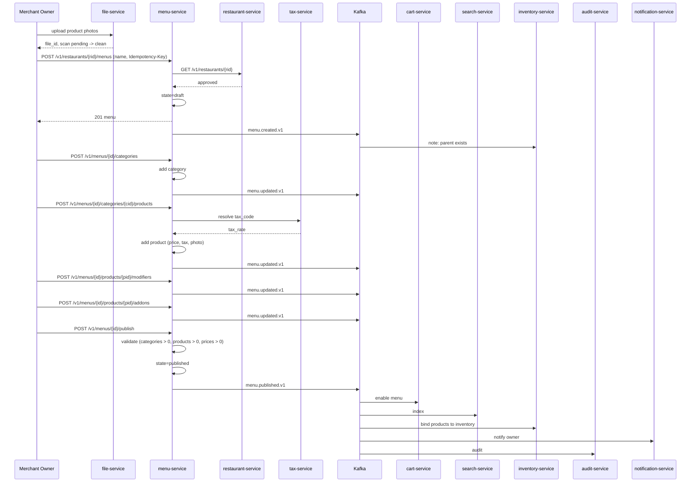
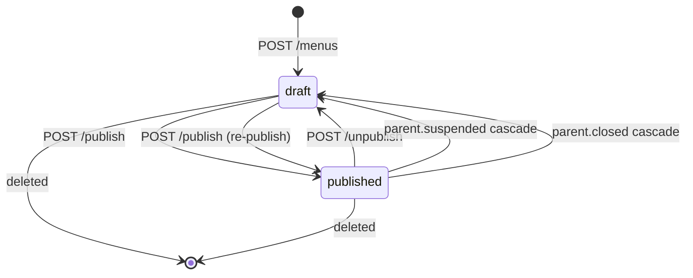
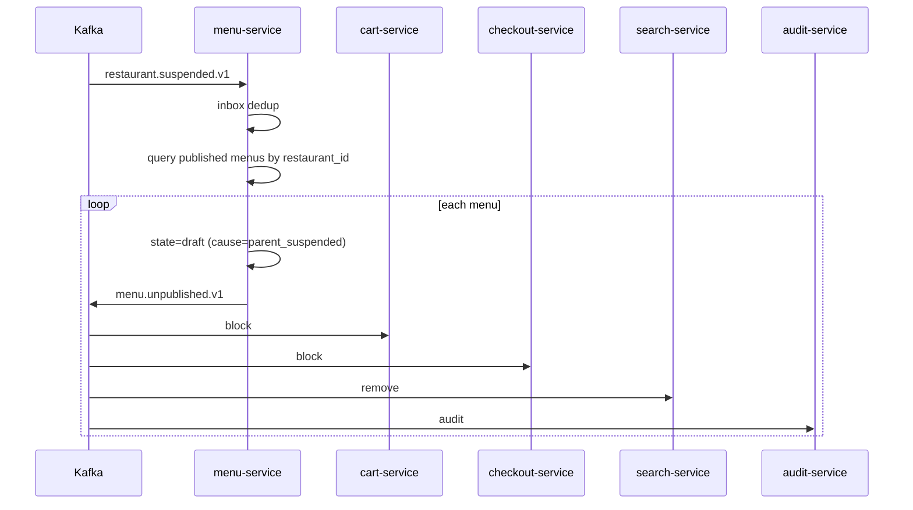

# menu-service — Workflows

## 1. Menu Onboarding and Publication

### 1.1 Objective

A merchant owner creates a menu, adds categories and products
with modifiers and add-ons, and publishes it. Once published,
the menu is visible to customers and orderable. The
`menu.published.v1` event is consumed by `cart-service`,
`search-service`, and `inventory-service` to make the menu
discoverable and bind products to inventory items.

### 1.2 Initiating Actor

`merchant_owner` or `restaurant_manager`.

### 1.3 Participating Services

- `menu-service` (this service).
- `restaurant-service` (parent verification).
- `tax-service` (tax code resolution).
- `file-service` (photo upload).
- `configuration-service` (menu config).
- `notification-service` (lifecycle).
- `cart-service`, `search-service`, `inventory-service`,
  `audit-service` (downstream consumers).

### 1.4 Prerequisites

- The parent restaurant is `approved`.
- A photo is available for each product (if
  `menu.publish.requires_photo` is true).
- A tax code is provided (or `null` for tax-exempt).
- The merchant has uploaded the photos via `file-service` and
  has the `file_id`s.

### 1.5 Happy Path



### 1.6 Alternate Paths

- **Menu empty**: 422 `MENU_EMPTY`.
- **Product with zero price**: 422 `PRICE_INVALID`.
- **Photo missing (if required)**: 422 `PHOTO_MISSING`.
- **Re-publish after edits**: `POST /publish` again; the menu
  transitions `draft → published` again; the same event is
  emitted.

### 1.7 Failure Paths

- **`restaurant-service` unreachable**: 503 `DEPENDENCY_TIMEOUT`.
- **Outbox failure**: outbox retried; DLQ.

### 1.8 Business Rules

- A menu can be created only if its parent restaurant is
  `approved`.
- A menu can be published only if it has at least 1 category
  and 1 product, all products have a valid price, and a photo
  (if configured).
- Customers can only see `published` menus.

### 1.9 State Transitions



### 1.10 Events

| Event | Direction | When |
|-------|-----------|------|
| `menu.created.v1` | produced | `POST /menus` |
| `menu.updated.v1` | produced | category / product / modifier / addon CRUD |
| `menu.published.v1` | produced | `POST /publish` |
| `menu.unpublished.v1` | produced | `POST /unpublish` or cascade |
| `restaurant.created.v1` | consumed | parent eligible |
| `restaurant.suspended.v1` | consumed | cascade unpublish |
| `restaurant.closed.v1` | consumed | cascade unpublish |

### 1.11 APIs Involved

| API | Direction | When |
|-----|-----------|------|
| `POST /v1/restaurants/{rid}/menus` | inbound | create |
| `POST /v1/menus/{id}/categories` | inbound | add category |
| `POST /v1/menus/{id}/categories/{cid}/products` | inbound | add product |
| `POST /v1/menus/{id}/publish` | inbound | publish |
| `GET /v1/restaurants/{rid}` to restaurant-service | outbound | parent check |
| `GET /v1/tax/codes/{code}` to tax-service | outbound | tax rate |

### 1.12 Compensation / Rollback

- **Publish was a mistake**: `POST /unpublish`; the menu
  returns to `draft`; cart items are flagged stale.
- **Cascade unpublish was wrong**: `POST /publish`; the menu
  is re-published.

### 1.13 Final State

Menu is `published`; customers can browse and order; search
indexes are updated within 30 s.

## 2. Price Change

### 2.1 Objective

Operator changes a product's price (with optional effective
date). The change is reflected in active carts within 30 s; the
new price is stored in `product_price_history`.

### 2.2 Initiating Actor

`merchant_owner` or `restaurant_manager`.

### 2.3 Participating Services

- `menu-service` (this service).
- `cart-service` (downstream — re-quote).
- `audit-service`.

### 2.4 Prerequisites

- The product is in a `published` menu.
- The new price is > 0.

### 2.5 Happy Path

```mermaid
sequenceDiagram
    participant OP as Operator
    participant MN as menu-service
    participant K as Kafka
    participant CRT as cart-service
    participant AUD as audit-service

    OP->>MN: POST /v1/menus/{id}/products/{pid}/price {price_minor, currency, effective_at}
    alt immediate
        MN->>MN: supersede old price_history row; insert new row
        MN->>MN: update product.price_minor
    else scheduled
        MN->>MN: schedule a job for effective_at
    end
    MN->>K: menu.item.price.changed.v1
    K->>CRT: re-quote active carts
    K->>AUD: audit
    MN-->>OP: 200 OK
```

### 2.6 Alternate Paths

- **Effective date in the past**: 400 `EFFECTIVE_AT_INVALID`.

### 2.7 Failure Paths

- **Outbox failure**: outbox retried.

### 2.8 Business Rules

- A price change is recorded in `product_price_history`; the
  current price is the row with `superseded_at IS NULL`.
- Scheduled price changes are run by a job at `effective_at`.

### 2.9 State Transitions

This workflow does not change menu state; only the product's
price.

### 2.10 Events

| Event | Direction | When |
|-------|-----------|------|
| `menu.item.price.changed.v1` | produced | price change |

### 2.11 APIs Involved

| API | Direction | When |
|-----|-----------|------|
| `POST /v1/menus/{id}/products/{pid}/price` | inbound | price change |

### 2.12 Compensation / Rollback

- The operator can issue another price change to revert.

### 2.13 Final State

The product's price is updated; active carts re-quote within
30 s; the price history is preserved.

## 3. 86 an Item

### 3.1 Objective

Operator marks a product as unavailable (the "86" operation).
The change is reflected in active carts within 10 s; the cart
removes the item and notifies the customer.

### 3.2 Initiating Actor

`merchant_owner`, `restaurant_manager`, or kitchen staff.

### 3.3 Participating Services

- `menu-service` (this service).
- `cart-service` (downstream — remove from cart).
- `search-service` (downstream — reindex).
- `audit-service`.

### 3.4 Prerequisites

- The product is in a `published` menu.

### 3.5 Happy Path

```mermaid
sequenceDiagram
    participant OP as Operator
    participant MN as menu-service
    participant K as Kafka
    participant CRT as cart-service
    participant SR as search-service
    participant AUD as audit-service

    OP->>MN: POST /v1/menus/{id}/products/{pid}/86 {reason_code, reason_text}
    MN->>MN: unavailable=true; unavailable_reason_code; unavailable_at; unavailable_actor
    MN->>MN: invalidate Redis cache
    MN->>K: menu.item.unavailable.v1
    K->>CRT: remove from active carts
    K->>SR: reindex
    K->>AUD: audit
    MN-->>OP: 200 OK
```

### 3.6 Alternate Paths

- **Already 86'd**: 409 `STATE_INVALID` (idempotent via
  `Idempotency-Key`; a no-op if the same reason).
- **Auto-86 from inventory**: handled in the
  `inventory.item.out_of_stock.v1` consumer; same code path
  with `data.cause = "stock"`.

### 3.7 Failure Paths

- **Outbox failure**: outbox retried.

### 3.8 Business Rules

- A 86 is recorded with a `reason_code` from
  `menu.86.reason_codes`.
- A kitchen staff can 86 but not edit prices.
- A stock-driven 86 is cleared on
  `inventory.item.restocked.v1` (only if the reason is
  `stock`).

### 3.9 State Transitions

The product's `unavailable` flag toggles to true.

### 3.10 Events

| Event | Direction | When |
|-------|-----------|------|
| `menu.item.unavailable.v1` | produced | 86 |
| `menu.item.available.v1` | produced | un-86 |
| `inventory.item.out_of_stock.v1` | consumed | auto-86 |
| `inventory.item.restocked.v1` | consumed | auto-un-86 |

### 3.11 APIs Involved

| API | Direction | When |
|-----|-----------|------|
| `POST /v1/menus/{id}/products/{pid}/86` | inbound | 86 |
| `DELETE /v1/menus/{id}/products/{pid}/86` | inbound | un-86 |

### 3.12 Compensation / Rollback

`DELETE` on the 86 endpoint un-86s the product; cart may
re-add (subject to re-validation).

### 3.13 Final State

The product is unavailable; active carts remove it within 10 s;
the search index is updated.

## 4. Cascade Unpublish (Parent Restaurant Suspended)

### 4.1 Objective

When the parent restaurant is suspended, all of its `published`
menus are unpublished so that no orders can be placed.

### 4.2 Initiating Actor

`restaurant-service` (system) via `restaurant.suspended.v1`.

### 4.3 Participating Services

- `menu-service` (this service).
- `cart-service` (downstream — block orders).
- `checkout-service` (downstream — block).
- `search-service` (downstream — remove).
- `audit-service`.

### 4.4 Prerequisites

- `restaurant.suspended.v1` is received.
- Inbox dedup passes.

### 4.5 Happy Path



### 4.6 Alternate Paths

- **No published menus**: nothing to do.
- **Already unpublished**: skip (idempotent).

### 4.7 Failure Paths

- **Outbox failure**: outbox retried.

### 4.8 Business Rules

- Cascade unpublish has priority over operator-set state.
- The cause is recorded as `parent_suspended`.

### 4.9 State Transitions

The relevant transition is `published → draft` (with
`cause = parent_suspended`).

### 4.10 Events

| Event | Direction | When |
|-------|-----------|------|
| `restaurant.suspended.v1` | consumed | trigger |
| `menu.unpublished.v1` | produced | per menu |

### 4.11 APIs Involved

No direct API involvement; pure event-driven.

### 4.12 Compensation / Rollback

`restaurant.reinstated.v1` does NOT automatically re-publish
the menus; the operator must re-publish via
`POST /v1/menus/{id}/publish`.

### 4.13 Final State

All `published` menus of the suspended restaurant are
`draft`; downstream services are notified within 60 s.

---

## See also

### Sibling docs for this service

- [`README.md`](./README.md) — purpose, bounded context, responsibilities
- [`BRD.md`](./BRD.md) — business requirements
- [`SRS.md`](./SRS.md) — functional + non-functional requirements
- [`ERD.md`](./ERD.md) — data model (entities, relationships)
- [`INTEGRATION.md`](./INTEGRATION.md) — inter-service contracts (APIs, events, sagas)
- [`WORKFLOWS.md`](./WORKFLOWS.md) — operational workflows (happy paths, failure modes)
- [`TECH.md`](./TECH.md) — technology profile (runtime, libraries, data layer, admin endpoints, RBAC)

### Platform-wide

- [`../../shared/README.md`](../../shared/README.md) — `platform-spring-boot-starter` shared library (the single source of cross-cutting code for all Spring Boot services in the platform)
- [`../RECOMMENDATIONS.md`](../RECOMMENDATIONS.md) — platform-wide technology map (language, framework, version baseline, admin/RBAC pattern)
- [`../../README.md`](../../README.md) — services overview (the catalog of all 58 services)
- [`../../../main.md`](../../../main.md) — top-level platform specification (architecture, Keycloak, PostgreSQL 18, messaging, observability baseline)

