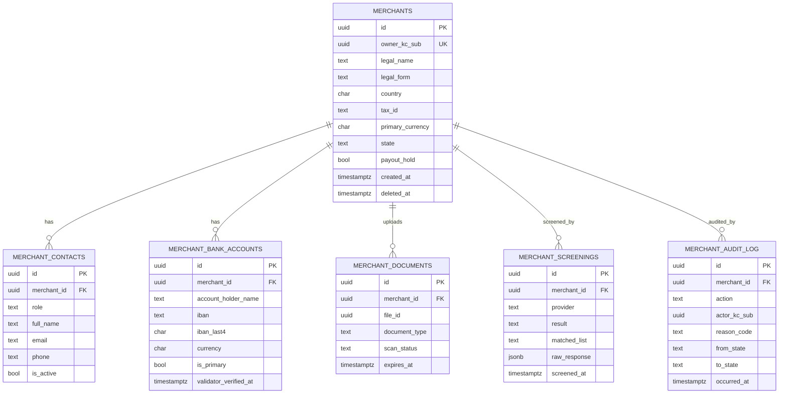

# merchant-service — Entity-Relationship Diagram

## 1. Database

- Engine: **PostgreSQL 18**.
- Schema: `merchant` (owned exclusively by this service).
- Migrations: `services/merchant-service/prisma/migrations/`.
  Versioned, forward-only, reviewed in PRs.

## 2. Cross-Service References

| Column | Type | Refers to | Source of truth |
|--------|------|-----------|------------------|
| `merchants.owner_kc_sub` | UUID (Keycloak sub) | Keycloak user | `identity-service` |
| `merchants.suspension_actor_kc_sub` | UUID | Keycloak user | `identity-service` |
| `merchant_screenings.provider` | string | KYC/sanctions provider | external (provider) |
| `merchant_bank_accounts.validator_token_id` | UUID | external validator | external (provider) |
| `merchant_documents.file_id` | UUID | file metadata | `file-service` |
| `merchant_audit_log.admin_action_id` | UUID | admin action | `admin-service` |

All cross-service references are stored as columns **without**
database-level foreign keys. Referential integrity is enforced at
the application layer (validating via API and consuming events for
updates).

## 3. Entities

### `merchants`

The legal entity that contracts with the platform. One merchant is
owned by one Keycloak user; a merchant may have many restaurants
(owned downstream) and many contacts, bank accounts, and documents.

#### Columns

| Column | Type | Constraints | Notes |
|--------|------|-------------|-------|
| `id` | UUID | PK | UUIDv7 |
| `owner_kc_sub` | UUID | NOT NULL, UNIQUE partial | Keycloak subject of the owner |
| `legal_name` | TEXT | NOT NULL, ENCRYPTED | confidential |
| `legal_form` | TEXT | NOT NULL | e.g. `LLC`, `sole_prop`, `corp` |
| `country` | CHAR(2) | NOT NULL | ISO-3166-1 alpha-2 |
| `tax_id` | TEXT | NOT NULL, ENCRYPTED | confidential, jurisdiction-validated |
| `tax_id_jurisdiction` | CHAR(2) | NOT NULL | ISO-3166-1 alpha-2 |
| `primary_currency` | CHAR(3) | NOT NULL | ISO-4217 |
| `state` | TEXT | NOT NULL CHECK in (...), default `draft` | lifecycle state |
| `state_reason_code` | TEXT | NULL | reason for the last transition |
| `state_actor_kc_sub` | UUID | NULL | who made the last transition |
| `state_changed_at` | TIMESTAMPTZ | NULL | when the last transition happened |
| `payout_hold` | BOOLEAN | NOT NULL DEFAULT false | admin-controlled |
| `payout_hold_reason` | TEXT | NULL | reason for hold |
| `payout_hold_set_at` | TIMESTAMPTZ | NULL | when the hold was set |
| `payout_hold_actor_kc_sub` | UUID | NULL | who set the hold |
| `needs_enhanced_due_diligence` | BOOLEAN | NOT NULL DEFAULT false | compliance flag |
| `created_at` | TIMESTAMPTZ | NOT NULL DEFAULT now() | audit |
| `updated_at` | TIMESTAMPTZ | NOT NULL DEFAULT now() | audit |
| `created_by` | UUID | NOT NULL | identity |
| `updated_by` | UUID | NOT NULL | identity |
| `deleted_at` | TIMESTAMPTZ | NULL | soft delete |

#### Indexes

- PK on `id`.
- UNIQUE partial on `(owner_kc_sub) WHERE deleted_at IS NULL` — one
  active merchant per owner.
- Index on `(state)` — admin review queue filter.
- Index on `(country, state)` — country-scoped dashboards.
- Partial index on `(state) WHERE state = 'pending_review' AND
  deleted_at IS NULL` — admin queue hot path.

#### Constraints

- CHECK: `state IN ('draft','pending_review','approved','rejected',
  'suspended','closed','expired')`.
- CHECK: `legal_form IN ('sole_prop','partnership','llc','corp',
  'non_profit','other')`.
- CHECK: `country ~ '^[A-Z]{2}$'`.
- CHECK: `primary_currency ~ '^[A-Z]{3}$'`.

### `merchant_contacts`

A contact at the merchant. Roles: `primary`, `ops`, `finance`,
`legal`. A merchant must always have at least one `primary` contact
while in `approved` state.

#### Columns

| Column | Type | Constraints | Notes |
|--------|------|-------------|-------|
| `id` | UUID | PK | UUIDv7 |
| `merchant_id` | UUID | NOT NULL | FK to `merchants.id` (within schema) |
| `role` | TEXT | NOT NULL CHECK in (...) | role |
| `full_name` | TEXT | NOT NULL, ENCRYPTED | confidential |
| `email` | TEXT | NOT NULL, ENCRYPTED | confidential, lowercased |
| `phone` | TEXT | NOT NULL, ENCRYPTED | confidential, E.164 |
| `notification_preference` | TEXT | NOT NULL DEFAULT 'email' CHECK in (...) | channel |
| `is_active` | BOOLEAN | NOT NULL DEFAULT true | soft disable |
| `created_at` | TIMESTAMPTZ | NOT NULL DEFAULT now() | audit |
| `updated_at` | TIMESTAMPTZ | NOT NULL DEFAULT now() | audit |
| `created_by` | UUID | NOT NULL | identity |
| `updated_by` | UUID | NOT NULL | identity |
| `deleted_at` | TIMESTAMPTZ | NULL | soft delete |

#### Indexes

- PK on `id`.
- Index on `(merchant_id) WHERE deleted_at IS NULL` — list
  contacts for a merchant.
- Partial unique on `(merchant_id, role) WHERE role = 'primary' AND
  deleted_at IS NULL` — at most one primary contact.

#### Constraints

- CHECK: `role IN ('primary','ops','finance','legal')`.
- CHECK: `notification_preference IN ('email','sms','push','none')`.
- CHECK: `email ~* '^[^@]+@[^@]+\.[^@]+$'`.

### `merchant_bank_accounts`

A bank account held by the merchant. The primary account is used for
payouts.

#### Columns

| Column | Type | Constraints | Notes |
|--------|------|-------------|-------|
| `id` | UUID | PK | UUIDv7 |
| `merchant_id` | UUID | NOT NULL | FK to `merchants.id` (within schema) |
| `account_holder_name` | TEXT | NOT NULL, ENCRYPTED | confidential |
| `iban` | TEXT | NOT NULL, ENCRYPTED | confidential, MOD-97 validated |
| `iban_last4` | CHAR(4) | NOT NULL | last 4 chars for display |
| `bank_name` | TEXT | NOT NULL | informational |
| `bank_country` | CHAR(2) | NOT NULL | ISO-3166-1 alpha-2 |
| `currency` | CHAR(3) | NOT NULL | ISO-4217 |
| `is_primary` | BOOLEAN | NOT NULL DEFAULT false | exactly one primary |
| `validator_provider` | TEXT | NULL | e.g. `plaid`, `stripe_issuing` |
| `validator_token_id` | UUID | NULL | opaque provider reference |
| `validator_verified_at` | TIMESTAMPTZ | NULL | when last validated |
| `created_at` | TIMESTAMPTZ | NOT NULL DEFAULT now() | audit |
| `updated_at` | TIMESTAMPTZ | NOT NULL DEFAULT now() | audit |
| `created_by` | UUID | NOT NULL | identity |
| `updated_by` | UUID | NOT NULL | identity |
| `deleted_at` | TIMESTAMPTZ | NULL | soft delete |

#### Indexes

- PK on `id`.
- Index on `(merchant_id) WHERE deleted_at IS NULL` — list accounts.
- Partial unique on `(merchant_id) WHERE is_primary = true AND
  deleted_at IS NULL` — exactly one primary.

#### Constraints

- CHECK: `iban_last4 ~ '^\d{4}$'`.
- CHECK: `currency ~ '^[A-Z]{3}$'`.
- CHECK: `bank_country ~ '^[A-Z]{2}$'`.

### `merchant_documents`

Metadata for KYC documents. Bytes are stored in object storage via
`file-service`; only `file_id` is held here.

#### Columns

| Column | Type | Constraints | Notes |
|--------|------|-------------|-------|
| `id` | UUID | PK | UUIDv7 |
| `merchant_id` | UUID | NOT NULL | FK to `merchants.id` (within schema) |
| `file_id` | UUID | NOT NULL | cross-service ref to `file-service` (no FK) |
| `document_type` | TEXT | NOT NULL CHECK in (...) | e.g. `trade_license`, `tax_cert`, `bank_letter`, `owner_id` |
| `scan_status` | TEXT | NOT NULL DEFAULT 'pending' CHECK in (...) | `pending`, `clean`, `infected`, `unsupported` |
| `scan_completed_at` | TIMESTAMPTZ | NULL | when |
| `expires_at` | TIMESTAMPTZ | NULL | document expiry, if any |
| `created_at` | TIMESTAMPTZ | NOT NULL DEFAULT now() | audit |
| `updated_at` | TIMESTAMPTZ | NOT NULL DEFAULT now() | audit |
| `created_by` | UUID | NOT NULL | identity |
| `updated_by` | UUID | NOT NULL | identity |
| `deleted_at` | TIMESTAMPTZ | NULL | soft delete |

#### Indexes

- PK on `id`.
- Index on `(merchant_id) WHERE deleted_at IS NULL`.
- Index on `(scan_status)` — admin alerts.
- Partial index on `(expires_at) WHERE expires_at IS NOT NULL AND
  deleted_at IS NULL` — expiry monitoring.

#### Constraints

- CHECK: `document_type IN ('trade_license','tax_cert','bank_letter',
  'owner_id','other')`.
- CHECK: `scan_status IN ('pending','clean','infected','unsupported')`.

### `merchant_screenings`

Result of a sanctions / AML screening. Multiple per merchant
(history is retained).

#### Columns

| Column | Type | Constraints | Notes |
|--------|------|-------------|-------|
| `id` | UUID | PK | UUIDv7 |
| `merchant_id` | UUID | NOT NULL | FK to `merchants.id` (within schema) |
| `provider` | TEXT | NOT NULL | e.g. `onfido`, `trulioo` |
| `result` | TEXT | NOT NULL CHECK in (...) | `clear`, `match`, `review` |
| `matched_list` | TEXT | NULL | e.g. `OFAC_SDN`, `UN_1267` |
| `screened_name` | TEXT | NOT NULL | the name that was screened |
| `screened_at` | TIMESTAMPTZ | NOT NULL | when |
| `raw_response` | JSONB | NOT NULL | provider response payload |
| `created_at` | TIMESTAMPTZ | NOT NULL DEFAULT now() | audit |

#### Indexes

- PK on `id`.
- Index on `(merchant_id, screened_at DESC)`.
- Partial index on `(result) WHERE result = 'match'` — admin
  alerts.

### `merchant_audit_log`

Append-only audit log of admin actions. Mirrors what is emitted to
`audit-service` but kept locally for fast query.

#### Columns

| Column | Type | Constraints | Notes |
|--------|------|-------------|-------|
| `id` | UUID | PK | UUIDv7 |
| `merchant_id` | UUID | NOT NULL | FK to `merchants.id` (within schema) |
| `action` | TEXT | NOT NULL CHECK in (...) | `approve`,`reject`,`suspend`,`reinstate`,`close`,`payout_hold_set`,`payout_hold_clear` |
| `actor_kc_sub` | UUID | NOT NULL | who did it |
| `reason_code` | TEXT | NOT NULL | required for all admin actions |
| `reason_text` | TEXT | NULL | optional human text |
| `from_state` | TEXT | NULL | previous state |
| `to_state` | TEXT | NULL | new state |
| `signature_id` | UUID | NULL | request signature id |
| `correlation_id` | UUID | NOT NULL | trace |
| `occurred_at` | TIMESTAMPTZ | NOT NULL DEFAULT now() | when |

#### Indexes

- PK on `id`.
- Index on `(merchant_id, occurred_at DESC)`.
- Index on `(actor_kc_sub, occurred_at DESC)`.

### `outbox`

Transactional outbox for events. See `EVENT_ARCHITECTURE.md`.

#### Columns

| Column | Type | Constraints | Notes |
|--------|------|-------------|-------|
| `id` | UUID | PK | UUIDv7 |
| `aggregate_type` | TEXT | NOT NULL | `Merchant` |
| `aggregate_id` | UUID | NOT NULL | partition key |
| `event_name` | TEXT | NOT NULL | `merchant.*.v1` |
| `event_id` | UUID | NOT NULL UNIQUE | deduplication |
| `payload` | JSONB | NOT NULL | event envelope |
| `headers` | JSONB | NOT NULL DEFAULT '{}' | Kafka headers |
| `created_at` | TIMESTAMPTZ | NOT NULL DEFAULT now() | |
| `claimed_at` | TIMESTAMPTZ | NULL | poller-set |
| `published_at` | TIMESTAMPTZ | NULL | poller-set |

#### Indexes

- PK on `id`.
- Index on `(published_at NULLS FIRST, created_at)` — poller hot
  path.

### `inbox`

Consumer-side dedup. See `EVENT_ARCHITECTURE.md`.

#### Columns

| Column | Type | Constraints | Notes |
|--------|------|-------------|-------|
| `event_id` | UUID | PK | event id from envelope |
| `consumer` | TEXT | NOT NULL | local consumer name |
| `received_at` | TIMESTAMPTZ | NOT NULL DEFAULT now() | |
| `processed_at` | TIMESTAMPTZ | NULL | |
| `error` | TEXT | NULL | |

## 4. Mermaid ER Diagram



## 5. DDL Sketch

```sql
CREATE SCHEMA IF NOT EXISTS merchant;

CREATE TABLE merchant.merchants (
    id UUID PRIMARY KEY,
    owner_kc_sub UUID NOT NULL,
    legal_name TEXT NOT NULL,
    legal_form TEXT NOT NULL CHECK (legal_form IN
        ('sole_prop','partnership','llc','corp','non_profit','other')),
    country CHAR(2) NOT NULL CHECK (country ~ '^[A-Z]{2}$'),
    tax_id TEXT NOT NULL,
    tax_id_jurisdiction CHAR(2) NOT NULL,
    primary_currency CHAR(3) NOT NULL CHECK (primary_currency ~ '^[A-Z]{3}$'),
    state TEXT NOT NULL DEFAULT 'draft' CHECK (state IN
        ('draft','pending_review','approved','rejected',
         'suspended','closed','expired')),
    state_reason_code TEXT,
    state_actor_kc_sub UUID,
    state_changed_at TIMESTAMPTZ,
    payout_hold BOOLEAN NOT NULL DEFAULT false,
    payout_hold_reason TEXT,
    payout_hold_set_at TIMESTAMPTZ,
    payout_hold_actor_kc_sub UUID,
    needs_enhanced_due_diligence BOOLEAN NOT NULL DEFAULT false,
    created_at TIMESTAMPTZ NOT NULL DEFAULT now(),
    updated_at TIMESTAMPTZ NOT NULL DEFAULT now(),
    created_by UUID NOT NULL,
    updated_by UUID NOT NULL,
    deleted_at TIMESTAMPTZ
);

CREATE UNIQUE INDEX merchants_owner_kc_sub_active_uniq
    ON merchant.merchants (owner_kc_sub)
    WHERE deleted_at IS NULL;

CREATE INDEX merchants_state_idx
    ON merchant.merchants (state);

CREATE INDEX merchants_country_state_idx
    ON merchant.merchants (country, state);

CREATE INDEX merchants_pending_review_idx
    ON merchant.merchants (state)
    WHERE state = 'pending_review' AND deleted_at IS NULL;

CREATE TABLE merchant.merchant_contacts (
    id UUID PRIMARY KEY,
    merchant_id UUID NOT NULL REFERENCES merchant.merchants(id),
    role TEXT NOT NULL CHECK (role IN ('primary','ops','finance','legal')),
    full_name TEXT NOT NULL,
    email TEXT NOT NULL,
    phone TEXT NOT NULL,
    notification_preference TEXT NOT NULL DEFAULT 'email'
        CHECK (notification_preference IN ('email','sms','push','none')),
    is_active BOOLEAN NOT NULL DEFAULT true,
    created_at TIMESTAMPTZ NOT NULL DEFAULT now(),
    updated_at TIMESTAMPTZ NOT NULL DEFAULT now(),
    created_by UUID NOT NULL,
    updated_by UUID NOT NULL,
    deleted_at TIMESTAMPTZ
);

CREATE INDEX merchant_contacts_merchant_idx
    ON merchant.merchant_contacts (merchant_id)
    WHERE deleted_at IS NULL;

CREATE UNIQUE INDEX merchant_contacts_primary_uniq
    ON merchant.merchant_contacts (merchant_id)
    WHERE role = 'primary' AND deleted_at IS NULL;

CREATE TABLE merchant.merchant_bank_accounts (
    id UUID PRIMARY KEY,
    merchant_id UUID NOT NULL REFERENCES merchant.merchants(id),
    account_holder_name TEXT NOT NULL,
    iban TEXT NOT NULL,
    iban_last4 CHAR(4) NOT NULL CHECK (iban_last4 ~ '^\d{4}$'),
    bank_name TEXT NOT NULL,
    bank_country CHAR(2) NOT NULL CHECK (bank_country ~ '^[A-Z]{2}$'),
    currency CHAR(3) NOT NULL CHECK (currency ~ '^[A-Z]{3}$'),
    is_primary BOOLEAN NOT NULL DEFAULT false,
    validator_provider TEXT,
    validator_token_id UUID,
    validator_verified_at TIMESTAMPTZ,
    created_at TIMESTAMPTZ NOT NULL DEFAULT now(),
    updated_at TIMESTAMPTZ NOT NULL DEFAULT now(),
    created_by UUID NOT NULL,
    updated_by UUID NOT NULL,
    deleted_at TIMESTAMPTZ
);

CREATE INDEX merchant_bank_accounts_merchant_idx
    ON merchant.merchant_bank_accounts (merchant_id)
    WHERE deleted_at IS NULL;

CREATE UNIQUE INDEX merchant_bank_accounts_primary_uniq
    ON merchant.merchant_bank_accounts (merchant_id)
    WHERE is_primary = true AND deleted_at IS NULL;

CREATE TABLE merchant.merchant_documents (
    id UUID PRIMARY KEY,
    merchant_id UUID NOT NULL REFERENCES merchant.merchants(id),
    file_id UUID NOT NULL,
    document_type TEXT NOT NULL CHECK (document_type IN
        ('trade_license','tax_cert','bank_letter','owner_id','other')),
    scan_status TEXT NOT NULL DEFAULT 'pending' CHECK (scan_status IN
        ('pending','clean','infected','unsupported')),
    scan_completed_at TIMESTAMPTZ,
    expires_at TIMESTAMPTZ,
    created_at TIMESTAMPTZ NOT NULL DEFAULT now(),
    updated_at TIMESTAMPTZ NOT NULL DEFAULT now(),
    created_by UUID NOT NULL,
    updated_by UUID NOT NULL,
    deleted_at TIMESTAMPTZ
);

CREATE INDEX merchant_documents_merchant_idx
    ON merchant.merchant_documents (merchant_id)
    WHERE deleted_at IS NULL;

CREATE INDEX merchant_documents_scan_status_idx
    ON merchant.merchant_documents (scan_status);

CREATE INDEX merchant_documents_expiry_idx
    ON merchant.merchant_documents (expires_at)
    WHERE expires_at IS NOT NULL AND deleted_at IS NULL;

CREATE TABLE merchant.merchant_screenings (
    id UUID PRIMARY KEY,
    merchant_id UUID NOT NULL REFERENCES merchant.merchants(id),
    provider TEXT NOT NULL,
    result TEXT NOT NULL CHECK (result IN ('clear','match','review')),
    matched_list TEXT,
    screened_name TEXT NOT NULL,
    screened_at TIMESTAMPTZ NOT NULL,
    raw_response JSONB NOT NULL,
    created_at TIMESTAMPTZ NOT NULL DEFAULT now()
);

CREATE INDEX merchant_screenings_merchant_idx
    ON merchant.merchant_screenings (merchant_id, screened_at DESC);

CREATE INDEX merchant_screenings_match_idx
    ON merchant.merchant_screenings (result)
    WHERE result = 'match';

CREATE TABLE merchant.merchant_audit_log (
    id UUID PRIMARY KEY,
    merchant_id UUID NOT NULL REFERENCES merchant.merchants(id),
    action TEXT NOT NULL CHECK (action IN
        ('approve','reject','suspend','reinstate','close',
         'payout_hold_set','payout_hold_clear')),
    actor_kc_sub UUID NOT NULL,
    reason_code TEXT NOT NULL,
    reason_text TEXT,
    from_state TEXT,
    to_state TEXT,
    signature_id UUID,
    correlation_id UUID NOT NULL,
    occurred_at TIMESTAMPTZ NOT NULL DEFAULT now()
);

CREATE INDEX merchant_audit_log_merchant_idx
    ON merchant.merchant_audit_log (merchant_id, occurred_at DESC);

CREATE INDEX merchant_audit_log_actor_idx
    ON merchant.merchant_audit_log (actor_kc_sub, occurred_at DESC);

CREATE TABLE merchant.outbox (
    id UUID PRIMARY KEY,
    aggregate_type TEXT NOT NULL,
    aggregate_id UUID NOT NULL,
    event_name TEXT NOT NULL,
    event_id UUID NOT NULL UNIQUE,
    payload JSONB NOT NULL,
    headers JSONB NOT NULL DEFAULT '{}'::jsonb,
    created_at TIMESTAMPTZ NOT NULL DEFAULT now(),
    claimed_at TIMESTAMPTZ,
    published_at TIMESTAMPTZ
);

CREATE INDEX outbox_pending_idx
    ON merchant.outbox (published_at NULLS FIRST, created_at);

CREATE TABLE merchant.inbox (
    event_id UUID PRIMARY KEY,
    consumer TEXT NOT NULL,
    received_at TIMESTAMPTZ NOT NULL DEFAULT now(),
    processed_at TIMESTAMPTZ,
    error TEXT
);
```

## 6. Audit Columns

Every mutable table (`merchants`, `merchant_contacts`,
`merchant_bank_accounts`, `merchant_documents`) has
`created_at`, `updated_at`, `created_by`, `updated_by`. The
`merchant_audit_log` table is append-only.

## 7. Soft Delete

Yes, on `merchants`, `merchant_contacts`, `merchant_bank_accounts`,
`merchant_documents`. All read queries include `WHERE deleted_at IS
NULL` (enforced by repository pattern, not view).

## 8. JSONB Usage

- `merchant_screenings.raw_response` — provider response payload.
  Kept for audit and re-evaluation if the provider's scoring
  changes. Not queried in hot paths.
- `outbox.payload` and `outbox.headers` — event envelope and
  Kafka headers, per `EVENT_ARCHITECTURE.md`.
- `merchant_audit_log` has no JSONB; structured columns are used.

## 9. Partitioning

No partitioning. Merchant volume is in the thousands per country,
not millions per day. `outbox` and `inbox` are kept unpartitioned
but pruned (24 h TTL) by a maintenance job.

## 10. Data Retention

| Table | Retention | Purged by |
|-------|-----------|-----------|
| `merchants` | 7 years (financial) | soft delete on `close`; hard delete after 7 years |
| `merchant_contacts` | with merchant | hard delete with merchant |
| `merchant_bank_accounts` | with merchant | hard delete with merchant |
| `merchant_documents` | with merchant (or 5 years after expiry) | hard delete with merchant |
| `merchant_screenings` | 7 years | hard delete with merchant |
| `merchant_audit_log` | 7 years | hard delete with merchant |
| `outbox` | 24 h after `published_at` | scheduled job |
| `inbox` | 30 days | scheduled job |

## 11. Migration Considerations

- Adding a new country: no schema change; update
  `configuration-service` with the new document checklist and
  tax-id pattern.
- Adding a new `legal_form` value: forward-only migration
  (drop CHECK, add new CHECK).
- Adding a new `state` value: forward-only migration; update the
  state machine in code; ensure all consumers handle the new state.
- Column encryption: the encryption is applied at the application
  layer; columns are stored as `bytea` after an explicit migration
  to convert plaintext to ciphertext. (Currently modeled as
  `TEXT` for clarity; in production these columns are
  `bytea` with a paired `text` accessor for queries.)
- The owner one-to-one relationship is enforced by a partial
  unique index; this MUST be tested after any change to the
  constraint.

---

## See also

### Sibling docs for this service

- [`README.md`](./README.md) — purpose, bounded context, responsibilities
- [`BRD.md`](./BRD.md) — business requirements
- [`SRS.md`](./SRS.md) — functional + non-functional requirements
- [`ERD.md`](./ERD.md) — data model (entities, relationships)
- [`INTEGRATION.md`](./INTEGRATION.md) — inter-service contracts (APIs, events, sagas)
- [`WORKFLOWS.md`](./WORKFLOWS.md) — operational workflows (happy paths, failure modes)
- [`TECH.md`](./TECH.md) — technology profile (runtime, libraries, data layer, admin endpoints, RBAC)

### Platform-wide

- [`../../shared/README.md`](../../shared/README.md) — `platform-spring-boot-starter` shared library (the single source of cross-cutting code for all Spring Boot services in the platform)
- [`../RECOMMENDATIONS.md`](../RECOMMENDATIONS.md) — platform-wide technology map (language, framework, version baseline, admin/RBAC pattern)
- [`../../README.md`](../../README.md) — services overview (the catalog of all 58 services)
- [`../../../main.md`](../../../main.md) — top-level platform specification (architecture, Keycloak, PostgreSQL 18, messaging, observability baseline)

