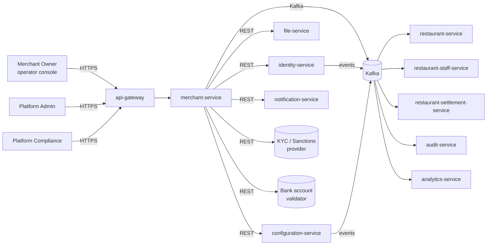

# merchant-service — Software Requirements Specification

## 1. Introduction

This SRS specifies the software behavior of `merchant-service`. It
covers functional requirements, non-functional requirements, data
requirements, API contract summaries, validation, state transitions,
authorization, idempotency, performance, availability, security, and
disaster recovery. The service is the source of truth for the
`Merchant` aggregate.

## 2. Scope

In scope:

- Onboarding (KYC) flow for new merchants.
- Read, update, and lifecycle endpoints for merchants.
- Contact, bank account, and tax management.
- Admin actions: approve, reject, suspend, reinstate, close.
- Payout hold / unhold.
- Event emission (`merchant.*.v1`).
- Audit emission for every state change.

Out of scope:

- Restaurant, branch, menu, staff, or order state (owned by sibling
  services).
- Settlement amounts, payout runs, or actual bank transfers (owned
  by `restaurant-settlement-service` and `payment-service`).
- Identity issuance (owned by `identity-service` and Keycloak).
- Document bytes (owned by `file-service` and object storage).
- User-facing UI (the operator console is owned by the admin web
  app, which calls these APIs).

## 3. System Context

## 4. Actors

- **Merchant Owner (human)** — Keycloak subject with role
  `merchant_owner`.
- **Merchant Finance (human)** — Keycloak subject with role
  `merchant_finance`; read-only access to merchant payout config.
- **Platform Admin (human)** — Keycloak subject with role
  `platform_admin`; full access, including lifecycle.
- **Platform Compliance (human)** — Keycloak subject with role
  `platform_compliance`; read access with flag-for-review action.
- **`identity-service` (system)** — consumes user state events.
- **`restaurant-service` (system)** — reads merchant to validate
  restaurant creation.
- **`restaurant-staff-service` (system)** — reads merchant to scope
  staff assignments.
- **`restaurant-settlement-service` (system)** — reads payout config
  and receives hold events.
- **`admin-service` (system)** — surfaces merchant endpoints to the
  admin console.
- **`audit-service` (system)** — receives audit events.

## 5. Functional Requirements

| ID | Requirement | Priority |
|----|-------------|----------|
| FR--001 | The service MUST accept a `POST /v1/merchants` with legal name, legal form, country, tax IDs, owner identity, primary contact, and (optionally) bank account. | MUST |
| FR--002 | The service MUST validate the request body against a JSON schema and return 400 with field-level `details[]` on failure. | MUST |
| FR--003 | The service MUST call a sanctions screening provider for the legal name, owner name, and country on submission, and store the screening result with the merchant. | MUST |
| FR--004 | The service MUST call a bank account validator on every `PUT /v1/merchants/{id}/bank-account` and reject the change if validation fails. | MUST |
| FR--005 | The service MUST support `POST /v1/merchants/{id}/submit-for-review` (transition `draft → pending_review`) and validate required fields and documents before allowing the transition. | MUST |
| FR--006 | The service MUST allow admins to `POST /v1/merchants/{id}/approve` (transition `pending_review → approved`) only when all required fields, documents, bank account, and a non-blocking sanctions result are present. | MUST |
| FR--007 | The service MUST allow admins to `POST /v1/merchants/{id}/reject` with a required `reason_code` (transition `pending_review → rejected`). | MUST |
| FR--008 | The service MUST allow admins to `POST /v1/merchants/{id}/suspend` with a required `reason_code` and optional `cascade_to_restaurants=true` (transition `approved → suspended`). | MUST |
| FR--009 | The service MUST allow admins to `POST /v1/merchants/{id}/reinstate` with a required `reason_code` (transition `suspended → approved`). | MUST |
| FR--010 | The service MUST allow admins to `POST /v1/merchants/{id}/close` with a required `reason_code` (transition `approved|rejected|suspended → closed`); `closed` is terminal. | MUST |
| FR--011 | The service MUST support contacts CRUD: `POST/GET/PATCH/DELETE /v1/merchants/{id}/contacts[/{cid}]`. | MUST |
| FR--012 | The service MUST support listing KYC documents via `GET /v1/merchants/{id}/documents`; the documents themselves are fetched via `file-service` signed URLs. | MUST |
| FR--013 | The service MUST support payout hold/unhold via `POST /v1/merchants/{id}/payout-hold` and `DELETE /v1/merchants/{id}/payout-hold`; only admins may set/unset holds. | MUST |
| FR--014 | The service MUST auto-expire merchants in `pending_review` for > 90 days via a scheduled job; the transition is `pending_review → expired`. | MUST |
| FR--015 | The service MUST support merchant re-submission after rejection: `POST /v1/merchants/{id}/resubmit` (transition `rejected → pending_review`); previous review notes are preserved. | SHOULD |
| FR--016 | The service MUST cascade suspension of a user to their merchants if `merchant.payout.hold_on_owner_suspend` is true. | MUST |
| FR--017 | The service MUST support cursor pagination on `GET /v1/merchants` with `?state=&country=&q=&cursor=&limit=`. | MUST |
| FR--018 | The service MUST expose `GET /v1/merchants/by-user/{kc_sub}` (system-only) to look up a merchant by owner Keycloak subject. | MUST |
| FR--019 | The service MUST publish a `merchant.*.v1` event for every state transition, with the new state and the actor's `kc_sub`. | MUST |
| FR--020 | The service MUST reject any write operation on a merchant in `closed` state with 410 `ENDPOINT_RETIRED`-equivalent `code: "MERCHANT_CLOSED"`. | MUST |
| FR--021 | The service MUST soft-delete merchants on `close` and retain the record for 7 years; hard delete only after retention. | MUST |
| FR--022 | The service MUST trigger an `admin.audit.merchant.*` event for every admin action (`approve`, `reject`, `suspend`, `reinstate`, `close`, `payout-hold`). | MUST |

## 6. Non-Functional Requirements

| ID | Category | Requirement | Target |
|----|----------|-------------|--------|
| NFR--001 | performance | P99 latency for `GET /v1/merchants/{id}` | < 150 ms (warm cache < 30 ms) |
| NFR--002 | performance | P99 latency for `POST /v1/merchants` (submission) | < 2 s (excluding provider latency) |
| NFR--003 | availability | service uptime | 99.95% over 30 days |
| NFR--004 | scalability | concurrent submissions | ≥ 200 RPS sustained, 1000 RPS burst |
| NFR--005 | scalability | reads from `restaurant-service` lookup | ≥ 5000 RPS via Redis cache |
| NFR--006 | maintainability | MTTR for P1 | < 30 min |
| NFR--007 | data-integrity | zero event loss for state changes | outbox + 24h ack, monitored |
| NFR--008 | latency | sanctions screening call P99 | < 5 s; circuit-open if > 10 s |
| NFR--009 | latency | bank validator call P99 | < 3 s; circuit-open if > 5 s |
| NFR--010 | observability | every state change is queryable in the audit log | 100% |

## 7. API Requirements

The service exposes a REST API under `/v1/merchants[...]` per
[`API_STANDARDS.md`](../../architecture/API_STANDARDS.md). All write
endpoints require an `Idempotency-Key` header. All endpoints return
the standard error envelope. All responses are
`application/json; charset=utf-8`. Pagination is cursor-based by
default. OpenAPI 3.1 spec is published at `/openapi.json` and
Swagger UI at `/docs`.

(Full contracts in `INTEGRATION.md`.)

## 8. Data Requirements

| ID | Requirement | Notes |
|----|-------------|-------|
| DATA--001 | Merchants are uniquely identified by `id UUIDv7`. | primary key |
| DATA--002 | Every mutable table has `created_at`, `updated_at`, `created_by`, `updated_by`, `deleted_at`. | audit |
| DATA--003 | Legal name, owner name, tax ID, and bank account are stored in `confidential` columns with column-level encryption. | PII |
| DATA--004 | `state` is a CHECK-constrained enum: `draft`, `pending_review`, `approved`, `rejected`, `suspended`, `closed`, `expired`. | enum |
| DATA--005 | One merchant per `kc_sub` (the owner) is enforced by a unique partial index on `(owner_kc_sub) WHERE deleted_at IS NULL`. | one-to-one |
| DATA--006 | Contacts are stored in `merchant_contacts` (1..n) with `role` in (`primary`, `ops`, `finance`, `legal`). | sub-entity |
| DATA--007 | Bank accounts are stored in `merchant_bank_accounts` (1..n) with one designated `is_primary`. | sub-entity |
| DATA--008 | KYC documents are metadata only; document bytes live in `file-service`. | cross-service |
| DATA--009 | Sanctions screening results are stored in `merchant_screenings` with `provider`, `result`, `matched_list`, `screened_at`. | audit |
| DATA--010 | All cross-service references (`owner_kc_sub`, `bank_validator_provider_token_id`) are stored as columns without DB-level FKs. | see `CONSISTENCY_STRATEGY.md` |

(Full schema in `ERD.md`.)

## 9. Validation Rules

- `legal_name` — 1..255 chars, Unicode normalized NFC, no control
  characters.
- `country` — ISO-3166-1 alpha-2.
- `tax_id` — regex per jurisdiction, validated against
  `merchant.onboarding.tax_id_patterns.{country}` in
  `configuration-service`.
- `bank_account.iban` — ISO 13616 format and MOD-97 check.
- `contacts[].email` — RFC 5322; lowercased.
- `contacts[].phone` — E.164.
- `documents[].type` — drawn from
  `merchant.onboarding.required_documents.{country}`.
- `reason_code` on admin actions — drawn from
  `merchant.suspension.reason_codes` enum in `configuration-service`.

## 10. State Transitions

The merchant state machine is enforced server-side. The only legal
transitions are:

| From | To | Trigger |
|------|----|---------|
| `draft` | `pending_review` | `POST /v1/merchants/{id}/submit` |
| `pending_review` | `approved` | admin `POST /approve` |
| `pending_review` | `rejected` | admin `POST /reject` |
| `pending_review` | `expired` | cron job (90 days idle) |
| `rejected` | `pending_review` | owner `POST /resubmit` |
| `approved` | `suspended` | admin `POST /suspend` or user cascade |
| `suspended` | `approved` | admin `POST /reinstate` |
| `approved` | `closed` | admin `POST /close` |
| `suspended` | `closed` | admin `POST /close` |
| `rejected` | `closed` | admin `POST /close` |
| `closed` | — | terminal |

State transitions are described in detail in `WORKFLOWS.md`.

## 11. Authorization Requirements

- `merchant_owner` may read/update their own merchant; may submit
  contacts, bank account, and tax info; may not transition to
  `approved` or `suspended`.
- `merchant_finance` may read their own merchant; may update the
  primary bank account subject to validation.
- `merchant_ops` may read/update their own merchant; may add/remove
  contacts.
- `platform_admin` has full read/write across all merchants and may
  perform all lifecycle transitions.
- `platform_compliance` has read across all merchants and may flag
  for review (which sets an internal `needs_enhanced_due_diligence`
  flag but does not change state).
- All admin actions are subject to a request signature (HMAC-SHA256)
  per `API_STANDARDS.md` §14.
- All write operations are subject to resource-level ownership
  checks at the service layer.

## 12. Configuration Requirements

Keys consumed from `configuration-service`:

- `merchant.onboarding.required_documents.{country}` — array of
  required document types.
- `merchant.onboarding.tax_id_patterns.{country}` — regex per
  jurisdiction.
- `merchant.onboarding.sla_hours` — target approval SLA.
- `merchant.review.auto_approval_enabled` — boolean.
- `merchant.review.required_kyc_score` — int threshold.
- `merchant.suspension.reason_codes` — enum list.
- `merchant.suspension.grace_period_hours` — int.
- `merchant.payout.hold_on_owner_suspend` — boolean.
- `merchant.payout.bank_change_window_hours` — int (block changes
  while a payout is in flight).
- `merchant.bank.min_supported_currencies` — array<string>.
- `merchant.rate_limit.submit_per_hour` — int.
- `merchant.api.rate_limit_per_user` — int.

## 13. Error Handling

| Error | Response |
|-------|----------|
| Missing/invalid JWT | 401 `UNAUTHENTICATED` |
| Insufficient role | 403 `FORBIDDEN` |
| Body validation failure | 400 `VALIDATION_FAILED` with `details[]` |
| Missing required KYC document | 422 `KYC_INCOMPLETE` |
| Sanctions match | 422 `SANCTIONS_MATCH` |
| Bank validation failure | 422 `BANK_INVALID` |
| Illegal state transition | 409 `STATE_INVALID` |
| Write on `closed` merchant | 410 `MERCHANT_CLOSED` |
| Idempotency key reused with different body | 422 `IDEMPOTENCY_KEY_REUSED` |
| Rate limited | 429 `RATE_LIMITED` |
| Downstream (KYC/Bank) timeout | 503 `DEPENDENCY_TIMEOUT` |
| Circuit open on KYC/Bank | 503 `CIRCUIT_OPEN` |
| Any other failure | 500 `INTERNAL_ERROR` with `correlationId` |

## 14. Concurrency Requirements

- Two concurrent `submit` calls for the same `kc_sub` MUST result in
  a single merchant (enforced by unique partial index on
  `owner_kc_sub`).
- Two concurrent admin lifecycle actions on the same merchant MUST
  be serialized via row-level lock (`SELECT ... FOR UPDATE`); the
  second one receives 409 `STATE_INVALID` if the first changed the
  state.
- Bank account changes are serialized via row-level lock to prevent
  races between update and validation.

## 15. Idempotency Requirements

- `POST /v1/merchants` requires `Idempotency-Key`. The
  `(kc_sub, idempotency_key)` pair is stored for 24 h; a replay
  returns the original response if the body hash matches.
- All admin actions (`approve`, `reject`, `suspend`, `reinstate`,
  `close`, `payout-hold`) require `Idempotency-Key`.
- Event production uses the outbox pattern; replays of the same
  state change are deduplicated by `event_id`.

## 16. Performance

- Dominant path: `GET /v1/merchants/by-user/{kc_sub}` (hot for
  `restaurant-service`). P50 < 5 ms (cache hit), P99 < 30 ms.
- `GET /v1/merchants/{id}`: P50 < 30 ms, P99 < 150 ms.
- `POST /v1/merchants` (submission): P50 < 800 ms, P99 < 2 s
  (excluding provider latency).
- Sanctions screening: synchronous call, P99 < 5 s; circuit-open
  after 5 consecutive failures or 50% error rate over 30 s; when
  open, submission is rejected with 503 `CIRCUIT_OPEN` to avoid
  approving unscreened merchants.
- Bank validation: same as above with P99 < 3 s; circuit-open after
  5 consecutive failures.

## 17. Scalability

- Horizontal: HPA on CPU > 60% and `http_requests_in_flight >
  500/replica`; max 12 replicas.
- Vertical: up to 4 CPU / 8 GiB per pod.
- DB: 1 primary + 1 read replica in each region.
- Redis cache: 60 s TTL on `merchant:by_user:{kc_sub}` and
  `merchant:by_id:{id}`.
- Outbox poller: scales independently (separate deployment unit)
  with backpressure to Postgres replication slot.

## 18. Availability

- SLO: 99.95% over 30 days (Tier-1).
- Error budget: ~22 min / 30 days.
- Maintenance window: Sunday 04:00–06:00 UTC (announced ≥ 7 days in
  advance; no customer-facing impact expected).
- Multi-region: primary in `eu-west` and `ap-southeast`; cross-region
  read replicas where data residency allows.

## 19. Security

| ID | Requirement | Notes |
|----|-------------|-------|
| SEC--001 | All endpoints require a valid JWT bearer token; service-to-service uses `client_credentials`. | gateway enforced |
| SEC--002 | All admin actions require an `X-Audit-Reason` header and are subject to HMAC-SHA256 request signing. | `API_STANDARDS.md` §14 |
| SEC--003 | All PII fields (legal name, tax ID, bank account, contact phone/email) are column-level encrypted with envelope encryption and per-tenant DEK. | `SECURITY_ARCHITECTURE.md` §6 |
| SEC--004 | All reads of PII fields are logged at `info` level with `actor`, `merchant_id`, `field`. | audit |
| SEC--005 | PII export (admin/support) requires a reason code in the `X-Audit-Reason` header and is recorded in `audit-service`. | `SECURITY_ARCHITECTURE.md` §7 |
| SEC--006 | Bank account numbers are stored encrypted; raw values are never returned in API responses (only the last 4 chars). | PCI scope avoidance |
| SEC--007 | Rate limiting is enforced at the gateway (per-user, per-IP) and at the service (defense in depth). | `API_STANDARDS.md` §12 |
| SEC--008 | All admin actions are co-signed by a second admin for `suspend` and `close` (break-glass). | `SECURITY_ARCHITECTURE.md` §3 |
| SEC--009 | All cross-service calls use mTLS in-cluster and a `client_credentials` JWT. | defense in depth |
| SEC--010 | Secrets are stored only in Vault; never in source control or environment files. | pre-commit enforced |

## 20. Privacy

- PII stored: legal name, tax ID, owner name, contact name/phone/
  email, bank account, country of registration.
- Retention: merchants are soft-deleted on `close`; the record is
  retained for 7 years (financial), then hard-deleted.
- Erasure (GDPR right-to-erasure): financial records (settlements,
  tax IDs) are retained per legal requirements, but identifying
  fields are pseudonymized after the retention window.

## 21. Auditability

- Every state transition emits a `merchant.*.v1` event with the
  actor's `kc_sub`, the previous state, the new state, the reason
  (if any), and a `correlation_id`.
- Every admin action emits an `admin.audit.merchant.*` event with
  the same envelope plus the request signature id.
- PII reads emit `merchant.pii.access.v1` events at `info` level,
  consumed by `audit-service`.
- Audit retention: 7 years.

## 22. Observability

- Logs: JSON to stdout, fields per `OBSERVABILITY.md`. State
  transitions include `merchant_id`, `from_state`, `to_state`,
  `actor`, `reason_code`.
- Metrics:
  - RED: `http_requests_total`, `http_request_duration_seconds`,
    `http_requests_in_flight`.
  - Business: `merchants_created_total{country}`,
    `merchants_approved_total{country}`,
    `merchants_suspended_total{reason}`,
    `merchant_approval_seconds` (histogram),
    `kyc_provider_call_seconds`,
    `kyc_provider_failure_total{reason}`,
    `bank_validator_call_seconds`,
    `outbox_pending_total`.
- Traces: OpenTelemetry auto-instrumented. Sample 100% on errors,
  10% on success in production; 100% in staging.
- Alerts:
  - SLO burn rate > 2x over 1 h.
  - Outbox pending > 1000 for 5 min.
  - KYC provider circuit open > 5 min.
  - Sanctions screening error rate > 5% over 5 min.
  - Approval latency P95 > 48 h.

## 23. Maintainability

- Code style: TypeScript strict, ESLint, Prettier.
- Test coverage: ≥ 85% lines, ≥ 75% branches.
- Documentation: this folder is the source of truth for the
  service's contract; `INTEGRATION.md` and `WORKFLOWS.md` MUST be
  kept up to date with code changes.

## 24. Disaster Recovery

- RPO: 5 minutes (continuous WAL archiving; PITR window 30 days for
  Tier-1).
- RTO: 30 minutes (warm standby in secondary region; restore from
  PITR if needed).
- Quarterly restore drill in staging; documented in the platform's
  IR runbook.

## 25. Acceptance Criteria

- AC-1: A new merchant can be submitted, screened, and approved end
  to end in < 48 h for the median case.
- AC-2: All admin actions are recorded with reason and actor; the
  audit log is queryable.
- AC-3: A suspended merchant's downstream services (`restaurant-
  service`, `restaurant-settlement-service`) receive the suspension
  event within 60 s.
- AC-4: PII is encrypted at rest and in transit; a security review
  confirms.
- AC-5: The service meets its 99.95% SLO for 3 consecutive months.
- AC-6: The OpenAPI spec is up to date and validated in CI.
- AC-7: All state transitions are emitted as events; a synthetic
  test exercises every transition.
- AC-8: The reconciliation job detects any merchant that exists
  with a sanctions match (zero false negatives).
- AC-9: Bank account changes are validated and require a verified
  primary account before approval.
- AC-10: The service deploys and rolls back independently of all
  other services.

---

## See also

### Sibling docs for this service

- [`README.md`](./README.md) — purpose, bounded context, responsibilities
- [`BRD.md`](./BRD.md) — business requirements
- [`SRS.md`](./SRS.md) — functional + non-functional requirements
- [`ERD.md`](./ERD.md) — data model (entities, relationships)
- [`INTEGRATION.md`](./INTEGRATION.md) — inter-service contracts (APIs, events, sagas)
- [`WORKFLOWS.md`](./WORKFLOWS.md) — operational workflows (happy paths, failure modes)
- [`TECH.md`](./TECH.md) — technology profile (runtime, libraries, data layer, admin endpoints, RBAC)

### Platform-wide

- [`../../shared/README.md`](../../shared/README.md) — `platform-spring-boot-starter` shared library (the single source of cross-cutting code for all Spring Boot services in the platform)
- [`../RECOMMENDATIONS.md`](../RECOMMENDATIONS.md) — platform-wide technology map (language, framework, version baseline, admin/RBAC pattern)
- [`../../README.md`](../../README.md) — services overview (the catalog of all 58 services)
- [`../../../main.md`](../../../main.md) — top-level platform specification (architecture, Keycloak, PostgreSQL 18, messaging, observability baseline)

