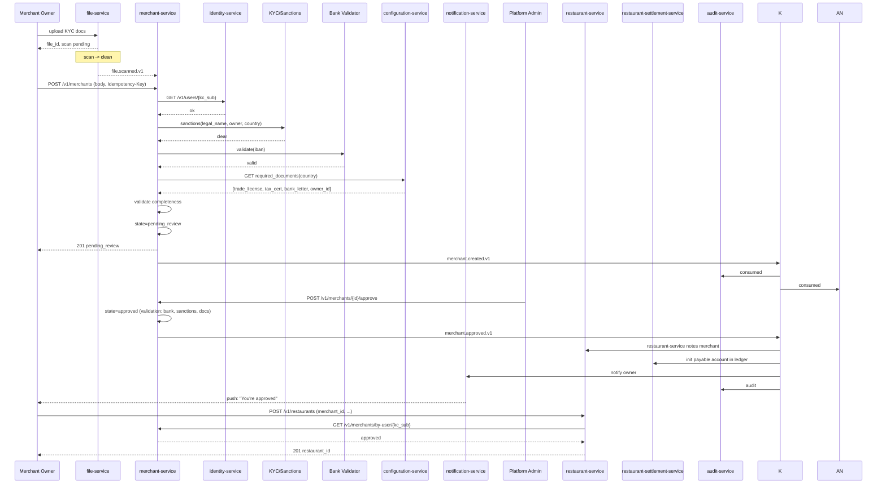
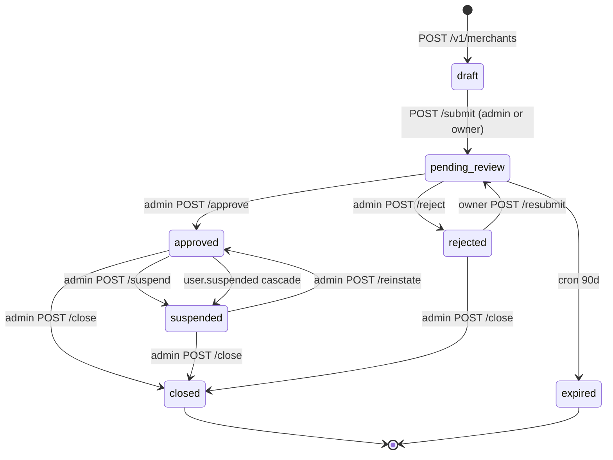
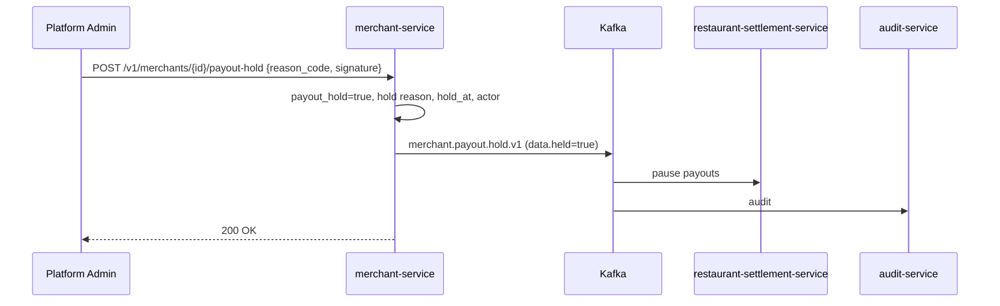

# merchant-service — Workflows

## 1. Merchant Onboarding (KYC Submission and Approval)

### 1.1 Objective

A prospective merchant owner submits a complete KYC application,
the service screens them against sanctions and validates the bank
account, an admin reviews and approves, and the merchant becomes
`approved` — at which point a `merchant.approved.v1` event is
emitted that downstream services (e.g. `restaurant-service`)
consume to enable restaurant creation.

### 1.2 Initiating Actor

`merchant_owner` (human) — the legal signatory.

### 1.3 Participating Services

- `merchant-service` (this service).
- `identity-service` (subject verification).
- `file-service` (KYC document storage and virus scan).
- KYC / sanctions provider (external).
- Bank validator (external).
- `configuration-service` (required documents, tax-id patterns).
- `notification-service` (welcome, rejection, approval).
- `restaurant-service` (downstream consumer of `merchant.approved`).
- `restaurant-settlement-service` (init payable account on approval).
- `audit-service` (audit log).

### 1.4 Prerequisites

- A Keycloak user with role `merchant_owner` exists.
- A `file.uploaded.v1` event has been emitted for each required
  document (the owner uploaded them via the operator console,
  which calls `file-service` directly).
- The sanctions provider is available; the bank validator is
  available.
- `configuration-service` has the required document list and
  tax-id pattern for the country.

### 1.5 Happy Path



### 1.6 Alternate Paths

- **Owner has incomplete documents**: `POST /v1/merchants` returns
  422 `KYC_INCOMPLETE` with `details[]` listing the missing types.
  Owner is notified via the operator console (not by the service).
- **Sanctions match**: 422 `SANCTIONS_MATCH`; merchant is NOT
  created. The owner is notified to contact compliance. The
  screening result is stored for audit. A high-priority ticket is
  opened in `support-service`.
- **Bank account validation failure**: 422 `BANK_INVALID`. The
  owner is asked to correct.
- **Re-submission after rejection**: the owner calls
  `POST /v1/merchants/{id}/resubmit` (transition
  `rejected → pending_review`); the previous `reason_code` is
  preserved in the audit log.
- **Auto-approval (low-risk)**: if
  `merchant.review.auto_approval_enabled` is true and the KYC score
  is above `merchant.review.required_kyc_score`, the service may
  approve without manual review; this is logged as
  `actor_kc_sub = "system:auto-approval"`.

### 1.7 Failure Paths

- **`identity-service` unreachable**: 503 `DEPENDENCY_TIMEOUT`;
  client retries. Outbox is unaffected.
- **KYC provider timeout / circuit open**: 503 `CIRCUIT_OPEN`; the
  merchant is NOT created to avoid approving unscreened
  applicants. The owner is asked to retry later.
- **Bank validator timeout / circuit open**: 503 `CIRCUIT_OPEN`;
  the merchant is NOT created. The owner is asked to retry.
- **Outbox publish failure**: the outbox row remains
  (`published_at IS NULL`); the poller retries. If persistent
  failure, the row goes to `merchant.outbox.dlq` and the on-call
  is paged.
- **Consumer (`restaurant-service`) down**: the event is queued in
  Kafka; the consumer catches up when it recovers. Lag is
  monitored; the SLA is ≤ 60 s propagation (per BR--005).

### 1.8 Business Rules

- A merchant is approvable only when:
  - State is `pending_review`.
  - Sanctions result is `clear` (not `match` or `review`).
  - At least one verified primary bank account is on file.
  - All required documents for the country are uploaded and
    `scan_status = 'clean'`.
  - At least one contact with `role = 'primary'` exists.
- Admin `approve`/`reject`/`suspend`/`reinstate`/`close` all
  require a `reason_code` from the platform-managed enum.
- Suspension of the owner user cascades to all their approved
  merchants if `merchant.payout.hold_on_owner_suspend` is true.

### 1.9 State Transitions



### 1.10 Events

| Event | Direction | When |
|-------|-----------|------|
| `merchant.created.v1` | produced | `POST /v1/merchants` |
| `merchant.updated.v1` | produced | any PATCH on legal/tax/contact |
| `merchant.approved.v1` | produced | `POST /approve` |
| `merchant.rejected.v1` | produced | `POST /reject` |
| `merchant.suspended.v1` | produced | `POST /suspend` or cascade |
| `merchant.reinstated.v1` | produced | `POST /reinstate` |
| `merchant.closed.v1` | produced | `POST /close` |
| `merchant.payout.hold.v1` | produced | `POST/DELETE /payout-hold` |
| `identity.user.created.v1` | consumed | new owner user |
| `identity.user.suspended.v1` | consumed | owner suspension cascade |
| `configuration.updated.v1` | consumed | cache invalidation |

### 1.11 APIs Involved

| API | Direction | When |
|-----|-----------|------|
| `POST /v1/merchants` | inbound | submission |
| `POST /v1/merchants/{id}/submit` | inbound | move to review |
| `POST /v1/merchants/{id}/approve` | inbound | admin approval |
| `GET /v1/users/{kc_sub}` to identity-service | outbound | subject verification |
| KYC/sanctions API | outbound | screening |
| Bank validator API | outbound | IBAN validation |
| `GET /v1/configurations/{key}` to configuration-service | outbound | load onboarding config |
| `GET /v1/merchants/by-user/{kc_sub}` from `restaurant-service` | inbound | downstream lookup |

### 1.12 Compensation / Rollback

- **Approval fails after `merchant.created.v1` but before
  `merchant.approved.v1`** (rare; e.g. DB failure mid-transaction):
  the entire transaction rolls back; no event is emitted; the
  merchant remains in `pending_review` or moves to a transient
  error state. The outbox row is rolled back with the transaction
  (atomicity guarantee).
- **Admin accidentally approves the wrong merchant**: admin issues
  `POST /suspend` with `reason_code = "admin_error"`. The audit
  log captures the chain. There is no "undo approve" — the
  merchant's downstream services have already received
  `merchant.approved.v1` and may have created state. Suspension is
  the correct compensating action.

### 1.13 Final State

On success: merchant is `approved`; the event is delivered to
`restaurant-service` and `restaurant-settlement-service` within
60 seconds. The owner receives a "You're approved" push. From this
state the owner can create restaurants.

## 2. Merchant Suspension (Admin or Cascade)

### 2.1 Objective

Take a merchant offline and propagate the suspension to all
downstream services (restaurants, settlements) so no new orders
are accepted and payouts are paused.

### 2.2 Initiating Actor

`platform_admin` (direct) or `identity-service` (cascade from user
suspension).

### 2.3 Participating Services

- `merchant-service` (this service).
- `restaurant-service` (consumer — cascades to restaurants).
- `branch-service` (consumer via restaurant cascade).
- `restaurant-settlement-service` (consumer — pauses payouts).
- `payment-service` (consumer — flags merchant in fraud rules).
- `notification-service` (notifies owner).
- `audit-service`.

### 2.4 Prerequisites

- Merchant is in `approved` state.
- Admin action has a `reason_code` and is signed
  (HMAC-SHA256); for cascade, the originating event has
  `identity-service` as the actor.

### 2.5 Happy Path

```mermaid
sequenceDiagram
    participant ADM as Platform Admin
    participant MER as merchant-service
    participant K as Kafka
    participant RES as restaurant-service
    participant RSM as restaurant-settlement-service
    participant PAY as payment-service
    participant NOT as notification-service
    participant AUD as audit-service
    participant OWN as Merchant Owner

    ADM->>MER: POST /v1/merchants/{id}/suspend {reason_code, cascade=true, signature}
    MER->>MER: SELECT FOR UPDATE; state=approved
    MER->>MER: state=suspended
    MER->>MER: emit merchant.suspended.v1 (outbox)
    MER->>MER: emit admin.audit.merchant.suspend.v1
    MER-->>ADM: 200 OK
    K->>RES: consume merchant.suspended.v1
    RES->>RES: cascade to all restaurants (set suspended)
    K->>RSM: consume merchant.suspended.v1
    RSM->>RSM: pause payouts, mark pending
    K->>PAY: consume merchant.suspended.v1
    PAY->>PAY: flag merchant in fraud rules
    K->>NOT: consume merchant.suspended.v1
    NOT-->>OWN: push + email: "Your account is suspended"
    K->>AUD: audit
    Note over K: propagation SLA ≤ 60s
```

### 2.6 Alternate Paths

- **Admin chooses `cascade_to_restaurants = false`**: only the
  merchant is suspended; restaurants continue. This is rare and
  used only when the issue is purely merchant-level (e.g. tax
  filing overdue, no operational impact).
- **Cascade from user suspension**: the same code path runs; the
  actor is recorded as `system:cascade` and the `reason_code` is
  `owner_suspended`.

### 2.7 Failure Paths

- **Outbox publish failure**: the outbox row is retried by the
  poller. If persistent, it goes to DLQ and the on-call is paged.
  The merchant is in `suspended` state in the local DB but the
  event is not yet delivered; the reconciliation job in
  `reporting-service` detects the drift and re-emits.
- **Consumer lag**: a downstream service is slow. The lag is
  monitored (`kafka_consumer_lag{topic="merchant.merchant.suspended"}`).
  If the lag exceeds 60 s, the on-call is alerted.
- **Admin double-clicks suspend**: the second call is rejected
  with 409 `STATE_INVALID` (already suspended).

### 2.8 Business Rules

- Suspension requires `reason_code` and (for admin) a signature.
- Break-glass: `suspend` and `close` require a second admin's
  co-signature (verified via the `X-Co-Sign` header containing a
  second valid JWT).
- The suspension propagates to all `approved` restaurants under
  the merchant; restaurants in `closed` state are not affected.

### 2.9 State Transitions

See the state diagram in §1.9; the relevant transition is
`approved → suspended` (or `suspended → closed` if followed by a
close).

### 2.10 Events

| Event | Direction | When |
|-------|-----------|------|
| `merchant.suspended.v1` | produced | state set to `suspended` |
| `admin.audit.merchant.suspend.v1` | produced | admin action recorded |
| `identity.user.suspended.v1` | consumed | triggers cascade (if enabled) |

### 2.11 APIs Involved

| API | Direction | When |
|-----|-----------|------|
| `POST /v1/merchants/{id}/suspend` | inbound | admin action |
| `GET /v1/merchants/by-user/{kc_sub}` | inbound (read) | cascade handler |
| `GET /v1/merchants/{id}` | inbound (read) | any downstream lookup |

### 2.12 Compensation / Rollback

- **Re-instatement**: admin calls `POST /reinstate` with a reason.
  The state transitions to `approved`; `merchant.reinstated.v1`
  is emitted; downstream services (via the event) re-enable the
  merchant and its restaurants.

### 2.13 Final State

On success: merchant is `suspended`; the suspension is propagated
to all downstream services within 60 s; payouts are paused; the
owner is notified.

## 3. Payout Hold / Unhold

### 3.1 Objective

Allow finance or admin to freeze merchant payouts without changing
the merchant's `approved` state — for example, during a fraud
investigation.

### 3.2 Initiating Actor

`platform_admin` (only).

### 3.3 Participating Services

- `merchant-service` (this service).
- `restaurant-settlement-service` (consumer — pauses payouts).
- `audit-service`.

### 3.4 Prerequisites

- Merchant is in `approved` state.
- Admin action has `reason_code`.

### 3.5 Happy Path



### 3.6 Alternate Paths

- **Unhold**: `DELETE /v1/merchants/{id}/payout-hold` (with reason
  in the body); emits `merchant.payout.hold.v1` with
  `data.held = false`.

### 3.7 Failure Paths

- **Outbox failure**: same as §2.7.

### 3.8 Business Rules

- Hold does not change merchant `state`; the merchant remains
  `approved`. Orders may still be accepted (unless the merchant is
  also `suspended`).
- A hold may be set on a `suspended` merchant to ensure that
  pending settlements are also paused.

### 3.9 State Transitions

The `payout_hold` boolean is independent of the lifecycle state
machine. There is no separate state diagram; only the boolean
toggles.

### 3.10 Events

| Event | Direction | When |
|-------|-----------|------|
| `merchant.payout.hold.v1` | produced | set or clear hold |

### 3.11 APIs Involved

| API | Direction | When |
|-----|-----------|------|
| `POST /v1/merchants/{id}/payout-hold` | inbound | set hold |
| `DELETE /v1/merchants/{id}/payout-hold` | inbound | clear hold |

### 3.12 Compensation / Rollback

- **Unhold** is the compensation. It restores normal settlement.

### 3.13 Final State

Payouts are paused while the hold is in effect; they resume on
unhold.

---

## See also

### Sibling docs for this service

- [`README.md`](./README.md) — purpose, bounded context, responsibilities
- [`BRD.md`](./BRD.md) — business requirements
- [`SRS.md`](./SRS.md) — functional + non-functional requirements
- [`ERD.md`](./ERD.md) — data model (entities, relationships)
- [`INTEGRATION.md`](./INTEGRATION.md) — inter-service contracts (APIs, events, sagas)
- [`WORKFLOWS.md`](./WORKFLOWS.md) — operational workflows (happy paths, failure modes)
- [`TECH.md`](./TECH.md) — technology profile (runtime, libraries, data layer, admin endpoints, RBAC)

### Platform-wide

- [`../../shared/README.md`](../../shared/README.md) — `platform-spring-boot-starter` shared library (the single source of cross-cutting code for all Spring Boot services in the platform)
- [`../RECOMMENDATIONS.md`](../RECOMMENDATIONS.md) — platform-wide technology map (language, framework, version baseline, admin/RBAC pattern)
- [`../../README.md`](../../README.md) — services overview (the catalog of all 58 services)
- [`../../../main.md`](../../../main.md) — top-level platform specification (architecture, Keycloak, PostgreSQL 18, messaging, observability baseline)

