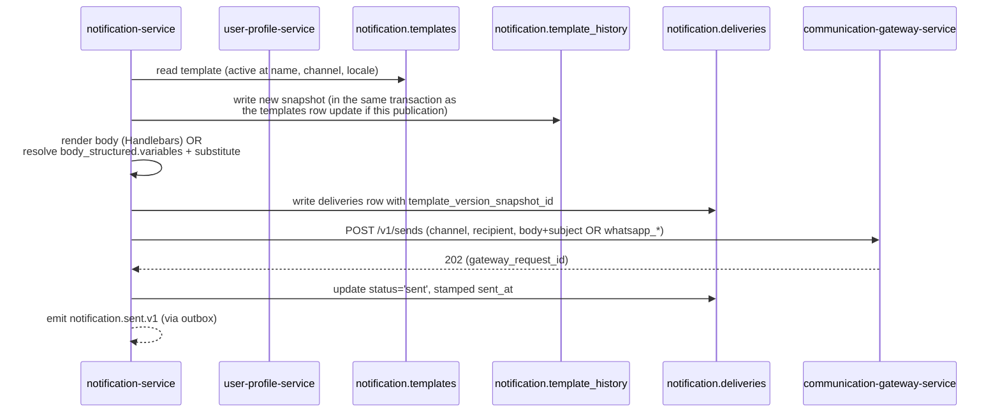

# notification-service — Message history (per-delivery snapshot binding)

> Companion to [`TEMPLATE_HISTORY.md`](./TEMPLATE_HISTORY.md)
> (the upstream immutable snapshot) and
> [`WHATSAPP_TEMPLATES.md`](./WHATSAPP_TEMPLATES.md) (the
> structured-template model). This document is the single
> source for *how* a `notification.deliveries` row binds to
> the exact template version that was rendered for it, plus
> the retention and right-to-erasure interplay.

## 1. The audit chain

The full chain from the mutable logical `templates` row to
the per-recipient delivery:

```
templates (logical row, mutable)
  └─ id, version
       │
       ▼
template_history (immutable snapshot, append-only)
  └─ id, template_id, version, body / body_structured / provider_* / approved_by
       │
       │ (denormalised at render time)
       ▼
notification.deliveries (audit bound to the snapshot)
  └─ template_id, template_version_snapshot_id, rendered_template_version,
     rendered_template_type, rendered_provider_template_id,
     rendered_provider_template_language,
     rendered_subject_encrypted (BYTEA), rendered_body_encrypted (BYTEA)
```

The two-way join — `template_history.id = deliveries.template_version_snapshot_id`
— answers *"what was actually sent?"* without ambiguity, even
if the logical `templates` row was subsequently edited,
disabled, or retired.

## 2. `deliveries.template_version_snapshot_id`

The column is `UUID NULL`. It is:

- NOT NULL for every delivery created under v1.1.
- May be NULL only for legacy deliveries created before v1.1
  (the discriminator CHECK does NOT enforce NOT NULL because
  legacy rows may exist; the application populates it on
  every new delivery).
- A reference — not a database foreign key — to
  `notification.template_history.id`. Per
  `DATA_OWNERSHIP.md` cross-service / cross-table references
  from a partitioned table to an append-only table use UUID
  columns without FKs to keep partition operations fast.

The matching denormalisations on the delivery row:

| Column | Source | Notes |
|--------|--------|-------|
| `template_version_snapshot_id` | snapshot ID | set at render time |
| `rendered_template_version` | `template_history.version` | pure denormalised version int |
| `rendered_template_type` | `template_history.template_type` | `plain` or `whatsapp_structured` |
| `rendered_provider_template_id` | `template_history.provider_template_id` | for `channel='whatsapp'` |
| `rendered_provider_template_language` | `template_history.provider_template_language` | for `channel='whatsapp'` |

These denormalised fields let analytics and support dashboards
filter/aggregate on WhatsApp-specific attributes without joining
back to `template_history`.

## 3. Render pipeline

The render happens just before the gateway call:



Atomicity guarantees:

- The `template_history` insert and the `templates` row update
  share a transaction (or are pre-existing for a reuse path).
- The `deliveries` insert and the gateway call share a logical
  saga: if the gateway call fails, the delivery row is marked
  `failed` and `template_version_snapshot_id` remains (so
  retries can be reconstructed against the same template bytes).
- On retry the snapshot ID is the SAME (stable across retries
  for idempotency).

## 4. WhatsApp-specific denormalisations

For `channel='whatsapp'`, the delivery row also captures the
provider-side identifiers as they stand at send time:

| Column | When populated |
|--------|----------------|
| `rendered_template_type` | always — set to `whatsapp_structured` |
| `rendered_provider_template_id` | always — e.g. `tpl_ABC123xyz` from `template_history.provider_template_id` |
| `rendered_provider_template_language` | always — e.g. `ar_SA` |
| `rendered_body_encrypted` | the post-substitution JSON bytes of `body_structured` (header/body/footer/buttons/variables with values applied) |

The discriminator CHECK `deliveries_whatsapp_provider_template_required_chk`
enforces: a WhatsApp delivery MUST carry
`rendered_provider_template_id`. This guards against a future
code path that forgets to denormalise the provider template id
and breaks downstream analytics reconciliation.

## 5. Retention interplay with right-to-erasure

`POST /v1/admin/erasure/{user_id}` redacts a user's history
without touching the template audit chain.

```sql
BEGIN;
-- 1) Null out the recipient link on every delivery row.
UPDATE notification.deliveries
   SET user_id = NULL,
       rendered_subject_encrypted = NULL,
       rendered_body_encrypted = NULL,
       updated_at = now()
 WHERE user_id = $user_id;

-- 2) Anonymise preferences.
UPDATE notification.preferences
   SET deleted_at = now()
 WHERE user_id = $user_id;

-- 3) DO NOT touch notification.template_history —
--    the table contains no PII (only admin sub UUIDs).
COMMIT;
```

This preserves the audit chain intact (template versions stay
visible) while removing every PII byte about the recipient.
Legacy deliveries (pre-v1.1) with NULL
`template_version_snapshot_id` are still redacted — they
simply lose their body.

## 6. Retention policy summary

| Object | Retention | Purged by |
|--------|-----------|-----------|
| `deliveries.rendered_body_encrypted` (BYTES) | 90 days | job: `UPDATE SET rendered_body_encrypted = NULL WHERE created_at < now() - interval '90 days'` |
| `deliveries` row (status only, no body) | 1 year | partition drop at 1 year on the `created_at` partition |
| `deliveries.template_version_snapshot_id` | 1 year | follows the row |
| `template_history` row | indefinite (audit policy) | explicit `audit-service` retention run only |
| `comms_gateway.sends.body_encrypted` (gateway side) | 90 days | partition drop at 90 days |
| `comms_gateway.sends.whatsapp_template_components_encrypted` | 90 days | follows the gateway `sends` row |

Note that `template_history` is the *primary* audit object after
the 90-day body purge — so when the rendered body is gone from
`deliveries`, support can still recover the exact template
content (and variable names, head/footer/buttons, etc.) from
the snapshot.

## 7. Operational query patterns

### 7.1 "What was sent to user U at time T?" (basic)

```sql
SELECT d.id, d.template_name, d.channel, d.locale,
       th.body, th.body_structured, th.provider_template_id,
       th.approved_by, th.published_by
  FROM notification.deliveries d
  JOIN notification.template_history th
    ON th.id = d.template_version_snapshot_id
 WHERE d.user_id = $user_id
   AND d.created_at BETWEEN $from AND $to
 ORDER BY d.created_at DESC;
```

Backed by `deliveries_user_created_idx` ×
`deliveries_template_history_idx`.

### 7.2 "Has the user's locale ever differed from what they read?"

Walks `user-profile-service` locale through the delivery
`locale`. Useful for a UX-A/B-test analysis.

### 7.3 "Did this WhatsApp delivery use a paused template?"

```sql
SELECT d.id, d.created_at, th.provider_template_status,
       th.provider_template_id, d.failure_reason
  FROM notification.deliveries d
  JOIN notification.template_history th
    ON th.id = d.template_version_snapshot_id
 WHERE d.channel = 'whatsapp'
   AND th.provider_template_status IN ('paused', 'rejected', 'retired')
   AND d.created_at > now() - interval '24 hours';
```

This is the operational query used to identify "we sent
WhatsApp using a template that was paused shortly after".

## 8. Events emitted for analytics / audit

| Event | Trigger | Carries snapshot binding |
|-------|---------|---------------------------|
| `notification.sent.v1` | first provider ack | `notification_id`, `template_name`, `channel`, `locale`; the `template_version_snapshot_id` is recorded on the originating delivery row but NOT in the event payload (kept slim for high volume) |
| `notification.delivered.v1` | delivery webhook | same |
| `notification.read.v1` | WhatsApp read webhook | same |
| `notification.failed.v1` | persistent failure | `failure_reason` (e.g. `TEMPLATE_NOT_APPROVED`) |
| `notification.suppressed.v1` | dedup / quiet-hours / opt-out | no snapshot binding needed (template was never rendered) |
| `notification.template.published.v1` | publication | `template_history_id`, `template_id`, `provider_template_id`, `diff_summary`, `published_by`, `approved_by` |

The `audit-service` consumer joins `deliveries.id` to
`notification.sent.v1` via the `notification_id` cross-ref,
and to `template_history.id` via
`deliveries.template_version_snapshot_id`, giving a complete
audit chain in three hops.

## 9. Acceptance criteria

A v1.1 implementation is "done" when:

- Every new `deliveries` row carries
  `template_version_snapshot_id`; the column is non-null in 100%
  of rows created after deployment.
- A delivery row never carries an obsolete or null snapshot
  ID at rest (the application refuses to write a delivery
  row without a snapshot ID for `channel != 'legacy'`).
- The right-to-erasure endpoint erases recipient bytes from
  `deliveries` while leaving `template_history` rows untouched.
- The CHECK constraints (`deliveries_whatsapp_provider_template_required_chk`,
  `deliveries_read_only_whatsapp_chk`, the WhatsApp conditional
  in `deliveries.template_history_idx`) all pass on the test
  suite for both empty and populated tables.
- The `deliveries.template_history_idx` query plan stays
  bounded by snapshot ID cardinality (constant-time lookups
  in the support view).

---

## See also

### Sibling docs for this service

- [`README.md`](./README.md) — purpose, bounded context, responsibilities
- [`BRD.md`](./BRD.md) — business requirements (BR--030, BR--034, BR--036, BR--044, BR--054)
- [`SRS.md`](./SRS.md) — functional + non-functional requirements (FR--046, FR--054, DATA--032)
- [`ERD.md`](./ERD.md) — data model (delivery row columns, partition strategy, retention)
- [`INTEGRATION.md`](./INTEGRATION.md) — inter-service contracts (render flow + emitted events)
- [`WHATSAPP_TEMPLATES.md`](./WHATSAPP_TEMPLATES.md) — structured-template model (the upstream)
- [`TEMPLATE_HISTORY.md`](./TEMPLATE_HISTORY.md) — audit table (the upstream)
- [`PLAN.md`](./PLAN.md) — implementation tracker

### Platform-wide

- [`../../shared/PLATFORM_BASELINE.md`](../../shared/PLATFORM_BASELINE.md) — single source for PostgreSQL 18, Kafka, Keycloak, etc.
- [`../../README.md`](../../README.md) — services overview
- [`../../../main.md`](../../../main.md) — top-level platform specification
