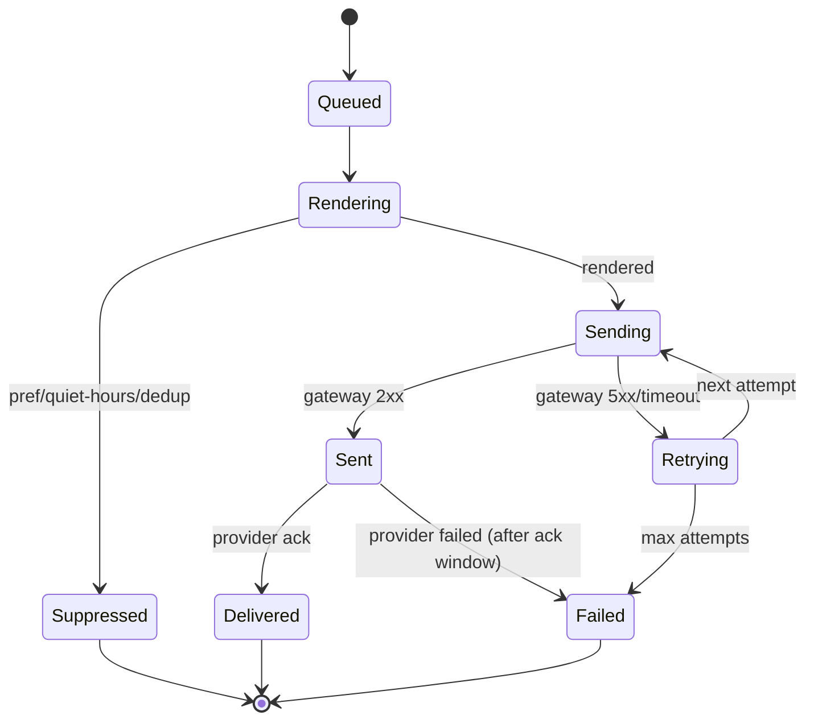

# notification-service — Software Requirements Specification

## 1. Introduction

This SRS specifies, for the engineering team, the functional,
non-functional, data, security, and operational requirements of
`notification-service`. It is derived from `BRD.md` and from the
platform's cross-service architecture (`API_STANDARDS.md`,
`DATABASE_ARCHITECTURE.md`, `EVENT_ARCHITECTURE.md`,
`SECURITY_ARCHITECTURE.md`, `OBSERVABILITY.md`).

## 2. Scope

In scope:

- All REST endpoints listed in `INTEGRATION.md` (send, read,
  preferences, admin templates, admin deliveries).
- Template rendering, locale selection, channel selection.
- Preference honoring, quiet hours, suppression.
- Dedup window.
- Retry / DLQ on transient / persistent failure.
- Outbound events `notification.sent.v1`,
  `notification.failed.v1`, `notification.suppressed.v1`.
- Consumption of domain events that produce notifications.

Out of scope:

- Provider credentials, provider health, raw send logs —
  ``notification-service` (provider ACL)`.
- The user's "unread" inbox flag.
- Marketing campaign logic — ``pricing-service` (promotion)` (this service
  is a delivery channel for marketing, but the campaign
  orchestration is elsewhere).
- Trip / order state — owned by the corresponding services.

## 3. System Context

```mermaid
flowchart LR
    subgraph Producers
        TR[trip-service]
        FOR[food-order-service]
        DEL["`courier-service` (delivery)]
        PAY[payment-service]
        RSH["`trip-service` (safety)]
        FPI["`payment-service` (food saga)]
        ADM[admin-service]
    end
    TR -->|trip.*.v1| N[notification-service]
    FOR -->|food.order.*.v1| N
    DEL -->|delivery.*.v1| N
    PAY -->|payment.*.v1| N
    RSH -->|ride.safety.*.v1| N
    FPI -->|food.payment.*.v1| N
    ADM -->|admin.broadcast| N
    N -->|POST /v1/sends| CG["`notification-service` (provider ACL)]
    CG -->|sms/email/push providers| EXT[(External)]
    N -->|notification.*.v1| SUP["`admin-service` (support module)]
    N -->|notification.*.v1| AUD[audit-service]
    N -->|notification.*.v1| AN["`reporting-service` (data lake)]
    N -->|read prefs| UP["`customer-service` (cross-persona profile)]
    N -->|read contact| CST[customer-service]
```

## 4. Actors

| Actor | Type | Description |
|-------|------|-------------|
| `trip-service` | system | producer of trip events |
| `food-order-service` | system | producer of food-order events |
| ``courier-service` (delivery)` | system | producer of delivery events |
| `payment-service` | system | producer of payment events |
| ``trip-service` (safety)` | system | producer of safety events |
| ``payment-service` (food saga)` | system | producer of payment-related events |
| `admin-service` | system | admin broadcasts |
| ``notification-service` (provider ACL)` | system | downstream channel routing |
| ``customer-service` (cross-persona profile)` | system | reads locale, device list |
| `customer-service` | system | reads customer contact |
| `driver-service` | system | reads driver contact |
| `courier-service` | system | reads courier contact |
| ``restaurant-service` (merchant)` | system | reads merchant contact |
| ``admin-service` (support module)` | system | reads delivery state |
| End user (customer / driver / courier / merchant staff) | human | manages own preferences |
| Operations (admin) | human | manages templates, suppressions |

## 5. Functional Requirements

| ID | Requirement | Priority |
|----|-------------|----------|
| FR--001 | The service MUST expose `POST /v1/notifications` accepting `(user_id, template_id, data, locale_hint, category, dedup_key)` and returning a `notification_id`. | MUST |
| FR--002 | The service MUST render the template with the supplied `data`, in the requested locale (or the user's locale, or the default locale as fallback). | MUST |
| FR--003 | The service MUST select the channel based on user preferences, channel availability (circuit), and category priority. | MUST |
| FR--004 | The service MUST honor user preferences 100% of the time (channel, opt-out, quiet hours). | MUST |
| FR--005 | The service MUST dedup notifications with the same `(user_id, template_id, dedup_key)` within `notification.dedup.window_seconds`. | MUST |
| FR--006 | The service MUST respect quiet hours for non-urgent categories; urgent (safety / SOS) bypasses quiet hours. | MUST |
| FR--007 | The service MUST support per-channel templates (push, SMS, email, in-app) with locale variants. | MUST |
| FR--008 | The service MUST retry transient failures (gateway 5xx, timeout) with exponential backoff (3 attempts: 5s, 30s, 120s). | MUST |
| FR--009 | The service MUST route persistent failures to DLQ and emit `notification.failed.v1`. | MUST |
| FR--010 | The service MUST expose `GET /v1/notifications/{id}` returning delivery state, returned to the owner of the notification or a service role. | MUST |
| FR--011 | The service MUST expose `GET /v1/preferences/{user_id}` and `PATCH /v1/preferences/{user_id}` (user can read/update their own; admin can override). | MUST |
| FR--012 | The service MUST expose admin CRUD on templates (`POST /v1/admin/templates`, `GET /v1/admin/templates`, `PATCH /v1/admin/templates/{id}`). | MUST |
| FR--013 | The service MUST expose admin CRUD on suppressions (`POST /v1/admin/suppressions`, `GET /v1/admin/suppressions`, `DELETE /v1/admin/suppressions/{id}`). | MUST |
| FR--014 | The service MUST consume `trip.*.v1`, `food.order.*.v1`, `delivery.*.v1`, `payment.*.v1`, `ride.safety.*.v1`, and emit notifications. | MUST |
| FR--015 | The service MUST emit `notification.sent.v1` for every successful send, `notification.failed.v1` for every persistent failure, `notification.suppressed.v1` for every suppression. | MUST |
| FR--016 | The service MUST support a global suppression list (admin-managed); categories on the list are suppressed for all users. | MUST |
| FR--017 | The service MUST fall back to the next channel if the primary channel's circuit is open. | MUST |
| FR--018 | The service MUST require `Idempotency-Key` on `POST /v1/notifications` and admin POSTs. | MUST |
| FR--019 | The service MUST require HMAC-SHA256 signature on `POST /v1/admin/templates` and `POST /v1/admin/suppressions`. | MUST |
| FR--020 | The service MUST support a "right-to-erasure" endpoint that deletes a user's notification history within 24h of the request. | MUST |
| FR--021 | The service MUST validate every input against JSON Schema; failures return 400 `VALIDATION_FAILED`. | MUST |
| FR--022 | The service MUST document an OpenAPI 3.1 spec at `/openapi.json`. | MUST |
| FR--023 | The service MUST support at least en + ar locales for every template. | MUST |
| FR--024 | The service MUST provide per-channel, per-template, per-locale metrics. | MUST |
| FR--025 | The service MUST tolerate ``notification-service` (provider ACL)` downtime (circuit breaker + retry). | MUST |
| FR--040 | The service MUST support WhatsApp as a first-class channel alongside push, SMS, email, in-app. | MUST |
| FR--041 | The service MUST accept WhatsApp structured templates (`template_type='whatsapp_structured'`) carrying a `body_structured` JSONB payload with header/body/footer/buttons + numbered variables, AND plain Handlebars templates for the other four channels. The discriminator CHECK enforces mutual exclusivity. | MUST |
| FR--042 | The service MUST expose `POST /v1/admin/templates/{id}/submit-for-approval` to submit a WhatsApp template to the configured provider, and `POST /v1/admin/templates/{id}/approve` to record the provider's `approved` webhook response. | MUST |
| FR--043 | The service MUST refuse to send a WhatsApp template whose `provider_template_status != 'approved'` when `notification.whatsapp.approval_required=true` (returning a `TEMPLATE_NOT_APPROVED` failure). | MUST |
| FR--044 | The service MUST enforce the WhatsApp 24-hour customer-service window for freeform messages: outside the window, only pre-approved structured templates may be sent. | MUST |
| FR--045 | The service MUST persist one `notification.template_history` row per published version, in the SAME transaction as the `templates` row update, capturing the immutable snapshot + diff summary + publisher UUID. UPDATE/DELETE on `template_history` MUST be blocked by trigger. | MUST |
| FR--046 | The service MUST bind every `notification.deliveries` row to its rendered template version via `deliveries.template_version_snapshot_id` populated atomically with the gateway handoff. | MUST |
| FR--047 | The service MUST expose `POST /v1/admin/templates/{id}/publish` to publish a new version of `name` atomically across all configured `(channel, locale)` pairs in a single transaction; the response includes the per-pair `template_history_id`s. | MUST |
| FR--048 | The service MUST expose `GET /v1/admin/templates/{id}/history` returning the full publication history (one row per published version, ordered by `revision_no DESC`) for the "what was actually sent?" support workflow. | MUST |
| FR--049 | The service MUST consume `comms.whatsapp.template_status_update.v1` from the gateway and update `templates` + write a new `template_history` snapshot with `approved_by` populated when the provider approves. | MUST |
| FR--050 | The service MUST emit `notification.delivered.v1` on `comms.whatsapp.delivered.v1` (and its sms/email/push equivalent), `notification.read.v1` on `comms.whatsapp.read.v1` (WhatsApp only), and `notification.template.published.v1` on every successful publication. | MUST |
| FR--051 | The service MUST render WhatsApp structured templates by substituting `whatsapp_variables["{n}"]` (positional) into the matching `body_structured.variables[].index`, AND substitute `{{key}}` patterns in any non-numbered `body_structured` text. | MUST |
| FR--052 | The service MUST map a logical `locale` (e.g. `ar`) to the provider-registered `provider_template_language` (e.g. `ar_SA`) via the `templates.provider_template_language` mirror; missing mapping MUST fall back to the default provider language for that `name`. | MUST |
| FR--053 | The service MUST treat WhatsApp STOP / opt-out as a per-recipient hard wall (mirrored into `comms_gateway.optouts`) AND allow a per-category preference override in `notification.preferences` ("no marketing templates, but transactional allowed"). | MUST |
| FR--054 | The service MUST NOT delete `notification.template_history` rows on right-to-erasure (the table holds no PII — only admin `sub` UUIDs); the erasure endpoint redacts `rendered_body_encrypted` and nulls `user_id` on the `deliveries` row. | MUST |

## 6. Non-Functional Requirements

| ID | Category | Requirement | Target |
|----|----------|-------------|--------|
| NFR--001 | performance | P99 render + send | ≤ 1s end-to-end |
| NFR--002 | performance | P99 event-to-delivered (push) | ≤ 30s |
| NFR--003 | availability | service uptime | 99.9% (T2) |
| NFR--004 | scalability | notifications per second per replica | ≥ 500 |
| NFR--005 | maintainability | MTTR | ≤ 30 min |
| NFR--006 | correctness | preference violation rate | 0% |
| NFR--007 | correctness | dedup miss rate | 0% |
| NFR--008 | observability | all errors have `correlation_id` and `trace_id` | 100% |
| NFR--009 | auditability | all sends and failures in audit log | 100% |
| NFR--010 | resilience | channel outage → fallback activation | ≤ 5s |
| NFR--040 | performance | P99 WhatsApp render + submit-for-approval + first-state-event | ≤ 1.5s (includes provider submit acknowledgment) |
| NFR--041 | correctness | WhatsApp template render uses positional substitution matching `body_structured.variables[].index` exactly | 0 mis-renders per million |
| NFR--042 | observability | every WhatsApp send emits `notification.sent.v1` (immediately), `notification.delivered.v1` (on webhook), `notification.read.v1` (on read webhook) | 100% |
| NFR--043 | auditability | `template_history` rows are bit-for-bit identical to the `templates` content at publish time | 100% (verified by trigger + periodic integrity check) |
| NFR--044 | availability | WhatsApp channel availability independent of push/SMS/email (own provider circuit, own rate-limit token bucket) | circuit state per provider |
| NFR--045 | policy | WhatsApp 24h window enforcement | 100% (admin bypass requires audit log entry) |
| NFR--046 | resilience | WhatsApp provider outage → fallback to next available WhatsApp provider | ≤ 30s |

## 7. API Requirements

- All public endpoints follow `architecture/API_STANDARDS.md`:
  - REST, JSON, UTF-8.
  - URI versioned (`/v1/...`).
  - Bearer JWT (validated at gateway); internal calls use
    client-credentials tokens.
  - Cursor pagination on list endpoints.
  - Errors follow the platform envelope (see INTEGRATION.md).
  - `Idempotency-Key` required on state-changing POSTs.
  - `X-Correlation-Id` and `traceparent` propagated.

(Full contract in INTEGRATION.md.)

## 8. Data Requirements

| ID | Requirement | Notes |
|----|-------------|-------|
| DATA--001 | All tables live in schema `notification`. | per `DATABASE_ARCHITECTURE.md` |
| DATA--002 | Templates have a (template_id, channel, locale) composite key. | |
| DATA--003 | Preferences are per (user_id, category, channel). | |
| DATA--004 | Delivery rows have `user_id`, `template_id`, `channel`, `status`, `created_at`, `delivered_at`, `failure_reason`, `request_idempotency_key`. | |
| DATA--005 | `notification.deliveries` is partitioned by `created_at` (monthly). | high volume |
| DATA--006 | Primary keys are UUIDv7. | per platform standard |
| DATA--007 | Cross-service references (`trip_id`, `order_id`, `payment_id`, etc.) are UUID columns WITHOUT database FKs. | per `DATA_OWNERSHIP.md` |
| DATA--008 | Every mutable table has `created_at`, `updated_at`, `created_by`, `updated_by`, `deleted_at`. | |
| DATA--009 | Notification bodies are encrypted at rest with `pgcrypto` (DEK from KEK in Vault). | per `SECURITY_ARCHITECTURE.md` 6 |
| DATA--010 | Notification bodies are purged after 90 days; delivery state (without body) is retained 1 year. | per retention policy |
| DATA--030 | `notification.template_history` is an append-only snapshot table; every publication writes one immutable row carrying the full template content + diff summary + publisher/approver UUIDs. | per [`TEMPLATE_HISTORY.md`](./TEMPLATE_HISTORY.md) |
| DATA--031 | `notification.templates.body_structured JSONB` carries the WhatsApp Business API components payload verbatim (header/body/footer/buttons/variables) for `template_type='whatsapp_structured'` rows. | per [`WHATSAPP_TEMPLATES.md`](./WHATSAPP_TEMPLATES.md) |
| DATA--032 | `notification.deliveries.template_version_snapshot_id UUID NULL` references `template_history.id` (no DB FK). The discriminator CHECK ensures WhatsApp deliveries always carry a `rendered_provider_template_id`. | per [`MESSAGE_HISTORY.md`](./MESSAGE_HISTORY.md) |

## 9. Validation Rules

- **FR--001 (send)**: `user_id` UUID; `template_id` exists;
  `data` matches the template's variable schema; `category` ∈
  configured categories; `dedup_key` non-empty.
- **FR--011 (preferences)**: `user_id` is the caller's own
  (or admin role); the body matches the preference schema
  (per-category, per-channel, opt-out, quiet hours).
- **FR--012 (templates)**: name, category, channel, locale,
  body, required variables. Body is non-empty per channel.
- **FR--013 (suppressions)**: category, reason, optional
  expires_at; reason non-empty.

## 10. State Transitions

Pointer: see `WORKFLOWS.md` 1, 2, 4. The delivery state
machine:



## 11. Authorization Requirements

- `POST /v1/notifications`: role `service` (any service can
  send on behalf of any user; this is intentional).
- `GET /v1/notifications/{id}`: the `user_id` of the
  notification must match the caller's `sub` (or `admin`/
  `support_agent` role).
- `GET /v1/preferences/{user_id}` / `PATCH /v1/preferences/{user_id}`:
  the `user_id` must match the caller's `sub` (or `admin`
  role).
- `POST /v1/admin/templates` / `POST /v1/admin/suppressions`:
  role `admin` or `notification_ops`. Body HMAC signed.

## 12. Configuration Requirements

- `notification.default_locale` — string (default `en`).
- `notification.channel.priority` — array (default
  `["push", "sms", "email", "in_app"]`).
- `notification.retry.max_attempts` — int (default 3).
- `notification.retry.backoff_seconds` — int[] (default
  `[5, 30, 120]`).
- `notification.dedup.window_seconds` — int (default 60).
- `notification.quiet_hours.default` — object (default
  `{ "start": "22:00", "end": "07:00" }`).
- `notification.suppress_categories` — array (default `[]`).
- `notification.urgent_categories` — array (default
  `["safety_sos", "fraud_alert", "account_blocked"]`).
- All keys hot-reloadable on `configuration.updated.v1`.

## 13. Error Handling

| Error | When | Response |
|-------|------|----------|
| `VALIDATION_FAILED` | input schema or business validation fails | 400 with field-level `details[]` |
| `UNAUTHENTICATED` | missing / invalid bearer | 401 |
| `FORBIDDEN` | role missing or ownership check fails | 403 |
| `NOT_FOUND` | notification / preference / template not found | 404 |
| `TEMPLATE_MISSING` | no template for the user / channel / locale | 422 |
| `NO_CONTACT` | user has no device, no phone, no email | 422 |
| `RATE_LIMITED` | per-user or per-IP limit exceeded | 429 |
| `CIRCUIT_OPEN` | all channels' circuits open | 503 |
| `DEPENDENCY_TIMEOUT` | gateway timeout after retries | 504 |
| `IDEMPOTENCY_KEY_REUSED` | key with different body | 422 |
| `SIGNATURE_INVALID` | HMAC mismatch on admin endpoint | 409 |
| `INTERNAL_ERROR` | unexpected | 500 |

## 14. Concurrency Requirements

- Dedup uses Redis `SETNX` with a TTL = the dedup window.
  Single-flight per `(user_id, template_id, dedup_key)`.
- Channel selection is per-attempt; if the first channel
  fails, the next attempt picks the next channel.
- Delivery state updates use optimistic concurrency on
  `version`.
- Event consumers are at-least-once; the inbox pattern
  dedupes on `event_id`.

## 15. Idempotency Requirements

- `POST /v1/notifications` requires `Idempotency-Key`. The
  service stores `(actor_sub, idempotency_key, request_hash,
  response_status, response_body, expires_at)` for 24h. On
  duplicate, if `request_hash` matches → return stored
  response; else 422 `IDEMPOTENCY_KEY_REUSED`.
- All event emissions are guarded by the outbox pattern.
- Consumer dedup via inbox on `event_id`.

## 16. Performance

- **Dominant path**: render + send.
- **P50 / P95 / P99**: 50ms / 200ms / 1s end-to-end.
- Throughput target: 500 notifications/s per replica at
  P99 ≤ 1s.

## 17. Scalability

- **Horizontal scaling**: stateless replicas behind a load
  balancer. HPA on CPU 60% and on
  `notifications_in_flight > 2000`. Max replicas 30.
- **Vertical scaling**: typical 500m CPU / 768Mi memory
  requests; 1 CPU, 1.5Gi limits.
- **Channel concurrency**: each channel's circuit breaker
  and connection pool are independent.

## 18. Availability

- **SLO**: 99.9% over 30 days. Error budget: ~44 min / 30d.
- **Maintenance window**: Sunday 04:00–06:00 UTC, announced
  7 days in advance.
- **Channel outage tolerance**: must fall back to other
  channels within 5s; the service is not "down" if push is
  down.

## 19. Security

| ID | Requirement | Notes |
|----|-------------|-------|
| SEC--001 | All endpoints require a valid bearer JWT. | per `SECURITY_ARCHITECTURE.md` 2 |
| SEC--002 | Admin endpoints require role + HMAC signature. | per 14 |
| SEC--003 | Notification body (PII, Confidential) encrypted at rest with `pgcrypto` (DEK from KEK in Vault). | per 6, 7 |
| SEC--004 | Notification body purged after 90 days; delivery state retained without body. | per 7 |
| SEC--005 | Right-to-erasure: user's notification history deleted within 24h of the request from ``admin-service` (support module)`. | per 7 |
| SEC--006 | Per-user and per-IP rate limiting. | per 12 |
| SEC--007 | Every send and failure audited (delivery row + `notification.*.v1` event). | per 9 |
| SEC--008 | No PAN, CVV, or financial PII ever stored. | per 8 |
| SEC--009 | Marketing requires explicit opt-in (locale-aware). | per 7 |

## 20. Privacy

- **PII stored**: phone, email, device token, locale, body
  (Confidential).
- **Retention**: body 90 days; delivery state 1 year.
- **Erasure**: on right-to-erasure request, the user's
  notification history is deleted within 24h. The delivery
  state rows are kept but with `user_id` nulled and body
  purged.

## 21. Auditability

- **Audit events**:
  - `notification.sent.v1` — every successful send.
  - `notification.failed.v1` — every persistent failure.
  - `notification.suppressed.v1` — every suppression.
- All rows in `notification.deliveries` are append-mostly;
  the only updates are status transitions. The row is
  retained 1 year.

## 22. Observability

- **Logs**: JSON to stdout; per `OBSERVABILITY.md`. Standard
  fields plus `notification_id`, `template_id`, `user_id`,
  `channel`, `delivery_status`.
- **Metrics** (Prometheus):
  - `http_requests_total{route, method, status}`
  - `http_request_duration_seconds{route, method, status}` (histogram)
  - `notifications_sent_total{channel, template_id, status}`
  - `notifications_failed_total{channel, template_id, reason}`
  - `notifications_suppressed_total{reason}` (preference,
    quiet_hours, dedup, suppression_list)
  - `notification_render_seconds` (histogram)
  - `notification_delivery_seconds` (histogram, event → delivered)
  - `channel_circuit_state{channel}` (gauge)
  - `dedup_hits_total{template_id}`
- **Traces**: OpenTelemetry; root span per notification;
  template render, channel selection, gateway call, retry
  as child spans.
- **Alerts**:
  - Channel circuit open ≥ 5 min → page.
  - Notification failure rate > 5% over 5 min → page.
  - Template miss rate > 0.1% over 1h → warn.
  - Event-to-delivered P99 > 60s for 15 min → page.

## 23. Maintainability

- **Code style**: TypeScript strict, ESLint with
  `@typescript-eslint/recommended-type-checked`, Prettier.
- **Test coverage**: ≥ 85% statements, ≥ 80% branches.
- **Documentation**: OpenAPI 3.1 spec under
  `services/notification-service/openapi.yaml`; CI
  validates the spec and the implementation match.

## 24. Disaster Recovery

- **RPO**: 1h. Notification history is recoverable from the
  audit log + downstream service events.
- **RTO**: 30 min. Stateless service; replicas can be
  promoted; PostgreSQL primary can be re-created from the
  read replica.

## 25. Acceptance Criteria

- All 25 functional requirements implemented and verified by
  automated tests.
- All 10 non-functional requirements met in production
  telemetry for the prior 30 days.
- All 9 security requirements verified by an internal
  security review prior to launch.
- A simulated push-provider outage in staging results in
  automatic fallback to SMS within 5s.
- A right-to-erasure request from ``admin-service` (support module)` results
  in the user's notification history being deleted within
  24h.
- All templates have en + ar variants.

---

## See also

### Sibling docs for this service

- [`README.md`](./README.md) — purpose, bounded context, responsibilities
- [`BRD.md`](./BRD.md) — business requirements
- [`SRS.md`](./SRS.md) — functional + non-functional requirements
- [`ERD.md`](./ERD.md) — data model (entities, relationships)
- [`INTEGRATION.md`](./INTEGRATION.md) — inter-service contracts (APIs, events, sagas)
- [`WORKFLOWS.md`](./WORKFLOWS.md) — operational workflows (happy paths, failure modes)
- [`TECH.md`](./TECH.md) — technology profile (runtime, libraries, data layer, admin endpoints, RBAC)
- [`WHATSAPP_TEMPLATES.md`](./WHATSAPP_TEMPLATES.md) — WhatsApp structured template body model + approval workflow
- [`TEMPLATE_HISTORY.md`](./TEMPLATE_HISTORY.md) — immutable audit table
- [`MESSAGE_HISTORY.md`](./MESSAGE_HISTORY.md) — delivery-side audit chain
- [`PLAN.md`](./PLAN.md) — implementation tracker

### Platform-wide

- [`../../shared/README.md`](../../shared/README.md) — `platform-spring-boot-starter` shared library (the single source of cross-cutting code for all Spring Boot services in the platform)
- [`../RECOMMENDATIONS.md`](../RECOMMENDATIONS.md) — platform-wide technology map (language, framework, version baseline, admin/RBAC pattern)
- [`../../README.md`](../../README.md) — services overview (the catalog of all 20 services)
- [`../../../main.md`](../../../main.md) — top-level platform specification (architecture, Keycloak, PostgreSQL 18, messaging, observability baseline)

