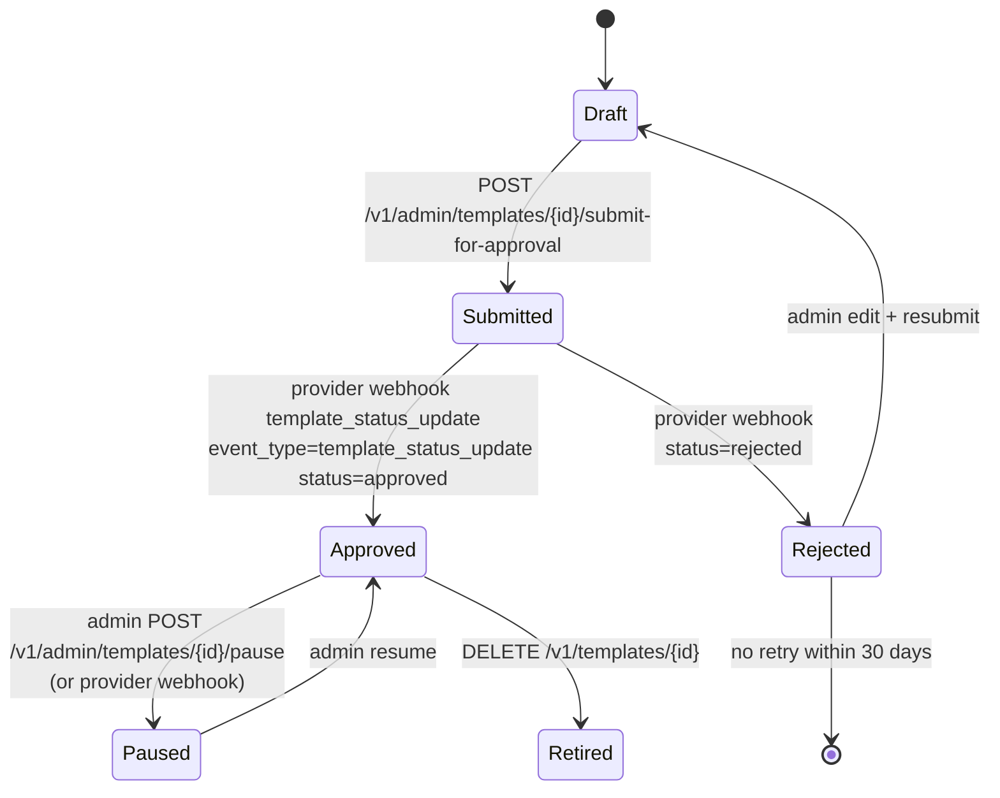

# notification-service — WhatsApp Structured Templates

> Companion to [`ERD.md`](./ERD.md) (`templates.body_structured`,
> `templates.template_type`, `templates.provider_*` columns),
> [`INTEGRATION.md`](./INTEGRATION.md) (`POST /v1/admin/templates`,
> `…/submit-for-approval`, `…/approve`, `…/publish`, `…/history`),
> and [`../communication-gateway-service/WHATSAPP_PROVIDER_CONTRACT.md`](../communication-gateway-service/WHATSAPP_PROVIDER_CONTRACT.md)
> (provider-onboarding contract). This document is the single
> source for *what* a WhatsApp template looks like in our
> schema and *how* it moves through draft → submit → approve →
> live.

## 1. Why a separate template model

WhatsApp Business is fundamentally different from SMS, email,
and push notifications: messages are not arbitrary text. Every
outbound message must use a **pre-approved template** that the
provider has reviewed for policy compliance (category, language,
variables). Each template has a structured shape (header /
body / footer / buttons) and a numbered variable contract.

Capturing this directly in `templates.body TEXT` would:

- lose the header/footer/buttons distinction,
- make it impossible to enforce the variable-index contract,
- couple the schema too tightly to the provider's HTTP payload,
- make audit (per-template approval state) more painful.

So the schema introduces:

| Column | Purpose |
|--------|---------|
| `template_type` | discriminator: `'plain'` (Handlebars text) vs `'whatsapp_structured'` (the body becomes `body_structured`) |
| `body` | retained for `'plain'` (push/sms/email/in_app); NULL for WhatsApp |
| `body_structured` | JSONB; mirrors the WhatsApp Business API components payload for `template_type='whatsapp_structured'` |
| `provider_template_id` | the provider's pre-approved template id; populated only after `…/approve` returns with status `approved` |
| `provider_template_language` | the language code the provider registered the template against (e.g. `ar_SA` — differs from the logical `locale` `ar`) |
| `provider_template_status` | state machine: `draft → submitted → approved | rejected → paused` |
| `provider_template_approved_at` | anchor for the 24h-window policy |

The discriminator CHECK (`templates_body_discriminator_chk`)
enforces mutual exclusivity at the database level: a row is
either a plain Handlebars body **or** a structured WhatsApp
body — never both, never neither.

## 2. `body_structured` Schema

The shape of `body_structured` mirrors the WhatsApp Business
API components payload verbatim:

```jsonc
{
  "header": {
    "type": "text" /* | "image" | "document" | "video" | "audio" */,
    "text": "تم إكمال رحلتك",     /* for type=text */
    "media_id": "abc123"           /* for non-text types */
  },
  "body": {
    "type": "text",
    "text": "وصلت إلى {{1}} في {{2}}. الإجمالي {{3}} {{4}}. شكراً لاختيارك {{5}}."
  },
  "footer": {
    "type": "text",
    "text": "{{platform_brand}}"   /* null when there is no footer */
  },
  "buttons": [                      /* optional; up to 10 */
    { "type": "url",   "text": "عرض الإيصال", "url":  "https://{{host}}/trips/{{trip_id}}/receipt" },
    { "type": "phone", "text": "اتصل بالدعم", "phone":"+966110000000" },
    { "type": "quick_reply", "text": "نعم" },
    { "type": "copy_code", "text": "كود الخصم", "code": "{{promo_code}}" }
  ],
  "variables": [
    { "key": "destination_address", "index": 1 },
    { "key": "arrived_at",          "index": 2 },
    { "key": "total",               "index": 3 },
    { "key": "currency_code",       "index": 4 },
    { "key": "platform_brand",      "index": 5 }
  ]
}
```

### 2.1 Variable binding contract

- `variables[].index` is the provider-side position. Providers
  use `{{1}}`, `{{2}}`, … and **do not** understand named
  variables in the body text.
- The renderer substitutes `whatsapp_variables["{index}"]` (sent
  in `POST /v1/sends` by `notification-service`) into every
  occurrence of `{{index}}` in `body.text` / `body.footer.text`
  / `button.text` / `button.url` / `button.code`.
- The `key` field is OUR logical name — it appears in
  `templates.required_variables[]` (for validation) and in
  the diff summary. It does NOT appear in the rendered
  provider payload.
- The same `index` may be referenced multiple times; substitution
  is whole-string (`{{1}}` → the value of index 1). Escape
  sequences (`{{{{` for a literal `{{`) follow standard
  WhatsApp Business API rules.

### 2.2 RTL handling

For Arabic (and other RTL locales) the `metadata.rtl = true`
flag on the template informs the email-preview helper (in
admin UIs) to render right-to-left. Providers render RTL
correctly on the recipient device automatically based on
`provider_template_language` (e.g. `ar_SA`). The flag is
informational for human review only.

### 2.3 Button types

| Type | Required fields | Notes |
|------|-----------------|-------|
| `url` | `text`, `url` | url may include `{{var}}` template variables |
| `phone` | `text`, `phone` | phone in E.164 |
| `quick_reply` | `text` | button text; reply text returned via webhook `button.text` |
| `copy_code` | `text`, `code` | code may include `{{var}}` |

The platform enforces the per-provider button-count limits in
`comms_gateway.provider_capabilities` (parameter
`max_buttons_per_template`).

## 3. Approval workflow



### 3.1 Initiate (Draft → Submitted)

`POST /v1/admin/templates/{id}/submit-for-approval` is the
call into the gateway. The notification-service:

1. Reads the template row, validates `template_type='whatsapp_structured'`.
2. Builds the provider's "components" payload from `body_structured`
   (header / body / footer / buttons / variables → provider shape).
3. Calls `communication-gateway-service` `POST /v1/templates/submit`
   with the components payload.
4. On 202, updates `templates.provider_template_status = 'submitted'`
   + writes a `template_history` row carrying the `submitted`
   state with `approved_by = NULL`.
5. Emits `notification.template.published.v1` with
   `provider_template_status = 'submitted'`.

### 3.2 Approve (Submitted → Approved)

The provider asynchronously approves or rejects the template;
this lands as a `template_status_update` webhook at the
gateway (`POST /v1/webhooks/whatsapp/{provider}`).

The gateway:

1. Verifies signature, persists the `webhook_events` row.
2. Looks up the matching `sends` row (if any historic send
   referenced the template) and the matching `templates` row
   via `provider_template_id` (set after first submitted).
3. Emits `comms.whatsapp.template_status_update.v1`.

The notification-service consumes
`comms.whatsapp.template_status_update.v1`:

1. Locates the `(template_id, locale)` matching the
   `provider_template_id`.
2. Updates `templates.provider_template_status` → `approved`
   (or `rejected`) and sets `provider_template_approved_at`
   on success.
3. Writes a new `template_history` row carrying
   `approved_by` (the admin user who triggered the
   `/approve` admin endpoint, OR the system user for
   webhook-only reconciliation), `diff_summary`, etc.
4. Emits `notification.template.published.v1` with the
   new `provider_template_status`.

A diagram of this is in
[`WORKFLOWS.md` §9](./WORKFLOWS.md#9-whatsapp-template-approval).

### 3.3 Atomic publish (multiple locales + channels)

The `POST /v1/admin/templates/{id}/publish` endpoint creates
a new version of every `(channel, locale)` combination for
the same `name` in a single transaction. This ensures
senders never see a half-published template set — the audit
chain is always consistent.

```
BEGIN;
  -- for each (channel, locale) under name = "trip.completed":
  UPDATE notification.templates SET version = version + 1, body = ..., status = 'active'
    WHERE name = $1 AND channel = $2 AND locale = $3;
  INSERT INTO notification.template_history (revision_no, template_id, version, …, diff_summary, published_by)
    VALUES (...);
COMMIT;
```

The response includes one `template_history_id` per
`(channel, locale)` pair so support can navigate from any
one snapshot to the others in the same publication.

### 3.4 Retiring an approved template

`DELETE /v1/templates/{id}` (called on the gateway) returns
200 once the provider confirms the template is deleted. The
notification-service then sets `templates.status='disabled'`
+ `provider_template_status='retired'` + writes a final
`template_history` row with `diff_summary.note = 'retired'`.

Historic deliveries keep their `template_version_snapshot_id`
intact: the snapshot row in `template_history` is **append-only**
and never deleted when the template is retired.

## 4. 24-hour customer-service window

Per Meta Business policy, a business may only send a freeform
text message to a recipient within 24 hours of the recipient's
last inbound message. Outside the 24h window only pre-approved
structured templates may be sent.

We enforce this in two layers:

| Layer | How |
|-------|-----|
| notification-service | `notification.whatsapp.template_24h_window_enforced` config flag; refuses to render a "freeform"-style template outside the window. The structured templates we publish are always pre-approved, so most sends pass through. |
| communication-gateway-service | `sends.whatsapp_window_anchor_at` (timestamp of recipient's last inbound message) and `sends.whatsapp_window_window_seconds` (snapshotted from `comms.whatsapp.window.seconds`). The gateway refuses the provider call if `now() - whatsapp_window_anchor_at > whatsapp_window_window_seconds` and the template is not pre-approved. |

The 24h window anchor is recorded as the `recipient.last_inbound_at`
read from `customer-service` (or equivalent persona service). The
notification-service ALSO records `whatsapp_window_anchor_at` on
each `delivery` row as a denormalised audit copy.

## 5. Logical-locale vs provider-locale

The `templates.locale` column is the logical UI locale a user
sees (`ar`, `en`, `ur`, …). The `templates.provider_template_language`
is the language code the provider registered the template against
(`ar_SA`, `en_US`, `en_GB`, …). They are NOT the same set and
not always 1-to-1.

A `ar` user may be served a `ar_SA` template (Meta Cloud
typically registers `ar_SA` for Saudi users, `ar_EG` for Egypt,
etc.). A `en` user may be served `en_US` or `en_GB` based on
their country.

The renderer resolves provider language by:

1. User profile `preferred_locale` → look up matching
   `provider_template_language` via the catalog
   (`notification.templates` rows for the same
   `templates.provider_template_id` family).
2. If no exact match, fall back to the `templates.metadata.default_provider_language`
   for that `name`.
3. If still no match, fall back to the platform default
   (`notification.default_locale`'s preferred provider language).

## 6. Operational guardrails

| Guardrail | Where | What happens |
|-----------|-------|--------------|
| `notification.whatsapp.approval_required = true` | notification-service | refuses to send a `templates.row` whose `provider_template_status != 'approved'` (returns 422 `TEMPLATE_NOT_APPROVED`) |
| `notification.whatsapp.template_24h_window_enforced = true` | notification-service | refuses to render any non-pre-approved template outside the 24h window |
| `sends.whatsapp_template_status != 'accepted'` after provider call | communication-gateway-service | returns 422 `PROVIDER_REJECTED`; the notification-service marks the delivery `failed` with `failure_reason='TEMPLATE_PAUSED'` or similar |
| Sender rate limit (`comms.rate_limit.whatsapp.per_recipient_per_minute`) | communication-gateway-service | per-recipient token bucket in Redis |
| Provider circuit | communication-gateway-service | fallback to the next WhatsApp provider when primary's circuit opens |

## 7. Worked example: trip.completed (en + ar, email + WhatsApp)

This example uses the seed [`seeds/templates.v1.json`](./seeds/templates.v1.json)
entry. The walk-through is in [`seeds/RENDERING_DEMO.md`](./seeds/RENDERING_DEMO.md).

---

## See also

### Sibling docs for this service

- [`README.md`](./README.md) — purpose, bounded context, responsibilities
- [`BRD.md`](./BRD.md) — business requirements (BR--028 … BR--036 for WhatsApp)
- [`SRS.md`](./SRS.md) — functional + non-functional requirements (FR--040 … FR--054 for WhatsApp)
- [`ERD.md`](./ERD.md) — data model (entities, columns, CHECK constraints, migration snippet)
- [`INTEGRATION.md`](./INTEGRATION.md) — inter-service contracts (admin endpoints for templates)
- [`TEMPLATE_HISTORY.md`](./TEMPLATE_HISTORY.md) — immutable audit table + diff summary
- [`MESSAGE_HISTORY.md`](./MESSAGE_HISTORY.md) — delivery-side audit chain
- [`PLAN.md`](./PLAN.md) — implementation tracker
- [`seeds/templates.v1.json`](./seeds/templates.v1.json) — JSON seed catalog
- [`seeds/RENDERING_DEMO.md`](./seeds/RENDERING_DEMO.md) — Mermaid rendering demo

### Related services

- **Depends on**: [`communication-gateway-service`](../communication-gateway-service/README.md), [`../communication-gateway-service/WHATSAPP_PROVIDER_CONTRACT.md`](../communication-gateway-service/WHATSAPP_PROVIDER_CONTRACT.md) (provider contract), [`configuration-service`](../configuration-service/README.md)
- **Depended on by**: every service that emits a domain event triggering a notification (ride, food, support, payment, …)

### Platform-wide

- [`../../shared/PLATFORM_BASELINE.md`](../../shared/PLATFORM_BASELINE.md) — single source for PostgreSQL 18, Kafka, Keycloak, Redis, OpenTelemetry, Vault, deployment, DR
- [`../../README.md`](../../README.md) — services overview (the catalog of all 58 services)
- [`../../../main.md`](../../../main.md) — top-level platform specification
