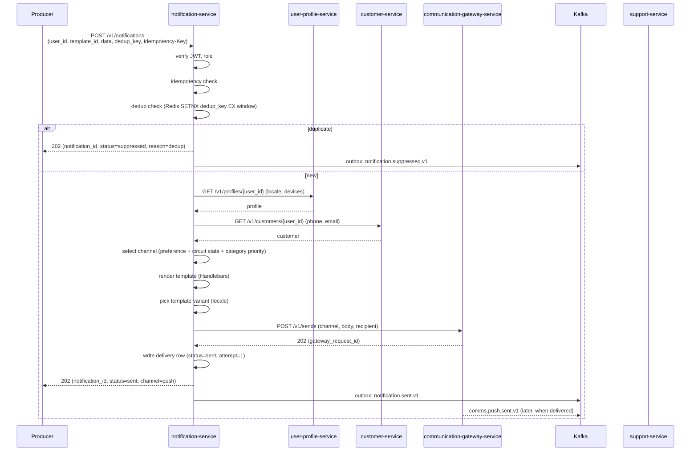
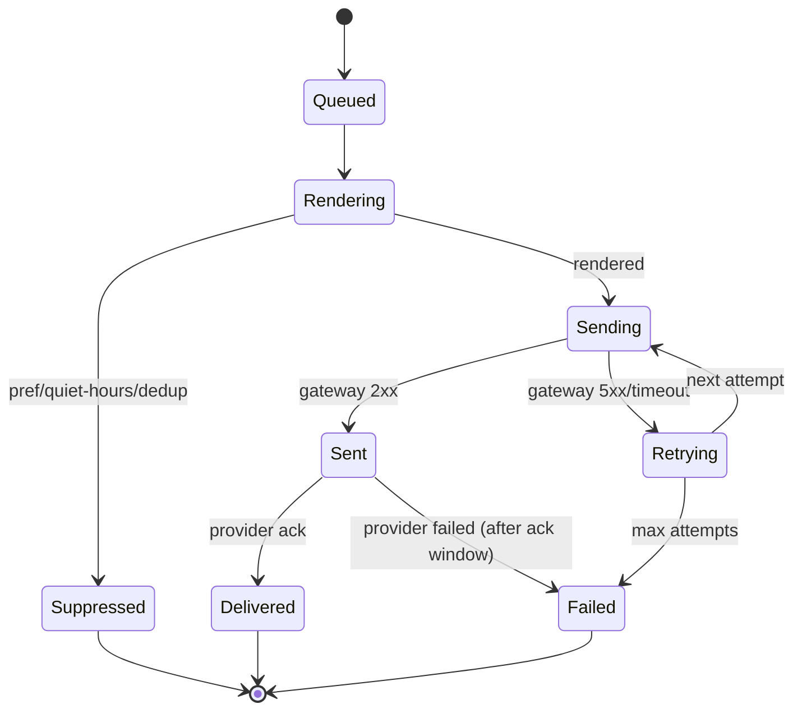
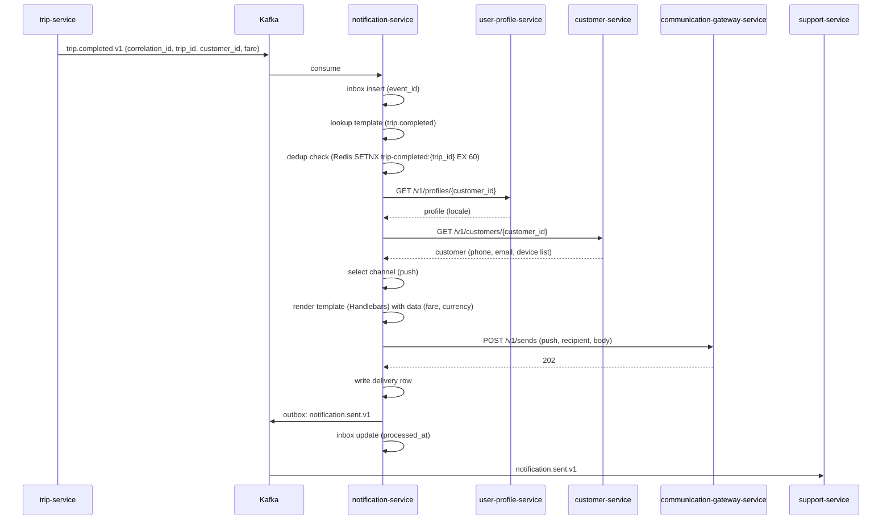
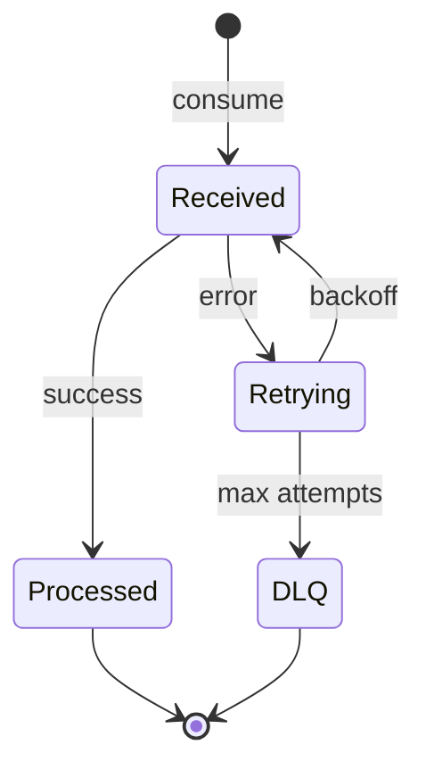
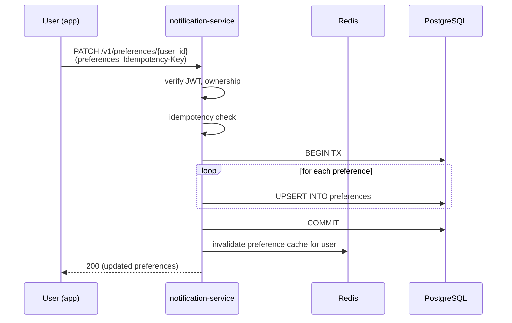
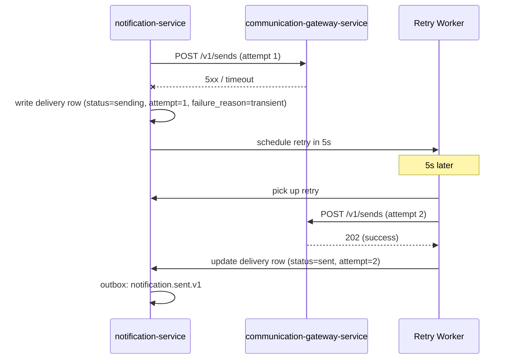
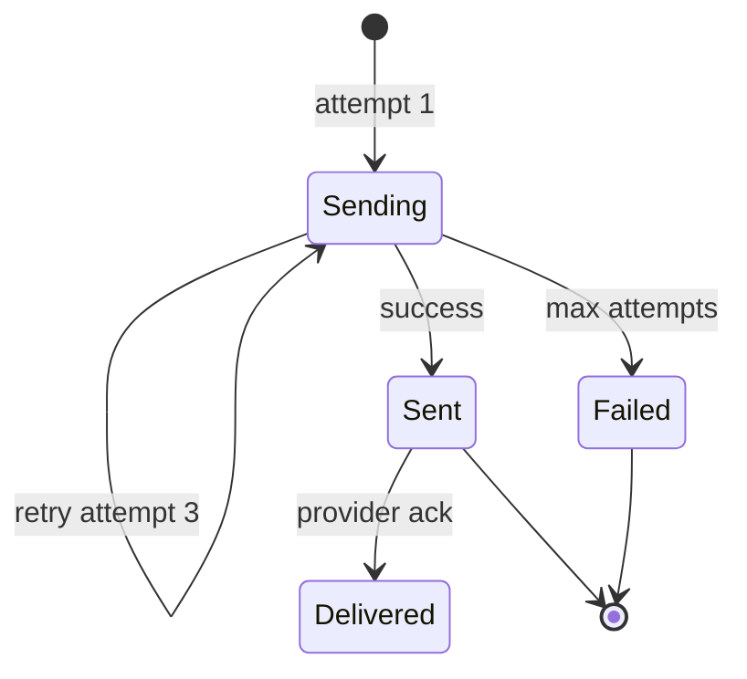
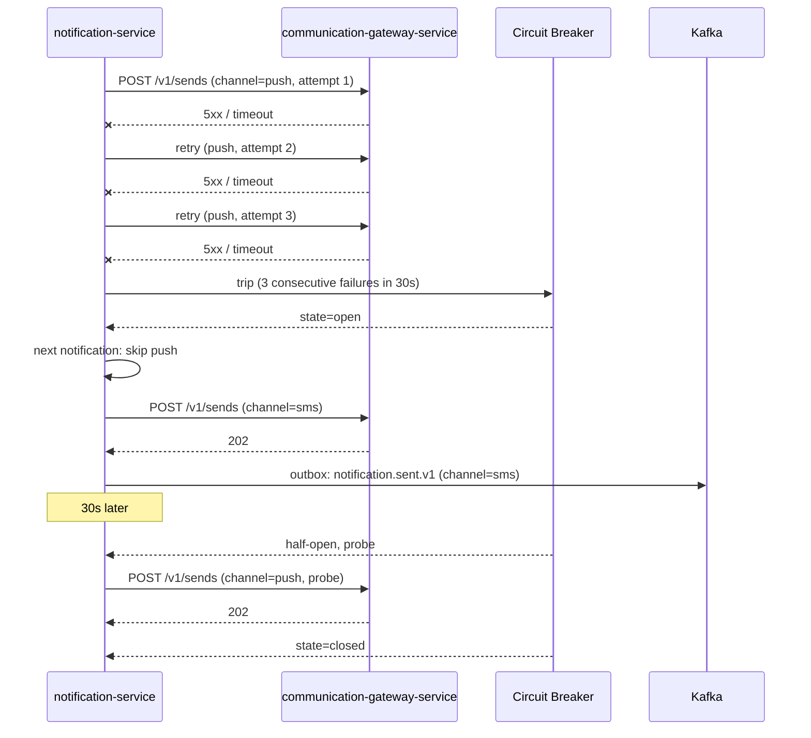
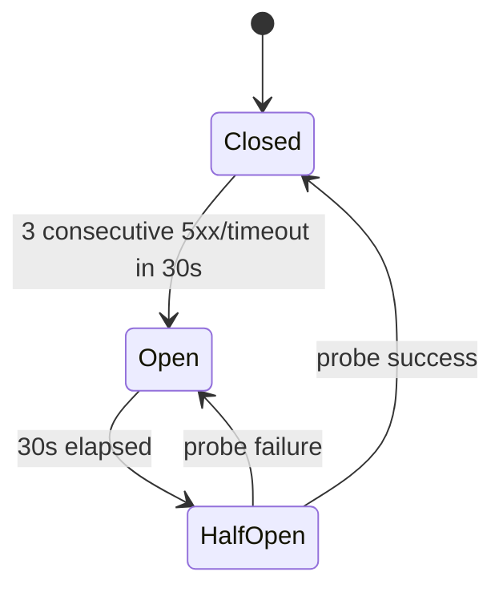
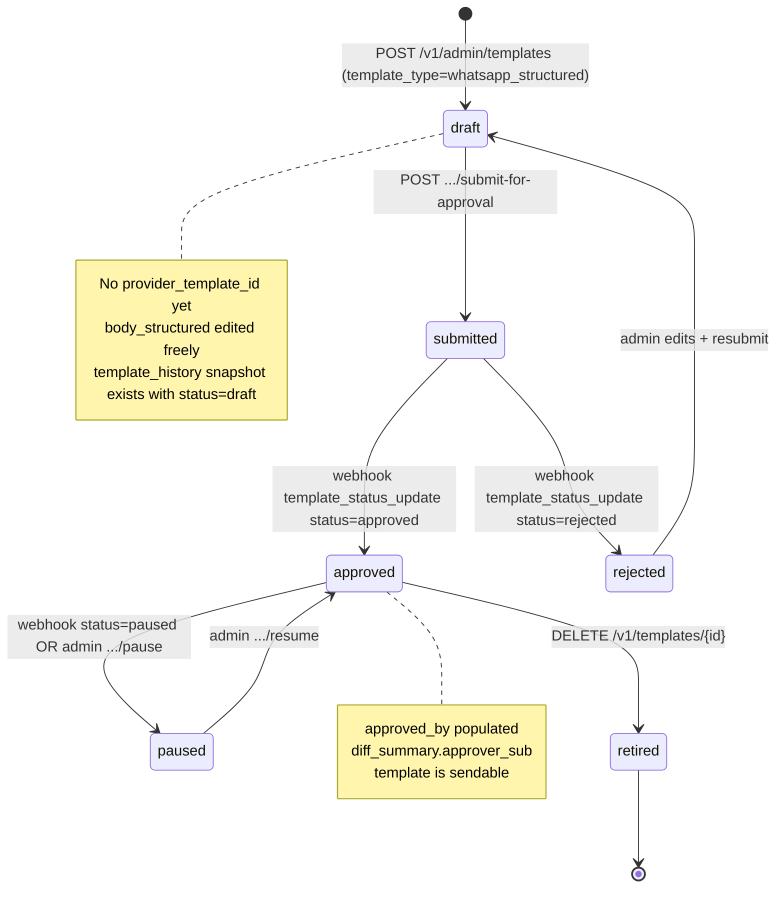

# notification-service — Workflows

## 1. Send a Notification (Synchronous, from a Service)

### 1.1 Objective

A producer service (e.g. `trip-service`) calls
`POST /v1/notifications` to send a notification to a user.
The service renders the template, picks the channel, dedupes,
and hands off to `communication-gateway-service` for actual
delivery.

### 1.2 Initiating Actor

Any internal service with the `service` role (e.g.
`trip-service`, `food-order-service`, `payment-service`,
`ride-safety-service`).

### 1.3 Participating Services

- `notification-service` (this service).
- `communication-gateway-service` (downstream).
- `user-profile-service` (read locale, device list).
- `customer-service` / `driver-service` / `courier-service` /
  `merchant-service` (read contact info).
- `configuration-service` (read defaults).
- `support-service` (consumer of `notification.*.v1`).
- `audit-service` (consumer).

### 1.4 Prerequisites

- The user exists in the relevant service.
- A template exists for the requested (category, channel,
  locale) or the default locale fallback applies.
- At least one channel's circuit is closed (or the fallback
  chain can reach a closed circuit).

### 1.5 Happy Path



### 1.6 Alternate Paths

- **User opted out of the category**: the notification is
  suppressed; `notification.suppressed.v1` emitted with
  reason `opt_out`.
- **User has no device for push AND no phone**: the service
  falls back to email; if no email, `NO_CONTACT` and
  `notification.failed.v1`.
- **Push circuit open**: fall back to SMS; if SMS circuit
  also open, fall back to email; if all open, return 503
  `CIRCUIT_OPEN`.
- **Template missing for the user's locale**: fall back to
  the default locale (en); if that is also missing, 422
  `TEMPLATE_MISSING`.

### 1.7 Failure Paths

- **Idempotency-Key reuse with different body**: 422
  `IDEMPOTENCY_KEY_REUSED`.
- **All channels' circuits open**: 503 `CIRCUIT_OPEN`. The
  producer is acked (their request was valid; we just can't
  deliver right now). An alert fires.
- **Gateway returns 5xx**: retried with exponential backoff
  (3 attempts). On persistent failure, the delivery row is
  marked `failed`, `notification.failed.v1` is emitted.
- **User not found**: 404 `USER_NOT_FOUND`. (This is a
  configuration error on the producer's side; the producer
  is expected to validate the user exists before calling.)
- **Template not found**: 404 `TEMPLATE_NOT_FOUND`. The
  producer is acked; an alert fires for ops to add the
  template.
- **Preference service unreachable**: the service falls
  back to the cached preferences (Redis); if Redis is also
  down, the default preference set is used; delivery is
  logged with `preference_source=fallback`.

### 1.8 Business Rules

- BR--010..BR--014, BR--020..BR--027.
- FR--001..FR--004, FR--017, FR--018, FR--025.

### 1.9 State Transitions



### 1.10 Events

| Event | Direction | When |
|-------|-----------|------|
| `notification.sent.v1` | produced | on status → sent (and on delivered) |
| `notification.failed.v1` | produced | on persistent failure |
| `notification.suppressed.v1` | produced | on suppression |

### 1.11 APIs Involved

| API | Direction | When |
|-----|-----------|------|
| `POST /v1/notifications` | inbound | start of flow |
| `GET /v1/profiles/{user_id}` | outbound | locale + device list |
| `GET /v1/customers/{user_id}` | outbound | phone, email |
| `POST /v1/sends` (gateway) | outbound | handoff |

### 1.12 Compensation / Rollback

- A failed notification is not retried by the caller; the
  service handles retries internally.
- A `failed` delivery row remains in the DB; support agents
  can investigate; the producer can re-submit with a new
  `Idempotency-Key` (this creates a new delivery row).

### 1.13 Final State

- A row in `deliveries` with `status ∈ {sent, delivered,
  failed, suppressed}` and a `correlation_id`.
- An outbox row for the corresponding `notification.*.v1`
  event.
- (On delivered) a `comms.*.sent.v1` event from the gateway
  updates the delivery state to `delivered`.

## 2. Consume an Event and Send (Asynchronous)

### 2.1 Objective

Translate a domain event (e.g. `trip.completed.v1`) into a
notification.

### 2.2 Initiating Actor

A producer service emits the event (e.g. `trip-service`
emits `trip.completed.v1` after a trip ends).

### 2.3 Participating Services

- `notification-service` (this service) — consumer + actor.
- `communication-gateway-service` (downstream).
- `user-profile-service`, `customer-service` /
  `driver-service` / `courier-service` / `merchant-service`
  (reads).
- `support-service`, `audit-service` (consumers of
  `notification.*.v1`).

### 2.4 Prerequisites

- The Kafka consumer is running.
- A template is configured for the event's
  (category, channel, locale).
- The user exists in the relevant service.

### 2.5 Happy Path



### 2.6 Alternate Paths

- **Same event consumed twice** (e.g. Kafka redelivery):
  the inbox dedupes on `event_id`; the second consume is a
  no-op.
- **Template missing for the user's locale**: fall back to
  default locale; if missing, log a high-severity error and
  emit `notification.failed.v1` with reason
  `TEMPLATE_MISSING`.

### 2.7 Failure Paths

- **Database write fails**: the inbox row's `processed_at`
  stays null; the consumer retries with backoff. After 3
  failures, the event is routed to DLQ.
- **User / customer / profile service unreachable**: the
  service retries with backoff; after 3 failures, the
  notification is marked `failed` with reason
  `PROFILE_UNREACHABLE` and `notification.failed.v1` is
  emitted.
- **All channels' circuits open**: same as the sync flow;
  the notification is marked `failed` after retries.
- **Outbox publish fails**: the outbox poller retries;
  reconciliation catches.

### 2.8 Business Rules

- BR--020, BR--021.
- FR--001, FR--002, FR--005, FR--008, FR--009, FR--014,
  FR--015, FR--025.

### 2.9 State Transitions

The delivery state machine is the same as workflow 1. The
inbox row transitions `received → processed` (or `received
→ error → DLQ`).



### 2.10 Events

| Event | Direction | When |
|-------|-----------|------|
| `trip.completed.v1` (etc.) | consumed | start of flow |
| `notification.sent.v1` (or .failed.v1, .suppressed.v1) | produced | end of flow |

### 2.11 APIs Involved

| API | Direction | When |
|-----|-----------|------|
| Kafka consumer | inbound | start of flow |
| `GET /v1/profiles/{user_id}` | outbound | locale |
| `GET /v1/customers/{user_id}` | outbound | phone, email |
| `POST /v1/sends` (gateway) | outbound | handoff |

### 2.12 Compensation / Rollback

- No compensation: the event is consumed once (inbox), the
  notification is delivered once (gateway), and the
  `notification.*.v1` event is emitted once (outbox).
- If the consumer crashes after handing off to the gateway
  but before writing the delivery row, the inbox will
  redeliver the event on restart, the consumer will dedupe
  via the gateway's idempotency key, and the delivery row
  will be re-written (idempotent on the row's natural key).

### 2.13 Final State

- A delivery row with the final status.
- An outbox row for `notification.*.v1`.
- An inbox row marked `processed`.

## 3. User Updates Preferences

### 3.1 Objective

A user updates their notification preferences via the app.

### 3.2 Initiating Actor

The end user (customer / driver / courier / merchant staff),
via the app, which calls `PATCH /v1/preferences/{user_id}`.

### 3.3 Participating Services

- `notification-service` (this service).
- The app (which the user is interacting with).

### 3.4 Prerequisites

- The user is authenticated.
- The `user_id` in the URL matches the caller's `sub`
  (or the caller is `admin`).

### 3.5 Happy Path



### 3.6 Alternate Paths

- **Admin override**: an admin updates a user's preferences
  on their behalf (e.g. for a customer support ticket).
  The audit row records `actor_sub=admin_sub,
  target_user_id=user_id`.

### 3.7 Failure Paths

- **Ownership check fails**: 403 `FORBIDDEN`.
- **Idempotency-Key reuse with different body**: 422
  `IDEMPOTENCY_KEY_REUSED`.
- **Invalid category or channel**: 400 `VALIDATION_FAILED`.
- **Database write fails**: 500 `INTERNAL_ERROR`; the
  transaction rolls back; cache not invalidated.

### 3.8 Business Rules

- BR--010, BR--012, BR--022.
- FR--004, FR--011, FR--018.

### 3.9 State Transitions

The preference row is UPSERTed; no state machine. The
cache entry transitions `Fresh → Evicted`.

### 3.10 Events

- No events produced. (This is a configuration change; the
  cache invalidation is internal.)

### 3.11 APIs Involved

| API | Direction | When |
|-----|-----------|------|
| `PATCH /v1/preferences/{user_id}` | inbound | start of flow |

### 3.12 Compensation / Rollback

- The UPSERT is atomic; on failure, the transaction rolls
  back; the cache is not invalidated; the next preference
  read will return the previous value.

### 3.13 Final State

- A row in `preferences` per (user, category, channel).
- The Redis cache for the user's preferences is
  invalidated; the next read repopulates it.

## 4. Retry on Transient Failure

### 4.1 Objective

When `communication-gateway-service` returns a 5xx or
times out, the service retries the send with exponential
backoff before declaring the notification `failed`.

### 4.2 Initiating Actor

The first attempt fails; the service schedules a retry.

### 4.3 Participating Services

- `notification-service` (this service).
- `communication-gateway-service` (downstream).
- A retry worker (internal).

### 4.4 Prerequisites

- The first attempt was made.
- The attempt count is < `notification.retry.max_attempts`.

### 4.5 Happy Path



### 4.6 Alternate Paths

- **Same channel still fails**: the retry worker may also
  fall back to the next channel (if configured).
- **Different channel is tried**: the delivery row records
  the channel switch in `failure_reason` (e.g. `sms_circuit_open
  → email`).

### 4.7 Failure Paths

- **Max attempts reached**: the delivery row is marked
  `failed`; `notification.failed.v1` is emitted; if it's a
  money event, `support-service` opens a ticket.
- **Gateway persistently unavailable**: the circuit opens
  after 3 consecutive failures; the next notification skips
  this channel and goes to the fallback.

### 4.8 Business Rules

- BR--015, BR--016.
- FR--008, FR--009, FR--017.

### 4.9 State Transitions



### 4.10 Events

| Event | Direction | When |
|-------|-----------|------|
| `notification.sent.v1` | produced | on success |
| `notification.failed.v1` | produced | on persistent failure |

### 4.11 APIs Involved

| API | Direction | When |
|-----|-----------|------|
| `POST /v1/sends` (gateway) | outbound | every attempt |

### 4.12 Compensation / Rollback

- No rollback; the delivery row records the final state.
- If the gateway eventually accepts a request we thought
  failed (e.g. duplicate send), the delivery state is
  reconciled via the gateway's `comms.*.sent.v1` callback
  (which is idempotent on the gateway request id).

### 4.13 Final State

- A delivery row with the final status and the attempt
  count.
- An outbox row for `notification.*.v1`.

## 5. Channel Fallback Activation

### 5.1 Objective

When the push channel's circuit opens, the service
automatically falls back to SMS (then email) so the user
still gets the notification.

### 5.2 Initiating Actor

The push channel circuit breaker trips.

### 5.3 Participating Services

- `notification-service` (this service).
- `communication-gateway-service` (downstream).
- `audit-service` (consumer of `notification.*.v1`).

### 5.4 Prerequisites

- A fallback channel is configured.
- The user has a contact for the fallback channel (phone for
  SMS, email for email).

### 5.5 Happy Path



### 5.6 Alternate Paths

- **SMS also fails**: the service falls back to email; if
  email also fails, the delivery is marked `failed` with
  reason `ALL_CHANNELS_UNAVAILABLE`.
- **No fallback for the category**: e.g. "this is a push-only
  notification". The service marks the delivery `failed`
  with reason `NO_FALLBACK`.

### 5.7 Failure Paths

- **All channels' circuits open**: 503 `CIRCUIT_OPEN` on
  the synchronous path; `notification.failed.v1` on the
  async path.
- **User has no contact for the fallback**: 422
  `NO_CONTACT`; the notification is dropped with reason
  `NO_CONTACT_FALLBACK`.

### 5.8 Business Rules

- BR--007, BR--018, BR--026, BR--027.
- FR--003, FR--017, FR--025.

### 5.9 State Transitions

The channel circuit has its own state machine:



The delivery state machine is the same as workflow 1, but
with the channel switching at retry time.

### 5.10 Events

| Event | Direction | When |
|-------|-----------|------|
| `notification.sent.v1` | produced | on successful fallback send |
| `notification.failed.v1` | produced | on persistent failure |

### 5.11 APIs Involved

| API | Direction | When |
|-----|-----------|------|
| `POST /v1/sends` (gateway) | outbound | every attempt |

### 5.12 Compensation / Rollback

- No rollback; the user received the notification on a
  different channel; the cost is higher (SMS is more
  expensive than push) but the user is informed.

### 5.13 Final State

- A delivery row with the channel that actually succeeded
  (or `failed` if all channels failed).
- An outbox row for `notification.*.v1`.

---

## 9. WhatsApp Channel — Structured Templates

Companion to [`WHATSAPP_TEMPLATES.md`](./WHATSAPP_TEMPLATES.md)
(structured `body_structured`), [`TEMPLATE_HISTORY.md`](./TEMPLATE_HISTORY.md)
(immutable audit), and [`MESSAGE_HISTORY.md`](./MESSAGE_HISTORY.md)
(per-delivery snapshot binding). The five sub-workflows below
were previously implicit; §9 makes them explicit per the v1.1
extension.

### 9.1 Happy-Path WhatsApp Send (event → rendered → delivered → read)

```mermaid
sequenceDiagram
    participant Trip as trip-service
    participant NS as notification-service
    participant TH as notification.template_history
    participant D as notification.deliveries
    participant GW as communication-gateway-service
    participant Meta as Meta Cloud (WhatsApp)
    participant User as Customer

    Trip->>NS: trip.completed.v1 (Kafka)
    NS->>NS: dedup; channel selection<br/>(priority: push > sms > email > in_app > whatsapp)
    NS->>NS: resolve locale (user.ar → ar template)
    NS->>D: write deliveries row, template_version_snapshot_id = th.id (PRE-EXISTING or NEW)
    NS->>TH: read template_history snapshot (head revision for active version)
    NS->>NS: render WhatsApp components: substitute {{1}}..{{N}} from whatsapp_variables, {{host}}/{{trip_id}} from data
    NS->>D: stamp rendered_body_encrypted (pgcrypto over rendered components), status='rendering'
    NS->>GW: POST /v1/sends { channel:whatsapp, whatsapp_template_name, whatsapp_variables, whatsapp_template_language }
    GW->>Meta: POST /v18.0/{phone_id}/messages (provider components)
    Meta-->>GW: 202 { wamid.HBgN... , status:accepted }
    GW-->>NS: 202 (gateway_request_id)
    GW->>GW: persist sends row, status='accepted', emit comms.whatsapp.accepted.v1
    NS->>D: stamp sent_at; status='sent'; emit notification.sent.v1
    Meta->>User: delivered
    Meta->>GW: webhook event=delivered
    GW->>GW: persist webhook_events row; emit comms.whatsapp.delivered.v1
    NS->>D: stamp delivered_at; status='delivered'; emit notification.delivered.v1
    User->>Meta: opens message (if read receipts enabled)
    Meta->>GW: webhook event=read
    GW-->>NS: emit comms.whatsapp.read.v1
    NS->>D: stamp read_at; status='read'; emit notification.read.v1
```

The audit chain at end of day:
```
template_history.id
  ↓
deliveries.template_version_snapshot_id
  ↓
notification.sent.v1 → notification.delivered.v1 → notification.read.v1
  ↓
(parallel) comms_gateway.sends.provider_message_id = wamid...
```

### 9.2 WhatsApp Template Approval Workflow (admin submit → provider approve)

```mermaid
sequenceDiagram
    participant Admin as notification-admin
    participant NS as notification-service
    participant TH as notification.template_history
    participant GW as communication-gateway-service
    participant Meta as Meta Cloud (WhatsApp)

    Admin->>NS: POST /v1/admin/templates {name, channel:whatsapp, template_type:whatsapp_structured, body_structured, required_variables}
    NS->>NS: validate discriminator CHECK +<br/>required_variables[] matches body_structured.variables[]
    NS->>TH: write snapshot (revision_no=N, version=N, approved_by=null, provider_template_status='draft')
    NS-->>Admin: 201 { template_id, version=1, template_history_id }
    Admin->>NS: POST /v1/admin/templates/{id}/submit-for-approval {locale, category}
    NS->>GW: POST /v1/templates/submit {template_id, locale, components=...}
    GW->>Meta: POST /v18.0/{waba_id}/message_templates
    Meta-->>GW: 202 { id:tpl_pending_xyz, status:submitted }
    GW-->>NS: 202 { provider_template_id:tpl_pending_xyz, status:submitted }
    NS->>TH: write snapshot (status=submitted, approved_by=null)
    NS-->>Admin: 202 { provider_template_id:tpl_pending_xyz }
    Note over Meta: Meta review (minutes to hours)
    Meta->>GW: webhook POST /v1/webhooks/whatsapp/meta-cloud<br/>event=template_status_update status=approved
    GW->>GW: persist webhook_events; emit comms.whatsapp.template_status_update.v1
    NS->>NS: locate (template_id, locale) via provider_template_id<br/>update templates.provider_template_status='approved', provider_template_approved_at=now
    NS->>TH: write snapshot (status=approved, approved_by=<system-actor-or-admin>)
    NS-->>NS: emit notification.template.published.v1
```

### 9.3 Atomic-across-locales Publish (multi-channel, multi-locale)

```mermaid
sequenceDiagram
    participant Admin as notification-admin
    participant NS as notification-service
    participant T as notification.templates (5 channels × 2 locales)
    participant TH as notification.template_history

    Admin->>NS: POST /v1/admin/templates/{id}/publish<br/>{name:'trip.completed', channels:5, locales:[en,ar], bodies:{...}}

    NS->>NS: BEGIN TRANSACTION
    loop for each (channel, locale) under name
        NS->>T: UPDATE version += 1, body/body_structured, status='active'
        NS->>TH: INSERT snapshot (revision_no, version, body, body_structured, provider_*,
                              approved_by='<admin-sub>', diff_summary)
        Note over TH: discriminator CHECK enforced<br/>(plain → body; structured → body_structured)
    end
    NS->>NS: COMMIT
    NS-->>Admin: 200 { templates: [{template_id, channel, locale, version, template_history_id}, ...] }
```

If any (channel, locale) update fails, the entire batch rolls back — no half-published template set is visible to senders.

### 9.4 Right-to-Erasure (preserves `template_history`)

```mermaid
sequenceDiagram
    participant Support as support-service
    participant Audit as audit-service
    participant NS as notification-service
    participant D as notification.deliveries
    participant TH as notification.template_history

    Support->>Audit: POST /v1/admin/audit { action:'erasure_request', user_id, reason }
    Audit-->>Audit: verify Right-to-Erasure request authorized + retention clock
    Audit->>NS: POST /v1/admin/erasure/{user_id} { erasure_id, reason }
    NS->>Audit: emit audit.notification.erasure.v1 {erasure_id, rows_affected=N, template_history_rows_affected=0}
    NS->>NS: BEGIN TRANSACTION
    NS->>D: UPDATE SET user_id = NULL, rendered_subject_encrypted = NULL, rendered_body_encrypted = NULL<br/>WHERE user_id = $user_id
    NS->>NS: anonymise notification.preferences (deleted_at=now)
    NS-->>NS: template_history NOT touched (no PII; admin sub UUIDs only)
    NS->>NS: COMMIT
    NS-->>Support: 202 { erasure_id, rows_affected }
```

The audit chain pre-erasure remains intact:
- `template_history` row still references the same `template_id` and `revision_no`.
- `notifications.deliveries.template_version_snapshot_id` still points at the snapshot (the snapshot row itself is retained; the delivery row loses its PII bytes).
- Support can still answer "what template was used?" for the redacted delivery — the body content is gone, but the structure (header / footer / buttons / variable names) is preserved.

### 9.5 Template-History Lifecycle State Machine



Every transition writes a new `template_history` row in the same transaction as the `templates` row update. The trigger on `template_history` blocks UPDATE/DELETE so the audit trail is bit-for-bit immutable.

### 9.6 Failure Paths

| Scenario | Behaviour |
|----------|-----------|
| Admin submits a template whose `body_structured.variables[]` doesn't match `required_variables[]` | 422 `TEMPLATE_VALIDATION_FAILED`; no DB write |
| Admin submits a WhatsApp template but the WhatsApp provider is not onboarded | 422 `PROVIDER_NOT_ONBOARDED` |
| Provider returns `rejected` on submit | snapshot written with `provider_template_status='rejected'`; template NOT sendable; admin must edit + resubmit |
| Provider returns `paused` after being approved | snapshot written with `provider_template_status='paused'`; existing deliveries proceed; new sends fail with 422 `TEMPLATE_PAUSED` |
| Recipient's locale has no `provider_template_language` mapping | fall back to `templates.metadata.default_provider_language`; if still missing, fall back to platform default (`notification.default_locale`) |
| Recipient opts out via WhatsApp STOP after the template is approved | STOP webhook → `comms_gateway.optouts (channel='whatsapp', recipient_hash)`; subsequent sends return 422 `OPTED_OUT` |
| 24h customer-service window expired for a freeform send | 422 `WINDOW_EXPIRED` (note: pre-approved structured templates always pass) |
| Rendered WhatsApp variables list has `index=null` | renderer raises `RENDER_MISSING_INDEX`; no delivery row written |

### 9.7 Business Rules

1. Every WhatsApp publication produces a `template_history`
   snapshot row in the SAME transaction as the `templates`
   row update. UPDATE/DELETE on `template_history` is blocked
   by trigger.
2. Every WhatsApp delivery row carries
   `template_version_snapshot_id = template_history.id` plus
   the denormalised `rendered_template_type`,
   `rendered_provider_template_id`,
   `rendered_provider_template_language`. The CHECK
   `deliveries_whatsapp_provider_template_required_chk`
   enforces the latter for `channel='whatsapp'`.
3. The WhatsApp template approval is `approved_by`-attested
   in `template_history`; never trust a template whose
   `provider_template_status != 'approved'` when
   `notification.whatsapp.approval_required=true`.
4. The 24h customer-service window is enforced at two layers:
   notification-service (refuses freeform outside window) AND
   gateway (snapshots `whatsapp_window_anchor_at` and
   `whatsapp_window_window_seconds` from
   `comms.whatsapp.window.seconds`).

### 9.8 State Transitions

The state transitions on `notifications.deliveries.status`
extend with WhatsApp-specific states: `sent → delivered →
read` (the `read` state is WhatsApp-only; CHECK constraint
enforced). See [`ERD.md`](./ERD.md) §3 (`Delivery`).

### 9.9 Events

- **Produced by notification-service**:
  - `notification.sent.v1` — every WhatsApp send (same event
    family as SMS/email/push).
  - `notification.delivered.v1` — on the provider's delivery
    webhook.
  - `notification.read.v1` — on the read webhook (WhatsApp
    only).
  - `notification.template.published.v1` — on every
    publication; carries `template_history_id`,
    `provider_template_id`, `provider_template_status`,
    `diff_summary`.
- **Produced by communication-gateway-service** (consumed
  here):
  - `comms.whatsapp.template_status_update.v1` — provider-side
    template status change.
  - `comms.whatsapp.delivered.v1`,
    `comms.whatsapp.read.v1`,
    `comms.whatsapp.failed.v1`,
    `comms.whatsapp.accepted.v1`.

### 9.10 APIs Involved

Public (notification-service):
- `POST /v1/notifications` (with implicit WhatsApp path)
- `GET /v1/notifications/{id}` (returns `template_version_snapshot_id` in the response per
  [`MESSAGE_HISTORY.md`](./MESSAGE_HISTORY.md))

Admin (notification-service):
- `POST /v1/admin/templates`
- `PATCH /v1/admin/templates/{id}`
- `POST /v1/admin/templates/{id}/submit-for-approval`
- `POST /v1/admin/templates/{id}/approve`
- `POST /v1/admin/templates/{id}/publish`
- `GET /v1/admin/templates/{id}/history`
- `POST /v1/admin/erasure/{user_id}` (preserves template_history)

Outbound to gateway:
- `POST /v1/sends` (channel=whatsapp)
- `POST /v1/templates/submit`
- `GET /v1/templates/{id}/status`
- `DELETE /v1/templates/{id}`

### 9.11 Compensation / Rollback

- Template publication rollback: a half-published batch is
  impossible (single transaction in §9.3).
- Webhook reconciliation rollback: if a webhook is mis-routed
  to the wrong template, the consumer logs + alerts; the
  template_history snapshot is corrected by writing a new
  snapshot row reflecting the truth (the prior row is
  immutable but visible to support).
- Right-to-erasure rollback: not supported. The erasure is
  irrevocable; PII bytes are deleted.

### 9.12 Final State

For a single notification:
- One `deliveries` row with the actual channel (here
  `whatsapp`), bound to its `template_history` snapshot.
- An outbox row for `notification.sent.v1` (+ optionally
  `notification.delivered.v1`, `notification.read.v1`).
- The corresponding `comms_gateway.sends` row carries the
  provider's message id, the rendered components (encrypted),
  and the 24h-window snapshot.

For a template publication:
- One `template_history` snapshot row per (channel, locale)
  in the batch, with `published_by` and (for WhatsApp)
  `approved_by` populated.
- An outbox row for `notification.template.published.v1`
  with `template_history_id` and `diff_summary`.

## 99. `Monthly` Partition Maintenance`

### 99.1 Objective

Idempotently pre-create the next 12 month child partitions for `notification.deliveries` so an INSERT at any time lands in an existing child. The drop half is handled by the per-service retention job.

### 99.2 Initiating Actor

A scheduled job runs daily at `02:00 UTC`. Leader-elected via `pg_try_advisory_xact_lock(hashtext('notification.partition'), hashtext('monthly'))`.

### 99.3 Happy Path

```mermaid
sequenceDiagram
    participant JOB as Partition job
    participant PG as PostgreSQL
    JOB->>PG: pg_try_advisory_xact_lock('notification.monthly')
    alt lock acquired
        loop for each missing month in next 12
            JOB->>PG: CREATE TABLE IF NOT EXISTS notification.deliveries_month PARTITION OF notification.deliveries
            JOB->>PG: verify (pg_inherits, relpartbound)
        end
        JOB->>PG: assert now() in existing child
    else lock NOT acquired
        Note over JOB: another instance is running; exit cleanly
    end
```

### 99.4 Failure Paths

| Failure | Handling |
|---------|----------|
| Lock contention | exit 0 |
| DDL fails | retry 3× with backoff (1 s / 4 s / 16 s); page on-call |
| Today's child missing | critical alert; INSERTs would fail |

### 99.5 Business Rules

- Pre-create 12 complete future months.
- Every child is created with `CREATE TABLE IF NOT EXISTS … PARTITION OF …` so the job is safe to run twice in the same window.
- A verification step (`pg_inherits` parent + `relpartbound` range) runs after every `CREATE TABLE IF NOT EXISTS` because `IF NOT EXISTS` only guards the name, not the bounds.
- Optionally emit `audit.partition.maintained.v1` on success.

---

## See also

### Sibling docs for this service

- [`README.md`](./README.md) — purpose, bounded context, responsibilities
- [`BRD.md`](./BRD.md) — business requirements
- [`SRS.md`](./SRS.md) — functional + non-functional requirements
- [`ERD.md`](./ERD.md) — data model (entities, relationships)
- [`INTEGRATION.md`](./INTEGRATION.md) — inter-service contracts (APIs, events, sagas)
- [`WORKFLOWS.md`](./WORKFLOWS.md) — operational workflows (happy paths, failure modes)
- [`TECH.md`](./TECH.md) — technology profile (runtime, libraries, data layer, admin endpoints, RBAC)
- [`WHATSAPP_TEMPLATES.md`](./WHATSAPP_TEMPLATES.md) — WhatsApp structured template model + approval workflow
- [`TEMPLATE_HISTORY.md`](./TEMPLATE_HISTORY.md) — `notification.template_history` immutable audit table
- [`MESSAGE_HISTORY.md`](./MESSAGE_HISTORY.md) — per-delivery snapshot binding
- [`PLAN.md`](./PLAN.md) — implementation tracker for the v1.1 extension
- [`seeds/templates.v1.json`](./seeds/templates.v1.json) — 80-entry seed catalog
- [`seeds/RENDERING_DEMO.md`](./seeds/RENDERING_DEMO.md) — Mermaid rendering demo (this document's companion)

### Platform-wide

- [`../../shared/README.md`](../../shared/README.md) — `platform-spring-boot-starter` shared library (the single source of cross-cutting code for all Spring Boot services in the platform)
- [`../RECOMMENDATIONS.md`](../RECOMMENDATIONS.md) — platform-wide technology map (language, framework, version baseline, admin/RBAC pattern)
- [`../../README.md`](../../README.md) — services overview (the catalog of all 58 services)
- [`../../../main.md`](../../../main.md) — top-level platform specification (architecture, Keycloak, PostgreSQL 18, messaging, observability baseline)

