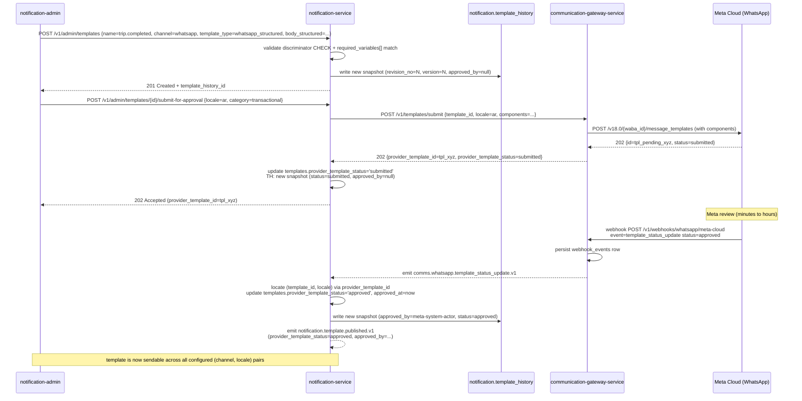
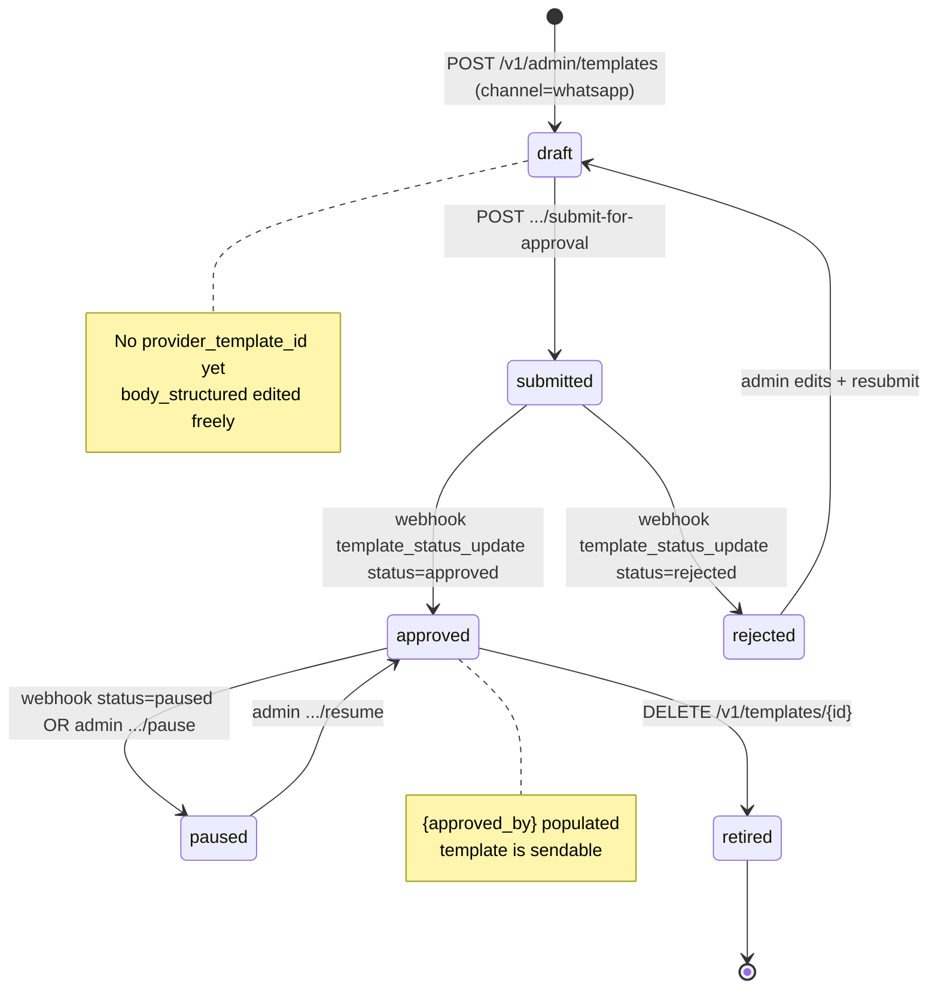

# Template Rendering Demo — `trip.completed` (en + ar)

> Walks through the [`templates.v1.json`](./templates.v1.json)
> seed entry for `name="trip.completed"` across both `email`
> (plain Handlebars) and `whatsapp` (structured) channels, in
> both `en` and `ar` locales. Companion to
> [`../WHATSAPP_TEMPLATES.md`](../WHATSAPP_TEMPLATES.md),
> [`../TEMPLATE_HISTORY.md`](../TEMPLATE_HISTORY.md), and
> [`../WORKFLOWS.md` §9](../WORKFLOWS.md#9-whatsapp-template-approval).

## 1. Sample input

```json
{
  "trip_id":         "01HZX9C5S3B1L7K0P2F8V4T6YDB",
  "customer_first_name": "Aisha",
  "destination_address": "King Fahd Road, Riyadh",
  "arrived_at":       "2026-07-29 10:42",
  "currency_symbol":  "SAR ",
  "currency_code":    "SAR",
  "total":            "42.50",
  "tip_line":         "Tip: 5.00 SAR",
  "host":             "app.uber.com",
  "platform_brand":   "Uber KSA",
  "loyalty_bonus":    "20",
  "user_locale":      "ar"
}
```

The user's preferred locale is `ar`. The renderer must check:

1. Is there a template for `name=trip.completed, channel=<chosen channel>, locale=ar`? Yes.
2. Use the `ar` template.
3. Render with the supplied data.

## 2. Email rendering (Handlebars, plain `body`)

### 2.1 Source — `templates.v1.json` (`channel=email, locale=ar`)

```json
{
  "name": "trip.completed",
  "category": "trip",
  "channel": "email",
  "locale": "ar",
  "template_type": "plain",
  "subject": "رحلتك اكتملت",
  "body": "مرحباً {{customer_first_name}}،\n\nوصلت إلى {{destination_address}} في {{arrived_at}}.\nالمبلغ الإجمالي: {{currency_symbol}}{{total}}. {{tip_line}}\n\nالإيصال: https://{{host}}/trips/{{trip_id}}/receipt\nقيّم سائقك: https://{{host}}/trips/{{trip_id}}/rate\n\nشكراً لاستخدامك {{platform_brand}}.",
  "required_variables": ["customer_first_name", "destination_address", "arrived_at", "currency_symbol", "total", "tip_line", "host", "trip_id", "platform_brand"],
  "metadata": { "rtl": true }
}
```

### 2.2 Rendered output (en -> en is the same algorithm)

```
Subject: رحلتك اكتملت

مرحباً Aisha،

وصلت إلى King Fahd Road, Riyadh في 2026-07-29 10:42.
المبلغ الإجمالي: SAR 42.50. Tip: 5.00 SAR

الإيصال: https://app.uber.com/trips/01HZX9C5S3B1L7K0P2F8V4T6YDB/receipt
قيّم سائقك: https://app.uber.com/trips/01HZX9C5S3B1L7K0P2F8V4T6YDB/rate

شكراً لاستخدامك Uber KSA.
```

The renderer writes `rendered_subject_encrypted` and
`rendered_body_encrypted` on the `deliveries` row, alongside
`template_version_snapshot_id` pointing to the snapshot.

## 3. WhatsApp rendering (structured `body_structured`)

### 3.1 Source — `templates.v1.json` (`channel=whatsapp, locale=ar`)

```json
{
  "name": "trip.completed",
  "category": "trip",
  "channel": "whatsapp",
  "locale": "ar",
  "template_type": "whatsapp_structured",
  "subject": null,
  "body": null,
  "body_structured": {
    "header": { "type": "text", "text": "تم إكمال رحلتك" },
    "body":   { "type": "text", "text": "وصلت إلى {{1}} في {{2}}. الإجمالي {{3}} {{4}}. شكراً لاختيارك {{5}}." },
    "footer": { "type": "text", "text": "{{platform_brand}}" },
    "buttons": [
      { "type": "url",   "text": "عرض الإيصال", "url":  "https://{{host}}/trips/{{trip_id}}/receipt" },
      { "type": "url",   "text": "قيّم السائق", "url":  "https://{{host}}/trips/{{trip_id}}/rate" },
      { "type": "phone", "text": "اتصل بالدعم", "phone":"+966110000000" }
    ],
    "variables": [
      { "key": "destination_address", "index": 1 },
      { "key": "arrived_at",          "index": 2 },
      { "key": "total",               "index": 3 },
      { "key": "currency_code",       "index": 4 },
      { "key": "platform_brand",      "index": 5 }
    ]
  },
  "provider_template_id": null,
  "provider_template_language": "ar_SA",
  "required_variables": ["destination_address", "arrived_at", "total", "currency_code", "platform_brand", "host", "trip_id"]
}
```

### 3.2 Resolve named → positional + substitute

The renderer assembles `whatsapp_variables = { "1": …, "2": …, "3": …, "4": …, "5": … }` from
`body_structured.variables[].key`:

```json
{
  "1": "King Fahd Road, Riyadh",
  "2": "2026-07-29 10:42",
  "3": "42.50",
  "4": "SAR",
  "5": "Uber KSA"
}
```

Substitution is done at the gateway (see §3.4 below); the
notification-service produces the substituted components.

### 3.3 Post-substitution (what `rendered_body_encrypted` holds)

```jsonc
{
  "header": { "type": "text", "text": "تم إكمال رحلتك" },
  "body":   { "type": "text", "text": "وصلت إلى King Fahd Road, Riyadh في 2026-07-29 10:42. الإجمالي 42.50 SAR. شكراً لاختيارك Uber KSA." },
  "footer": { "type": "text", "text": "Uber KSA" },
  "buttons": [
    { "type": "url",   "text": "عرض الإيصال", "url": "https://app.uber.com/trips/01HZX9C5S3B1L7K0P2F8V4T6YDB/receipt" },
    { "type": "url",   "text": "قيّم السائق", "url": "https://app.uber.com/trips/01HZX9C5S3B1L7K0P2F8V4T6YDB/rate" },
    { "type": "phone", "text": "اتصل بالدعم", "phone": "+966110000000" }
  ]
}
```

Note that `{{host}}` and `{{trip_id}}` are also substituted
(by the renderer — keys without a numeric index are handled
identically via Handlebars).

### 3.4 What hits the gateway

```json
// POST /v1/sends to communication-gateway-service
{
  "channel": "whatsapp",
  "recipient": "+966551234567",
  "priority": "normal",
  "whatsapp_template_name": "trip_completed_v3_ar",
  "whatsapp_template_language": "ar_SA",
  "whatsapp_variables": {
    "1": "King Fahd Road, Riyadh",
    "2": "2026-07-29 10:42",
    "3": "42.50",
    "4": "SAR",
    "5": "Uber KSA"
  },
  "whatsapp_header_media_id": null,
  "whatsapp_components_encrypted": "<pgcrypto-encrypted post-substitution components>",
  "metadata": {
    "user_id": "01HZX9C5S3B1L7K0P2F8V4T6YDA",
    "notification_id": "01HZX9C8W6K0G3V2Y5N1Q4R7PC",
    "template_history_id": "01HZX9C8W6K0G3V2Y5N1Q4R7PJ"
  }
}
```

The gateway translates `whatsapp_template_name` +
`whatsapp_template_language` into the provider's
`(provider_template_id, language)` pair, picks the provider
(Meta Cloud by default; 360dialog for fall-back via
`comms.whatsapp.fallback_provider`), signs the request, and
posts to Meta Cloud.

## 4. Sequence diagram — happy path

```mermaid
sequenceDiagram
    participant Trip as trip-service
    participant NS as notification-service
    participant TH as notification.template_history
    participant D as notification.deliveries
    participant GW as communication-gateway-service
    participant Meta as Meta Cloud (WhatsApp)
    participant User as Customer (WhatsApp)

    Trip->>NS: trip.completed.v1 (Kafka)
    NS->>NS: dedup check; channel select (push>sms>email>in_app>whatsapp)
    NS->>NS: resolve locale: user.ar → ar template
    NS->>D: write deliveries row, status='queued', template_version_snapshot_id=TBD
    NS->>TH: snapshot already exists (seeded v1); read it
    NS->>NS: render WhatsApp structured components (substitute {{1}}..{{5}})
    NS->>D: update row, status='rendering' → 'sending', rendered_body_encrypted=...
    NS->>GW: POST /v1/sends (channel=whatsapp, whatsapp_template_name=trip_completed_v3_ar, whatsapp_variables={1..5})
    GW->>Meta: POST /v18.0/{phone_id}/messages (provider-side components)
    Meta-->>GW: 202 (wamid.HBgN...)
    GW->>GW: persist sends row, status='accepted', provider_message_id=wamid...
    GW-->>NS: 202 (gateway_request_id)
    NS->>D: stamp sent_at; status='sent'
    NS-->>NS: emit notification.sent.v1 (via outbox)
    Meta->>User: delivered
    Meta->>GW: webhook POST /v1/webhooks/whatsapp/meta-cloud event=delivered
    GW->>GW: persist webhook_events row, status='delivered'
    GW-->>Meta: 200
    GW-->>NS: emit comms.whatsapp.delivered.v1 (via outbox)
    NS->>D: stamp delivered_at; status='delivered'
    NS-->>NS: emit notification.delivered.v1 (via outbox)
    User->>Meta: opens message
    Meta->>GW: webhook event=read (if enabled by region)
    GW-->>NS: emit comms.whatsapp.read.v1
    NS->>D: stamp read_at; status='read'
    NS-->>NS: emit notification.read.v1
```

The audit chain at end of day:

```
template_history.id (v1, revision_no=1) ← delivered to Aisha
  → deliveries.id (Aisha, trip.completed, channel=whatsapp, status=read)
       with template_version_snapshot_id = template_history.id
  → comms_gateway.sends (channel=whatsapp, provider=meta-cloud-whatsapp,
                          provider_message_id=wamid.HBgN..., status=delivered)
  → notification.sent.v1, notification.delivered.v1, notification.read.v1
       (each carries notification_id, but the chain holds via the snapshot)
```

Support can answer *"what was sent to Aisha at 10:42?"* via:

```sql
SELECT th.body_structured, d.rendered_body_encrypted, d.created_at
  FROM notification.deliveries d
  JOIN notification.template_history th
    ON th.id = d.template_version_snapshot_id
 WHERE d.id = '<Aisha's delivery id>';
```

## 5. Sequence diagram — WhatsApp approval workflow



A subsequent `POST /v1/admin/templates/{id}/publish` could
publish a new version atomically across locales. Until that
publish runs, the approved snapshot is the active one.

## 6. State machine — `template_history` lifecycle



Every transition writes a new `template_history` snapshot
row in the same transaction as the `templates` row update.

## 7. RTL preview

The metadata `rtl: true` flag informs human-facing admin UIs
to render the template right-to-left for visual review. The
provider renders RTL correctly on the recipient device based
on `provider_template_language` (`ar_SA` → RTL); the flag is
informational only.

A side-by-side preview shown to the admin user:

```
┌────────────── en preview ──────────────┐  ┌────────────── ar preview ──────────────┐
│  Trip complete                          │  │  تم إكمال رحلتك                          │
│                                         │  │                                          │
│  Hi Aisha,                              │  │  مرحباً Aisha،                           │
│  your ride to King Fahd Road, Riyadh    │  │  ،رايخلا ،ضرع هاف دقنل ءربخلا في        │
│  ended at 2026-07-29 10:42.             │  │  :2026-07-29 10:42                       │
│  Total 42.50 SAR.                       │  │  .RAS 50.24 ةيلامجلا                    │
│  Rate your driver to earn               │  │  .قاطنلاب مكحت لت 20                     │
│  20 in points.                          │  │  .                                  │
│                                         │  │                                          │
│  [ View receipt ]  [ Rate driver ]      │  │  [ عرض الإيصال ]  [ قيّم السائق ]        │
│  [ Call support ]                        │  │  [ اتصل بالدعم ]                         │
└─────────────────────────────────────────┘  └──────────────────────────────────────────┘
```

(Arrows in the RTL preview show the visual right-to-left flow.)

## 8. Worked error cases

| Case | Where | What happens |
|------|-------|--------------|
| Admin submits a WhatsApp template whose `body_structured.variables[]` doesn't match `required_variables[]` | `POST /v1/admin/templates` | 422 `TEMPLATE_VALIDATION_FAILED` with the diff list |
| Provider returns `template_status_update` with `reject_reason` | gateway webhook | notification-service writes a new `template_history` snapshot with `provider_template_status='rejected'` and `diff_summary.reject_reason`; **does NOT** update `templates.approved` |
| Provider-side send returns `PROVIDER_REJECTED` immediately (template paused) | `POST /v1/sends` | 422 → notification-service marks delivery `failed` with `failure_reason='TEMPLATE_PAUSED'` |
| 24h window expired and template is freeform | notification-service renderer | refuses with `WINDOW_EXPIRED` |
| User opts out of WhatsApp via STOP | webhook | gateway writes to `comms_gateway.optouts (channel='whatsapp', recipient_hash)`; notification-service caches for send-time check |

---

## See also

### Sibling docs for this service

- [`templates.v1.json`](./templates.v1.json) — 80-row seed catalog (5 channels × 2 locales × 8 names)
- [`../README.md`](../README.md) — service overview
- [`../WHATSAPP_TEMPLATES.md`](../WHATSAPP_TEMPLATES.md) — WhatsApp structured template model
- [`../TEMPLATE_HISTORY.md`](../TEMPLATE_HISTORY.md) — `notification.template_history` audit
- [`../MESSAGE_HISTORY.md`](../MESSAGE_HISTORY.md) — delivery audit chain
- [`../WORKFLOWS.md`](../WORKFLOWS.md) — operational workflow diagrams (§9 WhatsApp)
- [`../ERD.md`](../ERD.md) §12 — the v1.1 migration snippet

### Platform-wide

- [`../../shared/PLATFORM_BASELINE.md`](../../shared/PLATFORM_BASELINE.md) — single source for PostgreSQL 18, Kafka, Keycloak, etc.
- [`../../README.md`](../../README.md) — services overview
- [`../../../main.md`](../../../main.md) — top-level platform specification
