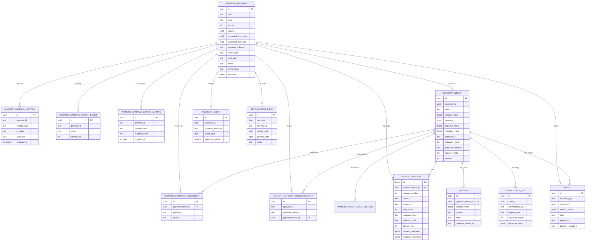

# payment-service — Entity-Relationship Diagram

## 1. Database

- Engine: PostgreSQL 18.
- Schema: `payment` (owned exclusively by this service).
- Migrations: `services/payment-service/migrations/`.

## 2. Cross-Service References

| Column | Type | Refers to | Source of truth |
|--------|------|-----------|------------------|
| `customer_id` | UUID | `Customer` in `customer-service` | `customer-service` |
| `merchant_id` | UUID | `Merchant` in `merchant-service` (for payouts) | `merchant-service` |
| `courier_id` | UUID | `Courier` in `courier-service` (for payouts) | `courier-service` |
| `driver_id` | UUID | `Driver` in `driver-service` (for payouts) | `driver-service` |
| `city_id` | UUID | `City` in `zone-service` | `zone-service` |
| `food_order_id` | UUID | `FoodOrder` in `food-order-service` (ref) | `food-order-service` |
| `ride_id` | UUID | `RideRequest` in `ride-request-service` (ref) | `ride-request-service` |
| `trip_id` | UUID | `Trip` in `trip-service` (ref) | `trip-service` |
| `wallet_id` | UUID | `Wallet` in `wallet-service` (ref) | `wallet-service` |
| `correlation_id` | UUID | request scope | gateway |
| `gateway_id` | TEXT | `PaymentGateway.id` in this schema | this service |

All cross-service references are stored as UUID columns **without**
database-level foreign keys. The `provider_token` is the
gateway's opaque reference; **NO PAN, NO CVV, NO full track
data** is ever stored here.

## 3. Entities

### `PaymentGateway` (gateway registry)

The driver catalog: every payment gateway this service can talk
to. Mirrors the `storage_drivers` table in `file-service` (see
[`../file-service/ERD.md` §3 `StorageDriver`](../file-service/ERD.md)).
The 46 initial rows are enumerated in [`GATEWAYS.md`](./GATEWAYS.md).

The catalog is sourced from `configuration-service`
(`payment.gateway.<id>.*` family) and mirrored into this table
on `configuration.updated.v1`.

#### Columns

| Column | Type | Constraints | Notes |
|--------|------|-------------|-------|
| `id` | TEXT | PK | `gateway_id` from `GATEWAYS.md` (e.g. `stripe`, `paypal`, `paymob`, `binance`, `perfect_money`, `volet`, `payeer`, `now_payments`, …) |
| `kind` | TEXT | NOT NULL | `card` / `mena_wallet` / `mena_aggregator` / `crypto` / `e_currency` / `direct_card_3ds` / `payout` / `latam` / `apac` / `local_apm` |
| `display_name` | TEXT | NOT NULL | human-readable (`Stripe — global cards`, `Paymob — Egypt cards`, `Binance — crypto BUSD`) |
| `state` | TEXT | NOT NULL | `enabled` / `draining` / `disabled` |
| `priority` | INT | NOT NULL DEFAULT 100 | lower wins; admin-set |
| `regions` | TEXT[] | NOT NULL DEFAULT `{}` | eligible region codes (e.g. `eu-west`, `mena`, `apac`) |
| `supported_currencies` | TEXT[] | NOT NULL DEFAULT `{}` | ISO 4217 codes |
| `supported_methods` | TEXT[] | NOT NULL DEFAULT `{}` | `card` / `wallet` / `bnpl` / `bank_transfer` / `crypto` |
| `signature_scheme` | TEXT | NOT NULL | `hmac_sha256` / `hmac_sha512` / `rsa_sha256` / `md5` / `sha256` / `paypal_sdk` / `paymob_hmac` / `kashier_hmac` / `none` |
| `verify_style` | TEXT | NOT NULL | `get_redirect` / `webhook_post` / `signed_webhook` / `cache_lookup` / `iframe_postback` |
| `vault_path` | TEXT | NOT NULL | `secret/payment-service/gateway/<id>/<env>` |
| `health_url` | TEXT | NULL | synthetic probe URL |
| `health` | TEXT | NOT NULL | `healthy` / `degraded` / `unreachable` |
| `health_last_checked_at` | TIMESTAMPTZ | NULL | |
| `is_default` | BOOLEAN | NOT NULL DEFAULT false | env default; at most one row |
| `config_hash` | TEXT | NOT NULL | SHA-256 of resolved config; used to no-op duplicate reloads |
| `metadata` | JSONB | NULL | gateway-specific extras (e.g. `{"amount_unit":"baisa"}` for Thawani, `{"currency_hardcoded":"BUSD"}` for Binance, `{"pay_url_pattern":"crypto_address"}` for NowPayments) |
| `created_at` | TIMESTAMPTZ | NOT NULL DEFAULT now() | |
| `updated_at` | TIMESTAMPTZ | NOT NULL DEFAULT now() | |
| `created_by` | UUID | NOT NULL | |
| `updated_by` | UUID | NOT NULL | |
| `version` | INT | NOT NULL DEFAULT 1 | optimistic concurrency |

#### Indexes

- PK on `id`.
- BTree on `kind`.
- BTree on `state` WHERE `state != 'disabled'`.
- BTree on `priority`.
- Unique partial index on `(is_default) WHERE is_default`.

#### Constraints

- CHECK `kind IN ('card','mena_wallet','mena_aggregator','crypto','e_currency','direct_card_3ds','payout','latam','apac','local_apm')`.
- CHECK `state IN ('enabled','draining','disabled')`.
- CHECK `health IN ('healthy','degraded','unreachable')`.
- CHECK `signature_scheme IN ('hmac_sha256','hmac_sha512','rsa_sha256','md5','sha256','paypal_sdk','paymob_hmac','kashier_hmac','none')`.
- CHECK `verify_style IN ('get_redirect','webhook_post','signed_webhook','cache_lookup','iframe_postback')`.
- CHECK `version > 0`.

### `PaymentGatewayAssignment` (per-intent gateway source audit)

Why a payment intent sits on its current gateway: explicit pin by
admin, per-tenant override, per-region / per-currency /
per-method default, or env default. Recorded once at intent
creation and on every re-resolution.

#### Columns

| Column | Type | Constraints | Notes |
|--------|------|-------------|-------|
| `id` | UUID | PK | UUIDv7 |
| `payment_intent_id` | UUID | NOT NULL | |
| `gateway_id` | TEXT | NOT NULL | the chosen gateway |
| `source` | TEXT | NOT NULL | `gateway_pin` / `tenant_override` / `region_default` / `currency_default` / `method_default` / `env_default` / `auto` |
| `rule_id` | TEXT | NULL | which override rule fired (e.g. `tenant:abc123`, `region:mena`, `currency:EGP`) |
| `effective_at` | TIMESTAMPTZ | NOT NULL DEFAULT now() | |
| `created_by` | UUID | NOT NULL | who placed it (system or admin sub) |

#### Indexes

- PK on `id`.
- BTree on `(payment_intent_id, effective_at DESC)`.
- BTree on `gateway_id`.
- BTree on `source`.

#### Constraints

- CHECK `source IN ('gateway_pin','tenant_override','region_default','currency_default','method_default','env_default','auto')`.

### `PaymentGatewayHistory` (pin / drain / decommission audit)

Every change to `payment_intents.gateway_id` or to a gateway's
catalog state (`enabled` → `draining` → `disabled`) is recorded
here as an append-only audit row.

#### Columns

| Column | Type | Constraints | Notes |
|--------|------|-------------|-------|
| `id` | UUID | PK | UUIDv7 |
| `gateway_id` | TEXT | NOT NULL | the gateway whose state changed |
| `payment_intent_id` | UUID | NULL | nullable; set when the history row is about a per-intent pin |
| `change_type` | TEXT | NOT NULL | `intent_create` (initial resolution) / `intent_repin` (admin re-pinned) / `activate` (catalog → enabled) / `drain` (catalog → draining) / `disable` (catalog → disabled) |
| `from_gateway_id` | TEXT | NULL | NULL on `intent_create` |
| `to_gateway_id` | TEXT | NOT NULL | |
| `from_state` | TEXT | NULL | |
| `to_state` | TEXT | NOT NULL | |
| `actor_sub` | UUID | NOT NULL | admin who triggered, or service identity |
| `reason` | TEXT | NULL | free text; e.g. `region failover`, `gateway decommission`, `vendor consolidation` |
| `signature` | TEXT | NOT NULL | HMAC-SHA256 hex |
| `occurred_at` | TIMESTAMPTZ | NOT NULL DEFAULT now() | |
| `metadata` | JSONB | NULL | gateway-specific extras |

#### Indexes

- PK on `id`.
- BTree on `(gateway_id, occurred_at DESC)`.
- BTree on `(payment_intent_id, occurred_at DESC) WHERE payment_intent_id IS NOT NULL`.
- BTree on `change_type`.

#### Constraints

- CHECK `change_type IN ('intent_create','intent_repin','activate','drain','disable')`.
- CHECK `from_state IS NULL OR from_state IN ('enabled','draining','disabled')`.
- CHECK `to_state IN ('enabled','draining','disabled')`.

### `PaymentGatewayIntentRegistry` (logical-key enforcement)

Per-gateway "gateway-internal intent id" registry. Enforces the
equivalent of the upstream Laravel package's cache-based
`payment_id ↔ gateway_id` mapping at the database level so the
platform survives driver crashes and replay attempts.

#### Columns

| Column | Type | Constraints | Notes |
|--------|------|-------------|-------|
| `id` | UUID | PK | UUIDv7 |
| `gateway_id` | TEXT | NOT NULL | FK_ref to `payment_gateways.id` |
| `gateway_intent_id` | TEXT | NOT NULL | the gateway's own payment id (e.g. Stripe `pi_…`, PayPal order id, Paymob intention id) |
| `payment_intent_id` | UUID | NOT NULL | the canonical `payment_intents.id` for this (gateway, gateway_intent) pair |
| `created_at` | TIMESTAMPTZ | NOT NULL DEFAULT now() | |

#### Indexes

- PK on `id`.
- UNIQUE `(gateway_id, gateway_intent_id)` — enforces "no two
  intents on the same gateway share the same gateway-internal id".
- BTree on `payment_intent_id`.

### `PaymentGatewayHealthEvent` (per-gateway synthetic probe log)

Append-mostly log of every synthetic probe result; rolled up to
`payment_gateways.health` gauge on the metrics layer. Heavy write
volume → partitioned monthly.

#### Columns

| Column | Type | Constraints | Notes |
|--------|------|-------------|-------|
| `id` | UUID | NOT NULL | UUIDv7 |
| `occurred_at` | TIMESTAMPTZ | NOT NULL DEFAULT now() | partition key |
| `gateway_id` | TEXT | NOT NULL | |
| `result` | TEXT | NOT NULL | `pass` / `warn` / `fail` |
| `latency_ms` | INT | NULL | |
| `error_class` | TEXT | NULL | `dns` / `timeout` / `auth` / `5xx` / `signature` |
| `correlation_id` | UUID | NOT NULL | |
| `metadata` | JSONB | NULL | gateway-specific extras |

#### Indexes

- BTree on `(gateway_id, occurred_at DESC)`.
- BTree on `correlation_id`.

#### Partitioning

- Range-partitioned by `occurred_at`, monthly; 90-day retention.

### `PaymentGatewayErrorMapping` (vendor-code → platform-code)

The translation table that satisfies the anchor sentence in
[`architecture/DOWNSTREAM_ERROR_CATALOG.md` §5 L289–291](../../architecture/DOWNSTREAM_ERROR_CATALOG.md#5-propagation-rules)
("The translation table is per-vendor and lives in the service's
`INTEGRATION.md` … `Provider error mapping`"). For each gateway,
maps a vendor-native error code/status string to a platform error
code (one of `PAYMENT_CARD_DECLINED`, `PAYMENT_INSUFFICIENT_FUNDS`,
`PAYMENT_PROVIDER_UNAVAILABLE`, etc.) and records the original
in the audit event.

#### Columns

| Column | Type | Constraints | Notes |
|--------|------|-------------|-------|
| `id` | UUID | PK | UUIDv7 |
| `gateway_id` | TEXT | NOT NULL | FK_ref to `payment_gateways.id` |
| `vendor_code` | TEXT | NOT NULL | the gateway's own error code or status string (e.g. `do_not_honor`, `card_declined`, `PAYPAL_CARD_DECLINED`, `000.000.000` for HyperPay success — also non-success codes map here) |
| `vendor_message_pattern` | TEXT | NULL | optional regex matched against `error_message`; if `vendor_code` is ambiguous, this disambiguates |
| `platform_code` | TEXT | NOT NULL | one of the platform codes in [`architecture/DOWNSTREAM_ERROR_CATALOG.md` §4.2](../../architecture/DOWNSTREAM_ERROR_CATALOG.md) |
| `is_terminal` | BOOLEAN | NOT NULL DEFAULT false | `true` if the platform should NOT retry (e.g. card declined); `false` if retry is appropriate (e.g. timeout) |
| `retry_after_seconds` | INT | NULL | optional backoff hint |
| `created_at` | TIMESTAMPTZ | NOT NULL DEFAULT now() | |
| `updated_at` | TIMESTAMPTZ | NOT NULL DEFAULT now() | |
| `version` | INT | NOT NULL DEFAULT 1 | |

#### Indexes

- PK on `id`.
- Unique partial index `(gateway_id, vendor_code) WHERE vendor_message_pattern IS NULL`.
- Unique partial index `(gateway_id, vendor_code, vendor_message_pattern) WHERE vendor_message_pattern IS NOT NULL`.

#### Constraints

- CHECK `is_terminal IN (false, true)`.
- CHECK `version > 0`.

### `PaymentIntent`

The platform's mirror of a gateway payment intent. The
authoritative state for "is this customer's money captured or
not".

#### Columns

| Column | Type | Constraints | Notes |
|--------|------|-------------|-------|
| `id` | UUID | PK | UUIDv7 |
| `customer_id` | UUID | NOT NULL | cross-service ref |
| `wallet_id` | UUID | NULL | if the destination is a wallet |
| `merchant_id` | UUID | NULL | for merchant payouts (rare here) |
| `city_id` | UUID | NOT NULL | |
| `food_order_id` | UUID | NULL | business ref |
| `ride_id` | UUID | NULL | business ref |
| `trip_id` | UUID | NULL | business ref |
| `state` | TEXT | NOT NULL CHECK in (`created`,`authorized`,`captured`,`voided`,`refunded`,`partially_refunded`,`disputed`,`failed`) | state machine |
| `amount_minor` | BIGINT | NOT NULL | positive |
| `currency` | CHAR(3) | NOT NULL | ISO 4217 |
| `captured_minor` | BIGINT | NOT NULL DEFAULT 0 | cumulative captured |
| `refunded_minor` | BIGINT | NOT NULL DEFAULT 0 | cumulative refunded |
| `gateway_id` | TEXT | NOT NULL | FK_ref to `payment_gateways.id` (the 46-row registry) |
| `gateway_region` | TEXT | NOT NULL | e.g. `eu-west`, `mena`, `apac` |
| `gateway_intent_id` | TEXT | NULL | set after gateway call; mirrored in `payment_gateway_intent_registry` |
| `gateway_locator` | JSONB | NULL | opaque per-gateway handle for replay / cancel / capture (e.g. Stripe `payment_method`, PayPal `order_id`, Paymob `client_secret`) |
| `gateway_token` | TEXT | NULL | the tokenised reference (was `provider_token`) |
| `capture_mode` | TEXT | NOT NULL CHECK in (`auto`,`manual`) | |
| `description` | TEXT | NULL | human-readable |
| `metadata` | JSONB | NULL | extensible |
| `last_error` | JSONB | NULL | `{platform_code, vendor_code, vendor_message, occurred_at}` (was single TEXT — now structured) |
| `correlation_id` | UUID | NOT NULL | |
| `authorized_at` | TIMESTAMPTZ | NULL | |
| `captured_at` | TIMESTAMPTZ | NULL | |
| `voided_at` | TIMESTAMPTZ | NULL | |
| `refunded_at` | TIMESTAMPTZ | NULL | last refund |
| `ended_at` | TIMESTAMPTZ | NULL | any terminal state |
| `created_at` | TIMESTAMPTZ | NOT NULL DEFAULT now() | |
| `updated_at` | TIMESTAMPTZ | NOT NULL DEFAULT now() | |
| `created_by` | UUID | NOT NULL | |
| `updated_by` | UUID | NOT NULL | |
| `version` | INT | NOT NULL DEFAULT 1 | optimistic concurrency |

#### Indexes

- PK on `id`.
- BTree on `(gateway_id, gateway_intent_id)` WHERE `gateway_intent_id IS NOT NULL`.
- Index on `state, updated_at` for operational queries.
- Index on `customer_id, created_at DESC` for customer history.
- Index on `food_order_id` (where not null).
- Index on `ride_id` (where not null).
- Index on `trip_id` (where not null).

#### Constraints

- CHECK `state IN (...)` as above.
- CHECK `amount_minor > 0`.
- CHECK `captured_minor >= 0 AND captured_minor <= amount_minor`.
- CHECK `refunded_minor >= 0 AND refunded_minor <= captured_minor`.
- CHECK `capture_mode IN ('auto','manual')`.
- CHECK `version > 0`.

### `PaymentIntentStateHistory`

Append-only audit of intent state transitions.

#### Columns

| Column | Type | Constraints | Notes |
|--------|------|-------------|-------|
| `id` | BIGSERIAL | PK | |
| `payment_intent_id` | UUID | NOT NULL | FK within schema |
| `from_state` | TEXT | NULL | |
| `to_state` | TEXT | NOT NULL | |
| `actor_type` | TEXT | NOT NULL CHECK in (`service`,`admin`,`gateway`,`system`) | `gateway` replaces `provider` |
| `actor_id` | UUID | NULL | |
| `reason` | TEXT | NULL | |
| `metadata` | JSONB | NULL | small |
| `occurred_at` | TIMESTAMPTZ | NOT NULL | |
| `correlation_id` | UUID | NOT NULL | |
| `created_at` | TIMESTAMPTZ | NOT NULL DEFAULT now() | append-only |

#### Indexes

- PK on `id`.
- Index on `payment_intent_id, occurred_at`.

### `PaymentAttempt` (Partitioned by Month)

Append-only log of every gateway call.

#### Columns

| Column | Type | Constraints | Notes |
|--------|------|-------------|-------|
| `id` | BIGSERIAL | PK | |
| `payment_intent_id` | UUID | NOT NULL | FK within schema |
| `attempt_number` | INT | NOT NULL | |
| `action` | TEXT | NOT NULL CHECK in (`create`,`authorize`,`capture`,`void`,`refund`,`payout`) | |
| `idempotency_key` | TEXT | NOT NULL | |
| `gateway_id` | TEXT | NOT NULL | FK_ref to `payment_gateways.id` |
| `gateway_endpoint` | TEXT | NOT NULL | |
| `request_sanitised` | JSONB | NOT NULL | NO PAN, NO CVV |
| `response_sanitised` | JSONB | NOT NULL | NO PAN, NO CVV |
| `outcome` | TEXT | NOT NULL CHECK in (`success`,`transient_error`,`permanent_error`,`declined`,`timeout`) | |
| `http_status` | INT | NULL | |
| `gateway_code` | TEXT | NULL | the vendor-native code; looked up in `payment_gateway_error_mapping` to translate |
| `platform_code` | TEXT | NULL | the translated platform code (NULL until translation runs) |
| `error_message` | TEXT | NULL | |
| `latency_ms` | INT | NOT NULL | |
| `occurred_at` | TIMESTAMPTZ | NOT NULL | |
| `correlation_id` | UUID | NOT NULL | |
| `created_at` | TIMESTAMPTZ | NOT NULL DEFAULT now() | append-only |
| PRIMARY KEY (id, occurred_at) | | | for partitioning |

#### Indexes

- PK on `(id, occurred_at)`.
- Unique on `(payment_intent_id, attempt_number, action)`.
- Index on `payment_intent_id, occurred_at`.
- Index on `(gateway_id, outcome, occurred_at)` for per-gateway health.

#### Constraints

- CHECK `action IN (...)` as above.
- CHECK `outcome IN (...)` as above.

### `Refund`

Records of refunds. One intent may have multiple refunds.

#### Columns

| Column | Type | Constraints | Notes |
|--------|------|-------------|-------|
| `id` | UUID | PK | UUIDv7 |
| `payment_intent_id` | UUID | NOT NULL | FK within schema |
| `amount_minor` | BIGINT | NOT NULL | positive |
| `currency` | CHAR(3) | NOT NULL | |
| `reason` | TEXT | NOT NULL | `cancellation`,`quality`,`goodwill`,`chargeback`,`other` |
| `actor_id` | UUID | NULL | admin or system |
| `state` | TEXT | NOT NULL CHECK in (`initiated`,`succeeded`,`failed`) | |
| `gateway_refund_id` | TEXT | NULL | set on success (was `provider_refund_id`) |
| `idempotency_key` | TEXT | NOT NULL | |
| `correlation_id` | UUID | NOT NULL | |
| `occurred_at` | TIMESTAMPTZ | NOT NULL | |
| `created_at` | TIMESTAMPTZ | NOT NULL DEFAULT now() | |
| `updated_at` | TIMESTAMPTZ | NOT NULL DEFAULT now() | |

#### Constraints

- CHECK `amount_minor > 0`.
- CHECK `state IN ('initiated','succeeded','failed')`.

### `IdempotencyKey` (Cache Table)

Persisted idempotency responses. The Redis cache is the hot path;
this table is the durable record.

#### Columns

| Column | Type | Constraints | Notes |
|--------|------|-------------|-------|
| `id` | UUID | PK | UUIDv7 |
| `client_id` | UUID | NOT NULL | the caller |
| `idempotency_key` | TEXT | NOT NULL | |
| `request_hash` | TEXT | NOT NULL | hash of the canonical request body |
| `response_status` | INT | NOT NULL | HTTP status returned |
| `response_body` | JSONB | NOT NULL | |
| `expires_at` | TIMESTAMPTZ | NOT NULL | |
| `created_at` | TIMESTAMPTZ | NOT NULL DEFAULT now() | |

#### Constraints

- UNIQUE `(client_id, idempotency_key)`.

### `Payout`

A merchant / courier / driver payout. (Distinct from the
financial services' payout orchestration; this is the
gateway-facing record.)

#### Columns

| Column | Type | Constraints | Notes |
|--------|------|-------------|-------|
| `id` | UUID | PK | UUIDv7 |
| `recipient_type` | TEXT | NOT NULL CHECK in (`merchant`,`courier`,`driver`) | |
| `recipient_id` | UUID | NOT NULL | cross-service ref |
| `amount_minor` | BIGINT | NOT NULL | positive |
| `currency` | CHAR(3) | NOT NULL | |
| `state` | TEXT | NOT NULL CHECK in (`pending`,`in_flight`,`paid`,`failed`,`returned`) | |
| `gateway_id` | TEXT | NOT NULL | FK_ref to `payment_gateways.id` (e.g. `wise`, `paypal`, `payeer`, `volet`) |
| `gateway_payout_id` | TEXT | NULL | set on success (was `provider_payout_id`) |
| `payment_method_token` | TEXT | NOT NULL | tokenised |
| `retry_count` | INT | NOT NULL DEFAULT 0 | |
| `max_retries` | INT | NOT NULL | |
| `last_error` | JSONB | NULL | structured |
| `correlation_id` | UUID | NOT NULL | |
| `occurred_at` | TIMESTAMPTZ | NOT NULL | |
| `created_at` | TIMESTAMPTZ | NOT NULL DEFAULT now() | |
| `updated_at` | TIMESTAMPTZ | NOT NULL DEFAULT now() | |

#### Constraints

- CHECK `amount_minor > 0`.
- CHECK `state IN (...)` as above.

### `WebhookEvent` (Inbox)

A persisted log of every received webhook. Used for replay and
forensic analysis.

#### Columns

| Column | Type | Constraints | Notes |
|--------|------|-------------|-------|
| `id` | UUID | PK | UUIDv7 |
| `gateway_id` | TEXT | NOT NULL | FK_ref to `payment_gateways.id` |
| `gateway_event_id` | TEXT | NOT NULL | for dedup (was `provider_event_id`) |
| `event_type` | TEXT | NOT NULL | |
| `payload` | JSONB | NOT NULL | sanitised |
| `signature_verified` | BOOLEAN | NOT NULL | |
| `processed_at` | TIMESTAMPTZ | NULL | |
| `received_at` | TIMESTAMPTZ | NOT NULL DEFAULT now() | |

#### Constraints

- UNIQUE `(gateway_id, gateway_event_id)`.

### `ReconciliationRun`

Per-gateway reconciliation summary (the `provider_total` column
becomes a per-gateway JSONB map; one row per run per gateway).

#### Columns

| Column | Type | Constraints | Notes |
|--------|------|-------------|-------|
| `id` | UUID | PK | UUIDv7 |
| `run_date` | DATE | NOT NULL | |
| `gateway_id` | TEXT | NOT NULL | FK_ref to `payment_gateways.id`; one row per (date, gateway) |
| `started_at` | TIMESTAMPTZ | NOT NULL | |
| `ended_at` | TIMESTAMPTZ | NULL | |
| `intents_total` | BIGINT | NOT NULL | sum from this service |
| `gateway_total` | BIGINT | NOT NULL | sum from gateway report |
| `drift_count` | BIGINT | NOT NULL | |
| `status` | TEXT | NOT NULL CHECK in (`running`,`matched`,`drift`,`error`) | |
| `details` | JSONB | NULL | drift details |
| `correlation_id` | UUID | NOT NULL | |
| `created_at` | TIMESTAMPTZ | NOT NULL DEFAULT now() | |

#### Indexes

- PK on `id`.
- UNIQUE `(run_date, gateway_id)`.

### `Outbox` / `Inbox`

Standard platform outbox/inbox. The outbox carries the events
emitted to Kafka; the inbox carries consumed events (currently
only `customer.suspended.v1` and `configuration.updated.v1`).

## 4. Mermaid ER Diagram



## 5. DDL Sketch

```sql
CREATE SCHEMA IF NOT EXISTS payment;

-- ============================================================
-- Payment Gateway Registry (mirrors file-service.storage_drivers)
-- ============================================================

CREATE TABLE payment.payment_gateways (
    id TEXT PRIMARY KEY,
    kind TEXT NOT NULL CHECK (kind IN
        ('card','mena_wallet','mena_aggregator','crypto','e_currency',
         'direct_card_3ds','payout','latam','apac','local_apm')),
    display_name TEXT NOT NULL,
    state TEXT NOT NULL CHECK (state IN ('enabled','draining','disabled')),
    priority INT NOT NULL DEFAULT 100,
    regions TEXT[] NOT NULL DEFAULT ARRAY[]::TEXT[],
    supported_currencies TEXT[] NOT NULL DEFAULT ARRAY[]::TEXT[],
    supported_methods TEXT[] NOT NULL DEFAULT ARRAY[]::TEXT[],
    signature_scheme TEXT NOT NULL CHECK (signature_scheme IN
        ('hmac_sha256','hmac_sha512','rsa_sha256','md5','sha256',
         'paypal_sdk','paymob_hmac','kashier_hmac','none')),
    verify_style TEXT NOT NULL CHECK (verify_style IN
        ('get_redirect','webhook_post','signed_webhook','cache_lookup','iframe_postback')),
    vault_path TEXT NOT NULL,
    health_url TEXT,
    health TEXT NOT NULL CHECK (health IN ('healthy','degraded','unreachable')),
    health_last_checked_at TIMESTAMPTZ,
    is_default BOOLEAN NOT NULL DEFAULT false,
    config_hash TEXT NOT NULL,
    metadata JSONB,
    created_at TIMESTAMPTZ NOT NULL DEFAULT now(),
    updated_at TIMESTAMPTZ NOT NULL DEFAULT now(),
    created_by UUID NOT NULL,
    updated_by UUID NOT NULL,
    version INT NOT NULL DEFAULT 1,
    CONSTRAINT payment_gateways_version_chk CHECK (version > 0)
);

CREATE INDEX payment_gateways_kind_ix ON payment.payment_gateways (kind);
CREATE INDEX payment_gateways_state_active_ix
    ON payment.payment_gateways (state) WHERE state != 'disabled';
CREATE INDEX payment_gateways_priority_ix ON payment.payment_gateways (priority);
CREATE UNIQUE INDEX payment_gateways_is_default_uq
    ON payment.payment_gateways (is_default) WHERE is_default;

CREATE TABLE payment.payment_gateway_assignments (
    id UUID PRIMARY KEY,
    payment_intent_id UUID NOT NULL,
    gateway_id TEXT NOT NULL,
    source TEXT NOT NULL CHECK (source IN
        ('gateway_pin','tenant_override','region_default',
         'currency_default','method_default','env_default','auto')),
    rule_id TEXT,
    effective_at TIMESTAMPTZ NOT NULL DEFAULT now(),
    created_by UUID NOT NULL
);

CREATE INDEX payment_gateway_assignments_intent_time_ix
    ON payment.payment_gateway_assignments (payment_intent_id, effective_at DESC);
CREATE INDEX payment_gateway_assignments_gateway_ix
    ON payment.payment_gateway_assignments (gateway_id);
CREATE INDEX payment_gateway_assignments_source_ix
    ON payment.payment_gateway_assignments (source);

CREATE TABLE payment.payment_gateway_history (
    id UUID PRIMARY KEY,
    gateway_id TEXT NOT NULL,
    payment_intent_id UUID,
    change_type TEXT NOT NULL CHECK (change_type IN
        ('intent_create','intent_repin','activate','drain','disable')),
    from_gateway_id TEXT,
    to_gateway_id TEXT NOT NULL,
    from_state TEXT CHECK (from_state IS NULL OR from_state IN ('enabled','draining','disabled')),
    to_state TEXT NOT NULL CHECK (to_state IN ('enabled','draining','disabled')),
    actor_sub UUID NOT NULL,
    reason TEXT,
    signature TEXT NOT NULL,
    occurred_at TIMESTAMPTZ NOT NULL DEFAULT now(),
    metadata JSONB
);

CREATE INDEX payment_gateway_history_gateway_time_ix
    ON payment.payment_gateway_history (gateway_id, occurred_at DESC);
CREATE INDEX payment_gateway_history_intent_time_ix
    ON payment.payment_gateway_history (payment_intent_id, occurred_at DESC)
    WHERE payment_intent_id IS NOT NULL;
CREATE INDEX payment_gateway_history_change_type_ix
    ON payment.payment_gateway_history (change_type);

CREATE TABLE payment.payment_gateway_intent_registry (
    id UUID PRIMARY KEY,
    gateway_id TEXT NOT NULL,
    gateway_intent_id TEXT NOT NULL,
    payment_intent_id UUID NOT NULL,
    created_at TIMESTAMPTZ NOT NULL DEFAULT now(),
    CONSTRAINT payment_gateway_intent_registry_uq UNIQUE (gateway_id, gateway_intent_id)
);

CREATE INDEX payment_gateway_intent_registry_intent_ix
    ON payment.payment_gateway_intent_registry (payment_intent_id);

CREATE TABLE payment.payment_gateway_health_events (
    id UUID NOT NULL,
    occurred_at TIMESTAMPTZ NOT NULL DEFAULT now(),
    gateway_id TEXT NOT NULL,
    result TEXT NOT NULL CHECK (result IN ('pass','warn','fail')),
    latency_ms INT,
    error_class TEXT,
    correlation_id UUID NOT NULL,
    metadata JSONB,
    PRIMARY KEY (id, occurred_at)
) PARTITION BY RANGE (occurred_at);

CREATE TABLE IF NOT EXISTS payment.payment_gateway_health_events_2026_07
    PARTITION OF payment.payment_gateway_health_events
    FOR VALUES FROM ('2026-07-01 00:00:00+00') TO ('2026-08-01 00:00:00+00');

CREATE INDEX payment_gateway_health_events_gateway_time_ix
    ON payment.payment_gateway_health_events (gateway_id, occurred_at DESC);
CREATE INDEX payment_gateway_health_events_correlation_ix
    ON payment.payment_gateway_health_events (correlation_id);

CREATE TABLE payment.payment_gateway_error_mapping (
    id UUID PRIMARY KEY,
    gateway_id TEXT NOT NULL,
    vendor_code TEXT NOT NULL,
    vendor_message_pattern TEXT,
    platform_code TEXT NOT NULL,
    is_terminal BOOLEAN NOT NULL DEFAULT false,
    retry_after_seconds INT,
    created_at TIMESTAMPTZ NOT NULL DEFAULT now(),
    updated_at TIMESTAMPTZ NOT NULL DEFAULT now(),
    version INT NOT NULL DEFAULT 1,
    CONSTRAINT payment_gateway_error_mapping_version_chk CHECK (version > 0),
    CONSTRAINT payment_gateway_error_mapping_simple_uq
        UNIQUE (gateway_id, vendor_code),
    CONSTRAINT payment_gateway_error_mapping_pattern_uq
        UNIQUE (gateway_id, vendor_code, vendor_message_pattern)
);

-- ============================================================
-- Core money tables (provider columns renamed to gateway_*)
-- ============================================================

CREATE TABLE payment.payment_intents (
    id UUID PRIMARY KEY,
    customer_id UUID NOT NULL,
    wallet_id UUID,
    merchant_id UUID,
    city_id UUID NOT NULL,
    food_order_id UUID,
    ride_id UUID,
    trip_id UUID,
    state TEXT NOT NULL CHECK (state IN
        ('created','authorized','captured','voided',
         'refunded','partially_refunded','disputed','failed')),
    amount_minor BIGINT NOT NULL,
    currency CHAR(3) NOT NULL,
    captured_minor BIGINT NOT NULL DEFAULT 0,
    refunded_minor BIGINT NOT NULL DEFAULT 0,
    gateway_id TEXT NOT NULL,
    gateway_region TEXT NOT NULL,
    gateway_intent_id TEXT,
    gateway_locator JSONB,
    gateway_token TEXT,
    capture_mode TEXT NOT NULL CHECK (capture_mode IN ('auto','manual')),
    description TEXT,
    metadata JSONB,
    last_error JSONB,
    correlation_id UUID NOT NULL,
    authorized_at TIMESTAMPTZ,
    captured_at TIMESTAMPTZ,
    voided_at TIMESTAMPTZ,
    refunded_at TIMESTAMPTZ,
    ended_at TIMESTAMPTZ,
    created_at TIMESTAMPTZ NOT NULL DEFAULT now(),
    updated_at TIMESTAMPTZ NOT NULL DEFAULT now(),
    created_by UUID NOT NULL,
    updated_by UUID NOT NULL,
    version INT NOT NULL DEFAULT 1,
    CONSTRAINT payment_intents_amounts_chk
        CHECK (amount_minor > 0
               AND captured_minor >= 0 AND captured_minor <= amount_minor
               AND refunded_minor >= 0 AND refunded_minor <= captured_minor),
    CONSTRAINT payment_intents_version_chk CHECK (version > 0)
);

CREATE INDEX payment_intents_gateway_intent_ix
    ON payment.payment_intents (gateway_id, gateway_intent_id)
    WHERE gateway_intent_id IS NOT NULL;
CREATE INDEX payment_intents_state_updated_ix ON payment.payment_intents (state, updated_at);
CREATE INDEX payment_intents_customer_created_ix
    ON payment.payment_intents (customer_id, created_at DESC);
CREATE INDEX payment_intents_food_order_ix
    ON payment.payment_intents (food_order_id) WHERE food_order_id IS NOT NULL;
CREATE INDEX payment_intents_ride_ix
    ON payment.payment_intents (ride_id) WHERE ride_id IS NOT NULL;
CREATE INDEX payment_intents_trip_ix
    ON payment.payment_intents (trip_id) WHERE trip_id IS NOT NULL;

CREATE TABLE payment.payment_intent_state_history (
    id BIGSERIAL PRIMARY KEY,
    payment_intent_id UUID NOT NULL REFERENCES payment.payment_intents(id),
    from_state TEXT,
    to_state TEXT NOT NULL,
    actor_type TEXT NOT NULL CHECK (actor_type IN ('service','admin','gateway','system')),
    actor_id UUID,
    reason TEXT,
    metadata JSONB,
    occurred_at TIMESTAMPTZ NOT NULL,
    correlation_id UUID NOT NULL,
    created_at TIMESTAMPTZ NOT NULL DEFAULT now()
);

CREATE INDEX payment_intent_state_history_intent_time_ix
    ON payment.payment_intent_state_history (payment_intent_id, occurred_at);

CREATE TABLE payment.payment_attempts (
    id BIGSERIAL,
    payment_intent_id UUID NOT NULL REFERENCES payment.payment_intents(id),
    attempt_number INT NOT NULL,
    action TEXT NOT NULL CHECK (action IN
        ('create','authorize','capture','void','refund','payout')),
    idempotency_key TEXT NOT NULL,
    gateway_id TEXT NOT NULL,
    gateway_endpoint TEXT NOT NULL,
    request_sanitised JSONB NOT NULL,
    response_sanitised JSONB NOT NULL,
    outcome TEXT NOT NULL CHECK (outcome IN
        ('success','transient_error','permanent_error','declined','timeout')),
    http_status INT,
    gateway_code TEXT,
    platform_code TEXT,
    error_message TEXT,
    latency_ms INT NOT NULL,
    occurred_at TIMESTAMPTZ NOT NULL,
    correlation_id UUID NOT NULL,
    created_at TIMESTAMPTZ NOT NULL DEFAULT now(),
    PRIMARY KEY (id, occurred_at)
) PARTITION BY RANGE (occurred_at);

CREATE TABLE IF NOT EXISTS payment.payment_attempts_2026_07
    PARTITION OF payment.payment_attempts
    FOR VALUES FROM ('2026-07-01 00:00:00+00') TO ('2026-08-01 00:00:00+00');

-- Verify IF NOT EXISTS did not hide a wrong parent or range.
DO $$
DECLARE
    v_parent   REGCLASS := 'payment.payment_attempts'::REGCLASS;
    v_child    REGCLASS := 'payment.payment_attempts_2026_07'::REGCLASS;
    v_expected TSTZRANGE := tstzrange('2026-07-01 00:00:00+00',
                                      '2026-08-01 00:00:00+00',
                                      '[)');
BEGIN
    IF (SELECT inhparent FROM pg_inherits WHERE inhrelid = v_child)
       IS DISTINCT FROM v_parent THEN
        RAISE EXCEPTION 'partition % is not attached to %',
            v_child::text, v_parent::text;
    END IF;
    IF NOT (SELECT relpartbound FROM pg_class WHERE oid = v_child)
              = v_expected THEN
        RAISE EXCEPTION 'partition % has unexpected bounds', v_child::text;
    END IF;
END $$;

CREATE UNIQUE INDEX payment_attempts_intent_attempt_action_uq
    ON payment.payment_attempts (payment_intent_id, attempt_number, action);
CREATE INDEX payment_attempts_intent_time_ix
    ON payment.payment_attempts (payment_intent_id, occurred_at);
CREATE INDEX payment_attempts_gateway_outcome_time_ix
    ON payment.payment_attempts (gateway_id, outcome, occurred_at);

CREATE TABLE payment.refunds (
    id UUID PRIMARY KEY,
    payment_intent_id UUID NOT NULL REFERENCES payment.payment_intents(id),
    amount_minor BIGINT NOT NULL,
    currency CHAR(3) NOT NULL,
    reason TEXT NOT NULL,
    actor_id UUID,
    state TEXT NOT NULL CHECK (state IN ('initiated','succeeded','failed')),
    gateway_refund_id TEXT,
    idempotency_key TEXT NOT NULL,
    correlation_id UUID NOT NULL,
    occurred_at TIMESTAMPTZ NOT NULL,
    created_at TIMESTAMPTZ NOT NULL DEFAULT now(),
    updated_at TIMESTAMPTZ NOT NULL DEFAULT now(),
    CONSTRAINT refunds_amount_chk CHECK (amount_minor > 0)
);

CREATE TABLE payment.idempotency_keys (
    id UUID PRIMARY KEY,
    client_id UUID NOT NULL,
    idempotency_key TEXT NOT NULL,
    request_hash TEXT NOT NULL,
    response_status INT NOT NULL,
    response_body JSONB NOT NULL,
    expires_at TIMESTAMPTZ NOT NULL,
    created_at TIMESTAMPTZ NOT NULL DEFAULT now(),
    CONSTRAINT idem_uq UNIQUE (client_id, idempotency_key)
);

CREATE INDEX idem_expires_ix ON payment.idempotency_keys (expires_at);

CREATE TABLE payment.payouts (
    id UUID PRIMARY KEY,
    recipient_type TEXT NOT NULL CHECK (recipient_type IN ('merchant','courier','driver')),
    recipient_id UUID NOT NULL,
    amount_minor BIGINT NOT NULL,
    currency CHAR(3) NOT NULL,
    state TEXT NOT NULL CHECK (state IN
        ('pending','in_flight','paid','failed','returned')),
    gateway_id TEXT NOT NULL,
    gateway_payout_id TEXT,
    payment_method_token TEXT NOT NULL,
    retry_count INT NOT NULL DEFAULT 0,
    max_retries INT NOT NULL,
    last_error JSONB,
    correlation_id UUID NOT NULL,
    occurred_at TIMESTAMPTZ NOT NULL,
    created_at TIMESTAMPTZ NOT NULL DEFAULT now(),
    updated_at TIMESTAMPTZ NOT NULL DEFAULT now(),
    CONSTRAINT payouts_amount_chk CHECK (amount_minor > 0)
);

CREATE TABLE payment.webhook_events (
    id UUID PRIMARY KEY,
    gateway_id TEXT NOT NULL,
    gateway_event_id TEXT NOT NULL,
    event_type TEXT NOT NULL,
    payload JSONB NOT NULL,
    signature_verified BOOLEAN NOT NULL,
    processed_at TIMESTAMPTZ,
    received_at TIMESTAMPTZ NOT NULL DEFAULT now(),
    CONSTRAINT webhook_uq UNIQUE (gateway_id, gateway_event_id)
);

CREATE TABLE payment.reconciliation_runs (
    id UUID PRIMARY KEY,
    run_date DATE NOT NULL,
    gateway_id TEXT NOT NULL,
    started_at TIMESTAMPTZ NOT NULL,
    ended_at TIMESTAMPTZ,
    intents_total BIGINT NOT NULL,
    gateway_total BIGINT NOT NULL,
    drift_count BIGINT NOT NULL,
    status TEXT NOT NULL CHECK (status IN ('running','matched','drift','error')),
    details JSONB,
    correlation_id UUID NOT NULL,
    created_at TIMESTAMPTZ NOT NULL DEFAULT now(),
    CONSTRAINT reconciliation_run_date_gateway_uq UNIQUE (run_date, gateway_id)
);

CREATE TABLE payment.outbox (
    id BIGSERIAL PRIMARY KEY,
    event_id UUID UNIQUE NOT NULL,
    topic TEXT NOT NULL,
    partition_key UUID NOT NULL,
    payload JSONB NOT NULL,
    created_at TIMESTAMPTZ NOT NULL DEFAULT now(),
    claimed_at TIMESTAMPTZ,
    published_at TIMESTAMPTZ
);

CREATE TABLE payment.inbox (
    event_id UUID PRIMARY KEY,
    topic TEXT NOT NULL,
    received_at TIMESTAMPTZ NOT NULL DEFAULT now(),
    processed_at TIMESTAMPTZ,
    error TEXT
);
```

## 6. Audit Columns

Every mutable table has `created_at`, `updated_at`, `created_by`,
`updated_by`. The `payment_attempts`,
`payment_intent_state_history`, `webhook_events`,
`payment_gateway_assignments`, `payment_gateway_history`, and
`payment_gateway_health_events` tables are append-only.

## 7. Soft Delete

Not used. `payment_intent` rows are immutable. A separate
retention job hard-deletes intents older than 7 years.

## 8. JSONB Usage

- `payment_gateways.metadata` — gateway-specific extras (e.g.
  `amount_unit='baisa'` for Thawani; `currency_hardcoded='BUSD'`
  for Binance; `refund_overrides=true` for Paymob).
- `payment_intents.metadata` — extensible per-intent data
  (e.g. order id, customer segment).
- `payment_intents.gateway_locator` — opaque per-gateway handle
  for replay / cancel / capture.
- `payment_attempts.request_sanitised` /
  `payment_attempts.response_sanitised` — NO PAN, NO CVV.
- `payment_attempts.platform_code` — translated platform code
  (filled after `payment_gateway_error_mapping` lookup).
- `idempotency_keys.response_body` — the original response.
- `webhook_events.payload` — the sanitised webhook payload.
- `reconciliation_runs.details` — drift details.
- `outbox.payload` — event envelope.

## 9. Partitioning

- `payment_attempts` is range-partitioned by month on
  `occurred_at`.
- `payment_gateway_health_events` is range-partitioned by month
  on `occurred_at`.
- Pre-create partitions for the next 12 months.
- Drop partitions older than 7 years (attempts) / 90 days
  (health events).

See [`DATABASE_ARCHITECTURE.md` §"Table Partitioning — Canonical Template"](../../architecture/DATABASE_ARCHITECTURE.md) for the idempotent `CREATE TABLE IF NOT EXISTS … PARTITION OF …` pattern, naming convention, and the service-owned maintenance-job contract (advisory lock, verification, retention/mixed-retention handling).

## 10. Data Retention

| Table | Retention | Purged by |
|-------|-----------|-----------|
| `payment_gateways` | until decommission | manual |
| `payment_gateway_assignments` | 7 years (audit) | nightly batch |
| `payment_gateway_history` | 7 years (audit) | nightly batch |
| `payment_gateway_intent_registry` | 7 years (financial) | nightly batch |
| `payment_gateway_health_events` | 90 days (operational) | partition drop |
| `payment_gateway_error_mapping` | until superseded | manual |
| `payment_intents` | 7 years (financial) | nightly batch |
| `payment_intent_state_history` | 7 years (audit) | nightly batch |
| `payment_attempts` | 7 years (audit / forensics) | partition drop |
| `refunds` | 7 years (financial) | nightly batch |
| `idempotency_keys` | 24h (TTL) | nightly batch |
| `payouts` | 7 years (financial) | nightly batch |
| `webhook_events` | 90 days (operational) | nightly batch |
| `reconciliation_runs` | 7 years | nightly batch |
| `outbox` | 24h after `published_at` | poller |
| `inbox` | 30 days (TTL) | nightly batch |

## 11. Migration Considerations

- **NEVER** add a column to store PAN, CVV, or full track data.
  This is enforced by code review and by a `pre-commit` hook
  that scans for known field names.
- Adding a new `state` value requires a CHECK update and a code
  change to the state machine.
- The `payment_intents(gateway_id, gateway_intent_id)` index is
  critical for webhook lookup; rebuild it on the standby region
  before failover.
- **Gateway SDK upgrades are coordinated with the security team
  (PCI scope review).**
- **Adding a new gateway is purely application-level**: drop a
  new package under `internal/payment/drivers/<id>/`, add a new
  `payment_gateways` row (the initial seed is committed to the
  schema migration `V046__seed_payment_gateways.sql`), and add a
  `payment.gateway.<id>.*` block in `configuration-service`. The
  core schema (`payment_intents`, `payment_attempts`, `refunds`,
  `payouts`, `webhook_events`) is unchanged. No core migration
  is required for shipping a new gateway implementation.
  Mirrors the file-service convention described in
  [`../file-service/ERD.md` §11](../file-service/ERD.md#11-migration-considerations).
- Renaming `provider_*` → `gateway_*` columns is a backfill-and-rename
  migration. The backfill MUST be completed and validated (zero
  drift on `payment_intents` per row) before the column rename.

---

## See also

### Sibling docs for this service

- [`README.md`](./README.md) — purpose, bounded context, responsibilities
- [`BRD.md`](./BRD.md) — business requirements
- [`SRS.md`](./SRS.md) — functional + non-functional requirements
- [`GATEWAYS.md`](./GATEWAYS.md) — full registry of the 46 supported gateways
- [`INTEGRATION.md`](./INTEGRATION.md) — inter-service contracts (APIs, events, sagas)
- [`WORKFLOWS.md`](./WORKFLOWS.md) — operational workflows (happy paths, failure modes)
- [`TECH.md`](./TECH.md) — technology profile (runtime, libraries, `PaymentGatewayDriver` interface, per-driver SDK list)

### Platform-wide

- [`../../shared/README.md`](../../shared/README.md) — `platform-spring-boot-starter` shared library (the single source of cross-cutting code for all Spring Boot services in the platform)
- [`../../shared/PLATFORM_BASELINE.md`](../../shared/PLATFORM_BASELINE.md) — single source for PostgreSQL 18, Kafka, Keycloak, Redis, OpenTelemetry, Vault, deployment, DR (do not restate these in this README)
- [`../../architecture/SERVICE_ISOLATION.md`](../../architecture/SERVICE_ISOLATION.md) — **how this service behaves when a downstream is down** (timeout / bulkhead / circuit / retry / fallback, by class: CRITICAL / DEGRADABLE / BEST-EFFORT) — applied per gateway
- [`../../architecture/DOWNSTREAM_ERROR_CATALOG.md`](../../architecture/DOWNSTREAM_ERROR_CATALOG.md) — canonical error-code catalog + propagation rules (the `downstream` block, forward/translate/degrade/reject); the per-vendor translation table is `payment_gateway_error_mapping` (§3)
- [`../RECOMMENDATIONS.md`](../RECOMMENDATIONS.md) — platform-wide technology map (language, framework, version baseline, admin/RBAC pattern)
- [`../../README.md`](../../README.md) — services overview (the catalog of all 58 services)
- [`../../../main.md`](../../../main.md) — top-level platform specification (architecture, Keycloak, PostgreSQL 18, messaging, observability baseline)
