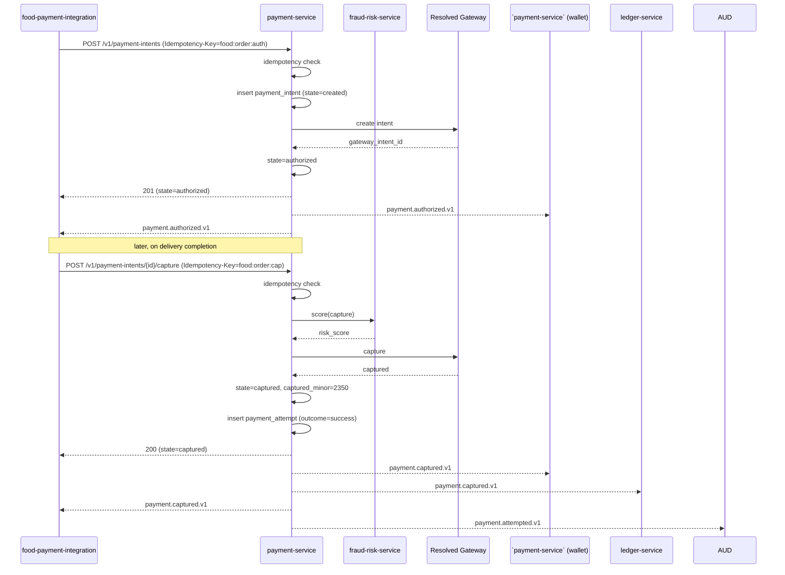
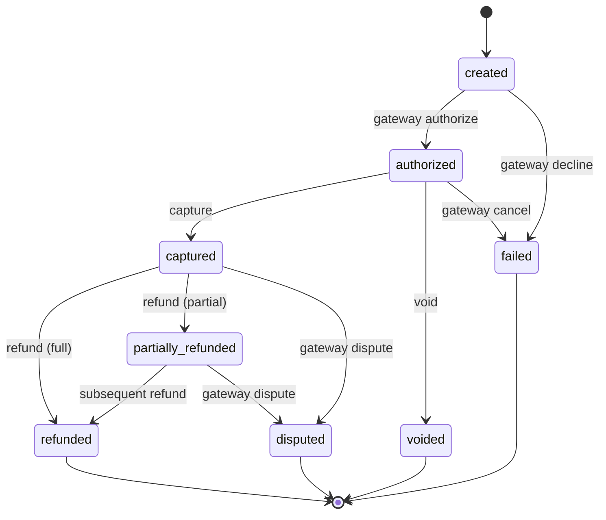
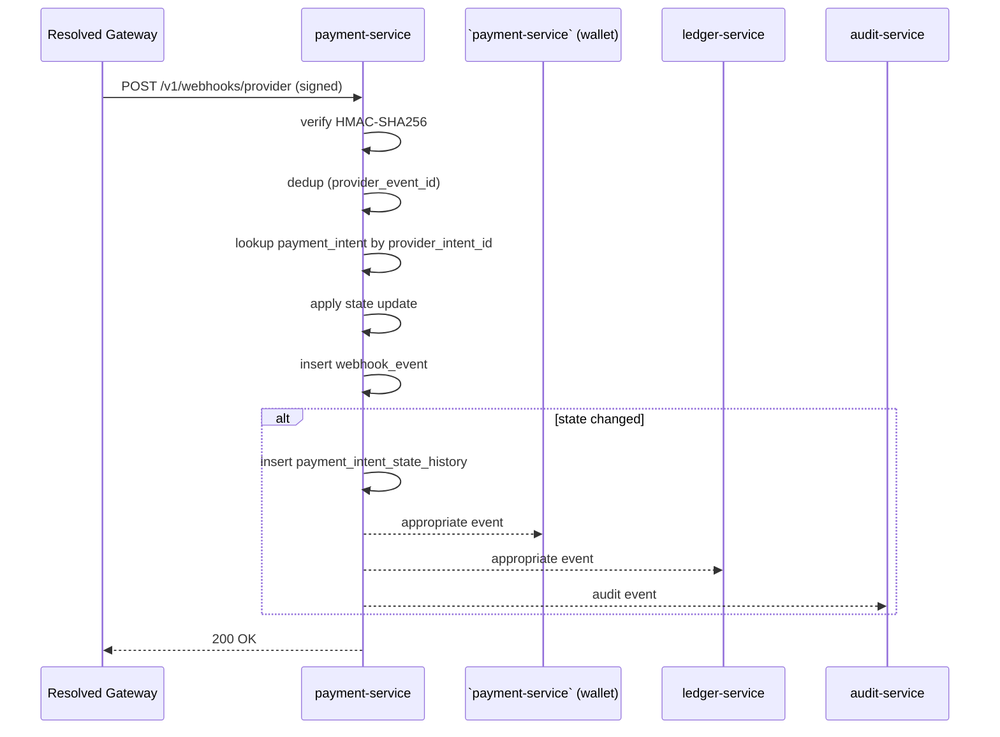
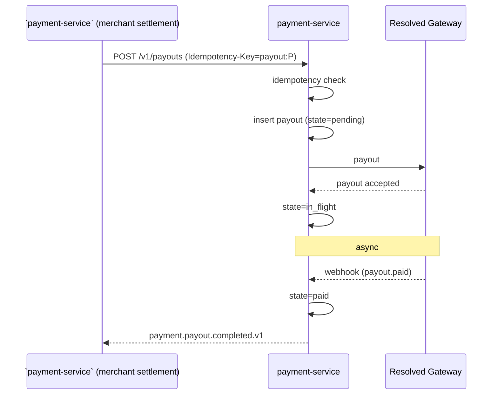
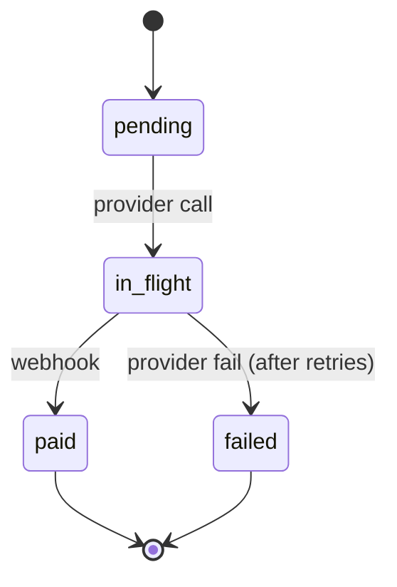
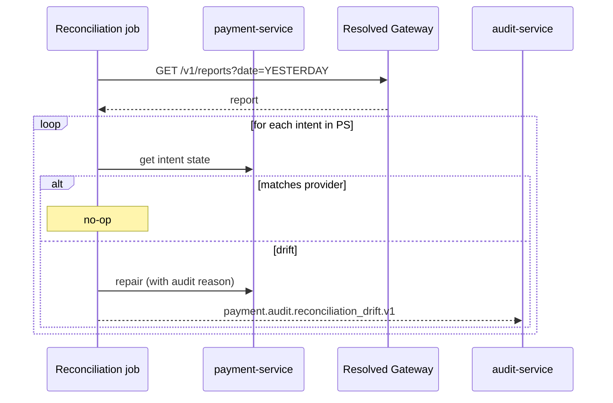
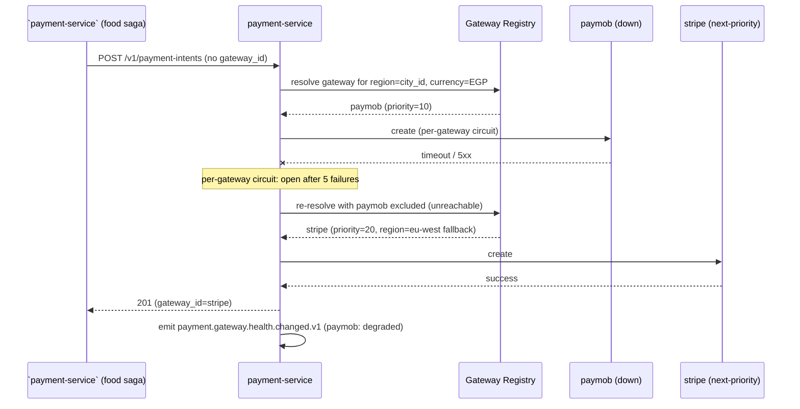

# payment-service — Workflows

## 1. `Authorize → Capture` (Happy Path)

### 1.1 Objective

Create a payment intent, authorize it, then capture it.

### 1.2 Initiating Actor

``payment-service` (food saga)` (or
``payment-service` (ride saga)`) calls
`POST /v1/payment-intents` at checkout; calls
`POST /v1/payment-intents/{id}/capture` at delivery.

### 1.3 Participating Services

- ``payment-service` (food saga)` (caller)
- `payment-service` (this service)
- Provider (external)
- ``payment-service` (wallet)` (consumes `payment.captured.v1`)
- `ledger-service` (consumes `payment.captured.v1`)
- `fraud-risk-service` (consumes `payment.attempted.v1`)

### 1.4 Prerequisites

- A `gateway_token` is available (from the gateway's hosted
  fields).
- The customer is not suspended.

### 1.5 Happy Path



### 1.6 Alternate Paths

- **Auto-capture mode**: the intent is created with
  `capture_mode=auto`; the capture step is part of the create
  call. The state goes `created → captured` directly.
- **3-D Secure challenge**: the gateway returns a redirect URL;
  the integration service is told to redirect the customer; on
  return, the intent is `authorized` (or `failed`).

### 1.7 Failure Paths

- **Gateway decline**: 422 `PROVIDER_DECLINED` (the vendor code
  is translated via `payment_gateway_error_mapping` first);
  `payment.failed.v1` is emitted; the integration service
  compensates.
- **Gateway timeout**: retry with backoff; on exhaustion, 504
  `DEPENDENCY_TIMEOUT`; `payment.failed.v1` is emitted.
- **Customer suspended**: 403 `CUSTOMER_PAYMENTS_BLOCKED`.
- **Idempotency-Key reused with different body**: 422
  `IDEMPOTENCY_KEY_REUSED`.
- **Outbox publish fails**: retried; after exhaustion → DLQ.

### 1.8 Business Rules

- `Idempotency-Key` is unique per logical operation.
- A capture MUST NOT exceed the authorized amount.
- The state machine is forward-only except for admin force.

### 1.9 State Transitions



### 1.10 Events

| Event | Direction | When |
|-------|-----------|------|
| `payment.attempted.v1` | produced | every attempt |
| `payment.authorized.v1` | produced | on authorize |
| `payment.captured.v1` | produced | on capture |
| `payment.failed.v1` | produced | on fail |

### 1.11 APIs Involved

| API | Direction | When |
|-----|-----------|------|
| `POST /v1/payment-intents` | inbound | at checkout |
| `POST /v1/payment-intents/{id}/capture` | inbound | at delivery |
| Provider API | outbound | every call |

### 1.12 Compensation / Rollback

- A failed capture: the authorization is voided (if not captured)
  or refunded (if captured).
- The integration service is responsible for the compensation
  flow.

### 1.13 Final State

- `payment_intent` in `captured` state.
- `payment.captured.v1` emitted.
- ``payment-service` (wallet)` and `ledger-service` updated.

## 2. `Refund` (Full or Partial)

### 2.1 Objective

Refund a captured payment, in full or partially.

### 2.2 Initiating Actor

``payment-service` (food saga)` (on cancellation) or
``admin-service` (support module)` (on quality / goodwill).

### 2.3 Participating Services

- Caller
- `payment-service` (this service)
- Provider
- ``payment-service` (wallet)` (consumes `payment.refund.completed.v1`)
- `ledger-service` (consumes `payment.refund.completed.v1`)

### 2.4 Prerequisites

- The intent is in `captured` or `partially_refunded` state.
- The refund amount ≤ remaining captured.

### 2.5 Happy Path

```mermaid
sequenceDiagram
    participant SUP as `admin-service` (support module)
    participant PS as payment-service
    participant EXT as Resolved Gateway
    participant WLT as `payment-service` (wallet)
    participant LD as ledger-service

    SUP->>PS: POST /v1/payment-intents/{id}/refund (amount=500, reason=quality, Idempotency-Key=...)
    PS->>PS: idempotency check
    PS->>PS: insert refund (state=initiated)
    PS-->>WLT: payment.refund.initiated.v1
    PS-->>LD: payment.refund.initiated.v1
    PS->>EXT: refund
    EXT-->>PS: refund_id
    PS->>PS: refund.state=succeeded; intent.refunded_minor += 500
    PS->>PS: insert payment_attempt
    PS-->>SUP: 202
    PS-->>WLT: payment.refund.completed.v1
    PS-->>LD: payment.refund.completed.v1
    PS-->>AUD: payment.refund.completed.v1
```

### 2.6 Alternate Paths

- **Full refund**: the intent is `refunded` (terminal).
- **Partial refund**: the intent is `partially_refunded`; further
  partial refunds are allowed until the captured amount is
  exhausted.

### 2.7 Failure Paths

- **Refund fails (provider)**: refund.state=failed; surface to
  support.
- **Refund window expired**: 422 `REFUND_WINDOW_EXPIRED` (default
  90 days).
- **Refund exceeds captured**: 422 `REFUND_EXCEEDS_CAPTURED`.

### 2.8 Business Rules

- A refund is idempotent on `Idempotency-Key`.
- A refund MUST NOT exceed the remaining captured amount.

### 2.9 State Transitions

See 1.9.

### 2.10 Events

| Event | Direction | When |
|-------|-----------|------|
| `payment.refund.initiated.v1` | produced | on start |
| `payment.refund.completed.v1` | produced | on success |
| `payment.refund.failed.v1` | produced | on fail |

### 2.11 APIs Involved

| API | Direction | When |
|-----|-----------|------|
| `POST /v1/payment-intents/{id}/refund` | inbound | caller |
| Provider API | outbound | every call |

### 2.12 Compensation / Rollback

- A "refund of refund" is a new positive charge (admin-only,
  rare).

### 2.13 Final State

- `refund` in `succeeded`.
- `payment_intent` in `refunded` or `partially_refunded`.

## 3. `Webhook Reconciliation`

### 3.1 Objective

Receive provider webhooks and update the platform's state.

### 3.2 Initiating Actor

The payment provider.

### 3.3 Participating Services

- `payment-service` (this service)
- Provider

### 3.4 Prerequisites

- A valid HMAC-SHA256 signature.

### 3.5 Happy Path



### 3.6 Alternate Paths

- **Out-of-order delivery**: the service handles the case where
  a later state arrives before an earlier one (e.g. `captured`
  before `authorized`); the state machine enforces the valid
  transitions.

### 3.7 Failure Paths

- **Signature invalid**: 401; the provider retries.
- **Provider_intent_id not found**: 422; the event is persisted
  in `webhook_events` with `processed_at=NULL`; the daily
  reconciliation job investigates.
- **Provider is replaying**: dedup on `provider_event_id`; the
  second call is a no-op.

### 3.8 Business Rules

- Webhooks are idempotent on `(gateway_id, gateway_event_id)`.
- The state machine is the source of truth; webhooks update
  state but never bypass the state machine.

### 3.9 State Transitions

Driven by the state machine; see 1.9.

### 3.10 Events

Various; see 1.10 and 2.10.

### 3.11 APIs Involved

| API | Direction | When |
|-----|-----------|------|
| `POST /v1/webhooks/gateway/{gateway_id}` | inbound | gateway |

### 3.12 Compensation / Rollback

- A duplicate webhook is a no-op.
- A misrouted webhook is logged and ignored.

### 3.13 Final State

- `payment_intent` state matches the provider's.
- `webhook_events` row with `processed_at` set.

## 4. `Payout to Merchant / Courier`

### 4.1 Objective

Execute a bank transfer to a merchant or a courier.

### 4.2 Initiating Actor

``payment-service` (merchant settlement)` (merchant) or
``payment-service` (courier earnings)` (courier) or
``payment-service` (driver earnings)` (driver).

### 4.3 Participating Services

- Caller
- `payment-service` (this service)
- Provider
- (downstream consumers of the `payment.payout.*.v1` events)

### 4.4 Prerequisites

- The recipient's `payment_method_token` is valid.
- The recipient is not suspended.

### 4.5 Happy Path



### 4.6 Alternate Paths

- **Wallet destination**: this service credits the recipient's
  wallet directly (no provider call); the state is `paid` on
  success.

### 4.7 Failure Paths

- **Payout fails (provider)**: retry with backoff; on
  exhaustion, state=failed; surface to support.

### 4.8 Business Rules

- Payouts are idempotent on `Idempotency-Key`.
- The retry policy is `payment.payout.max_retries` (default 3)
  with exponential backoff: 1m, 5m, 30m.

### 4.9 State Transitions



### 4.10 Events

| Event | Direction | When |
|-------|-----------|------|
| `payment.payout.completed.v1` | produced | on success |
| `payment.payout.failed.v1` | produced | on fail |

### 4.11 APIs Involved

| API | Direction | When |
|-----|-----------|------|
| `POST /v1/payouts` | inbound | caller |
| Provider API | outbound | every call |

### 4.12 Compensation / Rollback

- A failed payout is not auto-retried indefinitely; an admin
  must investigate.

### 4.13 Final State

- `payout` in `paid` or `failed`.

## 5. `Daily Reconciliation`

### 5.1 Objective

Compare the platform's `payment_intents` state against the
provider's reports; repair any drift.

### 5.2 Initiating Actor

A scheduled job at 02:00 UTC daily.

### 5.3 Participating Services

- `payment-service` (this service)
- Provider (downloads the daily report)

### 5.4 Prerequisites

- The provider's daily report is available.

### 5.5 Happy Path



### 5.6 Alternate Paths

- **Provider report unavailable**: the run is marked `error`;
  retried after 1h.

### 5.7 Failure Paths

- **Persistent drift**: severity escalates; on-call is paged.

### 5.8 Business Rules

- Reconciliation runs at most once per day.
- Repairs are audit-logged with the before / after state.

### 5.9 State Transitions

N/A.

### 5.10 Events

| Event | Direction | When |
|-------|-----------|------|
| `payment.audit.reconciliation_drift.v1` | produced | on drift |

### 5.11 APIs Involved

Provider report API.

### 5.12 Compensation / Rollback

- A repair is a state transition; it is not a "rollback" but a
  correction.

### 5.13 Final State

- All intents in `payment-service` match the provider's report.
- `reconciliation_runs` row with `status=matched` (or `drift` if
  any).

---

## 6. `Gateway Outage` (Single-Gateway Isolation)

**Scenario:** one of the 46 gateways (e.g. `paymob`) goes down.
The service MUST NOT degrade other gateways (`stripe`, `paypal`,
`hyperpay`, …) and MUST NOT fail customer-visible requests in
regions served by healthy gateways.

Per the platform isolation principle
([`architecture/SERVICE_ISOLATION.md` L20–22](../../architecture/SERVICE_ISOLATION.md)):
**a service may never fail because a downstream service is
slow, unavailable, or returning errors. The downstream's
problems must be contained at the boundary.**

### 6.1 Sequence



### 6.2 Failure Paths

- **All gateways in the region are down**: `authorize` returns
  504 `DEPENDENCY_TIMEOUT`; the integration service compensates.
- **Gateway recovers**: the synthetic probe transitions
  `unreachable` → `degraded` → `healthy`; auto-resolution includes
  it again.
- **Operator disables a misbehaving gateway**: `POST /admin/v1/gateways/{id}/disable`
  sets `state='disabled'` (after 0 in-flight intents); the gateway
  is excluded from auto-resolution. `payment.gateway.deactivated.v1`
  is emitted.

### 6.3 Business Rules

- A gateway in `state='draining'` MUST NOT be selected for new
  intents but MUST continue to serve existing intents.
- A gateway with `health='unreachable'` is excluded from
  auto-resolution but is NOT disabled (it may recover).

---

## 7. `Gateway Onboarding` (Adding a New Gateway to the Registry)

**Scenario:** operations wants to enable a 47th gateway (e.g. a
new MENA aggregator) for the `mena` region.

The platform constraint: adding a new gateway is **a config-only
change** — no schema migration. The core tables
(`payment_intents`, `payment_attempts`, `refunds`, `payouts`,
`webhook_events`) are unchanged; only a new `payment_gateways`
row is added (seeded by `V046__seed_payment_gateways.sql`-style
migration) and a new driver package is dropped under
`internal/payment/drivers/<id>/`.

### 7.1 Sequence

```mermaid
sequenceDiagram
    participant OPS as Operator
    participant CFG as configuration-service
    participant PS as payment-service
    participant VLT as Vault
    participant GW as New Gateway

    OPS->>VLT: write secret/payment-service/gateway/<id>/<env>
    OPS->>CFG: PUT /v1/configurations/payment.gateway.<id>.enabled = true
    CFG->>PS: configuration.updated.v1 (data.key = payment.gateway.<id>.enabled)
    PS->>PS: reload registry; INSERT/UPDATE payment_gateways row
    PS->>GW: probe (synthetic health)
    GW-->>PS: 200 OK
    PS->>PS: emit payment.gateway.activated.v1
    PS->>GW: first real attempt (smoke test)
    GW-->>PS: success
    Note over PS: gateway is now resolvable by /v1/payment-intents
```

### 7.2 Pre-conditions (gating checklist)

- Driver package merged (`internal/payment/drivers/<id>/`); CI
  green; 100% coverage on the driver per
  [`SRS.md` 23](./SRS.md#23-maintainability).
- Vault path populated (`secret/payment-service/gateway/<id>/<env>`).
- PCI scope review signed off by the security team (per
  [`SRS.md` SEC--009](./SRS.md#19-security)).
- Per-gateway error-mapping rows seeded in
  `payment_gateway_error_mapping` (vendor codes translated to
  platform codes).
- Synthetic probe URL configured (`payment.gateway.<id>.health_url`).

### 7.3 Failure Paths

- **Probe fails**: gateway row inserted but
  `payment_gateways.health='unreachable'`; excluded from
  auto-resolution until 2 consecutive `healthy` probes.
- **Driver throws on first real attempt**: operator is paged via
  `payment.gateway.error.translated.v1`; gateway is disabled
  (`POST /admin/v1/gateways/{id}/disable`).

---

## 8. `Gateway Drain / Decommission`

**Scenario:** operations wants to retire a gateway (e.g.
migrating from `perfect_money` to `payeer`). The gateway is
drained (no new intents) before being disabled.

### 8.1 Sequence

```mermaid
sequenceDiagram
    participant OPS as Operator
    participant PS as payment-service
    participant G as perfect_money

    OPS->>PS: POST /admin/v1/gateways/perfect_money/drain
    PS->>PS: UPDATE payment_gateways SET state='draining'
    PS->>PS: emit payment.gateway.drained.v1
    Note over PS: new intents skip perfect_money;<br/>existing intents continue
    loop wait for in-flight intents
        PS->>G: refund / verify on existing intents
        G-->>PS: success
    end
    OPS->>PS: POST /admin/v1/gateways/perfect_money/disable
    PS->>PS: assert 0 in-flight intents
    PS->>PS: UPDATE payment_gateways SET state='disabled'
    PS->>PS: emit payment.gateway.deactivated.v1
```

### 8.2 Pre-conditions for `disable`

- `state='draining'` for at least 24 hours OR 0 in-flight intents
  (verified by `SELECT COUNT(*) FROM payment_attempts WHERE gateway_id='...' AND action IN ('authorize','capture') AND occurred_at > now() - interval '1 hour'` returning 0).
- All open refunds against this gateway are reconciled.

### 8.3 Business Rules

- A disabled gateway cannot be re-enabled by a config change
  alone — operators MUST also POST `/admin/v1/gateways/{id}/activate`
  after restarting the driver.
- Disabling a gateway is **irreversible** for 7 years (financial
  audit retention); the row stays in `payment_gateways` and in
  `payment_gateway_history` permanently.

---

## 99. `Monthly Partition Maintenance`

### 99.1 Objective

Idempotently pre-create the next 12 months for partitioned tables in `payment`. The drop half is handled by the per-service retention job.

### 99.2 Initiating Actor

A scheduled job runs daily at `02:00 UTC`. Leader-elected via `pg_try_advisory_xact_lock(hashtext('payment.partition'), hashtext('monthly'))`.

### 99.3 Happy Path

```mermaid
sequenceDiagram
    participant JOB as Partition job
    participant PG as PostgreSQL
    JOB->>PG: pg_try_advisory_xact_lock('payment.monthly')
    alt lock acquired
        loop for each missing month in next 12
            JOB->>PG: CREATE TABLE IF NOT EXISTS payment.<table>_YYYY_MM PARTITION OF payment.<table>
            JOB->>PG: verify (pg_inherits, relpartbound)
        end
        JOB->>PG: assert now() in existing child
    else lock NOT acquired
        Note over JOB: another instance is running; exit cleanly
    end
```

### 99.4 Failure Paths

| Failure | Handling |
|---------|----------|
| Lock contention | exit 0 |
| DDL fails | retry 3× with backoff (1 s / 4 s / 16 s); page on-call |
| Today's child missing | critical alert; INSERTs would fail |

### 99.5 Business Rules

- Pre-create next 12 complete future months.
- Every child is created with `CREATE TABLE IF NOT EXISTS … PARTITION OF …` so the job is safe to run twice in the same window.
- A verification step (`pg_inherits` parent + `relpartbound` range) runs after every `CREATE TABLE IF NOT EXISTS` because `IF NOT EXISTS` only guards the name, not the bounds.
- Optionally emit `audit.partition.maintained.v1` on success.

---

## See also

### Sibling docs for this service

- [`README.md`](./README.md) — purpose, bounded context, responsibilities
- [`BRD.md`](./BRD.md) — business requirements
- [`SRS.md`](./SRS.md) — functional + non-functional requirements
- [`ERD.md`](./ERD.md) — data model (entities, relationships)
- [`GATEWAYS.md`](./GATEWAYS.md) — full registry of the 46 supported gateways
- [`INTEGRATION.md`](./INTEGRATION.md) — inter-service contracts (APIs, events, sagas)
- [`WORKFLOWS.md`](./WORKFLOWS.md) — operational workflows (happy paths, failure modes)
- [`TECH.md`](./TECH.md) — technology profile (runtime, libraries, data layer, admin endpoints, RBAC)

### Platform-wide

- [`../../shared/README.md`](../../shared/README.md) — `platform-spring-boot-starter` shared library (the single source of cross-cutting code for all Spring Boot services in the platform)
- [`../RECOMMENDATIONS.md`](../RECOMMENDATIONS.md) — platform-wide technology map (language, framework, version baseline, admin/RBAC pattern)
- [`../../README.md`](../../README.md) — services overview (the catalog of all 20 services)
- [`../../../main.md`](../../../main.md) — top-level platform specification (architecture, Keycloak, PostgreSQL 19, messaging, observability baseline)

