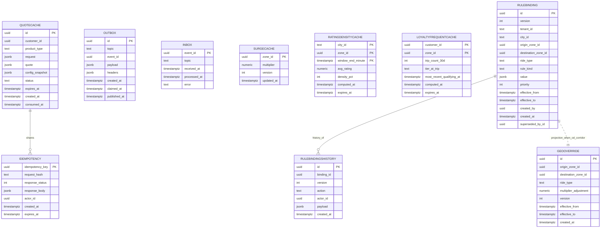

# Pricing Service — Entity-Relationship Diagram

## 1. Database

- Engine: PostgreSQL 19
- Schema: `pricing` (cache only; no source-of-truth domain rows)
- Migrations: `services/pricing-service/migrations/`

## 2. Cross-Service References

This service is **stateless**; it does not own references. The
`QuoteRequest` may carry:

| Field | Type | Refers to | Source of truth |
|-------|------|-----------|------------------|
| `customer_id` | UUID | `Customer.id` | `customer-service` |
| `pickup.lat` / `pickup.lon` | float | geocode | `geolocation-service` (validated at the edge) |
| `dropoff.lat` / `dropoff.lon` | float | geocode | `geolocation-service` |
| `ride_type` | string | ride type catalog | `configuration-service` |
| `city_id` | string | city catalog | `configuration-service` |
| `zone_id` | UUID | `Zone.id` | ``geolocation-service` (zones)` |

No DB FKs. All references are validated at write time of the
underlying record and at quote time via API.

## 3. Entities

### `QuoteCache`

A short-lived cache of computed quotes, keyed by `quote_id` and
indexed by `(customer_id, product_type, created_at)` for replay.

#### Columns

| Column | Type | Constraints | Notes |
|--------|------|-------------|-------|
| `id` | UUID | PK | UUIDv7; the `quote_id` |
| `customer_id` | UUID | NULL | |
| `product_type` | TEXT | NOT NULL | `ride` / `food` |
| `request` | JSONB | NOT NULL | the `QuoteRequest` |
| `quote` | JSONB | NOT NULL | the `PriceQuote` |
| `config_snapshot` | JSONB | NOT NULL | the captured snapshot |
| `status` | TEXT | NOT NULL | `active` / `consumed` / `expired` |
| `expires_at` | TIMESTAMPTZ | NOT NULL | |
| `created_at` | TIMESTAMPTZ | NOT NULL DEFAULT now() | |
| `consumed_at` | TIMESTAMPTZ | NULL | |

#### Indexes

- PK on `id`
- Index on `(customer_id, created_at DESC)`
- Index on `expires_at` (purge job)
- Index on `status` WHERE `status = 'active'`

#### Constraints

- CHECK: `product_type IN ('ride','food')`
- CHECK: `status IN ('active','consumed','expired')`

### `Idempotency`

`Idempotency-Key` dedupe.

#### Columns

| Column | Type | Constraints | Notes |
|--------|------|-------------|-------|
| `idempotency_key` | UUID | PK | |
| `request_hash` | TEXT | NOT NULL | |
| `response_status` | INT | NOT NULL | |
| `response_body` | JSONB | NOT NULL | |
| `actor_id` | UUID | NOT NULL | |
| `created_at` | TIMESTAMPTZ | NOT NULL DEFAULT now() | |
| `expires_at` | TIMESTAMPTZ | NOT NULL | |

#### Indexes

- PK on `idempotency_key`
- Index on `expires_at`

### `Outbox`

Outbox for `pricing.quote.created.v1` and `pricing.quote.expired.v1`.

#### Columns

| Column | Type | Constraints | Notes |
|--------|------|-------------|-------|
| `id` | UUID | PK | UUIDv7 |
| `topic` | TEXT | NOT NULL | |
| `event_id` | UUID | NOT NULL | |
| `payload` | JSONB | NOT NULL | |
| `headers` | JSONB | NULL | |
| `created_at` | TIMESTAMPTZ | NOT NULL DEFAULT now() | |
| `claimed_at` | TIMESTAMPTZ | NULL | |
| `published_at` | TIMESTAMPTZ | NULL | |

### `Inbox`

Consumer-side dedupe for the consumed events.

#### Columns

| Column | Type | Constraints | Notes |
|--------|------|-------------|-------|
| `event_id` | UUID | PK | |
| `topic` | TEXT | NOT NULL | |
| `received_at` | TIMESTAMPTZ | NOT NULL DEFAULT now() | |
| `processed_at` | TIMESTAMPTZ | NULL | |
| `error` | TEXT | NULL | |

### `SurgeCache`

Last-known surge multiplier per zone, refreshed on
`zone.surge.updated.v1`. Used as a fallback if the in-memory cache
is cold.

#### Columns

| Column | Type | Constraints | Notes |
|--------|------|-------------|-------|
| `zone_id` | UUID | PK | |
| `multiplier` | NUMERIC(4,2) | NOT NULL | |
| `version` | INT | NOT NULL | monotonic |
| `updated_at` | TIMESTAMPTZ | NOT NULL DEFAULT now() | |

#### Constraints

- CHECK: `multiplier >= 1.0`

### `RatingDensityCache`

Aggregated driver-rating-per-zone signal for the B1 rating-density
sub-pipeline. Refreshed on `review.zone_aggregated.v1` and on demand
from ``trip-service` / `food-order-service` / `search-service` (review projections) GET /v1/zones/{zone_id}/driver-rating`.
This is a **cache**, not domain state; absence of the row is not a
business failure — the synchronous fallback path covers it.

#### Columns

| Column | Type | Constraints | Notes |
|--------|------|-------------|-------|
| `city_id` | TEXT | PK (composite part) | logical city |
| `zone_id` | UUID | PK (composite part) | the surge zone |
| `window_end_minute` | TIMESTAMPTZ | PK (composite part) | 15-min window bucket (UTC, truncated to minute) |
| `avg_rating` | NUMERIC(3,2) | NOT NULL | ``trip-service` / `food-order-service` / `search-service` (review projections)` source of truth |
| `density_pct` | INT | NOT NULL | % of driver pool active in this window |
| `computed_at` | TIMESTAMPTZ | NOT NULL DEFAULT now() | |
| `expires_at` | TIMESTAMPTZ | NOT NULL | TTL 15 min |

#### Indexes

- PK on `(city_id, zone_id, window_end_minute)`

#### Constraints

- CHECK: `density_pct BETWEEN 0 AND 100`
- CHECK: `avg_rating BETWEEN 0 AND 5`

### `LoyaltyFrequentCache`

Aggregated frequent-zone signal for the B2 loyalty sub-pipeline.
Refreshed on `loyalty.frequent_zone.aggregated.v1` and on demand
from ``pricing-service` (loyalty rules) / `customer-service` (account) GET /v1/accounts/{customer_id}/frequent-zones`.

#### Columns

| Column | Type | Constraints | Notes |
|--------|------|-------------|-------|
| `customer_id` | UUID | PK (composite part) | |
| `zone_id` | UUID | PK (composite part) | |
| `trip_count_30d` | INT | NOT NULL | |
| `tier_at_trip` | TEXT | NOT NULL | `silver` / `gold` / `platinum` |
| `most_recent_qualifying_at` | TIMESTAMPTZ | NOT NULL | |
| `computed_at` | TIMESTAMPTZ | NOT NULL DEFAULT now() | |
| `expires_at` | TIMESTAMPTZ | NOT NULL | TTL 30 days |

#### Constraints

- CHECK: `tier_at_trip IN ('silver','gold','platinum')`

### `RuleBinding`

A single per-scope override rule sourced from `admin-service` via
`pricing.geo_config.updated.v1`. Implemented as an immutable,
append-only table — every save (including rollback) creates a new
row and writes the prior one to `RuleBindingsHistory`.

#### Columns

| Column | Type | Constraints | Notes |
|--------|------|-------------|-------|
| `id` | UUID | PK | UUIDv7 |
| `version` | INT | NOT NULL | monotonic per logical binding |
| `tenant_id` | TEXT | NOT NULL DEFAULT `'global'` | |
| `city_id` | TEXT | NULL | |
| `origin_zone_id` | UUID | NULL | nullable for tenant/global scope |
| `destination_zone_id` | UUID | NULL | nullable; set for OD-pair |
| `ride_type` | TEXT | NULL | nullable for global |
| `rule_kind` | TEXT | NOT NULL | CHECK — see below |
| `value` | JSONB | NOT NULL | structured payload per `rule_kind` |
| `priority` | INT | NOT NULL DEFAULT 100 | lower wins on equal scope |
| `effective_from` | TIMESTAMPTZ | NULL | |
| `effective_to` | TIMESTAMPTZ | NULL | |
| `created_by` | UUID | NOT NULL | admin actor |
| `created_at` | TIMESTAMPTZ | NOT NULL DEFAULT now() | |
| `superseded_by_id` | UUID | NULL | FK to same table — points at the new head on rollback |

#### Constraints

- CHECK: `rule_kind IN ('base_fare_override','per_km_override','per_min_override','surge_pressure','loyalty_discount','min_fare_override','od_corridor')`
- An OD-pair record MUST have both `origin_zone_id` and
  `destination_zone_id` non-null; non-OD records MUST NOT set
  `destination_zone_id`.

### `GeoOverride`

Alias projection of `RuleBinding` rows whose `rule_kind =
'od_corridor'`. Read at quote time when the lookup is `(origin_zone_id,
destination_zone_id, ride_type)`; otherwise the canonical read
happens on `RuleBinding`. Kept as a separate physical table to allow
a targeted GIST / BRIN index on `(origin_zone_id, destination_zone_id)`.

#### Columns

| Column | Type | Constraints | Notes |
|--------|------|-------------|-------|
| `id` | UUID | PK | matches `RuleBinding.id` |
| `origin_zone_id` | UUID | NOT NULL | |
| `destination_zone_id` | UUID | NOT NULL | |
| `ride_type` | TEXT | NOT NULL DEFAULT `'*'` | |
| `multiplier_adjustment` | NUMERIC(5,4) | NOT NULL | composed with surge per FR--027 rule |
| `version` | INT | NOT NULL | mirrors `RuleBinding.version` |
| `effective_from` | TIMESTAMPTZ | NULL | |
| `effective_to` | TIMESTAMPTZ | NULL | |
| `created_at` | TIMESTAMPTZ | NOT NULL DEFAULT now() | |

#### Indexes

- PK on `id`
- Index on `(origin_zone_id, destination_zone_id, ride_type)`

### `RuleBindingsHistory`

Immutable, append-only history of every version of every binding.
Mirrors the version/rollback pattern in `configuration-service`
per `architecture/CONFIGURATION_ARCHITECTURE.md`. A rollback via the
`admin-service` geo-config API does NOT update this row in-place —
it writes a new history row and points `RuleBinding.superseded_by_id`
at the new head.

#### Columns

| Column | Type | Constraints | Notes |
|--------|------|-------------|-------|
| `id` | UUID | PK | UUIDv7 |
| `binding_id` | UUID | NOT NULL | refs `RuleBinding.id` |
| `version` | INT | NOT NULL | matches the binding's version at the time of the action |
| `action` | TEXT | NOT NULL | `create` / `update` / `disable` / `rollback` |
| `actor_id` | UUID | NOT NULL | admin actor |
| `payload` | JSONB | NOT NULL | full snapshot of the binding at this version |
| `created_at` | TIMESTAMPTZ | NOT NULL DEFAULT now() | |

#### Constraints

- CHECK: `action IN ('create','update','disable','rollback')`
- REVOKE UPDATE, DELETE on this table — append-only, same pattern as
  `ledger.postings` (see [[accounting-four-layer-truth-model]]).

## 4. Mermaid ER Diagram



## 5. DDL Sketch

```sql
CREATE SCHEMA IF NOT EXISTS pricing;

CREATE TABLE pricing.quote_cache (
    id UUID NOT NULL,
    customer_id UUID,
    product_type TEXT NOT NULL
        CHECK (product_type IN ('ride','food')),
    request JSONB NOT NULL,
    quote JSONB NOT NULL,
    config_snapshot JSONB NOT NULL,
    status TEXT NOT NULL
        CHECK (status IN ('active','consumed','expired')),
    expires_at TIMESTAMPTZ NOT NULL,
    created_at TIMESTAMPTZ NOT NULL DEFAULT now(),
    consumed_at TIMESTAMPTZ,
    PRIMARY KEY (id, created_at)
) PARTITION BY RANGE (created_at);

CREATE INDEX idx_quotecache_customer
    ON pricing.quote_cache (customer_id, created_at DESC);
CREATE INDEX idx_quotecache_expires
    ON pricing.quote_cache (expires_at);
CREATE INDEX idx_quotecache_active
    ON pricing.quote_cache (status)
    WHERE status = 'active';

CREATE TABLE IF NOT EXISTS pricing.quote_cache_2026_08
    PARTITION OF pricing.quote_cache
    FOR VALUES FROM ('2026-08-01 00:00:00+00') TO ('2026-09-01 00:00:00+00');

CREATE TABLE pricing.idempotency (
    idempotency_key UUID PRIMARY KEY,
    request_hash TEXT NOT NULL,
    response_status INT NOT NULL,
    response_body JSONB NOT NULL,
    actor_id UUID NOT NULL,
    created_at TIMESTAMPTZ NOT NULL DEFAULT now(),
    expires_at TIMESTAMPTZ NOT NULL
);
CREATE INDEX idx_idempotency_expires
    ON pricing.idempotency (expires_at);

CREATE TABLE pricing.outbox (
    id UUID PRIMARY KEY,
    topic TEXT NOT NULL,
    event_id UUID NOT NULL,
    payload JSONB NOT NULL,
    headers JSONB,
    created_at TIMESTAMPTZ NOT NULL DEFAULT now(),
    claimed_at TIMESTAMPTZ,
    published_at TIMESTAMPTZ
);
CREATE INDEX idx_outbox_unpublished
    ON pricing.outbox (claimed_at)
    WHERE published_at IS NULL;

CREATE TABLE pricing.inbox (
    event_id UUID PRIMARY KEY,
    topic TEXT NOT NULL,
    received_at TIMESTAMPTZ NOT NULL DEFAULT now(),
    processed_at TIMESTAMPTZ,
    error TEXT
);

CREATE TABLE pricing.surge_cache (
    zone_id UUID PRIMARY KEY,
    multiplier NUMERIC(4,2) NOT NULL CHECK (multiplier >= 1.0),
    version INT NOT NULL,
    updated_at TIMESTAMPTZ NOT NULL DEFAULT now()
);

-- B1: rating-density cache (event-driven refresh + on-demand read).
CREATE TABLE pricing.rating_density_cache (
    city_id TEXT NOT NULL,
    zone_id UUID NOT NULL,
    window_end_minute TIMESTAMPTZ NOT NULL,
    avg_rating NUMERIC(3,2) NOT NULL CHECK (avg_rating BETWEEN 0 AND 5),
    density_pct INT NOT NULL CHECK (density_pct BETWEEN 0 AND 100),
    computed_at TIMESTAMPTZ NOT NULL DEFAULT now(),
    expires_at TIMESTAMPTZ NOT NULL,
    PRIMARY KEY (city_id, zone_id, window_end_minute)
);

-- B2: loyalty frequent-rider cache (event-driven refresh + on-demand read).
CREATE TABLE pricing.loyalty_frequent_cache (
    customer_id UUID NOT NULL,
    zone_id UUID NOT NULL,
    trip_count_30d INT NOT NULL,
    tier_at_trip TEXT NOT NULL CHECK (tier_at_trip IN ('silver','gold','platinum')),
    most_recent_qualifying_at TIMESTAMPTZ NOT NULL,
    computed_at TIMESTAMPTZ NOT NULL DEFAULT now(),
    expires_at TIMESTAMPTZ NOT NULL,
    PRIMARY KEY (customer_id, zone_id)
);

-- B3: geo-config override rule. Append-only with version + history.
CREATE TABLE pricing.rule_bindings (
    id UUID PRIMARY KEY,
    version INT NOT NULL,
    tenant_id TEXT NOT NULL DEFAULT 'global',
    city_id TEXT,
    origin_zone_id UUID,
    destination_zone_id UUID,
    ride_type TEXT,
    rule_kind TEXT NOT NULL CHECK (rule_kind IN (
        'base_fare_override','per_km_override','per_min_override',
        'surge_pressure','loyalty_discount','min_fare_override','od_corridor'
    )),
    value JSONB NOT NULL,
    priority INT NOT NULL DEFAULT 100,
    effective_from TIMESTAMPTZ,
    effective_to TIMESTAMPTZ,
    created_by UUID NOT NULL,
    created_at TIMESTAMPTZ NOT NULL DEFAULT now(),
    superseded_by_id UUID
);
CREATE INDEX idx_rule_bindings_lookup
    ON pricing.rule_bindings (tenant_id, city_id, ride_type)
    WHERE superseded_by_id IS NULL;

-- Alias projection for the OD-pair path.
CREATE TABLE pricing.geo_overrides (
    id UUID PRIMARY KEY,
    origin_zone_id UUID NOT NULL,
    destination_zone_id UUID NOT NULL,
    ride_type TEXT NOT NULL DEFAULT '*',
    multiplier_adjustment NUMERIC(5,4) NOT NULL,
    version INT NOT NULL,
    effective_from TIMESTAMPTZ,
    effective_to TIMESTAMPTZ,
    created_at TIMESTAMPTZ NOT NULL DEFAULT now()
);
CREATE INDEX idx_geo_overrides_od
    ON pricing.geo_overrides (origin_zone_id, destination_zone_id, ride_type);

-- Append-only history. Mirrors the version/rollback pattern in
-- configuration-service per architecture/CONFIGURATION_ARCHITECTURE.md.
-- Reversals are new rows, never UPDATE/DELETE — same rule as
-- ledger.postings (see the accounting four-layer truth model).
CREATE TABLE pricing.rule_bindings_history (
    id UUID NOT NULL,
    binding_id UUID NOT NULL,
    version INT NOT NULL,
    action TEXT NOT NULL CHECK (action IN ('create','update','disable','rollback')),
    actor_id UUID NOT NULL,
    payload JSONB NOT NULL,
    created_at TIMESTAMPTZ NOT NULL DEFAULT now(),
    PRIMARY KEY (id, created_at)
) PARTITION BY RANGE (created_at);
CREATE INDEX idx_rule_bindings_history_binding
    ON pricing.rule_bindings_history (binding_id, version);

CREATE TABLE IF NOT EXISTS pricing.rule_bindings_history_2026_08
    PARTITION OF pricing.rule_bindings_history
    FOR VALUES FROM ('2026-08-01 00:00:00+00') TO ('2026-09-01 00:00:00+00');

REVOKE UPDATE, DELETE ON pricing.rule_bindings_history FROM pricing_app;
REVOKE UPDATE, DELETE ON pricing.rule_bindings FROM pricing_app;
```

## 6. Audit Columns

Cache tables do not have `created_by` / `updated_by` because they
are not edited by humans; the audit trail is the
`pricing.quote.created.v1` event with the `config_snapshot`.

## 7. Soft Delete

n/a (cache is TTL-bounded).

## 8. JSONB Usage

| Table.Column | What is stored | Justification |
|--------------|----------------|---------------|
| `quote_cache.request` | the `QuoteRequest` | replay |
| `quote_cache.quote` | the `PriceQuote` | replay |
| `quote_cache.config_snapshot` | the captured snapshot | reproducibility |
| `idempotency.response_body` | cached response | replay |
| `outbox.payload` | event payload | per topic |
| `rule_bindings.value` | structured per `rule_kind` (e.g. `{base_fare_minor, multiplier, expiry_hours}`) | compact, schema-validated per kind |
| `rule_bindings_history.payload` | full snapshot of the binding at the time of the action | audit / rollback |
| `rating_density_cache.*` | upstream-aggregated signal | cache; no domain state |
| `loyalty_frequent_cache.*` | upstream-aggregated signal | cache; no domain state |

## 9. Partitioning

| Table | Strategy | Cadence | Pre-create | Retention |
|-------|----------|---------|------------|-----------|
| `quote_cache` | RANGE on `created_at` | monthly | 12 months | 5 minutes (TTL) |
| `rule_bindings_history` | RANGE on `created_at` | monthly | 12 months | 7 years (financial) |

See [`DATABASE_ARCHITECTURE.md` "Table Partitioning — Canonical Template"](../../architecture/DATABASE_ARCHITECTURE.md) for the idempotent `CREATE TABLE IF NOT EXISTS … PARTITION OF …` pattern, naming convention, and the service-owned maintenance-job contract.

## 10. Data Retention

| Table | Retention | Purged by |
|-------|-----------|-----------|
| `quote_cache` | 5 minutes (the quote TTL) | cron job every minute |
| `idempotency` | 5 minutes | daily purge job |
| `outbox` | 24 hours after `published_at` | hourly purge job |
| `inbox` | 7 days | daily purge job |
| `surge_cache` | until next `zone.surge.updated.v1` | overwritten |
| `rating_density_cache` | 15 minutes (the window TTL) | on refresh + daily purge |
| `loyalty_frequent_cache` | 30 days | on refresh + daily purge |
| `rule_bindings` | 7 years (financial record, per the rules in `architecture/CONFIGURATION_ARCHITECTURE.md`) | never (logical `disable` writes a new history row instead) |
| `geo_overrides` | 7 years | never |
| `rule_bindings_history` | 7 years (financial, retention matches the audit baseline) | never |

## 11. Migration Considerations

- The schema is intentionally minimal; new features usually add JSON
  shapes inside `quote_cache.quote` rather than columns.
- Adding a column to `quote_cache` is a forward-only migration; the
  service must handle the missing column gracefully (read with
  `coalesce`).
- A new event topic is added by creating a new outbox row shape, not
  a new table.
- New cache tables (`rating_density_cache`, `loyalty_frequent_cache`)
  are added as new tables with no backfill; the synchronous fallback
  path covers the cold-start period.
- `rule_bindings` and `geo_overrides` are added as new tables; the
  initial migration seeds them from the geo-config records published
  by `admin-service` on the first `pricing.geo_config.updated.v1`.
  No destructive ALTER on existing quote rows.
- `rule_bindings_history` is append-only with `REVOKE UPDATE, DELETE`
  applied to the application role (mirrors the `ledger.postings`
  pattern from [[accounting-four-layer-truth-model]]).

---

## See also

### Sibling docs for this service

- [`README.md`](./README.md) — purpose, bounded context, responsibilities
- [`BRD.md`](./BRD.md) — business requirements
- [`SRS.md`](./SRS.md) — functional + non-functional requirements
- [`ERD.md`](./ERD.md) — data model (entities, relationships)
- [`INTEGRATION.md`](./INTEGRATION.md) — inter-service contracts (APIs, events, sagas)
- [`WORKFLOWS.md`](./WORKFLOWS.md) — operational workflows (happy paths, failure modes)
- [`TECH.md`](./TECH.md) — technology profile (runtime, libraries, data layer, admin endpoints, RBAC)

### Platform-wide

- [`../../shared/README.md`](../../shared/README.md) — `platform-spring-boot-starter` shared library (the single source of cross-cutting code for all Spring Boot services in the platform)
- [`../RECOMMENDATIONS.md`](../RECOMMENDATIONS.md) — platform-wide technology map (language, framework, version baseline, admin/RBAC pattern)
- [`../../README.md`](../../README.md) — services overview (the catalog of all 20 services)
- [`../../../main.md`](../../../main.md) — top-level platform specification (architecture, Keycloak, PostgreSQL 19, messaging, observability baseline)

## Related docs

- [`../../architecture/DATA_OWNERSHIP.md`](../../architecture/DATA_OWNERSHIP.md) — full source-of-truth matrix
- [`../../architecture/SERVICE_ISOLATION.md`](../../architecture/SERVICE_ISOLATION.md) — how this service handles a downstream outage
- [`../../architecture/DATABASE_ARCHITECTURE.md`](../../architecture/DATABASE_ARCHITECTURE.md) — PostgreSQL-per-service rules
- [`../../architecture/CONSISTENCY_STRATEGY.md`](../../architecture/CONSISTENCY_STRATEGY.md) — strong vs eventual consistency per context

