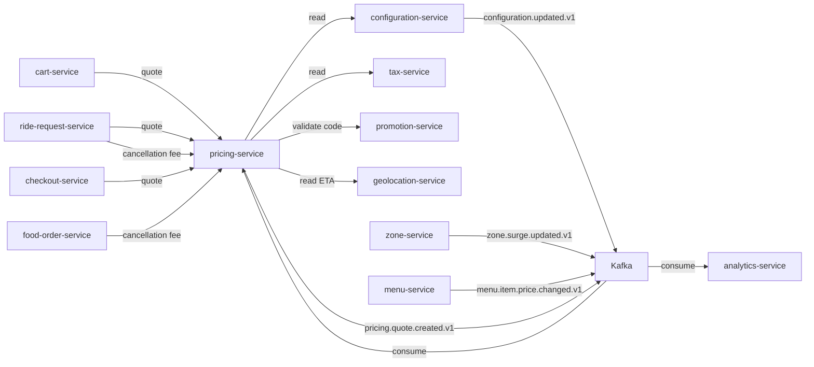
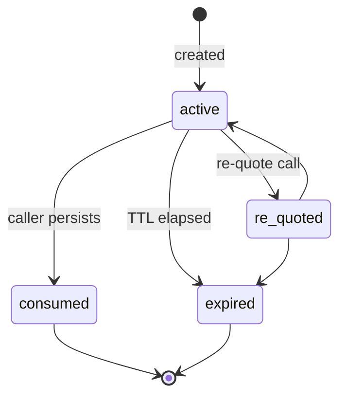

# Pricing Service — Software Requirements Specification

## 1. Introduction

This SRS specifies the behavior, performance, and operational
requirements of `pricing-service`. It inherits the platform-wide
standards in `docs/architecture/API_STANDARDS.md`,
`docs/architecture/EVENT_ARCHITECTURE.md`, and
`docs/architecture/SECURITY_ARCHITECTURE.md`.

## 2. Scope

In scope:

- The quote API (synchronous).
- The cancellation / waiting fee APIs.
- The re-quote API.
- The in-memory cache of business rules and tax rules.
- The `config_snapshot` capture.
- The event publication of every quote.

Out of scope:

- Persistent storage of quotes (each consumer persists as needed).
- Tax rate storage (owned by `tax-service`).
- Promotion storage (owned by `promotion-service`).
- Distance / route computation (owned by `geolocation-service`).

## 3. System Context

## 4. Actors

- `ride-request-service` (system).
- `cart-service` (system).
- `checkout-service` (system).
- `food-order-service` (system).
- `analytics-service` (system; consumer of events).
- `admin-service` (system; admin endpoints).

## 5. Functional Requirements

| ID | Requirement | Priority |
|----|-------------|----------|
| FR--001 | The service MUST expose `POST /v1/quotes` to compute a `PriceQuote`. | MUST |
| FR--002 | The service MUST resolve a `QuoteRequest` against the city / ride type / product / segment context. | MUST |
| FR--003 | The service MUST read pricing rules from `configuration-service` and cache them in memory. | MUST |
| FR--004 | The service MUST compute a `subtotal = base_fare + per_km * distance + per_min * time`. | MUST |
| FR--005 | The service MUST apply the surge multiplier from `zone-service`. | MUST |
| FR--006 | The service MUST apply tax from `tax-service` for the delivery address's jurisdiction. | MUST |
| FR--007 | The service MUST apply an optional promotion discount from `promotion-service`. | MUST |
| FR--008 | The service MUST capture a `config_snapshot` listing every rule key, value, and version used. | MUST |
| FR--009 | The service MUST round the total to integer minor units in the requested currency. | MUST |
| FR--010 | The service MUST enforce the city-level minimum fare. | MUST |
| FR--011 | The service MUST expose `POST /v1/quotes/cancellation-fee` and compute the fee per the cancellation policy. | MUST |
| FR--012 | The service MUST expose `POST /v1/quotes/waiting-fee` for in-trip waiting fees. | MUST |
| FR--013 | The service MUST expose `POST /v1/quotes/{quote_id}/re-quote` to re-evaluate a prior quote against current rules. | MUST |
| FR--014 | The service MUST publish `pricing.quote.created.v1` for every successful quote. | MUST |
| FR--015 | The service MUST publish `pricing.quote.expired.v1` when a quote's TTL elapses. | MUST |
| FR--016 | The service MUST support multiple ride types (economy, premium, xl, …). | MUST |
| FR--017 | The service MUST support food delivery with per-branch delivery fee overrides. | MUST |
| FR--018 | The service MUST support scheduled-ride quotes that are "frozen" at creation time. | MUST |
| FR--019 | The service MUST return 503 `CIRCUIT_OPEN` when the in-memory cache is cold and a downstream is unreachable. | MUST |
| FR--020 | The service MUST return 422 with a `code: "PROMOTION_INVALID"` if a promotion code does not validate. | MUST |
| FR--021 | The service MUST reload its in-memory cache on `configuration.updated.v1`. | MUST |
| FR--022 | The service MUST reload its surge cache on `zone.surge.updated.v1`. | MUST |
| FR--023 | The service MUST invalidate cached food quotes on `menu.item.price.changed.v1`. | MUST |
| FR--024 | The service MUST return the matched surge zone id and version in every quote response. | MUST |
| FR--025 | The service MUST support per-tenant, per-zone, per-city, and OD-pair (city-to-city) rule overrides sourced from `admin-service`'s geo-config; precedence: most-specific match wins. | MUST |
| FR--026 | The service MUST fetch the zone-aggregated driver rating for the pickup zone via `review-rating-service GET /v1/zones/{zone_id}/driver-rating?window_minutes=15` (or its in-memory cache `pricing.rating_density_cache`) and apply a small rating-density surcharge when both `avg_rating < pricing.rating_density.min_avg_rating` and `density_pct >= pricing.rating_density.density_threshold_pct`. Disabled by setting `pricing.rating_density.enabled = false`. | MUST |
| FR--027 | The service MUST compose the surcharge multiplicatively with the existing zone surge: `composed_surge = max(1.0, base_surge × (1 + rating_density_pct))` where `rating_density_pct = min(pricing.rating_density.max_multiplier_pct, configured_pct_from_aggregated_signal)`. The composed value MUST NOT exceed `pricing.surge.max_multiplier`. | MUST |
| FR--028 | The service MUST cache the (city_id, zone_id, window_end_minute) → result with a 15-min TTL; cache key MUST be idempotent across retries with the same `Idempotency-Key`. A cache miss MUST fall back to the synchronous call; both paths MUST NOT bypass the surge cap. | MUST |
| FR--029 | The service MUST publish `pricing.rating_density.applied.v1` whenever the surcharge contributes non-zero to the composed surge; the event payload MUST include `quote_id`, `zone_id`, `avg_rating`, `density_pct`, `applied_pct`, `composed_surge`, `cache_hit {true,false}`, and `correlation_id`. No PII (no `driver_id` enumeration) is emitted. | MUST |
| FR--030 | When `pricing.rating_density.enabled = false` or no zone qualifies, no surcharge is applied and no event is emitted; the existing `pricing.quote.created.v1` continues to flow unchanged. | MUST |
| FR--031 | The service MUST fetch the customer's frequent-zone aggregation for the pickup zone via `loyalty-service GET /v1/accounts/{customer_id}/frequent-zones?window_days=30` (or its in-memory cache `pricing.loyalty_frequent_cache`). When the customer's trip count for the pickup zone in the last 30 days is `>= pricing.loyalty.frequent_rider.min_trips_30d`, the service MUST apply a tier-aware base discount. | MUST |
| FR--032 | The base discount for the matched zone is `base_discount_pct × tier_multiplier` where `tier_multiplier` ∈ {`silver 1.0`, `gold 1.25`, `platinum 1.5`} and the matching tier is the customer's tier at the time of the most-recent qualifying trip in the zone. The composed discount MUST be capped at `pricing.loyalty.frequent_rider.max_discount_pct`. | MUST |
| FR--033 | The loyalty discount MUST be applied AFTER `promotion-service` validation (loyalty wins on size, promotion wins on eligibility — promotions may opt out via their rules) and BEFORE `tax-service` recalculation. The composed `total_minor` MUST be at least `pricing.min_fare.{city_id}` — if the loyalty discount would make it smaller, the discount is reduced, not applied whole. | MUST |
| FR--034 | The service MUST publish `pricing.loyalty_discount.applied.v1` whenever the loyalty discount contributes non-zero; the payload MUST include `quote_id`, `customer_id`, `zone_id`, `trip_count_30d`, `tier`, `applied_pct`, `discount_minor`, `cache_hit`, and `correlation_id`. No PII beyond the customer's UUID is emitted. | MUST |
| FR--035 | When `pricing.loyalty.frequent_rider.enabled = false` or no zone qualifies, no discount is applied and no event is emitted. | MUST |
| FR--036 | The service MUST maintain an in-memory hash of `pricing.rule_bindings` (per-tenant, per-zone, per-city, OD-pair) keyed for O(1) lookup; on `pricing.geo_config.updated.v1`, the hash MUST be invalidated and reloaded on the next quote. P95 lookup ≤ 5ms. | MUST |
| FR--037 | The service MUST resolve the matching geo-config override(s) for every quote using this precedence (most-specific first): exact origin→destination corridor (OD-pair) → exact origin/destination location → zone → city → tenant → global. Ambiguous equal-priority matches are rejected at admin validation time and never reach this service. | MUST |
| FR--038 | The service MUST apply the matched override's effect (e.g. `base_fare_override`, `per_km_override`, `per_min_override`, `surge_pressure`, `loyalty_discount`, `min_fare_override`, `od_corridor` surcharge/discount) inside the existing pricing math; the composed `total_minor` MUST continue to satisfy the cap rules of FR--027 and FR--033. | MUST |
| FR--039 | The service MUST capture every matched override id+version in the quote's `config_snapshot.values` and MUST publish `pricing.geo_overrides.matched.v1` (partition key `geo_config_id`) for analytics; the first matched (most-specific) id MUST appear in the `config_snapshot` deterministically across re-quotes with the same rule version. | MUST |
| FR--040 | For a cross-border trip where `pickup_city_id ≠ dropoff_city_id`, the service MUST call `tax-service POST /v1/tax/calculate` twice — once with the pickup jurisdiction and once with the dropoff jurisdiction — and produce two `lines[].code` (`tax_origin`, `tax_destination`); both `snapshot_id`s MUST be captured under `config_snapshot.values` (keys `tax.<pickup_jurisdiction>.<code>` and `tax.<dropoff_jurisdiction>.<code>`). | MUST |
| FR--041 | When the cross-border tax call returns a `reverse_charge=true` for the destination, the `tax_destination` line MUST be `0` and the line's `label` MUST include "reverse charge"; the same `tax.calculated.v1` event from `tax-service` is the authoritative record for both jurisdictions. | MUST |

## 6. Non-Functional Requirements

| ID | Category | Requirement | Target |
|----|----------|-------------|--------|
| NFR--001 | performance | P99 quote latency | < 200ms |
| NFR--002 | performance | P99 cancellation fee latency | < 100ms |
| NFR--003 | availability | uptime | 99.95% over 30d |
| NFR--004 | scalability | concurrent quotes per pod | 2,000 |
| NFR--005 | scalability | concurrent re-quotes per pod | 500 |
| NFR--006 | determinism | same input + same rules + same surge → same total | 100% |
| NFR--007 | durability | no quote lost in flight | re-quote on retry |
| NFR--008 | observability | 100% requests have trace and log | enforced in CI |
| NFR--009 | snapshot completeness | 100% of quotes carry a `config_snapshot` | enforced in CI |
| NFR--010 | surge cap | surge ≤ max_multiplier | enforced in code |
| NFR--011 | cache freshness | 99% of reads served from in-memory cache | measured |
| NFR--012 | rating-density latency | P95 resolution when cached ≤ 30ms; P95 when uncached ≤ 100ms | measured |
| NFR--013 | loyalty-frequent-rider latency | P95 resolution ≤ 50ms (cached path or live) | measured |
| NFR--014 | geo-override lookup latency | P95 ≤ 5ms (in-memory hash) | measured |

## 7. API Requirements

- Versioned URIs.
- Bearer JWT (service-account).
- `Idempotency-Key` for `POST /v1/quotes` (the consumer retries).
- Errors in the standard envelope.
- Money: integer minor units with `currency`.
- OpenAPI 3.1 at `/openapi.json`.

## 8. Data Requirements

| ID | Requirement | Notes |
|----|-------------|-------|
| DATA--001 | No domain state in the DB; only cache tables. | |
| DATA--002 | A quote is keyed by `quote_id` (UUIDv7). | |
| DATA--003 | A `config_snapshot` is captured on every quote. | Audit / reproducibility |
| DATA--004 | Currency is ISO-4217. | |
| DATA--005 | Time is RFC3339 UTC. | |
| DATA--006 | Cross-service references are UUID columns without DB FKs. | Rule |
| DATA--007 | `pricing.rating_density_cache` table is event-driven refresh + last-known-fallback only; no domain state. TTL 15 minutes per `(city_id, zone_id, window_end_minute)` key. | |
| DATA--008 | `pricing.loyalty_frequent_cache` table is event-driven refresh only; no domain state. TTL 30 days per `(customer_id, zone_id)`. | |
| DATA--009 | `pricing.rule_bindings` table stores per-tenant, per-zone, per-city, per-OD-pair override records; columns include `id UUIDv7 PK`, `tenant_id TEXT NOT NULL DEFAULT 'global'`, `city_id TEXT NULL`, `origin_zone_id UUID NULL`, `destination_zone_id UUID NULL`, `ride_type TEXT NULL`, `rule_kind TEXT CHECK (rule_kind IN (...))`, `value JSONB NOT NULL`, `priority INT NOT NULL DEFAULT 100`, `effective_from/effective_to TIMESTAMPTZ`, audit columns. Append-only with version in a parallel `pricing.rule_bindings_history` table. | |
| DATA--010 | `pricing.geo_overrides` table is an alias projection for OD-pair corridor records when they are queried by `origin_zone_id + destination_zone_id` directly (subset of `pricing.rule_bindings` where `rule_kind = 'od_corridor'`). Columns mirror DATA--009. | |
| DATA--011 | `pricing.rule_bindings_history` is an immutable, append-only history of every version of every binding; rollback creates a new current row pointing at a prior history id. Mirrors the version/rollback pattern in `configuration-service` per `architecture/CONFIGURATION_ARCHITECTURE.md`. | |

## 9. Validation Rules

- A `QuoteRequest.pickup` and `dropoff` MUST be valid lat/lon.
- A `distance_km` MUST be in `[0, 1000]`.
- A `duration_min` MUST be in `[0, 1440]` (24h).
- A `ride_type` MUST be a known key from configuration.
- A `currency` MUST be ISO-4217.
- A `surge_zone_id` (when provided) MUST be a known zone.
- A `promotion_code` (when provided) MUST be 4–32 chars.
- **Composed surge** (FR--027) MUST satisfy
  `composed_surge <= pricing.surge.max_multiplier`; a violation
  fails the quote and returns 422 `SURGE_CAP_EXCEEDED` (the in-quote
  test is a defense-in-depth check on top of the per-rule cap).
- **Loyalty discount cap** (FR--033) MUST satisfy
  `total_minor - loyalty_discount_minor >= pricing.min_fare.{city_id}`;
  if violated, the discount is reduced to whatever fits, not applied
  whole, and the event reports `applied_pct < requested_pct`.
- **Geo-config precedence** (FR--037) MUST be evaluated by
  `(origin_zone_id, destination_zone_id, ride_type)` first, then
  `(origin_zone_id | destination_zone_id, ride_type)`, then
  `(zone_id, ride_type)`, then `(city_id, ride_type)`, then
  `(tenant_id, ride_type)`, then global. An ambiguous match (two
  bindings at equal scope and priority) is rejected at admin
  validation time and never reaches the quote path.
- **Cross-border** (FR--040) MUST produce both `tax_origin` and
  `tax_destination` line items whenever `pickup_city_id != dropoff_city_id`;
  a missing destination line MUST fail the quote and return
  503 `DEPENDENCY_TIMEOUT` after one retry.

## 10. State Transitions

The service itself has no aggregate state; the relevant states are
per-quote:

See `WORKFLOWS.md` for end-to-end flows.

## 11. Authorization Requirements

- `pricing.quote` scope for `POST /v1/quotes` and re-quote.
- `pricing.cancellation` for cancellation fee.
- `pricing.admin` for admin endpoints (snapshot inspection, geo-config
  rollback in `admin-service`).
- All endpoints are internal; the gateway enforces the role check
  and routes only internal callers.

## 12. Configuration Requirements

- `QUOTE_TTL_SECONDS` (env; default 300).
- `CACHE_TTL_SECONDS` (env; default 300).
- `SURGE_STEP` (env; default 0.25).
- `MIN_FARE_OVERRIDE` (env; default null; city minimum used).

## 13. Error Handling

| Error | Response |
|-------|----------|
| Downstream `configuration-service` unreachable, cache cold | 503 `CIRCUIT_OPEN` with `Retry-After` |
| Downstream `tax-service` unreachable, cache cold | 503 `CIRCUIT_OPEN` |
| Invalid promotion code | 422 `PROMOTION_INVALID` |
| Unknown ride type | 422 `RIDE_TYPE_UNKNOWN` |
| Unknown zone | 422 `ZONE_UNKNOWN` |
| `Idempotency-Key` reused with different body | 422 `IDEMPOTENCY_KEY_REUSED` |

## 14. Concurrency Requirements

- A quote is computed in a single goroutine; no shared mutable state
  between concurrent quotes.
- A re-quote acquires a row-level lock on the cached quote row (in
  the cache table) to prevent double re-quotes.

## 15. Idempotency Requirements

- `POST /v1/quotes` requires `Idempotency-Key`.
- The service stores the key in `pricing.idempotency` for 5 minutes
  (matching the quote TTL).
- A duplicate `Idempotency-Key` with the same body returns the prior
  result; a different body returns 422.

## 16. Performance

- Dominant path: `POST /v1/quotes`.
- P50/P95/P99: 30ms / 100ms / 200ms.
- The in-memory cache is loaded at startup and refreshed on every
  `configuration.updated.v1` (within 2s of the write).

## 17. Scalability

- Horizontal scaling: HPA on CPU > 60% and quote RPS.
- Vertical scaling: 2 vCPU / 4 GiB production.
- The service is stateless; cache is in-memory per pod; cache is
  refreshed on event, not on read.

## 18. Availability

- SLO: 99.95% over 30 days.
- Error budget: ~22 minutes per 30 days.
- Maintenance window: Sundays 04:00–06:00 UTC.

## 19. Security

| ID | Requirement | Notes |
|----|-------------|-------|
| SEC--001 | All requests JWT-validated. | Standard |
| SEC--002 | Internal service only; gateway restricts. | Defense in depth. |
| SEC--003 | `Idempotency-Key` required for non-idempotent calls. | |
| SEC--004 | No PII beyond the customer UUID. | |
| SEC--005 | Money is integer minor units; no floats. | |
| SEC--006 | DB user has rights only on the `pricing` schema. | Least privilege. |
| SEC--007 | High-value mutations (admin snapshot inspection, geo-config rollback) require `pricing.admin`. | |
| SEC--008 | `pricing.rating_density.applied.v1` and `pricing.loyalty_discount.applied.v1` payloads MUST NOT include any PII beyond the customer's UUID and the driver's UUID (no contact info, no exact GPS); the operator path is via `pricing.admin` only. Geo-config match payloads MUST NOT include the rule's `value` JSONB (analytics reasons: hashes only). | |

## 20. Privacy

- PII stored: only the customer's UUID (in the cached quote for the
  TTL window).
- Retention: 5 minutes (the cache TTL).
- Erasure: a tenant offboarding triggers a cache flush for the
  tenant's keys.

## 21. Auditability

- Every quote emits `pricing.quote.created.v1` with the
  `config_snapshot` in `data.snapshot`.
- `audit-service` consumes the event and persists a row.

## 22. Observability

- Logs: JSON to stdout; standard fields + `quote_id`, `city`,
  `ride_type`, `surge_multiplier`, `total_minor`.
- Metrics:
  - `http_requests_total{route, method, status}` (RED)
  - `http_request_duration_seconds{route, method, status}` (RED)
  - `pricing_quote_total{currency, ride_type, product}`
  - `pricing_quote_seconds`
  - `pricing_quote_cache_hit_ratio{type}`
  - `pricing_cancellation_fee_seconds`
  - `pricing_surge_applied_total{zone_id, bucket}`
- Traces: OpenTelemetry; one root span per quote; child spans for
  config, tax, promotion, surge, distance.
- Alerts:
  - SLO burn rate.
  - Cache hit rate < 90% for 5 min.
  - P99 quote latency > 200ms for 5 min.
  - Surge multiplier > cap (should never happen).

## 23. Maintainability

- Code style: Go (`golang-code-style`).
- Test coverage: ≥ 90% on the quote algorithm.
- Documentation: this folder; OpenAPI 3.1 at `/openapi.json`.

## 24. Disaster Recovery

- RPO: 5 minutes (PITR).
- RTO: 30 minutes (warm standby).
- The service is stateless beyond cache; recovery is from the
  latest event stream.

## 25. Acceptance Criteria

- 99.95% quote availability for 30 days in production.
- 100% of quotes carry a `config_snapshot` (including matched
  geo-config ids, rating-density snapshot, and loyalty snapshot).
- P99 quote latency < 200ms in steady state (rating-density,
  loyalty, and geo-config sub-pipelines add at most 30ms + 50ms +
  5ms respectively).
- Surge is never above the configured cap; the composed surge
  (with rating-density) is also never above the cap.
- A historical order is reproducible from the `config_snapshot`.
- **All 41 functional requirements (FR--001..FR--041) implemented**
  with no gaps in regression coverage; the §25 list above is the
  contract that every release must satisfy.
- 100% of in-cache rating-density calls resolve in <30ms P95.
- Every quote that matches ≥ 1 geo-config carries the matched
  override id+version in `config_snapshot.values`; the first match
  is deterministically the most-specific scope across re-quotes.
- Cross-border trips produce both `tax_origin` and `tax_destination`
  line items; the destination line carries the `reverse_charge`
  hint when `tax-service` returns `reverse_charge=true`.

---

## See also

### Sibling docs for this service

- [`README.md`](./README.md) — purpose, bounded context, responsibilities
- [`BRD.md`](./BRD.md) — business requirements
- [`SRS.md`](./SRS.md) — functional + non-functional requirements
- [`ERD.md`](./ERD.md) — data model (entities, relationships)
- [`INTEGRATION.md`](./INTEGRATION.md) — inter-service contracts (APIs, events, sagas)
- [`WORKFLOWS.md`](./WORKFLOWS.md) — operational workflows (happy paths, failure modes)
- [`TECH.md`](./TECH.md) — technology profile (runtime, libraries, data layer, admin endpoints, RBAC)

### Platform-wide

- [`../../shared/README.md`](../../shared/README.md) — `platform-spring-boot-starter` shared library (the single source of cross-cutting code for all Spring Boot services in the platform)
- [`../RECOMMENDATIONS.md`](../RECOMMENDATIONS.md) — platform-wide technology map (language, framework, version baseline, admin/RBAC pattern)
- [`../../README.md`](../../README.md) — services overview (the catalog of all 58 services)
- [`../../../main.md`](../../../main.md) — top-level platform specification (architecture, Keycloak, PostgreSQL 18, messaging, observability baseline)

