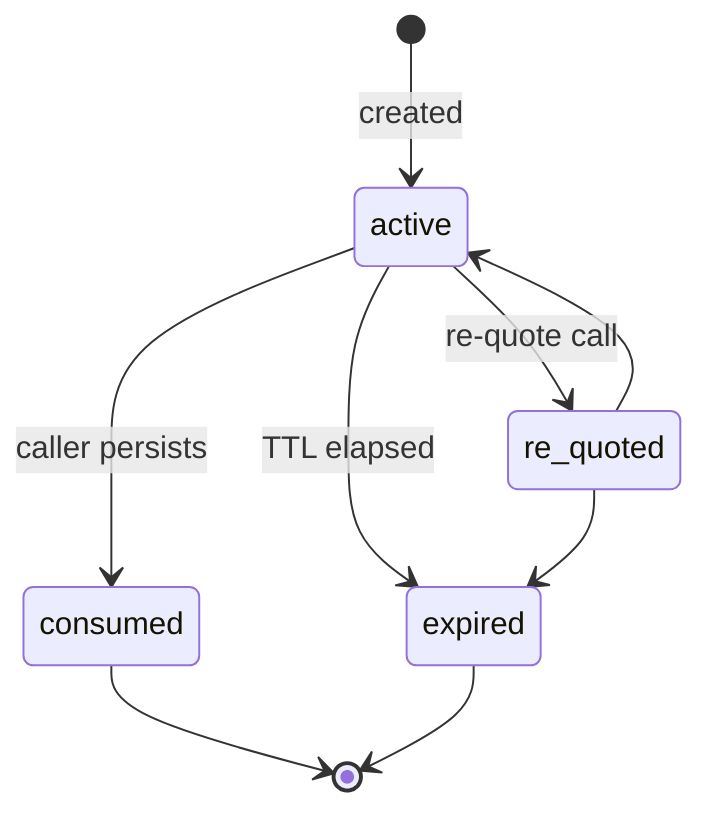
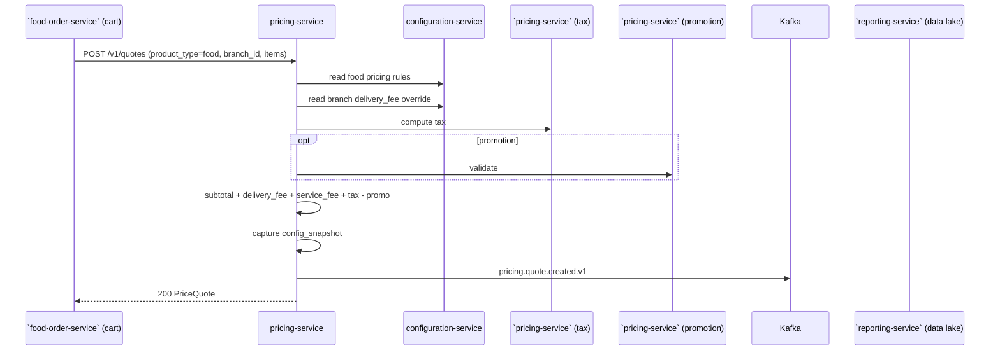
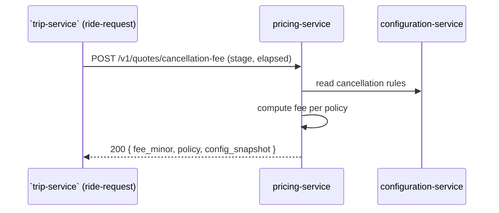
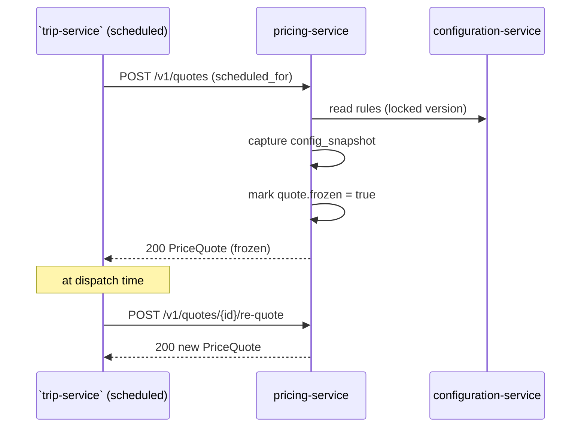
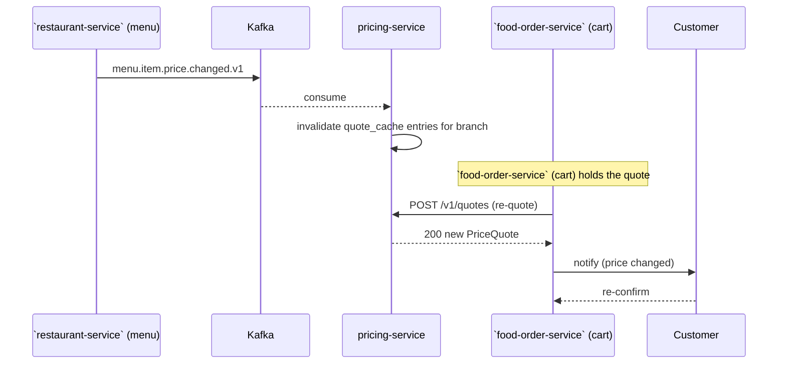

# Pricing Service — Workflows

## 1. Ride Quote

### 1.1 Objective

Compute a `PriceQuote` for a customer requesting a ride, in under
200ms P99, with a captured `config_snapshot` for reproducibility.

### 1.2 Initiating Actor

``trip-service` (ride-request)` (system) on `POST /v1/rides`.

### 1.3 Participating Services

- ``trip-service` (ride-request)` (caller)
- `pricing-service` (this service)
- `configuration-service` (rules)
- ``pricing-service` (tax)` (tax)
- `geolocation-service` (optional; ETA fetch)
- ``pricing-service` (promotion)` (optional; if a code is applied)
- ``geolocation-service` (zones)` (surge, async)
- ``reporting-service` (data lake)` (consumer of `pricing.quote.created.v1`)

### 1.4 Prerequisites

- The caller holds the `pricing.quote` scope.
- The `configuration-service` cache is warm; if not, a cold read
  takes up to 50ms.
- A surge zone id (if provided) is valid; if not, surge defaults to
  1.0.

### 1.5 Happy Path

```mermaid
sequenceDiagram
    participant RR as `trip-service` (ride-request)
    participant PRC as pricing-service
    participant CFG as configuration-service
    participant ADM as admin-service
    participant RR2 as `trip-service` / `food-order-service` / `search-service` (review projections)
    participant LOY as `pricing-service` (loyalty rules) / `customer-service` (account)
    participant TAX as `pricing-service` (tax)
    participant PRM as `pricing-service` (promotion) (optional)
    participant K as Kafka
    participant ANA as `reporting-service` (data lake)

    RR->>PRC: POST /v1/quotes (request, Idempotency-Key)
    PRC->>CFG: GET pricing.base_fare, per_km, per_min, min_fare
    CFG-->>PRC: rules
    PRC->>ADM: read in-memory pricing.rule_bindings (O(1) lookup)
    ADM-->>PRC: matched overrides (most-specific first)
    opt rating-density (B1)
        PRC->>RR2: GET /v1/zones/{zone_id}/driver-rating?window_minutes=15 (or cache)
        RR2-->>PRC: avg_rating, density_pct
        PRC->>PRC: composed_surge = max(1.0, base × (1+pct)); cap at max_multiplier
        PRC->>K: outbox → pricing.rating_density.applied.v1 (if applied)
    end
    PRC->>TAX: POST /v1/tax/calculate (pickup jurisdiction)
    TAX-->>PRC: tax
    opt cross-border (pickup_city ≠ dropoff_city)
        PRC->>TAX: POST /v1/tax/calculate (dropoff jurisdiction)
        TAX-->>PRC: tax (may carry reverse_charge)
    end
    opt promotion code
        PRC->>PRM: POST /v1/promotions/validate
        PRM-->>PRC: discount
    end
    opt loyalty (B2)
        PRC->>LOY: GET /v1/accounts/{customer_id}/frequent-zones?window_days=30 (or cache)
        LOY-->>PRC: trip_count_30d, tier
        PRC->>PRC: loyalty_discount = base × tier_multiplier (capped)
        PRC->>K: outbox → pricing.loyalty_discount.applied.v1 (if applied)
    end
    PRC->>PRC: compute subtotal, surge, total
    PRC->>PRC: capture config_snapshot (incl. matched geo ids, rating-density, loyalty)
    PRC->>PRC: persist to quote_cache (5 min TTL)
    PRC->>K: outbox → pricing.quote.created.v1
    opt matched ≥ 1 override (B3)
        PRC->>K: outbox → pricing.geo_overrides.matched.v1
    end
    PRC-->>RR: 200 PriceQuote
    K-->>ANA: pricing.quote.created.v1
```

State machine for a quote:



### 1.6 Alternate Paths

- **Promotion code provided but invalid**: the service returns
  422 `PROMOTION_INVALID`; the caller surfaces a UI error.
- **No surge zone provided**: surge defaults to 1.0; the caller may
  re-quote with a zone later.
- **Scheduled ride**: the `scheduled_for` is set; the quote is
  "frozen" at this version; a re-quote at the time of dispatch may
  return a different total.

### 1.7 Failure Paths

| Failure | Handling |
|---------|----------|
| `configuration-service` unreachable, cache cold | 503 `CIRCUIT_OPEN` with `Retry-After` |
| ``pricing-service` (tax)` unreachable, cache cold | 503 `CIRCUIT_OPEN` |
| ``pricing-service` (promotion)` unreachable | fall back to "no discount" + log warning |
| Surge zone invalid | 422 `ZONE_UNKNOWN` |
| Unknown ride type | 422 `RIDE_TYPE_UNKNOWN` |
| Idempotency-Key reused with different body | 422 `IDEMPOTENCY_KEY_REUSED` |
| Outbox poller fails | retry with backoff; DLQ after 3 attempts |

### 1.8 Business Rules

- The total = `base_fare + distance_rate*km + time_rate*min +
  surge*subtotal + fees - promotion - loyalty_discount` rounded to
  minor units.
- Tax is on the post-surge, post-promotion, post-loyalty subtotal
  (`tax_origin` + `tax_destination` for cross-border trips; both
  computed independently by ``pricing-service` (tax)`).
- The minimum fare is enforced as
  `max(min_fare, total)` AFTER every discount, including the loyalty
  discount (FR--033).
- Surge ≤ `pricing.surge.max_multiplier`; the composed surge
  (after the rating-density surcharge is applied) is also
  ≤ `pricing.surge.max_multiplier` (FR--027).
- A matched geo-config override is applied with the precedence of
  FR--037 (most-specific wins); the matched ids+versions are
  captured in `config_snapshot.values` (FR--039).

### 1.9 State Transitions

See state machine in 1.5.

### 1.10 Events

| Event | Direction | When |
|-------|-----------|------|
| `pricing.quote.created.v1` | produced | every successful quote |
| `pricing.quote.expired.v1` | produced | TTL elapses |

### 1.11 APIs Involved

| API | Direction | When |
|-----|-----------|------|
| `POST /v1/quotes` | inbound | every ride request |
| `GET /v1/configurations/{key}` | outbound | rule lookup |
| `POST /v1/tax/calculate` | outbound | tax lookup |

### 1.12 Compensation / Rollback

If the quote was based on stale rules, the caller calls
`POST /v1/quotes/{quote_id}/re-quote` to re-evaluate. The re-quoted
total is the new authoritative value; the old quote is marked
`expired`.

### 1.13 Final State

The quote is in `quote_cache` with `status='active'`, a captured
`config_snapshot`, and a TTL of 5 minutes. The caller persists the
quote on the order and marks it `consumed`.

## 2. Food Cart Quote

### 2.1 Objective

Compute a `PriceQuote` for a food cart with a per-branch delivery
fee override.

### 2.2 Initiating Actor

``food-order-service` (cart)` (system) on every cart update and at checkout.

### 2.3 Participating Services

- ``food-order-service` (cart)` (caller)
- `pricing-service`
- `configuration-service` (food pricing rules)
- ``pricing-service` (tax)`
- ``pricing-service` (promotion)` (optional)
- ``restaurant-service` (menu)` (per-item price)

### 2.4 Prerequisites

- The cart has valid items and a valid branch.
- The branch's `delivery_fee` override is in configuration.

### 2.5 Happy Path



### 2.6 Alternate Paths

- **Item price changed**: the ``food-order-service` (cart)` re-calls
  `POST /v1/quotes` on `menu.item.price.changed.v1`.
- **Branch busy**: a `branch.busy.v1` event is consumed; the cart
  shows a "delivery time may be longer" hint but the price is
  unchanged.

### 2.7 Failure Paths

Same as workflow 1; food-specific: if the branch is closed, the
service returns 422 `BRANCH_UNAVAILABLE`.

### 2.8 Business Rules

- The delivery fee is the branch override + the platform service fee.
- The minimum order amount is enforced per the city's
  `order.min_amount`.

### 2.9 State Transitions

Same as workflow 1.

### 2.10 Events

| Event | Direction | When |
|-------|-----------|------|
| `pricing.quote.created.v1` | produced | every successful quote |
| `menu.item.price.changed.v1` | consumed | re-quote trigger |

### 2.11 APIs Involved

| API | Direction | When |
|-----|-----------|------|
| `POST /v1/quotes` | inbound | every cart update |
| `GET /v1/configurations/{key}` | outbound | rule lookup |

### 2.12 Compensation / Rollback

If the cart is abandoned, the quote expires silently; no event
emitted (or `pricing.quote.expired.v1` for analytics).

### 2.13 Final State

The cart's total matches the quote; the `config_snapshot` is
captured; the cart can proceed to checkout.

## 3. Cancellation Fee

### 3.1 Objective

Compute the cancellation fee for a ride or order at a given stage.

### 3.2 Initiating Actor

``trip-service` (ride-request)` or `food-order-service` (system) on
cancellation.

### 3.3 Participating Services

- Caller service
- `pricing-service`
- `configuration-service` (cancellation rules)

### 3.4 Prerequisites

- The caller provides the stage (e.g. `after_match_before_pickup`).
- The cancellation rules are loaded in `configuration-service`.

### 3.5 Happy Path



### 3.6 Alternate Paths

- **Driver cancellation**: a different policy (often no fee to the
  customer); the caller passes `actor=driver`.

### 3.7 Failure Paths

| Failure | Handling |
|---------|----------|
| Unknown stage | 422 `STAGE_UNKNOWN` |
| Config unreachable, cache cold | 503 `CIRCUIT_OPEN` |

### 3.8 Business Rules

- Before match: fee = 0.
- After match, before pickup, within grace minutes: fee = 0.
- After match, before pickup, after grace: fee =
  `pricing.cancellation.fee_amount`.
- At pickup or in-trip: fee = higher amount + per-minute.

### 3.9 State Transitions

n/a (read-only).

### 3.10 Events

n/a (no event for cancellation fee; the order's `cancelled` event
carries the fee).

### 3.11 APIs Involved

| API | Direction | When |
|-----|-----------|------|
| `POST /v1/quotes/cancellation-fee` | inbound | every cancellation |

### 3.12 Compensation / Rollback

n/a (read-only).

### 3.13 Final State

The caller has the fee; the order is updated with the fee and a
refund / charge is initiated by the integration service.

## 4. Scheduled Ride Quote (Frozen)

### 4.1 Objective

A scheduled-ride quote is computed at booking time and "frozen"; a
re-quote at dispatch time may differ if the rules have changed.

### 4.2 Initiating Actor

``trip-service` (scheduled)` (system) on `POST /v1/scheduled-rides`.

### 4.3 Participating Services

- ``trip-service` (scheduled)`
- `pricing-service`

### 4.4 Prerequisites

- A `scheduled_for` time is provided.
- The customer has confirmed the booking.

### 4.5 Happy Path



### 4.6 Alternate Paths

- **Rules unchanged at dispatch**: re-quote returns the same total;
  the customer is charged the locked fare.
- **Rules changed**: re-quote returns a new total; the customer is
  informed; a confirmation may be required.

### 4.7 Failure Paths

| Failure | Handling |
|---------|----------|
| Re-quote fails | fall back to the locked fare; alert |

### 4.8 Business Rules

- A scheduled-ride quote is `frozen=true` at creation.
- The re-quote at dispatch may return a higher or lower total; the
  policy is configurable.

### 4.9 State Transitions

Same as workflow 1; `quote.frozen` is the additional flag.

### 4.10 Events

| Event | Direction | When |
|-------|-----------|------|
| `pricing.quote.created.v1` | produced | creation |
| `pricing.quote.created.v1` | produced | re-quote |

### 4.11 APIs Involved

| API | Direction | When |
|-----|-----------|------|
| `POST /v1/quotes` | inbound | creation |
| `POST /v1/quotes/{id}/re-quote` | inbound | dispatch |

### 4.12 Compensation / Rollback

n/a (read-only).

### 4.13 Final State

The scheduled ride is dispatched with the locked (or re-quoted)
fare; the customer is charged the agreed total.

## 5. Re-Quote on Menu Price Change

### 5.1 Objective

When a menu item's price changes, every active food cart quote is
invalidated and re-computed.

### 5.2 Initiating Actor

Kafka producer (``restaurant-service` (menu)`).

### 5.3 Participating Services

- ``restaurant-service` (menu)` (producer)
- Kafka
- `pricing-service` (consumer)
- ``food-order-service` (cart)` (re-requests)

### 5.4 Prerequisites

- A quote was previously created for the affected branch.
- The `food-order-service` (cart) holds a reference to the quote.

### 5.5 Happy Path



### 5.6 Alternate Paths

- **Cart not re-quoted in time**: at checkout, the service refuses
  the order and re-quotes.

### 5.7 Failure Paths

| Failure | Handling |
|---------|----------|
| ``restaurant-service` (menu)` event delayed | checkout refuses; cart re-quotes |

### 5.8 Business Rules

- A re-quote MUST be confirmed by the customer if the total
  increased by more than X% (configurable).

### 5.9 State Transitions

The quote moves from `active` → `expired` (the old one) and a new
`active` is created.

### 5.10 Events

| Event | Direction | When |
|-------|-----------|------|
| `menu.item.price.changed.v1` | consumed | re-quote trigger |
| `pricing.quote.created.v1` | produced | re-quote |

### 5.11 APIs Involved

| API | Direction | When |
|-----|-----------|------|
| `POST /v1/quotes/{id}/re-quote` | inbound | re-quote |

### 5.12 Compensation / Rollback

If the customer does not re-confirm, the cart is left in
`active`; the checkout is not initiated.

### 5.13 Final State

The cart's quote matches the current menu prices; the customer has
re-confirmed the total.

---

## 6. Cross-Border Trip Pricing (city-to-city)

### 6.1 Objective

Compute a `PriceQuote` for a trip whose pickup city differs from the
dropoff city. The two jurisdictions may have different VAT rates,
marketplace fees, or (rarely) different rules, so the quote must
**call ``pricing-service` (tax)` twice** — once for the origin jurisdiction and
once for the destination jurisdiction.

### 6.2 Initiating Actor

``trip-service` (ride-request)` (system) on `POST /v1/rides` when the
validated pickup and dropoff resolve to different `(country, region,
city)` triples via ``geolocation-service` (zones)`.

### 6.3 Participating Services

- ``trip-service` (ride-request)` (caller)
- `pricing-service` (this service)
- `configuration-service` (rules)
- ``pricing-service` (tax)` (tax, called **twice**)
- ``geolocation-service` (zones)` (zone resolution, if not provided by the caller)
- `admin-service` (geo-config override source)
- `geolocation-service` (optional; ETA fetch)
- ``pricing-service` (promotion)` (optional)
- ``trip-service` / `food-order-service` / `search-service` (review projections)` (B1 optional)
- ``pricing-service` (loyalty rules) / `customer-service` (account)` (B2 optional)

### 6.4 Prerequisites

- The `QuoteRequest` carries explicit `pickup` and `dropoff` lat/lon
  AND either the resolved `(country, region, city)` for each or the
  zone-ids that resolve to them.
- The ``pricing-service` (tax)` is reachable for both jurisdictions; on cold
  cache, the call takes up to 50ms each.

### 6.5 Happy Path

```mermaid
sequenceDiagram
    participant RR as `trip-service` (ride-request)
    participant PRC as pricing-service
    participant ZS as `geolocation-service` (zones)
    participant CFG as configuration-service
    participant ADM as admin-service
    participant TAX as `pricing-service` (tax)
    participant K as Kafka

    RR->>PRC: POST /v1/quotes (pickup_city_id=A, dropoff_city_id=B)
    PRC->>ZS: POST /v1/zones/contains (pickup, dropoff)
    ZS-->>PRC: origin_zone_id, destination_zone_id
    PRC->>CFG: read rules
    PRC->>ADM: matched overrides (city_to_city OD-pair precedence)
    ADM-->>PRC: matched[0] = OD-corridor binding
    PRC->>TAX: POST /v1/tax/calculate (city A)
    TAX-->>PRC: tax_origin (incl. snapshot_id)
    PRC->>TAX: POST /v1/tax/calculate (city B)
    TAX-->>PRC: tax_destination (incl. snapshot_id, reverse_charge?)
    PRC->>PRC: compose total (origin + destination tax; surcharge from OD corridor)
    PRC->>PRC: capture config_snapshot (both snapshot_ids, matched OD ids+versions)
    PRC->>K: pricing.quote.created.v1
    PRC->>K: pricing.geo_overrides.matched.v1
    PRC-->>RR: 200 PriceQuote (lines: tax_origin, tax_destination)
```

State: a cross-border quote is `active` like any other quote; its
`frozen` flag (see workflow 4) works the same way for scheduled
rides.

### 6.6 Alternate Paths

- **Same jurisdiction** (`pickup_city_id == dropoff_city_id`):
  workflow 1 applies; no cross-border logic.
- **``pricing-service` (tax)` unreachable for the destination**: fall back to
  the cached rules; if cache is cold, retry once; persistent
  failure returns 503 `DEPENDENCY_TIMEOUT`. The origin call
  succeeded, but the quote is rejected to keep both line items
  consistent.
- **`reverse_charge=true` on the destination**: `tax_destination`
  line is `0` and its `label` includes the hint "reverse charge";
  the originating tax_event from ``pricing-service` (tax)` is the authoritative
  record (FR--041).
- **Multiple OD corridors match** (origin/destination/ride_type
  tuples overlap): not allowed by `admin-service` validation
  (workflow 7 of `admin-service/WORKFLOWS.md`); the most-specific
  record wins. If both are equal-priority, the call returns
  422 `GEO_OVERRIDE_AMBIGUOUS`.

### 6.7 Failure Paths

| Failure | Handling |
|---------|----------|
| ``pricing-service` (tax)` unreachable for either jurisdiction | retry once (cache fallback); 503 if cold |
| ``geolocation-service` (zones)` unreachable for either lat/lon | retry once; 503 if cold |
| Geo-config admin produces ambiguous match | 422 `GEO_OVERRIDE_AMBIGUOUS` |
| Geo-config override disabled | skip silently; compose without it |

### 6.8 Business Rules

- The two tax calculations are **independent** — no net-of-tax
  adjustment; the ledger records both as separate lines on the
  customer-transaction-recognition view (see
  [`../../workflows/ACCOUNTING_WORKFLOWS.md`](../../workflows/ACCOUNTING_WORKFLOWS.md)
  "Workflow: Customer Transaction Recognition").
- The OD-corridor geo-config override MAY be a surcharge or a
  discount; it composes with the surge line the same way other
  overrides do (FR--027 cap rule still applies).
- The customer's wallet credit / loyalty points / reward grants
  use the destination city for minimum-fare enforcement (the
  jurisdiction they paid in).

### 6.9 State Transitions

Same as workflow 1 (`active → re_quoted → expired | consumed`).

### 6.10 Events

| Event | Direction | When |
|-------|-----------|------|
| `pricing.quote.created.v1` | produced | every successful cross-border quote |
| `pricing.geo_overrides.matched.v1` | produced | when an OD-pair corridor matched (always for cross-border; also for in-city quotes that have a corridor rule) |
| `pricing.rating_density.applied.v1` | produced | when the origin zone qualifies (B1, opt) |
| `pricing.loyalty_discount.applied.v1` | produced | when the customer qualifies for the origin zone (B2, opt) |
| `tax.calculated.v1` | consumed via the read-side cache refresh handler | one per jurisdiction |

### 6.11 APIs Involved

| API | Direction | When |
|-----|-----------|------|
| `POST /v1/quotes` | inbound | every cross-border ride request |
| `POST /v1/zones/contains` | outbound to ``geolocation-service` (zones)` | resolve origin + destination zones (when not provided) |
| `POST /v1/tax/calculate` | outbound to ``pricing-service` (tax)` | twice per quote |
| `GET /v1/admin/pricing/geo-config/{id}` | outbound to `admin-service` | when the admin debug path is used |

### 6.12 Compensation / Rollback

If the quote was based on a stale rule, the caller calls
`POST /v1/quotes/{quote_id}/re-quote`; the cross-border logic is
re-evaluated end-to-end. If the matched OD-corridor binding is
disabled between quote and capture, the integration service rejects
the trip at the ride-request layer (the trip is not started from a
disabled corridor).

### 6.13 Final State

The quote is in `quote_cache` with `status='active'`, both
`tax_origin` and `tax_destination` lines, the matched OD-corridor
binding id+version captured, and a TTL of 5 minutes. The caller
persists the quote on the order and marks it `consumed`.

---

## See also

### Sibling docs for this service

- [`README.md`](./README.md) — purpose, bounded context, responsibilities
- [`BRD.md`](./BRD.md) — business requirements
- [`SRS.md`](./SRS.md) — functional + non-functional requirements
- [`ERD.md`](./ERD.md) — data model (entities, relationships)
- [`INTEGRATION.md`](./INTEGRATION.md) — inter-service contracts (APIs, events, sagas)
- [`WORKFLOWS.md`](./WORKFLOWS.md) — operational workflows (happy paths, failure modes)
- [`TECH.md`](./TECH.md) — technology profile (runtime, libraries, data layer, admin endpoints, RBAC)

### Platform-wide

- [`../../shared/README.md`](../../shared/README.md) — `platform-spring-boot-starter` shared library (the single source of cross-cutting code for all Spring Boot services in the platform)
- [`../RECOMMENDATIONS.md`](../RECOMMENDATIONS.md) — platform-wide technology map (language, framework, version baseline, admin/RBAC pattern)
- [`../../README.md`](../../README.md) — services overview (the catalog of all 20 services)
- [`../../../main.md`](../../../main.md) — top-level platform specification (architecture, Keycloak, PostgreSQL 19, messaging, observability baseline)

