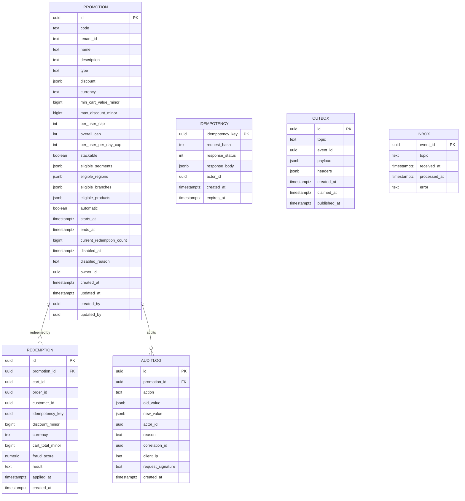

# Promotion Service — Entity-Relationship Diagram

## 1. Database

- Engine: PostgreSQL 18
- Schema: `promotion` (owned exclusively by this service)
- Migrations: `services/promotion-service/migrations/`

## 2. Cross-Service References

| Column | Type | Refers to | Source of truth |
|--------|------|-----------|------------------|
| `redemption.customer_id` | UUID | `Customer.id` | `customer-service` |
| `promotion.eligible_branches` (JSONB array) | UUID | `Branch.id` | `branch-service` |
| `promotion.eligible_products` (JSONB array) | UUID | `MenuItem.id` | `menu-service` |
| `promotion.eligible_segments` (JSONB array) | TEXT | segment name | `customer-service` |

No DB FKs.

## 3. Entities

### `Promotion`

The head of a promotion. Soft-deletable.

#### Columns

| Column | Type | Constraints | Notes |
|--------|------|-------------|-------|
| `id` | UUID | PK | UUIDv7 |
| `code` | TEXT | NOT NULL | `[A-Z0-9_-]{4,32}` |
| `tenant_id` | TEXT | NOT NULL DEFAULT 'global' | |
| `name` | TEXT | NOT NULL | human name |
| `description` | TEXT | NULL | |
| `type` | TEXT | NOT NULL | discount type |
| `discount` | JSONB | NOT NULL | type-specific params |
| `currency` | TEXT | NOT NULL | ISO-4217 |
| `min_cart_value_minor` | BIGINT | NULL | |
| `max_discount_minor` | BIGINT | NULL | cap on the discount |
| `per_user_cap` | INT | NULL | redemptions per user |
| `overall_cap` | INT | NULL | total redemptions |
| `per_user_per_day_cap` | INT | NULL | velocity cap |
| `stackable` | BOOLEAN | NOT NULL DEFAULT false | can stack with others |
| `eligible_segments` | JSONB | NOT NULL DEFAULT '[]' | |
| `eligible_regions` | JSONB | NOT NULL DEFAULT '[]' | |
| `eligible_branches` | JSONB | NOT NULL DEFAULT '[]' | |
| `eligible_products` | JSONB | NOT NULL DEFAULT '[]' | |
| `automatic` | BOOLEAN | NOT NULL DEFAULT false | no code required |
| `starts_at` | TIMESTAMPTZ | NOT NULL | |
| `ends_at` | TIMESTAMPTZ | NOT NULL | |
| `current_redemption_count` | BIGINT | NOT NULL DEFAULT 0 | running total |
| `disabled_at` | TIMESTAMPTZ | NULL | soft disable |
| `disabled_reason` | TEXT | NULL | |
| `owner_id` | UUID | NOT NULL | marketing user |
| `created_at` | TIMESTAMPTZ | NOT NULL DEFAULT now() | |
| `updated_at` | TIMESTAMPTZ | NOT NULL DEFAULT now() | |
| `created_by` | UUID | NOT NULL | |
| `updated_by` | UUID | NOT NULL | |

#### Indexes

- PK on `id`
- UNIQUE on `(tenant_id, code)`
- Index on `starts_at` and `ends_at` (active lookup)
- Partial index on `(code) WHERE disabled_at IS NULL`
- GIN index on `eligible_segments` and `eligible_branches`

#### Constraints

- CHECK: `type IN ('PERCENT_OFF','AMOUNT_OFF','FREE_DELIVERY','FIXED_PRICE','FIRST_RIDE_CREDIT')`
- CHECK: `starts_at < ends_at`
- CHECK: `per_user_cap IS NULL OR per_user_cap >= 1`
- CHECK: `overall_cap IS NULL OR overall_cap >= 1`

### `Redemption`

A successful application of a promotion to a cart / order.

#### Columns

| Column | Type | Constraints | Notes |
|--------|------|-------------|-------|
| `id` | UUID | PK | UUIDv7 |
| `promotion_id` | UUID | NOT NULL | |
| `cart_id` | UUID | NULL | one of cart_id or order_id |
| `order_id` | UUID | NULL | |
| `customer_id` | UUID | NOT NULL | |
| `idempotency_key` | UUID | NOT NULL | unique |
| `discount_minor` | BIGINT | NOT NULL | |
| `currency` | TEXT | NOT NULL | |
| `cart_total_minor` | BIGINT | NOT NULL | at time of redemption |
| `fraud_score` | NUMERIC(4,2) | NULL | |
| `result` | TEXT | NOT NULL | `success` / `fraud_blocked` |
| `applied_at` | TIMESTAMPTZ | NOT NULL DEFAULT now() | |
| `created_at` | TIMESTAMPTZ | NOT NULL DEFAULT now() | partition key |

#### Indexes

- PK on `id`
- UNIQUE on `idempotency_key`
- UNIQUE on `(cart_id, promotion_id) WHERE cart_id IS NOT NULL`
- UNIQUE on `(order_id, promotion_id) WHERE order_id IS NOT NULL`
- Index on `(customer_id, applied_at DESC)`
- Index on `(promotion_id, applied_at DESC)`

#### Constraints

- CHECK: `(cart_id IS NULL) <> (order_id IS NULL)` — exactly one
  is set.
- CHECK: `result IN ('success','fraud_blocked')`

### `AuditLog`

Immutable audit log.

#### Columns

| Column | Type | Constraints | Notes |
|--------|------|-------------|-------|
| `id` | UUID | PK | UUIDv7 |
| `promotion_id` | UUID | NULL | |
| `action` | TEXT | NOT NULL | create/update/disable/enable/delete |
| `old_value` | JSONB | NULL | |
| `new_value` | JSONB | NULL | |
| `actor_id` | UUID | NOT NULL | |
| `reason` | TEXT | NOT NULL | |
| `correlation_id` | UUID | NOT NULL | |
| `client_ip` | INET | NULL | |
| `request_signature` | TEXT | NULL | |
| `created_at` | TIMESTAMPTZ | NOT NULL DEFAULT now() | partition key |

#### Constraints

- CHECK: `action IN ('create','update','disable','enable','delete')`
- **No UPDATE / DELETE on this table** (revoked grants).

### `Idempotency`

Same shape as `configuration.idempotency`.

### `Outbox`

Same shape as `configuration.outbox`.

### `Inbox`

Same shape as `configuration.inbox`.

## 4. Mermaid ER Diagram



## 5. DDL Sketch

```sql
CREATE SCHEMA IF NOT EXISTS promotion;

CREATE TABLE promotion.promotions (
    id UUID PRIMARY KEY,
    code TEXT NOT NULL
        CHECK (code ~ '^[A-Z0-9_\-]{4,32}$'),
    tenant_id TEXT NOT NULL DEFAULT 'global',
    name TEXT NOT NULL,
    description TEXT,
    type TEXT NOT NULL
        CHECK (type IN ('PERCENT_OFF','AMOUNT_OFF','FREE_DELIVERY',
                        'FIXED_PRICE','FIRST_RIDE_CREDIT')),
    discount JSONB NOT NULL,
    currency TEXT NOT NULL,
    min_cart_value_minor BIGINT,
    max_discount_minor BIGINT,
    per_user_cap INT CHECK (per_user_cap IS NULL OR per_user_cap >= 1),
    overall_cap INT CHECK (overall_cap IS NULL OR overall_cap >= 1),
    per_user_per_day_cap INT,
    stackable BOOLEAN NOT NULL DEFAULT false,
    eligible_segments JSONB NOT NULL DEFAULT '[]',
    eligible_regions JSONB NOT NULL DEFAULT '[]',
    eligible_branches JSONB NOT NULL DEFAULT '[]',
    eligible_products JSONB NOT NULL DEFAULT '[]',
    automatic BOOLEAN NOT NULL DEFAULT false,
    starts_at TIMESTAMPTZ NOT NULL,
    ends_at TIMESTAMPTZ NOT NULL,
    current_redemption_count BIGINT NOT NULL DEFAULT 0,
    disabled_at TIMESTAMPTZ,
    disabled_reason TEXT,
    owner_id UUID NOT NULL,
    created_at TIMESTAMPTZ NOT NULL DEFAULT now(),
    updated_at TIMESTAMPTZ NOT NULL DEFAULT now(),
    created_by UUID NOT NULL,
    updated_by UUID NOT NULL,
    UNIQUE (tenant_id, code),
    CHECK (starts_at < ends_at)
);

CREATE INDEX idx_promotions_active
    ON promotion.promotions (starts_at, ends_at);
CREATE INDEX idx_promotions_code_active
    ON promotion.promotions (code)
    WHERE disabled_at IS NULL;
CREATE INDEX idx_promotions_segments_gin
    ON promotion.promotions USING gin (eligible_segments);
CREATE INDEX idx_promotions_branches_gin
    ON promotion.promotions USING gin (eligible_branches);

CREATE TABLE promotion.redemptions (
    id UUID NOT NULL,
    promotion_id UUID NOT NULL,
    cart_id UUID,
    order_id UUID,
    customer_id UUID NOT NULL,
    idempotency_key UUID NOT NULL UNIQUE,
    discount_minor BIGINT NOT NULL,
    currency TEXT NOT NULL,
    cart_total_minor BIGINT NOT NULL,
    fraud_score NUMERIC(4,2),
    result TEXT NOT NULL
        CHECK (result IN ('success','fraud_blocked')),
    applied_at TIMESTAMPTZ NOT NULL DEFAULT now(),
    created_at TIMESTAMPTZ NOT NULL DEFAULT now(),
    PRIMARY KEY (id, created_at),
    CHECK ((cart_id IS NULL) <> (order_id IS NULL))
) PARTITION BY RANGE (created_at);

CREATE UNIQUE INDEX idx_redemptions_cart_promo
    ON promotion.redemptions (cart_id, promotion_id)
    WHERE cart_id IS NOT NULL;
CREATE UNIQUE INDEX idx_redemptions_order_promo
    ON promotion.redemptions (order_id, promotion_id)
    WHERE order_id IS NOT NULL;
CREATE INDEX idx_redemptions_customer
    ON promotion.redemptions (customer_id, applied_at DESC);
CREATE INDEX idx_redemptions_promo
    ON promotion.redemptions (promotion_id, applied_at DESC);

CREATE TABLE IF NOT EXISTS promotion.redemptions_2026_07
    PARTITION OF promotion.redemptions
    FOR VALUES FROM ('2026-07-01 00:00:00+00') TO ('2026-08-01 00:00:00+00');

-- Verify the child is actually attached to the correct parent with
-- the expected bounds. IF NOT EXISTS only guards the name; it does
-- not verify bounds.
DO $$
DECLARE
    v_parent   REGCLASS := 'promotion.redemptions'::REGCLASS;
    v_child    REGCLASS := 'promotion.redemptions_2026_07'::REGCLASS;
    v_expected TSTZRANGE := tstzrange('2026-07-01 00:00:00+00',
                                      '2026-08-01 00:00:00+00',
                                      '[)');
BEGIN
    IF (SELECT inhparent FROM pg_inherits WHERE inhrelid = v_child)
       IS DISTINCT FROM v_parent THEN
        RAISE EXCEPTION 'partition % is not attached to %',
            v_child::text, v_parent::text;
    END IF;
    IF NOT (SELECT relpartbound FROM pg_class WHERE oid = v_child)
              = v_expected THEN
        RAISE EXCEPTION 'partition % has unexpected bounds', v_child::text;
    END IF;
END $$;

CREATE TABLE promotion.audit_log (
    id UUID NOT NULL,
    promotion_id UUID,
    action TEXT NOT NULL
        CHECK (action IN ('create','update','disable','enable','delete')),
    old_value JSONB,
    new_value JSONB,
    actor_id UUID NOT NULL,
    reason TEXT NOT NULL,
    correlation_id UUID NOT NULL,
    client_ip INET,
    request_signature TEXT,
    created_at TIMESTAMPTZ NOT NULL DEFAULT now(),
    PRIMARY KEY (id, created_at)
) PARTITION BY RANGE (created_at);
REVOKE UPDATE, DELETE ON promotion.audit_log FROM promotion_app;

CREATE TABLE IF NOT EXISTS promotion.audit_log_2026_07
    PARTITION OF promotion.audit_log
    FOR VALUES FROM ('2026-07-01 00:00:00+00') TO ('2026-08-01 00:00:00+00');

CREATE TABLE promotion.idempotency (
    idempotency_key UUID PRIMARY KEY,
    request_hash TEXT NOT NULL,
    response_status INT NOT NULL,
    response_body JSONB NOT NULL,
    actor_id UUID NOT NULL,
    created_at TIMESTAMPTZ NOT NULL DEFAULT now(),
    expires_at TIMESTAMPTZ NOT NULL
);

CREATE TABLE promotion.outbox (
    id UUID PRIMARY KEY,
    topic TEXT NOT NULL,
    event_id UUID NOT NULL,
    payload JSONB NOT NULL,
    headers JSONB,
    created_at TIMESTAMPTZ NOT NULL DEFAULT now(),
    claimed_at TIMESTAMPTZ,
    published_at TIMESTAMPTZ
);

CREATE TABLE promotion.inbox (
    event_id UUID PRIMARY KEY,
    topic TEXT NOT NULL,
    received_at TIMESTAMPTZ NOT NULL DEFAULT now(),
    processed_at TIMESTAMPTZ,
    error TEXT
);
```

## 6. Audit Columns

Every mutable table has `created_at`, `updated_at`, `created_by`,
`updated_by`. `audit_log` is append-only.

## 7. Soft Delete

`promotions.disabled_at` is the soft-delete flag. A disabled
promotion returns 404 on `GET /v1/promotions/{code}` (or 410 if
explicitly disabled vs. expired).

## 8. JSONB Usage

| Table.Column | What is stored | Justification |
|--------------|----------------|---------------|
| `promotions.discount` | type-specific params | flexible per type |
| `promotions.eligible_*` | array of UUIDs / strings | flexible targeting |
| `redemptions` (none) | — | — |
| `audit_log.old_value` / `new_value` | pre/post image | diff display |
| `outbox.payload` | event payload | per topic |

## 9. Partitioning

- `redemptions` partitioned by month.
- `audit_log` partitioned by month.

See [`DATABASE_ARCHITECTURE.md` §"Table Partitioning — Canonical Template"](../../architecture/DATABASE_ARCHITECTURE.md) for the idempotent `CREATE TABLE IF NOT EXISTS … PARTITION OF …` pattern, naming convention, and the service-owned maintenance-job contract (advisory lock, verification, retention/mixed-retention handling).

## 10. Data Retention

| Table | Retention | Purged by |
|-------|-----------|-----------|
| `promotions` | indefinitely (soft delete) | n/a |
| `redemptions` | 7 years | monthly archival job |
| `audit_log` | 7 years | monthly archival job |
| `idempotency` | 24 hours | daily purge job |
| `outbox` | 24 hours after `published_at` | hourly purge job |
| `inbox` | 7 days | daily purge job |

## 11. Migration Considerations

- Adding a new discount type is a `CHECK` constraint update + a
  one-time enum broadcast; no data migration.
- The `redemptions` table is partitioned; new partitions are
  created monthly by the migration runner.
- The `audit_log` append-only constraint is enforced at the database
  grant level.

---

## See also

### Sibling docs for this service

- [`README.md`](./README.md) — purpose, bounded context, responsibilities
- [`BRD.md`](./BRD.md) — business requirements
- [`SRS.md`](./SRS.md) — functional + non-functional requirements
- [`ERD.md`](./ERD.md) — data model (entities, relationships)
- [`INTEGRATION.md`](./INTEGRATION.md) — inter-service contracts (APIs, events, sagas)
- [`WORKFLOWS.md`](./WORKFLOWS.md) — operational workflows (happy paths, failure modes)
- [`TECH.md`](./TECH.md) — technology profile (runtime, libraries, data layer, admin endpoints, RBAC)

### Platform-wide

- [`../../shared/README.md`](../../shared/README.md) — `platform-spring-boot-starter` shared library (the single source of cross-cutting code for all Spring Boot services in the platform)
- [`../RECOMMENDATIONS.md`](../RECOMMENDATIONS.md) — platform-wide technology map (language, framework, version baseline, admin/RBAC pattern)
- [`../../README.md`](../../README.md) — services overview (the catalog of all 58 services)
- [`../../../main.md`](../../../main.md) — top-level platform specification (architecture, Keycloak, PostgreSQL 18, messaging, observability baseline)

