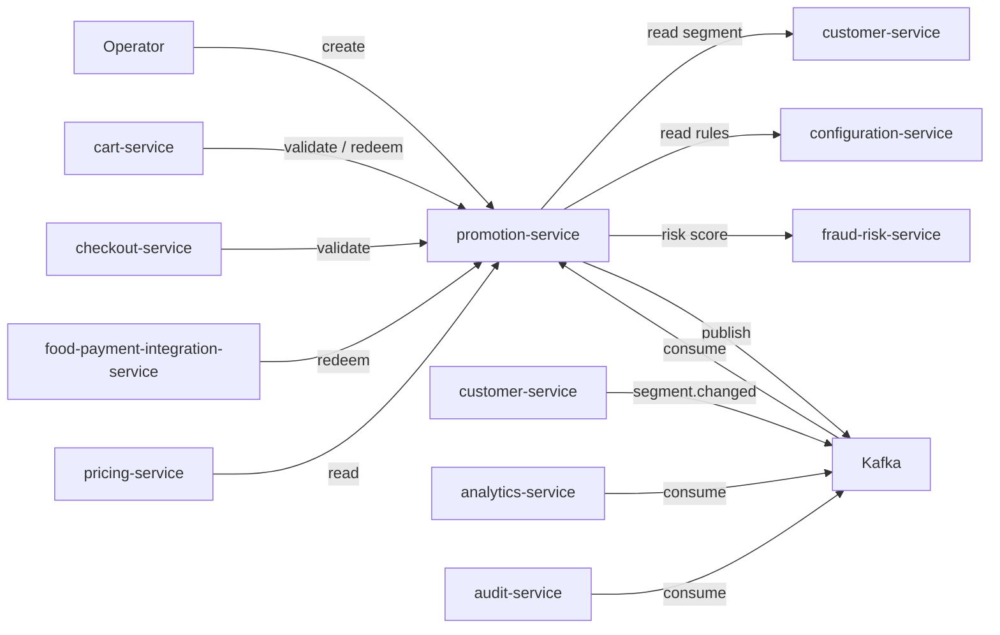
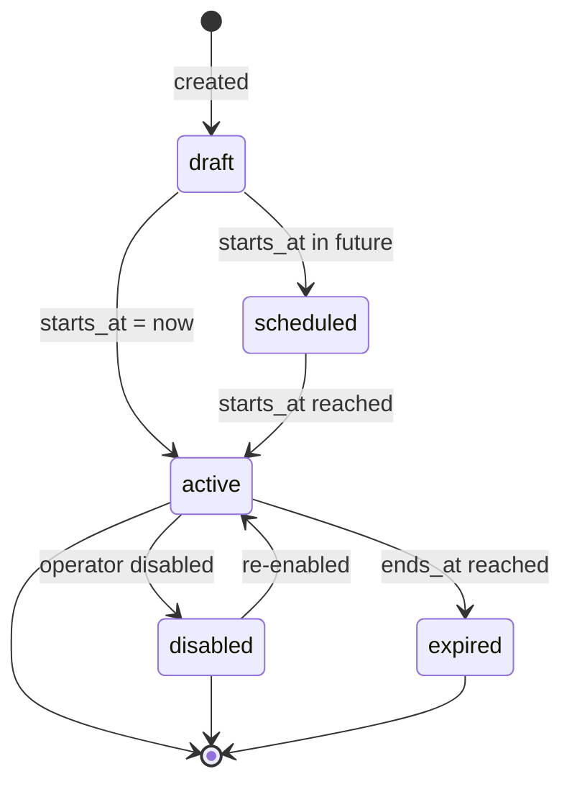

# Promotion Service — Software Requirements Specification

## 1. Introduction

This SRS specifies the behavior, performance, and operational
requirements of `promotion-service`. It inherits the platform-wide
standards in `docs/architecture/API_STANDARDS.md`,
`docs/architecture/EVENT_ARCHITECTURE.md`, and
`docs/architecture/SECURITY_ARCHITECTURE.md`.

## 2. Scope

In scope:

- Promotion definitions (coupons, campaigns, automatic discounts).
- The rule engine that decides eligibility.
- The redemption endpoint with idempotency.
- Anti-fraud checks.
- Audit log of every change.

Out of scope:

- Cart / order persistence (owned by `cart-service`,
  `food-order-service`).
- Pricing math (owned by `pricing-service`).
- Customer segment computation (owned by `customer-service`).

## 3. System Context

## 4. Actors

- Operator (admin / marketing) — human.
- `cart-service` (system).
- `checkout-service` (system).
- `food-payment-integration-service` (system).
- `pricing-service` (system).
- `analytics-service` (system; consumer of events).
- `audit-service` (system; consumer of events).

## 5. Functional Requirements

| ID | Requirement | Priority |
|----|-------------|----------|
| FR--001 | The service MUST expose `POST /v1/promotions` to create a new promotion. | MUST |
| FR--002 | The service MUST expose `GET /v1/promotions/{code}` to read a promotion by code. | MUST |
| FR--003 | The service MUST expose `POST /v1/promotions/{code}/disable` to disable a promotion. | MUST |
| FR--004 | The service MUST expose `POST /v1/promotions/validate` to check whether a code applies to a cart context. | MUST |
| FR--005 | The service MUST expose `POST /v1/promotions/redeem` to record a redemption with idempotency. | MUST |
| FR--006 | The service MUST support multiple discount types: `PERCENT_OFF`, `AMOUNT_OFF`, `FREE_DELIVERY`, `FIXED_PRICE`, `FIRST_RIDE_CREDIT`. | MUST |
| FR--007 | The service MUST support eligibility rules: user segment, region, branch, product, min cart value, dates, per-user cap, overall cap. | MUST |
| FR--008 | The service MUST support scheduled `starts_at` and `ends_at`. | MUST |
| FR--009 | The service MUST support automatic discounts (no code) for segmented campaigns. | MUST |
| FR--010 | The service MUST return the discount as a separate line item with `code`, `label`, `amount_minor`, `currency`. | MUST |
| FR--011 | The service MUST emit `promotion.created.v1`, `promotion.disabled.v1`, `promotion.redeemed.v1`. | MUST |
| FR--012 | The service MUST reject a redemption if the user is suspended. | MUST |
| FR--013 | The service MUST reject a redemption if the per-user cap is reached. | MUST |
| FR--014 | The service MUST reject a redemption if the overall cap is reached. | MUST |
| FR--015 | The service MUST reject a redemption if the cart's currency does not match the promotion's currency. | MUST |
| FR--016 | The service MUST reject a redemption if the cart's total is below the min cart value. | MUST |
| FR--017 | The service MUST reject a redemption if the cart contains a non-eligible product / branch. | MUST |
| FR--018 | The service MUST persist every change in `promotion.audit_log` with `actor_id` and `reason`. | MUST |
| FR--019 | The service MUST support per-tenant promotions. | MUST |
| FR--020 | The service MUST support "stackable" promotions (one of each type per cart). | SHOULD |
| FR--021 | The service MUST call `fraud-risk-service` for a risk score on redemption; on `CIRCUIT_OPEN`, default to `allow`. | MUST |
| FR--022 | The service MUST export daily redemption snapshots to S3. | SHOULD |

## 6. Non-Functional Requirements

| ID | Category | Requirement | Target |
|----|----------|-------------|--------|
| NFR--001 | performance | P99 validate latency | < 100ms |
| NFR--002 | performance | P99 redeem latency | < 200ms |
| NFR--003 | availability | uptime | 99.9% over 30d |
| NFR--004 | scalability | concurrent redeems per pod | 1,000 |
| NFR--005 | durability | zero data loss on regional outage | RPO 5m, RTO 30m |
| NFR--006 | idempotency | zero double-redemptions | enforced in DB |
| NFR--007 | observability | 100% requests have trace and log | enforced in CI |
| NFR--008 | auditability | 100% writes attributed | enforced in DB |
| NFR--009 | freshness | median propagation latency | < 2s |

## 7. API Requirements

- Versioned URIs.
- Bearer JWT.
- `Idempotency-Key` for non-idempotent writes.
- Errors in the standard envelope.
- Money: integer minor units.
- OpenAPI 3.1 at `/openapi.json`.

## 8. Data Requirements

| ID | Requirement | Notes |
|----|-------------|-------|
| DATA--001 | Primary keys UUIDv7. | |
| DATA--002 | Code is unique per tenant (`(tenant_id, code)`). | |
| DATA--003 | Redemption dedup keyed on `(cart_id, code)` / `(order_id, code)`. | |
| DATA--004 | Cross-service references are UUID columns without DB FKs. | Rule |
| DATA--005 | Soft delete via `disabled_at`. | |
| DATA--006 | Time is RFC3339 UTC. | |
| DATA--007 | Redemptions partitioned by month. | Retention. |

## 9. Validation Rules

- A code MUST be `[A-Z0-9_-]{4,32}`.
- A discount type MUST be one of the supported types.
- A `starts_at` MUST be < `ends_at`.
- A cap MUST be `>= 1` if set.
- A `min_cart_value_minor` MUST be `>= 0`.
- A `currency` MUST be ISO-4217.

## 10. State Transitions

## 11. Authorization Requirements

- `promotion.admin` for writes.
- `promotion.read` for reads.
- `promotion.redeem` for the redemption endpoint.
- Tenant isolation: a promotion is scoped to a `tenant_id`; cross-
  tenant access is 403.

## 12. Configuration Requirements

- `REDEMPTION_DEDUP_TTL_HOURS` (env; default 24).
- `MAX_REDEMPTIONS_PER_USER_PER_DAY` (env; default 5; overridable
  per promotion).

## 13. Error Handling

| Error | Response |
|-------|----------|
| Code not found | 404 `PROMOTION_NOT_FOUND` |
| Code expired | 410 `PROMOTION_EXPIRED` |
| Code not yet active | 409 `PROMOTION_NOT_STARTED` |
| Per-user cap reached | 409 `PROMOTION_CAP_REACHED` |
| Overall cap reached | 409 `PROMOTION_CAP_REACHED` |
| Cart currency mismatch | 422 `PROMOTION_CURRENCY_MISMATCH` |
| Min cart value not met | 422 `PROMOTION_MIN_CART_VALUE` |
| Non-eligible product | 422 `PROMOTION_PRODUCT_INELIGIBLE` |
| User suspended | 403 `USER_SUSPENDED` |
| Fraud score high | 403 `PROMOTION_FRAUD_BLOCKED` |
| Idempotency-Key reuse with different body | 422 `IDEMPOTENCY_KEY_REUSED` |
| Duplicate redemption | 409 `PROMOTION_ALREADY_REDEEMED` (idempotent replay returns 200 with prior result) |

## 14. Concurrency Requirements

- A redemption is serialized at the row level
  (`SELECT ... FOR UPDATE` on the promotion row).
- Two simultaneous redemptions of the same `(cart_id, code)` MUST
  result in one win and one 409.

## 15. Idempotency Requirements

- `POST /v1/promotions/redeem` requires `Idempotency-Key`.
- The service stores the key in `promotion.idempotency` for 24 hours.
- A duplicate `Idempotency-Key` with the same body returns the prior
  result; a different body returns 422.
- The dedup key is `cart:<cart_id>:promo:<code>` (or
  `order:<order_id>:promo:<code>` for capture-time).

## 16. Performance

- Dominant path: `POST /v1/promotions/redeem`.
- P50/P95/P99: 20ms / 80ms / 200ms.

## 17. Scalability

- Horizontal scaling: HPA on CPU and redemption rate.
- Vertical scaling: 2 vCPU / 4 GiB production.

## 18. Availability

- SLO: 99.9% over 30 days.
- Error budget: ~44 minutes per 30 days.
- Maintenance window: Sundays 04:00–06:00 UTC.

## 19. Security

| ID | Requirement | Notes |
|----|-------------|-------|
| SEC--001 | All requests JWT-validated. | Standard |
| SEC--002 | Mutations require `X-Audit-Reason`. | |
| SEC--003 | Large campaign rollouts require `X-Signature`. | HMAC-SHA256. |
| SEC--004 | PII limited to customer UUID. | |
| SEC--005 | Money is integer minor units. | |
| SEC--006 | DB user has rights only on the `promotion` schema. | Least privilege. |
| SEC--007 | Redemption fraud-score is non-blocking on `CIRCUIT_OPEN`. | |

## 20. Privacy

- PII stored: customer UUID in redemptions; no contact info.
- Retention: 7 years for financial-impact redemptions; 1 year for
  the rest.
- Erasure: tenant offboarding deactivates all promotions and
  anonymizes redemptions.

## 21. Auditability

- Every write emits an event AND a row in `promotion.audit_log`.
- `audit-service` consumes the events and persists to its own
  immutable store.

## 22. Observability

- Logs: JSON to stdout; standard fields + `promotion_code`,
  `customer_id`, `redemption_id`, `result`.
- Metrics:
  - `http_requests_total{route, method, status}` (RED)
  - `http_request_duration_seconds{route, method, status}` (RED)
  - `promotion_redeem_total{code, result}`
  - `promotion_validate_total{code, result}`
  - `promotion_redemptions_per_user`
  - `promotion_propagation_seconds`
- Traces: OpenTelemetry; one root span per request.
- Alerts:
  - SLO burn rate.
  - Redemption rate spike (3x baseline).
  - Fraud-score high rate > 0.1% for 5 min.

## 23. Maintainability

- Code style: TypeScript ESLint config.
- Test coverage: ≥ 85% on handlers, ≥ 95% on rule evaluators.
- Documentation: this folder; OpenAPI 3.1 at `/openapi.json`.

## 24. Disaster Recovery

- RPO: 5 minutes.
- RTO: 30 minutes.

## 25. Acceptance Criteria

- 99.9% validate / redeem availability for 30 days in production.
- 0 double-redemptions under cart retry.
- A disabled promotion is rejected at validation.
- A future-dated promotion is rejected until its `starts_at`.
- A per-user cap is enforced.
- An overall cap is enforced.

---

## See also

### Sibling docs for this service

- [`README.md`](./README.md) — purpose, bounded context, responsibilities
- [`BRD.md`](./BRD.md) — business requirements
- [`SRS.md`](./SRS.md) — functional + non-functional requirements
- [`ERD.md`](./ERD.md) — data model (entities, relationships)
- [`INTEGRATION.md`](./INTEGRATION.md) — inter-service contracts (APIs, events, sagas)
- [`WORKFLOWS.md`](./WORKFLOWS.md) — operational workflows (happy paths, failure modes)
- [`TECH.md`](./TECH.md) — technology profile (runtime, libraries, data layer, admin endpoints, RBAC)

### Platform-wide

- [`../../shared/README.md`](../../shared/README.md) — `platform-spring-boot-starter` shared library (the single source of cross-cutting code for all Spring Boot services in the platform)
- [`../RECOMMENDATIONS.md`](../RECOMMENDATIONS.md) — platform-wide technology map (language, framework, version baseline, admin/RBAC pattern)
- [`../../README.md`](../../README.md) — services overview (the catalog of all 58 services)
- [`../../../main.md`](../../../main.md) — top-level platform specification (architecture, Keycloak, PostgreSQL 18, messaging, observability baseline)

