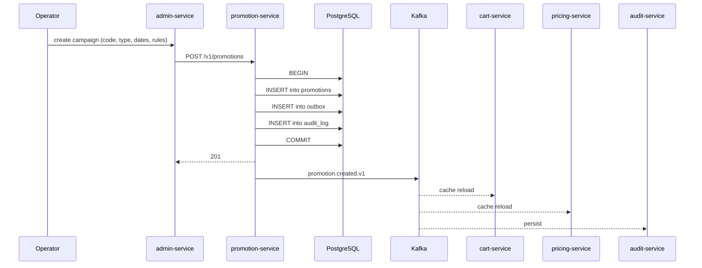
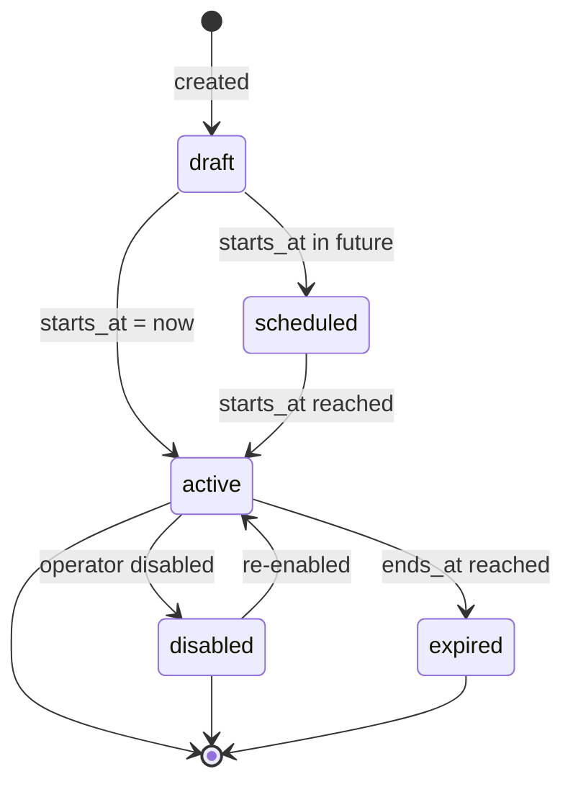
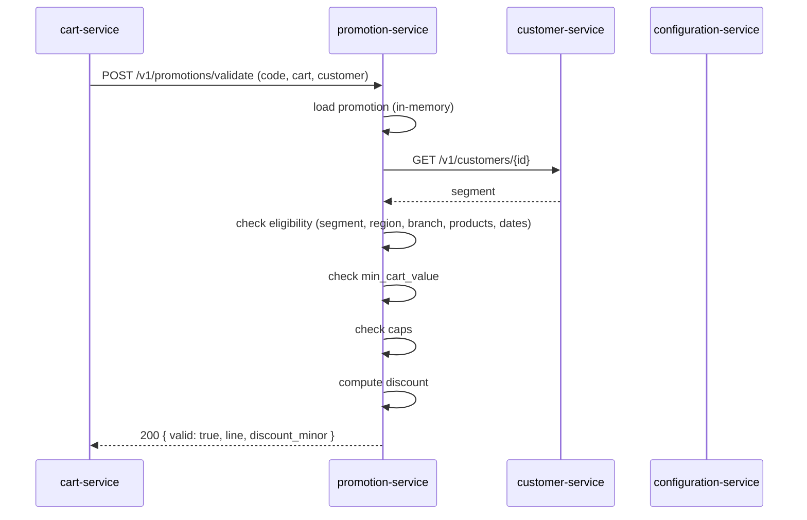
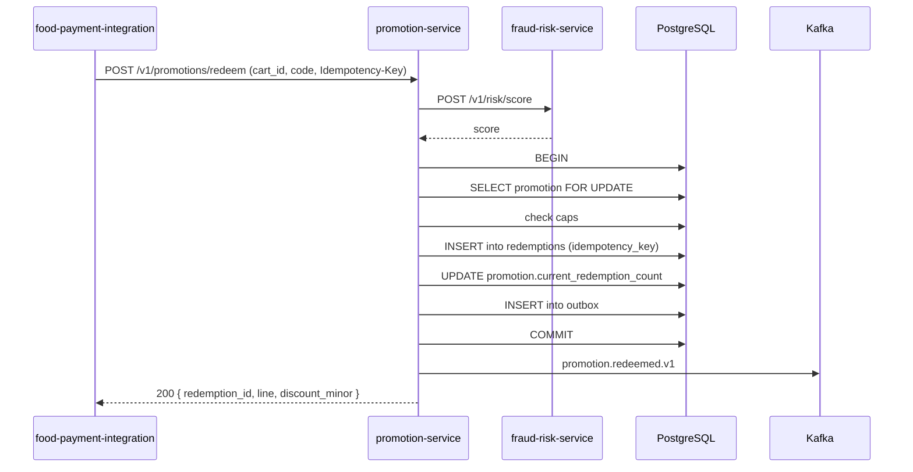
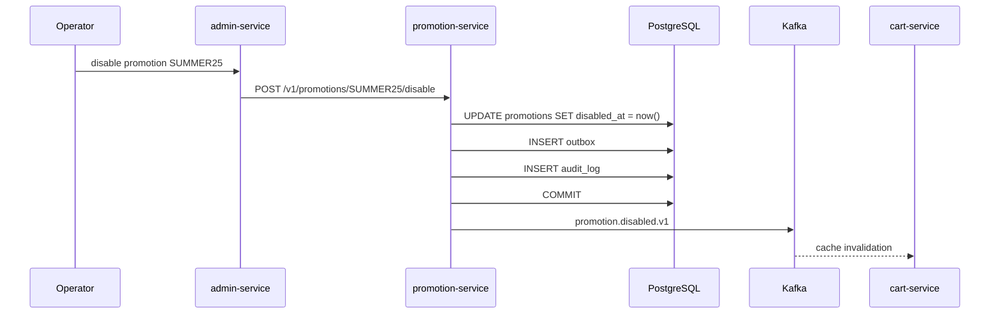

# Promotion Service — Workflows

## 1. Marketing Creates a Campaign

### 1.1 Objective

Create a new promotion that is live in < 60 seconds with full
attribution and audit.

### 1.2 Initiating Actor

Marketing / admin via the admin console.

### 1.3 Participating Services

- `admin-service`
- `promotion-service` (this service)
- `identity-service`
- `cart-service` (consumer)
- `pricing-service` (consumer)
- `audit-service` (consumer)
- Kafka

### 1.4 Prerequisites

- The marketing user holds `promotion.admin`.
- The `X-Audit-Reason` header is set.
- For large rollouts, `X-Signature` is set.

### 1.5 Happy Path



State machine for a `Promotion`:



### 1.6 Alternate Paths

- **Automatic discount**: `automatic: true`; no code required; the
  service still records the campaign in `promotions` and emits
  `promotion.created.v1`.
- **Stackable**: `stackable: true`; multiple stackable promotions
  may apply to the same cart.

### 1.7 Failure Paths

| Failure | Handling |
|---------|----------|
| Schema mismatch | 422 `VALIDATION_FAILED` with field-level `details[]` |
| Code already exists | 409 `PROMOTION_EXISTS` |
| `X-Audit-Reason` missing | 400 `AUDIT_REASON_REQUIRED` |
| Signature invalid (large rollout) | 403 `SIGNATURE_INVALID` |
| `starts_at >= ends_at` | 422 `VALIDATION_FAILED` |

### 1.8 Business Rules

- A promotion's `starts_at` MUST be < `ends_at`.
- A code MUST be unique per tenant.
- A campaign is live immediately if `starts_at` is in the past.

### 1.9 State Transitions

See state machine in §1.5.

### 1.10 Events

| Event | Direction | When |
|-------|-----------|------|
| `promotion.created.v1` | produced | commit |

### 1.11 APIs Involved

| API | Direction | When |
|-----|-----------|------|
| `POST /v1/promotions` | inbound | create |

### 1.12 Compensation / Rollback

If the campaign is wrong, the operator calls
`POST /v1/promotions/{code}/disable`. A new campaign can be created
to replace it.

### 1.13 Final State

The promotion is in `promotions` with `disabled_at IS NULL`; the
audit log has a `create` row; consumers have reloaded within 5
seconds.

## 2. Cart Validates a Code

### 2.1 Objective

When a customer applies a code in the cart, the service decides
whether the code is valid for the current cart / customer.

### 2.2 Initiating Actor

`cart-service` (system) on `POST /v1/carts/{id}/promotions`.

### 2.3 Participating Services

- `cart-service` (caller)
- `promotion-service`
- `customer-service` (segment)
- `configuration-service` (rules)

### 2.4 Prerequisites

- The cart has a `customer_id`, a `branch_id`, a `total_minor`, and
  a `currency`.
- The code is non-empty.

### 2.5 Happy Path



### 2.6 Alternate Paths

- **Promotion not started**: 409 `PROMOTION_NOT_STARTED`.
- **Promotion expired**: 410 `PROMOTION_EXPIRED`.
- **Promotion disabled**: 404 `PROMOTION_NOT_FOUND`.
- **Per-user cap reached**: 409 `PROMOTION_CAP_REACHED`.

### 2.7 Failure Paths

| Failure | Handling |
|---------|----------|
| Code not found | 404 `PROMOTION_NOT_FOUND` |
| Segment mismatch | 422 `PROMOTION_SEGMENT_INELIGIBLE` |
| Min cart value not met | 422 `PROMOTION_MIN_CART_VALUE` |
| Currency mismatch | 422 `PROMOTION_CURRENCY_MISMATCH` |
| Customer suspended | 403 `USER_SUSPENDED` |

### 2.8 Business Rules

- The rule engine evaluates conditions in order; the first match
  wins.
- A stackable promotion may apply alongside others of different
  types.

### 2.9 State Transitions

n/a (read-only).

### 2.10 Events

n/a (no event on validate).

### 2.11 APIs Involved

| API | Direction | When |
|-----|-----------|------|
| `POST /v1/promotions/validate` | inbound | every code apply |

### 2.12 Compensation / Rollback

If the cart is later abandoned, the discount is dropped; no
compensation needed.

### 2.13 Final State

The cart's total reflects the discount line item; the customer
sees the discounted total in the UI.

## 3. Cart Records a Redemption

### 3.1 Objective

When the order is captured, the service records the redemption
with idempotency so cart retries cannot double-redeem.

### 3.2 Initiating Actor

`food-payment-integration-service` (system) on payment capture, or
`cart-service` on a synchronous checkout flow.

### 3.3 Participating Services

- Caller service
- `promotion-service`
- `fraud-risk-service` (risk score)

### 3.4 Prerequisites

- The code was previously validated.
- The `Idempotency-Key` is provided.

### 3.5 Happy Path



### 3.6 Alternate Paths

- **Idempotent replay** (same key, same body): return the prior
  result.
- **Idempotency-Key reuse with different body**: 422
  `IDEMPOTENCY_KEY_REUSED`.

### 3.7 Failure Paths

| Failure | Handling |
|---------|----------|
| `Idempotency-Key` already used with same body | return 200 with prior result |
| `Idempotency-Key` already used with different body | 422 `IDEMPOTENCY_KEY_REUSED` |
| Fraud score high | 403 `PROMOTION_FRAUD_BLOCKED` |
| Cap reached | 409 `PROMOTION_CAP_REACHED` |
| Customer suspended | 403 `USER_SUSPENDED` |
| `fraud-risk-service` unreachable | default to `allow` with warning log |

### 3.8 Business Rules

- A redemption is recorded in the same DB transaction that returns
  success; partial writes are not allowed.
- A redemption increments the promotion's running total atomically.

### 3.9 State Transitions

n/a (the promotion's running total is incremented; no per-promotion
state change).

### 3.10 Events

| Event | Direction | When |
|-------|-----------|------|
| `promotion.redeemed.v1` | produced | every successful redemption |

### 3.11 APIs Involved

| API | Direction | When |
|-----|-----------|------|
| `POST /v1/promotions/redeem` | inbound | every capture |

### 3.12 Compensation / Rollback

If the order is refunded, the operator records a compensating
redemption (`result='fraud_blocked'` or a manual reversal) in
`redemptions` with a `compensates_id`; the running total is
decremented by a separate `promotion.reverse` event.

### 3.13 Final State

The redemption is in `redemptions`; the promotion's
`current_redemption_count` is incremented; the order's discount line
is set; the audit log has a `redemption` row.

## 4. Operator Disables a Promotion

### 4.1 Objective

Disable a promotion so it cannot be redeemed (e.g. due to abuse).

### 4.2 Initiating Actor

Operator (admin).

### 4.3 Participating Services

- `admin-service`
- `promotion-service`
- `cart-service` (consumer)
- `audit-service` (consumer)
- Kafka

### 4.4 Prerequisites

- The operator holds `promotion.admin`.
- The operator provides `X-Audit-Reason`.

### 4.5 Happy Path



### 4.6 Alternate Paths

- **Re-enable**: a separate `POST /v1/promotions/{code}/enable`
  reverses the disable.

### 4.7 Failure Paths

| Failure | Handling |
|---------|----------|
| Code not found | 404 `PROMOTION_NOT_FOUND` |
| `X-Audit-Reason` missing | 400 `AUDIT_REASON_REQUIRED` |

### 4.8 Business Rules

- A disabled promotion returns 404 on `GET /v1/promotions/{code}`.
- A disabled promotion returns 404 on validate/redeem.

### 4.9 State Transitions

`active` → `disabled`; on re-enable, `disabled` → `active`.

### 4.10 Events

| Event | Direction | When |
|-------|-----------|------|
| `promotion.disabled.v1` | produced | disable |

### 4.11 APIs Involved

| API | Direction | When |
|-----|-----------|------|
| `POST /v1/promotions/{code}/disable` | inbound | disable |

### 4.12 Compensation / Rollback

`POST /v1/promotions/{code}/enable` reverses.

### 4.13 Final State

The promotion is in `promotions` with `disabled_at IS NOT NULL`;
the audit log has a `disable` row; the consumer caches are
invalidated within 5 seconds.

## 99. `Monthly` Partition Maintenance`

### 99.1 Objective

Idempotently pre-create the next 12 month child partitions for `promotion.redemptions` + `promotion.audit_log` so an INSERT at any time lands in an existing child. The drop half is handled by the per-service retention job.

### 99.2 Initiating Actor

A scheduled job runs daily at `02:00 UTC`. Leader-elected via `pg_try_advisory_xact_lock(hashtext('promotion.partition'), hashtext('monthly'))`.

### 99.3 Happy Path

```mermaid
sequenceDiagram
    participant JOB as Partition job
    participant PG as PostgreSQL
    JOB->>PG: pg_try_advisory_xact_lock('promotion.monthly')
    alt lock acquired
        loop for each missing month in next 12
            JOB->>PG: CREATE TABLE IF NOT EXISTS promotion.table_month PARTITION OF promotion.table
            JOB->>PG: verify (pg_inherits, relpartbound)
        end
        JOB->>PG: assert now() in existing child
    else lock NOT acquired
        Note over JOB: another instance is running; exit cleanly
    end
```

### 99.4 Failure Paths

| Failure | Handling |
|---------|----------|
| Lock contention | exit 0 |
| DDL fails | retry 3× with backoff (1 s / 4 s / 16 s); page on-call |
| Today's child missing | critical alert; INSERTs would fail |

### 99.5 Business Rules

- Pre-create 12 complete future months.
- Every child is created with `CREATE TABLE IF NOT EXISTS … PARTITION OF …` so the job is safe to run twice in the same window.
- A verification step (`pg_inherits` parent + `relpartbound` range) runs after every `CREATE TABLE IF NOT EXISTS` because `IF NOT EXISTS` only guards the name, not the bounds.
- Optionally emit `audit.partition.maintained.v1` on success.

---

## See also

### Sibling docs for this service

- [`README.md`](./README.md) — purpose, bounded context, responsibilities
- [`BRD.md`](./BRD.md) — business requirements
- [`SRS.md`](./SRS.md) — functional + non-functional requirements
- [`ERD.md`](./ERD.md) — data model (entities, relationships)
- [`INTEGRATION.md`](./INTEGRATION.md) — inter-service contracts (APIs, events, sagas)
- [`WORKFLOWS.md`](./WORKFLOWS.md) — operational workflows (happy paths, failure modes)
- [`TECH.md`](./TECH.md) — technology profile (runtime, libraries, data layer, admin endpoints, RBAC)

### Platform-wide

- [`../../shared/README.md`](../../shared/README.md) — `platform-spring-boot-starter` shared library (the single source of cross-cutting code for all Spring Boot services in the platform)
- [`../RECOMMENDATIONS.md`](../RECOMMENDATIONS.md) — platform-wide technology map (language, framework, version baseline, admin/RBAC pattern)
- [`../../README.md`](../../README.md) — services overview (the catalog of all 58 services)
- [`../../../main.md`](../../../main.md) — top-level platform specification (architecture, Keycloak, PostgreSQL 18, messaging, observability baseline)

