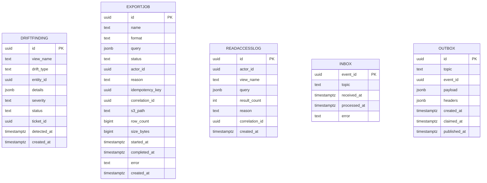

# Reporting Service — Entity-Relationship Diagram

## 1. Database

- Engine: PostgreSQL 18
- Schema: `reporting` (with sub-schemas per read model:
  `reporting_trips`, `reporting_orders`, `reporting_payments`, …)
- Migrations: `services/reporting-service/migrations/`

## 2. Cross-Service References

| Column | Type | Refers to | Source of truth |
|--------|------|-----------|------------------|
| read models' `customer_id`, `driver_id`, … | UUID | respective aggregate | respective service |

No DB FKs.

## 3. Entities

The schema has many sub-schemas. Below is a representative subset.

### `reporting_trips.trips`

Read model for trips.

#### Columns

| Column | Type | Constraints | Notes |
|--------|------|-------------|-------|
| `id` | UUID | PK | UUIDv7 |
| `customer_id` | UUID | NOT NULL | |
| `driver_id` | UUID | NULL | assigned later |
| `tenant_id` | TEXT | NOT NULL | |
| `city_id` | TEXT | NOT NULL | |
| `ride_type` | TEXT | NOT NULL | |
| `status` | TEXT | NOT NULL | |
| `total_minor` | BIGINT | NULL | |
| `currency` | TEXT | NULL | |
| `started_at` | TIMESTAMPTZ | NULL | |
| `completed_at` | TIMESTAMPTZ | NULL | |
| `cancelled_at` | TIMESTAMPTZ | NULL | |
| `last_event_at` | TIMESTAMPTZ | NOT NULL | for view lag |
| `last_event_id` | UUID | NOT NULL | for idempotency |
| `created_at` | TIMESTAMPTZ | NOT NULL DEFAULT now() | partition key |

#### Indexes

- PK on `id`
- Index on `(tenant_id, completed_at DESC)` when not null
- Index on `(status, completed_at DESC)`
- Index on `last_event_at` (view lag)

### `reporting_orders.orders`

Read model for food orders.

#### Columns

| Column | Type | Constraints | Notes |
|--------|------|-------------|-------|
| `id` | UUID | PK | UUIDv7 |
| `customer_id` | UUID | NOT NULL | |
| `branch_id` | UUID | NOT NULL | |
| `tenant_id` | TEXT | NOT NULL | |
| `status` | TEXT | NOT NULL | |
| `total_minor` | BIGINT | NULL | |
| `currency` | TEXT | NULL | |
| `placed_at` | TIMESTAMPTZ | NULL | |
| `delivered_at` | TIMESTAMPTZ | NULL | |
| `cancelled_at` | TIMESTAMPTZ | NULL | |
| `last_event_at` | TIMESTAMPTZ | NOT NULL | |
| `last_event_id` | UUID | NOT NULL | |
| `created_at` | TIMESTAMPTZ | NOT NULL DEFAULT now() | partition key |

### `reporting_payments.intents`

Read model for payment intents.

#### Columns

| Column | Type | Constraints | Notes |
|--------|------|-------------|-------|
| `id` | UUID | PK | UUIDv7 |
| `customer_id` | UUID | NOT NULL | |
| `tenant_id` | TEXT | NOT NULL | |
| `amount_minor` | BIGINT | NOT NULL | |
| `currency` | TEXT | NOT NULL | |
| `status` | TEXT | NOT NULL | |
| `authorized_at` | TIMESTAMPTZ | NULL | |
| `captured_at` | TIMESTAMPTZ | NULL | |
| `failed_at` | TIMESTAMPTZ | NULL | |
| `last_event_at` | TIMESTAMPTZ | NOT NULL | |
| `last_event_id` | UUID | NOT NULL | |
| `created_at` | TIMESTAMPTZ | NOT NULL DEFAULT now() | partition key |

### `reporting.DriftFinding`

A drift finding from a reconciliation job.

#### Columns

| Column | Type | Constraints | Notes |
|--------|------|-------------|-------|
| `id` | UUID | PK | UUIDv7 |
| `view_name` | TEXT | NOT NULL | |
| `drift_type` | TEXT | NOT NULL | `missing` / `extra` / `mismatch` |
| `entity_id` | UUID | NOT NULL | |
| `details` | JSONB | NOT NULL | |
| `severity` | TEXT | NOT NULL | `low` / `medium` / `high` / `critical` |
| `status` | TEXT | NOT NULL | `open` / `acknowledged` / `resolved` |
| `ticket_id` | UUID | NULL | support ticket |
| `detected_at` | TIMESTAMPTZ | NOT NULL DEFAULT now() | |
| `created_at` | TIMESTAMPTZ | NOT NULL DEFAULT now() | partition key |

#### Indexes

- PK on `id`
- Index on `(view_name, status, detected_at DESC)`
- Index on `severity` WHERE `status = 'open'`

#### Constraints

- CHECK: `drift_type IN ('missing','extra','mismatch')`
- CHECK: `severity IN ('low','medium','high','critical')`
- CHECK: `status IN ('open','acknowledged','resolved')`

### `reporting.ExportJob`

An export job.

#### Columns

| Column | Type | Constraints | Notes |
|--------|------|-------------|-------|
| `id` | UUID | PK | UUIDv7 |
| `name` | TEXT | NOT NULL | |
| `format` | TEXT | NOT NULL | `csv` / `parquet` |
| `query` | JSONB | NOT NULL | |
| `status` | TEXT | NOT NULL | `queued` / `running` / `succeeded` / `failed` |
| `actor_id` | UUID | NOT NULL | |
| `reason` | TEXT | NOT NULL | |
| `idempotency_key` | UUID | NULL | |
| `correlation_id` | UUID | NOT NULL | |
| `s3_path` | TEXT | NULL | |
| `row_count` | BIGINT | NULL | |
| `size_bytes` | BIGINT | NULL | |
| `started_at` | TIMESTAMPTZ | NULL | |
| `completed_at` | TIMESTAMPTZ | NULL | |
| `error` | TEXT | NULL | |
| `created_at` | TIMESTAMPTZ | NOT NULL DEFAULT now() | partition key |

#### Indexes

- PK on `id`
- UNIQUE on `(name, idempotency_key) WHERE idempotency_key IS NOT NULL`
- Index on `(status, created_at DESC)`

#### Constraints

- CHECK: `format IN ('csv','parquet')`
- CHECK: `status IN ('queued','running','succeeded','failed')`

### `reporting.ReadAccessLog`

Append-only log of every read access.

#### Columns

| Column | Type | Constraints | Notes |
|--------|------|-------------|-------|
| `id` | UUID | PK | UUIDv7 |
| `actor_id` | UUID | NOT NULL | |
| `view_name` | TEXT | NOT NULL | |
| `query` | JSONB | NOT NULL | |
| `result_count` | INT | NOT NULL | |
| `reason` | TEXT | NOT NULL | |
| `correlation_id` | UUID | NOT NULL | |
| `created_at` | TIMESTAMPTZ | NOT NULL DEFAULT now() | partition key |

### `reporting.Inbox`

Same shape.

### `reporting.Outbox`

Same shape.

## 4. Mermaid ER Diagram



(The read model tables per entity are omitted from the diagram
for brevity; they share the same shape as the source aggregate
plus the projection columns.)

## 5. DDL Sketch

```sql
CREATE SCHEMA IF NOT EXISTS reporting;
CREATE SCHEMA IF NOT EXISTS reporting_trips;
CREATE SCHEMA IF NOT EXISTS reporting_orders;
CREATE SCHEMA IF NOT EXISTS reporting_payments;

-- Representative: trips read model
CREATE TABLE reporting_trips.trips (
    id UUID PRIMARY KEY,
    customer_id UUID NOT NULL,
    driver_id UUID,
    tenant_id TEXT NOT NULL,
    city_id TEXT NOT NULL,
    ride_type TEXT NOT NULL,
    status TEXT NOT NULL,
    total_minor BIGINT,
    currency TEXT,
    started_at TIMESTAMPTZ,
    completed_at TIMESTAMPTZ,
    cancelled_at TIMESTAMPTZ,
    last_event_at TIMESTAMPTZ NOT NULL,
    last_event_id UUID NOT NULL,
    created_at TIMESTAMPTZ NOT NULL DEFAULT now()
) PARTITION BY RANGE (created_at);

CREATE INDEX idx_trips_tenant_completed
    ON reporting_trips.trips (tenant_id, completed_at DESC)
    WHERE completed_at IS NOT NULL;
CREATE INDEX idx_trips_status_completed
    ON reporting_trips.trips (status, completed_at DESC);
CREATE INDEX idx_trips_lag
    ON reporting_trips.trips (last_event_at);

-- Drift
CREATE TABLE reporting.drift_findings (
    id UUID PRIMARY KEY,
    view_name TEXT NOT NULL,
    drift_type TEXT NOT NULL
        CHECK (drift_type IN ('missing','extra','mismatch')),
    entity_id UUID NOT NULL,
    details JSONB NOT NULL,
    severity TEXT NOT NULL
        CHECK (severity IN ('low','medium','high','critical')),
    status TEXT NOT NULL
        CHECK (status IN ('open','acknowledged','resolved')),
    ticket_id UUID,
    detected_at TIMESTAMPTZ NOT NULL DEFAULT now(),
    created_at TIMESTAMPTZ NOT NULL DEFAULT now()
) PARTITION BY RANGE (created_at);

-- Idempotent pre-creation; safe to rerun as part of the maintenance job.
CREATE TABLE IF NOT EXISTS reporting.drift_findings_2026_07
    PARTITION OF reporting.drift_findings
    FOR VALUES FROM ('2026-07-01 00:00:00+00') TO ('2026-08-01 00:00:00+00');

CREATE INDEX idx_drift_view_status
    ON reporting.drift_findings (view_name, status, detected_at DESC);
CREATE INDEX idx_drift_open_severity
    ON reporting.drift_findings (severity)
    WHERE status = 'open';

-- Export
CREATE TABLE reporting.export_jobs (
    id UUID PRIMARY KEY,
    name TEXT NOT NULL,
    format TEXT NOT NULL
        CHECK (format IN ('csv','parquet')),
    query JSONB NOT NULL,
    status TEXT NOT NULL
        CHECK (status IN ('queued','running','succeeded','failed')),
    actor_id UUID NOT NULL,
    reason TEXT NOT NULL,
    idempotency_key UUID,
    correlation_id UUID NOT NULL,
    s3_path TEXT,
    row_count BIGINT,
    size_bytes BIGINT,
    started_at TIMESTAMPTZ,
    completed_at TIMESTAMPTZ,
    error TEXT,
    created_at TIMESTAMPTZ NOT NULL DEFAULT now()
) PARTITION BY RANGE (created_at);

-- Idempotent pre-creation; safe to rerun as part of the maintenance job.
CREATE TABLE IF NOT EXISTS reporting.export_jobs_2026_07
    PARTITION OF reporting.export_jobs
    FOR VALUES FROM ('2026-07-01 00:00:00+00') TO ('2026-08-01 00:00:00+00');

CREATE UNIQUE INDEX idx_export_idem
    ON reporting.export_jobs (name, idempotency_key)
    WHERE idempotency_key IS NOT NULL;
CREATE INDEX idx_export_status
    ON reporting.export_jobs (status, created_at DESC);

-- Read access log
CREATE TABLE reporting.read_access_log (
    id UUID PRIMARY KEY,
    actor_id UUID NOT NULL,
    view_name TEXT NOT NULL,
    query JSONB NOT NULL,
    result_count INT NOT NULL,
    reason TEXT NOT NULL,
    correlation_id UUID NOT NULL,
    created_at TIMESTAMPTZ NOT NULL DEFAULT now()
) PARTITION BY RANGE (created_at);

-- Idempotent pre-creation; safe to rerun as part of the maintenance job.
CREATE TABLE IF NOT EXISTS reporting.read_access_log_2026_07
    PARTITION OF reporting.read_access_log
    FOR VALUES FROM ('2026-07-01 00:00:00+00') TO ('2026-08-01 00:00:00+00');

REVOKE UPDATE, DELETE ON reporting.read_access_log FROM reporting_app;

-- Inbox / outbox
CREATE TABLE reporting.inbox (
    event_id UUID PRIMARY KEY,
    topic TEXT NOT NULL,
    received_at TIMESTAMPTZ NOT NULL DEFAULT now(),
    processed_at TIMESTAMPTZ,
    error TEXT
);

CREATE TABLE reporting.outbox (
    id UUID PRIMARY KEY,
    topic TEXT NOT NULL,
    event_id UUID NOT NULL,
    payload JSONB NOT NULL,
    headers JSONB,
    created_at TIMESTAMPTZ NOT NULL DEFAULT now(),
    claimed_at TIMESTAMPTZ,
    published_at TIMESTAMPTZ
);
```

## 6. Audit Columns

Read models have `created_at` only; no `updated_at` (they are
recomputed, not edited). `read_access_log` is append-only.

## 7. Soft Delete

n/a (read models are recomputed).

## 8. JSONB Usage

| Table.Column | What is stored | Justification |
|--------------|----------------|---------------|
| read models' per-entity columns | denormalized fields | queryable |
| `drift_findings.details` | diff details | triage |
| `export_jobs.query` | the export query | replay |
| `read_access_log.query` | the read query | audit |

## 9. Partitioning

- Read models partitioned by date (typically `created_at` or
  `completed_at`).
- `drift_findings`, `export_jobs`, `read_access_log` partitioned by
  month.

## 10. Data Retention

| Table | Retention | Purged by |
|-------|-----------|-----------|
| Read models | 2 years | monthly archival job |
| `drift_findings` | 7 years (financial) / 1 year (default) | monthly purge |
| `export_jobs` | 1 year | monthly purge |
| `read_access_log` | 1 year | monthly purge |
| `inbox` | 7 days | daily purge |
| `outbox` | 24 hours after `published_at` | hourly purge |

## 11. Migration Considerations

- Adding a new read model is a new sub-schema + projection code;
  no data migration.
- A read model rebuild is a `replay` from the event stream
  (idempotent).
- The `read_access_log` append-only constraint is enforced at the
  database grant level.

---

## See also

### Sibling docs for this service

- [`README.md`](./README.md) — purpose, bounded context, responsibilities
- [`BRD.md`](./BRD.md) — business requirements
- [`SRS.md`](./SRS.md) — functional + non-functional requirements
- [`ERD.md`](./ERD.md) — data model (entities, relationships)
- [`INTEGRATION.md`](./INTEGRATION.md) — inter-service contracts (APIs, events, sagas)
- [`WORKFLOWS.md`](./WORKFLOWS.md) — operational workflows (happy paths, failure modes)
- [`TECH.md`](./TECH.md) — technology profile (runtime, libraries, data layer, admin endpoints, RBAC)

### Platform-wide

- [`../../shared/README.md`](../../shared/README.md) — `platform-spring-boot-starter` shared library (the single source of cross-cutting code for all Spring Boot services in the platform)
- [`../RECOMMENDATIONS.md`](../RECOMMENDATIONS.md) — platform-wide technology map (language, framework, version baseline, admin/RBAC pattern)
- [`../../README.md`](../../README.md) — services overview (the catalog of all 58 services)
- [`../../../main.md`](../../../main.md) — top-level platform specification (architecture, Keycloak, PostgreSQL 18, messaging, observability baseline)

