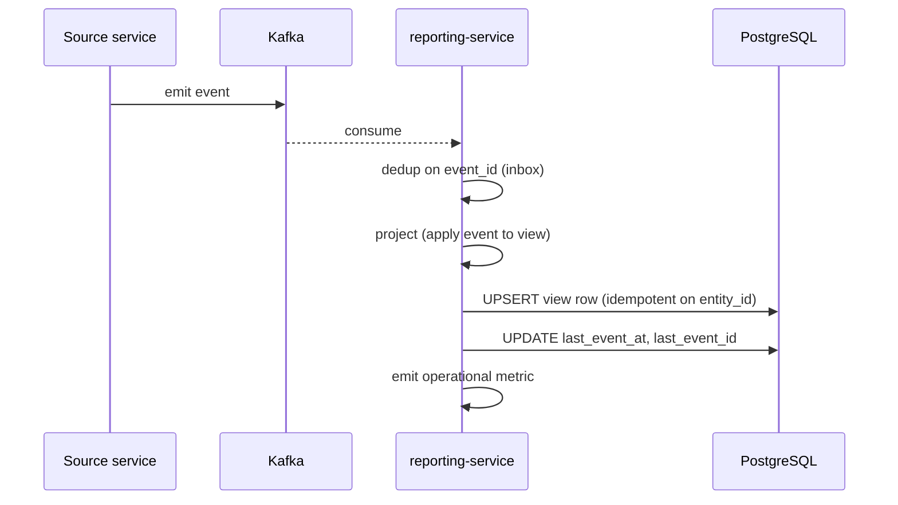
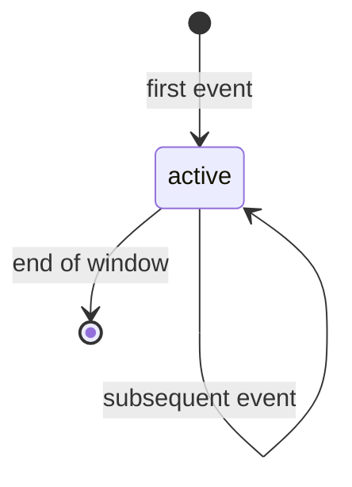
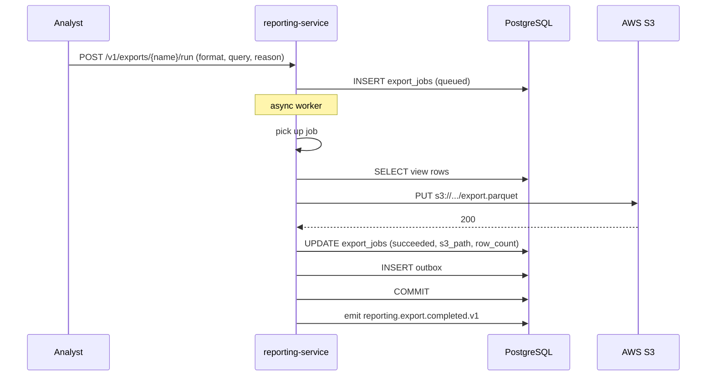
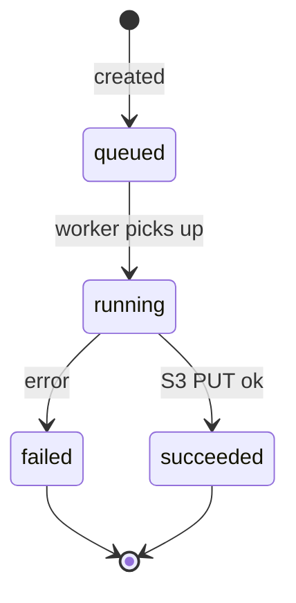
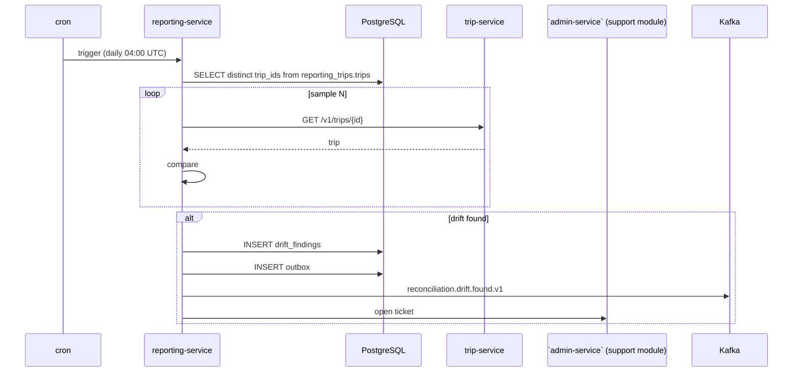
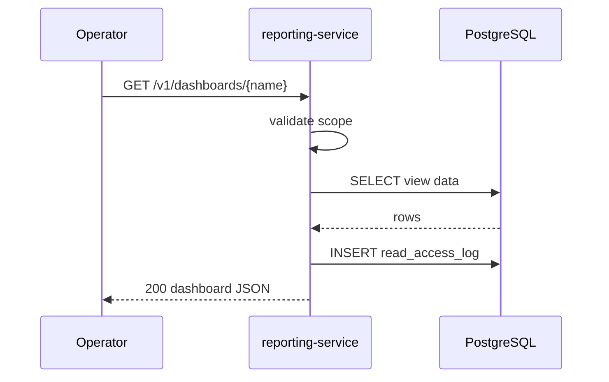

# Reporting Service — Workflows

## 1. Project an Event into a Read Model

### 1.1 Objective

When a domain event is consumed, update the relevant read model
idempotently within 5 minutes of the event's production.

### 1.2 Initiating Actor

Source service (system) via Kafka.

### 1.3 Participating Services

- Source service (producer)
- Kafka
- `reporting-service` (this service)
- `reporting_*` sub-schemas (read models)

### 1.4 Prerequisites

- The event is in the consumer's topic list.
- The read model schema is migrated.

### 1.5 Happy Path

State machine for a read model row:

### 1.6 Alternate Paths

- **Duplicate event** (inbox hit): no-op.
- **Out-of-order event**: the projection is order-insensitive (the
  row is the latest state).
- **Poison event**: DLQ.

### 1.7 Failure Paths

| Failure | Handling |
|---------|----------|
| Deserialize failure | DLQ |
| DB unavailable | retry with backoff; DLQ after 3 attempts |
| Projection error | alert; the event is DLQ'd; the view is marked `lagging` |

### 1.8 Business Rules

- A projection is idempotent on `event_id`.
- A read model is recomputable from the event stream.

### 1.9 State Transitions

n/a (read models are append / update only).

### 1.10 Events

| Event | Direction | When |
|-------|-----------|------|
| (source event) | consumed | every event |

### 1.11 APIs Involved

n/a (no inbound API on this path).

### 1.12 Compensation / Rollback

A view can be rebuilt from the event stream (`replay`).

### 1.13 Final State

The read model reflects the latest state of the aggregate; the
`last_event_at` is updated; the view lag is recorded.

## 2. Run an Export

### 2.1 Objective

A BI analyst runs an export to S3 in CSV or Parquet format.

### 2.2 Initiating Actor

BI analyst (admin).

### 2.3 Participating Services

- `reporting-service`
- AWS S3

### 2.4 Prerequisites

- The analyst holds `reporting.export.{name}`.
- The export query is defined.

### 2.5 Happy Path

State machine for an `ExportJob`:

### 2.6 Alternate Paths

- **Preview mode**: top 100 rows returned inline; no S3.
- **Idempotent replay**: same key + same body returns the prior
  job.

### 2.7 Failure Paths

| Failure | Handling |
|---------|----------|
| S3 unavailable | retry with backoff; alert after 3 attempts |
| Query error | job marked `failed`; error in `error` column |

### 2.8 Business Rules

- An export runs asynchronously.
- A duplicate run with the same `Idempotency-Key` returns the prior
  result.

### 2.9 State Transitions

See state machine in 2.5.

### 2.10 Events

| Event | Direction | When |
|-------|-----------|------|
| `reporting.export.completed.v1` | produced | export success |

### 2.11 APIs Involved

| API | Direction | When |
|-----|-----------|------|
| `POST /v1/exports/{name}/run` | inbound | run |
| `GET /v1/exports/{name}/status` | inbound | poll status |

### 2.12 Compensation / Rollback

A failed export can be retried (a new job).

### 2.13 Final State

The S3 object is written; the job is `succeeded`; the event is
emitted.

## 3. Run a Reconciliation

### 3.1 Objective

Compare a read model against the source service's state via API;
emit `reconciliation.drift.found.v1` on drift.

### 3.2 Initiating Actor

The daily cron job.

### 3.3 Participating Services

- `reporting-service`
- Source service (e.g. `trip-service`)
- ``admin-service` (support module)` (ticket creation)
- `admin-service` (drift alert)

### 3.4 Prerequisites

- The cron schedule is configured.
- The source service's API is available.

### 3.5 Happy Path

### 3.6 Alternate Paths

- **Source service unreachable**: reconciliation paused; alert.
- **Drift already open**: skip (the existing finding is updated
  with `last_seen_at`).

### 3.7 Failure Paths

| Failure | Handling |
|---------|----------|
| Source service unreachable | retry next day; alert |
| Drift threshold exceeded | critical alert |

### 3.8 Business Rules

- Reconciliation compares a sample (full scan is too expensive).
- A drift opens a `support.ticket` and emits an event.

### 3.9 State Transitions

A `DriftFinding` is `open` → `acknowledged` → `resolved`.

### 3.10 Events

| Event | Direction | When |
|-------|-----------|------|
| `reconciliation.drift.found.v1` | produced | drift detected |

### 3.11 APIs Involved

| API | Direction | When |
|-----|-----------|------|
| `GET /v1/trips/{id}` | outbound (sample) | reconcile |

### 3.12 Compensation / Rollback

A drift is not auto-repaired; an operator investigates.

### 3.13 Final State

The drift is recorded; the ticket is opened; the event is emitted;
the operator is alerted.

## 4. Read a Dashboard

### 4.1 Objective

An operator reads a dashboard.

### 4.2 Initiating Actor

Operator (admin).

### 4.3 Participating Services

- `reporting-service`

### 4.4 Prerequisites

- The operator holds the per-dashboard scope.

### 4.5 Happy Path

### 4.6 Alternate Paths

- **Insufficient scope**: 403 `FORBIDDEN`.
- **View lag exceeded**: 503 `VIEW_LAG_EXCEEDED`.

### 4.7 Failure Paths

| Failure | Handling |
|---------|----------|
| Insufficient scope | 403 `FORBIDDEN` |
| View lag | 503 `VIEW_LAG_EXCEEDED` (with retry-after) |

### 4.8 Business Rules

- Every read is logged.
- PII is masked in non-admin reads.

### 4.9 State Transitions

n/a (read-only).

### 4.10 Events

n/a (no event on read).

### 4.11 APIs Involved

| API | Direction | When |
|-----|-----------|------|
| `GET /v1/dashboards/{name}` | inbound | read |

### 4.12 Compensation / Rollback

n/a (read-only).

### 4.13 Final State

The operator has the dashboard; the read is logged.

---

## See also

### Sibling docs for this service

- [`README.md`](./README.md) — purpose, bounded context, responsibilities
- [`BRD.md`](./BRD.md) — business requirements
- [`SRS.md`](./SRS.md) — functional + non-functional requirements
- [`ERD.md`](./ERD.md) — data model (entities, relationships)
- [`INTEGRATION.md`](./INTEGRATION.md) — inter-service contracts (APIs, events, sagas)
- [`WORKFLOWS.md`](./WORKFLOWS.md) — operational workflows (happy paths, failure modes)
- [`TECH.md`](./TECH.md) — technology profile (runtime, libraries, data layer, admin endpoints, RBAC)

### Platform-wide

- [`../../shared/README.md`](../../shared/README.md) — `platform-spring-boot-starter` shared library (the single source of cross-cutting code for all Spring Boot services in the platform)
- [`../RECOMMENDATIONS.md`](../RECOMMENDATIONS.md) — platform-wide technology map (language, framework, version baseline, admin/RBAC pattern)
- [`../../README.md`](../../README.md) — services overview (the catalog of all 20 services)
- [`../../../main.md`](../../../main.md) — top-level platform specification (architecture, Keycloak, PostgreSQL 19, messaging, observability baseline)

