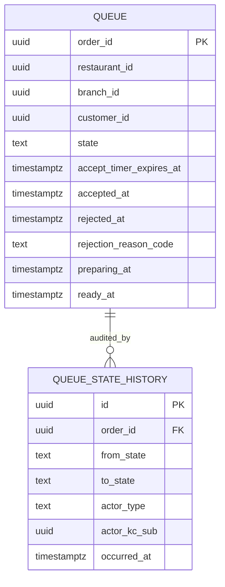

# restaurant-order-mgmt-service — Entity-Relationship Diagram

## 1. Database

- Engine: **PostgreSQL 18**.
- Schema: `restaurant_order_mgmt` (owned exclusively by this
  service).
- Migrations: `services/restaurant-order-mgmt-service/prisma/migrations/`.

## 2. Cross-Service References

| Column | Type | Refers to | Source of truth |
|--------|------|-----------|------------------|
| `queue.order_id` | UUID | Food order | `food-order-service` |
| `queue.restaurant_id` | UUID | Restaurant | `restaurant-service` |
| `queue.branch_id` | UUID | Branch | `branch-service` |
| `queue.customer_id` | UUID | Customer | `customer-service` |
| `queue.accepted_by_kc_sub` | UUID | Keycloak user | `identity-service` |
| `queue.rejected_by_kc_sub` | UUID | Keycloak user | `identity-service` |
| `queue.preparing_by_kc_sub` | UUID | Keycloak user | `identity-service` |
| `queue.ready_by_kc_sub` | UUID | Keycloak user | `identity-service` |

All cross-service references are stored as columns **without**
database-level foreign keys.

## 3. Entities

### `queue`

A queue item (one per food order).

#### Columns

| Column | Type | Constraints | Notes |
|--------|------|-------------|-------|
| `order_id` | UUID | PK | UUIDv7; the food order id |
| `restaurant_id` | UUID | NOT NULL | cross-service ref |
| `branch_id` | UUID | NOT NULL | cross-service ref |
| `customer_id` | UUID | NOT NULL | cross-service ref |
| `state` | TEXT | NOT NULL DEFAULT 'placed' CHECK in (...) | lifecycle |
| `accept_timer_expires_at` | TIMESTAMPTZ | NULL | when auto-reject fires |
| `accepted_at` | TIMESTAMPTZ | NULL | |
| `accepted_by_kc_sub` | UUID | NULL | |
| `rejected_at` | TIMESTAMPTZ | NULL | |
| `rejected_by_kc_sub` | UUID | NULL | |
| `rejection_reason_code` | TEXT | NULL | |
| `rejection_reason_text` | TEXT | NULL | |
| `preparing_at` | TIMESTAMPTZ | NULL | |
| `preparing_by_kc_sub` | UUID | NULL | |
| `ready_at` | TIMESTAMPTZ | NULL | |
| `ready_by_kc_sub` | UUID | NULL | |
| `cancelled_at` | TIMESTAMPTZ | NULL | set on `food.order.cancelled.v1` |
| `last_state_change_at` | TIMESTAMPTZ | NOT NULL DEFAULT now() | |
| `created_at` | TIMESTAMPTZ | NOT NULL DEFAULT now() | |

#### Indexes

- PK on `order_id`.
- Index on `(branch_id, state, last_state_change_at)`.
- Partial index on `(accept_timer_expires_at) WHERE state =
  'placed' AND accept_timer_expires_at IS NOT NULL` — auto-
  reject timer hot path.
- Index on `(state, last_state_change_at)`.

### `queue_state_history`

Append-only history of state transitions.

#### Columns

| Column | Type | Constraints | Notes |
|--------|------|-------------|-------|
| `id` | UUID | PK | UUIDv7 |
| `order_id` | UUID | NOT NULL, FK to `queue.order_id` | |
| `from_state` | TEXT | NULL | null for initial |
| `to_state` | TEXT | NOT NULL CHECK in (...) | |
| `actor_kc_sub` | UUID | NULL | null for system |
| `actor_type` | TEXT | NOT NULL CHECK in (...) | `manager`, `dispatcher`, `kitchen`, `system` |
| `reason_code` | TEXT | NULL | required for reject |
| `reason_text` | TEXT | NULL | |
| `correlation_id` | UUID | NOT NULL | |
| `occurred_at` | TIMESTAMPTZ | NOT NULL DEFAULT now() | |

#### Indexes

- PK on `id`.
- Index on `(order_id, occurred_at DESC)`.

### `outbox`

Transactional outbox for events.

#### Columns

| Column | Type | Constraints | Notes |
|--------|------|-------------|-------|
| `id` | UUID | PK | UUIDv7 |
| `aggregate_type` | TEXT | NOT NULL | `RestaurantOrderQueue` |
| `aggregate_id` | UUID | NOT NULL | partition key (order_id) |
| `event_name` | TEXT | NOT NULL | `food.order.*.v1` |
| `event_id` | UUID | NOT NULL UNIQUE | dedup |
| `payload` | JSONB | NOT NULL | envelope |
| `headers` | JSONB | NOT NULL DEFAULT '{}' | Kafka headers |
| `created_at` | TIMESTAMPTZ | NOT NULL DEFAULT now() | |
| `claimed_at` | TIMESTAMPTZ | NULL | poller-set |
| `published_at` | TIMESTAMPTZ | NULL | poller-set |

#### Indexes

- PK on `id`.
- Index on `(published_at NULLS FIRST, created_at)`.

### `inbox`

Consumer-side dedup.

#### Columns

| Column | Type | Constraints | Notes |
|--------|------|-------------|-------|
| `event_id` | UUID | PK | |
| `consumer` | TEXT | NOT NULL | |
| `received_at` | TIMESTAMPTZ | NOT NULL DEFAULT now() | |
| `processed_at` | TIMESTAMPTZ | NULL | |
| `error` | TEXT | NULL | |

## 4. Mermaid ER Diagram



## 5. DDL Sketch

```sql
CREATE SCHEMA IF NOT EXISTS restaurant_order_mgmt;

CREATE TABLE restaurant_order_mgmt.queue (
    order_id UUID PRIMARY KEY,
    restaurant_id UUID NOT NULL,
    branch_id UUID NOT NULL,
    customer_id UUID NOT NULL,
    state TEXT NOT NULL DEFAULT 'placed' CHECK (state IN
        ('placed','accepted','rejected','preparing','ready',
         'cancelled')),
    accept_timer_expires_at TIMESTAMPTZ,
    accepted_at TIMESTAMPTZ,
    accepted_by_kc_sub UUID,
    rejected_at TIMESTAMPTZ,
    rejected_by_kc_sub UUID,
    rejection_reason_code TEXT,
    rejection_reason_text TEXT,
    preparing_at TIMESTAMPTZ,
    preparing_by_kc_sub UUID,
    ready_at TIMESTAMPTZ,
    ready_by_kc_sub UUID,
    cancelled_at TIMESTAMPTZ,
    last_state_change_at TIMESTAMPTZ NOT NULL DEFAULT now(),
    created_at TIMESTAMPTZ NOT NULL DEFAULT now()
);

CREATE INDEX queue_branch_state_idx
    ON restaurant_order_mgmt.queue (branch_id, state, last_state_change_at);

CREATE INDEX queue_timer_idx
    ON restaurant_order_mgmt.queue (accept_timer_expires_at)
    WHERE state = 'placed' AND accept_timer_expires_at IS NOT NULL;

CREATE INDEX queue_state_idx
    ON restaurant_order_mgmt.queue (state, last_state_change_at);

CREATE TABLE restaurant_order_mgmt.queue_state_history (
    id UUID PRIMARY KEY,
    order_id UUID NOT NULL REFERENCES restaurant_order_mgmt.queue(order_id),
    from_state TEXT,
    to_state TEXT NOT NULL CHECK (to_state IN
        ('placed','accepted','rejected','preparing','ready',
         'cancelled')),
    actor_kc_sub UUID,
    actor_type TEXT NOT NULL CHECK (actor_type IN
        ('manager','dispatcher','kitchen','system')),
    reason_code TEXT,
    reason_text TEXT,
    correlation_id UUID NOT NULL,
    occurred_at TIMESTAMPTZ NOT NULL DEFAULT now()
);

CREATE INDEX queue_state_history_order_idx
    ON restaurant_order_mgmt.queue_state_history (order_id, occurred_at DESC);

CREATE TABLE restaurant_order_mgmt.outbox (
    id UUID PRIMARY KEY,
    aggregate_type TEXT NOT NULL,
    aggregate_id UUID NOT NULL,
    event_name TEXT NOT NULL,
    event_id UUID NOT NULL UNIQUE,
    payload JSONB NOT NULL,
    headers JSONB NOT NULL DEFAULT '{}'::jsonb,
    created_at TIMESTAMPTZ NOT NULL DEFAULT now(),
    claimed_at TIMESTAMPTZ,
    published_at TIMESTAMPTZ
);

CREATE INDEX outbox_pending_idx
    ON restaurant_order_mgmt.outbox (published_at NULLS FIRST, created_at);

CREATE TABLE restaurant_order_mgmt.inbox (
    event_id UUID PRIMARY KEY,
    consumer TEXT NOT NULL,
    received_at TIMESTAMPTZ NOT NULL DEFAULT now(),
    processed_at TIMESTAMPTZ,
    error TEXT
);
```

## 6. Audit Columns

`queue` has `last_state_change_at` and `created_at`. There is
no separate `updated_at`; state changes are tracked in
`queue_state_history`. The `outbox` events are the canonical
audit record.

## 7. Soft Delete

No soft delete. Queue items are short-lived and hard-deleted
after 7 days of terminal state.

## 8. JSONB Usage

`outbox.payload` and `outbox.headers` for the event envelope.
No other JSONB.

## 9. Partitioning

No partitioning. Queue items are short-lived and pruned
aggressively.

## 10. Data Retention

| Table | Retention | Purged by |
|-------|-----------|-----------|
| `queue` | 7 days after terminal state | scheduled job |
| `queue_state_history` | 7 years (audit) | hard delete with queue |
| `outbox` | 24 h after `published_at` | scheduled job |
| `inbox` | 30 days | scheduled job |

## 11. Migration Considerations

- Adding a new `state` value: forward-only migration; update
  the state machine; ensure consumers handle the new state.
- The auto-reject timer is a separate job that runs every
  minute and processes queue items with
  `state = 'placed' AND accept_timer_expires_at < now()`. The
  job uses a `SELECT ... FOR UPDATE SKIP LOCKED` to allow
  multiple replicas.
- The `queue` table is the operational view; the
  `food-order-service` is the source of truth for the order.
  The two are kept in sync via events; a reconciliation job
  in `reporting-service` detects drift (e.g. a queue item in
  `placed` but the food order is `cancelled`) and opens
  tickets.
- The `accept_timer_expires_at` is set on insert and is not
  reset on subsequent actions (the order can only be in
  `placed` until it is accepted or rejected).

---

## See also

### Sibling docs for this service

- [`README.md`](./README.md) — purpose, bounded context, responsibilities
- [`BRD.md`](./BRD.md) — business requirements
- [`SRS.md`](./SRS.md) — functional + non-functional requirements
- [`ERD.md`](./ERD.md) — data model (entities, relationships)
- [`INTEGRATION.md`](./INTEGRATION.md) — inter-service contracts (APIs, events, sagas)
- [`WORKFLOWS.md`](./WORKFLOWS.md) — operational workflows (happy paths, failure modes)
- [`TECH.md`](./TECH.md) — technology profile (runtime, libraries, data layer, admin endpoints, RBAC)

### Platform-wide

- [`../../shared/README.md`](../../shared/README.md) — `platform-spring-boot-starter` shared library (the single source of cross-cutting code for all Spring Boot services in the platform)
- [`../RECOMMENDATIONS.md`](../RECOMMENDATIONS.md) — platform-wide technology map (language, framework, version baseline, admin/RBAC pattern)
- [`../../README.md`](../../README.md) — services overview (the catalog of all 58 services)
- [`../../../main.md`](../../../main.md) — top-level platform specification (architecture, Keycloak, PostgreSQL 18, messaging, observability baseline)

